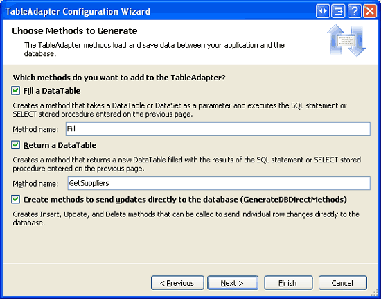
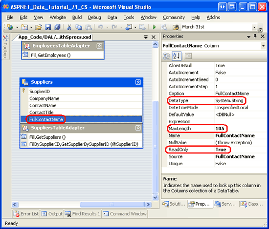
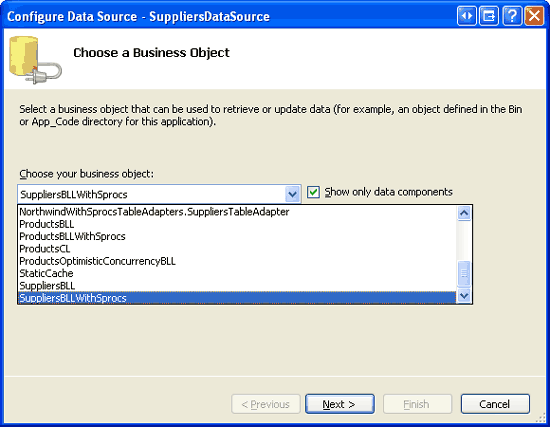
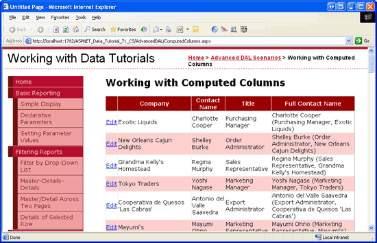

Working with Computed Columns (VB)
====================
by [Scott Mitchell](https://twitter.com/ScottOnWriting)

[Download Code](http://download.microsoft.com/download/3/9/f/39f92b37-e92e-4ab3-909e-b4ef23d01aa3/ASPNET_Data_Tutorial_71_VB.zip) or [Download PDF](working-with-computed-columns-vb/_static/datatutorial71vb1.pdf)

> When creating a database table, Microsoft SQL Server allows you to define a computed column whose value is calculated from an expression that usually references other values in the same database record. Such values are read-only at the database, which requires special considerations when working with TableAdapters. In this tutorial we learn how to meet the challenges posed by computed columns.

## Introduction

Microsoft SQL Server allows for *[computed columns](https://msdn.microsoft.com/en-us/library/ms191250.aspx)*, which are columns whose values are calculated from an expression that usually references the values from other columns in the same table. As an example, a time tracking data model might have a table named `ServiceLog` with columns including `ServicePerformed`, `EmployeeID`, `Rate`, and `Duration`, among others. While the amount due per service item (being the rate multiplied by the duration) could be calculated through a web page or other programmatic interface, it might be handy to include a column in the `ServiceLog` table named `AmountDue` that reported this information. This column could be created as a normal column, but it would need to be updated anytime the `Rate` or `Duration` column values changed. A better approach would be to make the `AmountDue` column a computed column using the expression `Rate * Duration`. Doing so would cause SQL Server to automatically calculate the `AmountDue` column value whenever it was referenced in a query.

Since a computed column s value is determined by an expression, such columns are read-only and therefore cannot have values assigned to them in `INSERT` or `UPDATE` statements. However, when computed columns are part of the main query for a TableAdapter that uses ad-hoc SQL statements, they are automatically included in the auto-generated `INSERT` and `UPDATE` statements. Consequently, the TableAdapter s `INSERT` and `UPDATE` queries and `InsertCommand` and `UpdateCommand` properties must be updated to remove references to any computed columns.

One challenge of using computed columns with a TableAdapter that uses ad-hoc SQL statements is that the TableAdapter s `INSERT` and `UPDATE` queries are automatically regenerated any time the TableAdapter Configuration wizard is completed. Therefore, the computed columns manually removed from the `INSERT` and `UPDATE` queries will reappear if the wizard is re-run. Although TableAdapters that use stored procedures don t suffer from this brittleness, they do have their own quirks that we will address in Step 3.

In this tutorial we will add a computed column to the `Suppliers` table in the Northwind database and then create a corresponding TableAdapter to work with this table and its computed column. We will have our TableAdapter use stored procedures instead of ad-hoc SQL statements so that our customizations aren t lost when the TableAdapter Configuration wizard is used.

Let s get started!

## Step 1: Adding a Computed Column to the`Suppliers`Table

The Northwind database does not have any computed columns so we will need to add one ourselves. For this tutorial let s add a computed column to the `Suppliers` table called `FullContactName` that returns the contact s name, title, and the company they work for in the following format: `ContactName` (`ContactTitle`, `CompanyName`). This computed column might be used in reports when displaying information about suppliers.

Start by opening the `Suppliers` table definition by right-clicking on the `Suppliers` table in the Server Explorer and choosing Open Table Definition from the context-menu. This will display the columns of the table and their properties, such as their data type, whether they allow `NULL` s, and so forth. To add a computed column, start by typing in the name of the column into the table definition. Next, enter its expression into the (Formula) textbox under the Computed Column Specification section in the Column Properties window (see Figure 1). Name the computed column `FullContactName` and use the following expression:

[!code-sql[Main](working-with-computed-columns-vb/samples/sample1.sql)]

Note that strings can be concatenated in SQL using the `+` operator. The `CASE` statement can be used like a conditional in a traditional programming language. In the above expression the `CASE` statement can be read as: If `ContactTitle` is not `NULL` then output the `ContactTitle` value concatenated with a comma, otherwise emit nothing. For more on the usefulness of the `CASE` statement, see [The Power of SQL `CASE` Statements](http://www.4guysfromrolla.com/webtech/102704-1.shtml).

> [!NOTE]
> Instead of using a `CASE` statement here, we could have alternatively used `ISNULL(ContactTitle, '')`. [`ISNULL(checkExpression, replacementValue)`](https://msdn.microsoft.com/en-us/library/ms184325.aspx) returns *checkExpression* if it is non-NULL, otherwise it returns *replacementValue*. While either `ISNULL` or `CASE` will work in this instance, there are more intricate scenarios where the flexibility of the `CASE` statement cannot be matched by `ISNULL`.

After adding this computed column your screen should look like the screen shot in Figure 1.

**Figure 1**: Add a Computed Column Named `FullContactName` to the `Suppliers` Table ([Click to view full-size image](working-with-computed-columns-vb/_static/image3.png))

After naming the computed column and entering its expression, save the changes to the table by clicking the Save icon in the toolbar, by hitting Ctrl+S, or by going to the File menu and choosing Save `Suppliers`.

Saving the table should refresh the Server Explorer, including the just-added column in the `Suppliers` table s column list. Furthermore, the expression entered into the (Formula) textbox will automatically adjust to an equivalent expression that strips unnecessary whitespace, surrounds column names with brackets (`[]`), and includes parentheses to more explicitly show the order of operations:

[!code-sql[Main](working-with-computed-columns-vb/samples/sample2.sql)]

For more information on computed columns in Microsoft SQL Server, refer to the [technical documentation](https://msdn.microsoft.com/en-us/library/ms191250.aspx). Also check out the [How to: Specify Computed Columns](https://msdn.microsoft.com/en-us/library/ms188300.aspx) for a step-by-step walkthrough of creating computed columns.

> [!NOTE]
> By default, computed columns are not physically stored in the table but are instead recalculated each time they are referenced in a query. By checking the Is Persisted checkbox, however, you can instruct SQL Server to physically store the computed column in the table. Doing so allows an index to be created on the computed column, which can improve the performance of queries that use the computed column value in their `WHERE` clauses. See [Creating Indexes on Computed Columns](https://msdn.microsoft.com/en-us/library/ms189292.aspx) for more information.

## Step 2: Viewing the Computed Column s Values

Before we start work on the Data Access Layer, let s take a minute to view the `FullContactName` values. From the Server Explorer, right-click on the `Suppliers` table name and choose New Query from the context-menu. This will bring up a Query window that prompts us to choose what tables to include in the query. Add the `Suppliers` table and click Close. Next, check the `CompanyName`, `ContactName`, `ContactTitle`, and `FullContactName` columns from the Suppliers table. Finally, click the red exclamation point icon in the Toolbar to execute the query and view the results.

As Figure 2 shows, the results include `FullContactName`, which lists the `CompanyName`, `ContactName`, and `ContactTitle` columns using the format `ContactName` (`ContactTitle`, `CompanyName`) .

**Figure 2**: The `FullContactName` Uses the Format `ContactName` (`ContactTitle`, `CompanyName`) ([Click to view full-size image](working-with-computed-columns-vb/_static/image6.png))

## Step 3: Adding the`SuppliersTableAdapter`to the Data Access Layer

In order to work with the supplier information in our application we need to first create a TableAdapter and DataTable in our DAL. Ideally, this would be accomplished using the same straightforward steps examined in earlier tutorials. However, working with computed columns introduces a few wrinkles that merit discussion.

If you are using a TableAdapter that uses ad-hoc SQL statements, you can simply include the computed column in the TableAdapter s main query via the TableAdapter Configuration wizard. This, however, will auto-generate `INSERT` and `UPDATE` statements that include the computed column. If you attempt to execute one of these methods, a `SqlException` with the message The column *ColumnName* cannot be modified because it is either a computed column or is the result of a UNION operator will be thrown. While the `INSERT` and `UPDATE` statement can be manually adjusted through the TableAdapter s `InsertCommand` and `UpdateCommand` properties, these customizations will be lost whenever the TableAdapter Configuration wizard is re-run.

Due to the brittleness of TableAdapters that use ad-hoc SQL statements, it is recommended that we use stored procedures when working with computed columns. If you are using existing stored procedures, simply configure the TableAdapter as discussed in the [Using Existing Stored Procedures for the Typed DataSet s TableAdapters](using-existing-stored-procedures-for-the-typed-dataset-s-tableadapters-vb.md) tutorial. If you have the TableAdapter wizard create the stored procedures for you, however, it is important to initially omit any computed columns from the main query. If you include a computed column in the main query, the TableAdapter Configuration wizard will inform you, upon completion, that it cannot create the corresponding stored procedures. In short, we need to initially configure the TableAdapter using a computed column-free main query and then manually update the corresponding stored procedure and the TableAdapter s `SelectCommand` to include the computed column. This approach is similar to the one used in the [Updating the TableAdapter to Use](updating-the-tableadapter-to-use-joins-vb.md)`JOIN`*s* tutorial.

For this tutorial, let s add a new TableAdapter and have it automatically create the stored procedures for us. Consequently, we will need to initially omit the `FullContactName` computed column from the main query.

Start by opening the `NorthwindWithSprocs` DataSet in the `~/App_Code/DAL` folder. Right-click in the Designer and, from the context-menu, choose to add a new TableAdapter. This will launch the TableAdapter Configuration wizard. Specify the database to query data from (`NORTHWNDConnectionString` from `Web.config`) and click Next. Since we have not yet created any stored procedures for querying or modifying the `Suppliers` table, select the Create new stored procedures option so that the wizard will create them for us and click Next.

**Figure 3**: Choose the Create new stored procedures Option ([Click to view full-size image](working-with-computed-columns-vb/_static/image9.png))

The subsequent step prompts us for the main query. Enter the following query, which returns the `SupplierID`, `CompanyName`, `ContactName`, and `ContactTitle` columns for each supplier. Note that this query purposefully omits the computed column (`FullContactName`); we will update the corresponding stored procedure to include this column in Step 4.

[!code-sql[Main](working-with-computed-columns-vb/samples/sample3.sql)]

After entering the main query and clicking Next, the wizard allows us to name the four stored procedures it will generate. Name these stored procedures `Suppliers_Select`, `Suppliers_Insert`, `Suppliers_Update`, and `Suppliers_Delete`, as Figure 4 illustrates.

**Figure 4**: Customize the Names of the Auto-Generated Stored Procedures ([Click to view full-size image](working-with-computed-columns-vb/_static/image12.png))

The next wizard step allows us to name the TableAdapter s methods and specify the patterns used to access and update data. Leave all three checkboxes checked, but rename the `GetData` method to `GetSuppliers`. Click Finish to complete the wizard.

**Figure 5**: Rename the `GetData` Method to `GetSuppliers` ([Click to view full-size image](working-with-computed-columns-vb/_static/image15.png))

Upon clicking Finish, the wizard will create the four stored procedures and add the TableAdapter and corresponding DataTable to the Typed DataSet.

## Step 4: Including the Computed Column in the TableAdapter s Main Query

We now need to update the TableAdapter and DataTable created in Step 3 to include the `FullContactName` computed column. This involves two steps:

1. Updating the `Suppliers_Select` stored procedure to return the `FullContactName` computed column, and
2. Updating the DataTable to include a corresponding `FullContactName` column.

Start by navigating to the Server Explorer and drilling down into the Stored Procedures folder. Open the `Suppliers_Select` stored procedure and update the `SELECT` query to include the `FullContactName` computed column:

[!code-sql[Main](working-with-computed-columns-vb/samples/sample4.sql)]

Save the changes to the stored procedure by clicking the Save icon in the Toolbar, by hitting Ctrl+S, or by choosing the Save `Suppliers_Select` option from the File menu.

Next, return to the DataSet Designer, right-click on the `SuppliersTableAdapter`, and choose Configure from the context-menu. Note that the `Suppliers_Select` column now includes the `FullContactName` column in its Data Columns collection.

**Figure 6**: Run the TableAdapter s Configuration Wizard to Update the DataTable s Columns ([Click to view full-size image](working-with-computed-columns-vb/_static/image18.png))

Click Finish to complete the wizard. This will automatically add a corresponding column to the `SuppliersDataTable`. The TableAdapter wizard is smart enough to detect that the `FullContactName` column is a computed column and therefore read-only. Consequently, it sets the column s `ReadOnly` property to `true`. To verify this, select the column from the `SuppliersDataTable` and then go to the Properties window (see Figure 7). Note that the `FullContactName` column s `DataType` and `MaxLength` properties are also set accordingly.

**Figure 7**: The `FullContactName` Column is Marked as Read-Only ([Click to view full-size image](working-with-computed-columns-vb/_static/image21.png))

## Step 5: Adding a`GetSupplierBySupplierID`Method to the TableAdapter

For this tutorial we will create an ASP.NET page that displays the suppliers in an updateable grid. In past tutorials we have updated a single record from the Business Logic Layer by retrieving that particular record from the DAL as a strongly-typed DataTable, updating its properties, and then sending the updated DataTable back to the DAL to propagate the changes to the database. To accomplish this first step - retrieving the record being updated from the DAL - we need to first add a `GetSupplierBySupplierID(supplierID)` method to the DAL.

Right-click on the `SuppliersTableAdapter` in the DataSet Design and choose the Add Query option from the context-menu. As we did in Step 3, let the wizard generate a new stored procedure for us by selecting the Create new stored procedure option (refer back to Figure 3 for a screenshot of this wizard step). Since this method will return a record with multiple columns, indicate that we want to use a SQL query that is a SELECT which returns rows and click Next.

**Figure 8**: Choose the SELECT which returns rows Option ([Click to view full-size image](working-with-computed-columns-vb/_static/image24.png))

The subsequent step prompts us for the query to use for this method. Enter the following, which returns the same data fields as the main query but for a particular supplier.

[!code-sql[Main](working-with-computed-columns-vb/samples/sample5.sql)]

The next screen asks us to name the stored procedure that will be auto-generated. Name this stored procedure `Suppliers_SelectBySupplierID` and click Next.

**Figure 9**: Name the Stored Procedure `Suppliers_SelectBySupplierID` ([Click to view full-size image](working-with-computed-columns-vb/_static/image27.png))

Lastly, the wizard prompts us for the data access patterns and method names to use for the TableAdapter. Leave both checkboxes checked, but rename the `FillBy` and `GetDataBy` methods to `FillBySupplierID` and `GetSupplierBySupplierID`, respectively.

**Figure 10**: Name the TableAdapter Methods `FillBySupplierID` and `GetSupplierBySupplierID` ([Click to view full-size image](working-with-computed-columns-vb/_static/image30.png))

Click Finish to complete the wizard.

## Step 6: Creating the Business Logic Layer

Before we create an ASP.NET page that uses the computed column created in Step 1, we first need to add the corresponding methods in the BLL. Our ASP.NET page, which we will create in Step 7, will allow users to view and edit suppliers. Therefore, we need our BLL to provide, at minimum, a method to get all of the suppliers and another to update a particular supplier.

Create a new class file named `SuppliersBLLWithSprocs` in the `~/App_Code/BLL` folder and add the following code:

[!code-vb[Main](working-with-computed-columns-vb/samples/sample6.vb)]

Like the other BLL classes, `SuppliersBLLWithSprocs` has a `Protected` `Adapter` property that returns an instance of the `SuppliersTableAdapter` class along with two `Public` methods: `GetSuppliers` and `UpdateSupplier`. The `GetSuppliers` method calls and returns the `SuppliersDataTable` returned by the corresponding `GetSupplier` method in the Data Access Layer. The `UpdateSupplier` method retrieves information about the particular supplier being updated via a call to the DAL s `GetSupplierBySupplierID(supplierID)` method. It then updates the `CategoryName`, `ContactName`, and `ContactTitle` properties and commits these changes to the database by calling the Data Access Layer s `Update` method, passing in the modified `SuppliersRow` object.

> [!NOTE]
> Except for `SupplierID` and `CompanyName`, all columns in the Suppliers table allow `NULL` values. Therefore, if the passed-in `contactName` or `contactTitle` parameters are `Nothing` we need to set the corresponding `ContactName` and `ContactTitle` properties to a `NULL` database value using the `SetContactNameNull` and `SetContactTitleNull` methods, respectively.

## Step 7: Working with the Computed Column from the Presentation Layer

With the computed column added to the `Suppliers` table and the DAL and BLL updated accordingly, we are ready to build an ASP.NET page that works with the `FullContactName` computed column. Start by opening the `ComputedColumns.aspx` page in the `AdvancedDAL` folder and drag a GridView from the Toolbox onto the Designer. Set the GridView s `ID` property to `Suppliers` and, from its smart tag, bind it to a new ObjectDataSource named `SuppliersDataSource`. Configure the ObjectDataSource to use the `SuppliersBLLWithSprocs` class we added back in Step 6 and click Next.

**Figure 11**: Configure the ObjectDataSource to Use the `SuppliersBLLWithSprocs` Class ([Click to view full-size image](working-with-computed-columns-vb/_static/image33.png))

There are only two methods defined in the `SuppliersBLLWithSprocs` class: `GetSuppliers` and `UpdateSupplier`. Ensure that these two methods are specified in the SELECT and UPDATE tabs, respectively, and click Finish to complete the configuration of the ObjectDataSource.

Upon completion of the Data Source Configuration wizard, Visual Studio will add a BoundField for each of the data fields returned. Remove the `SupplierID` BoundField and change the `HeaderText` properties of the `CompanyName`, `ContactName`, `ContactTitle`, and `FullContactName` BoundFields to Company, Contact Name, Title, and Full Contact Name, respectively. From the smart tag, check the Enable Editing checkbox to turn on the GridView s built-in editing capabilities.

In addition to adding BoundFields to the GridView, completion of the Data Source Wizard also causes Visual Studio to set the ObjectDataSource s `OldValuesParameterFormatString` property to original\_{0}. Revert this setting back to its default value, {0} .

After making these edits to the GridView and ObjectDataSource, their declarative markup should look similar to the following:

[!code-aspx[Main](working-with-computed-columns-vb/samples/sample7.aspx)]

Next, visit this page through a browser. As Figure 12 shows, each supplier is listed in a grid that includes the `FullContactName` column, whose value is simply the concatenation of the other three columns formatted as `ContactName` (`ContactTitle`, `CompanyName`) .

**Figure 12**: Each Supplier is Listed in the Grid ([Click to view full-size image](working-with-computed-columns-vb/_static/image36.png))

Clicking the Edit button for a particular supplier causes a postback and has that row rendered in its editing interface (see Figure 13). The first three columns render in their default editing interface - a TextBox control whose `Text` property is set to the value of the data field. The `FullContactName` column, however, remains as text. When the BoundFields were added to the GridView at the completion of the Data Source Configuration wizard, the `FullContactName` BoundField s `ReadOnly` property was set to `True` because the corresponding `FullContactName` column in the `SuppliersDataTable` has its `ReadOnly` property set to `True`. As noted in Step 4, the `FullContactName` s `ReadOnly` property was set to `True` because the TableAdapter detected that the column was a computed column.

**Figure 13**: The `FullContactName` Column is Not Editable ([Click to view full-size image](working-with-computed-columns-vb/_static/image39.png))

Go ahead and update the value of one or more of the editable columns and click Update. Note how the `FullContactName` s value is automatically updated to reflect the change.

> [!NOTE]
> The GridView currently uses BoundFields for the editable fields, resulting in the default editing interface. Since the `CompanyName` field is required, it should be converted into a TemplateField that includes a RequiredFieldValidator. I leave this as an exercise for the interested reader. Consult the [Adding Validation Controls to the Editing and Inserting Interfaces](../editing-inserting-and-deleting-data/adding-validation-controls-to-the-editing-and-inserting-interfaces-vb.md) tutorial for step-by-step instructions on converting a BoundField to a TemplateField and adding validation controls.

## Summary

When defining the schema for a table, Microsoft SQL Server allows the inclusion of computed columns. These are columns whose values are calculated from an expression that usually references the values from other columns in the same record. Since the values for computed columns are based on an expression, they are read-only and cannot be assigned a value in an `INSERT` or `UPDATE` statement. This introduces challenges when using a computed column in the main query of a TableAdapter that tries to automatically generate corresponding `INSERT`, `UPDATE`, and `DELETE` statements.

In this tutorial we discussed techniques for circumventing the challenges posed by computed columns. In particular, we used stored procedures in our TableAdapter to overcome the brittleness inherent in TableAdapters that use ad-hoc SQL statements. When having the TableAdapter wizard create new stored procedures, it is important that we have the main query initially omit any computed columns because their presence prevents the data modification stored procedures from being generated. After the TableAdapter has been initially configured, its `SelectCommand` stored procedure can be retooled to include any computed columns.

Happy Programming!

## About the Author

[Scott Mitchell](http://www.4guysfromrolla.com/ScottMitchell.shtml), author of seven ASP/ASP.NET books and founder of [4GuysFromRolla.com](http://www.4guysfromrolla.com), has been working with Microsoft Web technologies since 1998. Scott works as an independent consultant, trainer, and writer. His latest book is [*Sams Teach Yourself ASP.NET 2.0 in 24 Hours*](https://www.amazon.com/exec/obidos/ASIN/0672327384/4guysfromrollaco). He can be reached at [mitchell@4GuysFromRolla.com.](mailto:mitchell@4GuysFromRolla.com) or via his blog, which can be found at [http://ScottOnWriting.NET](http://ScottOnWriting.NET).

## Special Thanks To

This tutorial series was reviewed by many helpful reviewers. Lead reviewers for this tutorial were Hilton Geisenow and Teresa Murphy. Interested in reviewing my upcoming MSDN articles? If so, drop me a line at [mitchell@4GuysFromRolla.com.](mailto:mitchell@4GuysFromRolla.com)

>[!div class="step-by-step"]
[Previous](adding-additional-datatable-columns-vb.md)
[Next](configuring-the-data-access-layer-s-connection-and-command-level-settings-vb.md)