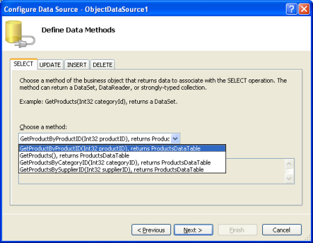
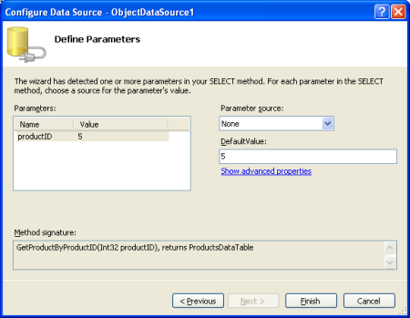
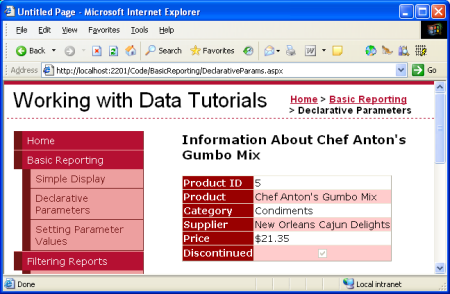
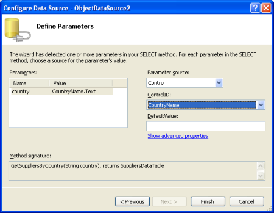
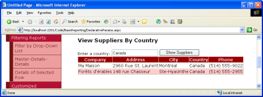

Declarative Parameters (C#)
====================
by [Scott Mitchell](https://twitter.com/ScottOnWriting)

[Download Sample App](http://download.microsoft.com/download/4/6/3/463cf87c-4724-4cbc-b7b5-3f866f43ba50/ASPNET_Data_Tutorial_5_CS.exe) or [Download PDF](declarative-parameters-cs/_static/datatutorial05cs1.pdf)

> In this tutorial we'll illustrate how to use a parameter set to a hard-coded value to select the data to display in a DetailsView control.

## Introduction

In the [last tutorial](displaying-data-with-the-objectdatasource-cs.md) we looked at displaying data with the GridView, DetailsView, and FormView controls bound to an ObjectDataSource control that invoked the `GetProducts()` method from the `ProductsBLL` class. The `GetProducts()` method returns a strongly-typed DataTable populated with all of the records from the Northwind database's `Products` table. The `ProductsBLL` class contains additional methods for returning just subsets of the products - `GetProductByProductID(productID)`, `GetProductsByCategoryID(categoryID)`, and `GetProductsBySupplierID(supplierID)`. These three methods expect an input parameter indicating how to filter the returned product information.

The ObjectDataSource can be used to invoke methods that expect input parameters, but in order to do so we must specify where the values for these parameters come from. The parameter values can be hard-coded or can come from a variety of dynamic sources, including: querystring values, Session variables, the property value of a Web control on the page, or others.

For this tutorial let's start by illustrating how to use a parameter set to a hard-coded value. Specifically, we'll look at adding a DetailsView to the page that displays information about a specific product, namely Chef Anton's Gumbo Mix, which has a `ProductID` of 5. Next, we'll see how to set the parameter value based on a Web control. In particular, we'll use a TextBox to let the user type in a country, after which they can click a Button to see the list of suppliers that reside in that country.

## Using a Hard-Coded Parameter Value

For the first example, start by adding a DetailsView control to the `DeclarativeParams.aspx` page in the `BasicReporting` folder. From the DetailsView's smart tag, select &lt;New data source&gt; from the drop-down list and choose to add an ObjectDataSource.

**Figure 1**: Add an ObjectDataSource to the Page ([Click to view full-size image](declarative-parameters-cs/_static/image3.png))

This will automatically start the ObjectDataSource control's Choose Data Source wizard. Select the `ProductsBLL` class from the first screen of the wizard.

**Figure 2**: Select the `ProductsBLL` Class ([Click to view full-size image](declarative-parameters-cs/_static/image6.png))

Since we want to display information about a particular product we want to use the `GetProductByProductID(productID)` method.

**Figure 3**: Choose the `GetProductByProductID(productID)` method ([Click to view full-size image](declarative-parameters-cs/_static/image9.png))

Since the method we selected includes a parameter, there's one more screen for the wizard, where we're asked to define the value to be used for the parameter. The list on the left shows all of the parameters for the selected method. For `GetProductByProductID(productID)` there's only one `productID`. On the right we can specify the value for the selected parameter. The parameter source drop-down list enumerates the various possible sources for the parameter value. Since we want to specify a hard-coded value of 5 for the `productID` parameter, leave the Parameter source as None and enter 5 into the DefaultValue textbox.

**Figure 4**: A Hard-Coded Parameter Value of 5 Will Be Used for the `productID` Parameter ([Click to view full-size image](declarative-parameters-cs/_static/image12.png))

After completing the Configure Data Source wizard, the ObjectDataSource control's declarative markup includes a `Parameter` object in the `SelectParameters` collection for each of the input parameters expected by the method defined in the `SelectMethod` property. Since the method we're using in this example expects just a single input parameter, `parameterID`, there's only one entry here. The `SelectParameters` collection can contain any class that derives from the `Parameter` class in the `System.Web.UI.WebControls` namespace. For hard-coded parameter values the base `Parameter` class is used, but for the other parameter source options a derived `Parameter` class is used; you can also create your own [custom parameter types](http://www.leftslipper.com/ShowFaq.aspx?FaqId=11), if needed.

[!code-aspx[Main](declarative-parameters-cs/samples/sample1.aspx)]

> [!NOTE]
> If you're following along on your own computer the declarative markup you see at this point may include values for the `InsertMethod`, `UpdateMethod`, and `DeleteMethod` properties, as well as `DeleteParameters`. The ObjectDataSource's Choose Data Source wizard automatically specifies the methods from the `ProductBLL` to use for inserting, updating, and deleting, so unless you explicitly cleared those out, they'll be included in the markup above.

When visiting this page, the data Web control will invoke the ObjectDataSource's `Select` method, which will call the `ProductsBLL` class's `GetProductByProductID(productID)` method using the hard-coded value of 5 for the `productID` input parameter. The method will return a strongly-typed `ProductDataTable` object that contains a single row with information about Chef Anton's Gumbo Mix (the product with `ProductID` 5).

**Figure 5**: Information About Chef Anton's Gumbo Mix are Displayed ([Click to view full-size image](declarative-parameters-cs/_static/image15.png))

## Setting the Parameter Value to the Property Value of a Web Control

The ObjectDataSource's parameter values can also be set based on the value of a Web control on the page. To illustrate this, let's have a GridView that lists all of the suppliers that are located in a country specified by the user. To accomplish this start by adding a TextBox to the page into which the user can enter a country name. Set this TextBox control's `ID` property to `CountryName`. Also add a Button Web control.

**Figure 6**: Add a TextBox to the Page with `ID` `CountryName` ([Click to view full-size image](declarative-parameters-cs/_static/image18.png))

Next, add a GridView to the page and, from the smart tag, choose to add a new ObjectDataSource. Since we want to display supplier information select the `SuppliersBLL` class from the wizard's first screen. From the second screen, pick the `GetSuppliersByCountry(country)` method.

**Figure 7**: Choose the `GetSuppliersByCountry(country)` Method ([Click to view full-size image](declarative-parameters-cs/_static/image21.png))

Since the `GetSuppliersByCountry(country)` method has an input parameter, the wizard once again includes a final screen for choosing the parameter value. This time, set the Parameter source to Control. This will populate the ControlID drop-down list with the names of the controls on the page; select the `CountryName` control from the list. When the page is first visited the `CountryName` TextBox will be blank, so no results are returned and nothing is displayed. If you want to display some results by default, set the DefaultValue textbox accordingly.

**Figure 8**: Set the Parameter Value to the `CountryName` Control Value ([Click to view full-size image](declarative-parameters-cs/_static/image24.png))

The ObjectDataSource's declarative markup differs slightly from our first example, using a [ControlParameter](https://msdn.microsoft.com/en-us/library/system.web.ui.webcontrols.controlparameter.aspx) instead of the standard `Parameter` object. A `ControlParameter` has additional properties to specify the `ID` of the Web control and the property value to use for the parameter (`PropertyName`). The Configure Data Source wizard was smart enough to determine that, for a TextBox, we'll likely want to use the `Text` property for the parameter value. If, however, you want to use a different property value from the Web control you can change the `PropertyName` value here or by clicking the "Show advanced properties" link in the wizard.

[!code-aspx[Main](declarative-parameters-cs/samples/sample2.aspx)]

When visiting the page for the first time the `CountryName` TextBox is empty. The ObjectDataSource's `Select` method is still invoked by the GridView, but a value of `null` is passed into the `GetSuppliersByCountry(country)` method. The TableAdapter converts the `null` into a database `NULL` value (`DBNull.Value`), but the query used by the `GetSuppliersByCountry(country)` method is written such that it doesn't return any values when a `NULL` value is specified for the `@CategoryID` parameter. In short, no suppliers are returned.

Once the visitor enters in a country, however, and clicks the Show Suppliers button to cause a postback, the ObjectDataSource's `Select` method is requeried, passing in the TextBox control's `Text` value as the `country` parameter.

**Figure 9**: Those Suppliers from Canada are Shown ([Click to view full-size image](declarative-parameters-cs/_static/image27.png))

## Showing All Suppliers By Default

Rather than show none of the suppliers when first viewing the page we may want to show *all* suppliers at first, allowing the user to pare down the list by entering a country name in the TextBox. When the TextBox is empty, the `SuppliersBLL` class's `GetSuppliersByCountry(country)` method is passed in a `null` value for its *`country`* input parameter. This `null` value is then passed down into the DAL's `GetSupplierByCountry(country)` method, where it's translated to a database `NULL` value for the `@Country` parameter in the following query:

[!code-sql[Main](declarative-parameters-cs/samples/sample3.sql)]

The expression `Country = NULL` always returns False, even for records whose `Country` column has a `NULL` value; therefore, no records are returned.

To return *all* suppliers when the country TextBox is empty, we can augment the `GetSuppliersByCountry(country)` method in the BLL to invoke the `GetSuppliers()` method when its country parameter is `null` and to call the DAL's `GetSuppliersByCountry(country)` method otherwise. This will have the effect of returning all suppliers when no country is specified and the appropriate subset of suppliers when the country parameter is included.

Change the `GetSuppliersByCountry(country)` method in the `SuppliersBLL` class to the following:

[!code-csharp[Main](declarative-parameters-cs/samples/sample4.cs)]

With this change the `DeclarativeParams.aspx` page shows all of the suppliers when first visited (or whenever the `CountryName` TextBox is empty).

**Figure 10**: All Suppliers are Now Shown by Default ([Click to view full-size image](declarative-parameters-cs/_static/image30.png))

## Summary

In order to use methods with input parameters, we need to specify the values for the parameters in the ObjectDataSource's `SelectParameters` collection. Different types of parameters allow for the parameter value to be obtained from different sources. The default parameter type uses a hard-coded value, but just as easily (and without a line of code) parameter values can be obtained from the querystring, Session variables, cookies, and even user-entered values from Web controls on the page.

The examples we looked at in this tutorial illustrated how to use declarative parameter values. However, there may be times when we need to use a parameter source that's not available, such as the current date and time, or, if our site was using Membership, the User ID of the visitor. For such scenarios we can set the parameter values programmatically prior to the ObjectDataSource invoking its underlying object's method. We'll see how to accomplish this in the [next tutorial](programmatically-setting-the-objectdatasource-s-parameter-values-cs.md).

Happy Programming!

## About the Author

[Scott Mitchell](http://www.4guysfromrolla.com/ScottMitchell.shtml), author of seven ASP/ASP.NET books and founder of [4GuysFromRolla.com](http://www.4guysfromrolla.com), has been working with Microsoft Web technologies since 1998. Scott works as an independent consultant, trainer, and writer. His latest book is [*Sams Teach Yourself ASP.NET 2.0 in 24 Hours*](https://www.amazon.com/exec/obidos/ASIN/0672327384/4guysfromrollaco). He can be reached at [mitchell@4GuysFromRolla.com.](mailto:mitchell@4GuysFromRolla.com) or via his blog, which can be found at [http://ScottOnWriting.NET](http://ScottOnWriting.NET).

## Special Thanks To

This tutorial series was reviewed by many helpful reviewers. Lead reviewer for this tutorial was Hilton Giesenow. Interested in reviewing my upcoming MSDN articles? If so, drop me a line at [mitchell@4GuysFromRolla.com.](mailto:mitchell@4GuysFromRolla.com)

>[!div class="step-by-step"]
[Previous](displaying-data-with-the-objectdatasource-cs.md)
[Next](programmatically-setting-the-objectdatasource-s-parameter-values-cs.md)