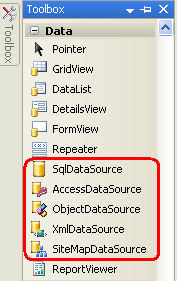
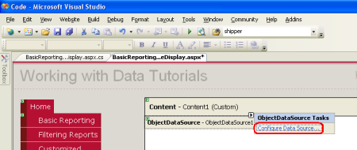
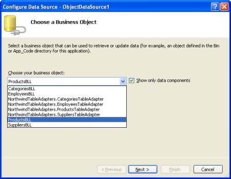
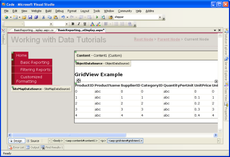
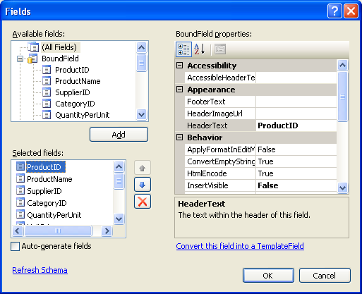
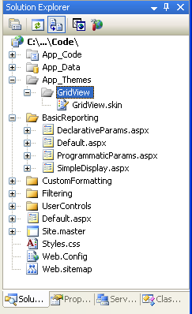
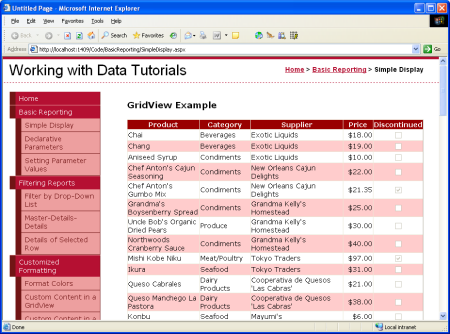
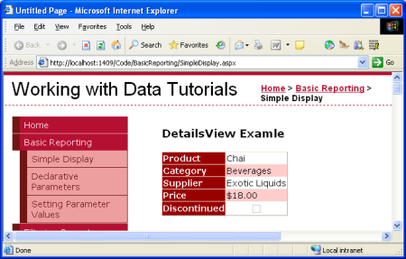
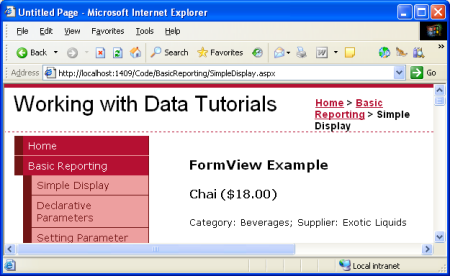

Displaying Data With the ObjectDataSource (C#)
====================
by [Scott Mitchell](https://twitter.com/ScottOnWriting)

[Download Sample App](http://download.microsoft.com/download/4/6/3/463cf87c-4724-4cbc-b7b5-3f866f43ba50/ASPNET_Data_Tutorial_4_CS.exe) or [Download PDF](displaying-data-with-the-objectdatasource-cs/_static/datatutorial04cs1.pdf)

> This tutorial looks at the ObjectDataSource control Using this control you can bind data retrieved from the BLL created in the previous tutorial without having to write a line of code!

## Introduction

With our application architecture and website page layout complete, we're ready to start exploring how to accomplish a variety of common data- and reporting-related tasks. In the previous tutorials we've seen how to programmatically bind data from the DAL and BLL to a data Web control in an ASP.NET page. This syntax assigning the data Web control's `DataSource` property to the data to display and then calling the control's `DataBind()` method was the pattern used in ASP.NET 1.x applications, and can continue to be used in your 2.0 applications. However, ASP.NET 2.0's new data source controls offer a declarative way to work with data. Using these controls you can bind data retrieved from the BLL created in the [previous tutorial](../introduction/creating-a-business-logic-layer-cs.md) without having to write a line of code!

ASP.NET 2.0 ships with five built-in data source controls [SqlDataSource](https://msdn.microsoft.com/en-us/library/dz12d98w(vs.80).aspx), [AccessDataSource](https://msdn.microsoft.com/en-us/library/8e5545e1.aspx), [ObjectDataSource](https://msdn.microsoft.com/en-us/library/9a4kyhcx.aspx), [XmlDataSource](https://msdn.microsoft.com/en-us/library/e8d8587a(en-US,VS.80).aspx), and [SiteMapDataSource](https://msdn.microsoft.com/en-us/library/5ex9t96x(en-US,VS.80).aspx) although you can build your own [custom data source controls](https://msdn.microsoft.com/library/default.asp?url=/library/en-us/dnvs05/html/DataSourceCon1.asp), if needed. Since we have developed an architecture for our tutorial application, we'll be using the ObjectDataSource against our BLL classes.

**Figure 1**: ASP.NET 2.0 Includes Five Built-In Data Source Controls

The ObjectDataSource serves as a proxy for working with some other object. To configure the ObjectDataSource we specify this underlying object and how its methods map to the ObjectDataSource's `Select`, `Insert`, `Update`, and `Delete` methods. Once this underlying object has been specified and its methods mapped to the ObjectDataSource's, we can then bind the ObjectDataSource to a data Web control. ASP.NET ships with many data Web controls, including the GridView, DetailsView, RadioButtonList, and DropDownList, among others. During the page lifecycle, the data Web control may need to access the data it's bound to, which it will accomplish by invoking its ObjectDataSource's `Select` method; if the data Web control supports inserting, updating, or deleting, calls may be made to its ObjectDataSource's `Insert`, `Update`, or `Delete` methods. These calls are then routed by the ObjectDataSource to the appropriate underlying object's methods as the following diagram illustrates.

**Figure 2**: The ObjectDataSource Serves as a Proxy ([Click to view full-size image](displaying-data-with-the-objectdatasource-cs/_static/image4.png))

While the ObjectDataSource can be used to invoke methods for inserting, updating, or deleting data, let's just focus on returning data; future tutorials will explore using the ObjectDataSource and data Web controls that modify data.

## Step 1: Adding and Configuring the ObjectDataSource Control

Start by opening the `SimpleDisplay.aspx` page in the `BasicReporting` folder, switch to Design view, and then drag an ObjectDataSource control from the Toolbox onto the page's design surface. The ObjectDataSource appears as a gray box on the design surface because it does not produce any markup; it simply accesses data by invoking a method from a specified object. The data returned by an ObjectDataSource can be displayed by a data Web control, such as the GridView, DetailsView, FormView, and so on.

> [!NOTE]
> Alternatively, you may first add the data Web control to the page and then, from its smart tag, choose the &lt;New data source&gt; option from the drop-down list.

To specify the ObjectDataSource's underlying object and how that object's methods map to the ObjectDataSource's, click on the Configure Data Source link from the ObjectDataSource's smart tag.

**Figure 3**: Click the Configure Data Source Link from the Smart Tag ([Click to view full-size image](displaying-data-with-the-objectdatasource-cs/_static/image7.png))

This brings up the Configure Data Source wizard. First, we must specify the object the ObjectDataSource is to work with. If the "Show only data components" checkbox is checked, the drop-down list on this screen lists only those objects that have been decorated with the `DataObject` attribute. Currently our list includes the TableAdapters in the Typed DataSet and the BLL classes we created in the previous tutorial. If you forgot to add the `DataObject` attribute to the Business Logic Layer classes you won't see them in this list. In that case, uncheck the "Show only data components" checkbox to view all objects, which should include the BLL classes (along with the other classes in the Typed DataSet the DataTables, DataRows, and so on).

From this first screen choose the `ProductsBLL` class from the drop-down list and click Next.

**Figure 4**: Specify the Object to Use with the ObjectDataSource Control ([Click to view full-size image](displaying-data-with-the-objectdatasource-cs/_static/image10.png))

The next screen in the wizard prompts you to select what method the ObjectDataSource should invoke. The drop-down lists those methods that return data in the object selected from the previous screen. Here we see `GetProductByProductID`, `GetProducts`, `GetProductsByCategoryID`, and `GetProductsBySupplierID`. Select the `GetProducts` method from the drop-down list and click Finish (if you added the `DataObjectMethodAttribute` to the `ProductBLL`'s methods as shown in the previous tutorial, this option will be selected by default).

**Figure 5**: Choose the Method for Returning Data from the SELECT Tab ([Click to view full-size image](displaying-data-with-the-objectdatasource-cs/_static/image13.png))

## Configure the ObjectDataSource Manually

The ObjectDataSource's Configure Data Source wizard offers a quick way to specify the object it uses and to associate what methods of the object are invoked. You can, however, configure the ObjectDataSource through its properties, either through the Properties window or directly in the declarative markup. Simply set the `TypeName` property to the type of the underlying object to be used, and the `SelectMethod` to the method to invoke when retrieving data.

[!code-aspx[Main](displaying-data-with-the-objectdatasource-cs/samples/sample1.aspx)]

Even if you prefer the Configure Data Source wizard there may be times when you need to manually configure the ObjectDataSource, as the wizard only lists developer-created classes. If you want to bind the ObjectDataSource to a class in the .NET Framework such as the [Membership class](https://msdn.microsoft.com/en-us/library/system.web.security.membership.aspx), to access user account information, or the [Directory class](https://msdn.microsoft.com/en-us/library/system.io.directory.aspx) to work with file system information you'll need to manually set the ObjectDataSource's properties.

## Step 2: Adding a Data Web Control and Binding it to the ObjectDataSource

Once the ObjectDataSource has been added to the page and configured, we're ready to add data Web controls to the page to display the data returned by the ObjectDataSource's `Select` method. Any data Web control can be bound to an ObjectDataSource; let's look at displaying the ObjectDataSource's data in a GridView, DetailsView, and FormView.

## Binding a GridView to the ObjectDataSource

Add a GridView control from the Toolbox to `SimpleDisplay.aspx`'s design surface. From the GridView's smart tag, choose the ObjectDataSource control we added in Step 1. This will automatically create a BoundField in the GridView for each property returned by the data from the ObjectDataSource's `Select` method (namely, the properties defined by the Products DataTable).

**Figure 6**: A GridView Has Been Added to the Page and Bound to the ObjectDataSource ([Click to view full-size image](displaying-data-with-the-objectdatasource-cs/_static/image16.png))

You can then customize, rearrange, or remove the GridView's BoundFields by clicking the Edit Columns option from the smart tag.

**Figure 7**: Manage the GridView's BoundFields Through the Edit Columns Dialog Box ([Click to view full-size image](displaying-data-with-the-objectdatasource-cs/_static/image19.png))

Take a moment to modify the GridView's BoundFields, removing the `ProductID`, `SupplierID`, `CategoryID`, `QuantityPerUnit`, `UnitsInStock`, `UnitsOnOrder`, and `ReorderLevel` BoundFields. Simply select the BoundField from the list in the bottom left and click the delete button (the red X) to remove them. Next, Rearrange the BoundFields so that the `CategoryName` and `SupplierName` BoundFields precede the `UnitPrice` BoundField by selecting these BoundFields and clicking the up arrow. Set the `HeaderText` properties of the remaining BoundFields to `Products`, `Category`, `Supplier`, and `Price`, respectively. Next, have the `Price` BoundField formatted as a currency by setting the BoundField's `HtmlEncode` property to False and its `DataFormatString` property to `{0:c}`. Finally, horizontally align the `Price` to the right and the `Discontinued` checkbox in the center via the `ItemStyle`/`HorizontalAlign` property.

[!code-aspx[Main](displaying-data-with-the-objectdatasource-cs/samples/sample2.aspx)]

**Figure 8**: The GridView's BoundFields Have Been Customized ([Click to view full-size image](displaying-data-with-the-objectdatasource-cs/_static/image22.png))

## Using Themes for a Consistent Look

These tutorials strive to remove any control-level style settings, instead using cascading style sheets defined in an external file whenever possible. The `Styles.css` file contains `DataWebControlStyle`, `HeaderStyle`, `RowStyle`, and `AlternatingRowStyle` CSS classes that should be used to dictate the appearance of the data Web controls used in these tutorials. To accomplish this, we could set the GridView's `CssClass` property to `DataWebControlStyle`, and its `HeaderStyle`, `RowStyle`, and `AlternatingRowStyle` properties' `CssClass` properties accordingly.

If we set these `CssClass` properties at the Web control we'd need to remember to explicitly set these property values for each and every data Web control added to our tutorials. A more manageable approach is to define the default CSS-related properties for the GridView, DetailsView, and FormView controls using a Theme. A Theme is a collection of control-level property settings, images, and CSS classes that can be applied to pages across a site to enforce a common look and feel.

Our Theme won't include any images or CSS files (we'll leave the stylesheet `Styles.css` as-is, defined in the root folder of the web application), but will include two Skins. A Skin is a file that defines the default properties for a Web control. Specifically, we'll have a Skin file for the GridView and DetailsView controls, indicating the default `CssClass`-related properties.

Start by adding a new Skin File to your project named `GridView.skin` by right-clicking on the project name in the Solution Explorer and choosing Add New Item.

**Figure 9**: Add a Skin File Named `GridView.skin` ([Click to view full-size image](displaying-data-with-the-objectdatasource-cs/_static/image25.png))

Skin files need to be placed in a Theme, which are located in the `App_Themes` folder. Since we don't yet have such a folder, Visual Studio will kindly offer to create one for us when adding our first Skin. Click Yes to create the `App_Theme` folder and place the new `GridView.skin` file there.

**Figure 10**: Let Visual Studio Create the `App_Theme` Folder ([Click to view full-size image](displaying-data-with-the-objectdatasource-cs/_static/image28.png))

This will create a new Theme in the `App_Themes` folder named GridView with the Skin file `GridView.skin`.

**Figure 11**: The GridView Theme has Been Added to the `App_Theme` Folder

Rename the GridView Theme to DataWebControls (right-click on the GridView folder in the `App_Theme` folder and choose Rename). Next, enter the following markup into the `GridView.skin` file:

[!code-aspx[Main](displaying-data-with-the-objectdatasource-cs/samples/sample3.aspx)]

This defines the default properties for the `CssClass`-related properties for any GridView in any page that uses the DataWebControls Theme. Let's add another Skin for the DetailsView, a data Web control that we'll be using shortly. Add a new Skin to the DataWebControls Theme named `DetailsView.skin` and add the following markup:

[!code-aspx[Main](displaying-data-with-the-objectdatasource-cs/samples/sample4.aspx)]

With our Theme defined, the last step is to apply the Theme to our ASP.NET page. A Theme can be applied on a page-by-page basis or for all pages in a website. Let's use this theme for all pages in the website. To accomplish this, add the following markup to `Web.config`'s `<system.web>` section:

[!code-xml[Main](displaying-data-with-the-objectdatasource-cs/samples/sample5.xml)]

That's all there is to it! The `styleSheetTheme` setting indicates that the properties specified in the Theme should *not* override the properties specified at the control level. To specify that Theme settings should trump control settings, use the `theme` attribute in place of `styleSheetTheme`; unfortunately, Theme settings specified via the `theme` attribute do not appear in the Visual Studio Design view. Refer to [ASP.NET Themes and Skins Overview](https://msdn.microsoft.com/en-us/library/ykzx33wh.aspx) and [Server-Side Styles Using Themes](https://quickstarts.asp.net/quickstartv20/aspnet/doc/themes/stylesheettheme.aspx) for more information on Themes and Skins; see [How To: Apply ASP.NET Themes](https://msdn.microsoft.com/en-us/library/0yy5hxdk(VS.80).aspx) for more on configuring a page to use a theme.

**Figure 12**: The GridView Displays the Product's Name, Category, Supplier, Price, and Discontinued Information ([Click to view full-size image](displaying-data-with-the-objectdatasource-cs/_static/image32.png))

## Displaying One Record at a Time in the DetailsView

The GridView displays one row for each record returned by the data source control to which it's bound. There are times, however, when we may want to display a sole record or just one record at a time. The [DetailsView control](https://msdn.microsoft.com/en-us/library/s3w1w7t4.aspx) offers this functionality, rendering as an HTML `<table>` with two columns and one row for each column or property bound to the control. You can think of the DetailsView as a GridView with a single record rotated 90 degrees.

Start by adding a DetailsView control *above* the GridView in `SimpleDisplay.aspx`. Next, bind it to the same ObjectDataSource control as the GridView. Like with the GridView, a BoundField will be added to the DetailsView for each property in the object returned by the ObjectDataSource's `Select` method. The only difference is that the DetailsView's BoundFields are laid out horizontally rather than vertically.

**Figure 13**: Add a DetailsView to the Page and Bind it to the ObjectDataSource ([Click to view full-size image](displaying-data-with-the-objectdatasource-cs/_static/image35.png))

Like the GridView, the DetailsView's BoundFields can be tweaked to provide a more customized display of the data returned by the ObjectDataSource. Figure 14 shows the DetailsView after its BoundFields and `CssClass` properties have been configured to make its appearance similar to the GridView example.

**Figure 14**: The DetailsView Shows a Single Record ([Click to view full-size image](displaying-data-with-the-objectdatasource-cs/_static/image38.png))

Note that the DetailsView only displays the first record returned by its data source. To allow the user to step through all of the records, one at a time, we must enable paging for the DetailsView. To do so, return to Visual Studio and check the Enable Paging checkbox in the DetailsView's smart tag.

**Figure 15**: Enable Paging in the DetailsView Control ([Click to view full-size image](displaying-data-with-the-objectdatasource-cs/_static/image41.png))

**Figure 16**: With Paging Enabled, the DetailsView Allows the User to View Any of the Products ([Click to view full-size image](displaying-data-with-the-objectdatasource-cs/_static/image44.png))

We'll talk more about paging in future tutorials.

## A More Flexible Layout for Showing One Record at a Time

The DetailsView is pretty rigid in how it displays each record returned from the ObjectDataSource. We may want a more flexible view of the data. For example, rather than showing the product's name, category, supplier, price, and discontinued information each on a separate row, we may want to show the product name and price in an `<h4>` heading, with the category and supplier information appearing below the name and price in a smaller font size. And we may not care to show the property names (Product, Category, and so on) next to the values.

The [FormView control](https://msdn.microsoft.com/en-US/library/fyf1dk77.aspx) provides this level of customization. Rather than using fields (like the GridView and DetailsView do), the FormView uses templates, which allow for a mix of Web controls, static HTML, and [databinding syntax](http://www.15seconds.com/issue/040630.htm). If you are familiar with the Repeater control from ASP.NET 1.x, you can think of the FormView as the Repeater for showing a single record.

Add a FormView control to the `SimpleDisplay.aspx` page's design surface. Initially the FormView displays as a gray block, informing us that we need to provide, at minimum, the control's `ItemTemplate`.

**Figure 17**: The FormView Must Include an `ItemTemplate` ([Click to view full-size image](displaying-data-with-the-objectdatasource-cs/_static/image47.png))

You can bind the FormView directly to a data source control through the FormView's smart tag, which will create a default `ItemTemplate` automatically (along with an `EditItemTemplate` and `InsertItemTemplate`, if the ObjectDatatSource control's `InsertMethod` and `UpdateMethod` properties are set). However, for this example let's bind the data to the FormView and specify its `ItemTemplate` manually. Start by setting the FormView's `DataSourceID` property to the `ID` of the ObjectDataSource control, `ObjectDataSource1`. Next, create the `ItemTemplate` so that it displays the product's name and price in an `<h4>` element and the category and shipper names beneath that in a smaller font size.

[!code-aspx[Main](displaying-data-with-the-objectdatasource-cs/samples/sample6.aspx)]

**Figure 18**: The First Product (Chai) is Displayed in a Custom Format ([Click to view full-size image](displaying-data-with-the-objectdatasource-cs/_static/image50.png))

The `<%# Eval(propertyName) %>` is the databinding syntax. The `Eval` method returns the value of the specified property for the current object being bound to the FormView control. Check out Alex Homer's article [Simplified and Extended Data Binding Syntax in ASP.NET 2.0](http://www.15seconds.com/issue/040630.htm) for more information on the ins and outs of databinding.

Like the DetailsView, the FormView only shows the first record returned from the ObjectDataSource. You can enable paging in the FormView to allow visitors to step through the products one at a time.

## Summary

Accessing and displaying data from a Business Logic Layer can be accomplished without writing a line of code thanks to ASP.NET 2.0's ObjectDataSource control. The ObjectDataSource invokes a specified method of a class and returns the results. These results can be displayed in a data Web control that's bound to the ObjectDataSource. In this tutorial we looked at binding the GridView, DetailsView, and FormView controls to the ObjectDataSource.

So far we've only seen how to use the ObjectDataSource to invoke a parameter-less method, but what if we want to invoke a method that expects input parameters, such as the `ProductBLL` class's `GetProductsByCategoryID(categoryID)`? In order to call a method that expects one or more parameters we must configure the ObjectDataSource to specify the values for these parameters. We'll see how to accomplish this in our [next tutorial](declarative-parameters-cs.md).

Happy Programming!

## Further Reading

For more information on the topics discussed in this tutorial, refer to the following resources:

- [Create Your Own Data Source Controls](https://msdn.microsoft.com/en-us/library/ms364049.aspx)
- [GridView Examples for ASP.NET 2.0](https://msdn.microsoft.com/en-us/library/aa479339.aspx)
- [Simplified and Extended Data Binding Syntax in ASP.NET 2.0](http://www.15seconds.com/issue/040630.htm)
- [Themes in ASP.NET 2.0](http://www.odetocode.com/Articles/423.aspx)
- [Server-Side Styles Using Themes](https://quickstarts.asp.net/quickstartv20/aspnet/doc/themes/stylesheettheme.aspx)
- [How To: Apply ASP.NET Themes Programmatically](https://msdn.microsoft.com/en-us/library/tx35bd89.aspx)

## About the Author

[Scott Mitchell](http://www.4guysfromrolla.com/ScottMitchell.shtml), author of seven ASP/ASP.NET books and founder of [4GuysFromRolla.com](http://www.4guysfromrolla.com), has been working with Microsoft Web technologies since 1998. Scott works as an independent consultant, trainer, and writer. His latest book is [*Sams Teach Yourself ASP.NET 2.0 in 24 Hours*](https://www.amazon.com/exec/obidos/ASIN/0672327384/4guysfromrollaco). He can be reached at [mitchell@4GuysFromRolla.com.](mailto:mitchell@4GuysFromRolla.com) or via his blog, which can be found at [http://ScottOnWriting.NET](http://ScottOnWriting.NET).

## Special Thanks To

This tutorial series was reviewed by many helpful reviewers. Lead reviewer for this tutorial was Hilton Giesenow. Interested in reviewing my upcoming MSDN articles? If so, drop me a line at [mitchell@4GuysFromRolla.com.](mailto:mitchell@4GuysFromRolla.com)

>[!div class="step-by-step"]
[Next](declarative-parameters-cs.md)