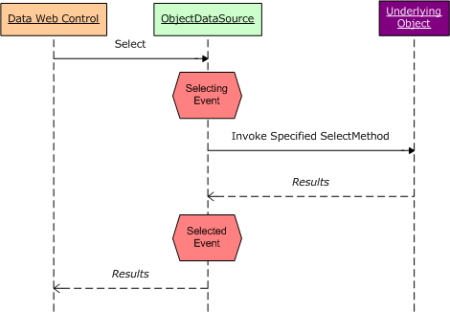
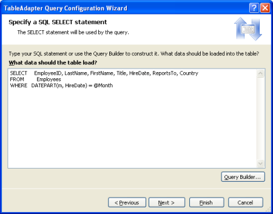
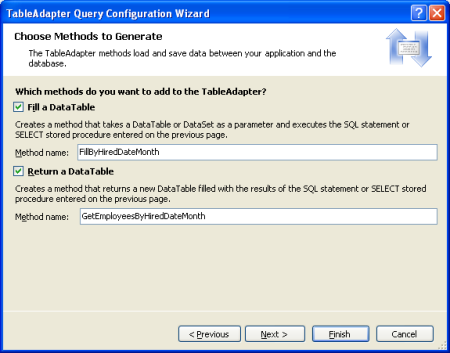
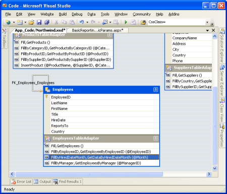
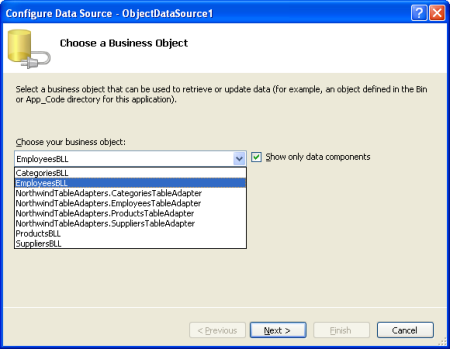
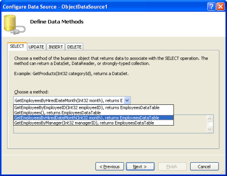
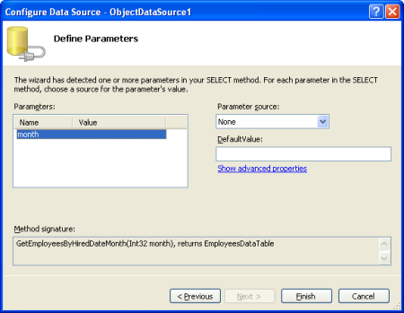
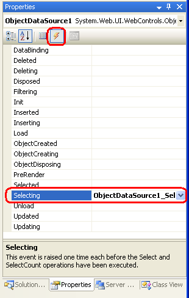

Programmatically Setting the ObjectDataSource's Parameter Values (VB)
====================
by [Scott Mitchell](https://twitter.com/ScottOnWriting)

[Download Sample App](http://download.microsoft.com/download/5/d/7/5d7571fc-d0b7-4798-ad4a-c976c02363ce/ASPNET_Data_Tutorial_6_VB.exe) or [Download PDF](programmatically-setting-the-objectdatasource-s-parameter-values-vb/_static/datatutorial06vb1.pdf)

> In this tutorial we'll look at adding a method to our DAL and BLL that accepts a single input parameter and returns data. The example will set this parameter programmatically.

## Introduction

As we saw in the [previous tutorial](declarative-parameters-vb.md), a number of options are available for declaratively passing parameter values to the ObjectDataSource's methods. If the parameter value is hard-coded, comes from a Web control on the page, or is in any other source that is readable by a data source `Parameter` object, for example, that value can be bound to the input parameter without writing a line of code.

There may be times, however, when the parameter value comes from some source not already accounted for by one of the built-in data source `Parameter` objects. If our site supported user accounts we might want to set the parameter based on the currently logged in visitor's User ID. Or we may need to customize the parameter value before sending it along to the ObjectDataSource's underlying object's method.

Whenever the ObjectDataSource's `Select` method is invoked the ObjectDataSource first raises its [Selecting event](https://msdn.microsoft.com/en-US/library/system.web.ui.webcontrols.objectdatasource.selecting%28VS.80%29.aspx). The ObjectDataSource's underlying object's method is then invoked. Once that completes the ObjectDataSource's [Selected event](https://msdn.microsoft.com/en-US/library/system.web.ui.webcontrols.objectdatasource.selected%28VS.80%29.aspx) fires (Figure 1 illustrates this sequence of events). The parameter values passed into the ObjectDataSource's underlying object's method can be set or customized in an event handler for the `Selecting` event.

**Figure 1**: The ObjectDataSource's `Selected` and `Selecting` Events Fire Before and After Its Underlying Object's Method is Invoked ([Click to view full-size image](programmatically-setting-the-objectdatasource-s-parameter-values-vb/_static/image3.png))

In this tutorial we'll look at adding a method to our DAL and BLL that accepts a single input parameter `Month`, of type `Integer` and returns an `EmployeesDataTable` object populated with those employees that have their hiring anniversary in the specified `Month`. Our example will set this parameter programmatically based on the current month, showing a list of "Employee Anniversaries This Month."

Let's get started!

## Step 1: Adding a Method to`EmployeesTableAdapter`

For our first example we need to add a means to retrieve those employees whose `HireDate` occurred in a specified month. To provide this functionality in accordance with our architecture we need to first create a method in `EmployeesTableAdapter` that maps to the proper SQL statement. To accomplish this, start by opening the Northwind Typed DataSet. Right-click on the `EmployeesTableAdapter` label and choose Add Query.

**Figure 2**: Add a New Query to the `EmployeesTableAdapter` ([Click to view full-size image](programmatically-setting-the-objectdatasource-s-parameter-values-vb/_static/image6.png))

Choose to add a SQL statement that returns rows. When you reach the Specify a `SELECT` Statement screen the default `SELECT` statement for the `EmployeesTableAdapter` will already be loaded. Simply add in the `WHERE` clause: `WHERE DATEPART(m, HireDate) = @Month`. [DATEPART](https://msdn.microsoft.com/en-us/library/ms174420.aspx) is a T-SQL function that returns a particular date portion of a `datetime` type; in this case we're using `DATEPART` to return the month of the `HireDate` column.

**Figure 3**: Return Only Those Rows Where the `HireDate` Column is Less Than or Equal to the `@HiredBeforeDate` Parameter ([Click to view full-size image](programmatically-setting-the-objectdatasource-s-parameter-values-vb/_static/image9.png))

Finally, change the `FillBy` and `GetDataBy` method names to `FillByHiredDateMonth` and `GetEmployeesByHiredDateMonth`, respectively.

**Figure 4**: Choose More Appropriate Method Names Than `FillBy` and `GetDataBy` ([Click to view full-size image](programmatically-setting-the-objectdatasource-s-parameter-values-vb/_static/image12.png))

Click Finish to complete the wizard and return to the DataSet's design surface. The `EmployeesTableAdapter` should now include a new set of methods for accessing employees hired in a specified month.

**Figure 5**: The New Methods Appear in the DataSet's Design Surface ([Click to view full-size image](programmatically-setting-the-objectdatasource-s-parameter-values-vb/_static/image15.png))

## Step 2: Adding the`GetEmployeesByHiredDateMonth(month)`Method to the Business Logic Layer

Since our application architecture uses a separate layer for the business logic and data access logic, we need to add a method to our BLL that calls down to the DAL to retrieve employees hired before a specified date. Open the `EmployeesBLL.vb` file and add the following method:

[!code-vb[Main](programmatically-setting-the-objectdatasource-s-parameter-values-vb/samples/sample1.vb)]

As with our other methods in this class, `GetEmployeesByHiredDateMonth(month)` simply calls down into the DAL and returns the results.

## Step 3: Displaying Employees Whose Hiring Anniversary Is This Month

Our final step for this example is to display those employees whose hiring anniversary is this month. Start by adding a GridView to the `ProgrammaticParams.aspx` page in the `BasicReporting` folder and add a new ObjectDataSource as its data source. Configure the ObjectDataSource to use the `EmployeesBLL` class with the `SelectMethod` set to `GetEmployeesByHiredDateMonth(month)`.

**Figure 6**: Use the `EmployeesBLL` Class ([Click to view full-size image](programmatically-setting-the-objectdatasource-s-parameter-values-vb/_static/image18.png))

**Figure 7**: Select From the `GetEmployeesByHiredDateMonth(month)` method ([Click to view full-size image](programmatically-setting-the-objectdatasource-s-parameter-values-vb/_static/image21.png))

The final screen asks us to provide the `month` parameter value's source. Since we'll set this value programmatically, leave the Parameter source set to the default None option and click Finish.

**Figure 8**: Leave the Parameter Source Set to None ([Click to view full-size image](programmatically-setting-the-objectdatasource-s-parameter-values-vb/_static/image24.png))

This will create a `Parameter` object in the ObjectDataSource's `SelectParameters` collection that does not have a value specified.

[!code-aspx[Main](programmatically-setting-the-objectdatasource-s-parameter-values-vb/samples/sample2.aspx)]

To set this value programmatically, we need to create an event handler for the ObjectDataSource's `Selecting` event. To accomplish this, go to the Design view and double-click the ObjectDataSource. Alternatively, select the ObjectDataSource, go to the Properties window, and click the lightning bolt icon. Next, either double-click in the textbox next to the `Selecting` event or type in the name of the event handler you want to use. As a third option, you can create the event handler by selecting the ObjectDataSource and its `Selecting` event from the two drop-down lists at the top of the page's code-behind class.

**Figure 9**: Click on the Lightning Bolt Icon in the Properties Window to List a Web Control's Events

All three approaches add a new event handler for the ObjectDataSource's `Selecting` event to the page's code-behind class. In this event handler we can read and write to the parameter values using `e.InputParameters(parameterName)`, where *`parameterName`* is the value of the `Name` attribute in the `<asp:Parameter>` tag (the `InputParameters` collection can also be indexed ordinally, as in `e.InputParameters(index)`). To set the `month` parameter to the current month, add the following to the `Selecting` event handler:

[!code-vb[Main](programmatically-setting-the-objectdatasource-s-parameter-values-vb/samples/sample3.vb)]

When visiting this page through a browser we can see that only one employee was hired this month (March) Laura Callahan, who's been with the company since 1994.

**Figure 10**: Those Employees Whose Anniversaries This Month Are Shown ([Click to view full-size image](programmatically-setting-the-objectdatasource-s-parameter-values-vb/_static/image28.png))

## Summary

While the ObjectDataSource's parameters' values can typically be set declaratively, without requiring a line of code, it's easy to set the parameter values programmatically. All we need to do is create an event handler for the ObjectDataSource's `Selecting` event, which fires before the underlying object's method is invoked, and manually set the values for one or more parameters via the `InputParameters` collection.

This tutorial concludes the Basic Reporting section. The [next tutorial](../masterdetail/master-detail-filtering-with-a-dropdownlist-vb.md) kicks off the Filtering and Master-Details Scenarios section, in which we'll look at techniques for allowing the visitor to filter data and drill down from a master report into a details report.

Happy Programming!

## About the Author

[Scott Mitchell](http://www.4guysfromrolla.com/ScottMitchell.shtml), author of seven ASP/ASP.NET books and founder of [4GuysFromRolla.com](http://www.4guysfromrolla.com), has been working with Microsoft Web technologies since 1998. Scott works as an independent consultant, trainer, and writer. His latest book is [*Sams Teach Yourself ASP.NET 2.0 in 24 Hours*](https://www.amazon.com/exec/obidos/ASIN/0672327384/4guysfromrollaco). He can be reached at [mitchell@4GuysFromRolla.com.](mailto:mitchell@4GuysFromRolla.com) or via his blog, which can be found at [http://ScottOnWriting.NET](http://ScottOnWriting.NET).

## Special Thanks To

This tutorial series was reviewed by many helpful reviewers. Lead reviewer for this tutorial was Hilton Giesenow. Interested in reviewing my upcoming MSDN articles? If so, drop me a line at [mitchell@4GuysFromRolla.com.](mailto:mitchell@4GuysFromRolla.com)

>[!div class="step-by-step"]
[Previous](declarative-parameters-vb.md)