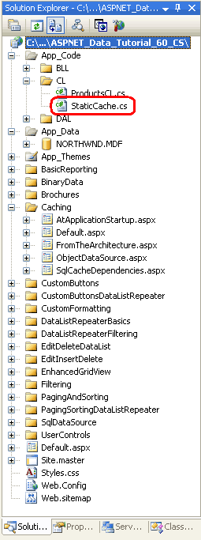
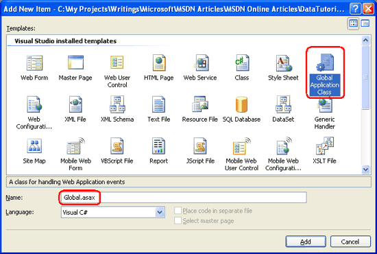
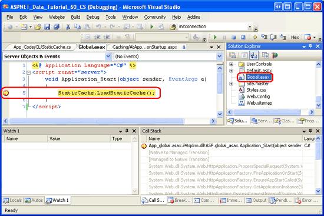
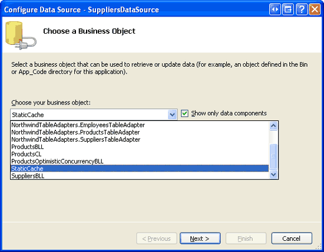
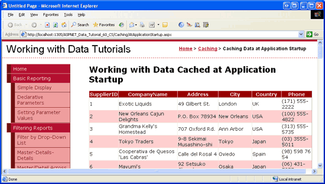

Caching Data at Application Startup (C#)
====================
by [Scott Mitchell](https://twitter.com/ScottOnWriting)

[Download PDF](caching-data-at-application-startup-cs/_static/datatutorial60cs1.pdf)

> In any Web application some data will be frequently used and some data will be infrequently used. We can improve the performance of our ASP.NET application by loading in advance the frequently-used data, a technique known as. This tutorial demonstrates one approach to proactive loading, which is to load data into the cache at application startup.

## Introduction

The two previous tutorials looked at caching data in the Presentation and Caching Layers. In [Caching Data with the ObjectDataSource](caching-data-with-the-objectdatasource-cs.md), we looked at using the ObjectDataSource s caching features to cache data in the Presentation Layer. [Caching Data in the Architecture](caching-data-in-the-architecture-cs.md) examined caching in a new, separate Caching Layer. Both of these tutorials used *reactive loading* in working with the data cache. With reactive loading, each time the data is requested, the system first checks if it s in the cache. If not, it grabs the data from the originating source, such as the database, and then stores it in the cache. The main advantage to reactive loading is its ease of implementation. One of its disadvantages is its uneven performance across requests. Imagine a page that uses the Caching Layer from the preceding tutorial to display product information. When this page is visited for the first time, or visited for the first time after the cached data has been evicted due to memory constraints or the specified expiry having been reached, the data must be retrieved from the database. Therefore, these users requests will take longer than users requests that can be served by the cache.

*Proactive loading* provides an alternative cache management strategy that smoothes out the performance across requests by loading the cached data before it s needed. Typically, proactive loading uses some process that either periodically checks or is notified when there has been an update to the underlying data. This process then updates the cache to keep it fresh. Proactive loading is especially useful if the underlying data comes from a slow database connection, a Web service, or some other particularly sluggish data source. But this approach to proactive loading is more difficult to implement, as it requires creating, managing, and deploying a process to check for changes and update the cache.

Another flavor of proactive loading, and the type we'll be exploring in this tutorial, is loading data into the cache at application startup. This approach is especially useful for caching static data, such as the records in database lookup tables.

> [!NOTE]
> For a more in-depth look at the differences between proactive and reactive loading, as well as lists of pros, cons, and implementation recommendations, refer to the [Managing the Contents of a Cache](https://msdn.microsoft.com/en-us/library/ms978503.aspx) section of the [Caching Architecture Guide for .NET Framework Applications](https://msdn.microsoft.com/en-us/library/ms978498.aspx).

## Step 1: Determining What Data to Cache at Application Startup

The caching examples using reactive loading that we examined in the previous two tutorials work well with data that may periodically change and does not take exorbitantly long to generate. But if the cached data never changes, the expiry used by reactive loading is superfluous. Likewise, if the data being cached takes an exceedingly long time to generate, then those users whose requests find the cache empty will have to endure a lengthy wait while the underlying data is retrieved. Consider caching static data and data that takes an exceptionally long time to generate at application startup.

While databases have many dynamic, frequently-changing values, most also have a fair amount of static data. For example, virtually all data models have one or more columns that contain a particular value from a fixed set of choices. A `Patients` database table might have a `PrimaryLanguage` column, whose set of values could be English, Spanish, French, Russian, Japanese, and so on. Oftentimes, these types of columns are implemented using *lookup tables*. Rather than storing the string English or French in the `Patients` table, a second table is created that has, commonly, two columns - a unique identifier and a string description - with a record for each possible value. The `PrimaryLanguage` column in the `Patients` table stores the corresponding unique identifier in the lookup table. In Figure 1, patient John Doe s primary language is English, while Ed Johnson s is Russian.

**Figure 1**: The `Languages` Table is a Lookup Table Used by the `Patients` Table

The user interface for editing or creating a new patient would include a drop-down list of allowable languages populated by the records in the `Languages` table. Without caching, each time this interface is visited the system must query the `Languages` table. This is wasteful and unnecessary since lookup table values change very infrequently, if ever.

We could cache the `Languages` data using the same reactive loading techniques examined in the previous tutorials. Reactive loading, however, uses a time-based expiry, which is not needed for static lookup table data. While caching using reactive loading would be better than no caching at all, the best approach would be to proactively load the lookup table data into the cache at application startup.

In this tutorial we will look at how to cache lookup table data and other static information.

## Step 2: Examining the Different Ways to Cache Data

Information can be programmatically cached in an ASP.NET application using a variety of approaches. We ve already seen how to use the data cache in previous tutorials. Alternatively, objects can be programmatically cached using *static members* or *application state*.

When working with a class, typically the class must first be instantiated before its members can be accessed. For example, in order to invoke a method from one of the classes in our Business Logic Layer, we must first create an instance of the class:

[!code-csharp[Main](caching-data-at-application-startup-cs/samples/sample1.cs)]

Before we can invoke *SomeMethod* or work with *SomeProperty*, we must first create an instance of the class using the `new` keyword. *SomeMethod* and *SomeProperty* are associated with a particular instance. The lifetime of these members is tied to the lifetime of their associated object. *Static members*, on the other hand, are variables, properties, and methods that are shared among *all* instances of the class and, consequently, have a lifetime as long as the class. Static members are denoted by the keyword `static`.

In addition to static members, data can be cached using application state. Each ASP.NET application maintains a name/value collection that s shared across all users and pages of the application. This collection can be accessed using the [`HttpContext` class](https://msdn.microsoft.com/en-us/library/system.web.httpcontext.aspx) s [`Application` property](https://msdn.microsoft.com/en-us/library/system.web.httpcontext.application.aspx), and used from an ASP.NET page s code-behind class like so:

[!code-csharp[Main](caching-data-at-application-startup-cs/samples/sample2.cs)]

The data cache provides a much richer API for caching data, providing mechanisms for time- and dependency-based expiries, cache item priorities, and so forth. With static members and application state, such features must be manually added by the page developer. When caching data at application startup for the lifetime of the application, however, the data cache s advantages are moot. In this tutorial we'll look at code that uses all three techniques for caching static data.

## Step 3: Caching the`Suppliers`Table Data

The Northwind database tables we ve implemented to date do not include any traditional lookup tables. The four DataTables implemented in our DAL all model tables whose values are non-static. Rather than spending the time to add a new DataTable to the DAL and then a new class and methods to the BLL, for this tutorial let s just pretend that the `Suppliers` table s data is static. Therefore, we could cache this data at application startup.

To start, create a new class named `StaticCache.cs` in the `CL` folder.

**Figure 2**: Create the `StaticCache.cs` Class in the `CL` Folder

We need to add a method that loads the data at startup into the appropriate cache store, as well as methods that return data from this cache.

[!code-csharp[Main](caching-data-at-application-startup-cs/samples/sample3.cs)]

The above code uses a static member variable, `suppliers`, to hold the results from the `SuppliersBLL` class s `GetSuppliers()` method, which is called from the `LoadStaticCache()` method. The `LoadStaticCache()` method is meant to be called during the application s start. Once this data has been loaded at application startup, any page that needs to work with supplier data can call the `StaticCache` class s `GetSuppliers()` method. Therefore, the call to the database to get the suppliers only happens once, at application start.

Rather than using a static member variable as the cache store, we could have alternatively used application state or the data cache. The following code shows the class retooled to use application state:

[!code-csharp[Main](caching-data-at-application-startup-cs/samples/sample4.cs)]

In `LoadStaticCache()`, the supplier information is stored to the application variable *key*. It s returned as the appropriate type (`Northwind.SuppliersDataTable`) from `GetSuppliers()`. While application state can be accessed in the code-behind classes of ASP.NET pages using `Application["key"]`, in the architecture we must use `HttpContext.Current.Application["key"]` in order to get the current `HttpContext`.

Likewise, the data cache can be used as a cache store, as the following code shows:

[!code-csharp[Main](caching-data-at-application-startup-cs/samples/sample5.cs)]

To add an item to the data cache with no time-based expiry, use the `System.Web.Caching.Cache.NoAbsoluteExpiration` and `System.Web.Caching.Cache.NoSlidingExpiration` values as input parameters. This particular overload of the data cache s `Insert` method was selected so that we could specify the *priority* of the cache item. The priority is used to determine what items to scavenge from the cache when available memory runs low. Here we use the priority `NotRemovable`, which ensures that this cache item won t be scavenged.

> [!NOTE]
> This tutorial s download implements the `StaticCache` class using the static member variable approach. The code for the application state and data cache techniques is available in the comments in the class file.

## Step 4: Executing Code at Application Startup

To execute code when a web application first starts, we need to create a special file named `Global.asax`. This file can contain event handlers for application-, session-, and request-level events, and it is here where we can add code that will be executed whenever the application starts.

Add the `Global.asax` file to your web application s root directory by right-clicking on the website project name in Visual Studio s Solution Explorer and choosing Add New Item. From the Add New Item dialog box, select the Global Application Class item type and then click the Add button.

> [!NOTE]
> If you already have a `Global.asax` file in your project, the Global Application Class item type will not be listed in the Add New Item dialog box.

**Figure 3**: Add the `Global.asax` File to Your Web Application s Root Directory ([Click to view full-size image](caching-data-at-application-startup-cs/_static/image5.png))

The default `Global.asax` file template includes five methods within a server-side `<script>` tag:

- **`Application_Start`** executes when the web application first starts
- **`Application_End`** runs when the application is shutting down
- **`Application_Error`** executes whenever an unhandled exception reaches the application
- **`Session_Start`** executes when a new session is created
- **`Session_End`** runs when a session is expired or abandoned

The `Application_Start` event handler is called only once during an application s life cycle. The application starts the first time an ASP.NET resource is requested from the application and continues to run until the application is restarted, which can happen by modifying the contents of the `/Bin` folder, modifying `Global.asax`, modifying the contents in the `App_Code` folder, or modifying the `Web.config` file, among other causes. Refer to [ASP.NET Application Life Cycle Overview](https://msdn.microsoft.com/en-us/library/ms178473.aspx) for a more detailed discussion on the application life cycle.

For these tutorials we only need to add code to the `Application_Start` method, so feel free to remove the others. In `Application_Start`, simply call the `StaticCache` class s `LoadStaticCache()` method, which will load and cache the supplier information:

[!code-aspx[Main](caching-data-at-application-startup-cs/samples/sample6.aspx)]

That s all there is to it! At application startup, the `LoadStaticCache()` method will grab the supplier information from the BLL, and store it in a static member variable (or whatever cache store you ended up using in the `StaticCache` class). To verify this behavior, set a breakpoint in the `Application_Start` method and run your application. Note that the breakpoint is hit upon the application starting. Subsequent requests, however, do not cause the `Application_Start` method to execute.

**Figure 4**: Use a Breakpoint to Verify that the `Application_Start` Event Handler is Being Executed ([Click to view full-size image](caching-data-at-application-startup-cs/_static/image8.png))

> [!NOTE]
> If you do not hit the `Application_Start` breakpoint when you first start debugging, it is because your application has already started. Force the application to restart by modifying your `Global.asax` or `Web.config` files and then try again. You can simply add (or remove) a blank line at the end of one of these files to quickly restart the application.

## Step 5: Displaying the Cached Data

At this point the `StaticCache` class has a version of the supplier data cached at application startup that can be accessed through its `GetSuppliers()` method. To work with this data from the Presentation Layer, we can use an ObjectDataSource or programmatically invoke the `StaticCache` class s `GetSuppliers()` method from an ASP.NET page s code-behind class. Let s look at using the ObjectDataSource and GridView controls to display the cached supplier information.

Start by opening the `AtApplicationStartup.aspx` page in the `Caching` folder. Drag a GridView from the Toolbox onto the designer, setting its `ID` property to `Suppliers`. Next, from the GridView s smart tag choose to create a new ObjectDataSource named `SuppliersCachedDataSource`. Configure the ObjectDataSource to use the `StaticCache` class s `GetSuppliers()` method.

**Figure 5**: Configure the ObjectDataSource to use the `StaticCache` Class ([Click to view full-size image](caching-data-at-application-startup-cs/_static/image11.png))

**Figure 6**: Use the `GetSuppliers()` Method to Retrieve the Cached Supplier Data ([Click to view full-size image](caching-data-at-application-startup-cs/_static/image14.png))

After completing the wizard, Visual Studio will automatically add BoundFields for each of the data fields in `SuppliersDataTable`. Your GridView and ObjectDataSource s declarative markup should look similar to the following:

[!code-aspx[Main](caching-data-at-application-startup-cs/samples/sample7.aspx)]

Figure 7 shows the page when viewed through a browser. The output is the same had we pulled the data from the BLL s `SuppliersBLL` class, but using the `StaticCache` class returns the supplier data as cached at application startup. You can set breakpoints in the `StaticCache` class s `GetSuppliers()` method to verify this behavior.

**Figure 7**: The Cached Supplier Data is Displayed in a GridView ([Click to view full-size image](caching-data-at-application-startup-cs/_static/image17.png))

## Summary

Most every data model contains a fair amount of static data, usually implemented in the form of lookup tables. Since this information is static, there s no reason to continually access the database each time this information needs to be displayed. Furthermore, due to its static nature, when caching the data there s no need for an expiry. In this tutorial we saw how to take such data and cache it in the data cache, application state, and through a static member variable. This information is cached at application startup and remains in the cache throughout the application s lifetime.

In this tutorial and the past two, we ve looked at caching data for the duration of the application s lifetime as well as using time-based expiries. When caching database data, though, a time-based expiry may be less than ideal. Rather than periodically flushing the cache, it would be optimal to only evict the cached item when the underlying database data is modified. This ideal is possible through the use of SQL cache dependencies, which we'll examine in our next tutorial.

Happy Programming!

## About the Author

[Scott Mitchell](http://www.4guysfromrolla.com/ScottMitchell.shtml), author of seven ASP/ASP.NET books and founder of [4GuysFromRolla.com](http://www.4guysfromrolla.com), has been working with Microsoft Web technologies since 1998. Scott works as an independent consultant, trainer, and writer. His latest book is [*Sams Teach Yourself ASP.NET 2.0 in 24 Hours*](https://www.amazon.com/exec/obidos/ASIN/0672327384/4guysfromrollaco). He can be reached at [mitchell@4GuysFromRolla.com.](mailto:mitchell@4GuysFromRolla.com) or via his blog, which can be found at [http://ScottOnWriting.NET](http://ScottOnWriting.NET).

## Special Thanks To

This tutorial series was reviewed by many helpful reviewers. Lead reviewers for this tutorial were Teresa Murphy and Zack Jones. Interested in reviewing my upcoming MSDN articles? If so, drop me a line at [mitchell@4GuysFromRolla.com.](mailto:mitchell@4GuysFromRolla.com)

>[!div class="step-by-step"]
[Previous](caching-data-in-the-architecture-cs.md)
[Next](using-sql-cache-dependencies-cs.md)