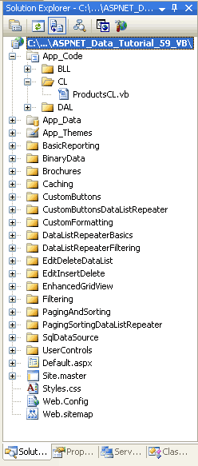
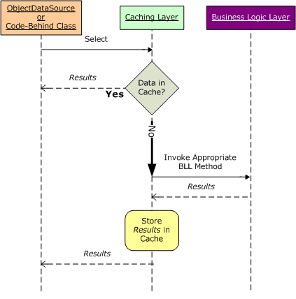
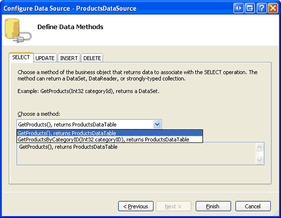

Caching Data in the Architecture (VB)
====================
by [Scott Mitchell](https://twitter.com/ScottOnWriting)

[Download Sample App](http://download.microsoft.com/download/4/a/7/4a7a3b18-d80e-4014-8e53-a6a2427f0d93/ASPNET_Data_Tutorial_59_VB.exe) or [Download PDF](caching-data-in-the-architecture-vb/_static/datatutorial59vb1.pdf)

> In the previous tutorial we learned how to apply caching at the Presentation Layer. In this tutorial we learn how to take advantage of our layered architecture to cache data at the Business Logic Layer. We do this by extending the architecture to include a Caching Layer.

## Introduction

As we saw in the preceding tutorial, caching the ObjectDataSource s data is as simple as setting a couple of properties. Unfortunately, the ObjectDataSource applies caching at the Presentation Layer, which tightly couples the caching policies with the ASP.NET page. One of the reasons for creating a layered architecture is to allow such couplings to be broken. The Business Logic Layer, for instance, decouples the business logic from the ASP.NET pages, while the Data Access Layer decouples the data access details. This decoupling of business logic and data access details is preferred, in part, because it makes the system more readable, more maintainable, and more flexible to change. It also allows for domain knowledge and division of labor a developer working on the Presentation Layer doesn t need to be familiar with the database s details in order to do her job. Decoupling the caching policy from the Presentation Layer offers similar benefits.

In this tutorial we will augment our architecture to include a *Caching Layer* (or CL for short) that employs our caching policy. The Caching Layer will include a `ProductsCL` class that provides access to product information with methods like `GetProducts()`, `GetProductsByCategoryID(categoryID)`, and so forth, that, when invoked, will first attempt to retrieve the data from the cache. If the cache is empty, these methods will invoke the appropriate `ProductsBLL` method in the BLL, which would in turn get the data from the DAL. The `ProductsCL` methods cache the data retrieved from the BLL before returning it.

As Figure 1 shows, the CL resides between the Presentation and Business Logic Layers.

**Figure 1**: The Caching Layer (CL) is Another Layer in Our Architecture

## Step 1: Creating the Caching Layer Classes

In this tutorial we will create a very simple CL with a single class `ProductsCL` that has only a handful of methods. Building a complete Caching Layer for the entire application would require creating `CategoriesCL`, `EmployeesCL`, and `SuppliersCL` classes, and providing a method in these Caching Layer classes for each data access or modification method in the BLL. As with the BLL and DAL, the Caching Layer should ideally be implemented as a separate Class Library project; however, we will implement it as a class in the `App_Code` folder.

To more cleanly separate the CL classes from the DAL and BLL classes, let s create a new subfolder in the `App_Code` folder. Right-click on the `App_Code` folder in the Solution Explorer, choose New Folder, and name the new folder `CL`. After creating this folder, add to it a new class named `ProductsCL.vb`.

**Figure 2**: Add a New Folder Named `CL` and a Class Named `ProductsCL.vb`

The `ProductsCL` class should include the same set of data access and modification methods as found in its corresponding Business Logic Layer class (`ProductsBLL`). Rather than creating all of these methods, let s just build a couple here to get a feel for the patterns used by the CL. In particular, we'll add the `GetProducts()` and `GetProductsByCategoryID(categoryID)` methods in Step 3 and an `UpdateProduct` overload in Step 4. You can add the remaining `ProductsCL` methods and `CategoriesCL`, `EmployeesCL`, and `SuppliersCL` classes at your leisure.

## Step 2: Reading and Writing to the Data Cache

The ObjectDataSource caching feature explored in the preceding tutorial internally uses the ASP.NET data cache to store the data retrieved from the BLL. The data cache can also be accessed programmatically from ASP.NET pages code-behind classes or from the classes in the web application s architecture. To read and write to the data cache from an ASP.NET page s code-behind class, use the following pattern:

[!code-vb[Main](caching-data-in-the-architecture-vb/samples/sample1.vb)]

The [`Cache` class](https://msdn.microsoft.com/en-us/library/system.web.caching.cache.aspx) s [`Insert` method](https://msdn.microsoft.com/en-us/library/system.web.caching.cache.insert.aspx) has a number of overloads. `Cache("key") = value` and `Cache.Insert(key, value)` are synonymous and both add an item to the cache using the specified key without a defined expiry. Typically, we want to specify an expiry when adding an item to the cache, either as a dependency, a time-based expiry, or both. Use one of the other `Insert` method s overloads to provide dependency- or time-based expiry information.

The Caching Layer s methods need to first check if the requested data is in the cache and, if so, return it from there. If the requested data is not in the cache, the appropriate BLL method needs to be invoked. Its return value should be cached and then returned, as the following sequence diagram illustrates.

**Figure 3**: The Caching Layer s Methods Return Data from the Cache if it s Available

The sequence depicted in Figure 3 is accomplished in the CL classes using the following pattern:

[!code-vb[Main](caching-data-in-the-architecture-vb/samples/sample2.vb)]

Here, *Type* is the type of data being stored in the cache `Northwind.ProductsDataTable`, for example while *key* is the key that uniquely identifies the cache item. If the item with the specified *key* is not in the cache, then *instance* will be `Nothing` and the data will be retrieved from the appropriate BLL method and added to the cache. By the time `Return instance` is reached, *instance* contains a reference to the data, either from the cache or pulled from the BLL.

Be sure to use the above pattern when accessing data from the cache. The following pattern, which, at first glance, looks equivalent, contains a subtle difference that introduces a race condition. Race conditions are difficult to debug because they reveal themselves sporadically and are difficult to reproduce.

[!code-vb[Main](caching-data-in-the-architecture-vb/samples/sample3.vb)]

The difference in this second, incorrect code snippet is that rather than storing a reference to the cached item in a local variable, the data cache is accessed directly in the conditional statement *and* in the `Return`. Imagine that when this code is reached, `Cache("key")` is not `Nothing`, but before the `Return` statement is reached, the system evicts *key* from the cache. In this rare case, the code will return `Nothing` rather than an object of the expected type.

> [!NOTE]
> The data cache is thread-safe, so you don't need to synchronize thread access for simple reads or writes. However, if you need to perform multiple operations on data in the cache that need to be atomic, you are responsible for implementing a lock or some other mechanism to ensure thread safety. See [Synchronizing Access to the ASP.NET Cache](http://www.ddj.com/184406369) for more information.

An item can be programmatically evicted from the data cache using the [`Remove` method](https://msdn.microsoft.com/en-us/library/system.web.caching.cache.remove.aspx) like so:

[!code-vb[Main](caching-data-in-the-architecture-vb/samples/sample4.vb)]

## Step 3: Returning Product Information from the`ProductsCL`Class

For this tutorial let s implement two methods for returning product information from the `ProductsCL` class: `GetProducts()` and `GetProductsByCategoryID(categoryID)`. Like with the `ProductsBL` class in the Business Logic Layer, the `GetProducts()` method in the CL returns information about all of the products as a `Northwind.ProductsDataTable` object, while `GetProductsByCategoryID(categoryID)` returns all of the products from a specified category.

The following code shows a portion of the methods in the `ProductsCL` class:

[!code-vb[Main](caching-data-in-the-architecture-vb/samples/sample5.vb)]

First, note the `DataObject` and `DataObjectMethodAttribute` attributes applied to the class and methods. These attributes provide information to the ObjectDataSource s wizard, indicating what classes and methods should appear in the wizard s steps. Since the CL classes and methods will be accessed from an ObjectDataSource in the Presentation Layer, I added these attributes to enhance the design-time experience. Refer back to the [Creating a Business Logic Layer](../introduction/creating-a-business-logic-layer-vb.md) tutorial for a more thorough description on these attributes and their effects.

In the `GetProducts()` and `GetProductsByCategoryID(categoryID)` methods, the data returned from the `GetCacheItem(key)` method is assigned to a local variable. The `GetCacheItem(key)` method, which we'll examine shortly, returns a particular item from the cache based on the specified *key*. If no such data is found in cache, it is retrieved from the corresponding `ProductsBLL` class method and then added to the cache using the `AddCacheItem(key, value)` method.

The `GetCacheItem(key)` and `AddCacheItem(key, value)` methods interface with the data cache, reading and writing values, respectively. The `GetCacheItem(key)` method is the simpler of the two. It simply returns the value from the Cache class using the passed-in *key*:

[!code-vb[Main](caching-data-in-the-architecture-vb/samples/sample6.vb)]

`GetCacheItem(key)` does not use *key* value as supplied, but instead calls the `GetCacheKey(key)` method, which returns the *key* prepended with ProductsCache-. The `MasterCacheKeyArray`, which holds the string ProductsCache, is also used by the `AddCacheItem(key, value)` method, as we'll see momentarily.

From an ASP.NET page s code-behind class, the data cache can be accessed using the `Page` class s [`Cache` property](https://msdn.microsoft.com/en-us/library/system.web.ui.page.cache.aspx), and allows for syntax like `Cache("key") = value`, as discussed in Step 2. From a class within the architecture, the data cache can be accessed using either `HttpRuntime.Cache` or `HttpContext.Current.Cache`. [Peter Johnson](https://weblogs.asp.net/pjohnson/default.aspx)'s blog entry [HttpRuntime.Cache vs. HttpContext.Current.Cache](https://weblogs.asp.net/pjohnson/httpruntime-cache-vs-httpcontext-current-cache) notes the slight performance advantage in using `HttpRuntime` instead of `HttpContext.Current`; consequently, `ProductsCL` uses `HttpRuntime`.

> [!NOTE]
> If your architecture is implemented using Class Library projects then you will need to add a reference to the `System.Web` assembly in order to use the [`HttpRuntime`](https://msdn.microsoft.com/en-us/library/system.web.httpruntime.aspx) and [`HttpContext`](https://msdn.microsoft.com/en-us/library/system.web.httpcontext.aspx) classes.

If the item is not found in the cache, the `ProductsCL` class s methods get the data from the BLL and add it to the cache using the `AddCacheItem(key, value)` method. To add *value* to the cache we could use the following code, which uses a 60 second time expiry:

[!code-vb[Main](caching-data-in-the-architecture-vb/samples/sample7.vb)]

`DateTime.Now.AddSeconds(CacheDuration)` specifies the time-based expiry 60 seconds in the future while [`System.Web.Caching.Cache.NoSlidingExpiration`](https://msdn.microsoft.com/en-us/library/system.web.caching.cache.noslidingexpiration(vs.80).aspx) indicates that there s no sliding expiration. While this `Insert` method overload has input parameters for both an absolute and sliding expiry, you can only provide one of the two. If you attempt to specify both an absolute time and a time span, the `Insert` method will throw an `ArgumentException` exception.

> [!NOTE]
> This implementation of the `AddCacheItem(key, value)` method currently has some shortcomings. We'll address and overcome these issues in Step 4.

## Step 4: Invalidating the Cache When the Data is Modified Through the Architecture

Along with data retrieval methods, the Caching Layer needs to provide the same methods as the BLL for inserting, updating, and deleting data. The CL s data modification methods do not modify the cached data, but rather call the BLL s corresponding data modification method and then invalidate the cache. As we saw in the preceding tutorial, this is the same behavior that the ObjectDataSource applies when its caching features are enabled and its `Insert`, `Update`, or `Delete` methods are invoked.

The following `UpdateProduct` overload illustrates how to implement the data modification methods in the CL:

[!code-vb[Main](caching-data-in-the-architecture-vb/samples/sample8.vb)]

The appropriate data modification Business Logic Layer method is invoked, but before its response is returned we need to invalidate the cache. Unfortunately, invalidating the cache is not straightforward because the `ProductsCL` class s `GetProducts()` and `GetProductsByCategoryID(categoryID)` methods each add items to the cache with different keys, and the `GetProductsByCategoryID(categoryID)` method adds a different cache item for each unique *categoryID*.

When invalidating the cache, we need to remove *all* of the items that may have been added by the `ProductsCL` class. This can be accomplished by associating a *cache dependency* with the each item added to the cache in the `AddCacheItem(key, value)` method. In general, a cache dependency can be another item in the cache, a file on the file system, or data from a Microsoft SQL Server database. When the dependency changes or is removed from the cache, the cache items it is associated with are automatically evicted from the cache. For this tutorial, we want to create an additional item in the cache that serves as a cache dependency for all items added through the `ProductsCL` class. That way, all of these items can be removed from the cache by simply removing the cache dependency.

Let s update the `AddCacheItem(key, value)` method so that each item added to the cache through this method is associated with a single cache dependency:

[!code-vb[Main](caching-data-in-the-architecture-vb/samples/sample9.vb)]

`MasterCacheKeyArray` is a string array that holds a single value, ProductsCache. First, a cache item is added to the cache and assigned the current date and time. If the cache item already exists, it is updated. Next, a cache dependency is created. The [`CacheDependency` class](https://msdn.microsoft.com/en-US/library/system.web.caching.cachedependency(VS.80).aspx) s constructor has a number of overloads, but the one being used in here expects two `String` array inputs. The first one specifies the set of files to be used as dependencies. Since we don t want to use any file-based dependencies, a value of `Nothing` is used for the first input parameter. The second input parameter specifies the set of cache keys to use as dependencies. Here we specify our single dependency, `MasterCacheKeyArray`. The `CacheDependency` is then passed into the `Insert` method.

With this modification to `AddCacheItem(key, value)`, invaliding the cache is as simple as removing the dependency.

[!code-vb[Main](caching-data-in-the-architecture-vb/samples/sample10.vb)]

## Step 5: Calling the Caching Layer from the Presentation Layer

The Caching Layer s classes and methods can be used to work with data using the techniques we ve examined throughout these tutorials. To illustrate working with cached data, save your changes to the `ProductsCL` class and then open the `FromTheArchitecture.aspx` page in the `Caching` folder and add a GridView. From the GridView s smart tag, create a new ObjectDataSource. In the wizard s first step you should see the `ProductsCL` class as one of the options from the drop-down list.

**Figure 4**: The `ProductsCL` Class is Included in the Business Object Drop-Down List ([Click to view full-size image](caching-data-in-the-architecture-vb/_static/image6.png))

After selecting `ProductsCL`, click Next. The drop-down list in the SELECT tab has two items - `GetProducts()` and `GetProductsByCategoryID(categoryID)` and the UPDATE tab has the sole `UpdateProduct` overload. Choose the `GetProducts()` method from the SELECT tab and the `UpdateProducts` method from the UPDATE tab and click Finish.

**Figure 5**: The `ProductsCL` Class s Methods are Listed in the Drop-Down Lists ([Click to view full-size image](caching-data-in-the-architecture-vb/_static/image9.png))

After completing the wizard, Visual Studio will set the ObjectDataSource s `OldValuesParameterFormatString` property to `original_{0}` and add the appropriate fields to the GridView. Change the `OldValuesParameterFormatString` property back to its default value, `{0}`, and configure the GridView to support paging, sorting, and editing. Since the `UploadProducts` overload used by the CL accepts only the edited product s name and price, limit the GridView so that only these fields are editable.

In the preceding tutorial we defined a GridView to include fields for the `ProductName`, `CategoryName`, and `UnitPrice` fields. Feel free to replicate this formatting and structure, in which case your GridView and ObjectDataSource s declarative markup should look similar to the following:

[!code-aspx[Main](caching-data-in-the-architecture-vb/samples/sample11.aspx)]

At this point we have a page that uses the Caching Layer. To see the cache in action, set breakpoints in the `ProductsCL` class s `GetProducts()` and `UpdateProduct` methods. Visit the page in a browser and step through the code when sorting and paging in order to see the data pulled from the cache. Then update a record and note that the cache is invalidated and, consequently, it is retrieved from the BLL when the data is rebound to the GridView.

> [!NOTE]
> The Caching Layer provided in the download accompanying this article is not complete. It contains only one class, `ProductsCL`, which only sports a handful of methods. Moreover, only a single ASP.NET page uses the CL (`~/Caching/FromTheArchitecture.aspx`) all others still reference the BLL directly. If you plan on using a CL in your application, all calls from the Presentation Layer should go to the CL, which would require that the CL s classes and methods covered those classes and methods in the BLL currently used by the Presentation Layer.

## Summary

While caching can be applied at the Presentation Layer with ASP.NET 2.0 s SqlDataSource and ObjectDataSource controls, ideally caching responsibilities would be delegated to a separate layer in the architecture. In this tutorial we created a Caching Layer that resides between the Presentation Layer and the Business Logic Layer. The Caching Layer needs to provide the same set of classes and methods that exist in the BLL and are called from the Presentation Layer.

The Caching Layer examples we explored in this and the preceding tutorials exhibited *reactive loading*. With reactive loading, the data is loaded into the cache only when a request for the data is made and that data is missing from the cache. Data can also be *proactively loaded* into the cache, a technique that loads the data into the cache before it is actually needed. In the next tutorial we'll see an example of proactive loading when we look at how to store static values into the cache at application startup.

Happy Programming!

## About the Author

[Scott Mitchell](http://www.4guysfromrolla.com/ScottMitchell.shtml), author of seven ASP/ASP.NET books and founder of [4GuysFromRolla.com](http://www.4guysfromrolla.com), has been working with Microsoft Web technologies since 1998. Scott works as an independent consultant, trainer, and writer. His latest book is [*Sams Teach Yourself ASP.NET 2.0 in 24 Hours*](https://www.amazon.com/exec/obidos/ASIN/0672327384/4guysfromrollaco). He can be reached at [mitchell@4GuysFromRolla.com.](mailto:mitchell@4GuysFromRolla.com) or via his blog, which can be found at [http://ScottOnWriting.NET](http://ScottOnWriting.NET).

## Special Thanks To

This tutorial series was reviewed by many helpful reviewers. Lead reviewer for this tutorial was Teresa Murphy. Interested in reviewing my upcoming MSDN articles? If so, drop me a line at [mitchell@4GuysFromRolla.com.](mailto:mitchell@4GuysFromRolla.com)

>[!div class="step-by-step"]
[Previous](caching-data-with-the-objectdatasource-vb.md)
[Next](caching-data-at-application-startup-vb.md)