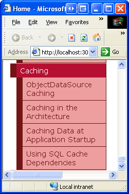
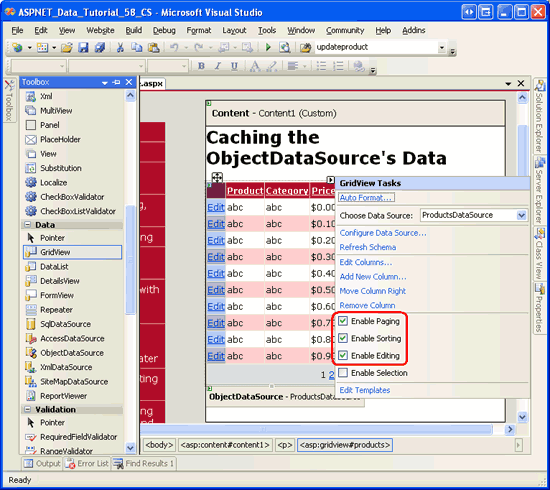
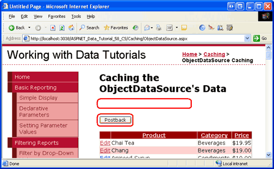
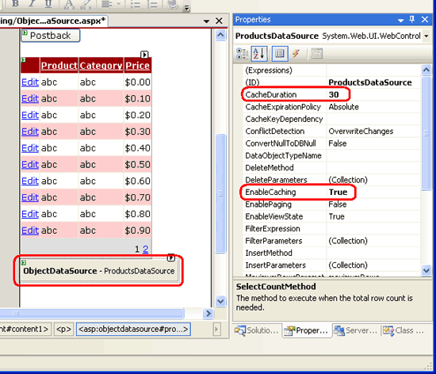

Caching Data with the ObjectDataSource (VB)
====================
by [Scott Mitchell](https://twitter.com/ScottOnWriting)

[Download Sample App](http://download.microsoft.com/download/4/a/7/4a7a3b18-d80e-4014-8e53-a6a2427f0d93/ASPNET_Data_Tutorial_58_VB.exe) or [Download PDF](caching-data-with-the-objectdatasource-vb/_static/datatutorial58vb1.pdf)

> Caching can mean the difference between a slow and a fast Web application. This tutorial is the first of four that take a detailed look at caching in ASP.NET. Learn the key concepts of caching and how to apply caching to the Presentation Layer through the ObjectDataSource control.

## Introduction

In computer science, *caching* is the process of taking data or information that is expensive to obtain and storing a copy of it in a location that is quicker to access. For data-driven applications, large and complex queries commonly consume the majority of the application s execution time. Such an application s performance, then, can often be improved by storing the results of expensive database queries in the application s memory.

ASP.NET 2.0 offers a variety of caching options. An entire web page or User Control s rendered markup can be cached through *output caching*. The ObjectDataSource and SqlDataSource controls provide caching capabilities as well, thereby allowing data to be cached at the control level. And ASP.NET s *data cache* provides a rich caching API that enables page developers to programmatically cache objects. In this tutorial and the next three we'll examine using the ObjectDataSource s caching features as well as the data cache. We'll also explore how to cache application-wide data at startup and how to keep cached data fresh through the use of SQL cache dependencies. These tutorials do not explore output caching. For a detailed look at output caching, see [Output Caching in ASP.NET 2.0](http://aspnet.4guysfromrolla.com/articles/121306-1.aspx).

Caching can be applied at any place in the architecture, from the Data Access Layer up through the Presentation Layer. In this tutorial we'll look at applying caching to the Presentation Layer through the ObjectDataSource control. In the next tutorial we'll examine caching data at the Business Logic Layer.

## Key Caching Concepts

Caching can greatly improve an application s overall performance and scalability by taking data that is expensive to generate and storing a copy of it in a location that can be more efficiently accessed. Since the cache holds just a copy of the actual, underlying data, it can become outdated, or *stale*, if the underlying data changes. To combat this, a page developer can indicate criteria by which the cache item will be *evicted* from the cache, using either:

- **Time-based criteria** an item may be added to the cache for an absolute or sliding duration. For example, a page developer may indicate a duration of, say, 60 seconds. With an absolute duration, the cached item is evicted 60 seconds after it was added to cache, regardless of how frequently it was accessed. With a sliding duration, the cached item is evicted 60 seconds after the last access.
- **Dependency-based criteria** a dependency can be associated with an item when added to the cache. When the item s dependency changes it is evicted from the cache. The dependency may be a file, another cache item, or a combination of the two. ASP.NET 2.0 also allows SQL cache dependencies, which enable developers to add an item to the cache and have it evicted when the underlying database data changes. We will examine SQL cache dependencies in the upcoming [Using SQL Cache Dependencies](using-sql-cache-dependencies-vb.md) tutorial.

Regardless of the eviction criteria specified, an item in the cache may be *scavenged* before the time-based or dependency-based criteria has been met. If the cache has reached its capacity, existing items must be removed before new ones can be added. Consequently, when programmatically working with cached data it s vital that you always assume that the cached data may not be present. We'll look at the pattern to use when accessing data from the cache programmatically in our next tutorial, *Caching Data in the Architecture*.

Caching provides an economical means for squeezing more performance from an application. As [Steven Smith](http://aspadvice.com/blogs/ssmith/) articulates in his article [ASP.NET Caching: Techniques and Best Practices](https://msdn.microsoft.com/en-us/library/aa478965.aspx):

Caching can be a good way to get good enough performance without requiring a lot of time and analysis. Memory is cheap, so if you can get the performance you need by caching the output for 30 seconds instead of spending a day or a week trying to optimize your code or database, do the caching solution (assuming 30-second old data is ok) and move on. Eventually, poor design will probably catch up to you, so of course you should try to design your applications correctly. But if you just need to get good enough performance today, caching can be an excellent [approach], buying you time to refactor your application at a later date when you have the time to do so.

While caching can provide appreciable performance enhancements, it is not applicable in all situations, such as with applications that use real-time, frequently-updating data, or where even shortly-lived stale data is unacceptable. But for the majority of applications, caching should be used. For more background on caching in ASP.NET 2.0, refer to the [Caching for Performance](https://quickstarts.asp.net/QuickStartv20/aspnet/doc/caching/default.aspx) section of the [ASP.NET 2.0 QuickStart Tutorials](https://quickstarts.asp.net/QuickStartv20/aspnet/).

## Step 1: Creating the Caching Web Pages

Before we start our exploration of the ObjectDataSource s caching features, let s first take a moment to create the ASP.NET pages in our website project that we'll need for this tutorial and the next three. Start by adding a new folder named `Caching`. Next, add the following ASP.NET pages to that folder, making sure to associate each page with the `Site.master` master page:

- `Default.aspx`
- `ObjectDataSource.aspx`
- `FromTheArchitecture.aspx`
- `AtApplicationStartup.aspx`
- `SqlCacheDependencies.aspx`

**Figure 1**: Add the ASP.NET Pages for the Caching-Related Tutorials

Like in the other folders, `Default.aspx` in the `Caching` folder will list the tutorials in its section. Recall that the `SectionLevelTutorialListing.ascx` User Control provides this functionality. Therefore, add this User Control to `Default.aspx` by dragging it from the Solution Explorer onto the page s Design view.

**Figure 2**: Figure 2: Add the `SectionLevelTutorialListing.ascx` User Control to `Default.aspx` ([Click to view full-size image](caching-data-with-the-objectdatasource-vb/_static/image4.png))

Lastly, add these pages as entries to the `Web.sitemap` file. Specifically, add the following markup after the Working with Binary Data `<siteMapNode>`:

[!code-xml[Main](caching-data-with-the-objectdatasource-vb/samples/sample1.xml)]

After updating `Web.sitemap`, take a moment to view the tutorials website through a browser. The menu on the left now includes items for the caching tutorials.

**Figure 3**: The Site Map Now Includes Entries for the Caching Tutorials

## Step 2: Displaying a List of Products in a Web Page

This tutorial explores how to use the ObjectDataSource control s built-in caching features. Before we can look at these features, though, we first need a page to work from. Let s create a web page that uses a GridView to list product information retrieved by an ObjectDataSource from the `ProductsBLL` class.

Start by opening the `ObjectDataSource.aspx` page in the `Caching` folder. Drag a GridView from the Toolbox onto the Designer, set its `ID` property to `Products`, and, from its smart tag, choose to bind it to a new ObjectDataSource control named `ProductsDataSource`. Configure the ObjectDataSource to work with the `ProductsBLL` class.

**Figure 4**: Configure the ObjectDataSource to Use the `ProductsBLL` Class ([Click to view full-size image](caching-data-with-the-objectdatasource-vb/_static/image8.png))

For this page, let s create an editable GridView so that we can examine what happens when data cached in the ObjectDataSource is modified through the GridView s interface. Leave the drop-down list in the SELECT tab set to its default, `GetProducts()`, but change the selected item in the UPDATE tab to the `UpdateProduct` overload that accepts `productName`, `unitPrice`, and `productID` as its input parameters.

**Figure 5**: Set the UPDATE Tab s Drop-Down List to the Appropriate `UpdateProduct` Overload ([Click to view full-size image](caching-data-with-the-objectdatasource-vb/_static/image11.png))

Finally, set the drop-down lists in the INSERT and DELETE tabs to (None) and click Finish. Upon completing the Configure Data Source wizard, Visual Studio sets the ObjectDataSource s `OldValuesParameterFormatString` property to `original_{0}`. As discussed in the [An Overview of Inserting, Updating, and Deleting Data](../editing-inserting-and-deleting-data/an-overview-of-inserting-updating-and-deleting-data-vb.md) tutorial, this property needs to be removed from the declarative syntax or set back to its default value, `{0}`, in order for our update workflow to proceed without error.

Furthermore, at the completion of the wizard Visual Studio adds a field to the GridView for each of the product data fields. Remove all but the `ProductName`, `CategoryName`, and `UnitPrice` BoundFields. Next, update the `HeaderText` properties of each of these BoundFields to Product, Category, and Price, respectively. Since the `ProductName` field is required, convert the BoundField into a TemplateField and add a RequiredFieldValidator to the `EditItemTemplate`. Similarly, convert the `UnitPrice` BoundField into a TemplateField and add a CompareValidator to ensure that the value entered by the user is a valid currency value that s greater than or equal to zero. In addition to these modifications, feel free to perform any aesthetic changes, such as right-aligning the `UnitPrice` value, or specifying the formatting for the `UnitPrice` text in its read-only and editing interfaces.

Make the GridView editable by checking the Enable Editing checkbox in the GridView s smart tag. Also check the Enable Paging and Enable Sorting checkboxes.

> [!NOTE]
> Need a review of how to customize the GridView s editing interface? If so, refer back to the [Customizing the Data Modification Interface](../editing-inserting-and-deleting-data/customizing-the-data-modification-interface-vb.md) tutorial.

**Figure 6**: Enable GridView Support for Editing, Sorting, and Paging ([Click to view full-size image](caching-data-with-the-objectdatasource-vb/_static/image14.png))

After making these GridView modifications, the GridView and ObjectDataSource s declarative markup should look similar to the following:

[!code-aspx[Main](caching-data-with-the-objectdatasource-vb/samples/sample2.aspx)]

As Figure 7 shows, the editable GridView lists the name, category, and price of each of the products in the database. Take a moment to test out the page s functionality sort the results, page through them, and edit a record.

**Figure 7**: Each Product s Name, Category, and Price is Listed in a Sortable, Pageable, Editable GridView ([Click to view full-size image](caching-data-with-the-objectdatasource-vb/_static/image17.png))

## Step 3: Examining When the ObjectDataSource is Requesting Data

The `Products` GridView retrieves its data to display by invoking the `Select` method of the `ProductsDataSource` ObjectDataSource. This ObjectDataSource creates an instance of the Business Logic Layer s `ProductsBLL` class and calls its `GetProducts()` method, which in turn calls the Data Access Layer s `ProductsTableAdapter` s `GetProducts()` method. The DAL method connects to the Northwind database and issues the configured `SELECT` query. This data is then returned to the DAL, which packages it up in a `NorthwindDataTable`. The DataTable object is returned to the BLL, which returns it to the ObjectDataSource, which returns it to the GridView. The GridView then creates a `GridViewRow` object for each `DataRow` in the DataTable, and each `GridViewRow` is eventually rendered into the HTML that is returned to the client and displayed on the visitor s browser.

This sequence of events happens each and every time the GridView needs to bind to its underlying data. That happens when the page is first visited, when moving from one page of data to another, when sorting the GridView, or when modifying the GridView s data through its built-in editing or deleting interfaces. If the GridView s view state is disabled, the GridView will be rebound on each and every postback as well. The GridView can also be explicitly rebound to its data by calling its `DataBind()` method.

To fully appreciate the frequency with which the data is retrieved from the database, let s display a message indicating when the data is being re-retrieved. Add a Label Web control above the GridView named `ODSEvents`. Clear out its `Text` property and set its `EnableViewState` property to `False`. Underneath the Label, add a Button Web control and set its `Text` property to Postback .

**Figure 8**: Add a Label and Button to the Page Above the GridView ([Click to view full-size image](caching-data-with-the-objectdatasource-vb/_static/image20.png))

During the data access workflow, the ObjectDataSource s `Selecting` event fires before the underlying object is created and its configured method invoked. Create an event handler for this event and add the following code:

[!code-vb[Main](caching-data-with-the-objectdatasource-vb/samples/sample3.vb)]

Each time the ObjectDataSource makes a request to the architecture for data, the Label will display the text Selecting event fired .

Visit this page in a browser. When the page is first visited, the text Selecting event fired is shown. Click the Postback button and note that the text disappears (assuming that the GridView s `EnableViewState` property is set to `True`, the default). This is because, on postback, the GridView is reconstructed from its view state and therefore doesn t turn to the ObjectDataSource for its data. Sorting, paging, or editing the data, however, causes the GridView to rebind to its data source, and therefore the Selecting event fired text reappears.

**Figure 9**: Whenever the GridView is Rebound to its Data Source, Selecting event fired is Displayed ([Click to view full-size image](caching-data-with-the-objectdatasource-vb/_static/image23.png))

**Figure 10**: Clicking the Postback Button Causes the GridView to be Reconstructed from its View State ([Click to view full-size image](caching-data-with-the-objectdatasource-vb/_static/image26.png))

It may seem wasteful to retrieve the database data each time the data is paged through or sorted. After all, since we re using default paging, the ObjectDataSource has retrieved all of the records when displaying the first page. Even if the GridView does not provide sorting and paging support, the data must be retrieved from the database each time the page is first visited by any user (and on every postback, if view state is disabled). But if the GridView is showing the same data to all users, these extra database requests are superfluous. Why not cache the results returned from the `GetProducts()` method and bind the GridView to those cached results?

## Step 4: Caching the Data Using the ObjectDataSource

By simply setting a few properties, the ObjectDataSource can be configured to automatically cache its retrieved data in the ASP.NET data cache. The following list summarizes the cache-related properties of the ObjectDataSource:

- [EnableCaching](https://msdn.microsoft.com/en-us/library/system.web.ui.webcontrols.objectdatasource.enablecaching.aspx) must be set to `True` to enable caching. The default is `False`.
- [CacheDuration](https://msdn.microsoft.com/en-us/library/system.web.ui.webcontrols.objectdatasource.cacheduration.aspx) the amount of time, in seconds, that the data is cached. The default is 0. The ObjectDataSource will only cache data if `EnableCaching` is `True` and `CacheDuration` is set to a value greater than zero.
- [CacheExpirationPolicy](https://msdn.microsoft.com/en-us/library/system.web.ui.webcontrols.objectdatasource.cacheexpirationpolicy.aspx) can be set to `Absolute` or `Sliding`. If `Absolute`, the ObjectDataSource caches its retrieved data for `CacheDuration` seconds; if `Sliding`, the data expires only after it has not been accessed for `CacheDuration` seconds. The default is `Absolute`.
- [CacheKeyDependency](https://msdn.microsoft.com/en-us/library/system.web.ui.webcontrols.objectdatasource.cachekeydependency.aspx) use this property to associate the ObjectDataSource s cache entries with an existing cache dependency. The ObjectDataSource s data entries can be prematurely evicted from the cache by expiring its associated `CacheKeyDependency`. This property is most commonly used to associate a SQL cache dependency with the ObjectDataSource s cache, a topic we'll explore in the future [Using SQL Cache Dependencies](using-sql-cache-dependencies-vb.md) tutorial.

Let s configure the `ProductsDataSource` ObjectDataSource to cache its data for 30 seconds on an absolute scale. Set the ObjectDataSource s `EnableCaching` property to `True` and its `CacheDuration` property to 30. Leave the `CacheExpirationPolicy` property set to its default, `Absolute`.

**Figure 11**: Configure the ObjectDataSource to Cache its Data for 30 Seconds ([Click to view full-size image](caching-data-with-the-objectdatasource-vb/_static/image29.png))

Save your changes and revisit this page in a browser. The Selecting event fired text will appear when you first visit the page, as initially the data is not in the cache. But subsequent postbacks triggered by clicking the Postback button, sorting, paging, or clicking the Edit or Cancel buttons does *not* redisplay the Selecting event fired text. This is because the `Selecting` event only fires when the ObjectDataSource gets its data from its underlying object; the `Selecting` event does not fire if the data is pulled from the data cache.

After 30 seconds, the data will be evicted from the cache. The data will also be evicted from the cache if the ObjectDataSource s `Insert`, `Update`, or `Delete` methods are invoked. Consequently, after 30 seconds have passed or the Update button has been clicked, sorting, paging, or clicking the Edit or Cancel buttons will cause the ObjectDataSource to get its data from its underlying object, displaying the Selecting event fired text when the `Selecting` event fires. These returned results are placed back into the data cache.

> [!NOTE]
> If you see the Selecting event fired text frequently, even when you expect the ObjectDataSource to be working with cached data, it may be due to memory constraints. If there is not enough free memory, the data added to the cache by the ObjectDataSource may have been scavenged. If the ObjectDataSource doesn t appear to be correctly caching the data or only caches the data sporadically, close some applications to free memory and try again.

Figure 12 illustrates the ObjectDataSource s caching workflow. When the Selecting event fired text appears on your screen, it is because the data was not in the cache and had to be retrieved from the underlying object. When this text is missing, however, it s because the data was available from the cache. When the data is returned from the cache there s no call to the underlying object and, therefore, no database query executed.

**Figure 12**: The ObjectDataSource Stores and Retrieves its Data from the Data Cache

Each ASP.NET application has its own data cache instance that s shared across all pages and visitors. That means that the data stored in the data cache by the ObjectDataSource is likewise shared across all users who visit the page. To verify this, open the `ObjectDataSource.aspx` page in a browser. When first visiting the page, the Selecting event fired text will appear (assuming that the data added to the cache by previous tests has, by now, been evicted). Open a second browser instance and copy and paste the URL from the first browser instance to the second. In the second browser instance, the Selecting event fired text is not shown because it s using the same cached data as the first.

When inserting its retrieved data into the cache, the ObjectDataSource uses a cache key value that includes: the `CacheDuration` and `CacheExpirationPolicy` property values; the type of the underlying business object being used by the ObjectDataSource, which is specified via the [`TypeName` property](https://msdn.microsoft.com/en-us/library/system.web.ui.webcontrols.objectdatasource.typename.aspx) (`ProductsBLL`, in this example); the value of the `SelectMethod` property and the name and values of the parameters in the `SelectParameters` collection; and the values of its `StartRowIndex` and `MaximumRows` properties, which are used when implementing [custom paging](../paging-and-sorting/paging-and-sorting-report-data-vb.md).

Crafting the cache key value as a combination of these properties ensures a unique cache entry as these values change. For example, in past tutorials we ve looked at using the `ProductsBLL` class s `GetProductsByCategoryID(categoryID)`, which returns all products for a specified category. One user might come to the page and view beverages, which has a `CategoryID` of 1. If the ObjectDataSource cached its results without regard for the `SelectParameters` values, when another user came to the page to view condiments while the beverages products were in the cache, they d see the cached beverage products rather than condiments. By varying the cache key by these properties, which include the values of the `SelectParameters`, the ObjectDataSource maintains a separate cache entry for beverages and condiments.

## Stale Data Concerns

The ObjectDataSource automatically evicts its items from the cache when any one of its `Insert`, `Update`, or `Delete` methods is invoked. This helps protect against stale data by clearing out the cache entries when the data is modified through the page. However, it is possible for an ObjectDataSource using caching to still display stale data. In the simplest case, it can be due to the data changing directly within the database. Perhaps a database administrator just ran a script that modifies some of the records in the database.

This scenario could also unfold in a more subtle way. While the ObjectDataSource evicts its items from the cache when one of its data modification methods is called, the cached items removed are for the ObjectDataSource s particular combination of property values (`CacheDuration`, `TypeName`, `SelectMethod`, and so on). If you have two ObjectDataSources that use different `SelectMethods` or `SelectParameters`, but still can update the same data, then one ObjectDataSource may update a row and invalidate its own cache entries, but the corresponding row for the second ObjectDataSource will still be served from the cached. I encourage you to create pages to exhibit this functionality. Create a page that displays an editable GridView that pulls its data from an ObjectDataSource that uses caching and is configured to get data from the `ProductsBLL` class s `GetProducts()` method. Add another editable GridView and ObjectDataSource to this page (or another one), but for this second ObjectDataSource have it use the `GetProductsByCategoryID(categoryID)` method. Since the two ObjectDataSources `SelectMethod` properties differ, they ll each have their own cached values. If you edit a product in one grid, the next time you bind the data back to the other grid (by paging, sorting, and so forth), it will still serve the old, cached data and not reflect the change that was made from the other grid.

In short, only use time-based expiries if you are willing to have the potential of stale data, and use shorter expiries for scenarios where the freshness of data is important. If stale data is not acceptable, either forgo caching or use SQL cache dependencies (assuming it is database data you re caching). We'll explore SQL cache dependencies in a future tutorial.

## Summary

In this tutorial we examined the ObjectDataSource s built-in caching capabilities. By simply setting a few properties, we can instruct the ObjectDataSource to cache the results returned from the specified `SelectMethod` into the ASP.NET data cache. The `CacheDuration` and `CacheExpirationPolicy` properties indicate the duration the item is cached and whether it is an absolute or sliding expiration. The `CacheKeyDependency` property associates all of the ObjectDataSource s cache entries with an existing cache dependency. This can be used to evict the ObjectDataSource s entries from the cache before the time-based expiration is reached, and is typically used with SQL cache dependencies.

Since the ObjectDataSource simply caches its values to the data cache, we could replicate the ObjectDataSource s built-in functionality programmatically. It doesn t make sense to do this at the Presentation Layer, since the ObjectDataSource offers this functionality out of the box, but we can implement caching capabilities in a separate layer of the architecture. To do so, we'll need to repeat the same logic used by the ObjectDataSource. We'll explore how to programmatically work with the data cache from within the architecture in our next tutorial.

Happy Programming!

## Further Reading

For more information on the topics discussed in this tutorial, refer to the following resources:

- [ASP.NET Caching: Techniques and Best Practices](https://msdn.microsoft.com/en-us/library/aa478965.aspx)
- [Caching Architecture Guide for .NET Framework Applications](https://msdn.microsoft.com/en-us/library/ee817645.aspx)
- [Output Caching in ASP.NET 2.0](http://aspnet.4guysfromrolla.com/articles/121306-1.aspx)

## About the Author

[Scott Mitchell](http://www.4guysfromrolla.com/ScottMitchell.shtml), author of seven ASP/ASP.NET books and founder of [4GuysFromRolla.com](http://www.4guysfromrolla.com), has been working with Microsoft Web technologies since 1998. Scott works as an independent consultant, trainer, and writer. His latest book is [*Sams Teach Yourself ASP.NET 2.0 in 24 Hours*](https://www.amazon.com/exec/obidos/ASIN/0672327384/4guysfromrollaco). He can be reached at [mitchell@4GuysFromRolla.com.](mailto:mitchell@4GuysFromRolla.com) or via his blog, which can be found at [http://ScottOnWriting.NET](http://ScottOnWriting.NET).

## Special Thanks To

This tutorial series was reviewed by many helpful reviewers. Lead reviewer for this tutorial was Teresa Murphy. Interested in reviewing my upcoming MSDN articles? If so, drop me a line at [mitchell@4GuysFromRolla.com.](mailto:mitchell@4GuysFromRolla.com)

>[!div class="step-by-step"]
[Previous](using-sql-cache-dependencies-cs.md)
[Next](caching-data-in-the-architecture-vb.md)