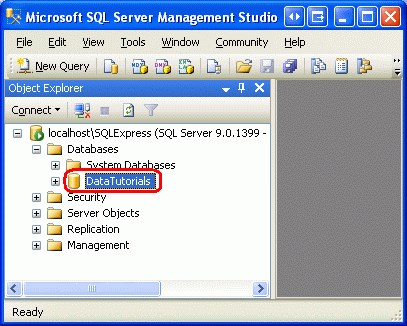
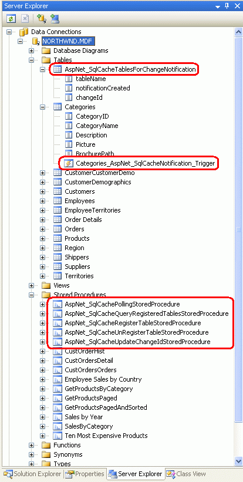
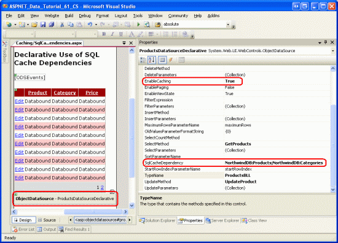
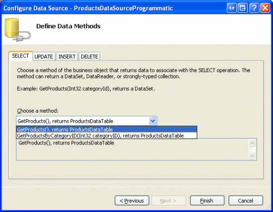

Using SQL Cache Dependencies (VB)
====================
by [Scott Mitchell](https://twitter.com/ScottOnWriting)

[Download Code](http://download.microsoft.com/download/3/9/f/39f92b37-e92e-4ab3-909e-b4ef23d01aa3/ASPNET_Data_Tutorial_61_VB.zip) or [Download PDF](using-sql-cache-dependencies-vb/_static/datatutorial61vb1.pdf)

> The simplest caching strategy is to allow cached data to expire after a specified period of time. But this simple approach means that the cached data maintains no association with its underlying data source, resulting in stale data that is held too long or current data that is expired too soon. A better approach is to use the SqlCacheDependency class so that data remains cached until its underlying data has been modified in the SQL database. This tutorial shows you how.

## Introduction

The caching techniques examined in the [Caching Data with the ObjectDataSource](caching-data-with-the-objectdatasource-vb.md) and [Caching Data in the Architecture](caching-data-in-the-architecture-vb.md) tutorials used a time-based expiry to evict the data from the cache after a specified period. This approach is the simplest way to balance the performance gains of caching against data staleness. By selecting a time expiry of *x* seconds, a page developer concedes to enjoy the performance benefits of caching for only *x* seconds, but can rest easy that her data will never be stale longer than a maximum of *x* seconds. Of course, for static data, *x* can be extended to the lifetime of the web application, as was examined in the [Caching Data at Application Startup](caching-data-at-application-startup-vb.md) tutorial.

When caching database data, a time-based expiry is often chosen for its ease of use but is frequently an inadequate solution. Ideally, the database data would remain cached until the underlying data has been modified in the database; only then would the cache be evicted. This approach maximizes the performance benefits of caching and minimizes the duration of stale data. However, in order to enjoy these benefits there must be some system in place that knows when the underlying database data has been modified and evicts the corresponding items from the cache. Prior to ASP.NET 2.0, page developers were responsible for implementing this system.

ASP.NET 2.0 provides a [`SqlCacheDependency` class](https://msdn.microsoft.com/en-us/library/system.web.caching.sqlcachedependency.aspx) and the necessary infrastructure to determine when a change has occurred in the database so that the corresponding cached items can be evicted. There are two techniques for determining when the underlying data has changed: notification and polling. After discussing the differences between notification and polling, we'll create the infrastructure necessary to support polling and then explore how to use the `SqlCacheDependency` class in declarative and programmatically scenarios.

## Understanding Notification and Polling

There are two techniques that can be used to determine when the data in a database has been modified: notification and polling. With notification, the database automatically alerts the ASP.NET runtime when the results of a particular query have been changed since the query was last executed, at which point the cached items associated with the query are evicted. With polling, the database server maintains information about when particular tables have last been updated. The ASP.NET runtime periodically polls the database to check what tables have changed since they were entered into the cache. Those tables whose data has been modified have their associated cache items evicted.

The notification option requires less setup than polling and is more granular since it tracks changes at the query level rather than at the table level. Unfortunately, notifications are only available in the full editions of Microsoft SQL Server 2005 (i.e., the non-Express editions). However, the polling option can be used for all versions of Microsoft SQL Server from 7.0 to 2005. Since these tutorials use the Express edition of SQL Server 2005, we will focus on setting up and using the polling option. Consult the Further Reading section at the end of this tutorial for further resources on SQL Server 2005 s notification capabilities.

With polling, the database must be configured to include a table named `AspNet_SqlCacheTablesForChangeNotification` that has three columns - `tableName`, `notificationCreated`, and `changeId`. This table contains a row for each table that has data that might need to be used in a SQL cache dependency in the web application. The `tableName` column specifies the name of the table while `notificationCreated` indicates the date and time the row was added to the table. The `changeId` column is of type `int` and has an initial value of 0. Its value is incremented with each modification to the table.

In addition to the `AspNet_SqlCacheTablesForChangeNotification` table, the database also needs to include triggers on each of the tables that may appear in a SQL cache dependency. These triggers are executed whenever a row is inserted, updated, or deleted and increment the table s `changeId` value in `AspNet_SqlCacheTablesForChangeNotification`.

The ASP.NET runtime tracks the current `changeId` for a table when caching data using a `SqlCacheDependency` object. The database is periodically checked and any `SqlCacheDependency` objects whose `changeId` differs from the value in the database are evicted since a differing `changeId` value indicates that there has been a change to the table since the data was cached.

## Step 1: Exploring the`aspnet_regsql.exe`Command Line Program

With the polling approach the database must be setup to contain the infrastructure described above: a predefined table (`AspNet_SqlCacheTablesForChangeNotification`), a handful of stored procedures, and triggers on each of the tables that may be used in SQL cache dependencies in the web application. These tables, stored procedures, and triggers can be created through the command line program `aspnet_regsql.exe`, which is found in the `$WINDOWS$\Microsoft.NET\Framework\version` folder. To create the `AspNet_SqlCacheTablesForChangeNotification` table and associated stored procedures, run the following from the command line:

[!code-console[Main](using-sql-cache-dependencies-vb/samples/sample1.cmd)]

> [!NOTE]
> To execute these commands the specified database login must be in the [`db_securityadmin`](https://msdn.microsoft.com/en-us/library/ms188685.aspx) and [`db_ddladmin`](https://msdn.microsoft.com/en-us/library/ms190667.aspx) roles. To examine the T-SQL sent to the database by the `aspnet_regsql.exe` command line program, refer to [this blog entry](http://scottonwriting.net/sowblog/posts/10709.aspx).

For example, to add the infrastructure for polling to a Microsoft SQL Server database named `pubs` on a database server named `ScottsServer` using Windows Authentication, navigate to the appropriate directory and, from the command line, enter:

[!code-console[Main](using-sql-cache-dependencies-vb/samples/sample2.cmd)]

After the database-level infrastructure has been added, we need to add the triggers to those tables that will be used in SQL cache dependencies. Use the `aspnet_regsql.exe` command line program again, but specify the table name using the `-t` switch and instead of using the `-ed` switch use `-et`, like so:

[!code-html[Main](using-sql-cache-dependencies-vb/samples/sample3.html)]

To add the triggers to the `authors` and `titles` tables on the `pubs` database on `ScottsServer`, use:

[!code-console[Main](using-sql-cache-dependencies-vb/samples/sample4.cmd)]

For this tutorial add the triggers to the `Products`, `Categories`, and `Suppliers` tables. We'll look at the particular command line syntax in Step 3.

## Step 2: Referencing a Microsoft SQL Server 2005 Express Edition Database in`App_Data`

The `aspnet_regsql.exe` command line program requires the database and server name in order to add the necessary polling infrastructure. But what is the database and server name for a Microsoft SQL Server 2005 Express database that resides in the `App_Data` folder? Rather than having to discover what the database and server names are, I ve found that the simplest approach is to attach the database to the `localhost\SQLExpress` database instance and rename the data using [SQL Server Management Studio](https://msdn.microsoft.com/en-us/library/ms174173.aspx). If you have one of the full versions of SQL Server 2005 installed on your machine, then you likely already have SQL Server Management Studio installed on your computer. If you only have the Express edition, you can download the free [Microsoft SQL Server Management Studio Express Edition](https://www.microsoft.com/downloads/details.aspx?displaylang=en&amp;FamilyID=C243A5AE-4BD1-4E3D-94B8-5A0F62BF7796).

Start by closing Visual Studio. Next, open SQL Server Management Studio and choose to connect to the `localhost\SQLExpress` server using Windows Authentication.

**Figure 1**: Attach to the `localhost\SQLExpress` Server

After connecting to the server, Management Studio will show the server and have subfolders for the databases, security, and so forth. Right-click on the Databases folder and choose the Attach option. This will bring up the Attach Databases dialog box (see Figure 2). Click the Add button and select the `NORTHWND.MDF` database folder in your web application s `App_Data` folder.

**Figure 2**: Attach the `NORTHWND.MDF` Database from the `App_Data` Folder ([Click to view full-size image](using-sql-cache-dependencies-vb/_static/image2.png))

This will add the database to the Databases folder. The database name might be the full path to the database file or the full path prepended with a [GUID](http://en.wikipedia.org/wiki/Globally_Unique_Identifier). To avoid having to type in this lengthy database name when using the aspnet\_regsql.exe command line tool, rename the database to a more human-friendly name by right-clicking on database just attached and choosing Rename. I ve renamed my database to DataTutorials .

**Figure 3**: Rename the Attached Database to a More Human-Friendly Name

## Step 3: Adding the Polling Infrastructure to the Northwind Database

Now that we have attached the `NORTHWND.MDF` database from the `App_Data` folder, we re ready to add the polling infrastructure. Assuming that you ve renamed the database to DataTutorials, run the following four commands:

[!code-console[Main](using-sql-cache-dependencies-vb/samples/sample5.cmd)]

After running these four commands, right-click on the database name in Management Studio, go to the Tasks submenu, and choose Detach. Then close Management Studio and reopen Visual Studio.

Once Visual Studio has reopened, drill into the database through the Server Explorer. Note the new table (`AspNet_SqlCacheTablesForChangeNotification`), the new stored procedures, and the triggers on the `Products`, `Categories`, and `Suppliers` tables.

**Figure 4**: The Database Now Includes the Necessary Polling Infrastructure

## Step 4: Configuring the Polling Service

After creating the needed tables, triggers, and stored procedures in the database, the final step is to configure the polling service, which is done through `Web.config` by specifying the databases to use and the polling frequency in milliseconds. The following markup polls the Northwind database once every second.

[!code-xml[Main](using-sql-cache-dependencies-vb/samples/sample6.xml)]

The `name` value in the `<add>` element ( NorthwindDB ) associates a human-readable name with a particular database. When working with SQL cache dependencies, we'll need to refer to the database name defined here as well as the table that the cached data is based on. We'll see how to use the `SqlCacheDependency` class to programmatically associate SQL cache dependencies with cached data in Step 6.

Once a SQL cache dependency has been established, the polling system will connect to the databases defined in the `<databases>` elements every `pollTime` milliseconds and execute the `AspNet_SqlCachePollingStoredProcedure` stored procedure. This stored procedure - which was added back in Step 3 using the `aspnet_regsql.exe` command line tool - returns the `tableName` and `changeId` values for each record in `AspNet_SqlCacheTablesForChangeNotification`. Outdated SQL cache dependencies are evicted from the cache.

The `pollTime` setting introduces a tradeoff between performance and data staleness. A small `pollTime` value increases the number of requests to the database, but more quickly evicts stale data from the cache. A larger `pollTime` value reduces the number of database requests, but increases the delay between when the backend data changes and when the related cache items are evicted. Fortunately, the database request is executing a simple stored procedure that s returning just a few rows from a simple, lightweight table. But do experiment with different `pollTime` values to find an ideal balance between database access and data staleness for your application. The smallest `pollTime` value allowed is 500.

> [!NOTE]
> The above example provides a single `pollTime` value in the `<sqlCacheDependency>` element, but you can optionally specify the `pollTime` value in the `<add>` element. This is useful if you have multiple databases specified and want to customize the polling frequency per database.

## Step 5: Declaratively Working with SQL Cache Dependencies

In Steps 1 through 4 we looked at how to setup the necessary database infrastructure and configure the polling system. With this infrastructure in place, we can now add items to the data cache with an associated SQL cache dependency using either programmatic or declarative techniques. In this step we'll examine how to declaratively work with SQL cache dependencies. In Step 6 we'll look at the programmatic approach.

The [Caching Data with the ObjectDataSource](caching-data-with-the-objectdatasource-vb.md) tutorial explored the declarative caching capabilities of the ObjectDataSource. By simply setting the `EnableCaching` property to `True` and the `CacheDuration` property to some time interval, the ObjectDataSource will automatically cache the data returned from its underlying object for the specified interval. The ObjectDataSource can also use one or more SQL cache dependencies.

To demonstrate using SQL cache dependencies declaratively, open the `SqlCacheDependencies.aspx` page in the `Caching` folder and drag a GridView from the Toolbox onto the Designer. Set the GridView s `ID` to `ProductsDeclarative` and, from its smart tag, choose to bind it to a new ObjectDataSource named `ProductsDataSourceDeclarative`.

**Figure 5**: Create a New ObjectDataSource Named `ProductsDataSourceDeclarative` ([Click to view full-size image](using-sql-cache-dependencies-vb/_static/image4.png))

Configure the ObjectDataSource to use the `ProductsBLL` class and set the drop-down list in the SELECT tab to `GetProducts()`. In the UPDATE tab, choose the `UpdateProduct` overload with three input parameters - `productName`, `unitPrice`, and `productID`. Set the drop-down lists to (None) in the INSERT and DELETE tabs.

**Figure 6**: Use the UpdateProduct Overload with Three Input Parameters ([Click to view full-size image](using-sql-cache-dependencies-vb/_static/image6.png))

**Figure 7**: Set the Drop-Down List to (None) for the INSERT and DELETE Tabs ([Click to view full-size image](using-sql-cache-dependencies-vb/_static/image8.png))

After completing the Configure Data Source wizard, Visual Studio will create BoundFields and CheckBoxFields in the GridView for each of the data fields. Remove all fields but `ProductName`, `CategoryName`, and `UnitPrice`, and format these fields as you see fit. From the GridView s smart tag, check the Enable Paging, Enable Sorting, and Enable Editing checkboxes. Visual Studio will set the ObjectDataSource s `OldValuesParameterFormatString` property to `original_{0}`. In order for the GridView s edit feature to work properly, either remove this property entirely from the declarative syntax or set it back to its default value, `{0}`.

Finally, add a Label Web control above the GridView and set its `ID` property to `ODSEvents` and its `EnableViewState` property to `False`. After making these changes, your page s declarative markup should look similar to the following. Note that I ve made a number of aesthetic customizations to the GridView fields that are not necessary to demonstrate the SQL cache dependency functionality.

[!code-aspx[Main](using-sql-cache-dependencies-vb/samples/sample7.aspx)]

Next, create an event handler for the ObjectDataSource s `Selecting` event and in it add the following code:

[!code-vb[Main](using-sql-cache-dependencies-vb/samples/sample8.vb)]

Recall that the ObjectDataSource s `Selecting` event fires only when retrieving data from its underlying object. If the ObjectDataSource accesses the data from its own cache, this event is not fired.

Now, visit this page through a browser. Since we ve yet to implement any caching, each time you page, sort, or edit the grid the page should display the text, �Selecting event fired, as Figure 8 shows.

**Figure 8**: The ObjectDataSource s `Selecting` Event Fires Each Time the GridView is Paged, Edited, or Sorted ([Click to view full-size image](using-sql-cache-dependencies-vb/_static/image10.png))

As we saw in the [Caching Data with the ObjectDataSource](caching-data-with-the-objectdatasource-vb.md) tutorial, setting the `EnableCaching` property to `True` causes the ObjectDataSource to cache its data for the duration specified by its `CacheDuration` property. The ObjectDataSource also has a [`SqlCacheDependency` property](https://msdn.microsoft.com/en-us/library/system.web.ui.webcontrols.objectdatasource.sqlcachedependency.aspx), which adds one or more SQL cache dependencies to the cached data using the pattern:

[!code-css[Main](using-sql-cache-dependencies-vb/samples/sample9.css)]

Where *databaseName* is the name of the database as specified in the `name` attribute of the `<add>` element in `Web.config`, and *tableName* is the name of the database table. For example, to create an ObjectDataSource that caches data indefinitely based on a SQL cache dependency against the Northwind s `Products` table, set the ObjectDataSource s `EnableCaching` property to `True` and its `SqlCacheDependency` property to NorthwindDB:Products .

> [!NOTE]
> You can use a SQL cache dependency *and* a time-based expiry by setting `EnableCaching` to `True`, `CacheDuration` to the time interval, and `SqlCacheDependency` to the database and table name(s). The ObjectDataSource will evict its data when the time-based expiry is reached or when the polling system notes that the underlying database data has changed, whichever happens first.

The GridView in `SqlCacheDependencies.aspx` displays data from two tables - `Products` and `Categories` (the product s `CategoryName` field is retrieved via a `JOIN` on `Categories`). Therefore, we want to specify two SQL cache dependencies: NorthwindDB:Products;NorthwindDB:Categories .

**Figure 9**: Configure the ObjectDataSource to Support Caching Using SQL Cache Dependencies on `Products` and `Categories` ([Click to view full-size image](using-sql-cache-dependencies-vb/_static/image12.png))

After configuring the ObjectDataSource to support caching, revisit the page through a browser. Again, the text �Selecting event fired should appear on the first page visit, but should go away when paging, sorting, or clicking the Edit or Cancel buttons. This is because after the data is loaded into the ObjectDataSource s cache, it remains there until the `Products` or `Categories` tables are modified or the data is updated through the GridView.

After paging through the grid and noting the lack of the �Selecting event fired text, open a new browser window and navigate to the Basics tutorial in the Editing, Inserting, and Deleting section (`~/EditInsertDelete/Basics.aspx`). Update the name or price of a product. Then, from to the first browser window, view a different page of data, sort the grid, or click a row s Edit button. This time, the �Selecting event fired should reappear, as the underlying database data has been modified (see Figure 10). If the text does not appear, wait a few moments and try again. Remember that the polling service is checking for changes to the `Products` table every `pollTime` milliseconds, so there is a delay between when the underlying data is updated and when the cached data is evicted.

**Figure 10**: Modifying the Products Table Evicts the Cached Product Data ([Click to view full-size image](using-sql-cache-dependencies-vb/_static/image14.png))

## Step 6: Programmatically Working with the`SqlCacheDependency`Class

The [Caching Data in the Architecture](caching-data-in-the-architecture-vb.md) tutorial looked at the benefits of using a separate Caching Layer in the architecture as opposed to tightly coupling the caching with the ObjectDataSource. In that tutorial we created a `ProductsCL` class to demonstrate programmatically working with the data cache. To utilize SQL cache dependencies in the Caching Layer, use the `SqlCacheDependency` class.

With the polling system, a `SqlCacheDependency` object must be associated with a particular database and table pair. The following code, for example, creates a `SqlCacheDependency` object based on the Northwind database s `Products` table:

[!code-vb[Main](using-sql-cache-dependencies-vb/samples/sample10.vb)]

The two input parameters to the `SqlCacheDependency` s constructor are the database and table names, respectively. Like with the ObjectDataSource s `SqlCacheDependency` property, the database name used is the same as the value specified in the `name` attribute of the `<add>` element in `Web.config`. The table name is the actual name of the database table.

To associate a `SqlCacheDependency` with an item added to the data cache, use one of the `Insert` method overloads that accepts a dependency. The following code adds *value* to the data cache for an indefinite duration, but associates it with a `SqlCacheDependency` on the `Products` table. In short, *value* will remain in the cache until it is evicted due to memory constraints or because the polling system has detected that the `Products` table has changed since it was cached.

[!code-vb[Main](using-sql-cache-dependencies-vb/samples/sample11.vb)]

The Caching Layer s `ProductsCL` class currently caches data from the `Products` table using a time-based expiry of 60 seconds. Let s update this class so that it uses SQL cache dependencies instead. The `ProductsCL` class s `AddCacheItem` method, which is responsible for adding the data to the cache, currently contains the following code:

[!code-vb[Main](using-sql-cache-dependencies-vb/samples/sample12.vb)]

Update this code to use a `SqlCacheDependency` object instead of the `MasterCacheKeyArray` cache dependency:

[!code-vb[Main](using-sql-cache-dependencies-vb/samples/sample13.vb)]

To test this functionality, add a GridView to the page beneath the existing `ProductsDeclarative` GridView. Set this new GridView s `ID` to `ProductsProgrammatic` and, through its smart tag, bind it to a new ObjectDataSource named `ProductsDataSourceProgrammatic`. Configure the ObjectDataSource to use the `ProductsCL` class, setting the drop-down lists in the SELECT and UPDATE tabs to `GetProducts` and `UpdateProduct`, respectively.

**Figure 11**: Configure the ObjectDataSource to Use the `ProductsCL` Class ([Click to view full-size image](using-sql-cache-dependencies-vb/_static/image16.png))

**Figure 12**: Select the `GetProducts` Method from the SELECT Tab s Drop-Down List ([Click to view full-size image](using-sql-cache-dependencies-vb/_static/image18.png))

**Figure 13**: Choose the UpdateProduct Method from the UPDATE Tab s Drop-Down List ([Click to view full-size image](using-sql-cache-dependencies-vb/_static/image20.png))

After completing the Configure Data Source wizard, Visual Studio will create BoundFields and CheckBoxFields in the GridView for each of the data fields. Like with the first GridView added to this page, remove all fields but `ProductName`, `CategoryName`, and `UnitPrice`, and format these fields as you see fit. From the GridView s smart tag, check the Enable Paging, Enable Sorting, and Enable Editing checkboxes. As with the `ProductsDataSourceDeclarative` ObjectDataSource, Visual Studio will set the `ProductsDataSourceProgrammatic` ObjectDataSource s `OldValuesParameterFormatString` property to `original_{0}`. In order for the GridView s edit feature to work properly, set this property back to `{0}` (or remove the property assignment from the declarative syntax altogether).

After completing these tasks, the resulting GridView and ObjectDataSource declarative markup should look like the following:

[!code-aspx[Main](using-sql-cache-dependencies-vb/samples/sample14.aspx)]

To test the SQL cache dependency in the Caching Layer set a breakpoint in the `ProductCL` class s `AddCacheItem` method and then start debugging. When you first visit `SqlCacheDependencies.aspx`, the breakpoint should be hit as the data is requested for the first time and placed into the cache. Next, move to another page in the GridView or sort one of the columns. This causes the GridView to requery its data, but the data should be found in the cache since the `Products` database table has not been modified. If the data is repeatedly not found in the cache, make sure there is sufficient memory available on your computer and try again.

After paging through a few pages of the GridView, open a second browser window and navigate to the Basics tutorial in the Editing, Inserting, and Deleting section (`~/EditInsertDelete/Basics.aspx`). Update a record from the Products table and then, from the first browser window, view a new page or click on one of the sorting headers.

In this scenario you will see one of two things: either the breakpoint will be hit, indicating that the cached data was evicted due to the change in the database; or, the breakpoint will not be hit, meaning that `SqlCacheDependencies.aspx` is now showing stale data. If the breakpoint is not hit, it is likely because the polling service has not yet fired since the data was changed. Remember that the polling service is checking for changes to the `Products` table every `pollTime` milliseconds, so there is a delay between when the underlying data is updated and when the cached data is evicted.

> [!NOTE]
> This delay is more likely to appear when editing one of the products through the GridView in `SqlCacheDependencies.aspx`. In the [Caching Data in the Architecture](caching-data-in-the-architecture-vb.md) tutorial we added the `MasterCacheKeyArray` cache dependency to ensure that the data being edited through the `ProductsCL` class s `UpdateProduct` method was evicted from the cache. However, we replaced this cache dependency when modifying the `AddCacheItem` method earlier in this step and therefore the `ProductsCL` class will continue to show the cached data until the polling system notes the change to the `Products` table. We'll see how to reintroduce the `MasterCacheKeyArray` cache dependency in Step 7.

## Step 7: Associating Multiple Dependencies with a Cached Item

Recall that the `MasterCacheKeyArray` cache dependency is used to ensure that *all* product-related data is evicted from the cache when any single item associated within it is updated. For example, the `GetProductsByCategoryID(categoryID)` method caches `ProductsDataTables` instances for each unique *categoryID* value. If one of these objects is evicted, the `MasterCacheKeyArray` cache dependency ensures that the others are also removed. Without this cache dependency, when the cached data is modified the possibility exists that other cached product data may be out of date. Consequently, it s important that we maintain the `MasterCacheKeyArray` cache dependency when using SQL cache dependencies. However, the data cache s `Insert` method only allows for a single dependency object.

Furthermore, when working with SQL cache dependencies we may need to associate multiple database tables as dependencies. For example, the `ProductsDataTable` cached in the `ProductsCL` class contains the category and supplier names for each product, but the `AddCacheItem` method only uses a dependency on `Products`. In this situation, if the user updates the name of a category or supplier, the cached product data will remain in the cache and be out of date. Therefore, we want to make the cached product data dependent on not only the `Products` table, but on the `Categories` and `Suppliers` tables as well.

The [`AggregateCacheDependency` class](https://msdn.microsoft.com/en-us/library/system.web.caching.aggregatecachedependency.aspx) provides a means for associating multiple dependencies with a cache item. Start by creating an `AggregateCacheDependency` instance. Next, add the set of dependencies using the `AggregateCacheDependency` s `Add` method. When inserting the item into the data cache thereafter, pass in the `AggregateCacheDependency` instance. When *any* of the `AggregateCacheDependency` instance s dependencies change, the cached item will be evicted.

The following shows the updated code for the `ProductsCL` class s `AddCacheItem` method. The method creates the `MasterCacheKeyArray` cache dependency along with `SqlCacheDependency` objects for the `Products`, `Categories`, and `Suppliers` tables. These are all combined into one `AggregateCacheDependency` object named `aggregateDependencies`, which is then passed into the `Insert` method.

[!code-vb[Main](using-sql-cache-dependencies-vb/samples/sample15.vb)]

Test this new code out. Now changes to the `Products`, `Categories`, or `Suppliers` tables cause the cached data to be evicted. Moreover, the `ProductsCL` class s `UpdateProduct` method, which is called when editing a product through the GridView, evicts the `MasterCacheKeyArray` cache dependency, which causes the cached `ProductsDataTable` to be evicted and the data to be re-retrieved on the next request.

> [!NOTE]
> SQL cache dependencies can also be used with [output caching](https://quickstarts.asp.net/QuickStartv20/aspnet/doc/caching/output.aspx). For a demonstration of this functionality, see: [Using ASP.NET Output Caching with SQL Server](https://msdn.microsoft.com/en-us/library/e3w8402y(VS.80).aspx).

## Summary

When caching database data, the data will ideally remain in the cache until it is modified in the database. With ASP.NET 2.0, SQL cache dependencies can be created and used in both declarative and programmatic scenarios. One of the challenges with this approach is in discovering when the data has been modified. The full versions of Microsoft SQL Server 2005 provide notification capabilities that can alert an application when a query result has changed. For the Express Edition of SQL Server 2005 and older versions of SQL Server, a polling system must be used instead. Fortunately, setting up the necessary polling infrastructure is fairly straightforward.

Happy Programming!

## Further Reading

For more information on the topics discussed in this tutorial, refer to the following resources:

- [Using Query Notifications in Microsoft SQL Server 2005](https://msdn.microsoft.com/en-us/library/ms175110.aspx)
- [Creating a Query Notification](https://msdn.microsoft.com/en-us/library/ms188669.aspx)
- [Caching in ASP.NET with the `SqlCacheDependency` Class](https://msdn.microsoft.com/en-us/library/ms178604(VS.80).aspx)
- [ASP.NET SQL Server Registration Tool (`aspnet_regsql.exe`)](https://msdn.microsoft.com/en-us/library/ms229862(vs.80).aspx)
- [Overview of `SqlCacheDependency`](http://www.aspnetresources.com/blog/sql_cache_depedency_overview.aspx)

## About the Author

[Scott Mitchell](http://www.4guysfromrolla.com/ScottMitchell.shtml), author of seven ASP/ASP.NET books and founder of [4GuysFromRolla.com](http://www.4guysfromrolla.com), has been working with Microsoft Web technologies since 1998. Scott works as an independent consultant, trainer, and writer. His latest book is [*Sams Teach Yourself ASP.NET 2.0 in 24 Hours*](https://www.amazon.com/exec/obidos/ASIN/0672327384/4guysfromrollaco). He can be reached at [mitchell@4GuysFromRolla.com.](mailto:mitchell@4GuysFromRolla.com) or via his blog, which can be found at [http://ScottOnWriting.NET](http://ScottOnWriting.NET).

## Special Thanks To

This tutorial series was reviewed by many helpful reviewers. Lead reviewers for this tutorial were Marko Rangel, Teresa Murphy, and Hilton Giesenow. Interested in reviewing my upcoming MSDN articles? If so, drop me a line at [mitchell@4GuysFromRolla.com.](mailto:mitchell@4GuysFromRolla.com)

>[!div class="step-by-step"]
[Previous](caching-data-at-application-startup-vb.md)