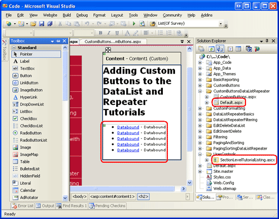
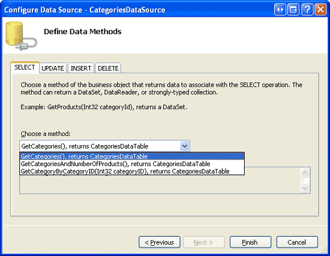
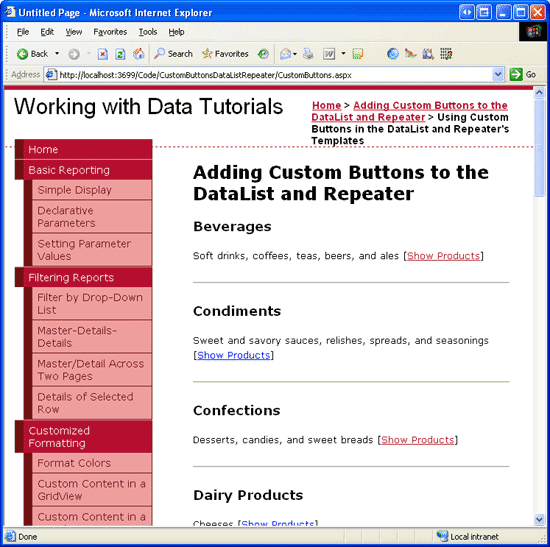

Custom Buttons in the DataList and Repeater (C#)
====================
by [Scott Mitchell](https://twitter.com/ScottOnWriting)

[Download Sample App](http://download.microsoft.com/download/4/a/7/4a7a3b18-d80e-4014-8e53-a6a2427f0d93/ASPNET_Data_Tutorial_46_CS.exe) or [Download PDF](custom-buttons-in-the-datalist-and-repeater-cs/_static/datatutorial46cs1.pdf)

> In this tutorial we'll build an interface that uses a Repeater to list the categories in the system, with each category providing a button to show its associated products using a BulletedList control.

## Introduction

Throughout the past seventeen DataList and Repeater tutorials, we ve created both read-only examples and editing and deleting examples. To facilitate editing and deleting capabilities within a DataList, we added buttons to the DataList s `ItemTemplate` that, when clicked, caused a postback and raised a DataList event corresponding to the button s `CommandName` property. For example, adding a button to the `ItemTemplate` with a `CommandName` property value of Edit causes the DataList s `EditCommand` to fire on postback; one with the `CommandName` Delete raises the `DeleteCommand`.

In addition to Edit and Delete buttons, the DataList and Repeater controls can also include Buttons, LinkButtons, or ImageButtons that, when clicked, perform some custom server-side logic. In this tutorial we'll build an interface that uses a Repeater to list the categories in the system. For each category, the Repeater will include a button to show the category s associated products using a BulletedList control (see Figure 1).

**Figure 1**: Clicking the Show Products Link Displays the Category s Products in a Bulleted List ([Click to view full-size image](custom-buttons-in-the-datalist-and-repeater-cs/_static/image3.png))

## Step 1: Adding the Custom Button Tutorial Web Pages

Before we look at how to add a custom button, let s first take a moment to create the ASP.NET pages in our website project that we'll need for this tutorial. Start by adding a new folder named `CustomButtonsDataListRepeater`. Next, add the following two ASP.NET pages to that folder, making sure to associate each page with the `Site.master` master page:

- `Default.aspx`
- `CustomButtons.aspx`

**Figure 2**: Add the ASP.NET Pages for the Custom Buttons-Related Tutorials

Like in the other folders, `Default.aspx` in the `CustomButtonsDataListRepeater` folder will list the tutorials in its section. Recall that the `SectionLevelTutorialListing.ascx` User Control provides this functionality. Add this User Control to `Default.aspx` by dragging it from the Solution Explorer onto the page s Design view.

**Figure 3**: Add the `SectionLevelTutorialListing.ascx` User Control to `Default.aspx` ([Click to view full-size image](custom-buttons-in-the-datalist-and-repeater-cs/_static/image7.png))

Lastly, add the pages as entries to the `Web.sitemap` file. Specifically, add the following markup after the Paging and Sorting with the DataList and Repeater `<siteMapNode>`:

[!code-xml[Main](custom-buttons-in-the-datalist-and-repeater-cs/samples/sample1.xml)]

After updating `Web.sitemap`, take a moment to view the tutorials website through a browser. The menu on the left now includes items for the editing, inserting, and deleting tutorials.

**Figure 4**: The Site Map Now Includes the Entry for the Custom Buttons Tutorial

## Step 2: Adding the List of Categories

For this tutorial we need to create a Repeater that lists all categories along with a Show Products LinkButton that, when clicked, displays the associated category s products in a bulleted list. Let s first create a simple Repeater that lists the categories in the system. Start by opening the `CustomButtons.aspx` page in the `CustomButtonsDataListRepeater` folder. Drag a Repeater from the Toolbox onto the Designer and set its `ID` property to `Categories`. Next, create a new data source control from the Repeater s smart tag. Specifically, create a new ObjectDataSource control named `CategoriesDataSource` that selects its data from the `CategoriesBLL` class s `GetCategories()` method.

**Figure 5**: Configure the ObjectDataSource to Use the `CategoriesBLL` Class s `GetCategories()` Method ([Click to view full-size image](custom-buttons-in-the-datalist-and-repeater-cs/_static/image11.png))

Unlike the DataList control, for which Visual Studio creates a default `ItemTemplate` based on the data source, the Repeater s templates must be manually defined. Furthermore, the Repeater s templates must be created and edited declaratively (that is, there s no Edit Templates option in the Repeater s smart tag).

Click on the Source tab in the bottom left corner and add an `ItemTemplate` that displays the category s name in an `<h3>` element and its description in a paragraph tag; include a `SeparatorTemplate` that displays a horizontal rule (`
`) between each category. Also add a LinkButton with its `Text` property set to Show Products. After completing these steps, your page s declarative markup should look like the following:

[!code-aspx[Main](custom-buttons-in-the-datalist-and-repeater-cs/samples/sample2.aspx)]

Figure 6 shows the page when viewed through a browser. Each category name and description is listed. The Show Products button, when clicked, causes a postback but does not yet perform any action.

**Figure 6**: Each Category s Name and Description is Displayed, Along with a Show Products LinkButton ([Click to view full-size image](custom-buttons-in-the-datalist-and-repeater-cs/_static/image14.png))

## Step 3: Executing Server-Side Logic When the Show Products LinkButton is Clicked

Anytime a Button, LinkButton, or ImageButton within a template in a DataList or Repeater is clicked, a postback occurs and the DataList or Repeater s `ItemCommand` event fires. In addition to the `ItemCommand` event, the DataList control may also raise another, more specific event if the button s `CommandName` property is set to one of the reserved strings ( Delete, Edit, Cancel, Update, or Select ), but the `ItemCommand` event is *always* fired.

When a button is clicked within a DataList or Repeater, oftentimes we need to pass along which button was clicked (in the case that there may be multiple buttons within the control, such as both an Edit and Delete button) and perhaps some additional information (such as the primary key value of the item whose button was clicked). The Button, LinkButton, and ImageButton provide two properties whose values are passed to the `ItemCommand` event handler:

- `CommandName` a string typically used to identify each button in the template
- `CommandArgument` commonly used to hold the value of some data field, such as the primary key value

For this example, set the LinkButton s `CommandName` property to ShowProducts and bind the current record s primary key value `CategoryID` to the `CommandArgument` property using the databinding syntax `CategoryArgument='<%# Eval("CategoryID") %>'`. After specifying these two properties, the LinkButton s declarative syntax should look like the following:

[!code-aspx[Main](custom-buttons-in-the-datalist-and-repeater-cs/samples/sample3.aspx)]

When the button is clicked, a postback occurs and the DataList or Repeater s `ItemCommand` event fires. The event handler is passed the button s `CommandName` and `CommandArgument` values.

Create an event handler for the Repeater s `ItemCommand` event and note the second parameter passed into the event handler (named `e`). This second parameter is of type [`RepeaterCommandEventArgs`](https://msdn.microsoft.com/en-us/library/system.web.ui.webcontrols.repeatercommandeventargs.aspx) and has the following four properties:

- `CommandArgument` the value of the clicked button s `CommandArgument` property
- `CommandName` the value of the button s `CommandName` property
- `CommandSource` a reference to the button control that was clicked
- `Item` a reference to the [`RepeaterItem`](https://msdn.microsoft.com/en-us/library/system.web.ui.webcontrols.repeateritem.aspx) that contains the button that was clicked; each record bound to the Repeater is manifested as a `RepeaterItem`

Since the selected category s `CategoryID` is passed in via the `CommandArgument` property, we can get the set of products associated with the selected category in the `ItemCommand` event handler. These products can then be bound to a BulletedList control in the `ItemTemplate` (which we ve yet to add). All that remains, then, is to add the BulletedList, reference it in the `ItemCommand` event handler, and bind to it the set of products for the selected category, which we'll tackle in Step 4.

> [!NOTE]
> The DataList s `ItemCommand` event handler is passed an object of type [`DataListCommandEventArgs`](https://msdn.microsoft.com/en-us/library/system.web.ui.webcontrols.datalistcommandeventargs.aspx), which offers the same four properties as the `RepeaterCommandEventArgs` class.

## Step 4: Displaying the Selected Category s Products in a Bulleted List

The selected category s products can be displayed within the Repeater s `ItemTemplate` using any number of controls. We could add another nested Repeater, a DataList, a DropDownList, a GridView, and so on. Since we want to display the products as a bulleted list, though, we'll use the BulletedList control. Returning to the `CustomButtons.aspx` page s declarative markup, add a BulletedList control to the `ItemTemplate` after the Show Products LinkButton. Set the BulletedLists s `ID` to `ProductsInCategory`. The BulletedList displays the value of the data field specified via the `DataTextField` property; since this control will have product information bound to it, set the `DataTextField` property to `ProductName`.

[!code-aspx[Main](custom-buttons-in-the-datalist-and-repeater-cs/samples/sample4.aspx)]

In the `ItemCommand` event handler, reference this control using `e.Item.FindControl("ProductsInCategory")` and bind it to the set of products associated with the selected category.

[!code-csharp[Main](custom-buttons-in-the-datalist-and-repeater-cs/samples/sample5.cs)]

Before performing any action in the `ItemCommand` event handler, it s prudent to first check the value of the incoming `CommandName`. Since the `ItemCommand` event handler fires when *any* button is clicked, if there are multiple buttons in the template use the `CommandName` value to discern what action to take. Checking the `CommandName` here is moot, since we only have a single button, but it is a good habit to form. Next, the `CategoryID` of the selected category is retrieved from the `CommandArgument` property. The BulletedList control in the template is then referenced and bound to the results of the `ProductsBLL` class s `GetProductsByCategoryID(categoryID)` method.

In previous tutorials that used the buttons within a DataList, such as [An Overview of Editing and Deleting Data in the DataList](../editing-and-deleting-data-through-the-datalist/an-overview-of-editing-and-deleting-data-in-the-datalist-cs.md), we determined the primary key value of a given item via the `DataKeys` collection. While this approach works well with the DataList, the Repeater does not have a `DataKeys` property. Instead, we must use an alternative approach for supplying the primary key value, such as through the button s `CommandArgument` property or by assigning the primary key value to a hidden Label Web control within the template and reading its value back in the `ItemCommand` event handler using `e.Item.FindControl("LabelID")`.

After completing the `ItemCommand` event handler, take a moment to test out this page in a browser. As Figure 7 shows, clicking the Show Products link causes a postback and displays the products for the selected category in a BulletedList. Furthermore, note that this product information remains, even if other categories Show Products links are clicked.

> [!NOTE]
> If you want to modify the behavior of this report, such that the only one category s products are listed at a time, simply set the BulletedList control s `EnableViewState` property to `False`.

**Figure 7**: A BulletedList is used to Display the Products of the Selected Category ([Click to view full-size image](custom-buttons-in-the-datalist-and-repeater-cs/_static/image17.png))

## Summary

The DataList and Repeater controls can include any number of Buttons, LinkButtons, or ImageButtons within their templates. Such buttons, when clicked, cause a postback and raise the `ItemCommand` event. To associate custom server-side action with a button being clicked, create an event handler for the `ItemCommand` event. In this event handler first check the incoming `CommandName` value to determine which button was clicked. Additional information can optionally be supplied through the button s `CommandArgument` property.

Happy Programming!

## About the Author

[Scott Mitchell](http://www.4guysfromrolla.com/ScottMitchell.shtml), author of seven ASP/ASP.NET books and founder of [4GuysFromRolla.com](http://www.4guysfromrolla.com), has been working with Microsoft Web technologies since 1998. Scott works as an independent consultant, trainer, and writer. His latest book is [*Sams Teach Yourself ASP.NET 2.0 in 24 Hours*](https://www.amazon.com/exec/obidos/ASIN/0672327384/4guysfromrollaco). He can be reached at [mitchell@4GuysFromRolla.com.](mailto:mitchell@4GuysFromRolla.com) or via his blog, which can be found at [http://ScottOnWriting.NET](http://ScottOnWriting.NET).

## Special Thanks To

This tutorial series was reviewed by many helpful reviewers. Lead reviewer for this tutorial was Dennis Patterson. Interested in reviewing my upcoming MSDN articles? If so, drop me a line at [mitchell@4GuysFromRolla.com.](mailto:mitchell@4GuysFromRolla.com)

>[!div class="step-by-step"]
[Next](custom-buttons-in-the-datalist-and-repeater-vb.md)