Adding and Responding to Buttons to a GridView (C#)
====================
by [Scott Mitchell](https://twitter.com/ScottOnWriting)

[Download Sample App](http://download.microsoft.com/download/9/c/1/9c1d03ee-29ba-4d58-aa1a-f201dcc822ea/ASPNET_Data_Tutorial_28_CS.exe) or [Download PDF](adding-and-responding-to-buttons-to-a-gridview-cs/_static/datatutorial28cs1.pdf)

> In this tutorial we'll look at how to add custom buttons, both to a template and to the fields of a GridView or DetailsView control. In particular, we'll build an interface that has a FormView that allows the user to page through the suppliers.

## Introduction

While many reporting scenarios involve read-only access to the report data, it's not uncommon for reports to include the ability to perform actions based upon the data displayed. Typically this involved adding a Button, LinkButton, or ImageButton Web control with each record displayed in the report that, when clicked, causes a postback and invokes some server-side code. Editing and deleting the data on a record-by-record basis is the most common example. In fact, as we saw starting with the [Overview of Inserting, Updating, and Deleting Data](../editing-inserting-and-deleting-data/an-overview-of-inserting-updating-and-deleting-data-cs.md) tutorial, editing and deleting is so common that the GridView, DetailsView, and FormView controls can support such functionality without the need for writing a single line of code.

In addition to Edit and Delete buttons, the GridView, DetailsView, and FormView controls can also include Buttons, LinkButtons, or ImageButtons that, when clicked, perform some custom server-side logic. In this tutorial we'll look at how to add custom buttons, both to a template and to the fields of a GridView or DetailsView control. In particular, we'll build an interface that has a FormView that allows the user to page through the suppliers. For a given supplier, the FormView will show information about the supplier along with a Button Web control that, if clicked, will mark all of their associated products as discontinued. Additionally, a GridView lists those products provided by the selected supplier, with each row containing Increase Price and Discount Price Buttons that, if clicked, raise or reduce the product's `UnitPrice` by 10% (see Figure 1).

[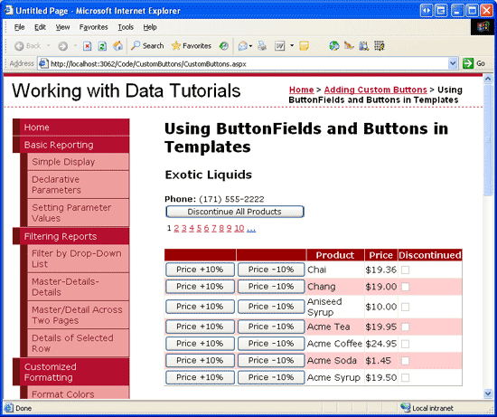](adding-and-responding-to-buttons-to-a-gridview-cs/_static/image1.png)

**Figure 1**: Both the FormView and GridView Contain Buttons That Perform Custom Actions ([Click to view full-size image](adding-and-responding-to-buttons-to-a-gridview-cs/_static/image3.png))

## Step 1: Adding the Button Tutorial Web Pages

Before we look at how to add a custom buttons, let's first take a moment to create the ASP.NET pages in our website project that we'll need for this tutorial. Start by adding a new folder named `CustomButtons`. Next, add the following two ASP.NET pages to that folder, making sure to associate each page with the `Site.master` master page:

- `Default.aspx`
- `CustomButtons.aspx`

**Figure 2**: Add the ASP.NET Pages for the Custom Buttons-Related Tutorials

Like in the other folders, `Default.aspx` in the `CustomButtons` folder will list the tutorials in its section. Recall that the `SectionLevelTutorialListing.ascx` User Control provides this functionality. Therefore, add this User Control to `Default.aspx` by dragging it from the Solution Explorer onto the page's Design view.

[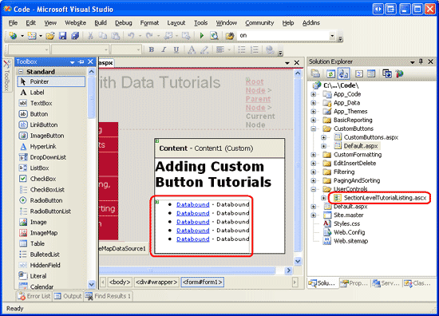](adding-and-responding-to-buttons-to-a-gridview-cs/_static/image5.png)

**Figure 3**: Add the `SectionLevelTutorialListing.ascx` User Control to `Default.aspx` ([Click to view full-size image](adding-and-responding-to-buttons-to-a-gridview-cs/_static/image7.png))

Lastly, add the pages as entries to the `Web.sitemap` file. Specifically, add the following markup after the Paging and Sorting `<siteMapNode>`:

[!code-xml[Main](adding-and-responding-to-buttons-to-a-gridview-cs/samples/sample1.xml)]

After updating `Web.sitemap`, take a moment to view the tutorials website through a browser. The menu on the left now includes items for the editing, inserting, and deleting tutorials.

**Figure 4**: The Site Map Now Includes the Entry for the Custom Buttons Tutorial

## Step 2: Adding a FormView that Lists the Suppliers

Let's get started with this tutorial by adding the FormView that lists the suppliers. As discussed in the Introduction, this FormView will allow the user to page through the suppliers, showing the products provided by the supplier in a GridView. Additionally, this FormView will include a Button that, when clicked, will mark all of the supplier's products as discontinued. Before we concern ourselves with adding the custom button to the FormView, let's first just create the FormView so that it displays the supplier information.

Start by opening the `CustomButtons.aspx` page in the `CustomButtons` folder. Add a FormView to the page by dragging it from the Toolbox onto the Designer and set its `ID` property to `Suppliers`. From the FormView's smart tag, opt to create a new ObjectDataSource named `SuppliersDataSource`.

**Figure 5**: Create a New ObjectDataSource Named `SuppliersDataSource` ([Click to view full-size image](adding-and-responding-to-buttons-to-a-gridview-cs/_static/image11.png))

Configure this new ObjectDataSource such that it queries from the `SuppliersBLL` class's `GetSuppliers()` method (see Figure 6). Since this FormView does not provide an interface for updating the supplier information, select the (None) option from the drop-down list in the UPDATE tab.

[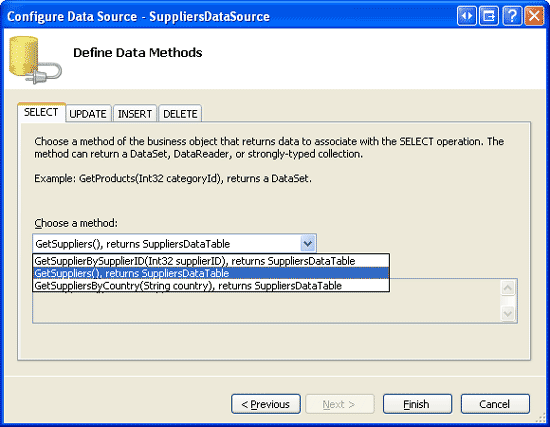](adding-and-responding-to-buttons-to-a-gridview-cs/_static/image12.png)

**Figure 6**: Configure the Data Source to use the `SuppliersBLL` Class's `GetSuppliers()` Method ([Click to view full-size image](adding-and-responding-to-buttons-to-a-gridview-cs/_static/image14.png))

After configuring the ObjectDataSource, Visual Studio will generate an `InsertItemTemplate`, `EditItemTemplate`, and `ItemTemplate` for the FormView. Remove the `InsertItemTemplate` and `EditItemTemplate` and modify the `ItemTemplate` so that it displays just the supplier's company name and phone number. Finally, turn on paging support for the FormView by checking the Enable Paging checkbox from its smart tag (or by setting its `AllowPaging` property to `True`). After these changes your page's declarative markup should look similar to the following:

[!code-aspx[Main](adding-and-responding-to-buttons-to-a-gridview-cs/samples/sample2.aspx)]

Figure 7 shows the CustomButtons.aspx page when viewed through a browser.

**Figure 7**: The FormView Lists the `CompanyName` and `Phone` Fields from the Currently Selected Supplier ([Click to view full-size image](adding-and-responding-to-buttons-to-a-gridview-cs/_static/image17.png))

## Step 3: Adding a GridView that Lists the Selected Supplier's Products

Before we add the Discontinue All Products Button to the FormView's template, let's first add a GridView beneath the FormView that lists the products provided by the selected supplier. To accomplish this, add a GridView to the page, set its `ID` property to `SuppliersProducts`, and add a new ObjectDataSource named `SuppliersProductsDataSource`.

[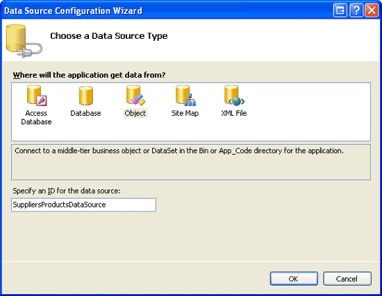](adding-and-responding-to-buttons-to-a-gridview-cs/_static/image18.png)

**Figure 8**: Create a New ObjectDataSource Named `SuppliersProductsDataSource` ([Click to view full-size image](adding-and-responding-to-buttons-to-a-gridview-cs/_static/image20.png))

Configure this ObjectDataSource to use the ProductsBLL class's `GetProductsBySupplierID(supplierID)` method (see Figure 9). While this GridView will allow for a product's price to be adjusted, it won't be using the built-in editing or deleting features from the GridView. Therefore, we can set the drop-down list to (None) for the ObjectDataSource's UPDATE, INSERT, and DELETE tabs.

[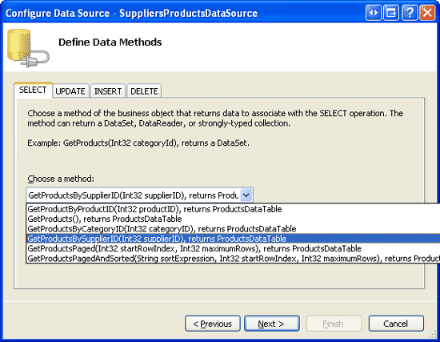](adding-and-responding-to-buttons-to-a-gridview-cs/_static/image21.png)

**Figure 9**: Configure the Data Source to use the `ProductsBLL` Class's `GetProductsBySupplierID(supplierID)` Method ([Click to view full-size image](adding-and-responding-to-buttons-to-a-gridview-cs/_static/image23.png))

Since the `GetProductsBySupplierID(supplierID)` method accepts an input parameter, the ObjectDataSource wizard prompts us for the source of this parameter value. To pass in the `SupplierID` value from the FormView, set the Parameter source drop-down list to Control and the ControlID drop-down list to `Suppliers` (the ID of the FormView created in Step 2).

**Figure 10**: Indicate that the *`supplierID`* Parameter Should Come from the `Suppliers` FormView Control ([Click to view full-size image](adding-and-responding-to-buttons-to-a-gridview-cs/_static/image26.png))

After completing the ObjectDataSource wizard, the GridView will contain a BoundField or CheckBoxField for each of the product's data fields. Let's trim this down to show just the `ProductName` and `UnitPrice` BoundFields along with the `Discontinued` CheckBoxField; furthermore, let's format the `UnitPrice` BoundField such that its text is formatted as a currency. Your GridView and `SuppliersProductsDataSource` ObjectDataSource's declarative markup should look similar to the following markup:

[!code-aspx[Main](adding-and-responding-to-buttons-to-a-gridview-cs/samples/sample3.aspx)]

At this point our tutorial displays a master/details report, allowing the user to pick a supplier from the FormView at the top and to view the products provided by that supplier through the GridView at the bottom. Figure 11 shows a screen shot of this page when selecting the Tokyo Traders supplier from the FormView.

**Figure 11**: The Selected Supplier's Products are Displayed in the GridView ([Click to view full-size image](adding-and-responding-to-buttons-to-a-gridview-cs/_static/image29.png))

## Step 4: Creating DAL and BLL Methods to Discontinue All Products for a Supplier

Before we can add a Button to the FormView that, when clicked, discontinues all of the supplier's products, we first need to add a method to both the DAL and BLL that performs this action. In particular, this method will be named `DiscontinueAllProductsForSupplier(supplierID)`. When the FormView's Button is clicked, we'll invoke this method in the Business Logic Layer, passing in the selected supplier's `SupplierID`; the BLL will then call down to the corresponding Data Access Layer method, which will issue an `UPDATE` statement to the database that discontinues the specified supplier's products.

As we have done in our previous tutorials, we'll use a bottom-up approach, starting with creating the DAL method, then the BLL method, and finally implementing the functionality in the ASP.NET page. Open the `Northwind.xsd` Typed DataSet in the `App_Code/DAL` folder and add a new method to the `ProductsTableAdapter` (right-click on the `ProductsTableAdapter` and choose Add Query). Doing so will bring up the TableAdapter Query Configuration wizard, which walks us through the process of adding the new method. Start by indicating that our DAL method will use an ad-hoc SQL statement.

**Figure 12**: Create the DAL Method Using an Ad-Hoc SQL Statement ([Click to view full-size image](adding-and-responding-to-buttons-to-a-gridview-cs/_static/image32.png))

Next, the wizard prompts us as to what type of query to create. Since the `DiscontinueAllProductsForSupplier(supplierID)` method will need to update the `Products` database table, setting the `Discontinued` field to 1 for all products provided by the specified *`supplierID`*, we need to create a query that updates data.

[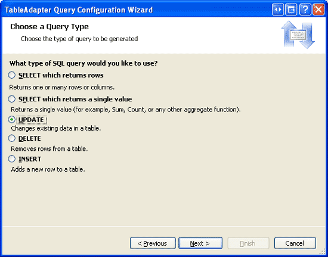](adding-and-responding-to-buttons-to-a-gridview-cs/_static/image33.png)

**Figure 13**: Choose the UPDATE Query Type ([Click to view full-size image](adding-and-responding-to-buttons-to-a-gridview-cs/_static/image35.png))

The next wizard screen provides the TableAdapter's existing `UPDATE` statement, which updates each of the fields defined in the `Products` DataTable. Replace this query text with the following statement:

[!code-sql[Main](adding-and-responding-to-buttons-to-a-gridview-cs/samples/sample4.sql)]

After entering this query and clicking Next, the last wizard screen asks for the new method's name use `DiscontinueAllProductsForSupplier`. Complete the wizard by clicking the Finish button. Upon returning to the DataSet Designer you should see a new method in the `ProductsTableAdapter` named `DiscontinueAllProductsForSupplier(@SupplierID)`.

[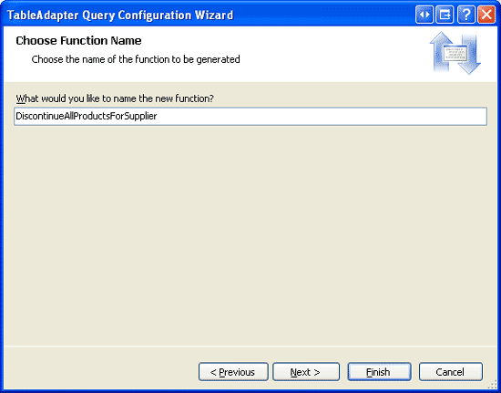](adding-and-responding-to-buttons-to-a-gridview-cs/_static/image36.png)

**Figure 14**: Name the New DAL Method `DiscontinueAllProductsForSupplier` ([Click to view full-size image](adding-and-responding-to-buttons-to-a-gridview-cs/_static/image38.png))

With the `DiscontinueAllProductsForSupplier(supplierID)` method created in the Data Access Layer, our next task is to create the `DiscontinueAllProductsForSupplier(supplierID)` method in the Business Logic Layer. To accomplish this, open the `ProductsBLL` class file and add the following:

[!code-csharp[Main](adding-and-responding-to-buttons-to-a-gridview-cs/samples/sample5.cs)]

This method simply calls down to the `DiscontinueAllProductsForSupplier(supplierID)` method in the DAL, passing along the provided *`supplierID`* parameter value. If there were any business rules that only allowed a supplier's products to be discontinued under certain circumstances, those rules should be implemented here, in the BLL.

> [!NOTE]
> Unlike the `UpdateProduct` overloads in the `ProductsBLL` class, the `DiscontinueAllProductsForSupplier(supplierID)` method signature does not include the `DataObjectMethodAttribute` attribute (`<System.ComponentModel.DataObjectMethodAttribute(System.ComponentModel.DataObjectMethodType.Update, Boolean)>`). This precludes the `DiscontinueAllProductsForSupplier(supplierID)` method from the ObjectDataSource's Configure Data Source wizard's drop-down list in the UPDATE tab. I ve omitted this attribute because we'll be calling the `DiscontinueAllProductsForSupplier(supplierID)` method directly from an event handler in our ASP.NET page.

## Step 5: Adding a Discontinue All Products Button to the FormView

With the `DiscontinueAllProductsForSupplier(supplierID)` method in the BLL and DAL complete, the final step for adding the ability to discontinue all products for the selected supplier is to add a Button Web control to the FormView's `ItemTemplate`. Let's add such a Button below the supplier's phone number with the button text, Discontinue All Products and an `ID` property value of `DiscontinueAllProductsForSupplier`. You can add this Button Web control through the Designer by clicking on the Edit Templates link in the FormView's smart tag (see Figure 15), or directly through the declarative syntax.

[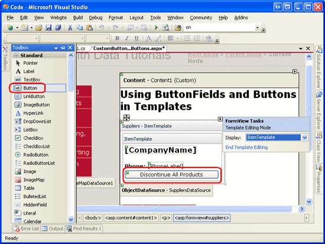](adding-and-responding-to-buttons-to-a-gridview-cs/_static/image39.png)

**Figure 15**: Add a Discontinue All Products Button Web Control to the FormView's `ItemTemplate` ([Click to view full-size image](adding-and-responding-to-buttons-to-a-gridview-cs/_static/image41.png))

When the Button is clicked by a user visiting the page, a postback ensues and the FormView's [`ItemCommand` event](https://msdn.microsoft.com/en-us/library/system.web.ui.webcontrols.formview.itemcommand.aspx) fires. To execute custom code in response to this Button being clicked, we can create an event handler for this event. Understand, though, that the `ItemCommand` event fires whenever *any* Button, LinkButton, or ImageButton Web control is clicked within the FormView. That means that when the user moves from one page to another in the FormView, the `ItemCommand` event fires; same thing when the user clicks New, Edit, or Delete in a FormView that supports inserting, updating, or deleting.

Since the `ItemCommand` fires regardless of what button is clicked, in the event handler we need a way to determine if the Discontinue All Products Button was clicked or if it was some other button. To accomplish this, we can set the Button Web control's `CommandName` property to some identifying value. When the Button is clicked, this `CommandName` value is passed into the `ItemCommand` event handler, enabling us to determine whether the Discontinue All Products Button was the button clicked. Set the Discontinue All Products Button's `CommandName` property to DiscontinueProducts .

Finally, let's use a client-side confirm dialog box to ensure that the user really wants to discontinue the selected supplier's products. As we saw in the [Adding Client-Side Confirmation When Deleting](../editing-inserting-and-deleting-data/adding-client-side-confirmation-when-deleting-cs.md) tutorial, this can be accomplished with a bit of JavaScript. In particular, set the Button Web control's OnClientClick property to `return confirm('This will mark _all_ of this supplier\'s products as discontinued. Are you certain you want to do this?');`

After making these changes, the FormView's declarative syntax should look like the following:

[!code-aspx[Main](adding-and-responding-to-buttons-to-a-gridview-cs/samples/sample6.aspx)]

Next, create an event handler for the FormView's `ItemCommand` event. In this event handler we need to first determine whether the Discontinue All Products Button was clicked. If so, we want to create an instance of the `ProductsBLL` class and invoke its `DiscontinueAllProductsForSupplier(supplierID)` method, passing in the `SupplierID` of the selected FormView:

[!code-csharp[Main](adding-and-responding-to-buttons-to-a-gridview-cs/samples/sample7.cs)]

Note that the `SupplierID` of the current selected supplier in the FormView can be accessed using the FormView's [`SelectedValue` property](https://msdn.microsoft.com/en-US/library/system.web.ui.webcontrols.formview.selectedvalue.aspx). The `SelectedValue` property returns the first data key value for the record being displayed in the FormView. The FormView's [`DataKeyNames` property](https://msdn.microsoft.com/en-us/system.web.ui.webcontrols.formview.datakeynames.aspx), which indicates the data fields from which the data key values are pulled from, was automatically set to `SupplierID` by Visual Studio when binding the ObjectDataSource to the FormView back in Step 2.

With the `ItemCommand` event handler created, take a moment to test out the page. Browse to the Cooperativa de Quesos 'Las Cabras' supplier (it's the fifth supplier in the FormView for me). This supplier provides two products, Queso Cabrales and Queso Manchego La Pastora, both of which are *not* discontinued.

Imagine that Cooperativa de Quesos 'Las Cabras' has gone out of business and therefore its products are to be discontinued. Click the Discontinue All Products Button. This will display the client-side confirm dialog box (see Figure 16).

**Figure 16**: Cooperativa de Quesos Las Cabras Supplies Two Active Products ([Click to view full-size image](adding-and-responding-to-buttons-to-a-gridview-cs/_static/image44.png))

If you click OK in the client-side confirm dialog box, the form submission will proceed, causing a postback in which the FormView's `ItemCommand` event will fire. The event handler we created will then execute, invoking the `DiscontinueAllProductsForSupplier(supplierID)` method and discontinuing both the Queso Cabrales and Queso Manchego La Pastora products.

If you have disabled the GridView's view state, the GridView is being rebound to the underlying data store on every postback, and therefore will immediately be updated to reflect that these two products are now discontinued (see Figure 17). If, however, you have not disabled view state in the GridView, you will need to manually rebind the data to the GridView after making this change. To accomplish this, simply make a call to the GridView's `DataBind()` method immediately after invoking the `DiscontinueAllProductsForSupplier(supplierID)` method.

**Figure 17**: After Clicking the Discontinue All Products Button, the Supplier's Products are Updated Accordingly ([Click to view full-size image](adding-and-responding-to-buttons-to-a-gridview-cs/_static/image47.png))

## Step 6: Creating an UpdateProduct Overload in the Business Logic Layer for Adjusting a Product's Price

Like with the Discontinue All Products Button in the FormView, in order to add buttons for increasing and decreasing the price for a product in the GridView we need to first add the appropriate Data Access Layer and Business Logic Layer methods. Since we already have a method that updates a single product row in the DAL, we can provide such functionality by creating a new overload for the `UpdateProduct` method in the BLL.

Our past `UpdateProduct` overloads have taken in some combination of product fields as scalar input values and have then updated just those fields for the specified product. For this overload we'll vary slightly from this standard and instead pass in the product's `ProductID` and the percentage by which to adjust the `UnitPrice` (as opposed to passing in the new, adjusted `UnitPrice` itself). This approach will simplify the code we need to write in the ASP.NET page code-behind class, since we don't have to bother with determining the current product's `UnitPrice`.

The `UpdateProduct` overload for this tutorial is shown below:

[!code-csharp[Main](adding-and-responding-to-buttons-to-a-gridview-cs/samples/sample8.cs)]

This overload retrieves information about the specified product through the DAL's `GetProductByProductID(productID)` method. It then checks to see whether the product's `UnitPrice` is assigned a database `NULL` value. If it is, the price is left unaltered. If, however, there is a non-`NULL` `UnitPrice` value, the method updates the product's `UnitPrice` by the specified percent (`unitPriceAdjustmentPercent`).

## Step 7: Adding the Increase and Decrease Buttons to the GridView

The GridView (and DetailsView) are both made up of a collection of fields. In addition to BoundFields, CheckBoxFields, and TemplateFields, ASP.NET includes the ButtonField, which, as its name implies, renders as a column with a Button, LinkButton, or ImageButton for each row. Similar to the FormView, clicking *any* button within the GridView paging buttons, Edit or Delete buttons, sorting buttons, and so on causes a postback and raises the GridView's [`RowCommand` event](https://msdn.microsoft.com/en-us/library/system.web.ui.webcontrols.gridview.rowcommand.aspx).

The ButtonField has a `CommandName` property that assigns the specified value to each of its Buttons `CommandName` properties. Like with the FormView, the `CommandName` value is used by the `RowCommand` event handler to determine which button was clicked.

Let's add two new ButtonFields to the GridView, one with a button text Price +10% and the other with the text Price -10%. To add these ButtonFields, click on the Edit Columns link from the GridView's smart tag, select the ButtonField field type from the list in the upper left and click the Add button.

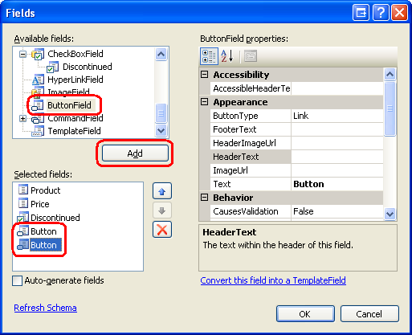

**Figure 18**: Add Two ButtonFields to the GridView

Move the two ButtonFields so that they appear as the first two GridView fields. Next, set the `Text` properties of these two ButtonFields to Price +10% and Price -10% and the `CommandName` properties to IncreasePrice and DecreasePrice, respectively. By default, a ButtonField renders its column of buttons as LinkButtons. This can be changed, however, through the ButtonField's [`ButtonType` property](https://msdn.microsoft.com/en-US/library/system.web.ui.webcontrols.buttonfieldbase.buttontype.aspx). Let's have these two ButtonFields rendered as regular push buttons; therefore, set the `ButtonType` property to `Button`. Figure 19 shows the Fields dialog box after these changes have been made; following that is the GridView's declarative markup.

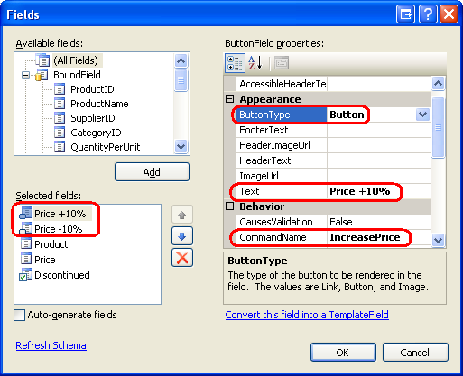

**Figure 19**: Configure the ButtonFields `Text`, `CommandName`, and `ButtonType` Properties

[!code-aspx[Main](adding-and-responding-to-buttons-to-a-gridview-cs/samples/sample9.aspx)]

With these ButtonFields created, the final step is to create an event handler for the GridView's `RowCommand` event. This event handler, if fired because either the Price +10% or Price -10% buttons were clicked, needs to determine the `ProductID` for the row whose button was clicked and then invoke the `ProductsBLL` class's `UpdateProduct` method, passing in the appropriate `UnitPrice` percentage adjustment along with the `ProductID`. The following code performs these tasks:

[!code-csharp[Main](adding-and-responding-to-buttons-to-a-gridview-cs/samples/sample10.cs)]

In order to determine the `ProductID` for the row whose Price +10% or Price -10% button was clicked, we need to consult the GridView's `DataKeys` collection. This collection holds the values of the fields specified in the `DataKeyNames` property for each GridView row. Since the GridView's `DataKeyNames` property was set to ProductID by Visual Studio when binding the ObjectDataSource to the GridView, `DataKeys(rowIndex).Value` provides the `ProductID` for the specified *rowIndex*.

The ButtonField automatically passes in the *rowIndex* of the row whose button was clicked through the `e.CommandArgument` parameter. Therefore, to determine the `ProductID` for the row whose Price +10% or Price -10% button was clicked, we use: `Convert.ToInt32(SuppliersProducts.DataKeys(Convert.ToInt32(e.CommandArgument)).Value)`.

As with the Discontinue All Products button, if you have disabled the GridView's view state, the GridView is being rebound to the underlying data store on every postback, and therefore will immediately be updated to reflect a price change that occurs from clicking either of the buttons. If, however, you have not disabled view state in the GridView, you will need to manually rebind the data to the GridView after making this change. To accomplish this, simply make a call to the GridView's `DataBind()` method immediately after invoking the `UpdateProduct` method.

Figure 20 shows the page when viewing the products provided by Grandma Kelly's Homestead. Figure 21 shows the results after the Price +10% button has been clicked twice for Grandma's Boysenberry Spread and the Price -10% button once for Northwoods Cranberry Sauce.

[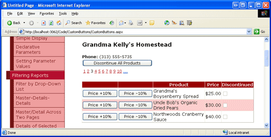](adding-and-responding-to-buttons-to-a-gridview-cs/_static/image50.png)

**Figure 20**: The GridView Includes Price +10% and Price -10% Buttons ([Click to view full-size image](adding-and-responding-to-buttons-to-a-gridview-cs/_static/image52.png))

**Figure 21**: The Prices for the First and Third Product Have Been Updated via the Price +10% and Price -10% Buttons ([Click to view full-size image](adding-and-responding-to-buttons-to-a-gridview-cs/_static/image55.png))

> [!NOTE]
> The GridView (and DetailsView) can also have Buttons, LinkButtons, or ImageButtons added to their TemplateFields. As with the BoundField, these Buttons, when clicked, will induce a postback, raising the GridView's `RowCommand` event. When adding buttons in a TemplateField, however, the Button's `CommandArgument` is not automatically set to the index of the row as it is when using ButtonFields. If you need to determine the row index of the button that was clicked within the `RowCommand` event handler, you'll need to manually set the Button's `CommandArgument` property in its declarative syntax within the TemplateField, using code like:  
> `<asp:Button runat="server" ... CommandArgument='<%# ((GridViewRow) Container).RowIndex %>'`.

## Summary

The GridView, DetailsView, and FormView controls all can include Buttons, LinkButtons, or ImageButtons. Such buttons, when clicked, cause a postback and raise the `ItemCommand` event in the FormView and DetailsView controls and the `RowCommand` event in the GridView. These data Web controls have built-in functionality to handle common command-related actions, such as deleting or editing records. However, we can also use buttons that, when clicked, respond with executing our own custom code.

To accomplish this, we need to create an event handler for the `ItemCommand` or `RowCommand` event. In this event handler we first check the incoming `CommandName` value to determine which button was clicked and then take appropriate custom action. In this tutorial we saw how to use buttons and ButtonFields to discontinue all products for a specified supplier or to increase or decrease the price of a particular product by 10%.

Happy Programming!

## About the Author

[Scott Mitchell](http://www.4guysfromrolla.com/ScottMitchell.shtml), author of seven ASP/ASP.NET books and founder of [4GuysFromRolla.com](http://www.4guysfromrolla.com), has been working with Microsoft Web technologies since 1998. Scott works as an independent consultant, trainer, and writer. His latest book is [*Sams Teach Yourself ASP.NET 2.0 in 24 Hours*](https://www.amazon.com/exec/obidos/ASIN/0672327384/4guysfromrollaco). He can be reached at [mitchell@4GuysFromRolla.com.](mailto:mitchell@4GuysFromRolla.com) or via his blog, which can be found at [http://ScottOnWriting.NET](http://ScottOnWriting.NET).

>[!div class="step-by-step"]
[Next](adding-and-responding-to-buttons-to-a-gridview-vb.md)