Custom Formatting Based Upon Data (VB)
====================
by [Scott Mitchell](https://twitter.com/ScottOnWriting)

[Download Sample App](http://download.microsoft.com/download/5/7/0/57084608-dfb3-4781-991c-407d086e2adc/ASPNET_Data_Tutorial_11_VB.exe) or [Download PDF](custom-formatting-based-upon-data-vb/_static/datatutorial11vb1.pdf)

> Adjusting the format of the GridView, DetailsView, or FormView based upon the data bound to it can be accomplished in multiple ways. In this tutorial we'll look at how to accomplish data bound formatting through the use of the DataBound and RowDataBound event handlers.

## Introduction

The appearance of the GridView, DetailsView, and FormView controls can be customized through a myriad of style-related properties. Properties like `CssClass`, `Font`, `BorderWidth`, `BorderStyle`, `BorderColor`, `Width`, and `Height`, among others, dictate the general appearance of the rendered control. Properties including `HeaderStyle`, `RowStyle`, `AlternatingRowStyle`, and others allow these same style settings to be applied to particular sections. Likewise, these style settings can be applied at the field level.

In many scenarios though, the formatting requirements depend upon the value of the displayed data. For example, to draw attention to out of stock products, a report listing product information might set the background color to yellow for those products whose `UnitsInStock` and `UnitsOnOrder` fields are both equal to 0. To highlight the more expensive products, we may want to display the prices of those products costing more than $75.00 in a bold font.

Adjusting the format of the GridView, DetailsView, or FormView based upon the data bound to it can be accomplished in multiple ways. In this tutorial we'll look at how to accomplish data bound formatting through the use of the `DataBound` and `RowDataBound` event handlers. In the next tutorial we'll explore an alternative approach.

## Using the DetailsView Control's`DataBound`Event Handler

When data is bound to a DetailsView, either from a data source control or through programmatically assigning data to the control's `DataSource` property and calling its `DataBind()` method, the following sequence of steps occur:

1. The data Web control's `DataBinding` event fires.
2. The data is bound to the data Web control.
3. The data Web control's `DataBound` event fires.

Custom logic can be injected immediately after steps 1 and 3 through an event handler. By creating an event handler for the `DataBound` event we can programmatically determine the data that has been bound to the data Web control and adjust the formatting as needed. To illustrate this let's create a DetailsView that will list general information about a product, but will display the `UnitPrice` value in a ***bold, italic font*** if it exceeds $75.00.

## Step 1: Displaying the Product Information in a DetailsView

Open the `CustomColors.aspx` page in the `CustomFormatting` folder, drag a DetailsView control from the Toolbox onto the Designer, set its `ID` property value to `ExpensiveProductsPriceInBoldItalic`, and bind it to a new ObjectDataSource control that invokes the `ProductsBLL` class's `GetProducts()` method. The detailed steps for accomplishing this are omitted here for brevity since we examined them in detail in previous tutorials.

Once you've bound the ObjectDataSource to the DetailsView, take a moment to modify the field list. I've opted to remove the `ProductID`, `SupplierID`, `CategoryID`, `UnitsInStock`, `UnitsOnOrder`, `ReorderLevel`, and `Discontinued` BoundFields and renamed and reformatted the remaining BoundFields. I also cleared out the `Width` and `Height` settings. Since the DetailsView displays only a single record, we need to enable paging in order to allow the end user to view all of the products. Do so by checking the Enable Paging checkbox in the DetailsView's smart tag.

[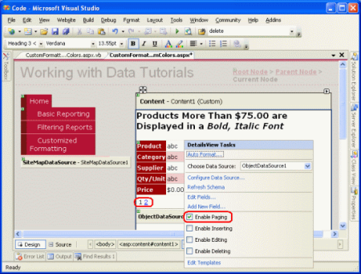](custom-formatting-based-upon-data-vb/_static/image1.png)

**Figure 1**: Figure 1: Check the Enable Paging Checkbox in the DetailsView's Smart Tag ([Click to view full-size image](custom-formatting-based-upon-data-vb/_static/image3.png))

After these changes, the DetailsView markup will be:

[!code-aspx[Main](custom-formatting-based-upon-data-vb/samples/sample1.aspx)]

Take a moment to test out this page in your browser.

[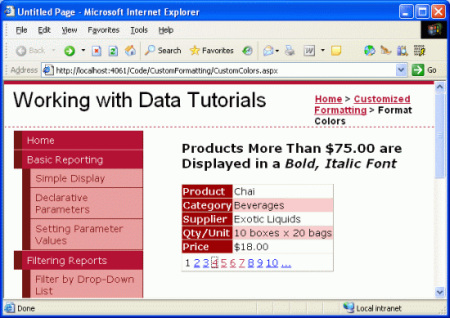](custom-formatting-based-upon-data-vb/_static/image4.png)

**Figure 2**: The DetailsView Control Displays One Product at a Time ([Click to view full-size image](custom-formatting-based-upon-data-vb/_static/image6.png))

## Step 2: Programmatically Determining the Value of the Data in the DataBound Event Handler

In order to display the price in a bold, italic font for those products whose `UnitPrice` value exceeds $75.00, we need to first be able to programmatically determine the `UnitPrice` value. For the DetailsView, this can be accomplished in the `DataBound` event handler. To create the event handler click on the DetailsView in the Designer then navigate to the Properties window. Press F4 to bring it up, if it's not visible, or go to the View menu and select the Properties Window menu option. From the Properties window, click on the lightning bolt icon to list the DetailsView's events. Next, either double-click the `DataBound` event or type in the name of the event handler you want to create.

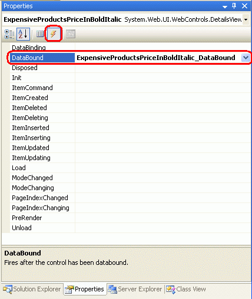

**Figure 3**: Create an Event Handler for the `DataBound` Event

> [!NOTE]
> You can also create an event handler from the ASP.NET page's code portion. There you'll find two drop-down lists at the top of the page. Select the object from the left drop-down list and the event you want to create a handler for from the right drop-down list and Visual Studio will automatically create the appropriate event handler.

Doing so will automatically create the event handler and take you to the code portion where it has been added. At this point you will see:

[!code-vb[Main](custom-formatting-based-upon-data-vb/samples/sample2.vb)]

The data bound to the DetailsView can be accessed via the `DataItem` property. Recall that we are binding our controls to a strongly-typed DataTable, which is composed of a collection of strongly-typed DataRow instances. When the DataTable is bound to the DetailsView, the first DataRow in the DataTable is assigned to the DetailsView's `DataItem` property. Specifically, the `DataItem` property is assigned a `DataRowView` object. We can use the `DataRowView`'s `Row` property to get access to the underlying DataRow object, which is actually a `ProductsRow` instance. Once we have this `ProductsRow` instance we can make our decision by simply inspecting the object's property values.

The following code illustrates how to determine whether the `UnitPrice` value bound to the DetailsView control is greater than $75.00:

[!code-vb[Main](custom-formatting-based-upon-data-vb/samples/sample3.vb)]

> [!NOTE]
> Since `UnitPrice` can have a `NULL` value in the database, we first check to make sure that we're not dealing with a `NULL` value before accessing the `ProductsRow`'s `UnitPrice` property. This check is important because if we attempt to access the `UnitPrice` property when it has a `NULL` value the `ProductsRow` object will throw a [StrongTypingException exception](https://msdn.microsoft.com/en-us/library/system.data.strongtypingexception.aspx).

## Step 3: Formatting the UnitPrice Value in the DetailsView

At this point we can determine whether the `UnitPrice` value bound to the DetailsView has a value that exceeds $75.00, but we've yet to see how to programmatically adjust the DetailsView's formatting accordingly. To modify the formatting of an entire row in the DetailsView, programmatically access the row using `DetailsViewID.Rows(index)`; to modify a particular cell, access use `DetailsViewID.Rows(index).Cells(index)`. Once we have a reference to the row or cell we can then adjust its appearance by setting its style-related properties.

Accessing a row programmatically requires that you know the row's index, which starts at 0. The `UnitPrice` row is the fifth row in the DetailsView, giving it an index of 4 and making it programmatically accessible using `ExpensiveProductsPriceInBoldItalic.Rows(4)`. At this point we could have the entire row's content displayed in a bold, italic font by using the following code:

[!code-vb[Main](custom-formatting-based-upon-data-vb/samples/sample4.vb)]

However, this will make *both* the label (Price) and the value bold and italic. If we want to make just the value bold and italic we need to apply this formatting to the second cell in the row, which can be accomplished using the following:

[!code-vb[Main](custom-formatting-based-upon-data-vb/samples/sample5.vb)]

Since our tutorials thus far have used stylesheets to maintain a clean separation between the rendered markup and style-related information, rather than setting the specific style properties as shown above let's instead use a CSS class. Open the `Styles.css` stylesheet and add a new CSS class named `ExpensivePriceEmphasis` with the following definition:

[!code-css[Main](custom-formatting-based-upon-data-vb/samples/sample6.css)]

Then, in the `DataBound` event handler, set the cell's `CssClass` property to `ExpensivePriceEmphasis`. The following code shows the `DataBound` event handler in its entirety:

[!code-vb[Main](custom-formatting-based-upon-data-vb/samples/sample7.vb)]

When viewing Chai, which costs less than $75.00, the price is displayed in a normal font (see Figure 4). However, when viewing Mishi Kobe Niku, which has a price of $97.00, the price is displayed in a bold, italic font (see Figure 5).

[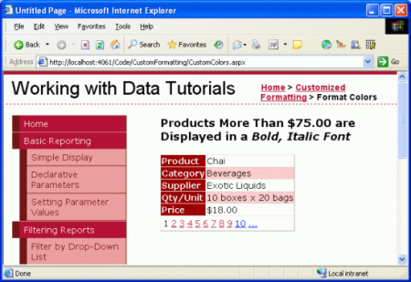](custom-formatting-based-upon-data-vb/_static/image8.png)

**Figure 4**: Prices Less than $75.00 are Displayed in a Normal Font ([Click to view full-size image](custom-formatting-based-upon-data-vb/_static/image10.png))

[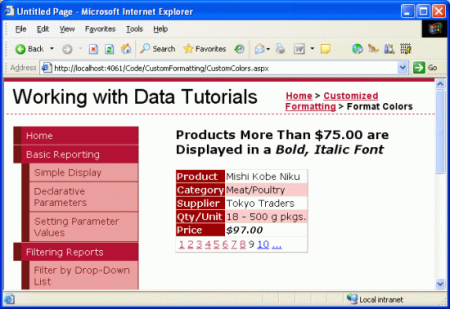](custom-formatting-based-upon-data-vb/_static/image11.png)

**Figure 5**: Expensive Products' Prices are Displayed in a Bold, Italic Font ([Click to view full-size image](custom-formatting-based-upon-data-vb/_static/image13.png))

## Using the FormView Control's`DataBound`Event Handler

The steps for determining the underlying data bound to a FormView are identical to those for a DetailsView create a `DataBound` event handler, cast the `DataItem` property to the appropriate object type bound to the control, and determine how to proceed. The FormView and DetailsView differ, however, in how their user interface's appearance is updated.

The FormView does not contain any BoundFields and therefore lacks the `Rows` collection. Instead, a FormView is composed of templates, which can contain a mix of static HTML, Web controls, and databinding syntax. Adjusting the style of a FormView typically involves adjusting the style of one or more of the Web controls within the FormView's templates.

To illustrate this, let's use a FormView to list products like in the previous example, but this time let's display just the product name and units in stock with the units in stock displayed in a red font if it is less than or equal to 10.

## Step 4: Displaying the Product Information in a FormView

Add a FormView to the `CustomColors.aspx` page beneath the DetailsView and set its `ID` property to `LowStockedProductsInRed`. Bind the FormView to the ObjectDataSource control created from the previous step. This will create an `ItemTemplate`, `EditItemTemplate`, and `InsertItemTemplate` for the FormView. Remove the `EditItemTemplate` and `InsertItemTemplate` and simplify the `ItemTemplate` to include just the `ProductName` and `UnitsInStock` values, each in their own appropriately-named Label controls. As with the DetailsView from the earlier example, also check the Enable Paging checkbox in the FormView's smart tag.

After these edits your FormView's markup should look similar to the following:

[!code-aspx[Main](custom-formatting-based-upon-data-vb/samples/sample8.aspx)]

Note that the `ItemTemplate` contains:

- **Static HTML** the text "Product:" and "Units In Stock:" along with the ` ` and `<b>` elements.
- **Web controls** the two Label controls, `ProductNameLabel` and `UnitsInStockLabel`.
- **Databinding syntax** the `<%# Bind("ProductName") %>` and `<%# Bind("UnitsInStock") %>` syntax, which assigns the values from these fields to the Label controls' `Text` properties.

## Step 5: Programmatically Determining the Value of the Data in the DataBound Event Handler

With the FormView's markup complete, the next step is to programmatically determine if the `UnitsInStock` value is less than or equal to 10. This is accomplished in the exact same manner with the FormView as it was with the DetailsView. Start by creating an event handler for the FormView's `DataBound` event.

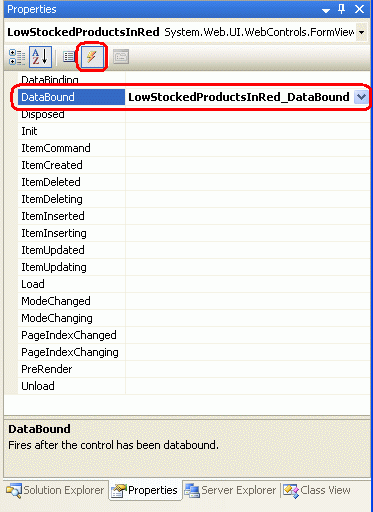

**Figure 6**: Create the `DataBound` Event Handler

In the event handler cast the FormView's `DataItem` property to a `ProductsRow` instance and determine whether the `UnitsInPrice` value is such that we need to display it in a red font.

[!code-vb[Main](custom-formatting-based-upon-data-vb/samples/sample9.vb)]

## Step 6: Formatting the UnitsInStockLabel Label Control in the FormView's ItemTemplate

The final step is to format the displayed `UnitsInStock` value in a red font if the value is 10 or less. To accomplish this we need to programmatically access the `UnitsInStockLabel` control in the `ItemTemplate` and set its style properties so that its text is displayed in red. To access a Web control in a template, use the `FindControl("controlID")` method like this:

[!code-vb[Main](custom-formatting-based-upon-data-vb/samples/sample10.vb)]

For our example we want to access a Label control whose `ID` value is `UnitsInStockLabel`, so we'd use:

[!code-vb[Main](custom-formatting-based-upon-data-vb/samples/sample11.vb)]

Once we have a programmatic reference to the Web control, we can modify its style-related properties as needed. As with the earlier example, I've created a CSS class in `Styles.css` named `LowUnitsInStockEmphasis`. To apply this style to the Label Web control, set its `CssClass` property accordingly.

[!code-vb[Main](custom-formatting-based-upon-data-vb/samples/sample12.vb)]

> [!NOTE]
> The syntax for formatting a template programmatically accessing the Web control using `FindControl("controlID")` and then setting its style-related properties can also be used when using [TemplateFields](https://msdn.microsoft.com/en-us/library/system.web.ui.webcontrols.templatefield(VS.80).aspx) in the DetailsView or GridView controls. We'll examine TemplateFields in our next tutorial.

Figures 7 shows the FormView when viewing a product whose `UnitsInStock` value is greater than 10, while the product in Figure 8 has its value less than 10.

[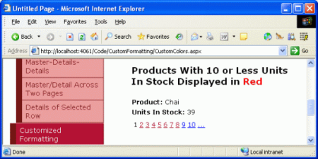](custom-formatting-based-upon-data-vb/_static/image15.png)

**Figure 7**: For Products With a Sufficiently Large Units In Stock, No Custom Formatting is Applied ([Click to view full-size image](custom-formatting-based-upon-data-vb/_static/image17.png))

[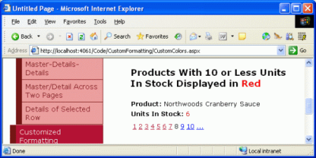](custom-formatting-based-upon-data-vb/_static/image18.png)

**Figure 8**: The Units in Stock Number is Shown in Red for Those Products With Values of 10 or Less ([Click to view full-size image](custom-formatting-based-upon-data-vb/_static/image20.png))

## Formatting with the GridView's`RowDataBound`Event

Earlier we examined the sequence of steps the DetailsView and FormView controls progress through during databinding. Let's look over these steps once again as a refresher.

1. The data Web control's `DataBinding` event fires.
2. The data is bound to the data Web control.
3. The data Web control's `DataBound` event fires.

These three simple steps are sufficient for the DetailsView and FormView because they display only a single record. For the GridView, which displays *all* records bound to it (not just the first), step 2 is a bit more involved.

In step 2 the GridView enumerates the data source and, for each record, creates a `GridViewRow` instance and binds the current record to it. For each `GridViewRow` added to the GridView, two events are raised:

- **`RowCreated`** fires after the `GridViewRow` has been created
- **`RowDataBound`** fires after the current record has been bound to the `GridViewRow`.

For the GridView, then, data binding is more accurately described by the following sequence of steps:

1. The GridView's `DataBinding` event fires.
2. The data is bound to the GridView.   
  
 For each record in the data source 

    1. Create a `GridViewRow` object
    2. Fire the `RowCreated` event
    3. Bind the record to the `GridViewRow`
    4. Fire the `RowDataBound` event
    5. Add the `GridViewRow` to the `Rows` collection
3. The GridView's `DataBound` event fires.

To customize the format of the GridView's individual records, then, we need to create an event handler for the `RowDataBound` event. To illustrate this, let's add a GridView to the `CustomColors.aspx` page that lists the name, category, and price for each product, highlighting those products whose price is less than $10.00 with a yellow background color.

## Step 7: Displaying Product Information in a GridView

Add a GridView beneath the FormView from the previous example and set its `ID` property to `HighlightCheapProducts`. Since we already have an ObjectDataSource that returns all products on the page, bind the GridView to that. Finally, edit the GridView's BoundFields to include just the products' names, categories, and prices. After these edits the GridView's markup should look like:

[!code-aspx[Main](custom-formatting-based-upon-data-vb/samples/sample13.aspx)]

Figure 9 shows our progress to this point when viewed through a browser.

[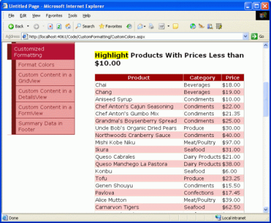](custom-formatting-based-upon-data-vb/_static/image21.png)

**Figure 9**: The GridView Lists the Name, Category, and Price For Each Product ([Click to view full-size image](custom-formatting-based-upon-data-vb/_static/image23.png))

## Step 8: Programmatically Determining the Value of the Data in the RowDataBound Event Handler

When the `ProductsDataTable` is bound to the GridView its `ProductsRow` instances are enumerated and for each `ProductsRow` a `GridViewRow` is created. The `GridViewRow`'s `DataItem` property is assigned to the particular `ProductRow`, after which the GridView's `RowDataBound` event handler is raised. To determine the `UnitPrice` value for each product bound to the GridView, then, we need to create an event handler for the GridView's `RowDataBound` event. In this event handler we can inspect the `UnitPrice` value for the current `GridViewRow` and make a formatting decision for that row.

This event handler can be created using the same series of steps as with the FormView and DetailsView.

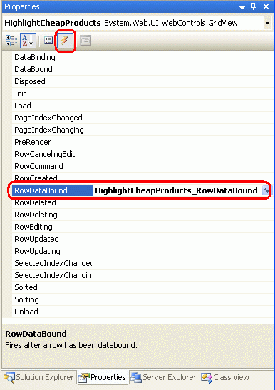

**Figure 10**: Create an Event Handler for the GridView's `RowDataBound` Event

Creating the event hander in this manner will cause the following code to be automatically added to the ASP.NET page's code portion:

[!code-vb[Main](custom-formatting-based-upon-data-vb/samples/sample14.vb)]

When the `RowDataBound` event fires, the event handler is passed as its second parameter an object of type `GridViewRowEventArgs`, which has a property named `Row`. This property returns a reference to the `GridViewRow` that was just data bound. To access the `ProductsRow` instance bound to the `GridViewRow` we use the `DataItem` property like so:

[!code-vb[Main](custom-formatting-based-upon-data-vb/samples/sample15.vb)]

When working with the `RowDataBound` event handler it is important to keep in mind that the GridView is composed of different types of rows and that this event is fired for *all* row types. A `GridViewRow`'s type can be determined by its `RowType` property, and can have one of the possible values:

- `DataRow` a row that is bound to a record from the GridView's `DataSource`
- `EmptyDataRow` the row displayed if the GridView's `DataSource` is empty
- `Footer` the footer row; shown if the GridView's `ShowFooter` property is set to `True`
- `Header` the header row; shown if the GridView's ShowHeader property is set to `True` (the default)
- `Pager` for GridView's that implement paging, the row that displays the paging interface
- `Separator` not used for the GridView, but used by the `RowType` properties for the DataList and Repeater controls, two data Web controls we'll discuss in future tutorials

Since the `EmptyDataRow`, `Header`, `Footer`, and `Pager` rows aren't associated with a `DataSource` record, they will always have a value of `Nothing` for their `DataItem` property. For this reason, before attempting to work with the current `GridViewRow`'s `DataItem` property, we first must make sure that we're dealing with a `DataRow`. This can be accomplished by checking the `GridViewRow`'s `RowType` property like so:

[!code-vb[Main](custom-formatting-based-upon-data-vb/samples/sample16.vb)]

## Step 9: Highlighting the Row Yellow When the UnitPrice Value is Less than $10.00

The last step is to programmatically highlight the entire `GridViewRow` if the `UnitPrice` value for that row is less than $10.00. The syntax for accessing a GridView's rows or cells is the same as with the DetailsView `GridViewID.Rows(index)` to access the entire row, `GridViewID.Rows(index).Cells(index)` to access a particular cell. However, when the `RowDataBound` event handler fires the data bound `GridViewRow` has yet to be added to the GridView's `Rows` collection. Therefore you cannot access the current `GridViewRow` instance from the `RowDataBound` event handler using the Rows collection.

Instead of `GridViewID.Rows(index)`, we can reference the current `GridViewRow` instance in the `RowDataBound` event handler using `e.Row`. That is, in order to highlight the current `GridViewRow` instance from the `RowDataBound` event handler we would use:

[!code-vb[Main](custom-formatting-based-upon-data-vb/samples/sample17.vb)]

Rather than set the `GridViewRow`'s `BackColor` property directly, let's stick with using CSS classes. I've created a CSS class named `AffordablePriceEmphasis` that sets the background color to yellow. The completed `RowDataBound` event handler follows:

[!code-vb[Main](custom-formatting-based-upon-data-vb/samples/sample18.vb)]

[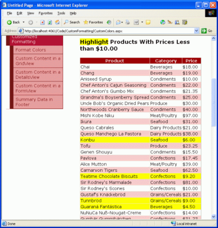](custom-formatting-based-upon-data-vb/_static/image25.png)

**Figure 11**: The Most Affordable Products are Highlighted Yellow ([Click to view full-size image](custom-formatting-based-upon-data-vb/_static/image27.png))

## Summary

In this tutorial we saw how to format the GridView, DetailsView, and FormView based on the data bound to the control. To accomplish this we created an event handler for the `DataBound` or `RowDataBound` events, where the underlying data was examined along with a formatting change, if needed. To access the data bound to a DetailsView or FormView, we use the `DataItem` property in the `DataBound` event handler; for a GridView, each `GridViewRow` instance's `DataItem` property contains the data bound to that row, which is available in the `RowDataBound` event handler.

The syntax for programmatically adjusting the data Web control's formatting depends upon the Web control and how the data to be formatted is displayed. For DetailsView and GridView controls, the rows and cells can be accessed by an ordinal index. For the FormView, which uses templates, the `FindControl("controlID")` method is commonly used to locate a Web control from within the template.

In the next tutorial we'll look at how to use templates with the GridView and DetailsView. Additionally, we'll see another technique for customizing the formatting based on the underlying data.

Happy Programming!

## About the Author

[Scott Mitchell](http://www.4guysfromrolla.com/ScottMitchell.shtml), author of seven ASP/ASP.NET books and founder of [4GuysFromRolla.com](http://www.4guysfromrolla.com), has been working with Microsoft Web technologies since 1998. Scott works as an independent consultant, trainer, and writer. His latest book is [*Sams Teach Yourself ASP.NET 2.0 in 24 Hours*](https://www.amazon.com/exec/obidos/ASIN/0672327384/4guysfromrollaco). He can be reached at [mitchell@4GuysFromRolla.com.](mailto:mitchell@4GuysFromRolla.com) or via his blog, which can be found at [http://ScottOnWriting.NET](http://ScottOnWriting.NET).

## Special Thanks To

This tutorial series was reviewed by many helpful reviewers. Lead reviewers for this tutorial were E.R. Gilmore, Dennis Patterson, and Dan Jagers. Interested in reviewing my upcoming MSDN articles? If so, drop me a line at [mitchell@4GuysFromRolla.com.](mailto:mitchell@4GuysFromRolla.com)

>[!div class="step-by-step"]
[Previous](displaying-summary-information-in-the-gridview-s-footer-cs.md)
[Next](using-templatefields-in-the-gridview-control-vb.md)