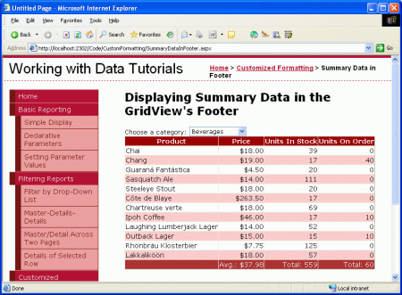
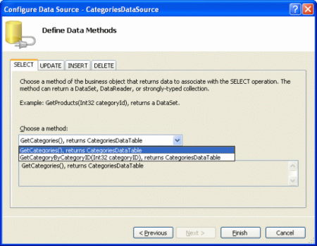
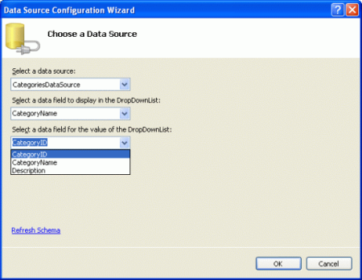
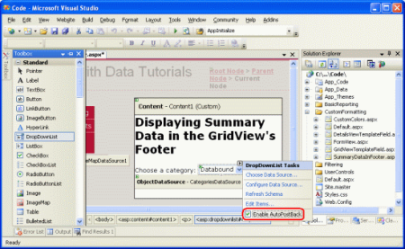
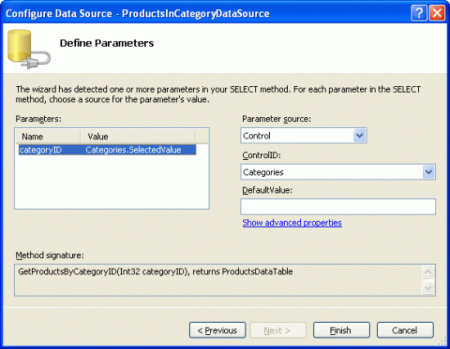
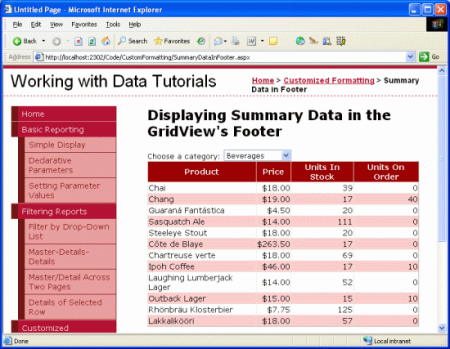
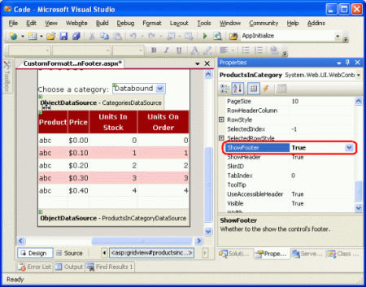
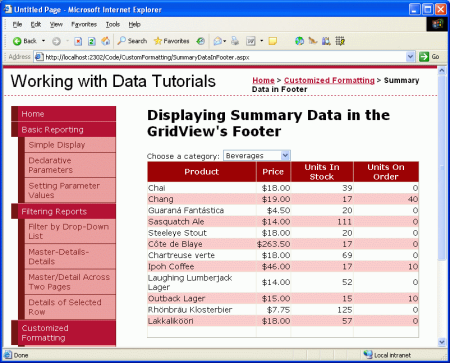
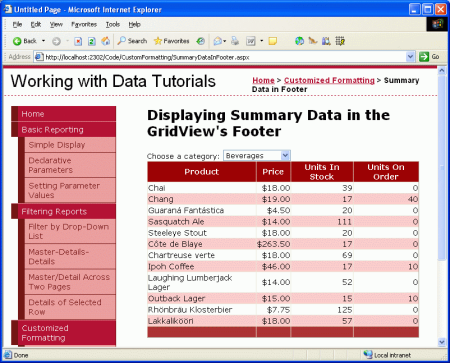

Displaying Summary Information in the GridView's Footer (C#)
====================
by [Scott Mitchell](https://twitter.com/ScottOnWriting)

[Download Sample App](http://download.microsoft.com/download/9/6/9/969e5c94-dfb6-4e47-9570-d6d9e704c3c1/ASPNET_Data_Tutorial_15_CS.exe) or [Download PDF](displaying-summary-information-in-the-gridview-s-footer-cs/_static/datatutorial15cs1.pdf)

> Summary information is often displayed at the bottom of the report in a summary row. The GridView control can include a footer row into whose cells we can programmatically inject aggregate data. In this tutorial we'll see how to display aggregate data in this footer row.

## Introduction

In addition to seeing each of the products' prices, units in stock, units on order, and reorder levels, a user might also be interested in aggregate information, such as the average price, the total number of units in stock, and so on. Such summary information is often displayed at the bottom of the report in a summary row. The GridView control can include a footer row into whose cells we can programmatically inject aggregate data.

This task presents us with three challenges:

1. Configuring the GridView to display its footer row
2. Determining the summary data; that is, how do we compute the average price or the total of the units in stock?
3. Injecting the summary data into the appropriate cells of the footer row

In this tutorial we'll see how to overcome these challenges. Specifically, we'll create a page that lists the categories in a drop-down list with the selected category's products displayed in a GridView. The GridView will include a footer row that shows the average price and total number of units in stock and on order for products in that category.

**Figure 1**: Summary Information is Displayed in the GridView's Footer Row ([Click to view full-size image](displaying-summary-information-in-the-gridview-s-footer-cs/_static/image3.png))

This tutorial, with its category to products master/detail interface, builds upon the concepts covered in the earlier [Master/Detail Filtering With a DropDownList](../masterdetail/master-detail-filtering-with-a-dropdownlist-cs.md) tutorial. If you've not yet worked through the earlier tutorial, please do so before continuing on with this one.

## Step 1: Adding the Categories DropDownList and Products GridView

Before concerning ourselves with adding summary information to the GridView's footer, let's first simply build the master/detail report. Once we've completed this first step, we'll look at how to include summary data.

Start by opening the `SummaryDataInFooter.aspx` page in the `CustomFormatting` folder. Add a DropDownList control and set its `ID` to `Categories`. Next, click on the Choose Data Source link from the DropDownList's smart tag and opt to add a new ObjectDataSource named `CategoriesDataSource` that invokes the `CategoriesBLL` class's `GetCategories()` method.

**Figure 2**: Add a New ObjectDataSource Named `CategoriesDataSource` ([Click to view full-size image](displaying-summary-information-in-the-gridview-s-footer-cs/_static/image6.png))

**Figure 3**: Have the ObjectDataSource Invoke the `CategoriesBLL` Class's `GetCategories()` Method ([Click to view full-size image](displaying-summary-information-in-the-gridview-s-footer-cs/_static/image9.png))

After configuring the ObjectDataSource, the wizard returns us to the DropDownList's Data Source Configuration wizard from which we need to specify what data field value should be displayed and which one should correspond to the value of the DropDownList's `ListItem` s. Have the `CategoryName` field displayed and use the `CategoryID` as the value.

**Figure 4**: Use the `CategoryName` and `CategoryID` Fields as the `Text` and `Value` for the `ListItem` s, Respectively ([Click to view full-size image](displaying-summary-information-in-the-gridview-s-footer-cs/_static/image12.png))

At this point we have a DropDownList (`Categories`) that lists the categories in the system. We now need to add a GridView that lists those products that belong to the selected category. Before we do, though, take a moment to check the Enable AutoPostBack checkbox in the DropDownList's smart tag. As discussed in the *Master/Detail Filtering With a DropDownList* tutorial, by setting the DropDownList's `AutoPostBack` property to `true` the page will be posted back each time the DropDownList value is changed. This will cause the GridView to be refreshed, showing those products for the newly selected category. If the `AutoPostBack` property is set to `false` (the default), changing the category won't cause a postback and therefore won't update the listed products.

**Figure 5**: Check the Enable AutoPostBack Checkbox in the DropDownList's Smart Tag ([Click to view full-size image](displaying-summary-information-in-the-gridview-s-footer-cs/_static/image15.png))

Add a GridView control to the page in order to display the products for the selected category. Set the GridView's `ID` to `ProductsInCategory` and bind it to a new ObjectDataSource named `ProductsInCategoryDataSource`.

**Figure 6**: Add a New ObjectDataSource Named `ProductsInCategoryDataSource` ([Click to view full-size image](displaying-summary-information-in-the-gridview-s-footer-cs/_static/image18.png))

Configure the ObjectDataSource so that it invokes the `ProductsBLL` class's `GetProductsByCategoryID(categoryID)` method.

**Figure 7**: Have the ObjectDataSource Invoke the `GetProductsByCategoryID(categoryID)` Method ([Click to view full-size image](displaying-summary-information-in-the-gridview-s-footer-cs/_static/image21.png))

Since the `GetProductsByCategoryID(categoryID)` method takes in an input parameter, in the final step of the wizard we can specify the source of the parameter value. In order to display those products from the selected category, have the parameter pulled from the `Categories` DropDownList.

**Figure 8**: Get the *`categoryID`* Parameter Value from the Selected Categories DropDownList ([Click to view full-size image](displaying-summary-information-in-the-gridview-s-footer-cs/_static/image24.png))

After completing the wizard the GridView will have a BoundField for each of the product properties. Let's clean up these BoundFields so that only the `ProductName`, `UnitPrice`, `UnitsInStock`, and `UnitsOnOrder` BoundFields are displayed. Feel free to add any field-level settings to the remaining BoundFields (such as formatting the `UnitPrice` as a currency). After making these changes, the GridView's declarative markup should look similar to the following:

[!code-aspx[Main](displaying-summary-information-in-the-gridview-s-footer-cs/samples/sample1.aspx)]

At this point we have a fully functioning master/detail report that shows the name, unit price, units in stock, and units on order for those products that belong to the selected category.

**Figure 9**: Get the *`categoryID`* Parameter Value from the Selected Categories DropDownList ([Click to view full-size image](displaying-summary-information-in-the-gridview-s-footer-cs/_static/image27.png))

## Step 2: Displaying a Footer in the GridView

The GridView control can display both a header and footer row. These rows are displayed depending on the values of the `ShowHeader` and `ShowFooter` properties, respectively, with `ShowHeader` defaulting to `true` and `ShowFooter` to `false`. To include a footer in the GridView simply set its `ShowFooter` property to `true`.

**Figure 10**: Set the GridView's `ShowFooter` Property to `true` ([Click to view full-size image](displaying-summary-information-in-the-gridview-s-footer-cs/_static/image30.png))

The footer row has a cell for each of the fields defined in the GridView; however, these cells are empty by default. Take a moment to view our progress in a browser. With the `ShowFooter` property now set to `true`, the GridView includes an empty footer row.

**Figure 11**: The GridView Now Includes a Footer Row ([Click to view full-size image](displaying-summary-information-in-the-gridview-s-footer-cs/_static/image33.png))

The footer row in Figure 11 doesn't stand out, as it has a white background. Let's create a `FooterStyle` CSS class in `Styles.css` that specifies a dark red background and then configure the `GridView.skin` Skin file in the `DataWebControls` Theme to assign this CSS class to the GridView's `FooterStyle`'s `CssClass` property. If you need to brush up on Skins and Themes, refer back to the [Displaying Data With the ObjectDataSource](../basic-reporting/displaying-data-with-the-objectdatasource-cs.md) tutorial.

Start by adding the following CSS class to `Styles.css`:

[!code-css[Main](displaying-summary-information-in-the-gridview-s-footer-cs/samples/sample2.css)]

The `FooterStyle` CSS class is similar in style to the `HeaderStyle` class, although the `HeaderStyle`'s background color is subtlety darker and its text is displayed in a bold font. Furthermore, the text in the footer is right-aligned whereas the header's text is centered.

Next, to associate this CSS class with every GridView's footer, open the `GridView.skin` file in the `DataWebControls` Theme and set the `FooterStyle`'s `CssClass` property. After this addition the file's markup should look like:

[!code-aspx[Main](displaying-summary-information-in-the-gridview-s-footer-cs/samples/sample3.aspx)]

As the screen shot below shows, this change makes the footer stand out more clearly.

**Figure 12**: The GridView's Footer Row Now Has a Reddish Background Color ([Click to view full-size image](displaying-summary-information-in-the-gridview-s-footer-cs/_static/image36.png))

## Step 3: Computing the Summary Data

With the GridView's footer displayed, the next challenge facing us is how to compute the summary data. There are two ways to compute this aggregate information:

1. Through a SQL query we could issue an additional query to the database to compute the summary data for a particular category. SQL includes a number of aggregate functions along with a `GROUP BY` clause to specify the data over which the data should be summarized. The following SQL query would bring back the needed information:  

    [!code-sql[Main](displaying-summary-information-in-the-gridview-s-footer-cs/samples/sample4.sql)]

    Of course you wouldn't want to issue this query directly from the `SummaryDataInFooter.aspx` page, but rather by creating a method in the `ProductsTableAdapter` and the `ProductsBLL`.
2. Compute this information as it's being added to the GridView as discussed in [Custom Formatting Based Upon Data](custom-formatting-based-upon-data-cs.md) tutorial, the GridView's `RowDataBound` event handler fires once for each row being added to the GridView after its been databound. By creating an event handler for this event we can keep a running total of the values we want to aggregate. After the last data row has been bound to the GridView we have the totals and the information needed to compute the average.

I typically employ the second approach as it saves a trip to the database and the effort needed to implement the summary functionality in the Data Access Layer and Business Logic Layer, but either approach would suffice. For this tutorial let's use the second option and keep track of the running total using the `RowDataBound` event handler.

Create a `RowDataBound` event handler for the GridView by selecting the GridView in the Designer, clicking the lightning bolt icon from the Properties window, and double-clicking the `RowDataBound` event. This will create a new event handler named `ProductsInCategory_RowDataBound` in the `SummaryDataInFooter.aspx` page's code-behind class.

[!code-csharp[Main](displaying-summary-information-in-the-gridview-s-footer-cs/samples/sample5.cs)]

In order to maintain a running total we need to define variables outside of the scope of the event handler. Create the following four page-level variables:

- `_totalUnitPrice`, of type `decimal`
- `_totalNonNullUnitPriceCount`, of type `int`
- `_totalUnitsInStock`, of type `int`
- `_totalUnitsOnOrder`, of type `int`

Next, write the code to increment these three variables for each data row encountered in the `RowDataBound` event handler.

[!code-csharp[Main](displaying-summary-information-in-the-gridview-s-footer-cs/samples/sample6.cs)]

The `RowDataBound` event handler starts by ensuring that we're dealing with a DataRow. Once that's been established, the `Northwind.ProductsRow` instance that was just bound to the `GridViewRow` object in `e.Row` is stored in the variable `product`. Next, running total variables are incremented by the current product's corresponding values (assuming that they don't contain a database `NULL` value). We keep track of both the running `UnitPrice` total and the number of non-`NULL` `UnitPrice` records because the average price is the quotient of these two numbers.

## Step 4: Displaying the Summary Data in the Footer

With the summary data totaled, the last step is to display it in the GridView's footer row. This task, too, can be accomplished programmatically through the `RowDataBound` event handler. Recall that the `RowDataBound` event handler fires for *every* row that's bound to the GridView, including the footer row. Therefore, we can augment our event handler to display the data in the footer row using the following code:

[!code-csharp[Main](displaying-summary-information-in-the-gridview-s-footer-cs/samples/sample7.cs)]

Since the footer row is added to the GridView after all of the data rows have been added, we can be confident that by the time we're ready to display the summary data in the footer the running total calculations will have completed. The last step, then, is to set these values in the footer's cells.

To display text in a particular footer cell, use `e.Row.Cells[index].Text = value`, where the `Cells` indexing starts at 0. The following code computes the average price (the total price divided by the number of products) and displays it along with the total number of units in stock and units on order in the appropriate footer cells of the GridView.

[!code-csharp[Main](displaying-summary-information-in-the-gridview-s-footer-cs/samples/sample8.cs)]

Figure 13 shows the report after this code has been added. Note how the `ToString("c")` causes the average price summary information to be formatted like a currency.

**Figure 13**: The GridView's Footer Row Now Has a Reddish Background Color ([Click to view full-size image](displaying-summary-information-in-the-gridview-s-footer-cs/_static/image39.png))

## Summary

Displaying summary data is a common report requirement, and the GridView control makes it easy to include such information in its footer row. The footer row is displayed when the GridView's `ShowFooter` property is set to `true` and can have the text in its cells set programmatically through the `RowDataBound` event handler. Computing the summary data can either be done by re-querying the database or by using code in the ASP.NET page's code-behind class to programmatically compute the summary data.

This tutorial concludes our examination of custom formatting with the GridView, DetailsView, and FormView controls. Our next tutorial kicks off our exploration of inserting, updating, and deleting data using these same controls.

Happy Programming!

## About the Author

[Scott Mitchell](http://www.4guysfromrolla.com/ScottMitchell.shtml), author of seven ASP/ASP.NET books and founder of [4GuysFromRolla.com](http://www.4guysfromrolla.com), has been working with Microsoft Web technologies since 1998. Scott works as an independent consultant, trainer, and writer. His latest book is [*Sams Teach Yourself ASP.NET 2.0 in 24 Hours*](https://www.amazon.com/exec/obidos/ASIN/0672327384/4guysfromrollaco). He can be reached at [mitchell@4GuysFromRolla.com.](mailto:mitchell@4GuysFromRolla.com) or via his blog, which can be found at [http://ScottOnWriting.NET](http://ScottOnWriting.NET).

>[!div class="step-by-step"]
[Previous](using-the-formview-s-templates-cs.md)
[Next](custom-formatting-based-upon-data-vb.md)