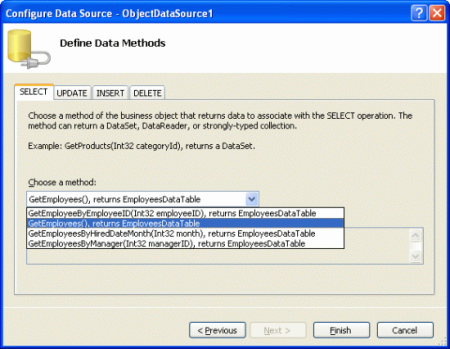
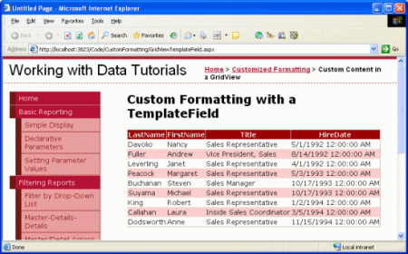
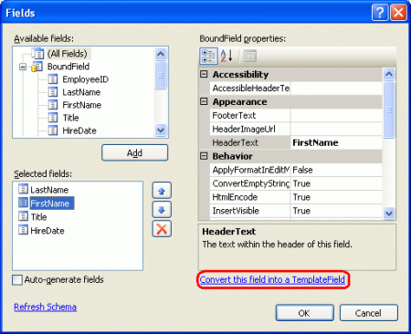
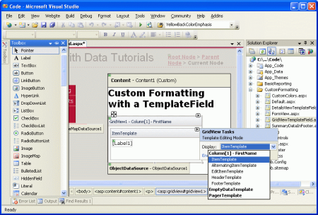
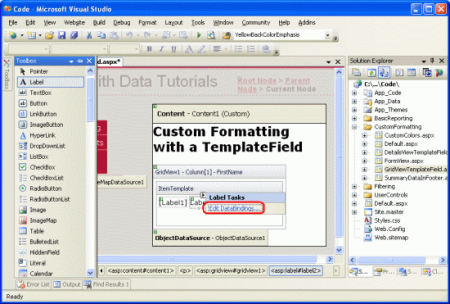
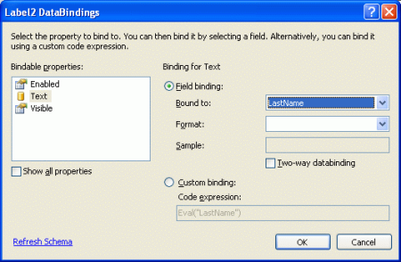
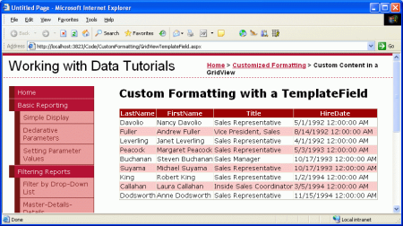
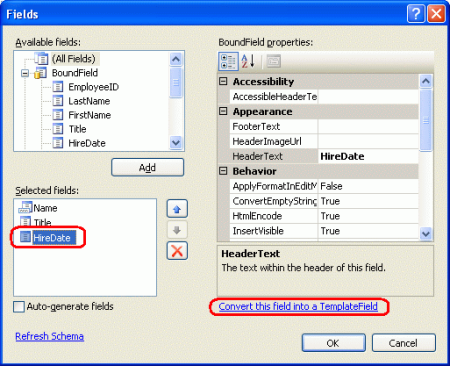
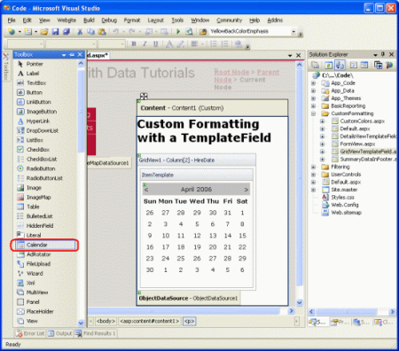

Using TemplateFields in the GridView Control (VB)
====================
by [Scott Mitchell](https://twitter.com/ScottOnWriting)

[Download Sample App](http://download.microsoft.com/download/5/7/0/57084608-dfb3-4781-991c-407d086e2adc/ASPNET_Data_Tutorial_12_VB.exe) or [Download PDF](using-templatefields-in-the-gridview-control-vb/_static/datatutorial12vb1.pdf)

> To provide flexibility, the GridView offers the TemplateField, which renders using a template. A template can include a mix of static HTML, Web controls, and databinding syntax. In this tutorial we'll examine how to use the TemplateField to achieve a greater degree of customization with the GridView control.

## Introduction

The GridView is composed of a set of fields that indicate what properties from the `DataSource` are to be included in the rendered output along with how the data will be displayed. The simplest field type is the BoundField, which displays a data value as text. Other field types display the data using alternate HTML elements. The CheckBoxField, for example, renders as a checkbox whose checked state depends on the value of a specified data field; the ImageField renders an image whose image source is based upon a specified data field. Hyperlinks and buttons whose state depends on an underlying data field value can be rendered using the HyperLinkField and ButtonField field types.

While the CheckBoxField, ImageField, HyperLinkField, and ButtonField field types allow for an alternate view of the data, they still are fairly limited with respect to formatting. A CheckBoxField can only display a single checkbox, whereas an ImageField can only display a single image. What if a particular field needs to display some text, a checkbox, *and* an image, all based upon different data field values? Or what if we wanted to display the data using a Web control other than the CheckBox, Image, HyperLink, or Button? Furthermore, the BoundField limits its display to a single data field. What if we wanted to show two or more data field values in a single GridView column?

To accommodate this level of flexibility the GridView offers the TemplateField, which renders using a *template*. A template can include a mix of static HTML, Web controls, and databinding syntax. Furthermore, the TemplateField has a variety of templates that can be used to customize the rendering for different situations. For example, the `ItemTemplate` is used by default to render the cell for each row, but the `EditItemTemplate` template can be used to customize the interface when editing data.

In this tutorial we'll examine how to use the TemplateField to achieve a greater degree of customization with the GridView control. In the [preceding tutorial](custom-formatting-based-upon-data-vb.md) we saw how to customize the formatting based on the underlying data using the `DataBound` and `RowDataBound` event handlers. Another way to customize the formatting based on the underlying data is by calling formatting methods from within a template. We'll look at this technique in this tutorial as well.

For this tutorial we will use TemplateFields to customize the appearance of a list of employees. Specifically, we'll list all of the employees, but will display the employee's first and last names in one column, their hire date in a Calendar control, and a status column that indicates how many days they've been employed at the company.

**Figure 1**: Three TemplateFields are Used to Customize the Display ([Click to view full-size image](using-templatefields-in-the-gridview-control-vb/_static/image3.png))

## Step 1: Binding the Data to the GridView

In reporting scenarios where you need to use TemplateFields to customize the appearance, I find it easiest to start by creating a GridView control that contains just BoundFields first and then to add new TemplateFields or convert the existing BoundFields to TemplateFields as needed. Therefore, let's start this tutorial by adding a GridView to the page through the Designer and binding it to an ObjectDataSource that returns the list of employees. These steps will create a GridView with BoundFields for each of the employee fields.

Open the `GridViewTemplateField.aspx` page and drag a GridView from the Toolbox onto the Designer. From the GridView's smart tag choose to add a new ObjectDataSource control that invokes the `EmployeesBLL` class's `GetEmployees()` method.

**Figure 2**: Add a New ObjectDataSource Control that Invokes the `GetEmployees()` Method ([Click to view full-size image](using-templatefields-in-the-gridview-control-vb/_static/image6.png))

Binding the GridView in this manner will automatically add a BoundField for each of the employee properties: `EmployeeID`, `LastName`, `FirstName`, `Title`, `HireDate`, `ReportsTo`, and `Country`. For this report let's not bother with displaying the `EmployeeID`, `ReportsTo`, or `Country` properties. To remove these BoundFields you can:

- Use the Fields dialog box click on the Edit Columns link from the GridView's smart tag to bring up this dialog box. Next, select the BoundFields from the lower left list and click the red X button to remove the BoundField.
- Edit the GridView's declarative syntax by hand from the Source view, delete the `<asp:BoundField>` element for the BoundField you wish to remove.

After you have removed the `EmployeeID`, `ReportsTo`, and `Country` BoundFields, your GridView's markup should look like:

[!code-aspx[Main](using-templatefields-in-the-gridview-control-vb/samples/sample1.aspx)]

Take a moment to view our progress in a browser. At this point you should see a table with a record for each employee and four columns: one for the employee's last name, one for their first name, one for their title, and one for their hire date.

**Figure 3**: The `LastName`, `FirstName`, `Title`, and `HireDate` Fields are Displayed for Each Employee ([Click to view full-size image](using-templatefields-in-the-gridview-control-vb/_static/image9.png))

## Step 2: Displaying the First and Last Names in a Single Column

Currently, each employee's first and last names are displayed in a separate column. It might be nice to combine them into a single column instead. To accomplish this we need to use a TemplateField. We can either add a new TemplateField, add to it the needed markup and databinding syntax, and then delete the `FirstName` and `LastName` BoundFields, or we can convert the `FirstName` BoundField into a TemplateField, edit the TemplateField to include the `LastName` value, and then remove the `LastName` BoundField.

Both approaches net the same result, but personally I like converting BoundFields to TemplateFields when possible because the conversion automatically adds an `ItemTemplate` and `EditItemTemplate` with Web controls and databinding syntax to mimic the appearance and functionality of the BoundField. The benefit is that we'll need to do less work with the TemplateField as the conversion process will have performed some of the work for us.

To convert an existing BoundField into a TemplateField, click on the Edit Columns link from the GridView's smart tag, bringing up the Fields dialog box. Select the BoundField to convert from the list in the lower left corner and then click the "Convert this field into a TemplateField" link in the bottom right corner.

**Figure 4**: Convert a BoundField Into a TemplateField from the Fields Dialog Box ([Click to view full-size image](using-templatefields-in-the-gridview-control-vb/_static/image12.png))

Go ahead and convert the `FirstName` BoundField into a TemplateField. After this change there's no perceptive difference in the Designer. This is because converting the BoundField into a TemplateField creates a TemplateField that maintains the look and feel of the BoundField. Despite there being no visual difference at this point in the Designer, this conversion process has replaced the BoundField's declarative syntax - `<asp:BoundField DataField="FirstName" HeaderText="FirstName" SortExpression="FirstName" />` - with the following TemplateField syntax:

[!code-aspx[Main](using-templatefields-in-the-gridview-control-vb/samples/sample2.aspx)]

As you can see, the TemplateField consists of two templates an `ItemTemplate` that has a Label whose `Text` property is set to the value of the `FirstName` data field, and an `EditItemTemplate` with a TextBox control whose `Text` property is also set to the `FirstName` data field. The databinding syntax - `<%# Bind("fieldName") %>` - indicates that the data field *`fieldName`* is bound to the specified Web control property.

To add the `LastName` data field value to this TemplateField we need to add another Label Web control in the `ItemTemplate` and bind its `Text` property to `LastName`. This can be accomplished either by hand or through the Designer. To do it by hand, simply add the appropriate declarative syntax to the `ItemTemplate`:

[!code-aspx[Main](using-templatefields-in-the-gridview-control-vb/samples/sample3.aspx)]

To add it through the Designer, click on the Edit Templates link from the GridView's smart tag. This will display the GridView's template editing interface. In this interface's smart tag is a list of the templates in the GridView. Since we only have one TemplateField at this point, the only templates listed in the drop-down list are those templates for the `FirstName` TemplateField along with the `EmptyDataTemplate` and `PagerTemplate`. The `EmptyDataTemplate` template, if specified, is used to render the GridView's output if there are no results in the data bound to the GridView; the `PagerTemplate`, if specified, is used to render the paging interface for a GridView that supports paging.

**Figure 5**: The GridView's Templates Can Be Edited Through the Designer ([Click to view full-size image](using-templatefields-in-the-gridview-control-vb/_static/image15.png))

To also display the `LastName` in the `FirstName` TemplateField drag the Label control from the Toolbox into the `FirstName` TemplateField's `ItemTemplate` in the GridView's template editing interface.

**Figure 6**: Add a Label Web Control to the `FirstName` TemplateField's ItemTemplate ([Click to view full-size image](using-templatefields-in-the-gridview-control-vb/_static/image18.png))

At this point the Label Web control added to the TemplateField has its `Text` property set to "Label". We need to change this so that this property is bound to the value of the `LastName` data field instead. To accomplish this click on the Label control's smart tag and choose the Edit DataBindings option.

**Figure 7**: Choose the Edit DataBindings Option from the Label's Smart Tag ([Click to view full-size image](using-templatefields-in-the-gridview-control-vb/_static/image21.png))

This will bring up the DataBindings dialog box. From here you can select the property to participate in databinding from the list on the left and choose the field to bind the data to from the drop-down list on the right. Choose the `Text` property from the left and the `LastName` field from the right and click OK.

**Figure 8**: Bind the `Text` Property to the `LastName` Data Field ([Click to view full-size image](using-templatefields-in-the-gridview-control-vb/_static/image24.png))

> [!NOTE]
> The DataBindings dialog box allows you to indicate whether to perform two-way databinding. If you leave this unchecked, the databinding syntax `<%# Eval("LastName")%>` will be used instead of `<%# Bind("LastName")%>`. Either approach is fine for this tutorial. Two-way databinding becomes important when inserting and editing data. For simply displaying data, however, either approach will work equally well. We'll discuss two-way databinding in detail in future tutorials.

Take a moment to view this page through a browser. As you can see, the GridView still includes four columns; however, the `FirstName` column now lists *both* the `FirstName` and `LastName` data field values.

**Figure 9**: Both the `FirstName` and `LastName` Values are Shown in a Single Column ([Click to view full-size image](using-templatefields-in-the-gridview-control-vb/_static/image27.png))

To complete this first step, remove the `LastName` BoundField and rename the `FirstName` TemplateField's `HeaderText` property to "Name". After these changes the GridView's declarative markup should look like the following:

[!code-aspx[Main](using-templatefields-in-the-gridview-control-vb/samples/sample4.aspx)]

**Figure 10**: Each Employee's First and Last Names are Displayed in One Column ([Click to view full-size image](using-templatefields-in-the-gridview-control-vb/_static/image30.png))

## Step 3: Using the Calendar Control to Display the`HiredDate`Field

Displaying a data field value as text in a GridView is as simple as using a BoundField. For certain scenarios, however, the data is best expressed using a particular Web control instead of just text. Such customization of the display of data is possible with TemplateFields. For example, rather than display the employee's hire date as text, we could show a calendar (using [the Calendar control](https://msdn.microsoft.com/en-us/library/system.web.ui.webcontrols.calendar(VS.80).aspx)) with their hire date highlighted.

To accomplish this, start by converting the `HiredDate` BoundField into a TemplateField. Simply go to the GridView's smart tag and click the Edit Columns link, bringing up the Fields dialog box. Select the `HiredDate` BoundField and click "Convert this field into a TemplateField."

**Figure 11**: Convert the `HiredDate` BoundField Into a TemplateField ([Click to view full-size image](using-templatefields-in-the-gridview-control-vb/_static/image33.png))

As we saw in Step 2, this will replace the BoundField with a TemplateField that contains an `ItemTemplate` and `EditItemTemplate` with a Label and TextBox whose `Text` properties are bound to the `HiredDate` value using the databinding syntax `<%# Bind("HiredDate")%>`.

To replace the text with a Calendar control, edit the template by removing the Label and adding a Calendar control. From the Designer, select Edit Templates from the GridView's smart tag and choose the `HireDate` TemplateField's `ItemTemplate` from the drop-down list. Next, delete the Label control and drag a Calendar control from the Toolbox into the template editing interface.

**Figure 12**: Add a Calendar Control to the `HireDate` TemplateField's `ItemTemplate` ([Click to view full-size image](using-templatefields-in-the-gridview-control-vb/_static/image36.png))

At this point each row in the GridView will contain a Calendar control in its `HiredDate` TemplateField. However, the employee's actual `HiredDate` value is not set anywhere in the Calendar control, causing each Calendar control to default to showing the current month and date. To remedy this, we need to assign each employee's `HiredDate` to the Calendar control's [SelectedDate](https://msdn.microsoft.com/en-us/library/system.web.ui.webcontrols.calendar.selecteddate(VS.80).aspx) and [VisibleDate](https://msdn.microsoft.com/en-us/library/system.web.ui.webcontrols.calendar.visibledate(VS.80).aspx) properties.

From the Calendar control's smart tag, choose Edit DataBindings. Next, bind both `SelectedDate` and `VisibleDate` properties to the `HiredDate` data field.

**Figure 13**: Bind the `SelectedDate` and `VisibleDate` Properties to the `HiredDate` Data Field ([Click to view full-size image](using-templatefields-in-the-gridview-control-vb/_static/image39.png))

> [!NOTE]
> The Calendar control's selected date need not necessarily be visible. For example, a Calendar may have August 1st, 1999 as the selected date, but be showing the current month and year. The selected date and visible date are specified by the Calendar control's `SelectedDate` and `VisibleDate` properties. Since we want to both select the employee's `HiredDate` and make sure that it's shown we need to bind both of these properties to the `HireDate` data field.

When viewing the page in a browser, the calendar now shows the month of the employee's hired date and selects that particular date.

**Figure 14**: The Employee's `HiredDate` is Shown in the Calendar Control ([Click to view full-size image](using-templatefields-in-the-gridview-control-vb/_static/image42.png))

> [!NOTE]
> Contrary to all the examples we've seen thus far, for this tutorial we did *not* set `EnableViewState` property to `False` for this GridView. The reason for this decision is because clicking the dates of the Calendar control causes a postback, setting the Calendar's selected date to the date just clicked. If the GridView's view state is disabled, however, on each postback the GridView's data is rebound to its underlying data source, which causes the Calendar's selected date to be set *back* to the employee's `HireDate`, overwriting the date chosen by the user.

For this tutorial this is a moot discussion since the user is not able to update the employee's `HireDate`. It would probably be best to configure the Calendar control so that its dates are not selectable. Regardless, this tutorial shows that in some circumstances view state must be enabled in order to provide certain functionality.

## Step 4: Showing the Number of Days the Employee Has Worked for the Company

So far we have seen two applications of TemplateFields:

- Combining two or more data field values into one column, and
- Expressing a data field value using a Web control instead of text

A third use of TemplateFields is in displaying metadata about the GridView's underlying data. In addition to showing the employees' hire dates, for example, we might also want to have a column that displays how many total days they've been on the job.

Yet another use of TemplateFields arises in scenarios when the underlying data needs to be displayed differently in the web page report than in the format it's stored in the database. Imagine that the `Employees` table had a `Gender` field that stored the character `M` or `F` to indicate the sex of the employee. When displaying this information in a web page we might want to show the gender as either "Male" or "Female", as opposed to just "M" or "F".

Both of these scenarios can be handled by creating a *formatting method* in the ASP.NET page's code-behind class (or in a separate class library, implemented as a `Shared` method) that is invoked from the template. Such a formatting method is invoked from the template using the same databinding syntax seen earlier. The formatting method can take in any number of parameters, but must return a string. This returned string is the HTML that is injected into the template.

To illustrate this concept, let's augment our tutorial to show a column that lists the total number of days an employee has been on the job. This formatting method will take in a `Northwind.EmployeesRow` object and return the number of days the employee has been employed as a string. This method can be added to the ASP.NET page's code-behind class, but *must* be marked as `Protected` or `Public` in order to be accessible from the template.

[!code-vb[Main](using-templatefields-in-the-gridview-control-vb/samples/sample5.vb)]

Since the `HiredDate` field can contain `NULL` database values we must first ensure that the value is not `NULL` before proceeding with the calculation. If the `HiredDate` value is `NULL`, we simply return the string "Unknown"; if it is not `NULL`, we compute the difference between the current time and the `HiredDate` value and return the number of days.

To utilize this method we need to invoke it from a TemplateField in the GridView using the databinding syntax. Start by adding a new TemplateField to the GridView by clicking on the Edit Columns link in the GridView's smart tag and adding a new TemplateField.

**Figure 15**: Add a New TemplateField to the GridView ([Click to view full-size image](using-templatefields-in-the-gridview-control-vb/_static/image45.png))

Set this new TemplateField's `HeaderText` property to "Days on the Job" and its `ItemStyle`'s `HorizontalAlign` property to `Center`. To call the `DisplayDaysOnJob` method from the template, add an `ItemTemplate` and use the following databinding syntax:

[!code-aspx[Main](using-templatefields-in-the-gridview-control-vb/samples/sample6.aspx)]

`Container.DataItem` returns a `DataRowView` object corresponding to the `DataSource` record bound to the `GridViewRow`. Its `Row` property returns the strongly-typed `Northwind.EmployeesRow`, which is passed to the `DisplayDaysOnJob` method. This databinding syntax can appear directly in the `ItemTemplate` (as shown in the declarative syntax below) or can be assigned to the `Text` property of a Label Web control.

> [!NOTE]
> Alternatively, instead of passing in an `EmployeesRow` instance, we could just pass in the `HireDate` value using `<%# DisplayDaysOnJob(Eval("HireDate")) %>`. However, the `Eval` method returns an `Object`, so we'd have to change our `DisplayDaysOnJob` method signature to accept an input parameter of type `Object`, instead. We can't blindly cast the `Eval("HireDate")` call to a `DateTime` because the `HireDate` column in the `Employees` table can contain `NULL` values. Therefore, we'd need to accept an `Object` as the input parameter for the `DisplayDaysOnJob` method, check to see if it had a database `NULL` value (which can be accomplished using `Convert.IsDBNull(objectToCheck)`), and then proceed accordingly.

Due to these subtleties I've opted to pass in the entire `EmployeesRow` instance. In the next tutorial we'll see a more fitting example for using the `Eval("columnName")` syntax for passing an input parameter into a formatting method.

The following shows the declarative syntax for our GridView after the TemplateField has been added and the `DisplayDaysOnJob` method called from the `ItemTemplate`:

[!code-aspx[Main](using-templatefields-in-the-gridview-control-vb/samples/sample7.aspx)]

Figure 16 shows the completed tutorial, when viewed through a browser.

**Figure 16**: The Number of Days the Employee Has Been on the Job is Displayed ([Click to view full-size image](using-templatefields-in-the-gridview-control-vb/_static/image48.png))

## Summary

The TemplateField in the GridView control allows for a higher degree of flexibility in displaying data than is available with the other field controls. TemplateFields are ideal for situations where:

- Multiple data fields need to be displayed in one GridView column
- The data is best expressed using a Web control rather than plain text
- The output depends on the underlying data, such as displaying metadata or in reformatting the data

In addition to customizing the display of data, TemplateFields are also used for customizing the user interfaces used for editing and inserting data, as we'll see in future tutorials.

The next two tutorials continue exploring templates, starting with a look at using TemplateFields in a DetailsView. Following that, we'll turn to the FormView, which uses templates in lieu of fields to provide greater flexibility in the layout and structure of the data.

Happy Programming!

## About the Author

[Scott Mitchell](http://www.4guysfromrolla.com/ScottMitchell.shtml), author of seven ASP/ASP.NET books and founder of [4GuysFromRolla.com](http://www.4guysfromrolla.com), has been working with Microsoft Web technologies since 1998. Scott works as an independent consultant, trainer, and writer. His latest book is [*Sams Teach Yourself ASP.NET 2.0 in 24 Hours*](https://www.amazon.com/exec/obidos/ASIN/0672327384/4guysfromrollaco). He can be reached at [mitchell@4GuysFromRolla.com.](mailto:mitchell@4GuysFromRolla.com) or via his blog, which can be found at [http://ScottOnWriting.NET](http://ScottOnWriting.NET).

## Special Thanks To

This tutorial series was reviewed by many helpful reviewers. Lead reviewer for this tutorial was Dan Jagers. Interested in reviewing my upcoming MSDN articles? If so, drop me a line at [mitchell@4GuysFromRolla.com.](mailto:mitchell@4GuysFromRolla.com)

>[!div class="step-by-step"]
[Previous](custom-formatting-based-upon-data-vb.md)
[Next](using-templatefields-in-the-detailsview-control-vb.md)