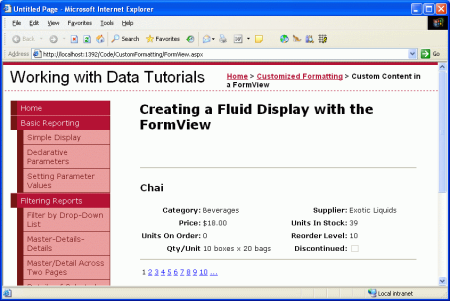

Using the FormView's Templates (C#)
====================
by [Scott Mitchell](https://twitter.com/ScottOnWriting)

[Download Sample App](http://download.microsoft.com/download/9/6/9/969e5c94-dfb6-4e47-9570-d6d9e704c3c1/ASPNET_Data_Tutorial_14_CS.exe) or [Download PDF](using-the-formview-s-templates-cs/_static/datatutorial14cs1.pdf)

> Unlike the DetailsView, the FormView is not composed of fields. Instead, the FormView is rendered using templates. In this tutorial we'll examine using the FormView control to present a less rigid display of data.

## Introduction

In the last two tutorials we saw how to customize the GridView and DetailsView controls' outputs using TemplateFields. TemplateFields allow for the contents for a specific field to be highly customized, but in the end both the GridView and DetailsView have a rather boxy, grid-like appearance. For many scenarios such a grid-like layout is ideal, but at times a more fluid, less rigid display is needed. When displaying a single record, such a fluid layout is possible using the FormView control.

Unlike the DetailsView, the FormView is not composed of fields. You can't add a BoundField or TemplateField to a FormView. Instead, the FormView is rendered using templates. Think of the FormView as a DetailsView control that contains a single TemplateField. The FormView supports the following templates:

- `ItemTemplate` used to render the particular record displayed in the FormView
- `HeaderTemplate` used to specify an optional header row
- `FooterTemplate` used to specify an optional footer row
- `EmptyDataTemplate` when the FormView's `DataSource` lacks any records, the `EmptyDataTemplate` is used in place of the `ItemTemplate` for rendering the control's markup
- `PagerTemplate` can be used to customize the paging interface for FormViews that have paging enabled
- `EditItemTemplate` / `InsertItemTemplate` used to customize the editing interface or inserting interface for FormViews that support such functionality

In this tutorial we'll examine using the FormView control to present a less rigid display of products. Rather than having fields for the name, category, supplier, and so on, the FormView's `ItemTemplate` will show these values using a combination of a header element and a `<table>` (see Figure 1).

**Figure 1**: The FormView Breaks Out of the Grid-Like Layout Seen in the DetailsView ([Click to view full-size image](using-the-formview-s-templates-cs/_static/image3.png))

## Step 1: Binding the Data to the FormView

Open the `FormView.aspx` page and drag a FormView from the Toolbox onto the Designer. When first adding the FormView it appears as a gray box, instructing us that an `ItemTemplate` is needed.

**Figure 2**: The FormView Cannot be Rendered in the Designer Until an `ItemTemplate` is Provided ([Click to view full-size image](using-the-formview-s-templates-cs/_static/image6.png))

The `ItemTemplate` can be created by hand (through the declarative syntax) or can be auto-created by binding the FormView to a data source control through the Designer. This auto-created `ItemTemplate` contains HTML that lists the name of each field and a Label control whose `Text` property is bound to the field's value. This approach also auto-creates an `InsertItemTemplate` and `EditItemTemplate`, both of which are populated with input controls for each of the data fields returned by the data source control.

If you want to auto-create the template, from the FormView's smart tag add a new ObjectDataSource control that invokes the `ProductsBLL` class's `GetProducts()` method. This will create a FormView with an `ItemTemplate`, `InsertItemTemplate`, and `EditItemTemplate`. From the Source view, remove the `InsertItemTemplate` and `EditItemTemplate` since we're not interested in creating a FormView that supports editing or inserting yet. Next, clear out the markup within the `ItemTemplate` so that we have a clean slate to work from.

If you'd rather build up the `ItemTemplate` manually, you can add and configure the ObjectDataSource by dragging it from the Toolbox onto the Designer. However, don't set the FormView's data source from the Designer. Instead, go to the Source view and manually set the FormView's `DataSourceID` property to the `ID` value of the ObjectDataSource. Next, manually add the `ItemTemplate`.

Regardless of what approach you decided to take, at this point your FormView's declarative markup should look like:

[!code-aspx[Main](using-the-formview-s-templates-cs/samples/sample1.aspx)]

Take a moment to check the Enable Paging checkbox in the FormView's smart tag; this will add the `AllowPaging="True"` attribute to the FormView's declarative syntax. Also, set the `EnableViewState` property to False.

## Step 2: Defining the`ItemTemplate`'s Markup

With the FormView bound to the ObjectDataSource control and configured to support paging we're ready to specify the content for the `ItemTemplate`. For this tutorial, let's have the product's name displayed in an `<h3>` heading. Following that, let's use an HTML `<table>` to display the remaining product properties in a four-column table where the first and third columns list the property names and the second and fourth list their values.

This markup can be entered in through the FormView's template editing interface in the Designer or entered manually through the declarative syntax. When working with templates I typically find it quicker to work directly with the declarative syntax, but feel free to use whatever technique you're most comfortable with.

The following markup shows the FormView declarative markup after the `ItemTemplate`'s structure has been completed:

[!code-aspx[Main](using-the-formview-s-templates-cs/samples/sample2.aspx)]

Notice that the databinding syntax - `<%# Eval("ProductName") %>`, for example can be injected directly into the template's output. That is, it need not be assigned to a Label control's `Text` property. For example, we have the `ProductName` value displayed in an `<h3>` element using `<h3><%# Eval("ProductName") %></h3>`, which for the product Chai will render as `<h3>Chai</h3>`.

The `ProductPropertyLabel` and `ProductPropertyValue` CSS classes are used for specifying the style of the product property names and values in the `<table>`. These CSS classes are defined in `Styles.css` and cause the property names to be bold and right-aligned and add a right padding to the property values.

Since there are no CheckBoxFields available with the FormView, in order to show the `Discontinued` value as a checkbox we must add our own CheckBox control. The `Enabled` property is set to False, making it read-only, and the CheckBox's `Checked` property is bound to the value of the `Discontinued` data field.

With the `ItemTemplate` complete, the product information is displayed in a much more fluid manner. Compare the DetailsView output from the last tutorial (Figure 3) with the output generated by the FormView in this tutorial (Figure 4).

**Figure 3**: The Rigid DetailsView Output ([Click to view full-size image](using-the-formview-s-templates-cs/_static/image9.png))

**Figure 4**: The Fluid FormView Output ([Click to view full-size image](using-the-formview-s-templates-cs/_static/image12.png))

## Summary

While the GridView and DetailsView controls can have their output customized using TemplateFields, both still present their data in a grid-like, boxy format. For those times when a single record needs to be shown using a less rigid layout, the FormView is an ideal choice. Like the DetailsView, the FormView renders a single record from its `DataSource`, but unlike the DetailsView it is composed just of templates and does not support fields.

As we saw in this tutorial, the FormView allows for a more flexible layout when displaying a single record. In future tutorials we'll examine the DataList and Repeater controls, which provide the same level of flexibility as the FormsView, but are able to display multiple records (like the GridView).

Happy Programming!

## About the Author

[Scott Mitchell](http://www.4guysfromrolla.com/ScottMitchell.shtml), author of seven ASP/ASP.NET books and founder of [4GuysFromRolla.com](http://www.4guysfromrolla.com), has been working with Microsoft Web technologies since 1998. Scott works as an independent consultant, trainer, and writer. His latest book is [*Sams Teach Yourself ASP.NET 2.0 in 24 Hours*](https://www.amazon.com/exec/obidos/ASIN/0672327384/4guysfromrollaco). He can be reached at [mitchell@4GuysFromRolla.com.](mailto:mitchell@4GuysFromRolla.com) or via his blog, which can be found at [http://ScottOnWriting.NET](http://ScottOnWriting.NET).

## Special Thanks To

This tutorial series was reviewed by many helpful reviewers. Lead reviewer for this tutorial was E.R. Gilmore. Interested in reviewing my upcoming MSDN articles? If so, drop me a line at [mitchell@4GuysFromRolla.com.](mailto:mitchell@4GuysFromRolla.com)

>[!div class="step-by-step"]
[Previous](using-templatefields-in-the-detailsview-control-cs.md)
[Next](displaying-summary-information-in-the-gridview-s-footer-cs.md)