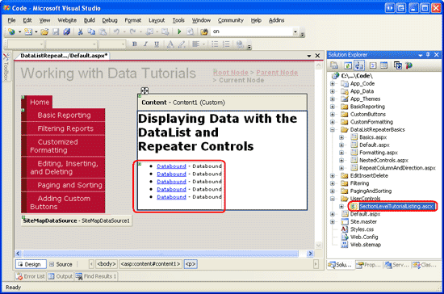
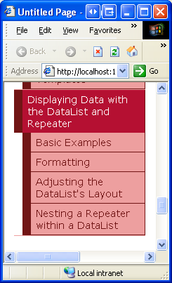
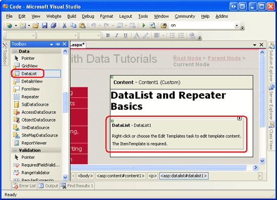
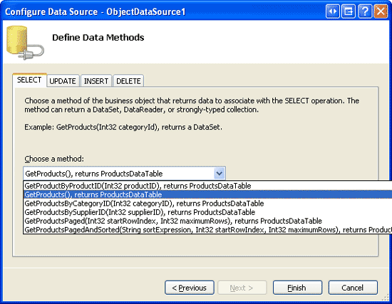
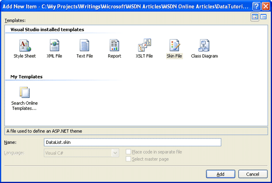
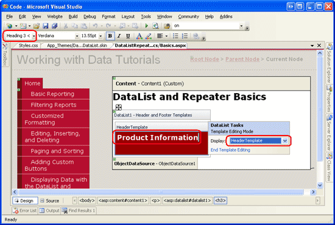
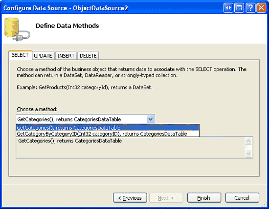

Displaying Data with the DataList and Repeater Controls (C#)
====================
by [Scott Mitchell](https://twitter.com/ScottOnWriting)

[Download Sample App](http://download.microsoft.com/download/9/c/1/9c1d03ee-29ba-4d58-aa1a-f201dcc822ea/ASPNET_Data_Tutorial_29_CS.exe) or [Download PDF](displaying-data-with-the-datalist-and-repeater-controls-cs/_static/datatutorial29cs1.pdf)

> In the preceding tutorials we have used the GridView control to display data. Starting with this tutorial, we look at building common reporting patterns with the DataList and Repeater controls, starting with the basics of displaying data with these controls.

## Introduction

In all of the examples throughout the past 28 tutorials, if we needed to display multiple records from a data source we turned to the GridView control. The GridView renders a row for each record in the data source, displaying the record s data fields in columns. While the GridView makes it a snap to display, page through, sort, edit, and delete data, its appearance is a bit boxy. Moreover, the markup responsible for the GridView s structure is fixed it includes an HTML `<table>` with a table row (`<tr>`) for each record and a table cell (`<td>`) for each field.

To provide a greater degree of customization in the appearance and rendered markup when displaying multiple records, ASP.NET 2.0 offers the DataList and Repeater controls (both of which were also available in ASP.NET version 1.x). The DataList and Repeater controls render their content using templates rather than BoundFields, CheckBoxFields, ButtonFields, and so on. Like the GridView, the DataList renders as an HTML `<table>`, but allows for multiple data source records to be displayed per table row. The Repeater, on the other hand, renders no additional markup than what you explicitly specify, and is an ideal candidate when you need precise control over the markup emitted.

Over the next dozen or so tutorials, we'll look at building common reporting patterns with the DataList and Repeater controls, starting with the basics of displaying data with these controls templates. We'll see how to format these controls, how to alter the layout of data source records in the DataList, common master/details scenarios, ways to edit and delete data, how to page through records, and so on.

## Step 1: Adding the DataList and Repeater Tutorial Web Pages

Before we start this tutorial, let s first take a moment to add the ASP.NET pages we'll need for this tutorial and the next few tutorials dealing with displaying data using the DataList and Repeater. Start by creating a new folder in the project named `DataListRepeaterBasics`. Next, add the following five ASP.NET pages to this folder, having all of them configured to use the master page `Site.master`:

- `Default.aspx`
- `Basics.aspx`
- `Formatting.aspx`
- `RepeatColumnAndDirection.aspx`
- `NestedControls.aspx`

**Figure 1**: Create a `DataListRepeaterBasics` Folder and Add the Tutorial ASP.NET Pages

Open the `Default.aspx` page and drag the `SectionLevelTutorialListing.ascx` User Control from the `UserControls` folder onto the Design surface. This User Control, which we created in the [Master Pages and Site Navigation](../introduction/master-pages-and-site-navigation-cs.md) tutorial, enumerates the site map and displays the tutorials from the current section in a bulleted list.

**Figure 2**: Add the `SectionLevelTutorialListing.ascx` User Control to `Default.aspx` ([Click to view full-size image](displaying-data-with-the-datalist-and-repeater-controls-cs/_static/image4.png))

In order to have the bulleted list display the DataList and Repeater tutorials we'll be creating, we need to add them to the site map. Open the `Web.sitemap` file and add the following markup after the Adding Custom Buttons site map node markup:

[!code-xml[Main](displaying-data-with-the-datalist-and-repeater-controls-cs/samples/sample1.xml)]

**Figure 3**: Update the Site Map to Include the New ASP.NET Pages

## Step 2: Displaying Product Information with the DataList

Similar to the FormView, the DataList control s rendered output depends upon templates rather than BoundFields, CheckBoxFields, and so on. Unlike the FormView, the DataList is designed to display a set of records rather than a solitary one. Let s begin this tutorial with a look at binding product information to a DataList. Start by opening the `Basics.aspx` page in the `DataListRepeaterBasics` folder. Next, drag a DataList from the Toolbox onto the Designer. As Figure 4 illustrates, before specifying the DataList s templates, the Designer displays it as a gray box.

**Figure 4**: Drag the DataList From the Toolbox Onto the Designer ([Click to view full-size image](displaying-data-with-the-datalist-and-repeater-controls-cs/_static/image8.png))

From the DataList s smart tag, add a new ObjectDataSource and configure it to use the `ProductsBLL` class s `GetProducts` method. Since we re creating a read-only DataList in this tutorial, set the drop-down list to (None) in the wizard s INSERT, UPDATE, and DELETE tabs.

**Figure 5**: Opt to Create a New ObjectDataSource ([Click to view full-size image](displaying-data-with-the-datalist-and-repeater-controls-cs/_static/image11.png))

**Figure 6**: Configure the ObjectDataSource to Use the `ProductsBLL` Class ([Click to view full-size image](displaying-data-with-the-datalist-and-repeater-controls-cs/_static/image14.png))

**Figure 7**: Retrieve Information About All of the Products Using the `GetProducts` Method ([Click to view full-size image](displaying-data-with-the-datalist-and-repeater-controls-cs/_static/image17.png))

After configuring the ObjectDataSource and associating it with the DataList through its smart tag, Visual Studio will automatically create an `ItemTemplate` in the DataList that displays the name and value of each data field returned by the data source (see the markup below). This default `ItemTemplate` s appearance is identical to that of the templates automatically created when binding a data source to the FormView through the Designer.

[!code-aspx[Main](displaying-data-with-the-datalist-and-repeater-controls-cs/samples/sample2.aspx)]

> [!NOTE]
> Recall that when binding a data source to a FormView control through the FormView s smart tag, Visual Studio created an `ItemTemplate`, `InsertItemTemplate`, and `EditItemTemplate`. With the DataList, however, only an `ItemTemplate` is created. This is because the DataList does not have the same built-in editing and inserting support offered by the FormView. The DataList does contain edit- and delete-related events, and editing and deleting support can be added with a bit of code, but there s no simple out-of-the-box support as with the FormView. We'll see how to include editing and deleting support with the DataList in a future tutorial.

Let s take a moment to improve the appearance of this template. Rather than displaying all of the data fields, let s only display the product s name, supplier, category, quantity per unit, and unit price. Moreover, let s display the name in an `<h4>` heading and lay out the remaining fields using a `<table>` beneath the heading.

To make these changes you can either use the template editing features in the Designer from the DataList s smart tag click on the Edit Templates link or you can modify the template manually through the page s declarative syntax. If you use the Edit Templates option in the Designer, your resulting markup may not match the following markup exactly, but when viewed through a browser should look very similar to the screen shot shown in Figure 8.

[!code-aspx[Main](displaying-data-with-the-datalist-and-repeater-controls-cs/samples/sample3.aspx)]

> [!NOTE]
> The example above uses Label Web controls whose `Text` property is assigned the value of the databinding syntax. Alternatively, we could have omitted the Labels altogether, typing in just the databinding syntax. That is, instead of using `<asp:Label ID="CategoryNameLabel" runat="server" Text='<%# Eval("CategoryName") %>' />` we could have instead used the declarative syntax `<%# Eval("CategoryName") %>`.

Leaving in the Label Web controls, however, offer two advantages. First, it provides an easier means for formatting the data based on the data, as we'll see in the next tutorial. Second, the Edit Templates option in the Designer doesn t display declarative databinding syntax that appears outside of some Web control. Instead, the Edit Templates interface is designed to facilitate working with static markup and Web controls and assumes that any databinding will be done through the Edit DataBindings dialog box, which is accessible from the Web controls smart tags.

Therefore, when working with the DataList, which provides the option of editing the templates through the Designer, I prefer to use Label Web controls so that the content is accessible through the Edit Templates interface. As we'll see shortly, the Repeater requires that the template s contents be edited from the Source view. Consequently, when crafting the Repeater s templates I'll often omit the Label Web controls unless I know I'll need to format the appearance of the data bound text based on programmatic logic.

**Figure 8**: Each Product s Output is Rendered Using the DataList s `ItemTemplate` ([Click to view full-size image](displaying-data-with-the-datalist-and-repeater-controls-cs/_static/image20.png))

## Step 3: Improving the Appearance of the DataList

Like the GridView, the DataList offers a number of style-related properties, such as `Font`, `ForeColor`, `BackColor`, `CssClass`, `ItemStyle`, `AlternatingItemStyle`, `SelectedItemStyle`, and so on. When working with the GridView and DetailsView controls, we created Skin files in the `DataWebControls` Theme that pre-defined the `CssClass` properties for these two controls and the `CssClass` property for several of their subproperties (`RowStyle`, `HeaderStyle`, and so on). Let s do the same for the DataList.

As discussed in the [Displaying Data With the ObjectDataSource](../basic-reporting/displaying-data-with-the-objectdatasource-cs.md) tutorial, a Skin file specifies the default appearance-related properties for a Web control; a Theme is a collection of Skin, CSS, image, and JavaScript files that define a particular look and feel for a website. In the *Displaying Data With the ObjectDataSource* tutorial, we created a `DataWebControls` Theme (which is implemented as a folder within the `App_Themes` folder) that has, currently, two Skin files - `GridView.skin` and `DetailsView.skin`. Let s add a third Skin file to specify the pre-defined style settings for the DataList.

To add a Skin file, right-click on the `App_Themes/DataWebControls` folder, choose Add a New Item, and select the Skin File option from the list. Name the file `DataList.skin`.

**Figure 9**: Create a New Skin File Named `DataList.skin` ([Click to view full-size image](displaying-data-with-the-datalist-and-repeater-controls-cs/_static/image23.png))

Use the following markup for the `DataList.skin` file:

[!code-aspx[Main](displaying-data-with-the-datalist-and-repeater-controls-cs/samples/sample4.aspx)]

These settings assign the same CSS classes to the appropriate DataList properties as were used with the GridView and DetailsView controls. The CSS classes used here `DataWebControlStyle`, `AlternatingRowStyle`, `RowStyle`, and so on are defined in the `Styles.css` file and were added in previous tutorials.

With the addition of this Skin file, the DataList s appearance is updated in the Designer (you may need to refresh the Designer view to see the effects of the new Skin file; from the View menu, choose Refresh). As Figure 10 shows, each alternating product has a light pink background color.

**Figure 10**: Create a New Skin File Named `DataList.skin` ([Click to view full-size image](displaying-data-with-the-datalist-and-repeater-controls-cs/_static/image26.png))

## Step 4: Exploring the DataList s Other Templates

In addition to the `ItemTemplate`, the DataList supports six other optional templates:

- `HeaderTemplate` if provided, adds a header row to the output and is used to render this row
- `AlternatingItemTemplate` used to render alternating items
- `SelectedItemTemplate` used to render the selected item; the selected item is the item whose index corresponds to the DataList s [`SelectedIndex` property](https://msdn.microsoft.com/en-US/library/system.web.ui.webcontrols.datalist.selectedindex.aspx)
- `EditItemTemplate` used to render the item being edited
- `SeparatorTemplate` if provided, adds a separator between each item and is used to render this separator
- `FooterTemplate` - if provided, adds a footer row to the output and is used to render this row

When specifying the `HeaderTemplate` or `FooterTemplate`, the DataList adds an additional header or footer row to the rendered output. Like with the GridView s header and footer rows, the header and footer in a DataList are not bound to data. Therefore, any databinding syntax in the `HeaderTemplate` or `FooterTemplate` that attempts to access bound data will return a blank string.

> [!NOTE]
> As we saw in the [Displaying Summary Information in the GridView s Footer](../custom-formatting/displaying-summary-information-in-the-gridview-s-footer-cs.md) tutorial, while the header and footer rows don t support databinding syntax, data-specific information can be injected directly into these rows from the GridView s `RowDataBound` event handler. This technique can be used to both calculate running totals or other information from the data bound to the control as well as assign that information to the footer. This same concept can be applied to the DataList and Repeater controls; the only difference is that for the DataList and Repeater create an event handler for the `ItemDataBound` event (instead of for the `RowDataBound` event).

For our example, let s have the title Product Information displayed at the top of the DataList s results in an `<h3>` heading. To accomplish this, add a `HeaderTemplate` with the appropriate markup. From the Designer, this can be accomplished by clicking on the Edit Templates link in the DataList s smart tag, choosing the Header Template from the drop-down list, and typing in the text after picking the Heading 3 option from the style drop-down list (see Figure 11).

**Figure 11**: Add a `HeaderTemplate` with the Text Product Information ([Click to view full-size image](displaying-data-with-the-datalist-and-repeater-controls-cs/_static/image29.png))

Alternatively, this can be added declaratively by entering the following markup within the `<asp:DataList>` tags:

[!code-html[Main](displaying-data-with-the-datalist-and-repeater-controls-cs/samples/sample5.html)]

To add a bit of space between each product listing, let s add a `SeparatorTemplate` that includes a line between each section. The horizontal rule tag (`
`), adds such a divider. Create the `SeparatorTemplate` so that it has the following markup:

[!code-html[Main](displaying-data-with-the-datalist-and-repeater-controls-cs/samples/sample6.html)]

> [!NOTE]
> Like the `HeaderTemplate` and `FooterTemplates`, the `SeparatorTemplate` is not bound to any record from the data source and therefore cannot directly access the data source records bound to the DataList.

After making this addition, when viewing the page through a browser it should look similar to Figure 12. Note the header row and the line between each product listing.

**Figure 12**: The DataList Includes a Header Row and a Horizontal Rule Between Each Product Listing ([Click to view full-size image](displaying-data-with-the-datalist-and-repeater-controls-cs/_static/image32.png))

## Step 5: Rendering Specific Markup with the Repeater Control

If you do a View/Source from your browser when visiting the DataList example from Figure 12, you'll see that the DataList emits an HTML `<table>` that contains a table row (`<tr>`) with a single table cell (`<td>`) for each item bound to the DataList. This output, in fact, is identical to what would be emitted from a GridView with a single TemplateField. As we'll see in a future tutorial, the DataList does allow further customization of the output, enabling us to display multiple data source records per table row.

What if you don t want to emit an HTML `<table>`, though? For total and complete control over the markup generated by a data Web control, we must use the Repeater control. Like the DataList, the Repeater is constructed based upon templates. The Repeater, however, only offers the following five templates:

- `HeaderTemplate` if provided, adds the specified markup before the items
- `ItemTemplate` used to render items
- `AlternatingItemTemplate` if provided, used to render alternating items
- `SeparatorTemplate` if provided, adds the specified markup between each item
- `FooterTemplate` - if provided, adds the specified markup after the items

In ASP.NET 1.x, the Repeater control was commonly used to display a bulleted list whose data came from some data source. In such a case, the `HeaderTemplate` and `FooterTemplates` would contain the opening and closing `<ul>` tags, respectively, while the `ItemTemplate` would contain `<li>` elements with databinding syntax. This approach can still be used in ASP.NET 2.0 as we saw in two examples in the [Master Pages and Site Navigation](../introduction/master-pages-and-site-navigation-cs.md) tutorial:

- In the `Site.master` master page, a Repeater was used to display a bulleted list of the top-level site map contents (Basic Reporting, Filtering Reports, Customized Formatting, and so on); another, nested Repeater was used to display the children sections of the top-level sections
- In `SectionLevelTutorialListing.ascx`, a Repeater was used to display a bulleted list of the children sections of the current site map section

> [!NOTE]
> ASP.NET 2.0 introduces the new [BulletedList control](https://msdn.microsoft.com/en-us/library/ms228101.aspx), which can be bound to a data source control in order to display a simple bulleted list. With the BulletedList control we do not need to specify any of the list-related HTML; instead, we simply indicate the data field to display as the text for each list item.

The Repeater serves as a catch all data Web control. If there is not an existing control that generates the needed markup, the Repeater control can be used. To illustrate using the Repeater, let s have the list of categories displayed above the Product Information DataList created in Step 2. In particular, let s have the categories displayed in a single-row HTML `<table>` with each category displayed as a column in the table.

To accomplish this, start by dragging a Repeater control from the Toolbox onto the Designer, above the Product Information DataList. As with the DataList, the Repeater initially displays as a gray box until its templates have been defined.

**Figure 13**: Add a Repeater to the Designer ([Click to view full-size image](displaying-data-with-the-datalist-and-repeater-controls-cs/_static/image35.png))

There s only one option in the Repeater s smart tag: Choose Data Source. Opt to create a new ObjectDataSource and configure it to use the `CategoriesBLL` class s `GetCategories` method.

**Figure 14**: Create a New ObjectDataSource ([Click to view full-size image](displaying-data-with-the-datalist-and-repeater-controls-cs/_static/image38.png))

**Figure 15**: Configure the ObjectDataSource to Use the `CategoriesBLL` Class ([Click to view full-size image](displaying-data-with-the-datalist-and-repeater-controls-cs/_static/image41.png))

**Figure 16**: Retrieve Information About All of the Categories Using the `GetCategories` Method ([Click to view full-size image](displaying-data-with-the-datalist-and-repeater-controls-cs/_static/image44.png))

Unlike the DataList, Visual Studio does not automatically create an ItemTemplate for the Repeater after binding it to a data source. Furthermore, the Repeater s templates cannot be configured through the Designer and must be specified declaratively.

To display the categories as a single-row `<table>` with a column for each category, we need the Repeater to emit markup similar to the following:

[!code-html[Main](displaying-data-with-the-datalist-and-repeater-controls-cs/samples/sample7.html)]

Since the `<td>Category X</td>` text is the portion that repeats, this will appear in the Repeater s ItemTemplate. The markup that appears before it - `<table><tr>` - will be placed in the `HeaderTemplate` while the ending markup - `</tr></table>` - will placed in the `FooterTemplate`. To enter these template settings, go to the declarative portion of the ASP.NET page by clicking on the Source button in the lower left corner and type in the following syntax:

[!code-aspx[Main](displaying-data-with-the-datalist-and-repeater-controls-cs/samples/sample8.aspx)]

The Repeater emits the precise markup as specified by its templates, nothing more, nothing less. Figure 17 shows the Repeater s output when viewed through a browser.

**Figure 17**: A Single-Row HTML `<table>` Lists Each Category in a Separate Column ([Click to view full-size image](displaying-data-with-the-datalist-and-repeater-controls-cs/_static/image47.png))

## Step 6: Improving the Appearance of the Repeater

Since the Repeater emits precisely the markup specified by its templates, it should come as no surprise that there are no style-related properties for the Repeater. To alter the appearance of the content generated by the Repeater, we must manually add the needed HTML or CSS content directly to the Repeater s templates.

For our example, let s have the category columns alternate background colors, like with the alternating rows in the DataList. To accomplish this, we need to assign the `RowStyle` CSS class to each Repeater item and the `AlternatingRowStyle` CSS class to each alternating Repeater item through the `ItemTemplate` and `AlternatingItemTemplate` templates, like so:

[!code-aspx[Main](displaying-data-with-the-datalist-and-repeater-controls-cs/samples/sample9.aspx)]

Let s also add a header row to the output with the text Product Categories. Since we don t know how many columns our resulting `<table>` will be comprised of, the simplest way to generate a header row that is guaranteed to span all columns is to use *two* `<table>` s. The first `<table>` will contain two rows the header row and a row that will contain the second, single-row `<table>` that has a column for each category in the system. That is, we want to emit the following markup:

[!code-html[Main](displaying-data-with-the-datalist-and-repeater-controls-cs/samples/sample10.html)]

The following `HeaderTemplate` and `FooterTemplate` result in the desired markup:

[!code-aspx[Main](displaying-data-with-the-datalist-and-repeater-controls-cs/samples/sample11.aspx)]

Figure 18 shows the Repeater after these changes have been made.

**Figure 18**: The Category Columns Alternate in Background Color and Includes a Header Row ([Click to view full-size image](displaying-data-with-the-datalist-and-repeater-controls-cs/_static/image50.png))

## Summary

While the GridView control makes it easy to display, edit, delete, sort, and page through data, the appearance is very boxy and grid-like. For more control over the appearance, we need to turn to either the DataList or Repeater controls. Both of these controls display a set of records using templates instead of BoundFields, CheckBoxFields, and so on.

The DataList renders as an HTML `<table>` that, by default, displays each data source record in a single table row, just like a GridView with a single TemplateField. As we will see in a future tutorial, however, the DataList does permit multiple records to be displayed per table row. The Repeater, on the other hand, strictly emits the markup specified in its templates; it does not add any additional markup and therefore is commonly used to display data in HTML elements other than a `<table>` (such as in a bulleted list).

While the DataList and Repeater offer more flexibility in their rendered output, they lack many of the built-in features found in the GridView. As we'll examine in upcoming tutorials, some of these features can be plugged back in without too much effort, but do keep in mind that using the DataList or Repeater in lieu of the GridView does limit the features you can use without having to implement those features yourself.

Happy Programming!

## About the Author

[Scott Mitchell](http://www.4guysfromrolla.com/ScottMitchell.shtml), author of seven ASP/ASP.NET books and founder of [4GuysFromRolla.com](http://www.4guysfromrolla.com), has been working with Microsoft Web technologies since 1998. Scott works as an independent consultant, trainer, and writer. His latest book is [*Sams Teach Yourself ASP.NET 2.0 in 24 Hours*](https://www.amazon.com/exec/obidos/ASIN/0672327384/4guysfromrollaco). He can be reached at [mitchell@4GuysFromRolla.com.](mailto:mitchell@4GuysFromRolla.com) or via his blog, which can be found at [http://ScottOnWriting.NET](http://ScottOnWriting.NET).

## Special Thanks To

This tutorial series was reviewed by many helpful reviewers. Lead reviewers for this tutorial were Yaakov Ellis, Liz Shulok, Randy Schmidt, and Stacy Park. Interested in reviewing my upcoming MSDN articles? If so, drop me a line at [mitchell@4GuysFromRolla.com.](mailto:mitchell@4GuysFromRolla.com)

>[!div class="step-by-step"]
[Next](formatting-the-datalist-and-repeater-based-upon-data-cs.md)