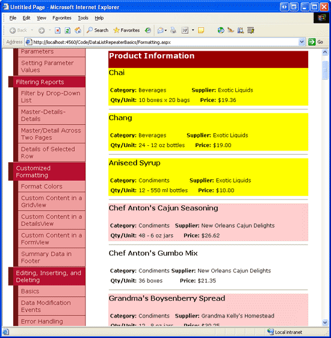
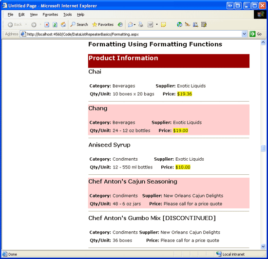

Formatting the DataList and Repeater Based Upon Data (VB)
====================
by [Scott Mitchell](https://twitter.com/ScottOnWriting)

[Download Sample App](http://download.microsoft.com/download/9/c/1/9c1d03ee-29ba-4d58-aa1a-f201dcc822ea/ASPNET_Data_Tutorial_30_VB.exe) or [Download PDF](formatting-the-datalist-and-repeater-based-upon-data-vb/_static/datatutorial30vb1.pdf)

> In this tutorial we'll step through examples of how we format the appearance of the DataList and Repeater controls, either by using formatting functions within templates or by handling the DataBound event.

## Introduction

As we saw in the preceding tutorial, the DataList offers a number of style-related properties that affect its appearance. In particular, we saw how to assign default CSS classes to the DataList s `HeaderStyle`, `ItemStyle`, `AlternatingItemStyle`, and `SelectedItemStyle` properties. In addition to these four properties, the DataList includes a number of other style-related properties, such as `Font`, `ForeColor`, `BackColor`, and `BorderWidth`, to name a few. The Repeater control does not contain any style-related properties. Any such style settings must be made directly within the markup in the Repeater s templates.

Often, though, how data should be formatted depends on the data itself. For example, when listing products we might want to display the product information in a light gray font color if it is discontinued, or we may want to highlight the `UnitsInStock` value if it is zero. As we saw in previous tutorials, the GridView, DetailsView, and FormView offer two distinct ways to format their appearance based on their data:

- **The `DataBound` event** create an event handler for the appropriate `DataBound` event, which fires after the data has been bound to each item (for the GridView it was the `RowDataBound` event; for the DataList and Repeater it is the `ItemDataBound` event). In that event handler, the data just bound can be examined and formatting decisions made. We examined this technique in the [Custom Formatting Based Upon Data](../custom-formatting/custom-formatting-based-upon-data-vb.md) tutorial.
- **Formatting Functions in Templates** when using TemplateFields in the DetailsView or GridView controls, or a template in the FormView control, we can add a formatting function to the ASP.NET page s code-behind class, the Business Logic Layer, or any other class library that is accessible from the web application. This formatting function can accept an arbitrary number of input parameters, but must return the HTML to render in the template. Formatting functions were first examined in the [Using TemplateFields in the GridView Control](../custom-formatting/using-templatefields-in-the-gridview-control-vb.md) tutorial.

Both of these formatting techniques are available with the DataList and Repeater controls. In this tutorial we'll step through examples using both techniques for both controls.

## Using the`ItemDataBound`Event Handler

When data is bound to a DataList, either from a data source control or through programmatically assigning data to the control s `DataSource` property and calling its `DataBind()` method, the DataList s `DataBinding` event fires, the data source enumerated, and each data record is bound to the DataList. For each record in the data source, the DataList creates a [`DataListItem`](https://msdn.microsoft.com/en-us/library/system.web.ui.webcontrols.datalistitem.aspx) object that is then bound to the current record. During this process, the DataList raises two events:

- **`ItemCreated`** fires after the `DataListItem` has been created
- **`ItemDataBound`** fires after the current record has been bound to the `DataListItem`

The following steps outline the data binding process for the DataList control.

1. The DataList s [`DataBinding` event](https://msdn.microsoft.com/en-us/library/system.web.ui.control.databinding.aspx) fires
2. The data is bound to the DataList  
  
 For each record in the data source 

    1. Create a `DataListItem` object
    2. Fire the [`ItemCreated` event](https://msdn.microsoft.com/en-us/library/system.web.ui.webcontrols.datalist.itemcreated.aspx)
    3. Bind the record to the `DataListItem`
    4. Fire the [`ItemDataBound` event](https://msdn.microsoft.com/en-us/library/system.web.ui.webcontrols.datalist.itemdatabound.aspx)
    5. Add the `DataListItem` to the `Items` collection

When binding data to the Repeater control, it progresses through the exact same sequence of steps. The only difference is that instead of `DataListItem` instances being created, the Repeater uses [`RepeaterItem`](https://msdn.microsoft.com/en-us/library/system.web.ui.webcontrols.repeateritem(VS.80).aspx)s.

> [!NOTE]
> The astute reader may have noticed a slight anomaly between the sequence of steps that transpire when the DataList and Repeater are bound to data versus when the GridView is bound to data. At the tail end of the data binding process, the GridView raises the `DataBound` event; however, neither the DataList nor Repeater control have such an event. This is because the DataList and Repeater controls were created back in the ASP.NET 1.x timeframe, before the pre- and post-level event handler pattern had become common.

Like with the GridView, one option for formatting based on the data is to create an event handler for the `ItemDataBound` event. This event handler would inspect the data that had just been bound to the `DataListItem` or `RepeaterItem` and affect the formatting of the control as needed.

For the DataList control, formatting changes for the entire item can be implemented using the `DataListItem` s style-related properties, which include the standard `Font`, `ForeColor`, `BackColor`, `CssClass`, and so on. To affect the formatting of particular Web controls within the DataList s template, we need to programmatically access and modify the style of those Web controls. We saw how to accomplish this back in the *Custom Formatting Based Upon Data* tutorial. Like the Repeater control, the `RepeaterItem` class has no style-related properties; therefore, all style-related changes made to a `RepeaterItem` in the `ItemDataBound` event handler must be done by programmatically accessing and updating Web controls within the template.

Since the `ItemDataBound` formatting technique for the DataList and Repeater are virtually identical, our example will focus on using the DataList.

## Step 1: Displaying Product Information in the DataList

Before we worry about the formatting, let s first create a page that uses a DataList to display product information. In the [previous tutorial](displaying-data-with-the-datalist-and-repeater-controls-vb.md) we created a DataList whose `ItemTemplate` displayed each product s name, category, supplier, quantity per unit, and price. Let s repeat this functionality here in this tutorial. To accomplish this, you can either recreate the DataList and its ObjectDataSource from scratch, or you can copy over those controls from the page created in the previous tutorial (`Basics.aspx`) and paste them into the page for this tutorial (`Formatting.aspx`).

Once you have replicated the DataList and ObjectDataSource functionality from `Basics.aspx` into `Formatting.aspx`, take a moment to change the DataList s `ID` property from `DataList1` to a more descriptive `ItemDataBoundFormattingExample`. Next, view the DataList in a browser. As Figure 1 shows, the only formatting difference between each product is that the background color alternates.

**Figure 1**: The Products are Listed in the DataList Control ([Click to view full-size image](formatting-the-datalist-and-repeater-based-upon-data-vb/_static/image3.png))

For this tutorial, let s format the DataList such that any products with a price less than $20.00 will have both its name and unit price highlighted yellow.

## Step 2: Programmatically Determining the Value of the Data in the ItemDataBound Event Handler

Since only those products with a price under $20.00 will have the custom formatting applied, we must be able to determine each product s price. When binding data to a DataList, the DataList enumerates the records in its data source and, for each record, creates a `DataListItem` instance, binding the data source record to the `DataListItem`. After the particular record s data has been bound to the current `DataListItem` object, the DataList s `ItemDataBound` event is fired. We can create an event handler for this event to inspect the data values for the current `DataListItem` and, based upon those values, make any formatting changes necessary.

Create an `ItemDataBound` event for the DataList and add the following code:

[!code-vb[Main](formatting-the-datalist-and-repeater-based-upon-data-vb/samples/sample1.vb)]

While the concept and semantics behind the DataList s `ItemDataBound` event handler are the same as those used by the GridView s `RowDataBound` event handler in the *Custom Formatting Based Upon Data* tutorial, the syntax differs slightly. When the `ItemDataBound` event fires, the `DataListItem` just bound to data is passed into corresponding event handler via `e.Item` (instead of `e.Row`, as with the GridView s `RowDataBound` event handler). The DataList s `ItemDataBound` event handler fires for *each* row added to the DataList, including header rows, footer rows, and separator rows. However, the product information is only bound to the data rows. Therefore, when using the `ItemDataBound` event to inspect the data bound to the DataList, we need to first ensure that we re working with a data item. This can be accomplished by checking the `DataListItem` s [`ItemType` property](https://msdn.microsoft.com/en-us/library/system.web.ui.webcontrols.datalistitem.itemtype.aspx), which can have one of [the following eight values](https://msdn.microsoft.com/en-us/library/system.web.ui.webcontrols.listitemtype.aspx):

- `AlternatingItem`
- `EditItem`
- `Footer`
- `Header`
- `Item`
- `Pager`
- `SelectedItem`
- `Separator`

Both `Item` and `AlternatingItem``DataListItem` s makeup the DataList s data items. Assuming we re working with an `Item` or `AlternatingItem`, we access the actual `ProductsRow` instance that was bound to the current `DataListItem`. The `DataListItem` s [`DataItem` property](https://msdn.microsoft.com/en-us/system.web.ui.webcontrols.datalistitem.dataitem.aspx) contains a reference to the `DataRowView` object, whose `Row` property provides a reference to the actual `ProductsRow` object.

Next, we check the `ProductsRow` instance s `UnitPrice` property. Since the Products table s `UnitPrice` field allows `NULL` values, before attempting to access the `UnitPrice` property we should first check to see if it has a `NULL` value using the `IsUnitPriceNull()` method. If the `UnitPrice` value is not `NULL`, we then check to see if it s less than $20.00. If it is indeed under $20.00, we then need to apply the custom formatting.

## Step 3: Highlighting the Product s Name and Price

Once we know that a product s price is less than $20.00, all that remains is to highlight its name and price. To accomplish this, we must first programmatically reference the Label controls in the `ItemTemplate` that display the product s name and price. Next, we need to have them display a yellow background. This formatting information can be applied by directly modifying the Labels `BackColor` properties (`LabelID.BackColor = Color.Yellow`); ideally, though, all display-related matters should be expressed through cascading stylesheets. In fact, we already have a stylesheet that provides the desired formatting defined in `Styles.css` - `AffordablePriceEmphasis`, which was created and discussed in the *Custom Formatting Based Upon Data* tutorial.

To apply the formatting, simply set the two Label Web controls `CssClass` properties to `AffordablePriceEmphasis`, as shown in the following code:

[!code-vb[Main](formatting-the-datalist-and-repeater-based-upon-data-vb/samples/sample2.vb)]

With the `ItemDataBound` event handler completed, revisit the `Formatting.aspx` page in a browser. As Figure 2 illustrates, those products with a price under $20.00 have both their name and price highlighted.

**Figure 2**: Those Products Less than $20.00 are Highlighted ([Click to view full-size image](formatting-the-datalist-and-repeater-based-upon-data-vb/_static/image6.png))

> [!NOTE]
> Since the DataList is rendered as an HTML `<table>`, its `DataListItem` instances have style-related properties that can be set to apply a specific style to the entire item. For example, if we wanted to highlight the *entire* item yellow when its price was less than $20.00, we could have replaced the code that referenced the Labels and set their `CssClass` properties with the following line of code: `e.Item.CssClass = "AffordablePriceEmphasis"` (see Figure 3).

The `RepeaterItem` s that make up the Repeater control, however, don t offer such style-level properties. Therefore, applying custom formatting to the Repeater requires the application of style properties to the Web controls within the Repeater s templates, just like we did in Figure 2.

**Figure 3**: The Entire Product Item is Highlighted for Products Under $20.00 ([Click to view full-size image](formatting-the-datalist-and-repeater-based-upon-data-vb/_static/image9.png))

## Using Formatting Functions from Within the Template

In the *Using TemplateFields in the GridView Control* tutorial we saw how to use a formatting function within a GridView TemplateField to apply custom formatting based upon the data bound to the GridView s rows. A formatting function is a method that can be invoked from a template and returns the HTML to be emitted in its place. Formatting functions can reside in the ASP.NET page s code-behind class or can be centralized into class files in the `App_Code` folder or in a separate Class Library project. Moving the formatting function out of the ASP.NET page s code-behind class is ideal if you plan on using the same formatting function in multiple ASP.NET pages or in other ASP.NET web applications.

To demonstrate formatting functions, let s have the product information include the text [DISCONTINUED] next to the product s name if it s discontinued. Also, let s have the price highlighted yellow if it s less than $20.00 (as we did in the `ItemDataBound` event handler example); if the price is $20.00 or higher, let s not display the actual price, but instead the text, Please call for a price quote. Figure 4 shows a screen shot of the products listing with these formatting rules applied.

**Figure 4**: For Expensive Products, the Price is Replaced with the Text, Please call for a price quote ([Click to view full-size image](formatting-the-datalist-and-repeater-based-upon-data-vb/_static/image12.png))

## Step 1: Create the Formatting Functions

For this example we need two formatting functions, one that displays the product name along with the text [DISCONTINUED], if needed, and another that displays either a highlighted price if it s less than $20.00, or the text, Please call for a price quote otherwise. Let s create these functions in the ASP.NET page s code-behind class and name them `DisplayProductNameAndDiscontinuedStatus` and `DisplayPrice`. Both methods need to return the HTML to render as a string and both need to be marked `Protected` (or `Public`) in order to be invoked from the ASP.NET page s declarative syntax portion. The code for these two methods follows:

[!code-vb[Main](formatting-the-datalist-and-repeater-based-upon-data-vb/samples/sample3.vb)]

Note that the `DisplayProductNameAndDiscontinuedStatus` method accepts the values of the `productName` and `discontinued` data fields as scalar values, whereas the `DisplayPrice` method accepts a `ProductsRow` instance (rather than a `unitPrice` scalar value). Either approach will work; however, if the formatting function is working with scalar values that can contain database `NULL` values (such as `UnitPrice`; neither `ProductName` nor `Discontinued` allow `NULL` values), special care must be taken in handling these scalar inputs.

In particular, the input parameter must be of type `Object` since the incoming value might be a `DBNull` instance instead of the expected data type. Additionally, a check must be made to determine whether or not the incoming value is a database `NULL` value. That is, if we wanted the `DisplayPrice` method to accept the price as a scalar value, we d have to use the following code:

[!code-vb[Main](formatting-the-datalist-and-repeater-based-upon-data-vb/samples/sample4.vb)]

Note that the `unitPrice` input parameter is of type `Object` and that the conditional statement has been modified to ascertain if `unitPrice` is `DBNull` or not. Furthermore, since the `unitPrice` input parameter is passed in as an `Object`, it must be cast to a decimal value.

## Step 2: Calling the Formatting Function from the DataList s ItemTemplate

With the formatting functions added to our ASP.NET page s code-behind class, all that remains is to invoke these formatting functions from the DataList s `ItemTemplate`. To call a formatting function from a template, place the function call within the databinding syntax:

[!code-aspx[Main](formatting-the-datalist-and-repeater-based-upon-data-vb/samples/sample5.aspx)]

In the DataList s `ItemTemplate` the `ProductNameLabel` Label Web control currently displays the product s name by assigning its `Text` property the result of `<%# Eval("ProductName") %>`. In order to have it display the name plus the text [DISCONTINUED], if needed, update the declarative syntax so that it instead assigns the `Text` property the value of the `DisplayProductNameAndDiscontinuedStatus` method. When doing so, we must pass in the product s name and discontinued values using the `Eval("columnName")` syntax. `Eval` returns a value of type `Object`, but the `DisplayProductNameAndDiscontinuedStatus` method expects input parameters of type `String` and `Boolean`; therefore, we must cast the values returned by the `Eval` method to the expected input parameter types, like so:

[!code-aspx[Main](formatting-the-datalist-and-repeater-based-upon-data-vb/samples/sample6.aspx)]

To display the price, we can simply set the `UnitPriceLabel` Label s `Text` property to the value returned by the `DisplayPrice` method, just like we did for displaying the product s name and [DISCONTINUED] text. However, instead of passing in the `UnitPrice` as a scalar input parameter, we instead pass in the entire `ProductsRow` instance:

[!code-aspx[Main](formatting-the-datalist-and-repeater-based-upon-data-vb/samples/sample7.aspx)]

With the calls to the formatting functions in place, take a moment to view our progress in a browser. Your screen should look similar to Figure 5, with the discontinued products including the text [DISCONTINUED] and those products costing more than $20.00 having their price replaced with the text Please call for a price quote .

**Figure 5**: For Expensive Products, the Price is Replaced with the Text, Please call for a price quote ([Click to view full-size image](formatting-the-datalist-and-repeater-based-upon-data-vb/_static/image15.png))

## Summary

Formatting the contents of a DataList or Repeater control based upon the data can be accomplished using two techniques. The first technique is to create an event handler for the `ItemDataBound` event, which fires as each record in the data source is bound to a new `DataListItem` or `RepeaterItem`. In the `ItemDataBound` event handler, the current item s data can be examined and then formatting can be applied to the contents of the template or, for `DataListItem` s, to the entire item itself.

Alternatively, custom formatting can be realized through formatting functions. A formatting function is a method that can be invoked from the DataList or Repeater s templates that returns the HTML to emit in its place. Often, the HTML returned by a formatting function is determined by the values being bound to the current item. These values can be passed into the formatting function, either as scalar values or by passing in the entire object being bound to the item (such as the `ProductsRow` instance).

Happy Programming!

## About the Author

[Scott Mitchell](http://www.4guysfromrolla.com/ScottMitchell.shtml), author of seven ASP/ASP.NET books and founder of [4GuysFromRolla.com](http://www.4guysfromrolla.com), has been working with Microsoft Web technologies since 1998. Scott works as an independent consultant, trainer, and writer. His latest book is [*Sams Teach Yourself ASP.NET 2.0 in 24 Hours*](https://www.amazon.com/exec/obidos/ASIN/0672327384/4guysfromrollaco). He can be reached at [mitchell@4GuysFromRolla.com.](mailto:mitchell@4GuysFromRolla.com) or via his blog, which can be found at [http://ScottOnWriting.NET](http://ScottOnWriting.NET).

## Special Thanks To

This tutorial series was reviewed by many helpful reviewers. Lead reviewers for this tutorial were Yaakov Ellis, Randy Schmidt, and Liz Shulok. Interested in reviewing my upcoming MSDN articles? If so, drop me a line at [mitchell@4GuysFromRolla.com.](mailto:mitchell@4GuysFromRolla.com)

>[!div class="step-by-step"]
[Previous](displaying-data-with-the-datalist-and-repeater-controls-vb.md)
[Next](showing-multiple-records-per-row-with-the-datalist-control-vb.md)