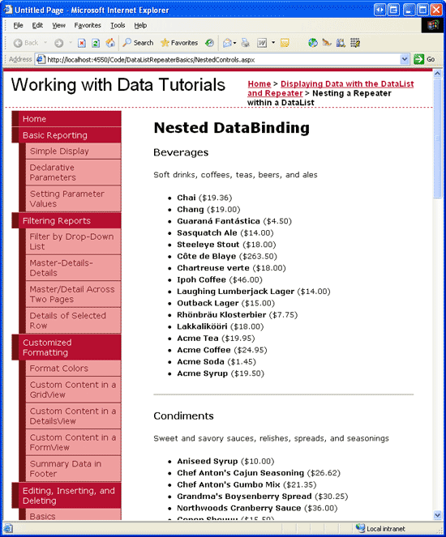
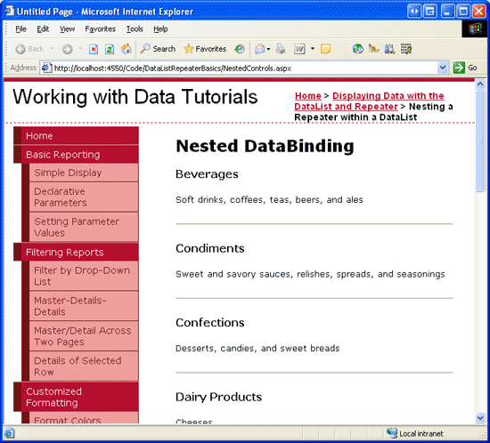

Nested Data Web Controls (C#)
====================
by [Scott Mitchell](https://twitter.com/ScottOnWriting)

[Download Sample App](http://download.microsoft.com/download/9/c/1/9c1d03ee-29ba-4d58-aa1a-f201dcc822ea/ASPNET_Data_Tutorial_32_CS.exe) or [Download PDF](nested-data-web-controls-cs/_static/datatutorial32cs1.pdf)

> In this tutorial we will explore how to use a Repeater nested inside another Repeater. The examples will illustrate how to populate the inner Repeater both declaratively and programmatically.

## Introduction

In addition to static HTML and databinding syntax, templates can also include Web controls and User Controls. These Web controls can have their properties assigned via declarative, databinding syntax, or can be accessed programmatically in the appropriate server-side event handlers.

By embedding controls within a template, the appearance and user experience can be customized and improved upon. For example, in the [Using TemplateFields in the GridView Control](../custom-formatting/using-templatefields-in-the-gridview-control-cs.md) tutorial, we saw how to customize the GridView s display by adding a Calendar control in a TemplateField to show an employee s hire date; in the [Adding Validation Controls to the Editing and Inserting Interfaces](../editing-inserting-and-deleting-data/adding-validation-controls-to-the-editing-and-inserting-interfaces-cs.md) and [Customizing the Data Modification Interface](../editing-inserting-and-deleting-data/customizing-the-data-modification-interface-cs.md) tutorials, we saw how to customize the editing and inserting interfaces by adding validation controls, TextBoxes, DropDownLists, and other Web controls.

Templates can also contain other data Web controls. That is, we can have a DataList that contains another DataList (or Repeater or GridView or DetailsView, and so on) within its templates. The challenge with such an interface is binding the appropriate data to the inner data Web control. There are a few different approaches available, ranging from declarative options using the ObjectDataSource to programmatic ones.

In this tutorial we will explore how to use a Repeater nested inside another Repeater. The outer Repeater will contain an item for each category in the database, displaying the category s name and description. Each category item s inner Repeater will display information for each product belonging to that category (see Figure 1) in a bulleted list. Our examples will illustrate how to populate the inner Repeater both declaratively and programmatically.

**Figure 1**: Each Category, Along with its Products, are Listed ([Click to view full-size image](nested-data-web-controls-cs/_static/image3.png))

## Step 1: Creating the Category Listing

When building a page that uses nested data Web controls, I find it helpful to design, create, and test the outermost data Web control first, without even worrying about the inner nested control. Therefore, let s start by walking through the steps necessary to add a Repeater to the page that lists the name and description for each category.

Start by opening the `NestedControls.aspx` page in the `DataListRepeaterBasics` folder and add a Repeater control to the page, setting its `ID` property to `CategoryList`. From the Repeater s smart tag, choose to create a new ObjectDataSource named `CategoriesDataSource`.

**Figure 2**: Name the New ObjectDataSource `CategoriesDataSource` ([Click to view full-size image](nested-data-web-controls-cs/_static/image6.png))

Configure the ObjectDataSource so that it pulls its data from the `CategoriesBLL` class s `GetCategories` method.

**Figure 3**: Configure the ObjectDataSource to Use the `CategoriesBLL` Class s `GetCategories` Method ([Click to view full-size image](nested-data-web-controls-cs/_static/image9.png))

To specify the Repeater s template content we need to go to the Source view and manually enter the declarative syntax. Add an `ItemTemplate` that displays the category s name in an `<h4>` element and the category s description in a paragraph element (`
`). Furthermore, let s separate each category with a horizontal rule (`
`). After making these changes your page should contain declarative syntax for the Repeater and ObjectDataSource that is similar to the following:

[!code-aspx[Main](nested-data-web-controls-cs/samples/sample1.aspx)]

Figure 4 shows our progress when viewed through a browser.

**Figure 4**: Each Category s Name and Description is Listed, Separated by a Horizontal Rule ([Click to view full-size image](nested-data-web-controls-cs/_static/image12.png))

## Step 2: Adding the Nested Product Repeater

With the category listing complete, our next task is to add a Repeater to the `CategoryList` s `ItemTemplate` that displays information about those products belonging to the appropriate category. There are a number of ways we can retrieve the data for this inner Repeater, two of which we'll explore shortly. For now, let s just create the products Repeater within the `CategoryList` Repeater s `ItemTemplate`. Specifically, let s have the product Repeater display each product in a bulleted list with each list item including the product s name and price.

To create this Repeater we need to manually enter the inner Repeater s declarative syntax and templates into the `CategoryList` s `ItemTemplate`. Add the following markup within the `CategoryList` Repeater s `ItemTemplate`:

[!code-aspx[Main](nested-data-web-controls-cs/samples/sample2.aspx)]

## Step 3: Binding the Category-Specific Products to the ProductsByCategoryList Repeater

If you visit the page through a browser at this point, your screen will look the same as in Figure 4 because we ve yet to bind any data to the Repeater. There are a few ways that we can grab the appropriate product records and bind them to the Repeater, some more efficient than others. The main challenge here is getting back the appropriate products for the specified category.

The data to bind to the inner Repeater control can either be accessed declaratively, through an ObjectDataSource in the `CategoryList` Repeater s `ItemTemplate`, or programmatically, from the ASP.NET page s code-behind page. Similarly, this data can be bound to the inner Repeater either declaratively - through the inner Repeater s `DataSourceID` property or through declarative databinding syntax or programmatically by referencing the inner Repeater in the `CategoryList` Repeater s `ItemDataBound` event handler, programmatically setting its `DataSource` property, and calling its `DataBind()` method. Let s explore each of these approaches.

## Accessing the Data Declaratively with an ObjectDataSource Control and the`ItemDataBound`Event Handler

Since we ve used the ObjectDataSource extensively throughout this tutorial series, the most natural choice for accessing data for this example is to stick with the ObjectDataSource. The `ProductsBLL` class has a `GetProductsByCategoryID(categoryID)` method that returns information about those products that belong to the specified *`categoryID`*. Therefore, we can add an ObjectDataSource to the `CategoryList` Repeater s `ItemTemplate` and configure it to access its data from this class s method.

Unfortunately, the Repeater doesn t allow its templates to be edited through the Design view so we need to add the declarative syntax for this ObjectDataSource control by hand. The following syntax shows the `CategoryList` Repeater s `ItemTemplate` after adding this new ObjectDataSource (`ProductsByCategoryDataSource`):

[!code-aspx[Main](nested-data-web-controls-cs/samples/sample3.aspx)]

When using the ObjectDataSource approach we need to set the `ProductsByCategoryList` Repeater s `DataSourceID` property to the `ID` of the ObjectDataSource (`ProductsByCategoryDataSource`). Also, notice that our ObjectDataSource has an `<asp:Parameter>` element that specifies the *`categoryID`* value that will be passed into the `GetProductsByCategoryID(categoryID)` method. But how do we specify this value? Ideally, we d be able to just set the `DefaultValue` property of the `<asp:Parameter>` element using databinding syntax, like so:

[!code-aspx[Main](nested-data-web-controls-cs/samples/sample4.aspx)]

Unfortunately, databinding syntax is only valid in controls that have a `DataBinding` event. The `Parameter` class lacks such an event and therefore the above syntax is illegal and will result in a runtime error.

To set this value, we need to create an event handler for the `CategoryList` Repeater s `ItemDataBound` event. Recall that the `ItemDataBound` event fires once for each item bound to the Repeater. Therefore, each time this event fires for the outer Repeater we can assign the current `CategoryID` value to the `ProductsByCategoryDataSource` ObjectDataSource s `CategoryID` parameter.

Create an event handler for the `CategoryList` Repeater s `ItemDataBound` event with the following code:

[!code-csharp[Main](nested-data-web-controls-cs/samples/sample5.cs)]

This event handler starts by ensuring that we re dealing with a data item rather than the header, footer, or separator item. Next, we reference the actual `CategoriesRow` instance that has just been bound to the current `RepeaterItem`. Finally, we reference the ObjectDataSource in the `ItemTemplate` and assign its `CategoryID` parameter value to the `CategoryID` of the current `RepeaterItem`.

With this event handler, the `ProductsByCategoryList` Repeater in each `RepeaterItem` is bound to those products in the `RepeaterItem` s category. Figure 5 shows a screen shot of the resulting output.

**Figure 5**: The Outer Repeater Lists Each Category; the Inner One Lists the Products for that Category ([Click to view full-size image](nested-data-web-controls-cs/_static/image15.png))

## Accessing the Products by Category Data Programmatically

Instead of using an ObjectDataSource to retrieve the products for the current category, we could create a method in our ASP.NET page s code-behind class (or in the `App_Code` folder or in a separate Class Library project) that returns the appropriate set of products when passed in a `CategoryID`. Imagine that we had such a method in our ASP.NET page s code-behind class and that it was named `GetProductsInCategory(categoryID)`. With this method in place we could bind the products for the current category to the inner Repeater using the following declarative syntax:

[!code-aspx[Main](nested-data-web-controls-cs/samples/sample6.aspx)]

The Repeater s `DataSource` property uses the databinding syntax to indicate that its data comes from the `GetProductsInCategory(categoryID)` method. Since `Eval("CategoryID")` returns a value of type `Object`, we cast the object to an `Integer` before passing it into the `GetProductsInCategory(categoryID)` method. Note that the `CategoryID` accessed here via the databinding syntax is the `CategoryID` in the *outer* Repeater (`CategoryList`), the one that s bound to the records in the `Categories` table. Therefore, we know that `CategoryID` cannot be a database `NULL` value, which is why we can blindly cast the `Eval` method without checking if we re dealing with a `DBNull`.

With this approach, we need to create the `GetProductsInCategory(categoryID)` method and have it retrieve the appropriate set of products given the supplied *`categoryID`*. We can do this by simply returning the `ProductsDataTable` returned by the `ProductsBLL` class s `GetProductsByCategoryID(categoryID)` method. Let s create the `GetProductsInCategory(categoryID)` method in the code-behind class for our `NestedControls.aspx` page. Do so using the following code:

[!code-csharp[Main](nested-data-web-controls-cs/samples/sample7.cs)]

This method simply creates an instance of the `ProductsBLL` method and returns the results of the `GetProductsByCategoryID(categoryID)` method. Note that the method must be marked `Public` or `Protected`; if the method is marked `Private`, it will not be accessible from the ASP.NET page s declarative markup.

After making these changes to use this new technique, take a moment to view the page through a browser. The output should be identical to the output when using the ObjectDataSource and `ItemDataBound` event handler approach (refer back to Figure 5 to see a screen shot).

> [!NOTE]
> It may seem like busywork to create the `GetProductsInCategory(categoryID)` method in the ASP.NET page s code-behind class. After all, this method simply creates an instance of the `ProductsBLL` class and returns the results of its `GetProductsByCategoryID(categoryID)` method. Why not just call this method directly from the databinding syntax in the inner Repeater, like: `DataSource='<%# ProductsBLL.GetProductsByCategoryID((int)(Eval("CategoryID"))) %>'`? Although this syntax won t work with our current implementation of the `ProductsBLL` class (since the `GetProductsByCategoryID(categoryID)` method is an instance method), you could modify `ProductsBLL` to include a static `GetProductsByCategoryID(categoryID)` method or have the class include a static `Instance()` method to return a new instance of the `ProductsBLL` class.

While such modifications would eliminate the need for the `GetProductsInCategory(categoryID)` method in the ASP.NET page s code-behind class, the code-behind class method gives us more flexibility in working with the data retrieved, as we'll see shortly.

## Retrieving All of the Product Information at Once

The two pervious techniques we ve examined grab those products for the current category by making a call to the `ProductsBLL` class s `GetProductsByCategoryID(categoryID)` method (the first approach did so through an ObjectDataSource, the second through the `GetProductsInCategory(categoryID)` method in the code-behind class). Each time this method is invoked, the Business Logic Layer calls down to the Data Access Layer, which queries the database with a SQL statement that returns rows from the `Products` table whose `CategoryID` field matches the supplied input parameter.

Given *N* categories in the system, this approach nets *N* + 1 calls to the database one database query to get all of the categories and then *N* calls to get the products specific to each category. We can, however, retrieve all the needed data in just two database calls one call to get all of the categories and another to get all of the products. Once we have all of the products, we can filter those products so that only the products matching the current `CategoryID` are bound to that category s inner Repeater.

To provide this functionality, we only need to make a slight modification to the `GetProductsInCategory(categoryID)` method in our ASP.NET page s code-behind class. Rather than blindly returning the results of the `ProductsBLL` class s `GetProductsByCategoryID(categoryID)` method, we can instead first access *all* of the products (if they haven t been accessed already) and then return just the filtered view of the products based on the passed-in `CategoryID`.

[!code-csharp[Main](nested-data-web-controls-cs/samples/sample8.cs)]

Note the addition of the page-level variable, `allProducts`. This holds information about all of the products and is populated the first time the `GetProductsInCategory(categoryID)` method is invoked. After ensuring that the `allProducts` object has been created and populated, the method filters the DataTable s results such that only those rows whose `CategoryID` matches the specified `CategoryID` are accessible. This approach reduces the number of times the database is accessed from *N* + 1 down to two.

This enhancement does not introduce any change to the rendered markup of the page, nor does it bring back fewer records than the other approach. It simply reduces the number of calls to the database.

> [!NOTE]
> One might intuitively reason that reducing the number of database accesses would assuredly improve performance. However, this might not be the case. If you have a large number of products whose `CategoryID` is `NULL`, for example, then the call to the `GetProducts` method returns a number of products that are never displayed. Moreover, returning all of the products can be wasteful if you re only showing a subset of the categories, which might be the case if you have implemented paging.

As always, when it comes to analyzing the performance of two techniques, the only surefire measure is to run controlled tests tailored for your application s common case scenarios.

## Summary

In this tutorial we saw how to nest one data Web control within another, specifically examining how to have an outer Repeater display an item for each category with an inner Repeater listing the products for each category in a bulleted list. The main challenge in building a nested user interface lies in accessing and binding the correct data to the inner data Web control. There are a variety of techniques available, two of which we examined in this tutorial. The first approach examined used an ObjectDataSource in the outer data Web control s `ItemTemplate` that was bound to the inner data Web control through its `DataSourceID` property. The second technique accessed the data via a method in the ASP.NET page s code-behind class. This method can then be bound to the inner data Web control s `DataSource` property through databinding syntax.

While the nested user interface examined in this tutorial used a Repeater nested within a Repeater, these techniques can be extended to the other data Web controls. You can nest a Repeater within a GridView, or a GridView within a DataList, and so on.

Happy Programming!

## About the Author

[Scott Mitchell](http://www.4guysfromrolla.com/ScottMitchell.shtml), author of seven ASP/ASP.NET books and founder of [4GuysFromRolla.com](http://www.4guysfromrolla.com), has been working with Microsoft Web technologies since 1998. Scott works as an independent consultant, trainer, and writer. His latest book is [*Sams Teach Yourself ASP.NET 2.0 in 24 Hours*](https://www.amazon.com/exec/obidos/ASIN/0672327384/4guysfromrollaco). He can be reached at [mitchell@4GuysFromRolla.com.](mailto:mitchell@4GuysFromRolla.com) or via his blog, which can be found at [http://ScottOnWriting.NET](http://ScottOnWriting.NET).

## Special Thanks To

This tutorial series was reviewed by many helpful reviewers. Lead reviewers for this tutorial were Zack Jones and Liz Shulok. Interested in reviewing my upcoming MSDN articles? If so, drop me a line at [mitchell@4GuysFromRolla.com.](mailto:mitchell@4GuysFromRolla.com)

>[!div class="step-by-step"]
[Previous](showing-multiple-records-per-row-with-the-datalist-control-cs.md)
[Next](displaying-data-with-the-datalist-and-repeater-controls-vb.md)