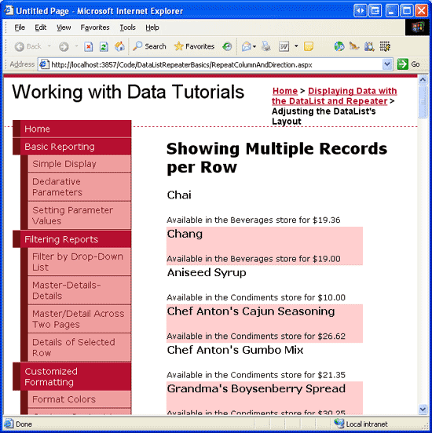

Showing Multiple Records per Row with the DataList Control (VB)
====================
by [Scott Mitchell](https://twitter.com/ScottOnWriting)

[Download Sample App](http://download.microsoft.com/download/9/c/1/9c1d03ee-29ba-4d58-aa1a-f201dcc822ea/ASPNET_Data_Tutorial_31_VB.exe) or [Download PDF](showing-multiple-records-per-row-with-the-datalist-control-vb/_static/datatutorial31vb1.pdf)

> In this short tutorial we'll explore how to customize the DataList's layout through its RepeatColumns and RepeatDirection properties.

## Introduction

The DataList examples we ve seen in the past two tutorials have rendered each record from its data source as a row in a single-column HTML `<table>`. While this is the default DataList behavior, it is very easy to customize the DataList display such that the data source items are spread across a multi-column, multi-row table. Moreover, it s possible to have all of the data source items displayed in a single-row, multi-column DataList.

We can customize the DataList s layout through its `RepeatColumns` and `RepeatDirection` properties, which, respectively, indicate how many columns are rendered and whether those items are laid out vertically or horizontally. Figure 1, for example, shows a DataList that displays product information in a table with three columns.

**Figure 1**: The DataList Shows Three Products per Row ([Click to view full-size image](showing-multiple-records-per-row-with-the-datalist-control-vb/_static/image3.png))

By showing multiple data source items per row, the DataList can more effectively utilize horizontal screen space. In this short tutorial we'll explore these two DataList properties.

## Step 1: Displaying Product Information in a DataList

Before we examine the `RepeatColumns` and `RepeatDirection` properties, let s first create a DataList on our page that lists product information using the standard single-column, multi-row table layout. For this example, let s display the product s name, category, and price using the following markup:

[!code-html[Main](showing-multiple-records-per-row-with-the-datalist-control-vb/samples/sample1.html)]

We ve seen how to bind data to a DataList in previous examples, so I'll move through these steps quickly. Start by opening the `RepeatColumnAndDirection.aspx` page in the `DataListRepeaterBasics` folder and drag a DataList from the Toolbox onto the Designer. From the DataList s smart tag, opt to create a new ObjectDataSource and configure it to pull its data from the `ProductsBLL` class s `GetProducts` method, choosing the (None) option from the wizard s INSERT, UPDATE, and DELETE tabs.

After creating and binding the new ObjectDataSource to the DataList, Visual Studio will automatically create an `ItemTemplate` that displays the name and value for each of the product data fields. Adjust the `ItemTemplate` either directly through the declarative markup or from the Edit Templates option in the DataList s smart tag so that it uses the markup shown above, replacing the *Product Name*, *Category Name*, and *Price* text with Label controls that use the appropriate databinding syntax to assign values to their `Text` properties. After updating the `ItemTemplate`, your page s declarative markup should look similar to the following:

[!code-aspx[Main](showing-multiple-records-per-row-with-the-datalist-control-vb/samples/sample2.aspx)]

Notice that I ve included a format specifier in the `Eval` databinding syntax for the `UnitPrice`, formatting the returned value as a currency - `Eval("UnitPrice", "{0:C}").`

Take a moment to visit your page in a browser. As Figure 2 shows, the DataList renders as a single-column, multi-row table of products.

**Figure 2**: By Default, the DataList Renders as a Single-Column, Multi-Row Table ([Click to view full-size image](showing-multiple-records-per-row-with-the-datalist-control-vb/_static/image6.png))

## Step 2: Changing the DataList s Layout Direction

While the default behavior for the DataList is to lay out its items vertically in a single-column, multi-row table, this behavior can easily be changed through the DataList s [`RepeatDirection` property](https://msdn.microsoft.com/en-us/system.web.ui.webcontrols.datalist.repeatdirection.aspx). The `RepeatDirection` property can accept one of two possible values: `Horizontal` or `Vertical` (the default).

By changing the `RepeatDirection` property from `Vertical` to `Horizontal`, the DataList renders its records in a single row, creating one column per data source item. To illustrate this effect, click on the DataList in the Designer and then, from the Properties window, change the `RepeatDirection` property from `Vertical` to `Horiztonal`. Immediately upon doing so, the Designer adjusts the DataList s layout, creating a single-row, multi-column interface (see Figure 3).

**Figure 3**: The `RepeatDirection` Property Dictates How the Direction the DataList s Items are Laid Out ([Click to view full-size image](showing-multiple-records-per-row-with-the-datalist-control-vb/_static/image9.png))

When displaying small amounts of data, a single-row, multi-column table might be an ideal way to maximize screen real estate. For larger volumes of data, however, a single row will require numerous columns, which pushes those items that can t fit on the screen off to the right. Figure 4 shows the products when rendered in a single-row DataList. Since there are many products (over 80), the user will have to scroll far to the right to view information about each of the products.

**Figure 4**: For Sufficiently Large Data Sources, a Single Column DataList Will Require Horizontal Scrolling ([Click to view full-size image](showing-multiple-records-per-row-with-the-datalist-control-vb/_static/image12.png))

## Step 3: Displaying Data in a Multi-Column, Multi-Row Table

To create a multi-column, multi-row DataList, we need to set the [`RepeatColumns` property](https://msdn.microsoft.com/en-us/system.web.ui.webcontrols.datalist.repeatcolumns.aspx) to the number of columns to display. By default, the `RepeatColumns` property is set to 0, which will cause the DataList to display all of its items in a single row or a column (depending on the value of the `RepeatDirection` property).

For our example, let s display three products per table row. Therefore, set the `RepeatColumns` property to 3. After making this change, take a moment to view the results in a browser. As Figure 5 shows, the products are now listed in a three-column, multi-row table.

**Figure 5**: Three Products are Displayed per Row ([Click to view full-size image](showing-multiple-records-per-row-with-the-datalist-control-vb/_static/image15.png))

The `RepeatDirection` property affects how the items in the DataList are laid out. Figure 5 shows the results with the `RepeatDirection` property set to `Horizontal`. Note that the first three products Chai, Chang, and Aniseed Syrup are laid out from left to right, top to bottom. The next three products (starting with Chef Anton s Cajun Seasoning) appear in a row beneath the first three. Changing the `RepeatDirection` property back to `Vertical`, however, lays out these products from top to bottom, left to right, as Figure 6 illustrates.

**Figure 6**: Here, the Products are Laid Out Vertically ([Click to view full-size image](showing-multiple-records-per-row-with-the-datalist-control-vb/_static/image18.png))

The number of rows displayed in the resulting table depends on the number of total records bound to the DataList. Precisely, it s the ceiling of the total number of data source items divided by the `RepeatColumns` property value. Since the `Products` table currently has 84 products, which is divisible by 3, there are 28 rows. If the number of items in the data source and the `RepeatColumns` property value are not divisible, then the last row or column will have blank cells. If the `RepeatDirection` is set to `Vertical`, then the last column will have empty cells; if `RepeatDirection` is `Horizontal`, then the last row will have the empty cells.

## Summary

The DataList, by default, lists its items in a single-column, multi-row table, which mimics the layout of a GridView with a single TemplateField. While this default layout is acceptable, we can maximize screen real estate by displaying multiple data source items per row. Accomplishing this is simply a matter of setting the DataList s `RepeatColumns` property to the number of columns to display per row. Additionally, the DataList s `RepeatDirection` property can be used to indicate whether the contents of the multi-column, multi-row table should be laid out horizontally from left to right, top to bottom or vertically from top to bottom, left to right.

## About the Author

[Scott Mitchell](http://www.4guysfromrolla.com/ScottMitchell.shtml), author of seven ASP/ASP.NET books and founder of [4GuysFromRolla.com](http://www.4guysfromrolla.com), has been working with Microsoft Web technologies since 1998. Scott works as an independent consultant, trainer, and writer. His latest book is [*Sams Teach Yourself ASP.NET 2.0 in 24 Hours*](https://www.amazon.com/exec/obidos/ASIN/0672327384/4guysfromrollaco). He can be reached at [mitchell@4GuysFromRolla.com.](mailto:mitchell@4GuysFromRolla.com) or via his blog, which can be found at [http://ScottOnWriting.NET](http://ScottOnWriting.NET).

## Special Thanks To

This tutorial series was reviewed by many helpful reviewers. Lead reviewer for this tutorial was John Suru. Interested in reviewing my upcoming MSDN articles? If so, drop me a line at [mitchell@4GuysFromRolla.com.](mailto:mitchell@4GuysFromRolla.com)

>[!div class="step-by-step"]
[Previous](formatting-the-datalist-and-repeater-based-upon-data-vb.md)
[Next](nested-data-web-controls-vb.md)