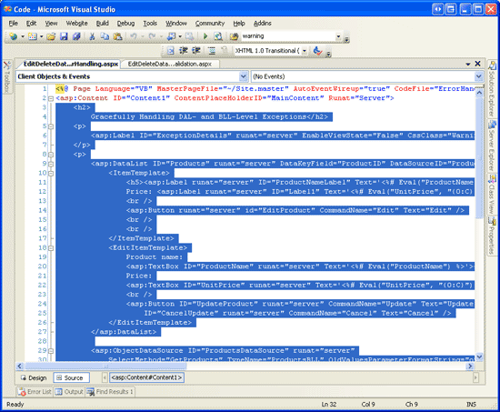
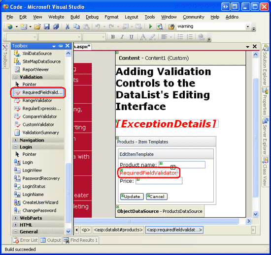
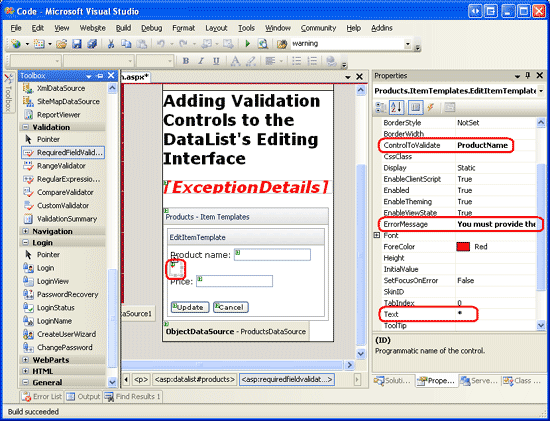
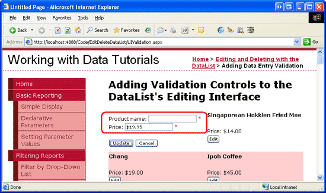

Adding Validation Controls to the DataList's Editing Interface (VB)
====================
by [Scott Mitchell](https://twitter.com/ScottOnWriting)

[Download Sample App](http://download.microsoft.com/download/9/c/1/9c1d03ee-29ba-4d58-aa1a-f201dcc822ea/ASPNET_Data_Tutorial_39_VB.exe) or [Download PDF](adding-validation-controls-to-the-datalist-s-editing-interface-vb/_static/datatutorial39vb1.pdf)

> In this tutorial we'll see how easy it is to add validation controls to the DataList's EditItemTemplate in order to provide a more foolproof editing user interface.

## Introduction

In the DataList editing tutorials thus far, the DataLists editing interfaces have not included any proactive user input validation even though invalid user input such as a missing product name or negative price results in an exception. In the [preceding tutorial](handling-bll-and-dal-level-exceptions-vb.md) we examined how to add exception handling code to the DataList s `UpdateCommand` event handler in order to catch and gracefully display information about any exceptions that were raised. Ideally, however, the editing interface would include validation controls to prevent a user from entering such invalid data in the first place.

In this tutorial we'll see how easy it is to add validation controls to the DataList s `EditItemTemplate` in order to provide a more foolproof editing user interface. Specifically, this tutorial takes the example created in the preceding tutorial and augments the editing interface to include appropriate validation.

## Step 1: Replicating the Example from[Handling BLL- and DAL-Level Exceptions](handling-bll-and-dal-level-exceptions-vb.md)

In the [Handling BLL- and DAL-Level Exceptions](handling-bll-and-dal-level-exceptions-vb.md) tutorial we created a page that listed the names and prices of the products in a two-column, editable DataList. Our goal for this tutorial is to augment the DataList s editing interface to include validation controls. In particular, our validation logic will:

- Require that the product s name be provided
- Ensure that the value entered for the price is a valid currency format
- Ensure that the value entered for the price is greater than or equal to zero, since a negative `UnitPrice` value is illegal

Before we can look at augmenting the previous example to include validation, we first need to replicate the example from the `ErrorHandling.aspx` page in the `EditDeleteDataList` folder to the page for this tutorial, `UIValidation.aspx`. To achieve this we need to copy over both the `ErrorHandling.aspx` page s declarative markup and its source code. First copy over the declarative markup by performing the following steps:

1. Open the `ErrorHandling.aspx` page in Visual Studio
2. Go to the page s declarative markup (click on the Source button at the bottom of the page)
3. Copy the text within the `<asp:Content>` and `</asp:Content>` tags (lines 3 through 32), as shown in Figure 1.

**Figure 2**: Copy the Text Within the `<asp:Content>` Control ([Click to view full-size image](adding-validation-controls-to-the-datalist-s-editing-interface-vb/_static/image3.png))

1. Open the `UIValidation.aspx` page
2. Go to the page s declarative markup
3. Paste the text within the `<asp:Content>` control.

To copy over the source code, open the `ErrorHandling.aspx.vb` page and copy just the text *within* the `EditDeleteDataList_ErrorHandling` class. Copy the three event handlers (`Products_EditCommand`, `Products_CancelCommand`, and `Products_UpdateCommand`) along with the `DisplayExceptionDetails` method, but do **not** copy the class declaration or `using` statements. Paste the copied text *within* the `EditDeleteDataList_UIValidation` class in `UIValidation.aspx.vb`.

After moving over the content and code from `ErrorHandling.aspx` to `UIValidation.aspx`, take a moment to test out the pages in a browser. You should see the same output and experience the same functionality in each of these two pages (see Figure 2).

**Figure 2**: The `UIValidation.aspx` Page Mimics the Functionality in `ErrorHandling.aspx` ([Click to view full-size image](adding-validation-controls-to-the-datalist-s-editing-interface-vb/_static/image6.png))

## Step 2: Adding the Validation Controls to the DataList s EditItemTemplate

When constructing data entry forms, it is important that users enter any required fields and that all their provided inputs are legal, properly-formatted values. To help ensure that a user s inputs are valid, ASP.NET provides five built-in validation controls that are designed to validate the value of a single input Web control:

- [RequiredFieldValidator](https://msdn.microsoft.com/en-us/library/5hbw267h(VS.80).aspx) ensures that a value has been provided
- [CompareValidator](https://msdn.microsoft.com/en-us/library/db330ayw(VS.80).aspx) validates a value against another Web control value or a constant value, or ensures that the value s format is legal for a specified data type
- [RangeValidator](https://msdn.microsoft.com/en-us/library/f70d09xt.aspx) ensures that a value is within a range of values
- [RegularExpressionValidator](https://msdn.microsoft.com/en-US/library/eahwtc9e.aspx) validates a value against a [regular expression](http://en.wikipedia.org/wiki/Regular_expression)
- [CustomValidator](https://msdn.microsoft.com/en-us/library/9eee01cx(VS.80).aspx) validates a value against a custom, user-defined method

For more information on these five controls refer back to the [Adding Validation Controls to the Editing and Inserting Interfaces](../editing-inserting-and-deleting-data/adding-validation-controls-to-the-editing-and-inserting-interfaces-vb.md) tutorial or check out the [Validation Controls section](https://quickstarts.asp.net/QuickStartv20/aspnet/doc/ctrlref/validation/default.aspx) of the [ASP.NET Quickstart Tutorials](https://quickstarts.asp.net).

For our tutorial we'll need to use a RequiredFieldValidator to ensure that a value for the product name has been supplied and a CompareValidator to ensure that the entered price has a value greater than or equal to 0 and is presented in a valid currency format.

> [!NOTE]
> While ASP.NET 1.x had these same five validation controls, ASP.NET 2.0 has added a number of improvements, the main two being client-side script support for browsers in addition to Internet Explorer and the ability to partition validation controls on a page into validation groups. For more information on the new validation control features in 2.0, refer to [Dissecting the Validation Controls in ASP.NET 2.0](http://aspnet.4guysfromrolla.com/articles/112305-1.aspx).

Let s start by adding the necessary validation controls to the DataList s `EditItemTemplate`. This task can be performed through the Designer by clicking on the Edit Templates link from the DataList s smart tag, or through the declarative syntax. Let s step through the process using the Edit Templates option from the Design view. After choosing to edit the DataList s `EditItemTemplate`, add a RequiredFieldValidator by dragging it from the Toolbox into the template editing interface, placing it after the `ProductName` TextBox.

**Figure 3**: Add a RequiredFieldValidator to the `EditItemTemplate After` the `ProductName` TextBox ([Click to view full-size image](adding-validation-controls-to-the-datalist-s-editing-interface-vb/_static/image9.png))

All validation controls work by validating the input of a single ASP.NET Web control. Therefore, we need to indicate that the RequiredFieldValidator we just added should validate against the `ProductName` TextBox; this is done by setting the validation control s [`ControlToValidate` property](https://msdn.microsoft.com/en-US/library/system.web.ui.webcontrols.basevalidator.controltovalidate(VS.80).aspx) to the `ID` of the appropriate Web control (`ProductName`, in this instance). Next, set the [`ErrorMessage` property](https://msdn.microsoft.com/en-US/library/system.web.ui.webcontrols.basevalidator.errormessage(VS.80).aspx) to You must provide the product s name and the [`Text` property](https://msdn.microsoft.com/en-US/library/system.web.ui.webcontrols.basevalidator.text(VS.80).aspx) to \*. The `Text` property value, if provided, is the text that is displayed by the validation control if the validation fails. The `ErrorMessage` property value, which is required, is used by the ValidationSummary control; if the `Text` property value is omitted, the `ErrorMessage` property value is displayed by the validation control on invalid input.

After setting these three properties of the RequiredFieldValidator, your screen should look similar to Figure 4.

**Figure 4**: Set the RequiredFieldValidator s `ControlToValidate`, `ErrorMessage`, and `Text` Properties ([Click to view full-size image](adding-validation-controls-to-the-datalist-s-editing-interface-vb/_static/image12.png))

With the RequiredFieldValidator added to the `EditItemTemplate`, all that remains is to add the necessary validation for the product s price TextBox. Since the `UnitPrice` is optional when editing a record, we don t need to add a RequiredFieldValidator. We do, however, need to add a CompareValidator to ensure that the `UnitPrice`, if supplied, is properly formatted as a currency and is greater than or equal to 0.

Add the CompareValidator into the `EditItemTemplate` and set its `ControlToValidate` property to `UnitPrice`, its `ErrorMessage` property to The price must be greater than or equal to zero and cannot include the currency symbol, and its `Text` property to \*. To indicate that the `UnitPrice` value must be greater than or equal to 0, set the CompareValidator s [`Operator` property](https://msdn.microsoft.com/en-us/library/system.web.ui.webcontrols.comparevalidator.operator(VS.80).aspx) to `GreaterThanEqual`, its [`ValueToCompare` property](https://msdn.microsoft.com/en-US/library/system.web.ui.webcontrols.comparevalidator.valuetocompare(VS.80).aspx) to 0, and its [`Type` property](https://msdn.microsoft.com/en-US/library/system.web.ui.webcontrols.basecomparevalidator.type.aspx) to `Currency`.

After adding these two validation controls, the DataList s `EditItemTemplate` s declarative syntax should look similar to the following:

[!code-aspx[Main](adding-validation-controls-to-the-datalist-s-editing-interface-vb/samples/sample1.aspx)]

After making these changes, open the page in a browser. If you attempt to omit the name or enter an invalid price value when editing a product, an asterisk appears next to the textbox. As Figure 5 shows, a price value that includes the currency symbol such as $19.95 is considered invalid. The CompareValidator s `Currency` `Type` allows for digit separators (such as commas or periods, depending on the culture settings) and a leading plus or minus sign, but does *not* permit a currency symbol. This behavior may perplex users as the editing interface currently renders the `UnitPrice` using the currency format.

**Figure 5**: An Asterisk Appears Next to the Textboxes with Invalid Input ([Click to view full-size image](adding-validation-controls-to-the-datalist-s-editing-interface-vb/_static/image15.png))

While the validation works as-is, the user has to manually remove the currency symbol when editing a record, which is not acceptable. Moreover, if there are invalid inputs in the editing interface neither the Update nor Cancel buttons, when clicked, will invoke a postback. Ideally, the Cancel button would return the DataList to its pre-editing state regardless of the validity of the user s inputs. Also, we need to ensure that the page s data is valid before updating the product information in the DataList s `UpdateCommand` event handler, as the validation controls client-side logic can be bypassed by users whose browsers either don t support JavaScript or have its support disabled.

## Removing the Currency Symbol from the EditItemTemplate s UnitPrice TextBox

When using the CompareValidator s `Currency``Type`, the input being validated must not include any currency symbols. The presence of such symbols causes the CompareValidator to mark the input as invalid. However, our editing interface currently includes a currency symbol in the `UnitPrice` TextBox, meaning the user must explicitly remove the currency symbol before saving their changes. To remedy this we have three options:

1. Configure the `EditItemTemplate` so that the `UnitPrice` TextBox value is not formatted as a currency.
2. Allow the user to enter a currency symbol by removing the CompareValidator and replacing it with a RegularExpressionValidator that checks for a properly formatted currency value. The challenge here is that the regular expression to validate a currency value is not as straightforward as the CompareValidator and would require writing code if we wanted to incorporate culture settings.
3. Remove the validation control altogether and rely on custom server-side validation logic in the GridView s `RowUpdating` event handler.

Let s go with option 1 for this tutorial. Currently the `UnitPrice` is formatted as a currency value due to the databinding expression for the TextBox in the `EditItemTemplate`: `<%# Eval("UnitPrice", "{0:c}") %>`. Change the `Eval` statement to `Eval("UnitPrice", "{0:n2}")`, which formats the result as a number with two digits of precision. This can be done directly through the declarative syntax or by clicking on the Edit DataBindings link from the `UnitPrice` TextBox in the DataList s `EditItemTemplate`.

With this change, the formatted price in the editing interface includes commas as the group separator and a period as the decimal separator, but leaves off the currency symbol.

> [!NOTE]
> When removing the currency format from the editable interface, I find it helpful to put the currency symbol as text outside the TextBox. This serves as a hint to the user that they do not need to provide the currency symbol.

## Fixing the Cancel Button

By default, the validation Web controls emit JavaScript to perform validation on the client-side. When a Button, LinkButton, or ImageButton is clicked, the validation controls on the page are checked on the client-side before the postback occurs. If there is any invalid data, the postback is cancelled. For certain Buttons, though, the validity of the data might be immaterial; in such a case, having the postback cancelled due to invalid data is a nuisance.

The Cancel button is such an example. Imagine that a user enters invalid data, such as omitting the product s name, and then decides she doesn t want to save the product after all and hits the Cancel button. Currently, the Cancel button triggers the validation controls on the page, which report that the product name is missing and prevent the postback. Our user has to type some text into the `ProductName` TextBox just to cancel out of the editing process.

Fortunately, the Button, LinkButton, and ImageButton have a [`CausesValidation` property](https://msdn.microsoft.com/en-us/library/system.web.ui.webcontrols.button.causesvalidation.aspx) that can indicate whether or not clicking the Button should initiate the validation logic (defaults to `True`). Set the Cancel Button s `CausesValidation` property to `False`.

## Ensuring the Inputs are Valid in the UpdateCommand Event Handler

Due to the client-side script emitted by the validation controls, if a user enters invalid input the validation controls cancel any postbacks initiated by Button, LinkButton, or ImageButton controls whose `CausesValidation` properties are `True` (the default). However, if a user is visiting with an antiquated browser or one whose JavaScript support has been disabled, the client-side validation checks will not execute.

All of the ASP.NET validation controls repeat their validation logic immediately upon postback and report the overall validity of the page s inputs via the [`Page.IsValid` property](https://msdn.microsoft.com/en-us/library/system.web.ui.page.isvalid.aspx). However, the page flow is not interrupted or stopped in any way based on the value of `Page.IsValid`. As developers, it is our responsibility to ensure that the `Page.IsValid` property has a value of `True` before proceeding with code that assumes valid input data.

If a user has JavaScript disabled, visits our page, edits a product, enters a price value of Too expensive, and clicks the Update button, the client-side validation will be bypassed and a postback will ensue. On postback, the ASP.NET page s `UpdateCommand` event handler executes and an exception is raised when attempting to parse Too expensive to a `Decimal`. Since we have exception handling, such an exception will be handled gracefully, but we could prevent the invalid data from slipping through in the first place by only proceeding with the `UpdateCommand` event handler if `Page.IsValid` has a value of `True`.

Add the following code to the start of the `UpdateCommand` event handler, immediately before the `Try` block:

[!code-vb[Main](adding-validation-controls-to-the-datalist-s-editing-interface-vb/samples/sample2.vb)]

With this addition, the product will attempt to be updated only if the submitted data is valid. Most users won t be able to postback invalid data due to the validation controls client-side scripts, but users whose browsers don t support JavaScript or that have JavaScript support disabled, can bypass the client-side checks and submit invalid data.

> [!NOTE]
> The astute reader will recall that when updating data with the GridView, we didn t need to explicitly check the `Page.IsValid` property in our page s code-behind class. This is because the GridView consults the `Page.IsValid` property for us and only proceeds with the update only if it returns a value of `True`.

## Step 3: Summarizing Data Entry Problems

In addition to the five validation controls, ASP.NET includes the [ValidationSummary control](https://msdn.microsoft.com/en-US/library/f9h59855(VS.80).aspx), which displays the `ErrorMessage` s of those validation controls that detected invalid data. This summary data can be displayed as text on the web page or through a modal, client-side messagebox. Let s enhance this tutorial to include a client-side messagebox summarizing any validation problems.

To accomplish this, drag a ValidationSummary control from the Toolbox onto the Designer. The location of the ValidationSummary control doesn t really matter, since we re going to configure it to only display the summary as a messagebox. After adding the control, set its [`ShowSummary` property](https://msdn.microsoft.com/en-US/library/system.web.ui.webcontrols.validationsummary.showsummary(VS.80).aspx) to `False` and its [`ShowMessageBox` property](https://msdn.microsoft.com/en-US/library/system.web.ui.webcontrols.validationsummary.showmessagebox(VS.80).aspx) to `True`. With this addition, any validation errors are summarized in a client-side messagebox (see Figure 6).

**Figure 6**: The Validation Errors are Summarized in a Client-Side Messagebox ([Click to view full-size image](adding-validation-controls-to-the-datalist-s-editing-interface-vb/_static/image18.png))

## Summary

In this tutorial we saw how to reduce the likelihood of exceptions by using validation controls to proactively ensure that our users inputs are valid before attempting to use them in the updating workflow. ASP.NET provides five validation Web controls that are designed to inspect a particular Web control s input and report back on the input s validity. In this tutorial we used two of those five controls the RequiredFieldValidator and the CompareValidator to ensure that the product s name was supplied and that the price had a currency format with a value greater than or equal to zero.

Adding validation controls to the DataList s editing interface is as simple as dragging them onto the `EditItemTemplate` from the Toolbox and setting a handful of properties. By default, the validation controls automatically emit client-side validation script; they also provide server-side validation on postback, storing the cumulative result in the `Page.IsValid` property. To bypass the client-side validation when a Button, LinkButton, or ImageButton is clicked, set the button s `CausesValidation` property to `False`. Also, before performing any tasks with the data submitted on postback, ensure that the `Page.IsValid` property returns `True`.

All of the DataList editing tutorials we ve examined so far have had very simple editing interfaces a TextBox for the product s name and another for the price. The editing interface, however, can contain a mix of different Web controls, such as DropDownLists, Calendars, RadioButtons, CheckBoxes, and so on. In our next tutorial we'll look at building an interface that uses a variety of Web controls.

Happy Programming!

## About the Author

[Scott Mitchell](http://www.4guysfromrolla.com/ScottMitchell.shtml), author of seven ASP/ASP.NET books and founder of [4GuysFromRolla.com](http://www.4guysfromrolla.com), has been working with Microsoft Web technologies since 1998. Scott works as an independent consultant, trainer, and writer. His latest book is [*Sams Teach Yourself ASP.NET 2.0 in 24 Hours*](https://www.amazon.com/exec/obidos/ASIN/0672327384/4guysfromrollaco). He can be reached at [mitchell@4GuysFromRolla.com.](mailto:mitchell@4GuysFromRolla.com) or via his blog, which can be found at [http://ScottOnWriting.NET](http://ScottOnWriting.NET).

## Special Thanks To

This tutorial series was reviewed by many helpful reviewers. Lead reviewers for this tutorial were Dennis Patterson, Ken Pespisa, and Liz Shulok. Interested in reviewing my upcoming MSDN articles? If so, drop me a line at [mitchell@4GuysFromRolla.com.](mailto:mitchell@4GuysFromRolla.com)

>[!div class="step-by-step"]
[Previous](handling-bll-and-dal-level-exceptions-vb.md)
[Next](customizing-the-datalist-s-editing-interface-vb.md)