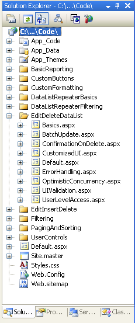
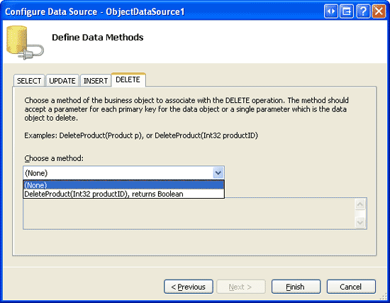
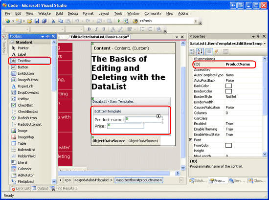
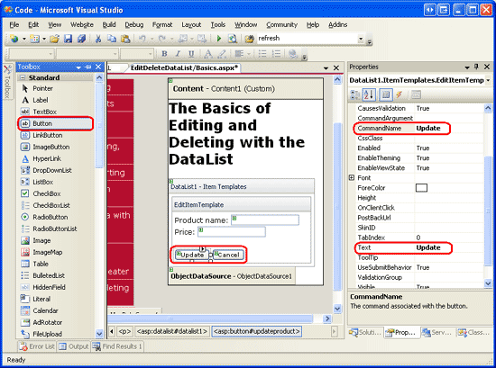
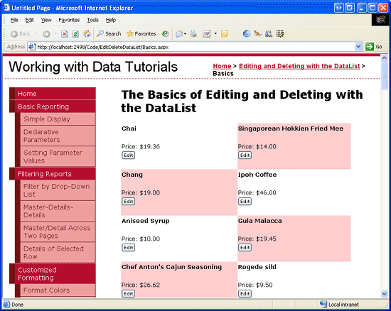
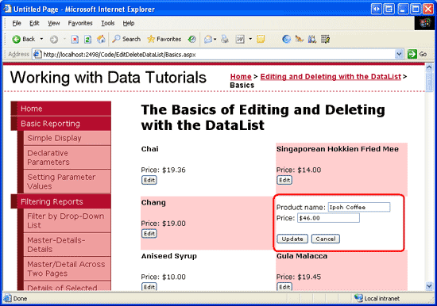
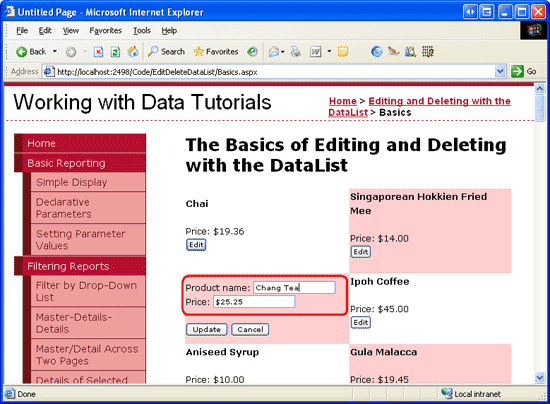
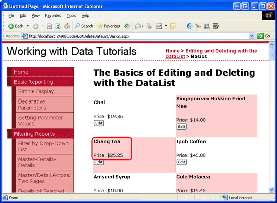

An Overview of Editing and Deleting Data in the DataList (C#)
====================
by [Scott Mitchell](https://twitter.com/ScottOnWriting)

[Download Sample App](http://download.microsoft.com/download/9/c/1/9c1d03ee-29ba-4d58-aa1a-f201dcc822ea/ASPNET_Data_Tutorial_36_CS.exe) or [Download PDF](an-overview-of-editing-and-deleting-data-in-the-datalist-cs/_static/datatutorial36cs1.pdf)

> While the DataList lacks built-in editing and deleting capabilities, in this tutorial we'll see how to create a DataList that supports editing and deleting of its underlying data.

## Introduction

In the [An Overview of Inserting, Updating, and Deleting Data](../editing-inserting-and-deleting-data/an-overview-of-inserting-updating-and-deleting-data-cs.md) tutorial we looked at how to insert, update, and delete data using the application architecture, an ObjectDataSource, and the GridView, DetailsView, and FormView controls. With the ObjectDataSource and these three data Web controls, implementing simple data modification interfaces was a snap and involved merely ticking a checkbox from a smart tag. No code needed to be written.

Unfortunately, the DataList lacks the built-in editing and deleting capabilities inherent in the GridView control. This missing functionality is due in part to the fact that the DataList is a relic from the previous version of ASP.NET, when declarative data source controls and code-free data modification pages were unavailable. While the DataList in ASP.NET 2.0 does not offer the same out of the box data modification capabilities as the GridView, we can use ASP.NET 1.x techniques to include such functionality. This approach requires a bit of code but, as we'll see in this tutorial, the DataList has some events and properties in place to aid in this process.

In this tutorial we'll see how to create a DataList that supports editing and deleting of its underlying data. Future tutorials will examine more advanced editing and deleting scenarios, including input field validation, gracefully handling exceptions raised from the Data Access or Business Logic Layers, and so on.

> [!NOTE]
> Like the DataList, the Repeater control lacks the out of the box functionality for inserting, updating, or deleting. While such functionality can be added, the DataList includes properties and events not found in the Repeater that simplify adding such capabilities. Therefore, this tutorial and future ones that look at editing and deleting will focus strictly on the DataList.

## Step 1: Creating the Editing and Deleting Tutorials Web Pages

Before we start exploring how to update and delete data from a DataList, let s first take a moment to create the ASP.NET pages in our website project that we'll need for this tutorial and the next several ones. Start by adding a new folder named `EditDeleteDataList`. Next, add the following ASP.NET pages to that folder, making sure to associate each page with the `Site.master` master page:

- `Default.aspx`
- `Basics.aspx`
- `BatchUpdate.aspx`
- `ErrorHandling.aspx`
- `UIValidation.aspx`
- `CustomizedUI.aspx`
- `OptimisticConcurrency.aspx`
- `ConfirmationOnDelete.aspx`
- `UserLevelAccess.aspx`

**Figure 1**: Add the ASP.NET Pages for the Tutorials

Like in the other folders, `Default.aspx` in the `EditDeleteDataList` folder lists the tutorials in its section. Recall that the `SectionLevelTutorialListing.ascx` User Control provides this functionality. Therefore, add this User Control to `Default.aspx` by dragging it from the Solution Explorer onto the page s Design view.

**Figure 2**: Add the `SectionLevelTutorialListing.ascx` User Control to `Default.aspx` ([Click to view full-size image](an-overview-of-editing-and-deleting-data-in-the-datalist-cs/_static/image4.png))

Lastly, add the pages as entries to the `Web.sitemap` file. Specifically, add the following markup after the Master/Detail Reports with the DataList and Repeater `<siteMapNode>`:

[!code-xml[Main](an-overview-of-editing-and-deleting-data-in-the-datalist-cs/samples/sample1.xml)]

After updating `Web.sitemap`, take a moment to view the tutorials website through a browser. The menu on the left now includes items for the DataList editing and deleting tutorials.

**Figure 3**: The Site Map Now Includes Entries for the DataList Editing and Deleting Tutorials

## Step 2: Examining Techniques for Updating and Deleting Data

Editing and deleting data with the GridView is so easy because, underneath the covers, the GridView and ObjectDataSource work in concert. As discussed in the [Examining the Events Associated with Inserting, Updating, and Deleting](../editing-inserting-and-deleting-data/examining-the-events-associated-with-inserting-updating-and-deleting-cs.md) tutorial, when a row s Update button is clicked, the GridView automatically assigns its fields that used two-way databinding to the `UpdateParameters` collection of its ObjectDataSource and then invokes that ObjectDataSource s `Update()` method.

Sadly, the DataList does not provide any of this built-in functionality. It is our responsibility to ensure that the user s values are assigned to the ObjectDataSource s parameters and that its `Update()` method is called. To aid us in this endeavor, the DataList provides the following properties and events:

- **The [`DataKeyField` property](https://msdn.microsoft.com/en-us/library/system.web.ui.webcontrols.basedatalist.datakeyfield.aspx)** when updating or deleting, we need to be able to uniquely identify each item in the DataList. Set this property to the primary key field of the displayed data. Doing so will populate the DataList s [`DataKeys` collection](https://msdn.microsoft.com/en-us/library/system.web.ui.webcontrols.basedatalist.datakeys.aspx) with the specified `DataKeyField` value for each DataList item.
- **The [`EditCommand` event](https://msdn.microsoft.com/en-us/library/system.web.ui.webcontrols.datalist.editcommand.aspx)** fires when a Button, LinkButton, or ImageButton whose `CommandName` property is set to Edit is clicked.
- **The [`CancelCommand` event](https://msdn.microsoft.com/en-us/library/system.web.ui.webcontrols.datalist.cancelcommand.aspx)** fires when a Button, LinkButton, or ImageButton whose `CommandName` property is set to Cancel is clicked.
- **The [`UpdateCommand` event](https://msdn.microsoft.com/en-us/library/system.web.ui.webcontrols.datalist.updatecommand.aspx)** fires when a Button, LinkButton, or ImageButton whose `CommandName` property is set to Update is clicked.
- **The [`DeleteCommand` event](https://msdn.microsoft.com/en-us/library/system.web.ui.webcontrols.datalist.deletecommand.aspx)** fires when a Button, LinkButton, or ImageButton whose `CommandName` property is set to Delete is clicked.

Using these properties and events, there are four approaches we can use to update and delete data from the DataList:

1. **Using ASP.NET 1.x Techniques** the DataList existed prior to ASP.NET 2.0 and ObjectDataSources and was able to update and delete data entirely through programmatic means. This technique ditches the ObjectDataSource altogether and requires that we bind the data to the DataList directly from the Business Logic Layer, both in retrieving the data to display and when updating or deleting a record.
2. **Using a Single ObjectDataSource Control on the Page for Selecting, Updating, and Deleting** while the DataList lacks the GridView s inherent editing and deleting capabilities, there s no reason we can t add them in ourselves. With this approach, we use an ObjectDataSource just like in the GridView examples, but must create an event handler for the DataList s `UpdateCommand` event where we set the ObjectDataSource s parameters and call its `Update()` method.
3. **Using an ObjectDataSource Control for Selecting, but Updating and Deleting Directly Against the BLL** when using option 2, we need to write a bit of code in the `UpdateCommand` event, assigning parameter values and so on. Instead, we can stick with using the ObjectDataSource for selecting, but make the updating and deleting calls directly against the BLL (like with option 1). In my opinion, updating data by interfacing directly with the BLL leads to more readable code than assigning the ObjectDataSource s `UpdateParameters` and calling its `Update()` method.
4. **Using Declarative Means through Multiple ObjectDataSources** the previous three approaches all require a bit of code. If you d rather keep using as much declarative syntax as possible, a final option is to include multiple ObjectDataSources on the page. The first ObjectDataSource retrieves the data from the BLL and binds it to the DataList. For updating, another ObjectDataSource is added, but added directly within the DataList s `EditItemTemplate`. To include deleting support, yet another ObjectDataSource would be needed in the `ItemTemplate`. With this approach, these embedded ObjectDataSource s use `ControlParameters` to declaratively bind the ObjectDataSource s parameters to the user input controls (rather than having to specify them programmatically in the DataList s `UpdateCommand` event handler). This approach still requires a bit of code we need to call the embedded ObjectDataSource s `Update()` or `Delete()` command but requires far less than with the other three approaches. The downside here is that the multiple ObjectDataSources do clutter up the page, detracting from the overall readability.

If forced to only ever use one of these approaches, I d choose option 1 because it provides the most flexibility and because the DataList was originally designed to accommodate this pattern. While the DataList was extended to work with the ASP.NET 2.0 data source controls, it does not have all of the extensibility points or features of the official ASP.NET 2.0 data Web controls (the GridView, DetailsView, and FormView). Options 2 through 4 are not without merit, though.

This and the future editing and deleting tutorials will use an ObjectDataSource for retrieving the data to display and direct calls to the BLL to update and delete data (option 3).

## Step 3: Adding the DataList and Configuring its ObjectDataSource

In this tutorial we will create a DataList that lists product information and, for each product, provides the user the ability to edit the name and price and to delete the product altogether. In particular, we will retrieve the records to display using an ObjectDataSource, but perform the update and delete actions by interfacing directly with the BLL. Before we worry about implementing the editing and deleting capabilities to the DataList, let s first get the page to display the products in a read-only interface. Since we ve examined these steps in previous tutorials, I'll proceed through them quickly.

Start by opening the `Basics.aspx` page in the `EditDeleteDataList` folder and, from the Design view, add a DataList to the page. Next, from the DataList s smart tag, create a new ObjectDataSource. Since we are working with product data, configure it to use the `ProductsBLL` class. To retrieve *all* products, choose the `GetProducts()` method in the SELECT tab.

**Figure 4**: Configure the ObjectDataSource to Use the `ProductsBLL` Class ([Click to view full-size image](an-overview-of-editing-and-deleting-data-in-the-datalist-cs/_static/image8.png))

**Figure 5**: Return the Product Information Using the `GetProducts()` Method ([Click to view full-size image](an-overview-of-editing-and-deleting-data-in-the-datalist-cs/_static/image11.png))

The DataList, like the GridView, is not designed for inserting new data; therefore, select the (None) option from the drop-down list in the INSERT tab. Also choose (None) for the UPDATE and DELETE tabs since the updates and deletes will be performed programmatically through the BLL.

**Figure 6**: Confirm that the Drop-Down Lists in the ObjectDataSource s INSERT, UPDATE, and DELETE Tabs are Set to (None) ([Click to view full-size image](an-overview-of-editing-and-deleting-data-in-the-datalist-cs/_static/image14.png))

After configuring the ObjectDataSource, click Finish, returning to the Designer. As we ve seen in past examples, when completing the ObjectDataSource configuration, Visual Studio automatically creates an `ItemTemplate` for the DropDownList, displaying each of the data fields. Replace this `ItemTemplate` with one that displays only the product s name and price. Also, set the `RepeatColumns` property to 2.

> [!NOTE]
> As discussed in the *Overview of Inserting, Updating, and Deleting Data* tutorial, when modifying data using the ObjectDataSource our architecture requires that we remove the `OldValuesParameterFormatString` property from the ObjectDataSource s declarative markup (or reset it to its default value, `{0}`). In this tutorial, however, we are using the ObjectDataSource only for retrieving data. Therefore, we do not need to modify the ObjectDataSource s `OldValuesParameterFormatString` property value (although it doesn t hurt to do so).

After replacing the default DataList `ItemTemplate` with a customized one, the declarative markup on your page should look similar to the following:

[!code-aspx[Main](an-overview-of-editing-and-deleting-data-in-the-datalist-cs/samples/sample2.aspx)]

Take a moment to view our progress through a browser. As Figure 7 shows, the DataList displays the product name and unit price for each product in two columns.

**Figure 7**: The Products Names and Prices are Displayed in a Two-Column DataList ([Click to view full-size image](an-overview-of-editing-and-deleting-data-in-the-datalist-cs/_static/image17.png))

> [!NOTE]
> The DataList has a number of properties that are required for the updating and deleting process, and these values are stored in view state. Therefore, when building a DataList that supports editing or deleting data, it is essential that the DataList s view state be enabled.  
>   
>  The astute reader may recall that we were able to disable view state when creating editable GridViews, DetailsViews, and FormViews. This is because ASP.NET 2.0 Web controls can include *control state*, which is state persisted across postbacks like view state, but deemed essential.

Disabling view state in the GridView merely omits trivial state information, but maintains the control state (which includes the state necessary for editing and deleting). The DataList, having been created in the ASP.NET 1.x timeframe, does not utilize control state and therefore must have view state enabled. See [Control State vs. View State](https://msdn.microsoft.com/en-us/library/1whwt1k7.aspx) for more information on the purpose of control state and how it differs from view state.

## Step 4: Adding an Editing User Interface

The GridView control is composed of a collection of fields (BoundFields, CheckBoxFields, TemplateFields, and so on). These fields can adjust their rendered markup depending on their mode. For example, when in read-only mode, a BoundField displays its data field value as text; when in edit mode, it renders a TextBox Web control whose `Text` property is assigned the data field value.

The DataList, on the other hand, renders its items using templates. Read-only items are rendered using the `ItemTemplate` whereas items in edit mode are rendered via the `EditItemTemplate`. At this point, our DataList has only an `ItemTemplate`. To support item-level editing functionality we need to add an `EditItemTemplate` that contains the markup to be displayed for the editable item. For this tutorial, we'll use TextBox Web controls for editing the product s name and unit price.

The `EditItemTemplate` can be created either declaratively or through the Designer (by selecting the Edit Templates option from the DataList s smart tag). To use the Edit Templates option, first click the Edit Templates link in the smart tag and then select the `EditItemTemplate` item from the drop-down list.

**Figure 8**: Opt to Work with the DataList s `EditItemTemplate` ([Click to view full-size image](an-overview-of-editing-and-deleting-data-in-the-datalist-cs/_static/image20.png))

Next, type in Product name: and Price: and then drag two TextBox controls from the Toolbox into the `EditItemTemplate` interface on the Designer. Set the TextBoxes `ID` properties to `ProductName` and `UnitPrice`.

**Figure 9**: Add a TextBox for the Product s Name and Price ([Click to view full-size image](an-overview-of-editing-and-deleting-data-in-the-datalist-cs/_static/image23.png))

We need to bind the corresponding product data field values to the `Text` properties of the two TextBoxes. From the TextBoxes smart tags, click on the Edit DataBindings link and then associate the appropriate data field with the `Text` property, as shown in Figure 10.

> [!NOTE]
> When binding the `UnitPrice` data field to the price TextBox s `Text` field, you may format it as a currency value (`{0:C}`), a general number (`{0:N}`), or leave it unformatted.

**Figure 10**: Bind the `ProductName` and `UnitPrice` Data Fields to the `Text` Properties of the TextBoxes

Notice how the Edit DataBindings dialog box in Figure 10 does *not* include the Two-way databinding checkbox that is present when editing a TemplateField in the GridView or DetailsView, or a template in the FormView. The two-way databinding feature allowed the value entered into the input Web control to be automatically assigned to the corresponding ObjectDataSource s `InsertParameters` or `UpdateParameters` when inserting or updating data. The DataList does not support two-way databinding as we'll see later on in this tutorial, after the user makes her changes and is ready to update the data, we will need to programmatically access these TextBoxes `Text` properties and pass in their values to the appropriate `UpdateProduct` method in the `ProductsBLL` class.

Finally, we need to add Update and Cancel buttons to the `EditItemTemplate`. As we saw in the [Master/Detail Using a Bulleted List of Master Records with a Details DataList](../filtering-scenarios-with-the-datalist-and-repeater/master-detail-using-a-bulleted-list-of-master-records-with-a-details-datalist-cs.md) tutorial, when a Button, LinkButton, or ImageButton whose `CommandName` property is set is clicked from within a Repeater or DataList, the Repeater or DataList s `ItemCommand` event is raised. For the DataList, if the `CommandName` property is set to a certain value, an additional event may be raised as well. The special `CommandName` property values include, among others:

- Cancel raises the `CancelCommand` event
- Edit raises the `EditCommand` event
- Update raises the `UpdateCommand` event

Keep in mind that these events are raised *in addition to* the `ItemCommand` event.

Add to the `EditItemTemplate` two Button Web controls, one whose `CommandName` is set to Update and the other s set to Cancel. After adding these two Button Web controls the Designer should look similar to the following:

**Figure 11**: Add Update and Cancel Buttons to the `EditItemTemplate` ([Click to view full-size image](an-overview-of-editing-and-deleting-data-in-the-datalist-cs/_static/image27.png))

With the `EditItemTemplate` complete your DataList s declarative markup should look similar to the following:

[!code-aspx[Main](an-overview-of-editing-and-deleting-data-in-the-datalist-cs/samples/sample3.aspx)]

## Step 5: Adding the Plumbing to Enter Edit Mode

At this point our DataList has an editing interface defined via its `EditItemTemplate`; however, there s currently no way for a user visiting our page to indicate that he wants to edit a product s information. We need to add an Edit button to each product that, when clicked, renders that DataList item in edit mode. Start by adding an Edit button to the `ItemTemplate`, either through the Designer or declaratively. Be certain to set the Edit button s `CommandName` property to Edit .

After you have added this Edit button, take a moment to view the page through a browser. With this addition, each product listing should include an Edit button.

**Figure 12**: Add Update and Cancel Buttons to the `EditItemTemplate` ([Click to view full-size image](an-overview-of-editing-and-deleting-data-in-the-datalist-cs/_static/image30.png))

Clicking the button causes a postback, but does *not* bring the product listing into edit mode. To make the product editable, we need to:

1. Set the DataList s [`EditItemIndex` property](https://msdn.microsoft.com/en-us/library/system.web.ui.webcontrols.datalist.edititemindex.aspx) to the index of the `DataListItem` whose Edit button was just clicked.
2. Rebind the data to the DataList. When the DataList is re-rendered, the `DataListItem` whose `ItemIndex` corresponds with the DataList s `EditItemIndex` will render using its `EditItemTemplate`.

Since the DataList s `EditCommand` event is fired when the Edit button is clicked, create an `EditCommand` event handler with the following code:

[!code-csharp[Main](an-overview-of-editing-and-deleting-data-in-the-datalist-cs/samples/sample4.cs)]

The `EditCommand` event handler is passed in an object of type `DataListCommandEventArgs` as its second input parameter, which includes a reference to the `DataListItem` whose Edit button was clicked (`e.Item`). The event handler first sets the DataList s `EditItemIndex` to the `ItemIndex` of the editable `DataListItem` and then rebinds the data to the DataList by calling the DataList s `DataBind()` method.

After adding this event handler, revisit the page in a browser. Clicking the Edit button now makes the clicked product editable (see Figure 13).

**Figure 13**: Clicking the Edit Button Makes the Product Editable ([Click to view full-size image](an-overview-of-editing-and-deleting-data-in-the-datalist-cs/_static/image33.png))

## Step 6: Saving the User s Changes

Clicking the edited product s Update or Cancel buttons does nothing at this point; to add this functionality we need to create event handlers for the DataList s `UpdateCommand` and `CancelCommand` events. Start by creating the `CancelCommand` event handler, which will execute when the edited product s Cancel button is clicked and it tasked with returning the DataList to its pre-editing state.

To have the DataList render all of its items in the read-only mode, we need to:

1. Set the DataList s [`EditItemIndex` property](https://msdn.microsoft.com/en-us/library/system.web.ui.webcontrols.datalist.edititemindex.aspx) to the index of a non-existent `DataListItem` index. `-1` is a safe choice, since the `DataListItem` indexes start at `0`.
2. Rebind the data to the DataList. Since no `DataListItem` `ItemIndex` es correspond to the DataList s `EditItemIndex`, the entire DataList will be rendered in a read-only mode.

These steps can be accomplished with the following event handler code:

[!code-csharp[Main](an-overview-of-editing-and-deleting-data-in-the-datalist-cs/samples/sample5.cs)]

With this addition, clicking the Cancel button returns the DataList to its pre-editing state.

The last event handler we need to complete is the `UpdateCommand` event handler. This event handler needs to:

1. Programmatically access the user-entered product name and price as well as the edited product s `ProductID`.
2. Initiate the update process by calling the appropriate `UpdateProduct` overload in the `ProductsBLL` class.
3. Set the DataList s [`EditItemIndex` property](https://msdn.microsoft.com/en-us/library/system.web.ui.webcontrols.datalist.edititemindex.aspx) to the index of a non-existent `DataListItem` index. `-1` is a safe choice, since the `DataListItem` indexes start at `0`.
4. Rebind the data to the DataList. Since no `DataListItem` `ItemIndex` es correspond to the DataList s `EditItemIndex`, the entire DataList will be rendered in a read-only mode.

Steps 1 and 2 are responsible for saving the user s changes; steps 3 and 4 return the DataList to its pre-editing state after the changes have been saved and are identical to the steps performed in the `CancelCommand` event handler.

To get the updated product name and price, we need to use the `FindControl` method to programmatically reference the TextBox Web controls within the `EditItemTemplate`. We also need to get the edited product s `ProductID` value. When we initially bound the ObjectDataSource to the DataList, Visual Studio assigned the DataList s `DataKeyField` property to the primary key value from the data source (`ProductID`). This value can then be retrieved from the DataList s `DataKeys` collection. Take a moment to ensure that the `DataKeyField` property is indeed set to `ProductID`.

The following code implements the four steps:

[!code-csharp[Main](an-overview-of-editing-and-deleting-data-in-the-datalist-cs/samples/sample6.cs)]

The event handler starts by reading in the edited product s `ProductID` from the `DataKeys` collection. Next, the two TextBoxes in the `EditItemTemplate` are referenced and their `Text` properties stored in local variables, `productNameValue` and `unitPriceValue`. We use the `Decimal.Parse()` method to read the value from the `UnitPrice` TextBox so that if the value entered has a currency symbol, it can still be correctly converted into a `Decimal` value.

> [!NOTE]
> The values from the `ProductName` and `UnitPrice` TextBoxes are only assigned to the productNameValue and unitPriceValue variables if the TextBoxes Text properties have a value specified. Otherwise, a value of `Nothing` is used for the variables, which has the effect of updating the data with a database `NULL` value. That is, our code treats converts empty strings to database `NULL` values, which is the default behavior of the editing interface in the GridView, DetailsView, and FormView controls.

After reading the values, the `ProductsBLL` class s `UpdateProduct` method is called, passing in the product s name, price, and `ProductID`. The event handler completes by returning the DataList to its pre-editing state using the exact same logic as in the `CancelCommand` event handler.

With the `EditCommand`, `CancelCommand`, and `UpdateCommand` event handlers complete, a visitor can edit the name and price of a product. Figures 14-16 show this editing workflow in action.

**Figure 14**: When First Visiting the Page, All Products are in Read-Only Mode ([Click to view full-size image](an-overview-of-editing-and-deleting-data-in-the-datalist-cs/_static/image36.png))

**Figure 15**: To Update a Product s Name or Price, Click the Edit Button ([Click to view full-size image](an-overview-of-editing-and-deleting-data-in-the-datalist-cs/_static/image39.png))

**Figure 16**: After Changing the Value, Click Update to Return to the Read-Only Mode ([Click to view full-size image](an-overview-of-editing-and-deleting-data-in-the-datalist-cs/_static/image42.png))

## Step 7: Adding Delete Capabilities

The steps for adding delete capabilities to a DataList are similar to those for adding editing capabilities. In short, we need to add a Delete button to the `ItemTemplate` that, when clicked:

1. Reads in the corresponding product s `ProductID` via the `DataKeys` collection.
2. Performs the delete by calling the `ProductsBLL` class s `DeleteProduct` method.
3. Rebinds the data to the DataList.

Let s start by adding a Delete button to the `ItemTemplate`.

When clicked, a Button whose `CommandName` is Edit, Update, or Cancel raises the DataList s `ItemCommand` event along with an additional event (for example, when using Edit the `EditCommand` event is raised as well). Similarly, any Button, LinkButton, or ImageButton in the DataList whose `CommandName` property is set to Delete causes the `DeleteCommand` event to fire (along with `ItemCommand`).

Add a Delete button next to the Edit button in the `ItemTemplate`, setting its `CommandName` property to Delete. After adding this Button control your DataList s `ItemTemplate` declarative syntax should look like:

[!code-aspx[Main](an-overview-of-editing-and-deleting-data-in-the-datalist-cs/samples/sample7.aspx)]

Next, create an event handler for the DataList s `DeleteCommand` event, using the following code:

[!code-csharp[Main](an-overview-of-editing-and-deleting-data-in-the-datalist-cs/samples/sample8.cs)]

Clicking the Delete button causes a postback and fires the DataList s `DeleteCommand` event. In the event handler, the clicked product s `ProductID` value is accessed from the `DataKeys` collection. Next, the product is deleted by calling the `ProductsBLL` class s `DeleteProduct` method.

After deleting the product, it s important that we rebind the data to the DataList (`DataList1.DataBind()`), otherwise the DataList will continue to show the product that was just deleted.

## Summary

While the DataList lacks the point and click editing and deleting support enjoyed by the GridView, with a short bit of code it can be enhanced to include these features. In this tutorial we saw how to create a two-column listing of products that could be deleted and whose name and price could be edited. Adding editing and deleting support is a matter of including the appropriate Web controls in the `ItemTemplate` and `EditItemTemplate`, creating the corresponding event handlers, reading the user-entered and primary key values, and interfacing with the Business Logic Layer.

While we have added basic editing and deleting capabilities to the DataList, it lacks more advanced features. For example, there is no input field validation - if a user enters a price of Too expensive, an exception will be thrown by `Decimal.Parse` when attempting to convert Too expensive into a `Decimal`. Similarly, if there is a problem in updating the data at the Business Logic or Data Access Layers the user will be presented with the standard error screen. Without any sort of confirmation on the Delete button, accidentally deleting a product is all too likely.

In future tutorials we'll see how to improve the editing user experience.

Happy Programming!

## About the Author

[Scott Mitchell](http://www.4guysfromrolla.com/ScottMitchell.shtml), author of seven ASP/ASP.NET books and founder of [4GuysFromRolla.com](http://www.4guysfromrolla.com), has been working with Microsoft Web technologies since 1998. Scott works as an independent consultant, trainer, and writer. His latest book is [*Sams Teach Yourself ASP.NET 2.0 in 24 Hours*](https://www.amazon.com/exec/obidos/ASIN/0672327384/4guysfromrollaco). He can be reached at [mitchell@4GuysFromRolla.com.](mailto:mitchell@4GuysFromRolla.com) or via his blog, which can be found at [http://ScottOnWriting.NET](http://ScottOnWriting.NET).

## Special Thanks To

This tutorial series was reviewed by many helpful reviewers. Lead reviewers for this tutorial were Zack Jones, Ken Pespisa, and Randy Schmidt. Interested in reviewing my upcoming MSDN articles? If so, drop me a line at [mitchell@4GuysFromRolla.com.](mailto:mitchell@4GuysFromRolla.com)

>[!div class="step-by-step"]
[Next](performing-batch-updates-cs.md)