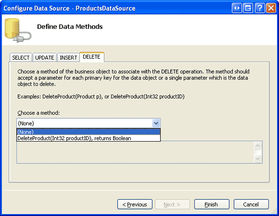
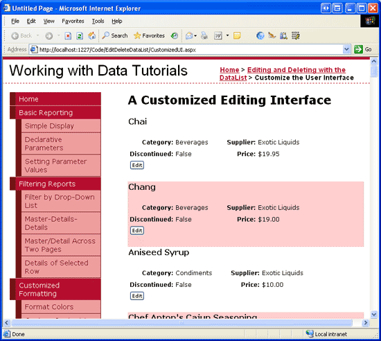
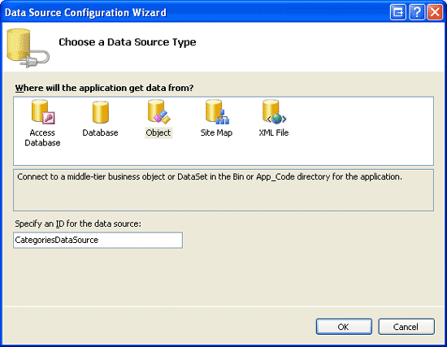
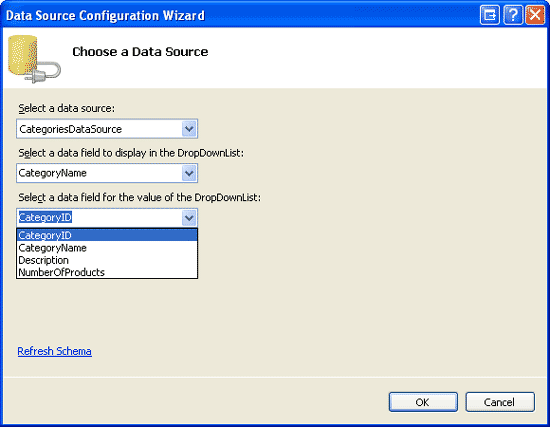
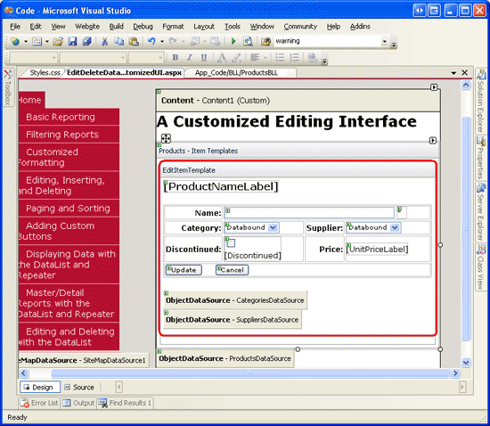
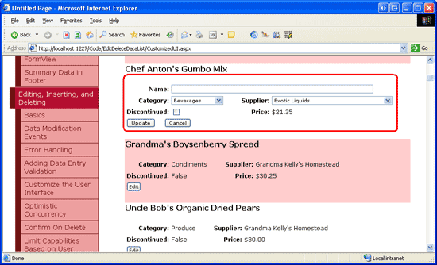
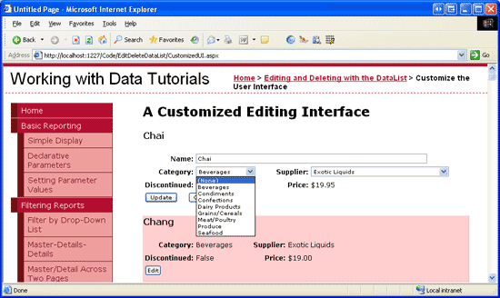

Customizing the DataList's Editing Interface (C#)
====================
by [Scott Mitchell](https://twitter.com/ScottOnWriting)

[Download Sample App](http://download.microsoft.com/download/9/c/1/9c1d03ee-29ba-4d58-aa1a-f201dcc822ea/ASPNET_Data_Tutorial_40_CS.exe) or [Download PDF](customizing-the-datalist-s-editing-interface-cs/_static/datatutorial40cs1.pdf)

> In this tutorial we will create a richer editing interface for the DataList, one that includes DropDownLists and a CheckBox.

## Introduction

The markup and Web controls in the DataList s `EditItemTemplate` define its editable interface. In all of the editable DataList examples we ve examined thus far, the editable interface has been composed of TextBox Web controls. In the [preceding tutorial](adding-validation-controls-to-the-datalist-s-editing-interface-cs.md) we improved the edit-time user experience by adding validation controls.

The `EditItemTemplate` can be further expanded to include Web controls other than the TextBox, such as DropDownLists, RadioButtonLists, Calendars, and so on. As with TextBoxes, when customizing the editing interface to include other Web controls, employ the following steps:

1. Add the Web control to the `EditItemTemplate`.
2. Use databinding syntax to assign the corresponding data field value to the appropriate property.
3. In the `UpdateCommand` event handler, programmatically access the Web control value and pass it into the appropriate BLL method.

In this tutorial we will create a richer editing interface for the DataList, one that includes DropDownLists and a CheckBox. In particular, we'll create a DataList that lists product information and permits the product s name, supplier, category, and discontinued status to be updated (see Figure 1).

**Figure 1**: The Editing Interface Includes a TextBox, Two DropDownLists, and a CheckBox ([Click to view full-size image](customizing-the-datalist-s-editing-interface-cs/_static/image3.png))

## Step 1: Displaying Product Information

Before we can create the DataList s editable interface, we first need to build the read-only interface. Start by opening the `CustomizedUI.aspx` page from the `EditDeleteDataList` folder and, from the Designer, add a DataList to the page, setting its `ID` property to `Products`. From the DataList s smart tag, create a new ObjectDataSource. Name this new ObjectDataSource `ProductsDataSource` and configure it to retrieve data from the `ProductsBLL` class s `GetProducts` method. As with the previous editable DataList tutorials, we'll update the edited product s information by going directly to the Business Logic Layer. Accordingly, set the drop-down lists in the UPDATE, INSERT, and DELETE tabs to (None).

**Figure 2**: Set the UPDATE, INSERT, and DELETE Tabs Drop-Down Lists to (None) ([Click to view full-size image](customizing-the-datalist-s-editing-interface-cs/_static/image6.png))

After configuring the ObjectDataSource, Visual Studio will create a default `ItemTemplate` for the DataList that lists the name and value for each of the data fields returned. Modify the `ItemTemplate` so that the template lists the product name in an `<h4>` element along with the category name, supplier name, price, and discontinued status. Moreover, add an Edit button, making sure that its `CommandName` property is set to Edit. The declarative markup for my `ItemTemplate` follows:

[!code-aspx[Main](customizing-the-datalist-s-editing-interface-cs/samples/sample1.aspx)]

The above markup lays out the product information using an &lt;h4&gt; heading for the product s name and a four-column `<table>` for the remaining fields. The `ProductPropertyLabel` and `ProductPropertyValue` CSS classes, defined in `Styles.css`, have been discussed in previous tutorials. Figure 3 shows our progress when viewed through a browser.

**Figure 3**: The Name, Supplier, Category, Discontinued Status, and Price of Each Product is Displayed ([Click to view full-size image](customizing-the-datalist-s-editing-interface-cs/_static/image9.png))

## Step 2: Adding the Web Controls to the Editing Interface

The first step in building the customized DataList editing interface is to add the needed Web controls to the `EditItemTemplate`. In particular, we need a DropDownList for the category, another for the supplier, and a CheckBox for the discontinued state. Since the product s price is not editable in this example, we can continue displaying it using a Label Web control.

To customize the editing interface, click on the Edit Templates link from the DataList s smart tag and choose the `EditItemTemplate` option from the drop-down list. Add a DropDownList to the `EditItemTemplate` and set its `ID` to `Categories`.

**Figure 4**: Add a DropDownList for the Categories ([Click to view full-size image](customizing-the-datalist-s-editing-interface-cs/_static/image12.png))

Next, from the DropDownList s smart tag, select the Choose Data Source option and create a new ObjectDataSource named `CategoriesDataSource`. Configure this ObjectDataSource to use the `CategoriesBLL` class s `GetCategories()` method (see Figure 5). Next, the DropDownList s Data Source Configuration Wizard prompts for the data fields to use for each `ListItem` s `Text` and `Value` properties. Have the DropDownList display the `CategoryName` data field and use the `CategoryID` as the value, as shown in Figure 6.

**Figure 5**: Create a New ObjectDataSource Named `CategoriesDataSource` ([Click to view full-size image](customizing-the-datalist-s-editing-interface-cs/_static/image15.png))

**Figure 6**: Configure the DropDownList s Display and Value Fields ([Click to view full-size image](customizing-the-datalist-s-editing-interface-cs/_static/image18.png))

Repeat this series of steps to create a DropDownList for the suppliers. Set the `ID` for this DropDownList to `Suppliers` and name its ObjectDataSource `SuppliersDataSource`.

After adding the two DropDownLists, add a CheckBox for the discontinued state and a TextBox for the product s name. Set the `ID` s for the CheckBox and TextBox to `Discontinued` and `ProductName`, respectively. Add a RequiredFieldValidator to ensure that the user provides a value for the product s name.

Lastly, add the Update and Cancel buttons. Remember that for these two buttons it is imperative that their `CommandName` properties are set to Update and Cancel, respectively.

Feel free to lay out the editing interface however you like. I ve opted to use the same four-column `<table>` layout from the read-only interface, as the following declarative syntax and screen shot illustrates:

[!code-aspx[Main](customizing-the-datalist-s-editing-interface-cs/samples/sample2.aspx)]

**Figure 7**: The Editing Interface is Laid Out like the Read-Only Interface ([Click to view full-size image](customizing-the-datalist-s-editing-interface-cs/_static/image21.png))

## Step 3: Creating the EditCommand and CancelCommand Event Handlers

Currently, there is no databinding syntax in the `EditItemTemplate` (except for the `UnitPriceLabel`, which was copied over verbatim from the `ItemTemplate`). We'll add the databinding syntax momentarily, but first let s create the event handlers for the DataList s `EditCommand` and `CancelCommand` events. Recall that the responsibility of the `EditCommand` event handler is to render the editing interface for the DataList item whose Edit button was clicked, whereas the `CancelCommand` s job is to return the DataList to its pre-editing state.

Create these two event handlers and have them use the following code:

[!code-csharp[Main](customizing-the-datalist-s-editing-interface-cs/samples/sample3.cs)]

With these two event handlers in place, clicking the Edit button displays the editing interface and clicking the Cancel button returns the edited item to its read-only mode. Figure 8 shows the DataList after the Edit button has been clicked for Chef Anton s Gumbo Mix. Since we ve yet to add any databinding syntax to the editing interface, the `ProductName` TextBox is blank, the `Discontinued` CheckBox unchecked, and the first items selected from the `Categories` and `Suppliers` DropDownLists.

**Figure 8**: Clicking the Edit Button Displays the Editing Interface ([Click to view full-size image](customizing-the-datalist-s-editing-interface-cs/_static/image24.png))

## Step 4: Adding the DataBinding Syntax to the Editing Interface

To have the editing interface display the current product s values, we need to use databinding syntax to assign the data field values to the appropriate Web control values. The databinding syntax can be applied through the Designer by going to the Edit Templates screen and selecting the Edit DataBindings link from the Web controls smart tags. Alternatively, the databinding syntax can be added directly to the declarative markup.

Assign the `ProductName` data field value to the `ProductName` TextBox s `Text` property, the `CategoryID` and `SupplierID` data field values to the `Categories` and `Suppliers` DropDownLists `SelectedValue` properties, and the `Discontinued` data field value to the `Discontinued` CheckBox s `Checked` property. After making these changes, either through the Designer or directly through the declarative markup, revisit the page through a browser and click the Edit button for Chef Anton s Gumbo Mix. As Figure 9 shows, the databinding syntax has added the current values into the TextBox, DropDownLists, and CheckBox.

**Figure 9**: Clicking the Edit Button Displays the Editing Interface ([Click to view full-size image](customizing-the-datalist-s-editing-interface-cs/_static/image27.png))

## Step 5: Saving the User s Changes in the UpdateCommand Event Handler

When the user edits a product and clicks the Update button, a postback occurs and the DataList s `UpdateCommand` event fires. In the event handler, we need to read the values from the Web controls in the `EditItemTemplate` and interface with the BLL to update the product in the database. As we ve seen in previous tutorials, the `ProductID` of the updated product is accessible through the `DataKeys` collection. The user-entered fields are accessed by programmatically referencing the Web controls using `FindControl("controlID")`, as the following code shows:

[!code-csharp[Main](customizing-the-datalist-s-editing-interface-cs/samples/sample4.cs)]

The code starts out by consulting the `Page.IsValid` property to ensure that all the validation controls on the page are valid. If `Page.IsValid` is `True`, the edited product s `ProductID` value is read from the `DataKeys` collection and the data entry Web controls in the `EditItemTemplate` are programmatically referenced. Next, the values from these Web controls are read into variables that are then passed into the appropriate `UpdateProduct` overload. After updating the data, the DataList is returned to its pre-editing state.

> [!NOTE]
> I ve omitted the exception handling logic added in the [Handling BLL- and DAL-Level Exceptions](handling-bll-and-dal-level-exceptions-cs.md) tutorial in order to keep the code and this example focused. As an exercise, add this functionality after completing this tutorial.

## Step 6: Handling NULL CategoryID and SupplierID Values

The Northwind database allows for `NULL` values for the `Products` table s `CategoryID` and `SupplierID` columns. However, our editing interface doesn t currently accommodate `NULL` values. If we attempt to edit a product that has a `NULL` value for either its `CategoryID` or `SupplierID` columns, we'll get an `ArgumentOutOfRangeException` with an error message similar to: *'Categories' has a SelectedValue which is invalid because it does not exist in the list of items.* Also, there s currently no way to change a product s category or supplier value from a non-`NULL` value to a `NULL` one.

To support `NULL` values for the category and supplier DropDownLists, we need to add an additional `ListItem`. I ve chosen to use (None) as the `Text` value for this `ListItem`, but you can change it to something else (such as an empty string) if you d like. Finally, remember to set the DropDownLists `AppendDataBoundItems` to `True`; if you forget to do so, the categories and suppliers bound to the DropDownList will overwrite the statically-added `ListItem`.

After making these changes, the DropDownLists markup in the DataList s `EditItemTemplate` should look similar to the following:

[!code-aspx[Main](customizing-the-datalist-s-editing-interface-cs/samples/sample5.aspx)]

> [!NOTE]
> Static `ListItem` s can be added to a DropDownList through the Designer or directly through the declarative syntax. When adding a DropDownList item to represent a database `NULL` value, be sure to add the `ListItem` through the declarative syntax. If you use the `ListItem` Collection Editor in the Designer, the generated declarative syntax will omit the `Value` setting altogether when assigned a blank string, creating declarative markup like: `<asp:ListItem>(None)</asp:ListItem>`. While this may look harmless, the missing `Value` causes the DropDownList to use the `Text` property value in its place. That means that if this `NULL` `ListItem` is selected, the value (None) will be attempted to be assigned to the product data field (`CategoryID` or `SupplierID`, in this tutorial), which will result in an exception. By explicitly setting `Value=""`, a `NULL` value will be assigned to the product data field when the `NULL` `ListItem` is selected.

Take a moment to view our progress through a browser. When editing a product, note that the `Categories` and `Suppliers` DropDownLists both have a (None) option at the start of the DropDownList.

**Figure 10**: The `Categories` and `Suppliers` DropDownLists include a (None) Option ([Click to view full-size image](customizing-the-datalist-s-editing-interface-cs/_static/image30.png))

To save the (None) option as a database `NULL` value, we need to return to the `UpdateCommand` event handler. Change the `categoryIDValue` and `supplierIDValue` variables to be nullable integers and assign them a value other than `Nothing` only if the DropDownList s `SelectedValue` is not an empty string:

[!code-csharp[Main](customizing-the-datalist-s-editing-interface-cs/samples/sample6.cs)]

With this change, a value of `Nothing` will be passed into the `UpdateProduct` BLL method if the user selected the (None) option from either of the drop-down lists, which corresponds to a `NULL` database value.

## Summary

In this tutorial we saw how to create a more complex DataList editing interface that included three different input Web controls a TextBox, two DropDownLists, and a CheckBox along with validation controls. When building the editing interface, the steps are the same regardless of the Web controls being used: start by adding the Web controls to the DataList s `EditItemTemplate`; use databinding syntax to assign the corresponding data field values with the appropriate Web control properties; and, in the `UpdateCommand` event handler, programmatically access the Web controls and their appropriate properties, passing their values into the BLL.

When creating an editing interface, whether it s composed of just TextBoxes or a collection of different Web controls, be sure to correctly handle database `NULL` values. When accounting for `NULL` s, it is imperative that you not only correctly display an existing `NULL` value in the editing interface, but also that you offer a means for marking a value as `NULL`. For DropDownLists in DataLists, that typically means adding a static `ListItem` whose `Value` property is explicitly set to an empty string (`Value=""`), and adding a bit of code to the `UpdateCommand` event handler to determine whether or not the `NULL``ListItem` was selected.

Happy Programming!

## About the Author

[Scott Mitchell](http://www.4guysfromrolla.com/ScottMitchell.shtml), author of seven ASP/ASP.NET books and founder of [4GuysFromRolla.com](http://www.4guysfromrolla.com), has been working with Microsoft Web technologies since 1998. Scott works as an independent consultant, trainer, and writer. His latest book is [*Sams Teach Yourself ASP.NET 2.0 in 24 Hours*](https://www.amazon.com/exec/obidos/ASIN/0672327384/4guysfromrollaco). He can be reached at [mitchell@4GuysFromRolla.com.](mailto:mitchell@4GuysFromRolla.com) or via his blog, which can be found at [http://ScottOnWriting.NET](http://ScottOnWriting.NET).

## Special Thanks To

This tutorial series was reviewed by many helpful reviewers. Lead reviewers for this tutorial were Dennis Patterson, David Suru, and Randy Schmidt. Interested in reviewing my upcoming MSDN articles? If so, drop me a line at [mitchell@4GuysFromRolla.com.](mailto:mitchell@4GuysFromRolla.com)

>[!div class="step-by-step"]
[Previous](adding-validation-controls-to-the-datalist-s-editing-interface-cs.md)
[Next](an-overview-of-editing-and-deleting-data-in-the-datalist-vb.md)