Adding Validation Controls to the Editing and Inserting Interfaces (VB)
====================
by [Scott Mitchell](https://twitter.com/ScottOnWriting)

[Download Sample App](http://download.microsoft.com/download/9/c/1/9c1d03ee-29ba-4d58-aa1a-f201dcc822ea/ASPNET_Data_Tutorial_19_VB.exe) or [Download PDF](adding-validation-controls-to-the-editing-and-inserting-interfaces-vb/_static/datatutorial19vb1.pdf)

> In this tutorial we'll see how easy it is to add validation controls to the EditItemTemplate and InsertItemTemplate of a data Web control, to provide a more foolproof user interface.

## Introduction

The GridView and DetailsView controls in the examples we've explored over the past three tutorials have all been composed of BoundFields and CheckBoxFields (the field types automatically added by Visual Studio when binding a GridView or DetailsView to a data source control through the smart tag). When editing a row in a GridView or DetailsView, those BoundFields that are not read-only are converted into textboxes, from which the end user can modify the existing data. Similarly, when inserting a new record into a DetailsView control, those BoundFields whose `InsertVisible` property is set to `True` (the default) are rendered as empty textboxes, into which the user can provide the new record's field values. Likewise, CheckBoxFields, which are disabled in the standard, read-only interface, are converted into enabled checkboxes in the editing and inserting interfaces.

While the default editing and inserting interfaces for the BoundField and CheckBoxField can be helpful, the interface lacks any sort of validation. If a user makes a data entry mistake - such as omitting the `ProductName` field or entering an invalid value for `UnitsInStock` (such as -50) an exception will be raised from within the depths of the application architecture. While this exception can be gracefully handled as demonstrated in the [previous tutorial](handling-bll-and-dal-level-exceptions-in-an-asp-net-page-vb.md), ideally the editing or inserting user interface would include validation controls to prevent a user from entering such invalid data in the first place.

In order to provide a customized editing or inserting interface, we need to replace the BoundField or CheckBoxField with a TemplateField. TemplateFields, which were the topic of discussion in the [Using TemplateFields in the GridView Control](../custom-formatting/using-templatefields-in-the-gridview-control-cs.md) and [Using TemplateFields in the DetailsView Control](../custom-formatting/using-templatefields-in-the-detailsview-control-vb.md) tutorials, can consist of multiple templates defining separate interfaces for different row states. The TemplateField's `ItemTemplate` is used to when rendering read-only fields or rows in the DetailsView or GridView controls, whereas the `EditItemTemplate` and `InsertItemTemplate` indicate the interfaces to use for the editing and inserting modes, respectively.

In this tutorial we'll see how easy it is to add validation controls to the TemplateField's `EditItemTemplate` and `InsertItemTemplate` to provide a more foolproof user interface. Specifically, this tutorial takes the example created in the [Examining the Events Associated with Inserting, Updating, and Deleting](examining-the-events-associated-with-inserting-updating-and-deleting-vb.md) tutorial and augments the editing and inserting interfaces to include appropriate validation.

## Step 1: Replicating the Example from[Examining the Events Associated with Inserting, Updating, and Deleting](examining-the-events-associated-with-inserting-updating-and-deleting-vb.md)

In the [Examining the Events Associated with Inserting, Updating, and Deleting](examining-the-events-associated-with-inserting-updating-and-deleting-vb.md) tutorial we created a page that listed the names and prices of the products in an editable GridView. Additionally, the page included a DetailsView whose `DefaultMode` property was set to `Insert`, thereby always rendering in insert mode. From this DetailsView, the user could enter the name and price for a new product, click Insert, and have it added to the system (see Figure 1).

**Figure 1**: The Previous Example Allows Users to Add New Products and Edit Existing Ones ([Click to view full-size image](adding-validation-controls-to-the-editing-and-inserting-interfaces-vb/_static/image3.png))

Our goal for this tutorial is to augment the DetailsView and GridView to provide validation controls. In particular, our validation logic will:

- Require that the name be provided when inserting or editing a product
- Require that the price be provided when inserting a record; when editing a record, we will still require a price, but will use the programmatic logic in the GridView's `RowUpdating` event handler already present from the earlier tutorial
- Ensure that the value entered for the price is a valid currency format

Before we can look at augmenting the previous example to include validation, we first need to replicate the example from the `DataModificationEvents.aspx` page to the page for this tutorial, `UIValidation.aspx`. To accomplish this we need to copy over both the `DataModificationEvents.aspx` page's declarative markup and its source code. First copy over the declarative markup by performing the following steps:

1. Open the `DataModificationEvents.aspx` page in Visual Studio
2. Go to the page's declarative markup (click on the Source button at the bottom of the page)
3. Copy the text within the `<asp:Content>` and `</asp:Content>` tags (lines 3 through 44), as shown in Figure 2.

[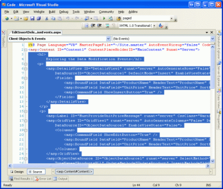](adding-validation-controls-to-the-editing-and-inserting-interfaces-vb/_static/image4.png)

**Figure 2**: Copy the Text Within the `<asp:Content>` Control ([Click to view full-size image](adding-validation-controls-to-the-editing-and-inserting-interfaces-vb/_static/image6.png))

1. Open the `UIValidation.aspx` page
2. Go to the page's declarative markup
3. Paste the text within the `<asp:Content>` control.

To copy over the source code, open the `DataModificationEvents.aspx.vb` page and copy just the text *within* the `EditInsertDelete_DataModificationEvents` class. Copy the three event handlers (`Page_Load`, `GridView1_RowUpdating`, and `ObjectDataSource1_Inserting`), but do **not** copy the class declaration. Paste the copied text *within* the `EditInsertDelete_UIValidation` class in `UIValidation.aspx.vb`.

After moving over the content and code from `DataModificationEvents.aspx` to `UIValidation.aspx`, take a moment to test out your progress in a browser. You should see the same output and experience the same functionality in each of these two pages (refer back to Figure 1 for a screen shot of `DataModificationEvents.aspx` in action).

## Step 2: Converting the BoundFields Into TemplateFields

To add validation controls to the editing and inserting interfaces, the BoundFields used by the DetailsView and GridView controls need to be converted into TemplateFields. To achieve this, click on the Edit Columns and Edit Fields links in the GridView and DetailsView's smart tags, respectively. There, select each of the BoundFields and click the "Convert this field into a TemplateField" link.

[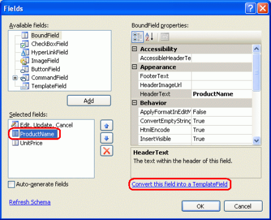](adding-validation-controls-to-the-editing-and-inserting-interfaces-vb/_static/image7.png)

**Figure 3**: Convert Each of the DetailsView's and GridView's BoundFields Into TemplateFields ([Click to view full-size image](adding-validation-controls-to-the-editing-and-inserting-interfaces-vb/_static/image9.png))

Converting a BoundField into a TemplateField through the Fields dialog box generates a TemplateField that exhibits the same read-only, editing, and inserting interfaces as the BoundField itself. The following markup shows the declarative syntax for the `ProductName` field in the DetailsView after it has been converted into a TemplateField:

[!code-aspx[Main](adding-validation-controls-to-the-editing-and-inserting-interfaces-vb/samples/sample1.aspx)]

Note that this TemplateField had three templates automatically created `ItemTemplate`, `EditItemTemplate`, and `InsertItemTemplate`. The `ItemTemplate` displays a single data field value (`ProductName`) using a Label Web control, while the `EditItemTemplate` and `InsertItemTemplate` present the data field value in a TextBox Web control that associates the data field with the TextBox's `Text` property using two-way databinding. Since we are only using the DetailsView in this page for inserting, you may remove the `ItemTemplate` and `EditItemTemplate` from the two TemplateFields, although there's no harm in leaving them.

Since the GridView does not support the built-in inserting features of the DetailsView, converting the GridView's `ProductName` field into a TemplateField results in only an `ItemTemplate` and `EditItemTemplate`:

[!code-aspx[Main](adding-validation-controls-to-the-editing-and-inserting-interfaces-vb/samples/sample2.aspx)]

By clicking the "Convert this field into a TemplateField," Visual Studio has created a TemplateField whose templates mimic the user interface of the converted BoundField. You can verify this by visiting this page through a browser. You'll find that the appearance and behavior of the TemplateFields is identical to the experience when BoundFields were used instead.

> [!NOTE]
> Feel free to customize the editing interfaces in the templates as needed. For example, we may want to have the TextBox in the `UnitPrice` TemplateFields rendered as a smaller textbox than the `ProductName` textbox. To accomplish this you can set the TextBox's `Columns` property to an appropriate value or provide an absolute width via the `Width` property. In the next tutorial we'll see how to completely customize the editing interface by replacing the TextBox with an alternate data entry Web control.

## Step 3: Adding the Validation Controls to the GridView's`EditItemTemplate` s

When constructing data entry forms, it is important that users enter any required fields and that all provided inputs are legal, properly-formatted values. To help ensure that a user's inputs are valid, ASP.NET provides five built-in validation controls that are designed to be used to validate the value of a single input control:

- [RequiredFieldValidator](https://msdn.microsoft.com/en-us/library/5hbw267h(VS.80).aspx) ensures that a value has been provided
- [CompareValidator](https://msdn.microsoft.com/en-us/library/db330ayw(VS.80).aspx) validates a value against another Web control value or a constant value, or ensures that the value's format is legal for a specified data type
- [RangeValidator](https://msdn.microsoft.com/en-us/library/f70d09xt.aspx) ensures that a value is within a range of values
- [RegularExpressionValidator](https://msdn.microsoft.com/en-US/library/eahwtc9e.aspx) validates a value against a [regular expression](http://en.wikipedia.org/wiki/Regular_expression)
- [CustomValidator](https://msdn.microsoft.com/en-us/library/9eee01cx(VS.80).aspx) validates a value against a custom, user-defined method

For more information on these five controls, check out the [Validation Controls section](https://quickstarts.asp.net/quickstartv20/aspnet/doc/ctrlref/validation/default.aspx) of the [ASP.NET Quickstart Tutorials](https://asp.net/QuickStart/aspnet/).

For our tutorial we'll need to use a RequiredFieldValidator in both the DetailsView and GridView's `ProductName` TemplateFields and a RequiredFieldValidator in the DetailsView's `UnitPrice` TemplateField. Furthermore, we'll need to add a CompareValidator to both controls' `UnitPrice` TemplateFields that ensures that the entered price has a value greater than or equal to 0 and is presented in a valid currency format.

> [!NOTE]
> While ASP.NET 1.x had these same five validation controls, ASP.NET 2.0 has added a number of improvements, the main two being client-side script support for browsers other than Internet Explorer and the ability to partition validation controls on a page into validation groups. For more information on the new validation control features in 2.0, refer to [Dissecting the Validation Controls in ASP.NET 2.0](http://aspnet.4guysfromrolla.com/articles/112305-1.aspx).

Let's start by adding the necessary validation controls to the `EditItemTemplate` s in the GridView's TemplateFields. To accomplish this, click on the Edit Templates link from the GridView's smart tag to bring up the template editing interface. From here, you can select which template to edit from the drop-down list. Since we want to augment the editing interface, we need to add validation controls to the `ProductName` and `UnitPrice`'s `EditItemTemplate` s.

[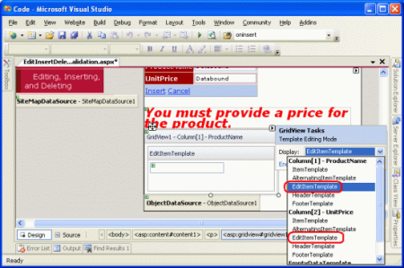](adding-validation-controls-to-the-editing-and-inserting-interfaces-vb/_static/image10.png)

**Figure 4**: We Need to Extend the `ProductName` and `UnitPrice`'s `EditItemTemplate` s ([Click to view full-size image](adding-validation-controls-to-the-editing-and-inserting-interfaces-vb/_static/image12.png))

In the `ProductName` `EditItemTemplate`, add a RequiredFieldValidator by dragging it from the Toolbox into the template editing interface, placing after the TextBox.

[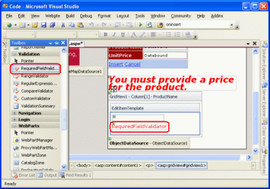](adding-validation-controls-to-the-editing-and-inserting-interfaces-vb/_static/image13.png)

**Figure 5**: Add a RequiredFieldValidator to the `ProductName` `EditItemTemplate` ([Click to view full-size image](adding-validation-controls-to-the-editing-and-inserting-interfaces-vb/_static/image15.png))

All validation controls work by validating the input of a single ASP.NET Web control. Therefore, we need to indicate that the RequiredFieldValidator we just added should validate against the TextBox in the `EditItemTemplate`; this is accomplished by setting the validation control's [ControlToValidate property](https://msdn.microsoft.com/en-US/library/system.web.ui.webcontrols.basevalidator.controltovalidate(VS.80).aspx) to the `ID` of the appropriate Web control. The TextBox currently has the rather nondescript `ID` of `TextBox1`, but let's change it to something more appropriate. Click on the TextBox in the template and then, from the Properties window, change the `ID` from `TextBox1` to `EditProductName`.

**Figure 6**: Change the TextBox's `ID` to `EditProductName` ([Click to view full-size image](adding-validation-controls-to-the-editing-and-inserting-interfaces-vb/_static/image18.png))

Next, set the RequiredFieldValidator's `ControlToValidate` property to `EditProductName`. Finally, set the [ErrorMessage property](https://msdn.microsoft.com/en-US/library/system.web.ui.webcontrols.basevalidator.errormessage(VS.80).aspx) to "You must provide the product's name" and the [Text property](https://msdn.microsoft.com/en-US/library/system.web.ui.webcontrols.basevalidator.text(VS.80).aspx) to "\*". The `Text` property value, if provided, is the text that is displayed by the validation control if the validation fails. The `ErrorMessage` property value, which is required, is used by the ValidationSummary control; if the `Text` property value is omitted, the `ErrorMessage` property value is also the text displayed by the validation control on invalid input.

After setting these three properties of the RequiredFieldValidator, your screen should look similar to Figure 7.

[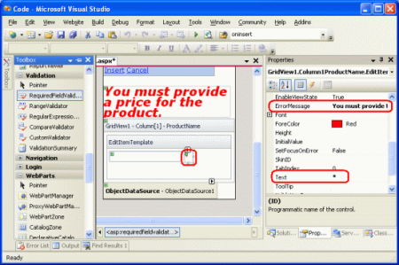](adding-validation-controls-to-the-editing-and-inserting-interfaces-vb/_static/image19.png)

**Figure 7**: Set the RequiredFieldValidator's `ControlToValidate`, `ErrorMessage`, and `Text` Properties ([Click to view full-size image](adding-validation-controls-to-the-editing-and-inserting-interfaces-vb/_static/image21.png))

With the RequiredFieldValidator added to the `ProductName` `EditItemTemplate`, all that remains is to add the necessary validation to the `UnitPrice` `EditItemTemplate`. Since we've decided that, for this page, the `UnitPrice` is optional when editing a record, we don't need to add a RequiredFieldValidator. We do, however, need to add a CompareValidator to ensure that the `UnitPrice`, if supplied, is properly formatted as a currency and is greater than or equal to 0.

Before we add the CompareValidator to the `UnitPrice` `EditItemTemplate`, let's first change the TextBox Web control's ID from `TextBox2` to `EditUnitPrice`. After making this change, add the CompareValidator, setting its `ControlToValidate` property to `EditUnitPrice`, its `ErrorMessage` property to "The price must be greater than or equal to zero and cannot include the currency symbol", and its `Text` property to "\*".

To indicate that the `UnitPrice` value must be greater than or equal to 0, set the CompareValidator's [Operator property](https://msdn.microsoft.com/en-us/library/system.web.ui.webcontrols.comparevalidator.operator(VS.80).aspx) to `GreaterThanEqual`, its [ValueToCompare property](https://msdn.microsoft.com/en-US/library/system.web.ui.webcontrols.comparevalidator.valuetocompare(VS.80).aspx) to "0", and its [Type property](https://msdn.microsoft.com/en-US/library/system.web.ui.webcontrols.basecomparevalidator.type.aspx) to `Currency`. The following declarative syntax shows the `UnitPrice` TemplateField's `EditItemTemplate` after these changes have been made:

[!code-aspx[Main](adding-validation-controls-to-the-editing-and-inserting-interfaces-vb/samples/sample3.aspx)]

After making these changes, open the page in a browser. If you attempt to omit the name or enter an invalid price value when editing a product, an asterisk appears next to the textbox. As Figure 8 shows, a price value that includes the currency symbol such as $19.95 is considered invalid. The CompareValidator's `Currency` `Type` allows for digit separators (such as commas or periods, depending on the culture settings) and a leading plus or minus sign, but does *not* permit a currency symbol. This behavior may perplex users as the editing interface currently renders the `UnitPrice` using the currency format.

> [!NOTE]
> Recall that in the *Events Associated with Inserting, Updating, and Deleting* tutorial we set the BoundField's `DataFormatString` property to `{0:c}` in order to format it as a currency. Furthermore, we set the `ApplyFormatInEditMode` property to true, causing the GridView's editing interface to format the `UnitPrice` as a currency. When converting the BoundField into a TemplateField, Visual Studio noted these settings and formatted the TextBox's `Text` property as a currency using the databinding syntax `<%# Bind("UnitPrice", "{0:c}") %>`.

[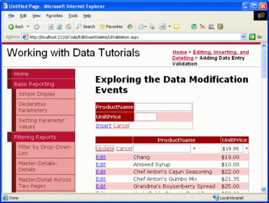](adding-validation-controls-to-the-editing-and-inserting-interfaces-vb/_static/image22.png)

**Figure 8**: An Asterisk Appears Next to the Textboxes with Invalid Input ([Click to view full-size image](adding-validation-controls-to-the-editing-and-inserting-interfaces-vb/_static/image24.png))

While the validation works as-is, the user has to manually remove the currency symbol when editing a record, which is not acceptable. To remedy this, we have three options:

1. Configure the `EditItemTemplate` so that the `UnitPrice` value is not formatted as a currency.
2. Allow the user to enter a currency symbol by removing the CompareValidator and replacing it with a RegularExpressionValidator that properly checks for a properly formatted currency value. The problem here is that the regular expression to validate a currency value is not pretty and would require writing code if we wanted to incorporate culture settings.
3. Remove the validation control altogether and rely on server-side validation logic in the GridView's `RowUpdating` event handler.

Let's go with option #1 for this exercise. Currently the `UnitPrice` is formatted as a currency due to the databinding expression for the TextBox in the `EditItemTemplate`: `<%# Bind("UnitPrice", "{0:c}") %>`. Change the Bind statement to `Bind("UnitPrice", "{0:n2}")`, which formats the result as a number with two digits of precision. This can be done directly through the declarative syntax or by clicking on the Edit DataBindings link from the `EditUnitPrice` TextBox in the `UnitPrice` TemplateField's `EditItemTemplate` (see Figures 9 and 10).

[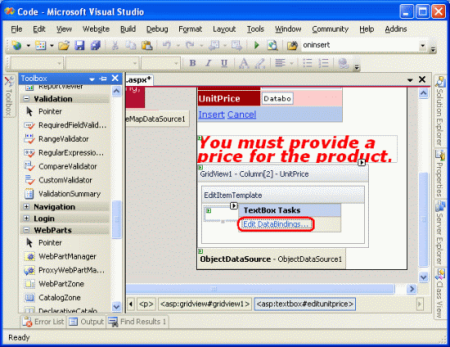](adding-validation-controls-to-the-editing-and-inserting-interfaces-vb/_static/image25.png)

**Figure 9**: Click on the TextBox's Edit DataBindings link ([Click to view full-size image](adding-validation-controls-to-the-editing-and-inserting-interfaces-vb/_static/image27.png))

**Figure 10**: Specify the Format Specifier in the `Bind` Statement ([Click to view full-size image](adding-validation-controls-to-the-editing-and-inserting-interfaces-vb/_static/image30.png))

With this change, the formatted price in the editing interface includes commas as the group separator and a period as the decimal separator, but leaves off the currency symbol.

> [!NOTE]
> The `UnitPrice` `EditItemTemplate` doesn't include a RequiredFieldValidator, allowing the postback to ensue and the updating logic to commence. However, the `RowUpdating` event handler copied over from the *Examining the Events Associated with Inserting, Updating, and Deleting* tutorial includes a programmatic check that ensures that the `UnitPrice` is provided. Feel free to remove this logic, leave it in as-is, or add a RequiredFieldValidator to the `UnitPrice` `EditItemTemplate`.

## Step 4: Summarizing Data Entry Problems

In addition to the five validation controls, ASP.NET includes the [ValidationSummary control](https://msdn.microsoft.com/en-US/library/f9h59855(VS.80).aspx), which displays the `ErrorMessage` s of those validation controls that detected invalid data. This summary data can be displayed as text on the web page or through a modal, client-side messagebox. Let's enhance this tutorial to include a client-side messagebox summarizing any validation problems.

To accomplish this, drag a ValidationSummary control from the Toolbox onto the Designer. The location of the Validation control doesn't really matter, since we're going to configure it to only display the summary as a messagebox. After adding the control, set its [ShowSummary property](https://msdn.microsoft.com/en-US/library/system.web.ui.webcontrols.validationsummary.showsummary(VS.80).aspx) to `False` and its [ShowMessageBox property](https://msdn.microsoft.com/en-US/library/system.web.ui.webcontrols.validationsummary.showmessagebox(VS.80).aspx) to `True`. With this addition, any validation errors are summarized in a client-side messagebox.

[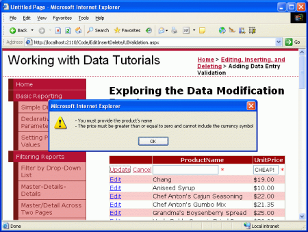](adding-validation-controls-to-the-editing-and-inserting-interfaces-vb/_static/image31.png)

**Figure 11**: The Validation Errors are Summarized in a Client-Side Messagebox ([Click to view full-size image](adding-validation-controls-to-the-editing-and-inserting-interfaces-vb/_static/image33.png))

## Step 5: Adding the Validation Controls to the DetailsView's`InsertItemTemplate`

All that remains for this tutorial is to add the validation controls to the DetailsView's inserting interface. The process of adding validation controls to the DetailsView's templates is identical to that examined in Step 3; therefore, we'll breeze through the task in this step. As we did with the GridView's `EditItemTemplate` s, I encourage you to rename the `ID` s of the TextBoxes from the nondescript `TextBox1` and `TextBox2` to `InsertProductName` and `InsertUnitPrice`.

Add a RequiredFieldValidator to the `ProductName` `InsertItemTemplate`. Set the `ControlToValidate` to the `ID` of the TextBox in the template, its `Text` property to "\*" and its `ErrorMessage` property to "You must provide the product's name".

Since the `UnitPrice` is required for this page when adding a new record, add a RequiredFieldValidator to the `UnitPrice` `InsertItemTemplate`, setting its `ControlToValidate`, `Text`, and `ErrorMessage` properties appropriately. Finally, add a CompareValidator to the `UnitPrice` `InsertItemTemplate` as well, configuring its `ControlToValidate`, `Text`, `ErrorMessage`, `Type`, `Operator`, and `ValueToCompare` properties just like we did with the `UnitPrice`'s CompareValidator in the GridView's `EditItemTemplate`.

After adding these validation controls, a new product cannot be added to the system if its name is not supplied or if its price is a negative number or illegally formatted.

[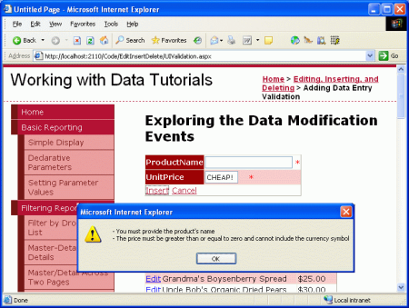](adding-validation-controls-to-the-editing-and-inserting-interfaces-vb/_static/image34.png)

**Figure 12**: Validation Logic has been Added to the DetailsView's Inserting Interface ([Click to view full-size image](adding-validation-controls-to-the-editing-and-inserting-interfaces-vb/_static/image36.png))

## Step 6: Partitioning the Validation Controls Into Validation Groups

Our page consists of two logically disparate sets of validation controls: those that correspond to the GridView's editing interface and those that correspond to the DetailsView's inserting interface. By default, when a postback occurs *all* validation controls on the page are checked. However, when editing a record we don't want the DetailsView's inserting interface's validation controls to validate. Figure 13 illustrates our current dilemma when a user is editing a product with perfectly legal values, clicking Update causes a validation error because the name and price values in the inserting interface are blank.

[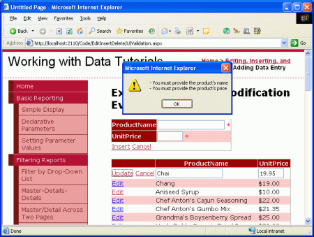](adding-validation-controls-to-the-editing-and-inserting-interfaces-vb/_static/image37.png)

**Figure 13**: Updating a Product Causes the Inserting Interface's Validation Controls to Fire ([Click to view full-size image](adding-validation-controls-to-the-editing-and-inserting-interfaces-vb/_static/image39.png))

The validation controls in ASP.NET 2.0 can be partitioned into validation groups through their `ValidationGroup` property. To associate a set of validation controls in a group, simply set their `ValidationGroup` property to the same value. For our tutorial, set the `ValidationGroup` properties of the validation controls in the GridView's TemplateFields to `EditValidationControls` and the `ValidationGroup` properties of the DetailsView's TemplateFields to `InsertValidationControls`. These changes can be done directly in the declarative markup or through the Properties window when using the Designer's edit template interface.

In addition to the validation controls, the Button and Button-related controls in ASP.NET 2.0 also include a `ValidationGroup` property. A validation group's validators are checked for validity only when a postback is induced by a Button that has the same `ValidationGroup` property setting. For example, in order for the DetailsView's Insert button to trigger the `InsertValidationControls` validation group we need to set the CommandField's `ValidationGroup` property to `InsertValidationControls` (see Figure 14). Additionally, set the GridView's CommandField's `ValidationGroup` property to `EditValidationControls`.

[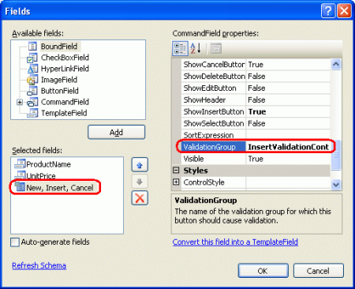](adding-validation-controls-to-the-editing-and-inserting-interfaces-vb/_static/image40.png)

**Figure 14**: Set the DetailsView's CommandField's `ValidationGroup` property to `InsertValidationControls` ([Click to view full-size image](adding-validation-controls-to-the-editing-and-inserting-interfaces-vb/_static/image42.png))

After these changes, the DetailsView and GridView's TemplateFields and CommandFields should look similar to the following:

The DetailsView's TemplateFields and CommandField

[!code-aspx[Main](adding-validation-controls-to-the-editing-and-inserting-interfaces-vb/samples/sample4.aspx)]

The GridView's CommandField and TemplateFields

[!code-aspx[Main](adding-validation-controls-to-the-editing-and-inserting-interfaces-vb/samples/sample5.aspx)]

At this point the edit-specific validation controls fire only when the GridView's Update button is clicked and the insert-specific validation controls fire only when the DetailsView's Insert button is clicked, resolving the problem highlighted by Figure 13. However, with this change our ValidationSummary control no longer displays when entering invalid data. The ValidationSummary control also contains a `ValidationGroup` property and only shows summary information for those validation controls in its validation group. Therefore, we need to have two validation controls in this page, one for the `InsertValidationControls` validation group and one for `EditValidationControls`.

[!code-aspx[Main](adding-validation-controls-to-the-editing-and-inserting-interfaces-vb/samples/sample6.aspx)]

With this addition our tutorial is complete!

## Summary

While BoundFields can provide both an inserting and editing interface, the interface is not customizable. Commonly, we want to add validation controls to the editing and inserting interface to ensure that the user enters required inputs in a legal format. To accomplish this we must convert the BoundFields into TemplateFields and add the validation controls to the appropriate template(s). In this tutorial we extended the example from the *Examining the Events Associated with Inserting, Updating, and Deleting* tutorial, adding validation controls to both the DetailsView's inserting interface and the GridView's editing interface. Moreover, we saw how to display summary validation information using the ValidationSummary control and how to partition the validation controls on the page into distinct validation groups.

As we saw in this tutorial, TemplateFields allow the editing and inserting interfaces to be augmented to include validation controls. TemplateFields can also be extended to include additional input Web controls, enabling the TextBox to be replaced by a more suitable Web control. In our next tutorial we'll see how to replace the TextBox control with a data-bound DropDownList control, which is ideal when editing a foreign key (such as `CategoryID` or `SupplierID` in the `Products` table).

Happy Programming!

## About the Author

[Scott Mitchell](http://www.4guysfromrolla.com/ScottMitchell.shtml), author of seven ASP/ASP.NET books and founder of [4GuysFromRolla.com](http://www.4guysfromrolla.com), has been working with Microsoft Web technologies since 1998. Scott works as an independent consultant, trainer, and writer. His latest book is [*Sams Teach Yourself ASP.NET 2.0 in 24 Hours*](https://www.amazon.com/exec/obidos/ASIN/0672327384/4guysfromrollaco). He can be reached at [mitchell@4GuysFromRolla.com.](mailto:mitchell@4GuysFromRolla.com) or via his blog, which can be found at [http://ScottOnWriting.NET](http://ScottOnWriting.NET).

## Special Thanks To

This tutorial series was reviewed by many helpful reviewers. Lead reviewers for this tutorial were Liz Shulok and Zack Jones. Interested in reviewing my upcoming MSDN articles? If so, drop me a line at [mitchell@4GuysFromRolla.com.](mailto:mitchell@4GuysFromRolla.com)

>[!div class="step-by-step"]
[Previous](handling-bll-and-dal-level-exceptions-in-an-asp-net-page-vb.md)
[Next](customizing-the-data-modification-interface-vb.md)