An Overview of Inserting, Updating, and Deleting Data (VB)
====================
by [Scott Mitchell](https://twitter.com/ScottOnWriting)

[Download Sample App](http://download.microsoft.com/download/9/c/1/9c1d03ee-29ba-4d58-aa1a-f201dcc822ea/ASPNET_Data_Tutorial_16_VB.exe) or [Download PDF](an-overview-of-inserting-updating-and-deleting-data-vb/_static/datatutorial16vb1.pdf)

> In this tutorial we'll see how to map an ObjectDataSource's Insert(), Update(), and Delete() methods to the methods of BLL classes, as well as how to configure the GridView, DetailsView, and FormView controls to provide data modification capabilities.

## Introduction

Over the past several tutorials we've examined how to display data in an ASP.NET page using the GridView, DetailsView, and FormView controls. These controls simply work with data supplied to them. Commonly, these controls access data through the use of a data source control, such as the ObjectDataSource. We've seen how the ObjectDataSource acts as a proxy between the ASP.NET page and the underlying data. When a GridView needs to display data, it invokes its ObjectDataSource's `Select()` method, which in turn invokes a method from our Business Logic Layer (BLL), which calls a method in the appropriate Data Access Layer's (DAL) TableAdapter, which in turn sends a `SELECT` query to the Northwind database.

Recall that when we created the TableAdapters in the DAL in [our first tutorial](../introduction/creating-a-data-access-layer-cs.md), Visual Studio automatically added methods for inserting, updating, and deleting data from the underlying database table. Moreover, in [Creating a Business Logic Layer](../introduction/creating-a-business-logic-layer-vb.md) we designed methods in the BLL that called down into these data modification DAL methods.

In addition to its `Select()` method, the ObjectDataSource also has `Insert()`, `Update()`, and `Delete()` methods. Like the `Select()` method, these three methods can be mapped to methods in an underlying object. When configured to insert, update, or delete data, the GridView, DetailsView, and FormView controls provide a user interface for modifying the underlying data. This user interface calls the `Insert()`, `Update()`, and `Delete()` methods of the ObjectDataSource, which then invoke the underlying object's associated methods (see Figure 1).

**Figure 1**: The ObjectDataSource's `Insert()`, `Update()`, and `Delete()` Methods Serve as a Proxy into the BLL ([Click to view full-size image](an-overview-of-inserting-updating-and-deleting-data-vb/_static/image3.png))

In this tutorial we'll see how to map the ObjectDataSource's `Insert()`, `Update()`, and `Delete()` methods to methods of classes in the BLL, as well as how to configure the GridView, DetailsView, and FormView controls to provide data modification capabilities.

## Step 1: Creating the Insert, Update, and Delete Tutorials Web Pages

Before we start exploring how to insert, update, and delete data, let's first take a moment to create the ASP.NET pages in our website project that we'll need for this tutorial and the next several ones. Start by adding a new folder named `EditInsertDelete`. Next, add the following ASP.NET pages to that folder, making sure to associate each page with the `Site.master` master page:

- `Default.aspx`
- `Basics.aspx`
- `DataModificationEvents.aspx`
- `ErrorHandling.aspx`
- `UIValidation.aspx`
- `CustomizedUI.aspx`
- `OptimisticConcurrency.aspx`
- `ConfirmationOnDelete.aspx`
- `UserLevelAccess.aspx`

**Figure 2**: Add the ASP.NET Pages for the Data Modification-Related Tutorials

Like in the other folders, `Default.aspx` in the `EditInsertDelete` folder will list the tutorials in its section. Recall that the `SectionLevelTutorialListing.ascx` User Control provides this functionality. Therefore, add this User Control to `Default.aspx` by dragging it from the Solution Explorer onto the page's Design view.

[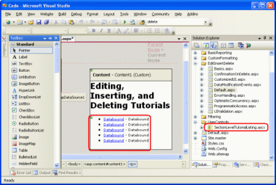](an-overview-of-inserting-updating-and-deleting-data-vb/_static/image5.png)

**Figure 3**: Add the `SectionLevelTutorialListing.ascx` User Control to `Default.aspx` ([Click to view full-size image](an-overview-of-inserting-updating-and-deleting-data-vb/_static/image7.png))

Lastly, add the pages as entries to the `Web.sitemap` file. Specifically, add the following markup after the Customized Formatting `<siteMapNode>`:

[!code-xml[Main](an-overview-of-inserting-updating-and-deleting-data-vb/samples/sample1.xml)]

After updating `Web.sitemap`, take a moment to view the tutorials website through a browser. The menu on the left now includes items for the editing, inserting, and deleting tutorials.

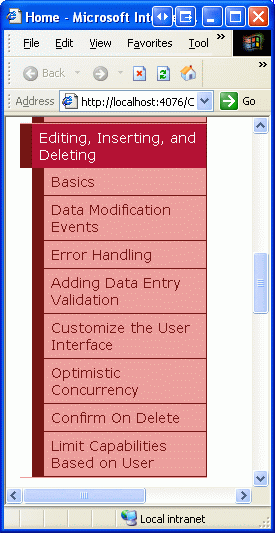

**Figure 4**: The Site Map Now Includes Entries for the Editing, Inserting, and Deleting Tutorials

## Step 2: Adding and Configuring the ObjectDataSource Control

Since the GridView, DetailsView, and FormView each differ in their data modification capabilities and layout, let's examine each one individually. Rather than have each control using its own ObjectDataSource, however, let's just create a single ObjectDataSource that all three control examples can share.

Open the `Basics.aspx` page, drag an ObjectDataSource from the Toolbox onto the Designer, and click the Configure Data Source link from its smart tag. Since the `ProductsBLL` is the only BLL class that provides editing, inserting, and deleting methods, configure the ObjectDataSource to use this class.

[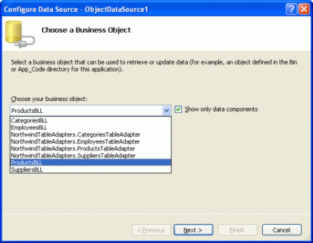](an-overview-of-inserting-updating-and-deleting-data-vb/_static/image9.png)

**Figure 5**: Configure the ObjectDataSource to Use the `ProductsBLL` Class ([Click to view full-size image](an-overview-of-inserting-updating-and-deleting-data-vb/_static/image11.png))

In the next screen we can specify what methods of the `ProductsBLL` class are mapped to the ObjectDataSource's `Select()`, `Insert()`, `Update()`, and `Delete()` by selecting the appropriate tab and choosing the method from the drop-down list. Figure 6, which should look familiar by now, maps the ObjectDataSource's `Select()` method to the `ProductsBLL` class's `GetProducts()` method. The `Insert()`, `Update()`, and `Delete()` methods can be configured by selecting the appropriate tab from the list along the top.

[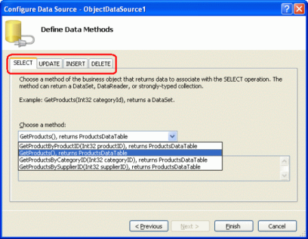](an-overview-of-inserting-updating-and-deleting-data-vb/_static/image12.png)

**Figure 6**: Have the ObjectDataSource Return All of the Products ([Click to view full-size image](an-overview-of-inserting-updating-and-deleting-data-vb/_static/image14.png))

Figures 7, 8, and 9 show the ObjectDataSource's UPDATE, INSERT, and DELETE tabs. Configure these tabs so that the `Insert()`, `Update()`, and `Delete()` methods invoke the `ProductsBLL` class's `UpdateProduct`, `AddProduct`, and `DeleteProduct` methods, respectively.

**Figure 7**: Map the ObjectDataSource's `Update()` Method to the `ProductBLL` Class's `UpdateProduct` Method ([Click to view full-size image](an-overview-of-inserting-updating-and-deleting-data-vb/_static/image17.png))

[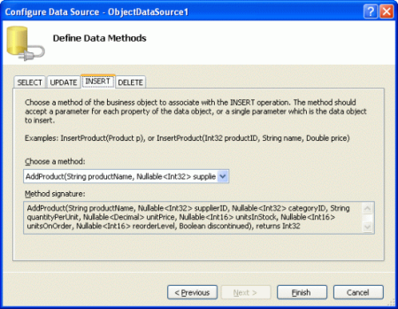](an-overview-of-inserting-updating-and-deleting-data-vb/_static/image18.png)

**Figure 8**: Map the ObjectDataSource's `Insert()` Method to the `ProductBLL` Class's Add `Product` Method ([Click to view full-size image](an-overview-of-inserting-updating-and-deleting-data-vb/_static/image20.png))

**Figure 9**: Map the ObjectDataSource's `Delete()` Method to the `ProductBLL` Class's `DeleteProduct` Method ([Click to view full-size image](an-overview-of-inserting-updating-and-deleting-data-vb/_static/image23.png))

You may have noticed that the drop-down lists in the UPDATE, INSERT, and DELETE tabs already had these methods selected. This is thanks to our use of the `DataObjectMethodAttribute` that decorates the methods of `ProducstBLL`. For example, the DeleteProduct method has the following signature:

[!code-vb[Main](an-overview-of-inserting-updating-and-deleting-data-vb/samples/sample2.vb)]

The `DataObjectMethodAttribute` attribute indicates the purpose of each method whether it is for selecting, inserting, updating, or deleting and whether or not it's the default value. If you omitted these attributes when creating your BLL classes, you'll need to manually select the methods from the UPDATE, INSERT, and DELETE tabs.

After ensuring that the appropriate `ProductsBLL` methods are mapped to the ObjectDataSource's `Insert()`, `Update()`, and `Delete()` methods, click Finish to complete the wizard.

## Examining the ObjectDataSource's Markup

After configuring the ObjectDataSource through its wizard, go to the Source view to examine the generated declarative markup. The `<asp:ObjectDataSource>` tag specifies the underlying object and the methods to invoke. Additionally, there are `DeleteParameters`, `UpdateParameters`, and `InsertParameters` that map to the input parameters for the `ProductsBLL` class's `AddProduct`, `UpdateProduct`, and `DeleteProduct` methods:

[!code-aspx[Main](an-overview-of-inserting-updating-and-deleting-data-vb/samples/sample3.aspx)]

The ObjectDataSource includes a parameter for each of the input parameters for its associated methods, just like a list of `SelectParameter` s is present when the ObjectDataSource is configured to call a select method that expects an input parameter (such as `GetProductsByCategoryID(categoryID)`). As we'll see shortly, values for these `DeleteParameters`, `UpdateParameters`, and `InsertParameters` are set automatically by the GridView, DetailsView, and FormView prior to invoking the ObjectDataSource's `Insert()`, `Update()`, or `Delete()` method. These values can also be set programmatically as needed, as we'll discuss in a future tutorial.

One side effect of using the wizard to configure to ObjectDataSource is that Visual Studio sets the [OldValuesParameterFormatString property](https://msdn.microsoft.com/en-US/library/system.web.ui.webcontrols.objectdatasource.oldvaluesparameterformatstring(VS.80).aspx) to `original_{0}`. This property value is used to include the original values of the data being edited and is useful in two scenarios:

- If, when editing a record, users are able to change the primary key value. In this case, both the new primary key value and the original primary key value must be provided so that the record with the original primary key value can be found and have its value updated accordingly.
- When using optimistic concurrency. Optimistic concurrency is a technique to ensure that two simultaneous users don't overwrite one another's changes, and is the topic for a future tutorial.

The `OldValuesParameterFormatString` property indicates the name of the input parameters in the underlying object's update and delete methods for the original values. We'll discuss this property and its purpose in greater detail when we explore optimistic concurrency. I bring it up now, however, because our BLL's methods do not expect the original values and therefore it's important that we remove this property. Leaving the `OldValuesParameterFormatString` property set to anything other than the default (`{0}`) will cause an error when a data Web control attempts to invoke the ObjectDataSource's `Update()` or `Delete()` methods because the ObjectDataSource will attempt to pass in both the `UpdateParameters` or `DeleteParameters` specified as well as original value parameters.

If this isn't terribly clear at this juncture, don't worry, we'll examine this property and its utility in a future tutorial. For now, just be certain to either remove this property declaration entirely from the declarative syntax or set the value to the default value ({0}).

> [!NOTE]
> If you simply clear out the `OldValuesParameterFormatString` property value from the Properties window in the Design view, the property will still exist in the declarative syntax, but be set to an empty string. This, unfortunately, will still result in the same problem discussed above. Therefore, either remove the property altogether from the declarative syntax or, from the Properties window, set the value to the default, `{0}`.

## Step 3: Adding a Data Web Control and Configuring It for Data Modification

Once the ObjectDataSource has been added to the page and configured, we're ready to add data Web controls to the page to both display the data and provide a means for the end user to modify it. We'll look at the GridView, DetailsView, and FormView separately, as these data Web controls differ in their data modification capabilities and configuration.

As we'll see in the remainder of this article, adding very basic editing, inserting, and deleting support through the GridView, DetailsView, and FormView controls is really as simple as checking a couple of checkboxes. There are many subtleties and edge cases in the real-world that make providing such functionality more involved than just point and click. This tutorial, however, focuses solely on proving simplistic data modification capabilities. Future tutorials will examine concerns that will undoubtedly arise in a real-world setting.

## Deleting Data from the GridView

Start by dragging a GridView from the Toolbox onto the Designer. Next, bind the ObjectDataSource to the GridView by selecting it from the drop-down list in the GridView's smart tag. At this point the GridView's declarative markup will be:

[!code-aspx[Main](an-overview-of-inserting-updating-and-deleting-data-vb/samples/sample4.aspx)]

Binding the GridView to the ObjectDataSource through its smart tag has two benefits:

- BoundFields and CheckBoxFields are automatically created for each of the fields returned by the ObjectDataSource. Moreover, the BoundField and CheckBoxField's properties are set based on the underlying field's metadata. For example, the `ProductID`, `CategoryName`, and `SupplierName` fields are marked as read-only in the `ProductsDataTable` and therefore shouldn't be updatable when editing. To accommodate this, these BoundFields' [ReadOnly properties](https://msdn.microsoft.com/en-us/library/system.web.ui.webcontrols.boundfield.readonly(VS.80).aspx) are set to `True`.
- The [DataKeyNames property](https://msdn.microsoft.com/en-us/library/system.web.ui.webcontrols.gridview.datakeynames(VS.80).aspx) is assigned to the primary key field(s) of the underlying object. This is essential when using the GridView for editing or deleting data, as this property indicates the field (or set of fields) that unique identifies each record. For more information on the `DataKeyNames` property, refer back to the [Master/Detail Using a Selectable Master GridView with a Details DetailView](../masterdetail/master-detail-using-a-selectable-master-gridview-with-a-details-detailview-cs.md) tutorial.

While the GridView can be bound to the ObjectDataSource through the Properties window or declarative syntax, doing so requires you to manually add the appropriate BoundField and `DataKeyNames` markup.

The GridView control provides built-in support for row-level editing and deleting. Configuring a GridView to support deleting adds a column of Delete buttons. When the end user clicks the Delete button for a particular row, a postback ensues and the GridView performs the following steps:

1. The ObjectDataSource's `DeleteParameters` value(s) are assigned
2. The ObjectDataSource's `Delete()` method is invoked, deleting the specified record
3. The GridView rebinds itself to the ObjectDataSource by invoking its `Select()` method

The values assigned to the `DeleteParameters` are the values of the `DataKeyNames` field(s) for the row whose Delete button was clicked. Therefore it's vital that a GridView's `DataKeyNames` property be correctly set. If it's missing, the `DeleteParameters` will be assigned a value of `Nothing` in Step 1, which in turn will not result in any deleted records in Step 2.

> [!NOTE]
> The `DataKeys` collection is stored in the GridView s control state, meaning that the `DataKeys` values will be remembered across postback even if the GridView s view state has been disabled. However, it is very important that view state remains enabled for GridViews that support editing or deleting (the default behavior). If you set the GridView s `EnableViewState` property to `false`, the editing and deleting behavior will work fine for a single user, but if there are concurrent users deleting data, there exists the possibility that these concurrent users may accidentally delete or edit records that they didn t intend. See my blog entry, [WARNING: Concurrency Issue with ASP.NET 2.0 GridViews/DetailsView/FormViews that Support Editing and/or Deleting and Whose View State is Disabled](http://scottonwriting.net/sowblog/posts/10054.aspx), for more information.

This same warning also applies to DetailsViews and FormViews.

To add deleting capabilities to a GridView, simply go to its smart tag and check the Enable Deleting checkbox.

**Figure 10**: Check the Enable Deleting Checkbox

Checking the Enable Deleting checkbox from the smart tag adds a CommandField to the GridView. The CommandField renders a column in the GridView with buttons for performing one or more of the following tasks: selecting a record, editing a record, and deleting a record. We previously saw the CommandField in action with selecting records in the [Master/Detail Using a Selectable Master GridView with a Details DetailView](../masterdetail/master-detail-using-a-selectable-master-gridview-with-a-details-detailview-cs.md) tutorial.

The CommandField contains a number of `ShowXButton` properties that indicate what series of buttons are displayed in the CommandField. By checking the Enable Deleting checkbox a CommandField whose `ShowDeleteButton` property is `True` has been added to the GridView's Columns collection.

[!code-aspx[Main](an-overview-of-inserting-updating-and-deleting-data-vb/samples/sample5.aspx)]

At this point, believe it or not, we're done with adding deleting support to the GridView! As Figure 11 shows, when visiting this page through a browser a column of Delete buttons is present.

[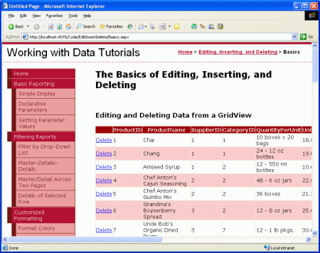](an-overview-of-inserting-updating-and-deleting-data-vb/_static/image25.png)

**Figure 11**: The CommandField Adds a Column of Delete Buttons ([Click to view full-size image](an-overview-of-inserting-updating-and-deleting-data-vb/_static/image27.png))

If you've been building this tutorial from the ground up on your own, when testing this page clicking the Delete button will raise an exception. Continue reading to learn as to why these exceptions were raised and how to fix them.

> [!NOTE]
> If you're following along using the download accompanying this tutorial, these problems have already been accounted for. However, I encourage you to read through the details listed below to help identify problems that may arise and suitable workarounds.

If, when attempting to delete a product, you get an exception whose message is similar to "*ObjectDataSource 'ObjectDataSource1' could not find a non-generic method 'DeleteProduct' that has parameters: productID, original\_ProductID*," you likely forgot to remove the `OldValuesParameterFormatString` property from the ObjectDataSource. With the `OldValuesParameterFormatString` property specified, the ObjectDataSource attempts to pass in both `productID` and `original_ProductID` input parameters to the `DeleteProduct` method. `DeleteProduct`, however, only accepts a single input parameter, hence the exception. Removing the `OldValuesParameterFormatString` property (or setting it to `{0}`) instructs the ObjectDataSource to not attempt to pass in the original input parameter.

[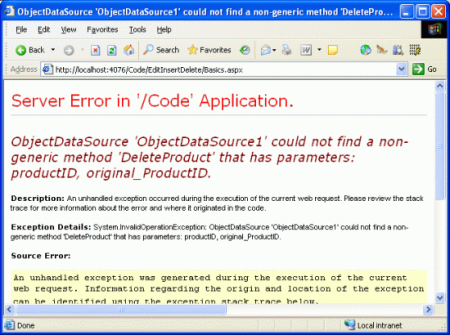](an-overview-of-inserting-updating-and-deleting-data-vb/_static/image28.png)

**Figure 12**: Ensure That the `OldValuesParameterFormatString` Property Has Been Cleared Out ([Click to view full-size image](an-overview-of-inserting-updating-and-deleting-data-vb/_static/image30.png))

Even if you had removed the `OldValuesParameterFormatString` property, you still will get an exception when trying to delete a product with the message: "*The DELETE statement conflicted with the REFERENCE constraint 'FK\_Order\_Details\_Products'*." The Northwind database contains a foreign key constraint between the `Order Details` and `Products` table, meaning that a product cannot be deleted from the system if there are one or more records for it in the `Order Details` table. Since every product in the Northwind database has at least one record in `Order Details`, we cannot delete any products until we first delete the product's associated order details records.

[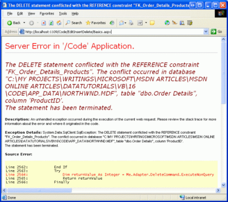](an-overview-of-inserting-updating-and-deleting-data-vb/_static/image31.png)

**Figure 13**: A Foreign Key Constraint Prohibits the Deletion of Products ([Click to view full-size image](an-overview-of-inserting-updating-and-deleting-data-vb/_static/image33.png))

For our tutorial, let's just delete all of the records from the `Order Details` table. In a real-world application we'd need to either:

- Have another screen to manage order details information
- Augment the `DeleteProduct` method to include logic to delete the specified product's order details
- Modify the SQL query used by the TableAdapter to include deletion of the specified product's order details

Let's just delete all of the records from the `Order Details` table to circumvent the foreign key constraint. Go to the Server Explorer in Visual Studio, right-click on the `NORTHWND.MDF` node, and choose New Query. Then, in the query window, run the following SQL statement: `DELETE FROM [Order Details]`

[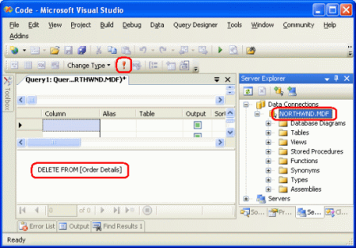](an-overview-of-inserting-updating-and-deleting-data-vb/_static/image34.png)

**Figure 14**: Delete All Records from the `Order Details` Table ([Click to view full-size image](an-overview-of-inserting-updating-and-deleting-data-vb/_static/image36.png))

After clearing out the `Order Details` table clicking on the Delete button will delete the product without error. If clicking on the Delete button does not delete the product, check to ensure that the GridView's `DataKeyNames` property is set to the primary key field (`ProductID`).

> [!NOTE]
> When clicking on the Delete button a postback ensues and the record is deleted. This can be dangerous since it is easy to accidentally click on the wrong row's Delete button. In a future tutorial we'll see how to add a client-side confirmation when deleting a record.

## Editing Data with the GridView

Along with deleting, the GridView control also provides built-in row-level editing support. Configuring a GridView to support editing adds a column of Edit buttons. From the end user's perspective, clicking a row's Edit button causes that row to become editable, turning the cells into textboxes containing the existing values and replacing the Edit button with Update and Cancel buttons. After making their desired changes, the end user can click the Update button to commit the changes or the Cancel button to discard them. In either case, after clicking Update or Cancel the GridView returns to its pre-editing state.

From our perspective as the page developer, when the end user clicks the Edit button for a particular row, a postback ensues and the GridView performs the following steps:

1. The GridView's `EditItemIndex` property is assigned to the index of the row whose Edit button was clicked
2. The GridView rebinds itself to the ObjectDataSource by invoking its `Select()` method
3. The row index that matches the `EditItemIndex` is rendered in "edit mode." In this mode, the Edit button is replaced by Update and Cancel buttons and BoundFields whose `ReadOnly` properties are False (the default) are rendered as TextBox Web controls whose `Text` properties are assigned to the data fields' values.

At this point the markup is returned to the browser, allowing the end user to make any changes to the row's data. When the user clicks the Update button, a postback occurs and the GridView performs the following steps:

1. The ObjectDataSource's `UpdateParameters` value(s) are assigned the values entered by the end user into the GridView's editing interface
2. The ObjectDataSource's `Update()` method is invoked, updating the specified record
3. The GridView rebinds itself to the ObjectDataSource by invoking its `Select()` method

The primary key values assigned to the `UpdateParameters` in Step 1 come from the values specified in the `DataKeyNames` property, whereas the non-primary key values come from the text in the TextBox Web controls for the edited row. As with deleting, it is vital that a GridView's `DataKeyNames` property be correctly set. If it's missing, the `UpdateParameters` primary key value will be assigned a value of `Nothing` in Step 1, which in turn will not result in any updated records in Step 2.

Editing functionality can be activated by simply checking the Enable Editing checkbox in the GridView's smart tag.

**Figure 15**: Check the Enable Editing Checkbox

Checking the Enable Editing checkbox will add a CommandField (if needed) and set its `ShowEditButton` property to `True`. As we saw earlier, the CommandField contains a number of `ShowXButton` properties that indicate what series of buttons are displayed in the CommandField. Checking the Enable Editing checkbox adds the `ShowEditButton` property to the existing CommandField:

[!code-aspx[Main](an-overview-of-inserting-updating-and-deleting-data-vb/samples/sample6.aspx)]

That's all there is to adding rudimentary editing support. As Figure16 shows, the editing interface is rather crude each BoundField whose `ReadOnly` property is set to `False` (the default) is rendered as a TextBox. This includes fields like `CategoryID` and `SupplierID`, which are keys to other tables.

[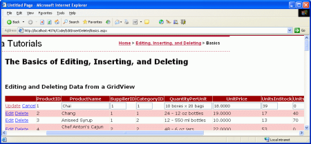](an-overview-of-inserting-updating-and-deleting-data-vb/_static/image38.png)

**Figure 16**: Clicking Chai s Edit Button Displays the Row in Edit Mode ([Click to view full-size image](an-overview-of-inserting-updating-and-deleting-data-vb/_static/image40.png))

In addition to asking users to edit foreign key values directly, the editing interface's interface is lacking in the following ways:

- If the user enters a `CategoryID` or `SupplierID` that does not exist in the database, the `UPDATE` will violate a foreign key constraint, causing an exception to be raised.
- The editing interface doesn't include any validation. If you don't provide a required value (such as `ProductName`), or enter a string value where a numeric value is expected (such as entering "Too much!" into the `UnitPrice` textbox), an exception will be thrown. A future tutorial will examine how to add validation controls to the editing user interface.
- Currently, *all* product fields that are not read-only must be included in the GridView. If we were to remove a field from the GridView, say `UnitPrice`, when updating the data the GridView would not set the `UnitPrice` `UpdateParameters` value, which would change the database record's `UnitPrice` to a `NULL` value. Similarly, if a required field, such as `ProductName`, is removed from the GridView, the update will fail with the same "*Column 'ProductName' does not allow nulls*" exception mentioned above.
- The editing interface formatting leaves a lot to be desired. The `UnitPrice` is shown with four decimal points. Ideally the `CategoryID` and `SupplierID` values would contain DropDownLists that list the categories and suppliers in the system.

These are all shortcomings that we'll have to live with for now, but will be addressed in future tutorials.

## Inserting, Editing, and Deleting Data with the DetailsView

As we've seen in earlier tutorials, the DetailsView control displays one record at a time and, like the GridView, allows for editing and deleting of the currently displayed record. Both the end user's experience with editing and deleting items from a DetailsView and the workflow from the ASP.NET side is identical to that of the GridView. Where the DetailsView differs from the GridView is that it also provides built-in inserting support.

To demonstrate the data modification capabilities of the GridView, start by adding a DetailsView to the `Basics.aspx` page above the existing GridView and bind it to the existing ObjectDataSource through the DetailsView's smart tag. Next, clear out the DetailsView's `Height` and `Width` properties, and check the Enable Paging option from the smart tag. To enable editing, inserting, and deleting support, simply check the Enable Editing, Enable Inserting, and Enable Deleting checkboxes in the smart tag.

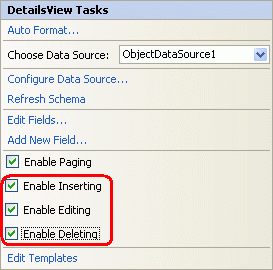

**Figure 17**: Configure the DetailsView to Support Editing, Inserting, and Deleting

As with the GridView, adding editing, inserting, or deleting support adds a CommandField to the DetailsView, as the following declarative syntax shows:

[!code-aspx[Main](an-overview-of-inserting-updating-and-deleting-data-vb/samples/sample7.aspx)]

Note that for the DetailsView the CommandField appears at the end of the Columns collection by default. Since the DetailsView's fields are rendered as rows, the CommandField appears as a row with Insert, Edit, and Delete buttons at the bottom of the DetailsView.

**Figure 18**: Configure the DetailsView to Support Editing, Inserting, and Deleting ([Click to view full-size image](an-overview-of-inserting-updating-and-deleting-data-vb/_static/image44.png))

Clicking on the Delete button starts the same sequence of events as with the GridView: a postback; followed by the DetailsView populating its ObjectDataSource's `DeleteParameters` based on the `DataKeyNames` values; and completed with a call its ObjectDataSource's `Delete()` method, which actually removes the product from the database. Editing in the DetailsView also works in a fashion identical to that of the GridView.

For inserting, the end user is presented with a New button that, when clicked, renders the DetailsView in "insert mode." With "insert mode" the New button is replaced by Insert and Cancel buttons and only those BoundFields whose `InsertVisible` property is set to `True` (the default) are displayed. Those data fields identified as auto-increment fields, such as `ProductID`, have their [InsertVisible property](https://msdn.microsoft.com/en-us/library/system.web.ui.webcontrols.datacontrolfield.insertvisible(VS.80).aspx) set to `False` when binding the DetailsView to the data source through the smart tag.

When binding a data source to a DetailsView through the smart tag, Visual Studio sets the `InsertVisible` property to `False` only for auto-increment fields. Read-only fields, like `CategoryName` and `SupplierName`, will be displayed in the "insert mode" user interface unless their `InsertVisible` property is explicitly set to `False`. Take a moment to set these two fields' `InsertVisible` properties to `False`, either through the DetailsView's declarative syntax or through the Edit Fields link in the smart tag. Figure 19 shows setting the `InsertVisible` properties to `False` by clicking on the Edit Fields link.

**Figure 19**: Northwind Traders Now Offers Acme Tea ([Click to view full-size image](an-overview-of-inserting-updating-and-deleting-data-vb/_static/image47.png))

After setting the `InsertVisible` properties, view the `Basics.aspx` page in a browser and click the New button. Figure 20 shows the DetailsView when adding a new beverage, Acme Tea, to our product line.

[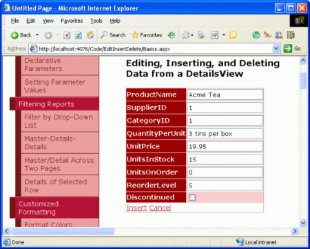](an-overview-of-inserting-updating-and-deleting-data-vb/_static/image48.png)

**Figure 20**: Northwind Traders Now Offers Acme Tea ([Click to view full-size image](an-overview-of-inserting-updating-and-deleting-data-vb/_static/image50.png))

After entering the details for Acme Tea and clicking the Insert button, a postback ensues and the new record is added to the `Products` database table. Since this DetailsView lists the products in order with which they exist in the database table, we must page to the last product in order to see the new product.

[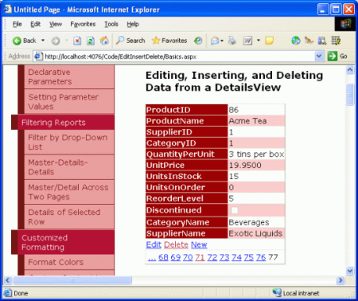](an-overview-of-inserting-updating-and-deleting-data-vb/_static/image51.png)

**Figure 21**: Details for Acme Tea ([Click to view full-size image](an-overview-of-inserting-updating-and-deleting-data-vb/_static/image53.png))

> [!NOTE]
> The DetailsView's [CurrentMode property](https://msdn.microsoft.com/en-us/library/system.web.ui.webcontrols.detailsview.currentmode(VS.80).aspx) indicates the interface being displayed and can be one of the following values: `Edit`, `Insert`, or `ReadOnly`. The [DefaultMode property](https://msdn.microsoft.com/en-us/library/system.web.ui.webcontrols.detailsview.defaultmode(VS.80).aspx) indicates the mode the DetailsView returns to after an edit or insert has been completed and is useful for displaying a DetailsView that is permanently in edit or insert mode.

The point and click inserting and editing capabilities of the DetailsView suffer from the same limitations as the GridView: the user must enter existing `CategoryID` and `SupplierID` values through a textbox; the interface lacks any validation logic; all product fields that do not allow `NULL` values or don't have a default value specified at the database level must be included in the inserting interface, and so on.

The techniques we will examine for extending and enhancing the GridView's editing interface in future articles can be applied to the DetailsView control's editing and inserting interfaces as well.

## Using the FormView for a More Flexible Data Modification User Interface

The FormView offers built-in support for inserting, editing, and deleting data, but because it uses templates instead of fields there's no place to add the BoundFields or the CommandField used by the GridView and DetailsView controls to provide the data modification interface. Instead, this interface the Web controls for collecting user input when adding a new item or editing an existing one along with the New, Edit, Delete, Insert, Update, and Cancel buttons must be added manually to the appropriate templates. Fortunately, Visual Studio will automatically create the needed interface when binding the FormView to a data source through the drop-down list in its smart tag.

To illustrate these techniques, start by adding a FormView to the `Basics.aspx` page and, from the FormView's smart tag, bind it to the ObjectDataSource already created. This will generate an `EditItemTemplate`, `InsertItemTemplate`, and `ItemTemplate` for the FormView with TextBox Web controls for collecting the user's input and Button Web controls for the New, Edit, Delete, Insert, Update, and Cancel buttons. Additionally, the FormView's `DataKeyNames` property is set to the primary key field (`ProductID`) of the object returned by the ObjectDataSource. Lastly, check the Enable Paging option in the FormView's smart tag.

The following shows the declarative markup for the FormView's `ItemTemplate` after the FormView has been bound to the ObjectDataSource. By default, each non-Boolean value product field is bound to the `Text` property of a Label Web control while each Boolean value field (`Discontinued`) is bound to the `Checked` property of a disabled CheckBox Web control. In order for the New, Edit, and Delete buttons to trigger certain FormView behavior when clicked, it is imperative that their `CommandName` values be set to `New`, `Edit`, and `Delete`, respectively.

[!code-aspx[Main](an-overview-of-inserting-updating-and-deleting-data-vb/samples/sample8.aspx)]

Figure 22 shows the FormView's `ItemTemplate` when viewed through a browser. Each product field is listed with the New, Edit, and Delete buttons at the bottom.

[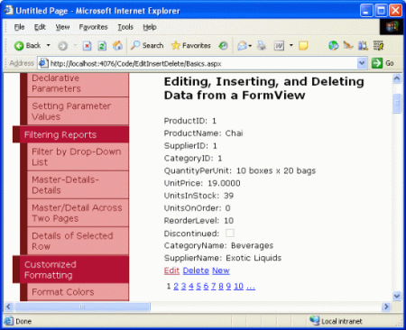](an-overview-of-inserting-updating-and-deleting-data-vb/_static/image54.png)

**Figure 22**: The Defaut FormView `ItemTemplate` Lists Each Product Field Along with New, Edit, and Delete Buttons ([Click to view full-size image](an-overview-of-inserting-updating-and-deleting-data-vb/_static/image56.png))

Like with the GridView and DetailsView, clicking the Delete button or any Button, LinkButton, or ImageButton whose `CommandName` property is set to Delete causes a postback, populates the ObjectDataSource's `DeleteParameters` based on the FormView's `DataKeyNames` value, and invokes the ObjectDataSource's `Delete()` method.

When the Edit button is clicked a postback ensues and the data is rebound to the `EditItemTemplate`, which is responsible for rendering the editing interface. This interface includes the Web controls for editing data along with the Update and Cancel buttons. The default `EditItemTemplate` generated by Visual Studio contains a Label for any auto-increment fields (`ProductID`), a TextBox for each non-Boolean value field, and a CheckBox for each Boolean value field. This behavior is very similar to the auto-generated BoundFields in the GridView and DetailsView controls.

> [!NOTE]
> One small issue with the FormView's auto-generation of the `EditItemTemplate` is that it renders TextBox Web controls for those fields that are read-only, such as `CategoryName` and `SupplierName`. We'll see how to account for this shortly.

The TextBox controls in the `EditItemTemplate` have their `Text` property bound to the value of their corresponding data field using *two-way databinding*. Two-way databinding, denoted by `<%# Bind("dataField") %>`, performs databinding both when binding data to the template and when populating the ObjectDataSource's parameters for inserting or editing records. That is, when the user clicks the Edit button from the `ItemTemplate`, the `Bind()` method returns the specified data field value. After the user makes their changes and clicks Update, the values posted back that correspond to the data fields specified using `Bind()` are applied to the ObjectDataSource's `UpdateParameters`. Alternatively, one-way databinding, denoted by `<%# Eval("dataField") %>`, only retrieves the data field values when binding data to the template and does *not* return the user-entered values to the data source's parameters on postback.

The following declarative markup shows the FormView's `EditItemTemplate`. Note that the `Bind()` method is used in the databinding syntax here and that the Update and Cancel Button Web controls have their `CommandName` properties set accordingly.

[!code-aspx[Main](an-overview-of-inserting-updating-and-deleting-data-vb/samples/sample9.aspx)]

Our `EditItemTemplate`, at this point, will cause an exception to be thrown if we attempt to use it. The problem is that the `CategoryName` and `SupplierName` fields are rendered as TextBox Web controls in the `EditItemTemplate`. We either need to change these TextBoxes to Labels or remove them altogether. Let's simply delete them entirely from the `EditItemTemplate`.

Figure 23 shows the FormView in a browser after the Edit button has been clicked for Chai. Note that the `SupplierName` and `CategoryName` fields shown in the `ItemTemplate` are no longer present, as we just removed them from the `EditItemTemplate`. When the Update button is clicked the FormView proceeds through the same sequence of steps as the GridView and DetailsView controls.

[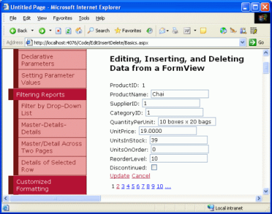](an-overview-of-inserting-updating-and-deleting-data-vb/_static/image57.png)

**Figure 23**: By Default the `EditItemTemplate` Shows Each Editable Product Field as a TextBox or CheckBox ([Click to view full-size image](an-overview-of-inserting-updating-and-deleting-data-vb/_static/image59.png))

When the Insert button is clicked the FormView's `ItemTemplate` a postback ensues. However, no data is bound to the FormView because a new record is being added. The `InsertItemTemplate` interface includes the Web controls for adding a new record along with the Insert and Cancel buttons. The default `InsertItemTemplate` generated by Visual Studio contains a TextBox for each non-Boolean value field and a CheckBox for each Boolean value field, similar to the auto-generated `EditItemTemplate`'s interface. The TextBox controls have their `Text` property bound to the value of their corresponding data field using two-way databinding.

The following declarative markup shows the FormView's `InsertItemTemplate`. Note that the `Bind()` method is used in the databinding syntax here and that the Insert and Cancel Button Web controls have their `CommandName` properties set accordingly.

[!code-aspx[Main](an-overview-of-inserting-updating-and-deleting-data-vb/samples/sample10.aspx)]

There's a subtlety with the FormView's auto-generation of the `InsertItemTemplate`. Specifically, the TextBox Web controls are created even for those fields that are read-only, such as `CategoryName` and `SupplierName`. Like with the `EditItemTemplate`, we need to remove these TextBoxes from the `InsertItemTemplate`.

Figure 24 shows the FormView in a browser when adding a new product, Acme Coffee. Note that the `SupplierName` and `CategoryName` fields shown in the `ItemTemplate` are no longer present, as we just removed them. When the Insert button is clicked the FormView proceeds through the same sequence of steps as the DetailsView control, adding a new record to the `Products` table. Figure 25 shows Acme Coffee product's details in the FormView after it has been inserted.

[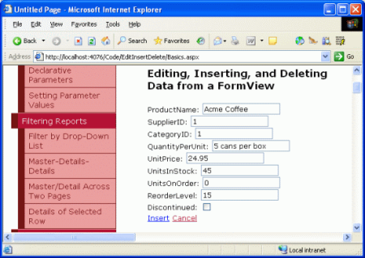](an-overview-of-inserting-updating-and-deleting-data-vb/_static/image60.png)

**Figure 24**: The `InsertItemTemplate` Dictates the FormView's Inserting Interface ([Click to view full-size image](an-overview-of-inserting-updating-and-deleting-data-vb/_static/image62.png))

**Figure 25**: The Details for New Product, Acme Coffee, are Displayed in the FormView ([Click to view full-size image](an-overview-of-inserting-updating-and-deleting-data-vb/_static/image65.png))

By separating out the read-only, editing, and inserting interfaces into three separate templates, the FormView allows for a finer degree of control over these interfaces than the DetailsView and GridView.

> [!NOTE]
> Like the DetailsView, the FormView's `CurrentMode` property indicates the interface being displayed and its `DefaultMode` property indicates the mode the FormView returns to after an edit or insert has been completed.

## Summary

In this tutorial we examined the basics of inserting, editing, and deleting data using the GridView, DetailsView, and FormView. All three of these controls provide some level of built-in data modification capabilities that can be utilized without writing a single line of code in the ASP.NET page thanks to the data Web controls and the ObjectDataSource. However, the simple point and click techniques render a fairly frail and naïve data modification user interface. To provide validation, inject programmatic values, gracefully handle exceptions, customize the user interface, and so on, we'll need to rely on a bevy of techniques that will be discussed over the next several tutorials.

Happy Programming!

## About the Author

[Scott Mitchell](http://www.4guysfromrolla.com/ScottMitchell.shtml), author of seven ASP/ASP.NET books and founder of [4GuysFromRolla.com](http://www.4guysfromrolla.com), has been working with Microsoft Web technologies since 1998. Scott works as an independent consultant, trainer, and writer. His latest book is [*Sams Teach Yourself ASP.NET 2.0 in 24 Hours*](https://www.amazon.com/exec/obidos/ASIN/0672327384/4guysfromrollaco). He can be reached at [mitchell@4GuysFromRolla.com.](mailto:mitchell@4GuysFromRolla.com) or via his blog, which can be found at [http://ScottOnWriting.NET](http://ScottOnWriting.NET).

>[!div class="step-by-step"]
[Previous](limiting-data-modification-functionality-based-on-the-user-cs.md)
[Next](examining-the-events-associated-with-inserting-updating-and-deleting-vb.md)