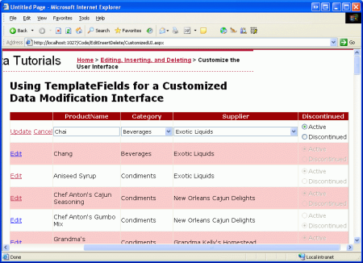
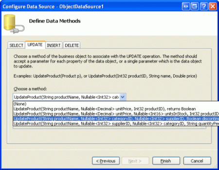
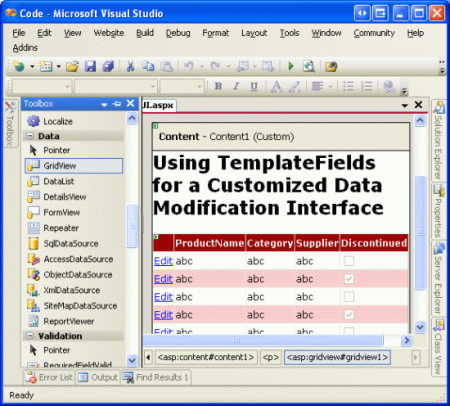
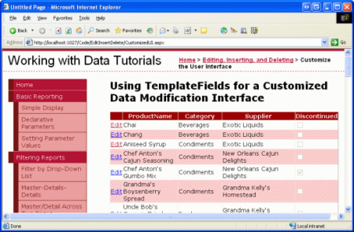
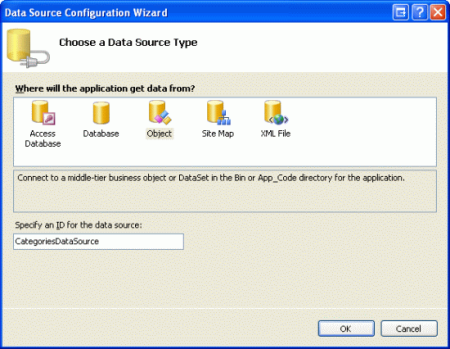
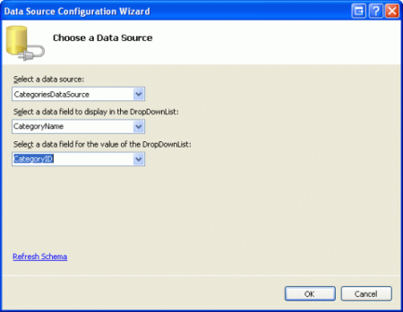
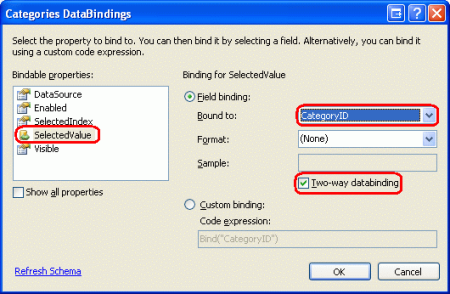
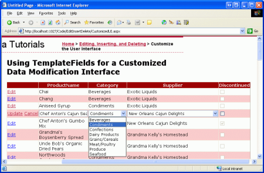
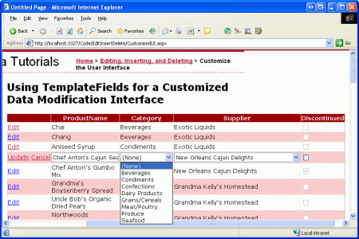

Customizing the Data Modification Interface (C#)
====================
by [Scott Mitchell](https://twitter.com/ScottOnWriting)

[Download Sample App](http://download.microsoft.com/download/9/c/1/9c1d03ee-29ba-4d58-aa1a-f201dcc822ea/ASPNET_Data_Tutorial_20_CS.exe) or [Download PDF](customizing-the-data-modification-interface-cs/_static/datatutorial20cs1.pdf)

> In this tutorial we'll look at how to customize the interface of an editable GridView, by replacing the standard TextBox and CheckBox controls with alternative input Web controls.

## Introduction

The BoundFields and CheckBoxFields used by the GridView and DetailsView controls simplify the process of modifying data due to their ability to render read-only, editable, and insertable interfaces. These interfaces can be rendered without the need for adding any additional declarative markup or code. However, the BoundField and CheckBoxField's interfaces lack the customizability often needed in real-world scenarios. In order to customize the editable or insertable interface in a GridView or DetailsView we need to instead use a TemplateField.

In the [preceding tutorial](adding-validation-controls-to-the-editing-and-inserting-interfaces-cs.md) we saw how to customize the data modification interfaces by adding validation Web controls. In this tutorial we'll look at how to customize the actual data collection Web controls, replacing the BoundField and CheckBoxField's standard TextBox and CheckBox controls with alternative input Web controls. In particular, we'll build an editable GridView that allows a product's name, category, supplier, and discontinued status to be updated. When editing a particular row, the category and supplier fields will render as DropDownLists, containing the set of available categories and suppliers to choose from. Furthermore, we'll replace the CheckBoxField's default CheckBox with a RadioButtonList control that offers two options: "Active" and "Discontinued".

**Figure 1**: The GridView's Editing Interface Includes DropDownLists and RadioButtons ([Click to view full-size image](customizing-the-data-modification-interface-cs/_static/image3.png))

## Step 1: Creating the Appropriate`UpdateProduct`Overload

In this tutorial we will build an editable GridView that permits editing of a product's name, category, supplier, and discontinued status. Therefore, we need an `UpdateProduct` overload that accepts five input parameters these four product values plus the `ProductID`. Like in our previous overloads, this one will:

1. Retrieve the product information from the database for the specified `ProductID`,
2. Update the `ProductName`, `CategoryID`, `SupplierID`, and `Discontinued` fields, and
3. Send the update request to the DAL through the TableAdapter's `Update()` method.

For brevity, for this particular overload I've omitted the business rule check that ensures a product being marked as discontinued isn't the only product offered by its supplier. Feel free to add it in if you prefer, or, ideally, refactor out the logic to a separate method.

The following code shows the new `UpdateProduct` overload in the `ProductsBLL` class:

[!code-csharp[Main](customizing-the-data-modification-interface-cs/samples/sample1.cs)]

## Step 2: Crafting the Editable GridView

With the `UpdateProduct` overload added, we're ready to create our editable GridView. Open the `CustomizedUI.aspx` page in the `EditInsertDelete` folder and add a GridView control to the Designer. Next, create a new ObjectDataSource from the GridView's smart tag. Configure the ObjectDataSource to retrieve product information via the `ProductBLL` class's `GetProducts()` method and to update product data using the `UpdateProduct` overload we just created. From the INSERT and DELETE tabs, select (None) from the drop-down lists.

**Figure 2**: Configure the ObjectDataSource to Use the `UpdateProduct` Overload Just Created ([Click to view full-size image](customizing-the-data-modification-interface-cs/_static/image6.png))

As we've seen throughout the data modification tutorials, the declarative syntax for the ObjectDataSource created by Visual Studio assigns the `OldValuesParameterFormatString` property to `original_{0}`. This, of course, won't work with our Business Logic Layer since our methods don't expect the original `ProductID` value to be passed in. Therefore, as we've done in previous tutorials, take a moment to remove this property assignment from the declarative syntax or, instead, set this property's value to `{0}`.

After this change, the ObjectDataSource's declarative markup should look like the following:

[!code-aspx[Main](customizing-the-data-modification-interface-cs/samples/sample2.aspx)]

Note that the `OldValuesParameterFormatString` property has been removed and that there is a `Parameter` in the `UpdateParameters` collection for each of the input parameters expected by our `UpdateProduct` overload.

While the ObjectDataSource is configured to update only a subset of product values, the GridView currently shows *all* of the product fields. Take a moment to edit the GridView so that:

- It only includes the `ProductName`, `SupplierName`, `CategoryName` BoundFields and the `Discontinued` CheckBoxField
- The `CategoryName` and `SupplierName` fields to appear before (to the left of) the `Discontinued` CheckBoxField
- The `CategoryName` and `SupplierName` BoundFields' `HeaderText` property is set to "Category" and "Supplier", respectively
- Editing support is enabled (check the Enable Editing checkbox in the GridView's smart tag)

After these changes, the Designer will look similar to Figure 3, with the GridView's declarative syntax shown below.

**Figure 3**: Remove the Unneeded Fields from the GridView ([Click to view full-size image](customizing-the-data-modification-interface-cs/_static/image9.png))

[!code-aspx[Main](customizing-the-data-modification-interface-cs/samples/sample3.aspx)]

At this point the GridView's read-only behavior is complete. When viewing the data, each product is rendered as a row in the GridView, showing the product's name, category, supplier, and discontinued status.

**Figure 4**: The GridView's Read-Only Interface is Complete ([Click to view full-size image](customizing-the-data-modification-interface-cs/_static/image12.png))

> [!NOTE]
> As discussed in [An Overview of Inserting, Updating, and Deleting Data tutorial](an-overview-of-inserting-updating-and-deleting-data-cs.md), it is vitally important that the GridView s view state be enabled (the default behavior). If you set the GridView s `EnableViewState` property to `false`, you run the risk of having concurrent users unintentionally deleting or editing records. See [WARNING: Concurrency Issue with ASP.NET 2.0 GridViews/DetailsView/FormViews that Support Editing and/or Deleting and Whose View State is Disabled](http://scottonwriting.net/sowblog/posts/10054.aspx) for more information.

## Step 3: Using a DropDownList for the Category and Supplier Editing Interfaces

Recall that the `ProductsRow` object contains `CategoryID`, `CategoryName`, `SupplierID`, and `SupplierName` properties, which provide the actual foreign-key ID values in the `Products` database table and the corresponding `Name` values in the `Categories` and `Suppliers` tables. The `ProductRow`'s `CategoryID` and `SupplierID` can both be read from and written to, while the `CategoryName` and `SupplierName` properties are marked read-only.

Due to the read-only status of the `CategoryName` and `SupplierName` properties, the corresponding BoundFields have had their `ReadOnly` property set to `true`, preventing these values from being modified when a row is edited. While we can set the `ReadOnly` property to `false`, rendering the `CategoryName` and `SupplierName` BoundFields as TextBoxes during editing, such an approach will result in an exception when the user attempts to update the product since there is no `UpdateProduct` overload that takes in `CategoryName` and `SupplierName` inputs. In fact, we don't want to create such an overload for two reasons:

- The `Products` table doesn't have `SupplierName` or `CategoryName` fields, but `SupplierID` and `CategoryID`. Therefore, we want our method to be passed these particular ID values, not their lookup tables' values.
- Requiring the user to type in the name of the supplier or category is less than ideal, as it requires the user to know the available categories and suppliers and their correct spellings.

The supplier and category fields should display the category and suppliers' names when in read-only mode (as it does now) and a drop-down list of applicable options when being edited. Using a drop-down list, the end user can quickly see what categories and suppliers are available to choose among and can more easily make their selection.

To provide this behavior, we need to convert the `SupplierName` and `CategoryName` BoundFields into TemplateFields whose `ItemTemplate` emits the `SupplierName` and `CategoryName` values and whose `EditItemTemplate` uses a DropDownList control to list the available categories and suppliers.

## Adding the`Categories`and`Suppliers`DropDownLists

Start by converting the `SupplierName` and `CategoryName` BoundFields into TemplateFields by: clicking on the Edit Columns link from the GridView's smart tag; selecting the BoundField from the list in the lower left; and clicking the "Convert this field into a TemplateField" link. The conversion process will create a TemplateField with both an `ItemTemplate` and an `EditItemTemplate`, as shown in the declarative syntax below:

[!code-aspx[Main](customizing-the-data-modification-interface-cs/samples/sample4.aspx)]

Since the BoundField was marked as read-only, both the `ItemTemplate` and `EditItemTemplate` contain a Label Web control whose `Text` property is bound to the applicable data field (`CategoryName`, in the syntax above). We need to modify the `EditItemTemplate`, replacing the Label Web control with a DropDownList control.

As we've seen in previous tutorials, the template can be edited through the Designer or directly from the declarative syntax. To edit it through the Designer, click on the Edit Templates link from the GridView's smart tag and choose to work with the Category field's `EditItemTemplate`. Remove the Label Web control and replace it with a DropDownList control, setting the DropDownList's ID property to `Categories`.

**Figure 5**: Remove the TexBox and Add a DropDownList to the `EditItemTemplate` ([Click to view full-size image](customizing-the-data-modification-interface-cs/_static/image15.png))

We next need to populate the DropDownList with the available categories. Click on the Choose Data Source link from the DropDownList's smart tag and opt to create a new ObjectDataSource named `CategoriesDataSource`.

**Figure 6**: Create a New ObjectDataSource Control Named `CategoriesDataSource` ([Click to view full-size image](customizing-the-data-modification-interface-cs/_static/image18.png))

To have this ObjectDataSource return all of the categories, bind it to the `CategoriesBLL` class's `GetCategories()` method.

**Figure 7**: Bind the ObjectDataSource to the `CategoriesBLL`'s `GetCategories()` Method ([Click to view full-size image](customizing-the-data-modification-interface-cs/_static/image21.png))

Finally, configure the DropDownList's settings such that the `CategoryName` field is displayed in each DropDownList `ListItem` with the `CategoryID` field used as the value.

**Figure 8**: Have the `CategoryName` Field Displayed and the `CategoryID` Used as the Value ([Click to view full-size image](customizing-the-data-modification-interface-cs/_static/image24.png))

After making these changes the declarative markup for the `EditItemTemplate` in the `CategoryName` TemplateField will include both a DropDownList and an ObjectDataSource:

[!code-aspx[Main](customizing-the-data-modification-interface-cs/samples/sample5.aspx)]

> [!NOTE]
> The DropDownList in the `EditItemTemplate` must have its view state enabled. We will soon add databinding syntax to the DropDownList's declarative syntax and databinding commands like `Eval()` and `Bind()` can only appear in controls whose view state is enabled.

Repeat these steps to add a DropDownList named `Suppliers` to the `SupplierName` TemplateField's `EditItemTemplate`. This will involve adding a DropDownList to the `EditItemTemplate` and creating another ObjectDataSource. The `Suppliers` DropDownList's ObjectDataSource, however, should be configured to invoke the `SuppliersBLL` class's `GetSuppliers()` method. Additionally, configure the `Suppliers` DropDownList to display the `CompanyName` field and use the `SupplierID` field as the value for its `ListItem` s.

After adding the DropDownLists to the two `EditItemTemplate` s, load the page in a browser and click the Edit button for the Chef Anton's Cajun Seasoning product. As Figure 9 shows, the product's category and supplier columns are rendered as drop-down lists containing the available categories and suppliers to choose from. However, note that the *first* items in both drop-down lists are selected by default (Beverages for the category and Exotic Liquids as the supplier), even though Chef Anton's Cajun Seasoning is a Condiment supplied by New Orleans Cajun Delights.

**Figure 9**: The First Item in the Drop-Down Lists is Selected by Default ([Click to view full-size image](customizing-the-data-modification-interface-cs/_static/image27.png))

Furthermore, if you click Update, you'll find that the product's `CategoryID` and `SupplierID` values are set to `NULL`. Both of these undesired behaviors are caused because the DropDownLists in the `EditItemTemplate` s are not bound to any data fields from the underlying product data.

## Binding the DropDownLists to the`CategoryID`and`SupplierID`Data Fields

In order to have the edited product's category and supplier drop-down lists set to the appropriate values and to have these values sent back to the BLL's `UpdateProduct` method upon clicking Update, we need to bind the DropDownLists' `SelectedValue` properties to the `CategoryID` and `SupplierID` data fields using two-way databinding. To accomplish this with the `Categories` DropDownList, you can add `SelectedValue='<%# Bind("CategoryID") %>'` directly to the declarative syntax.

Alternatively, you can set the DropDownList's databindings by editing the template through the Designer and clicking the Edit DataBindings link from the DropDownList's smart tag. Next, indicate that the `SelectedValue` property should be bound to the `CategoryID` field using two-way databinding (see Figure 10). Repeat either the declarative or Designer process to bind the `SupplierID` data field to the `Suppliers` DropDownList.

**Figure 10**: Bind the `CategoryID` to the DropDownList's `SelectedValue` Property Using Two-Way Databinding ([Click to view full-size image](customizing-the-data-modification-interface-cs/_static/image30.png))

Once the bindings have been applied to the `SelectedValue` properties of the two DropDownLists, the edited product's category and supplier columns will default to the current product's values. Upon clicking Update, the `CategoryID` and `SupplierID` values of the selected drop-down list item will be passed to the `UpdateProduct` method. Figure 11 shows the tutorial after the databinding statements have been added; note how the selected drop-down list items for Chef Anton's Cajun Seasoning are correctly Condiment and New Orleans Cajun Delights.

**Figure 11**: The Edited Product's Current Category and Supplier Values are Selected by Default ([Click to view full-size image](customizing-the-data-modification-interface-cs/_static/image33.png))

## Handling`NULL`Values

The `CategoryID` and `SupplierID` columns in the `Products` table can be `NULL`, yet the DropDownLists in the `EditItemTemplate` s don't include a list item to represent a `NULL` value. This has two consequences:

- User cannot use our interface to change a product's category or supplier from a non-`NULL` value to a `NULL` one
- If a product has a `NULL` `CategoryID` or `SupplierID`, clicking the Edit button will result in an exception. This is because the `NULL` value returned by `CategoryID` (or `SupplierID`) in the `Bind()` statement does not map to a value in the DropDownList (the DropDownList throws an exception when its `SelectedValue` property is set to a value *not* in its collection of list items).

In order to support `NULL` `CategoryID` and `SupplierID` values, we need to add another `ListItem` to each DropDownList to represent the `NULL` value. In the [Master/Detail Filtering With a DropDownList](../masterdetail/master-detail-filtering-with-a-dropdownlist-cs.md) tutorial, we saw how to add an additional `ListItem` to a databound DropDownList, which involved setting the DropDownList's `AppendDataBoundItems` property to `true` and manually adding the additional `ListItem`. In that previous tutorial, however, we added a `ListItem` with a `Value` of `-1`. The databinding logic in ASP.NET, however, will automatically convert a blank string to a `NULL` value and vice-a-versa. Therefore, for this tutorial we want the `ListItem`'s `Value` to be an empty string.

Start by setting both DropDownLists' `AppendDataBoundItems` property to `true`. Next, add the `NULL` `ListItem` by adding the following `<asp:ListItem>` element to each DropDownList so that the declarative markup looks like:

[!code-aspx[Main](customizing-the-data-modification-interface-cs/samples/sample6.aspx)]

I've chosen to use "(None)" as the Text value for this `ListItem`, but you can change it to also be a blank string if you'd like.

> [!NOTE]
> As we saw in the *Master/Detail Filtering With a DropDownList* tutorial, `ListItem` s can be added to a DropDownList through the Designer by clicking on the DropDownList's `Items` property in the Properties window (which will display the `ListItem` Collection Editor). However, be sure to add the `NULL` `ListItem` for this tutorial through the declarative syntax. If you use the `ListItem` Collection Editor, the generated declarative syntax will omit the `Value` setting altogether when assigned a blank string, creating declarative markup like: `<asp:ListItem>(None)</asp:ListItem>`. While this may look harmless, the missing Value causes the DropDownList to use the `Text` property value in its place. That means that if this `NULL` `ListItem` is selected, the value "(None)" will be attempted to be assigned to the `CategoryID`, which will result in an exception. By explicitly setting `Value=""`, a `NULL` value will be assigned to `CategoryID` when the `NULL` `ListItem` is selected.

Repeat these steps for the Suppliers DropDownList.

With this additional `ListItem`, the editing interface can now assign `NULL` values to a Product's `CategoryID` and `SupplierID` fields, as shown in Figure 12.

**Figure 12**: Choose (None) to Assign a `NULL` Value for a Product's Category or Supplier ([Click to view full-size image](customizing-the-data-modification-interface-cs/_static/image36.png))

## Step 4: Using RadioButtons for the Discontinued Status

Currently the products' `Discontinued` data field is expressed using a CheckBoxField, which renders a disabled checkbox for the read-only rows and an enabled checkbox for the row being edited. While this user interface is often suitable, we can customize it if needed using a TemplateField. For this tutorial, let's change the CheckBoxField into a TemplateField that uses a RadioButtonList control with two options "Active" and "Discontinued" from which the user can specify the product's `Discontinued` value.

Start by converting the `Discontinued` CheckBoxField into a TemplateField, which will create a TemplateField with an `ItemTemplate` and `EditItemTemplate`. Both templates include a CheckBox with its `Checked` property bound to the `Discontinued` data field, the only difference between the two being that the `ItemTemplate`'s CheckBox's `Enabled` property is set to `false`.

Replace the CheckBox in both the `ItemTemplate` and `EditItemTemplate` with a RadioButtonList control, setting both RadioButtonLists' `ID` properties to `DiscontinuedChoice`. Next, indicate that the RadioButtonLists should each contain two radio buttons, one labeled "Active" with a value of "False" and one labeled "Discontinued" with a value of "True". To accomplish this you can either enter the `<asp:ListItem>` elements in directly through the declarative syntax or use the `ListItem` Collection Editor from the Designer. Figure 13 shows the `ListItem` Collection Editor after the two radio button options have been specified.

**Figure 13**: Add "Active" and "Discontinued" Options to the RadioButtonList ([Click to view full-size image](customizing-the-data-modification-interface-cs/_static/image39.png))

Since the RadioButtonList in the `ItemTemplate` shouldn't be editable, set its `Enabled` property to `false`, leaving the `Enabled` property to `true` (the default) for the RadioButtonList in the `EditItemTemplate`. This will make the radio buttons in the non-edited row as read-only, but will allow the user to change the RadioButton values for the edited row.

We still need to assign the RadioButtonList controls' `SelectedValue` properties so that the appropriate radio button is selected based upon the product's `Discontinued` data field. As with the DropDownLists examined earlier in this tutorial, this databinding syntax can either be added directly into the declarative markup or through the Edit DataBindings link in the RadioButtonLists' smart tags.

After adding the two RadioButtonLists and configuring them, the `Discontinued` TemplateField's declarative markup should look like:

[!code-aspx[Main](customizing-the-data-modification-interface-cs/samples/sample7.aspx)]

With these changes, the `Discontinued` column has been transformed from a list of checkboxes to a list of radio button pairs (see Figure 14). When editing a product, the appropriate radio button is selected and the product's discontinued status can be updated by selecting the other radio button and clicking Update.

**Figure 14**: The Discontinued CheckBoxes Have Been Replaced by Radio Button Pairs ([Click to view full-size image](customizing-the-data-modification-interface-cs/_static/image42.png))

> [!NOTE]
> Since the `Discontinued` column in the `Products` database cannot have `NULL` values, we do not need to worry about capturing `NULL` information in the interface. If, however, `Discontinued` column could contain `NULL` values we'd want to add a third radio button to the list with its `Value` set to an empty string (`Value=""`), just like with the category and supplier DropDownLists.

## Summary

While the BoundField and CheckBoxField automatically render read-only, editing, and inserting interfaces, they lack the ability for customization. Often, though, we'll need to customize the editing or inserting interface, perhaps adding validation controls (as we saw in the preceding tutorial) or by customizing the data collection user interface (as we saw in this tutorial). Customizing the interface with a TemplateField can be summed up in the following steps:

1. Add a TemplateField or convert an existing BoundField or CheckBoxField into a TemplateField
2. Augment the interface as needed
3. Bind the appropriate data fields to the newly added Web controls using two-way databinding

In addition to using the built-in ASP.NET Web controls, you can also customize the templates of a TemplateField with custom, compiled server controls and User Controls.

Happy Programming!

## About the Author

[Scott Mitchell](http://www.4guysfromrolla.com/ScottMitchell.shtml), author of seven ASP/ASP.NET books and founder of [4GuysFromRolla.com](http://www.4guysfromrolla.com), has been working with Microsoft Web technologies since 1998. Scott works as an independent consultant, trainer, and writer. His latest book is [*Sams Teach Yourself ASP.NET 2.0 in 24 Hours*](https://www.amazon.com/exec/obidos/ASIN/0672327384/4guysfromrollaco). He can be reached at [mitchell@4GuysFromRolla.com.](mailto:mitchell@4GuysFromRolla.com) or via his blog, which can be found at [http://ScottOnWriting.NET](http://ScottOnWriting.NET).

>[!div class="step-by-step"]
[Previous](adding-validation-controls-to-the-editing-and-inserting-interfaces-cs.md)
[Next](implementing-optimistic-concurrency-cs.md)