Examining the Events Associated with Inserting, Updating, and Deleting (C#)
====================
by [Scott Mitchell](https://twitter.com/ScottOnWriting)

[Download Sample App](http://download.microsoft.com/download/9/c/1/9c1d03ee-29ba-4d58-aa1a-f201dcc822ea/ASPNET_Data_Tutorial_17_CS.exe) or [Download PDF](examining-the-events-associated-with-inserting-updating-and-deleting-cs/_static/datatutorial17cs1.pdf)

> In this tutorial we'll examine using the events that occur before, during, and after an insert, update, or delete operation of an ASP.NET data Web control. We'll also see how to customize the editing interface to only update a subset of the product fields.

## Introduction

When using the built-in inserting, editing, or deleting features of the GridView, DetailsView, or FormView controls, a variety of steps transpire when the end user completes the process of adding a new record or updating or deleting an existing record. As we discussed in the [previous tutorial](an-overview-of-inserting-updating-and-deleting-data-cs.md), when a row is edited in the GridView the Edit button is replaced by Update and Cancel buttons and the BoundFields turn into TextBoxes. After the end user updates the data and clicks Update, the following steps are performed on postback:

1. The GridView populates its ObjectDataSource's `UpdateParameters` with the edited record's unique identifying field(s) (via the `DataKeyNames` property) along with the values entered by the user
2. The GridView invokes its ObjectDataSource's `Update()` method, which in turn invokes the appropriate method in the underlying object (`ProductsDAL.UpdateProduct`, in our previous tutorial)
3. The underlying data, which now includes the updated changes, is rebound to the GridView

During this sequence of steps, a number of events fire, enabling us to create event handlers to add custom logic where needed. For example, prior to Step 1, the GridView's `RowUpdating` event fires. We can, at this point, cancel the update request if there is some validation error. When the `Update()` method is invoked, the ObjectDataSource's `Updating` event fires, providing an opportunity to add or customize the values of any of the `UpdateParameters`. After the ObjectDataSource's underlying object's method has completed executing, the ObjectDataSource's `Updated` event is raised. An event handler for the `Updated` event can inspect the details about the update operation, such as how many rows were affected and whether or not an exception occurred. Finally, after Step 2, the GridView's `RowUpdated` event fires; an event handler for this event can examine additional information about the update operation just performed.

Figure 1 depicts this series of events and steps when updating a GridView. The event pattern in Figure 1 is not unique to updating with a GridView. Inserting, updating, or deleting data from the GridView, DetailsView, or FormView precipitates the same sequence of pre- and post-level events for both the data Web control and the ObjectDataSource.

**Figure 1**: A Series of Pre- and Post-Events Fire When Updating Data in a GridView ([Click to view full-size image](examining-the-events-associated-with-inserting-updating-and-deleting-cs/_static/image3.png))

In this tutorial we'll examine using these events to extend the built-in inserting, updating, and deleting capabilities of the ASP.NET data Web controls. We'll also see how to customize the editing interface to only update a subset of the product fields.

## Step 1: Updating a Product's`ProductName`and`UnitPrice`Fields

In the editing interfaces from the previous tutorial *all* product fields that were not read-only had to be included. If we were to remove a field from the GridView - say `QuantityPerUnit` - when updating the data the data Web control would not set the ObjectDataSource's `QuantityPerUnit` `UpdateParameters` value. The ObjectDataSource would then pass in a `null` value into the `UpdateProduct` Business Logic Layer (BLL) method, which would change the edited database record's `QuantityPerUnit` column to a `NULL` value. Similarly, if a required field, such as `ProductName`, is removed from the editing interface, the update will fail with a "*Column 'ProductName' does not allow nulls*" exception. The reason for this behavior was because the ObjectDataSource was configured to call the `ProductsBLL` class's `UpdateProduct` method, which expected an input parameter for each of the product fields. Therefore, the ObjectDataSource's `UpdateParameters` collection contained a parameter for each of the method's input parameters.

If we want to provide a data Web control that allows the end user to only update a subset of fields, then we need to either programmatically set the missing `UpdateParameters` values in the ObjectDataSource's `Updating` event handler or create and call a BLL method that expects only a subset of the fields. Let's explore this latter approach.

Specifically, let's create a page that displays just the `ProductName` and `UnitPrice` fields in an editable GridView. This GridView's editing interface will only allow the user to update the two displayed fields, `ProductName` and `UnitPrice`. Since this editing interface only provides a subset of a product's fields, we either need to create an ObjectDataSource that uses the existing BLL's `UpdateProduct` method and has the missing product field values set programmatically in its `Updating` event handler, or we need to create a new BLL method that expects only the subset of fields defined in the GridView. For this tutorial, let's use the latter option and create an overload of the `UpdateProduct` method, one that takes in just three input parameters: `productName`, `unitPrice`, and `productID`:

[!code-csharp[Main](examining-the-events-associated-with-inserting-updating-and-deleting-cs/samples/sample1.cs)]

Like the original `UpdateProduct` method, this overload starts by checking to see if there is a product in the database with the specified `ProductID`. If not, it returns `false`, indicating that the request to update the product information failed. Otherwise it updates the existing product record's `ProductName` and `UnitPrice` fields accordingly and commits the update by calling the TableAdpater's `Update()` method, passing in the `ProductsRow` instance.

With this addition to our `ProductsBLL` class, we're ready to create the simplified GridView interface. Open the `DataModificationEvents.aspx` in the `EditInsertDelete` folder and add a GridView to the page. Create a new ObjectDataSource and configure it to use the `ProductsBLL` class with its `Select()` method mapping to `GetProducts` and its `Update()` method mapping to the `UpdateProduct` overload that takes in only the `productName`, `unitPrice`, and `productID` input parameters. Figure 2 shows the Create Data Source wizard when mapping the ObjectDataSource's `Update()` method to the `ProductsBLL` class's new `UpdateProduct` method overload.

**Figure 2**: Map the ObjectDataSource's `Update()` Method to the New `UpdateProduct` Overload ([Click to view full-size image](examining-the-events-associated-with-inserting-updating-and-deleting-cs/_static/image6.png))

Since our example will initially just need the ability to edit data, but not to insert or delete records, take a moment to explicitly indicate that the ObjectDataSource's `Insert()` and `Delete()` methods shouldn't be mapped to any of the `ProductsBLL` class's methods by going to the INSERT and DELETE tabs and choosing (None) from the drop-down list.

**Figure 3**: Choose (None) From the Drop-Down List for the INSERT and DELETE Tabs ([Click to view full-size image](examining-the-events-associated-with-inserting-updating-and-deleting-cs/_static/image9.png))

After completing this wizard check the Enable Editing checkbox from the GridView's smart tag.

With the completion of the Create Data Source wizard and binding that to the GridView, Visual Studio has created the declarative syntax for both controls. Go to the Source view to inspect the ObjectDataSource's declarative markup, which is shown below:

[!code-aspx[Main](examining-the-events-associated-with-inserting-updating-and-deleting-cs/samples/sample2.aspx)]

Since there are no mappings for the ObjectDataSource's `Insert()` and `Delete()` methods, there are no `InsertParameters` or `DeleteParameters` sections. Furthermore, since the `Update()` method is mapped to the `UpdateProduct` method overload that only accepts three input parameters, the `UpdateParameters` section has just three `Parameter` instances.

Note that the ObjectDataSource's `OldValuesParameterFormatString` property is set to `original_{0}`. This property is set automatically by Visual Studio when using the Configure Data Source wizard. However, since our BLL methods don't expect the original `ProductID` value to be passed in, remove this property assignment altogether from the ObjectDataSource's declarative syntax.

> [!NOTE]
> If you simply clear out the `OldValuesParameterFormatString` property value from the Properties window in the Design view, the property will still exist in the declarative syntax, but will be set to an empty string. Either remove the property altogether from the declarative syntax or, from the Properties window, set the value to the default, `{0}`.

While the ObjectDataSource only has `UpdateParameters` for the product's name, price, and ID, Visual Studio has added a BoundField or CheckBoxField in the GridView for each of the product's fields.

[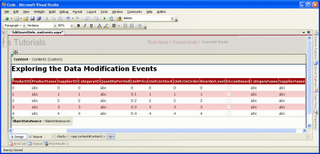](examining-the-events-associated-with-inserting-updating-and-deleting-cs/_static/image10.png)

**Figure 4**: The GridView Contains a BoundField or CheckBoxField for Each of the Product's Fields ([Click to view full-size image](examining-the-events-associated-with-inserting-updating-and-deleting-cs/_static/image12.png))

When the end user edits a product and clicks its Update button, the GridView enumerates those fields that were not read-only. It then sets the value of the corresponding parameter in the ObjectDataSource's `UpdateParameters` collection to the value entered by the user. If there is not a corresponding parameter, the GridView adds one to the collection. Therefore, if our GridView contains BoundFields and CheckBoxFields for all of the product's fields, the ObjectDataSource will end up invoking the `UpdateProduct` overload that takes in all of these parameters, despite the fact that the ObjectDataSource's declarative markup specifies only three input parameters (see Figure 5). Similarly, if there is some combination of non-read-only product fields in the GridView that doesn't correspond to the input parameters for a `UpdateProduct` overload, an exception will be raised when attempting to update.

**Figure 5**: The GridView Will Add Parameters to the ObjectDataSource's `UpdateParameters` Collection ([Click to view full-size image](examining-the-events-associated-with-inserting-updating-and-deleting-cs/_static/image15.png))

To ensure that the ObjectDataSource invokes the `UpdateProduct` overload that takes in just the product's name, price, and ID, we need to restrict the GridView to having editable fields for just the `ProductName` and `UnitPrice`. This can be accomplished by removing the other BoundFields and CheckBoxFields, by setting those other fields' `ReadOnly` property to `true`, or by some combination of the two. For this tutorial let's simply remove all GridView fields except the `ProductName` and `UnitPrice` BoundFields, after which the GridView's declarative markup will look like:

[!code-aspx[Main](examining-the-events-associated-with-inserting-updating-and-deleting-cs/samples/sample3.aspx)]

Even though the `UpdateProduct` overload expects three input parameters, we only have two BoundFields in our GridView. This is because the `productID` input parameter is a primary key value and passed in through the value of the `DataKeyNames` property for the edited row.

Our GridView, along with the `UpdateProduct` overload, allows a user to edit just the name and price of a product without losing any of the other product fields.

[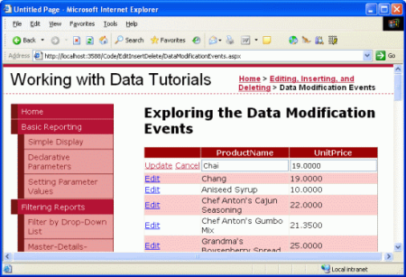](examining-the-events-associated-with-inserting-updating-and-deleting-cs/_static/image16.png)

**Figure 6**: The Interface Allows Editing Just the Product's Name and Price ([Click to view full-size image](examining-the-events-associated-with-inserting-updating-and-deleting-cs/_static/image18.png))

> [!NOTE]
> As discussed in the previous tutorial, it is vitally important that the GridView s view state be enabled (the default behavior). If you set the GridView s `EnableViewState` property to `false`, you run the risk of having concurrent users unintentionally deleting or editing records. See [WARNING: Concurrency Issue with ASP.NET 2.0 GridViews/DetailsView/FormViews that Support Editing and/or Deleting and Whose View State is Disabled](http://scottonwriting.net/sowblog/archive/2006/10/03/163215.aspx) for more information.

## Improving the`UnitPrice`Formatting

While the GridView example shown in Figure 6 works, the `UnitPrice` field is not formatted at all, resulting in a price display that lacks any currency symbols and has four decimal places. To apply a currency formatting for the non-editable rows, simply set the `UnitPrice` BoundField's `DataFormatString` property to `{0:c}` and its `HtmlEncode` property to `false`.

[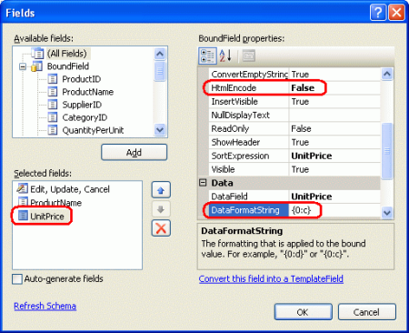](examining-the-events-associated-with-inserting-updating-and-deleting-cs/_static/image19.png)

**Figure 7**: Set the `UnitPrice`'s `DataFormatString` and `HtmlEncode` Properties Accordingly ([Click to view full-size image](examining-the-events-associated-with-inserting-updating-and-deleting-cs/_static/image21.png))

With this change, the non-editable rows format the price as a currency; the edited row, however, still displays the value without the currency symbol and with four decimal places.

[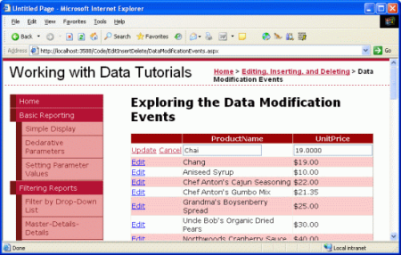](examining-the-events-associated-with-inserting-updating-and-deleting-cs/_static/image22.png)

**Figure 8**: Non-Editable Rows are Now Formatted as Currency Values ([Click to view full-size image](examining-the-events-associated-with-inserting-updating-and-deleting-cs/_static/image24.png))

The formatting instructions specified in the `DataFormatString` property can be applied to the editing interface by setting the BoundField's `ApplyFormatInEditMode` property to `true` (the default is `false`). Take a moment to set this property to `true`.

[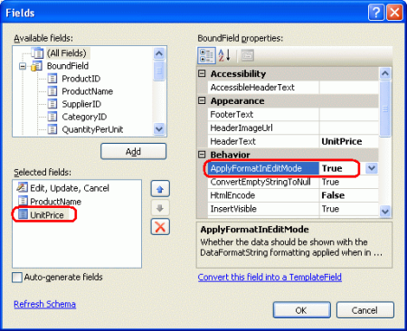](examining-the-events-associated-with-inserting-updating-and-deleting-cs/_static/image25.png)

**Figure 9**: Set the `UnitPrice` BoundField's `ApplyFormatInEditMode` property to `true` ([Click to view full-size image](examining-the-events-associated-with-inserting-updating-and-deleting-cs/_static/image27.png))

With this change, the value of the `UnitPrice` displayed in the edited row is also formatted as a currency.

**Figure 10**: The Edited Row's `UnitPrice` Value is Now Formatted as a Currency ([Click to view full-size image](examining-the-events-associated-with-inserting-updating-and-deleting-cs/_static/image30.png))

However, updating a product with the currency symbol in the textbox such as $19.00 throws a `FormatException`. When the GridView attempts to assign the user-supplied values to the ObjectDataSource's `UpdateParameters` collection it is unable to convert the `UnitPrice` string "$19.00" into the `decimal` required by the parameter (see Figure 11). To remedy this we can create an event handler for the GridView's `RowUpdating` event and have it parse the user-supplied `UnitPrice` as a currency-formatted `decimal`.

The GridView's `RowUpdating` event accepts as its second parameter an object of type [GridViewUpdateEventArgs](https://msdn.microsoft.com/en-us/library/system.web.ui.webcontrols.gridviewupdateeventargs(VS.80).aspx), which includes a `NewValues` dictionary as one of its properties that holds the user-supplied values ready to be assigned to the ObjectDataSource's `UpdateParameters` collection. We can overwrite the existing `UnitPrice` value in the `NewValues` collection with a decimal value parsed using the currency format with the following lines of code in the `RowUpdating` event handler:

[!code-csharp[Main](examining-the-events-associated-with-inserting-updating-and-deleting-cs/samples/sample4.cs)]

If the user has supplied a `UnitPrice` value (such as "$19.00"), this value is overwritten with the decimal value computed by [Decimal.Parse](https://msdn.microsoft.com/en-us/library/system.decimal.parse(VS.80).aspx), parsing the value as a currency. This will correctly parse the decimal in the event of any currency symbols, commas, decimal points, and so on, and uses the [NumberStyles enumeration](https://msdn.microsoft.com/en-US/library/system.globalization.numberstyles(VS.80).aspx) in the [System.Globalization](https://msdn.microsoft.com/en-US/library/abeh092z(VS.80).aspx) namespace.

Figure 11 shows both the problem caused by currency symbols in the user-supplied `UnitPrice`, along with how the GridView's `RowUpdating` event handler can be utilized to correctly parse such input.

**Figure 11**: The Edited Row's `UnitPrice` Value is Now Formatted as a Currency ([Click to view full-size image](examining-the-events-associated-with-inserting-updating-and-deleting-cs/_static/image33.png))

## Step 2: Prohibiting`NULL UnitPrices`

While the database is configured to allow `NULL` values in the `Products` table's `UnitPrice` column, we may want to prevent users visiting this particular page from specifying a `NULL` `UnitPrice` value. That is, if a user fails to enter a `UnitPrice` value when editing a product row, rather than save the results to the database we want to display a message informing the user that, through this page, any edited products must have a price specified.

The `GridViewUpdateEventArgs` object passed into the GridView's `RowUpdating` event handler contains a `Cancel` property that, if set to `true`, terminates the updating process. Let's extend the `RowUpdating` event handler to set `e.Cancel` to `true` and display a message explaining why if the `UnitPrice` value in the `NewValues` collection is `null`.

Start by adding a Label Web control to the page named `MustProvideUnitPriceMessage`. This Label control will be displayed if the user fails to specify a `UnitPrice` value when updating a product. Set the Label's `Text` property to "You must provide a price for the product." I've also created a new CSS class in `Styles.css` named `Warning` with the following definition:

[!code-css[Main](examining-the-events-associated-with-inserting-updating-and-deleting-cs/samples/sample5.css)]

Finally, set the Label's `CssClass` property to `Warning`. At this point the Designer should show the warning message in a red, bold, italic, extra large font size above the GridView, as shown in Figure 12.

**Figure 12**: A Label Has Been Added Above the GridView ([Click to view full-size image](examining-the-events-associated-with-inserting-updating-and-deleting-cs/_static/image36.png))

By default, this Label should be hidden, so set its `Visible` property to `false` in the `Page_Load` event handler:

[!code-csharp[Main](examining-the-events-associated-with-inserting-updating-and-deleting-cs/samples/sample6.cs)]

If the user attempts to update a product without specifying the `UnitPrice`, we want to cancel the update and display the warning label. Augment the GridView's `RowUpdating` event handler as follows:

[!code-csharp[Main](examining-the-events-associated-with-inserting-updating-and-deleting-cs/samples/sample7.cs)]

If a user attempts to save a product without specifying a price, the update is cancelled and a helpful message is displayed. While the database (and business logic) allows for `NULL` `UnitPrice` s, this particular ASP.NET page does not.

[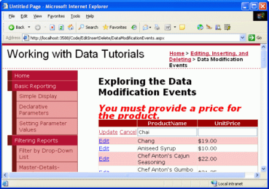](examining-the-events-associated-with-inserting-updating-and-deleting-cs/_static/image37.png)

**Figure 13**: A User Cannot Leave `UnitPrice` Blank ([Click to view full-size image](examining-the-events-associated-with-inserting-updating-and-deleting-cs/_static/image39.png))

So far we have seen how to use the GridView's `RowUpdating` event to programmatically alter the parameter values assigned to the ObjectDataSource's `UpdateParameters` collection as well as how to cancel the updating process altogether. These concepts carry over to the DetailsView and FormView controls and also apply to inserting and deleting.

These tasks can also be done at the ObjectDataSource level through event handlers for its `Inserting`, `Updating`, and `Deleting` events. These events fire before the associated method of the underlying object is invoked and provide a last-chance opportunity to modify the input parameters collection or cancel the operation outright. The event handlers for these three events are passed an object of type [ObjectDataSourceMethodEventArgs](https://msdn.microsoft.com/en-US/library/system.web.ui.webcontrols.objectdatasourcemethodeventargs(VS.80).aspx) that has two properties of interest:

- [Cancel](https://msdn.microsoft.com/en-US/library/system.componentmodel.canceleventargs.cancel(VS.80).aspx), which, if set to `true`, cancels the operation being performed
- [InputParameters](https://msdn.microsoft.com/en-US/library/system.web.ui.webcontrols.objectdatasourcemethodeventargs.inputparameters(VS.80).aspx), which is the collection of `InsertParameters`, `UpdateParameters`, or `DeleteParameters`, depending on whether the event handler is for the `Inserting`, `Updating`, or `Deleting` event

To illustrate working with the parameter values at the ObjectDataSource level, let's include a DetailsView in our page that allows the users to add a new product. This DetailsView will be used to provide an interface for quickly adding a new product to the database. To keep a consistent user interface when adding a new product let's allow the user to only enter values for the `ProductName` and `UnitPrice` fields. By default, those values that aren't supplied in the DetailsView's inserting interface will be set to a `NULL` database value. However, we can use the ObjectDataSource's `Inserting` event to inject different default values, as we'll see shortly.

## Step 3: Providing an Interface to Add New Products

Drag a DetailsView from the Toolbox onto the Designer above the GridView, clear out its `Height` and `Width` properties, and bind it to the ObjectDataSource already present on the page. This will add a BoundField or CheckBoxField for each of the product's fields. Since we want to use this DetailsView to add new products, we need to check the Enable Inserting option from the smart tag; however, there's no such option because the ObjectDataSource's `Insert()` method is not mapped to a method in the `ProductsBLL` class (recall that we set this mapping to (None) when configuring the data source see Figure 3).

To configure the ObjectDataSource, select the Configure Data Source link from its smart tag, launching the wizard. The first screen allows you to change the underlying object the ObjectDataSource is bound to; leave it set to `ProductsBLL`. The next screen lists the mappings from the ObjectDataSource's methods to the underlying object's. Even though we explicitly indicated that the `Insert()` and `Delete()` methods should not be mapped to any methods, if you go to the INSERT and DELETE tabs you'll see that a mapping is there. This is because the `ProductsBLL`'s `AddProduct` and `DeleteProduct` methods use the `DataObjectMethodAttribute` attribute to indicate that they are the default methods for `Insert()` and `Delete()`, respectively. Hence, the ObjectDataSource wizard selects these each time you run the wizard unless there's some other value explicitly specified.

Leave the `Insert()` method pointing to the `AddProduct` method, but again set the DELETE tab's drop-down list to (None).

[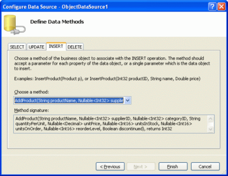](examining-the-events-associated-with-inserting-updating-and-deleting-cs/_static/image40.png)

**Figure 14**: Set the INSERT Tab's Drop-Down List to the `AddProduct` Method ([Click to view full-size image](examining-the-events-associated-with-inserting-updating-and-deleting-cs/_static/image42.png))

[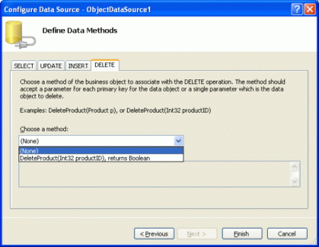](examining-the-events-associated-with-inserting-updating-and-deleting-cs/_static/image43.png)

**Figure 15**: Set the DELETE Tab's Drop-Down List to (None) ([Click to view full-size image](examining-the-events-associated-with-inserting-updating-and-deleting-cs/_static/image45.png))

After making these changes, the ObjectDataSource's declarative syntax will be expanded to include an `InsertParameters` collection, as shown below:

[!code-aspx[Main](examining-the-events-associated-with-inserting-updating-and-deleting-cs/samples/sample8.aspx)]

Rerunning the wizard added back the `OldValuesParameterFormatString` property. Take a moment to clear this property by setting it to the default value (`{0}`) or removing it altogether from the declarative syntax.

With the ObjectDataSource providing inserting capabilities, the DetailsView's smart tag will now include the Enable Inserting checkbox; return to the Designer and check this option. Next, pare down the DetailsView so that it only has two BoundFields - `ProductName` and `UnitPrice` - and the CommandField. At this point the DetailsView's declarative syntax should look like:

[!code-aspx[Main](examining-the-events-associated-with-inserting-updating-and-deleting-cs/samples/sample9.aspx)]

Figure 16 shows this page when viewed through a browser at this point. As you can see, the DetailsView lists the name and price of the first product (Chai). What we want, however, is an inserting interface that provides a means for the user to quickly add a new product to the database.

[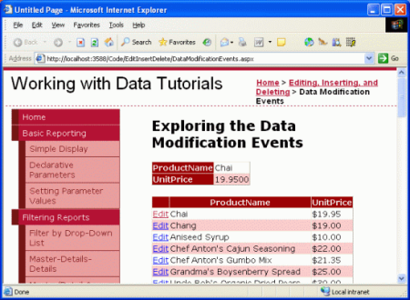](examining-the-events-associated-with-inserting-updating-and-deleting-cs/_static/image46.png)

**Figure 16**: The DetailsView is Currently Rendered in Read-Only Mode ([Click to view full-size image](examining-the-events-associated-with-inserting-updating-and-deleting-cs/_static/image48.png))

In order to show the DetailsView in its inserting mode we need to set the `DefaultMode` property to `Inserting`. This renders the DetailsView in insert mode when first visited and keeps it there after inserting a new record. As Figure 17 shows, such a DetailsView provides a quick interface for adding a new record.

**Figure 17**: The DetailsView Provides an Interface for Quickly Adding a New Product ([Click to view full-size image](examining-the-events-associated-with-inserting-updating-and-deleting-cs/_static/image51.png))

When the user enters a product name and price (such as "Acme Water" and 1.99, as in Figure 17) and clicks Insert, a postback ensues and the inserting workflow commences, culminating in a new product record being added to the database. The DetailsView maintains its inserting interface and the GridView is automatically rebound to its data source in order to include the new product, as shown in Figure 18.

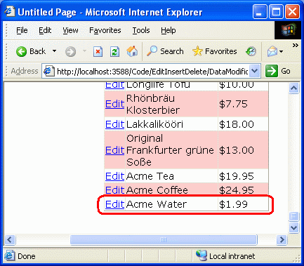

**Figure 18**: The Product "Acme Water" Has Been Added to the Database

While the GridView in Figure 18 doesn't show it, the product fields lacking from the DetailsView interface `CategoryID`, `SupplierID`, `QuantityPerUnit`, and so on are assigned `NULL` database values. You can see this by performing the following steps:

1. Go to the Server Explorer in Visual Studio
2. Expanding the `NORTHWND.MDF` database node
3. Right-click on the `Products` database table node
4. Select Show Table Data

This will list all of the records in the `Products` table. As Figure 19 shows, all of our new product's columns other than `ProductID`, `ProductName`, and `UnitPrice` have `NULL` values.

[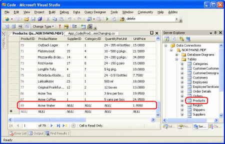](examining-the-events-associated-with-inserting-updating-and-deleting-cs/_static/image53.png)

**Figure 19**: The Product Fields Not Provided in the DetailsView are Assigned `NULL` Values ([Click to view full-size image](examining-the-events-associated-with-inserting-updating-and-deleting-cs/_static/image55.png))

We may want to provide a default value other than `NULL` for one or more of these column values, either because `NULL` isn't the best default option or because the database column itself doesn't allow `NULL` s. To accomplish this we can programmatically set the values of the parameters of the DetailsView's `InputParameters` collection. This assignment can be done either in the event handler for the DetailsView's `ItemInserting` event or the ObjectDataSource's `Inserting` event. Since we've already looked at using the pre- and post-level events at the data Web control level, let's explore using the ObjectDataSource's events this time.

## Step 4: Assigning Values to the`CategoryID`and`SupplierID`Parameters

For this tutorial let's imagine that for our application when adding a new product through this interface it should be assigned a `CategoryID` and `SupplierID` value of 1. As mentioned earlier, the ObjectDataSource has a pair of pre- and post-level events that fire during the data modification process. When its `Insert()` method is invoked, the ObjectDataSource first raises its `Inserting` event, then calls the method that its `Insert()` method has been mapped to, and finally raises the `Inserted` event. The `Inserting` event handler affords us one last opportunity to tweak the input parameters or cancel the operation outright.

> [!NOTE]
> In a real-world application you would likely want to either let the user specify the category and supplier or would pick this value for them based on some criteria or business logic (rather than blindly selecting an ID of 1). Regardless, the example illustrates how to programmatically set the value of an input parameter from the ObjectDataSource's pre-level event.

Take a moment to create an event handler for the ObjectDataSource's `Inserting` event. Notice that the event handler's second input parameter is an object of type `ObjectDataSourceMethodEventArgs`, which has a property to access the parameters collection (`InputParameters`) and a property to cancel the operation (`Cancel`).

[!code-csharp[Main](examining-the-events-associated-with-inserting-updating-and-deleting-cs/samples/sample10.cs)]

At this point, the `InputParameters` property contains the ObjectDataSource's `InsertParameters` collection with the values assigned from the DetailsView. To change the value of one of these parameters, simply use: `e.InputParameters["paramName"] = value`. Therefore, to set the `CategoryID` and `SupplierID` to values of 1, adjust the `Inserting` event handler to look like the following:

[!code-csharp[Main](examining-the-events-associated-with-inserting-updating-and-deleting-cs/samples/sample11.cs)]

This time when adding a new product (such as Acme Soda), the `CategoryID` and `SupplierID` columns of the new product are set to 1 (see Figure 20).

[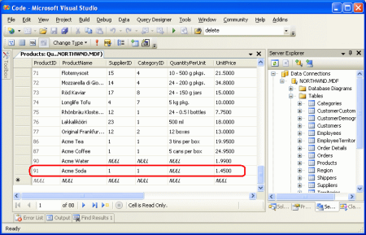](examining-the-events-associated-with-inserting-updating-and-deleting-cs/_static/image56.png)

**Figure 20**: New Products Now Have Their `CategoryID` and `SupplierID` Values Set to 1 ([Click to view full-size image](examining-the-events-associated-with-inserting-updating-and-deleting-cs/_static/image58.png))

## Summary

During the editing, inserting, and deleting process, both the data Web control and the ObjectDataSource proceed through a number of pre- and post-level events. In this tutorial we examined the pre-level events and saw how to use these to customize the input parameters or cancel the data modification operation altogether both from the data Web control and ObjectDataSource's events. In the next tutorial we'll look at creating and using event handlers for the post-level events.

Happy Programming!

## About the Author

[Scott Mitchell](http://www.4guysfromrolla.com/ScottMitchell.shtml), author of seven ASP/ASP.NET books and founder of [4GuysFromRolla.com](http://www.4guysfromrolla.com), has been working with Microsoft Web technologies since 1998. Scott works as an independent consultant, trainer, and writer. His latest book is [*Sams Teach Yourself ASP.NET 2.0 in 24 Hours*](https://www.amazon.com/exec/obidos/ASIN/0672327384/4guysfromrollaco). He can be reached at [mitchell@4GuysFromRolla.com.](mailto:mitchell@4GuysFromRolla.com) or via his blog, which can be found at [http://ScottOnWriting.NET](http://ScottOnWriting.NET).

## Special Thanks To

This tutorial series was reviewed by many helpful reviewers. Lead reviewers for this tutorial were Jackie Goor and Liz Shulok. Interested in reviewing my upcoming MSDN articles? If so, drop me a line at [mitchell@4GuysFromRolla.com.](mailto:mitchell@4GuysFromRolla.com)

>[!div class="step-by-step"]
[Previous](an-overview-of-inserting-updating-and-deleting-data-cs.md)
[Next](handling-bll-and-dal-level-exceptions-in-an-asp-net-page-cs.md)