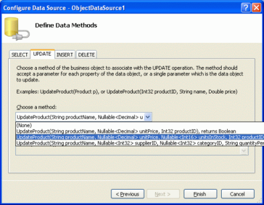
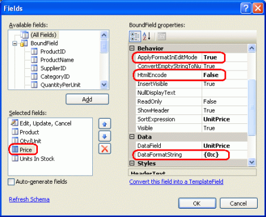
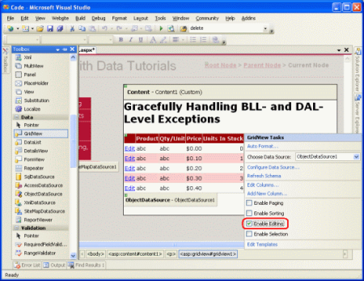
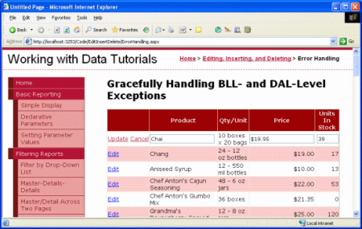
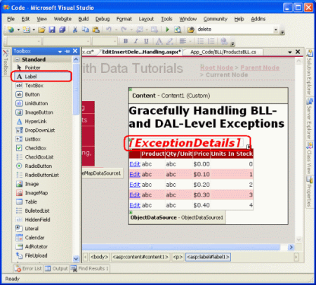
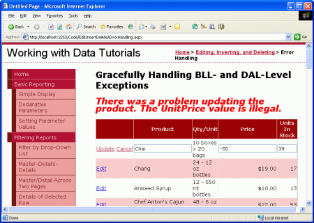
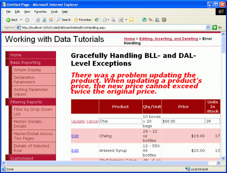

Handling BLL- and DAL-Level Exceptions in an ASP.NET Page (VB)
====================
by [Scott Mitchell](https://twitter.com/ScottOnWriting)

[Download Sample App](http://download.microsoft.com/download/9/c/1/9c1d03ee-29ba-4d58-aa1a-f201dcc822ea/ASPNET_Data_Tutorial_18_VB.exe) or [Download PDF](handling-bll-and-dal-level-exceptions-in-an-asp-net-page-vb/_static/datatutorial18vb1.pdf)

> In this tutorial we will see how to display a friendly, informative error message should an exception occur during an insert, update, or delete operation of an ASP.NET data Web control.

## Introduction

Working with data from an ASP.NET web application using a tiered application architecture involves the following three general steps:

1. Determine what method of the Business Logic Layer needs to be invoked and what parameter values to pass it. The parameter values can be hard coded, programmatically-assigned, or inputs entered by the user.
2. Invoke the method.
3. Process the results. When calling a BLL method that returns data, this may involve binding the data to a data Web control. For BLL methods that modify data, this may include performing some action based on a return value or gracefully handling any exception that arose in Step 2.

As we saw in the [previous tutorial](examining-the-events-associated-with-inserting-updating-and-deleting-vb.md), both the ObjectDataSource and the data Web controls provide extensibility points for Steps 1 and 3. The GridView, for example, fires its `RowUpdating` event prior to assigning its field values to its ObjectDataSource's `UpdateParameters` collection; its `RowUpdated` event is raised after the ObjectDataSource has completed the operation.

We've already examined the events that fire during Step 1 and have seen how they can be used to customize the input parameters or cancel the operation. In this tutorial we'll turn our attention to the events that fire after the operation has completed. With these post-level event handlers we can, among other things, determine if an exception occurred during the operation and handle it gracefully, displaying a friendly, informative error message on the screen rather than defaulting to the standard ASP.NET exception page.

To illustrate working with these post-level events, let's create a page that lists the products in an editable GridView. When updating a product, if an exception is raised our ASP.NET page will display a short message above the GridView explaining that a problem has occurred. Let's get started!

## Step 1: Creating an Editable GridView of Products

In the previous tutorial we created an editable GridView with just two fields, `ProductName` and `UnitPrice`. This required creating an additional overload for the `ProductsBLL` class's `UpdateProduct` method, one that only accepted three input parameters (the product's name, unit price, and ID) as opposed a parameter for each product field. For this tutorial, let's practice this technique again, creating an editable GridView that displays the product's name, quantity per unit, unit price, and units in stock, but only allows the name, unit price, and units in stock to be edited.

To accommodate this scenario we'll need another overload of the `UpdateProduct` method, one that accepts four parameters: the product's name, unit price, units in stock, and ID. Add the following method to the `ProductsBLL` class:

[!code-vb[Main](handling-bll-and-dal-level-exceptions-in-an-asp-net-page-vb/samples/sample1.vb)]

With this method complete, we're ready to create the ASP.NET page that allows for editing these four particular product fields. Open the `ErrorHandling.aspx` page in the `EditInsertDelete` folder and add a GridView to the page through the Designer. Bind the GridView to a new ObjectDataSource, mapping the `Select()` method to the `ProductsBLL` class's `GetProducts()` method and the `Update()` method to the `UpdateProduct` overload just created.

**Figure 1**: Use the `UpdateProduct` Method Overload That Accepts Four Input Parameters ([Click to view full-size image](handling-bll-and-dal-level-exceptions-in-an-asp-net-page-vb/_static/image3.png))

This will create an ObjectDataSource with an `UpdateParameters` collection with four parameters and a GridView with a field for each of the product fields. The ObjectDataSource's declarative markup assigns the `OldValuesParameterFormatString` property the value `original_{0}`, which will cause an exception since our BLL class's don't expect an input parameter named `original_productID` to be passed in. Don't forget to remove this setting altogether from the declarative syntax (or set it to the default value, `{0}`).

Next, pare down the GridView to include only the `ProductName`, `QuantityPerUnit`, `UnitPrice`, and `UnitsInStock` BoundFields. Also feel free to apply any field-level formatting you deem necessary (such as changing the `HeaderText` properties).

In the previous tutorial we looked at how to format the `UnitPrice` BoundField as a currency both in read-only mode and edit mode. Let's do the same here. Recall that this required setting the BoundField's `DataFormatString` property to `{0:c}`, its `HtmlEncode` property to `false`, and its `ApplyFormatInEditMode` to `true`, as shown in Figure 2.

**Figure 2**: Configure the `UnitPrice` BoundField to Display as a Currency ([Click to view full-size image](handling-bll-and-dal-level-exceptions-in-an-asp-net-page-vb/_static/image6.png))

Formatting the `UnitPrice` as a currency in the editing interface requires creating an event handler for the GridView's `RowUpdating` event that parses the currency-formatted string into a `decimal` value. Recall that the `RowUpdating` event handler from the last tutorial also checked to ensure that the user provided a `UnitPrice` value. However, for this tutorial let's allow the user to omit the price.

[!code-vb[Main](handling-bll-and-dal-level-exceptions-in-an-asp-net-page-vb/samples/sample2.vb)]

Our GridView includes a `QuantityPerUnit` BoundField, but this BoundField should be only for display purposes and should not be editable by the user. To arrange this, simply set the BoundFields' `ReadOnly` property to `true`.

**Figure 3**: Make the `QuantityPerUnit` BoundField Read-Only ([Click to view full-size image](handling-bll-and-dal-level-exceptions-in-an-asp-net-page-vb/_static/image9.png))

Finally, check the Enable Editing checkbox from the GridView's smart tag. After completing these steps the `ErrorHandling.aspx` page's Designer should look similar to Figure 4.

**Figure 4**: Remove All But the Needed BoundFields and Check the Enable Editing Checkbox ([Click to view full-size image](handling-bll-and-dal-level-exceptions-in-an-asp-net-page-vb/_static/image12.png))

At this point we have a list of all of the products' `ProductName`, `QuantityPerUnit`, `UnitPrice`, and `UnitsInStock` fields; however, only the `ProductName`, `UnitPrice`, and `UnitsInStock` fields can be edited.

**Figure 5**: Users Can Now Easily Edit Products' Names, Prices, and Units In Stock Fields ([Click to view full-size image](handling-bll-and-dal-level-exceptions-in-an-asp-net-page-vb/_static/image15.png))

## Step 2: Gracefully Handling DAL-Level Exceptions

While our editable GridView works wonderfully when users enter legal values for the edited product's name, price, and units in stock, entering illegal values results in an exception. For example, omitting the `ProductName` value causes a [NoNullAllowedException](https://msdn.microsoft.com/library/default.asp?url=/library/en-us/cpref/html/frlrfsystemdatanonullallowedexceptionclasstopic.asp) to be thrown since the `ProductName` property in the `ProdcutsRow` class has its `AllowDBNull` property set to `false`; if the database is down, a `SqlException` will be thrown by the TableAdapter when attempting to connect to the database. Without taking any action, these exceptions bubble up from the Data Access Layer to the Business Logic Layer, then to the ASP.NET page, and finally to the ASP.NET runtime.

Depending on how your web application is configured and whether or not you're visiting the application from `localhost`, an unhandled exception can result in either a generic server-error page, a detailed error report, or a user-friendly web page. See [Web Application Error Handling in ASP.NET](http://www.15seconds.com/issue/030102.htm) and the [customErrors Element](https://msdn.microsoft.com/en-US/library/h0hfz6fc(VS.80).aspx) for more information on how the ASP.NET runtime responds to an uncaught exception.

Figure 6 shows the screen encountered when attempting to update a product without specifying the `ProductName` value. This is the default detailed error report displayed when coming through `localhost`.

**Figure 6**: Omitting the Product's Name Will Display Exception Details ([Click to view full-size image](handling-bll-and-dal-level-exceptions-in-an-asp-net-page-vb/_static/image18.png))

While such exception details are helpful when testing an application, presenting an end user with such a screen in the face of an exception is less than ideal. An end user likely doesn't know what a `NoNullAllowedException` is or why it was caused. A better approach is to present the user with a more user-friendly message explaining that there were problems attempting to update the product.

If an exception occurs when performing the operation, the post-level events in both the ObjectDataSource and the data Web control provide a means to detect it and cancel the exception from bubbling up to the ASP.NET runtime. For our example, let's create an event handler for the GridView's `RowUpdated` event that determines if an exception has fired and, if so, displays the exception details in a Label Web control.

Start by adding a Label to the ASP.NET page, setting its `ID` property to `ExceptionDetails` and clearing out its `Text` property. In order to draw the user's eye to this message, set its `CssClass` property to `Warning`, which is a CSS class we added to the `Styles.css` file in the previous tutorial. Recall that this CSS class causes the Label's text to be displayed in a red, italic, bold, extra large font.

**Figure 7**: Add a Label Web Control to the Page ([Click to view full-size image](handling-bll-and-dal-level-exceptions-in-an-asp-net-page-vb/_static/image21.png))

Since we want this Label Web control to be visible only immediately after an exception has occurred, set its `Visible` property to false in the `Page_Load` event handler:

[!code-vb[Main](handling-bll-and-dal-level-exceptions-in-an-asp-net-page-vb/samples/sample3.vb)]

With this code, on the first page visit and subsequent postbacks the `ExceptionDetails` control will have its `Visible` property set to `false`. In the face of a DAL- or BLL-level exception, which we can detect in the GridView's `RowUpdated` event handler, we will set the `ExceptionDetails` control's `Visible` property to true. Since Web control event handlers occur after the `Page_Load` event handler in the page lifecycle, the Label will be shown. However, on the next postback, the `Page_Load` event handler will revert the `Visible` property back to `false`, hiding it from view again.

> [!NOTE]
> Alternatively, we could remove the necessity for setting the `ExceptionDetails` control's `Visible` property in `Page_Load` by assigning its `Visible` property `false` in the declarative syntax and disabling its view state (setting its `EnableViewState` property to `false`). We'll use this alternative approach in a future tutorial.

With the Label control added, our next step is to create the event handler for the GridView's `RowUpdated` event. Select the GridView in the Designer, go to the Properties window, and click the lightning bolt icon, listing the GridView's events. There should already be an entry there for the GridView's `RowUpdating` event, as we created an event handler for this event earlier in this tutorial. Create an event handler for the `RowUpdated` event as well.

**Figure 8**: Create an Event Handler for the GridView's `RowUpdated` Event

> [!NOTE]
> You can also create the event handler through the drop-down lists at the top of the code-behind class file. Select the GridView from the drop-down list on the left and the `RowUpdated` event from the one on the right.

Creating this event handler will add the following code to the ASP.NET page's code-behind class:

[!code-vb[Main](handling-bll-and-dal-level-exceptions-in-an-asp-net-page-vb/samples/sample4.vb)]

This event handler's second input parameter is an object of type [GridViewUpdatedEventArgs](https://msdn.microsoft.com/en-US/library/system.web.ui.webcontrols.gridviewupdatedeventargs.aspx), which has three properties of interest for handling exceptions:

- `Exception` a reference to the thrown exception; if no exception has been thrown, this property will have a value of `null`
- `ExceptionHandled` a Boolean value that indicates whether or not the exception was handled in the `RowUpdated` event handler; if `false` (the default), the exception is re-thrown, percolating up to the ASP.NET runtime
- `KeepInEditMode` if set to `true` the edited GridView row remains in edit mode; if `false` (the default), the GridView row reverts back to its read-only mode

Our code, then, should check to see if `Exception` is not `null`, meaning that an exception was raised while performing the operation. If this is the case, we want to:

- Display a user-friendly message in the `ExceptionDetails` Label
- Indicate that the exception was handled
- Keep the GridView row in edit mode

This following code accomplishes these objectives:

[!code-vb[Main](handling-bll-and-dal-level-exceptions-in-an-asp-net-page-vb/samples/sample5.vb)]

This event handler begins by checking to see if `e.Exception` is `null`. If it's not, the `ExceptionDetails` Label's `Visible` property is set to `true` and its `Text` property to "There was a problem updating the product." The details of the actual exception that was thrown reside in the `e.Exception` object's `InnerException` property. This inner exception is examined and, if it is of a particular type, an additional, helpful message is appended to the `ExceptionDetails` Label's `Text` property. Lastly, the `ExceptionHandled` and `KeepInEditMode` properties are both set to `true`.

Figure 9 shows a screen shot of this page when omitting the name of the product; Figure 10 shows the results when entering an illegal `UnitPrice` value (-50).

**Figure 9**: The `ProductName` BoundField Must Contain a Value ([Click to view full-size image](handling-bll-and-dal-level-exceptions-in-an-asp-net-page-vb/_static/image25.png))

**Figure 10**: Negative `UnitPrice` Values are Not Allowed ([Click to view full-size image](handling-bll-and-dal-level-exceptions-in-an-asp-net-page-vb/_static/image28.png))

By setting the `e.ExceptionHandled` property to `true`, the `RowUpdated` event handler has indicated that it has handled the exception. Therefore, the exception won't propagate up to the ASP.NET runtime.

> [!NOTE]
> Figures 9 and 10 show a graceful way to handle exceptions raised due to invalid user input. Ideally, though, such invalid input will never reach the Business Logic Layer in the first place, as the ASP.NET page should ensure that the user's inputs are valid before invoking the `ProductsBLL` class's `UpdateProduct` method. In our next tutorial we'll see how to add validation controls to the editing and inserting interfaces to ensure that the data submitted to the Business Logic Layer conforms to the business rules. The validation controls not only prevent the invocation of the `UpdateProduct` method until the user-supplied data is valid, but also provide a more informative user experience for identifying data entry problems.

## Step 3: Gracefully Handling BLL-Level Exceptions

When inserting, updating, or deleting data, the Data Access Layer may throw an exception in the face of a data-related error. The database may be offline, a required database table column might not have had a value specified, or a table-level constraint may have been violated. In addition to strictly data-related exceptions, the Business Logic Layer can use exceptions to indicate when business rules have been violated. In the [Creating a Business Logic Layer](../introduction/creating-a-business-logic-layer-vb.md) tutorial, for example, we added a business rule check to the original `UpdateProduct` overload. Specifically, if the user was marking a product as discontinued, we required that the product not be the only one provided by its supplier. If this condition was violated, an `ApplicationException` was thrown.

For the `UpdateProduct` overload created in this tutorial, let's add a business rule that prohibits the `UnitPrice` field from being set to a new value that's more than twice the original `UnitPrice` value. To accomplish this, adjust the `UpdateProduct` overload so that it performs this check and throws an `ApplicationException` if the rule is violated. The updated method follows:

[!code-vb[Main](handling-bll-and-dal-level-exceptions-in-an-asp-net-page-vb/samples/sample6.vb)]

With this change, any price update that is more than twice the existing price will cause an `ApplicationException` to be thrown. Just like the exception raised from the DAL, this BLL-raised `ApplicationException` can be detected and handled in the GridView's `RowUpdated` event handler. In fact, the `RowUpdated` event handler's code, as written, will correctly detect this exception and display the `ApplicationException`'s `Message` property value. Figure 11 shows a screen shot when a user attempts to update the price of Chai to $50.00, which is more than double its current price of $19.95.

**Figure 11**: The Business Rules Disallow Price Increases That More Than Double a Product's Price ([Click to view full-size image](handling-bll-and-dal-level-exceptions-in-an-asp-net-page-vb/_static/image31.png))

> [!NOTE]
> Ideally our business logic rules would be refactored out of the `UpdateProduct` method overloads and into a common method. This is left as an exercise for the reader.

## Summary

During inserting, updating, and deleting operations, both the data Web control and the ObjectDataSource involved fire pre- and post-level events that bookend the actual operation. As we saw in this tutorial and the preceding one, when working with an editable GridView the GridView's `RowUpdating` event fires, followed by the ObjectDataSource's `Updating` event, at which point the update command is made to the ObjectDataSource's underlying object. After the operation has completed, the ObjectDataSource's `Updated` event fires, followed by the GridView's `RowUpdated` event.

We can create event handlers for the pre-level events in order to customize the input parameters or for the post-level events in order to inspect and respond to the operation's results. Post-level event handlers are most commonly used to detect whether an exception occurred during the operation. In the face of an exception, these post-level event handlers can optionally handle the exception on their own. In this tutorial we saw how to handle such an exception by displaying a friendly error message.

In the next tutorial we'll see how to lessen the likelihood of exceptions arising from data formatting issues (such as entering a negative `UnitPrice`). Specifically, we'll look at how to add validation controls to the editing and inserting interfaces.

Happy Programming!

## About the Author

[Scott Mitchell](http://www.4guysfromrolla.com/ScottMitchell.shtml), author of seven ASP/ASP.NET books and founder of [4GuysFromRolla.com](http://www.4guysfromrolla.com), has been working with Microsoft Web technologies since 1998. Scott works as an independent consultant, trainer, and writer. His latest book is [*Sams Teach Yourself ASP.NET 2.0 in 24 Hours*](https://www.amazon.com/exec/obidos/ASIN/0672327384/4guysfromrollaco). He can be reached at [mitchell@4GuysFromRolla.com.](mailto:mitchell@4GuysFromRolla.com) or via his blog, which can be found at [http://ScottOnWriting.NET](http://ScottOnWriting.NET).

## Special Thanks To

This tutorial series was reviewed by many helpful reviewers. Lead reviewer for this tutorial was Liz Shulok. Interested in reviewing my upcoming MSDN articles? If so, drop me a line at [mitchell@4GuysFromRolla.com.](mailto:mitchell@4GuysFromRolla.com)

>[!div class="step-by-step"]
[Previous](examining-the-events-associated-with-inserting-updating-and-deleting-vb.md)
[Next](adding-validation-controls-to-the-editing-and-inserting-interfaces-vb.md)