Implementing Optimistic Concurrency (C#)
====================
by [Scott Mitchell](https://twitter.com/ScottOnWriting)

[Download Sample App](http://download.microsoft.com/download/9/c/1/9c1d03ee-29ba-4d58-aa1a-f201dcc822ea/ASPNET_Data_Tutorial_21_CS.exe) or [Download PDF](implementing-optimistic-concurrency-cs/_static/datatutorial21cs1.pdf)

> For a web application that allows multiple users to edit data, there is the risk that two users may be editing the same data at the same time. In this tutorial we'll implement optimistic concurrency control to handle this risk.

## Introduction

For web applications that only allow users to view data, or for those that include only a single user who can modify data, there's no threat of two concurrent users accidentally overwriting one another's changes. For web applications that allow multiple users to update or delete data, however, there's the potential for one user's modifications to clash with another concurrent user's. Without any concurrency policy in place, when two users are simultaneously editing a single record, the user who commits her changes last will override the changes made by the first.

For example, imagine that two users, Jisun and Sam, were both visiting a page in our application that allowed visitors to update and delete the products through a GridView control. Both click the Edit button in the GridView around the same time. Jisun changes the product name to "Chai Tea" and clicks the Update button. The net result is an `UPDATE` statement that is sent to the database, which sets *all* of the product's updateable fields (even though Jisun only updated one field, `ProductName`). At this point in time, the database has the values "Chai Tea," the category Beverages, the supplier Exotic Liquids, and so on for this particular product. However, the GridView on Sam's screen still shows the product name in the editable GridView row as "Chai". A few seconds after Jisun's changes have been committed, Sam updates the category to Condiments and clicks Update. This results in an `UPDATE` statement sent to the database that sets the product name to "Chai," the `CategoryID` to the corresponding Beverages category ID, and so on. Jisun's changes to the product name have been overwritten. Figure 1 graphically depicts this series of events.

[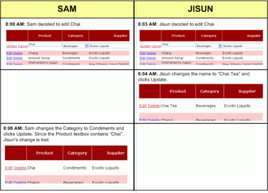](implementing-optimistic-concurrency-cs/_static/image1.png)

**Figure 1**: When Two Users Simultaneously Update a Record There s Potential for One User s Changes to Overwrite the Other s ([Click to view full-size image](implementing-optimistic-concurrency-cs/_static/image3.png))

Similarly, when two users are visiting a page, one user might be in the midst of updating a record when it is deleted by another user. Or, between when a user loads a page and when they click the Delete button, another user may have modified the contents of that record.

There are three [concurrency control](http://en.wikipedia.org/wiki/Concurrency_control) strategies available:

- **Do Nothing** -if concurrent users are modifying the same record, let the last commit win (the default behavior)
- [**Optimistic Concurrency**](http://en.wikipedia.org/wiki/Optimistic_concurrency_control) - assume that while there may be concurrency conflicts every now and then, the vast majority of the time such conflicts won't arise; therefore, if a conflict does arise, simply inform the user that their changes can't be saved because another user has modified the same data
- **Pessimistic Concurrency** - assume that concurrency conflicts are commonplace and that users won't tolerate being told their changes weren't saved due to another user's concurrent activity; therefore, when one user starts updating a record, lock it, thereby preventing any other users from editing or deleting that record until the user commits their modifications

All of our tutorials thus far have used the default concurrency resolution strategy - namely, we've let the last write win. In this tutorial we'll examine how to implement optimistic concurrency control.

> [!NOTE]
> We won't look at pessimistic concurrency examples in this tutorial series. Pessimistic concurrency is rarely used because such locks, if not properly relinquished, can prevent other users from updating data. For example, if a user locks a record for editing and then leaves for the day before unlocking it, no other user will be able to update that record until the original user returns and completes his update. Therefore, in situations where pessimistic concurrency is used, there's typically a timeout that, if reached, cancels the lock. Ticket sales websites, which lock a particular seating location for short period while the user completes the order process, is an example of pessimistic concurrency control.

## Step 1: Looking at How Optimistic Concurrency is Implemented

Optimistic concurrency control works by ensuring that the record being updated or deleted has the same values as it did when the updating or deleting process started. For example, when clicking the Edit button in an editable GridView, the record's values are read from the database and displayed in TextBoxes and other Web controls. These original values are saved by the GridView. Later, after the user makes her changes and clicks the Update button, the original values plus the new values are sent to the Business Logic Layer, and then down to the Data Access Layer. The Data Access Layer must issue a SQL statement that will only update the record if the original values that the user started editing are identical to the values still in the database. Figure 2 depicts this sequence of events.

**Figure 2**: For the Update or Delete to Succeed, the Original Values Must Be Equal to the Current Database Values ([Click to view full-size image](implementing-optimistic-concurrency-cs/_static/image6.png))

There are various approaches to implementing optimistic concurrency (see [Peter A. Bromberg](http://peterbromberg.net/)'s [Optmistic Concurrency Updating Logic](http://www.eggheadcafe.com/articles/20050719.asp) for a brief look at a number of options). The ADO.NET Typed DataSet provides one implementation that can be configured with just the tick of a checkbox. Enabling optimistic concurrency for a TableAdapter in the Typed DataSet augments the TableAdapter's `UPDATE` and `DELETE` statements to include a comparison of all of the original values in the `WHERE` clause. The following `UPDATE` statement, for example, updates the name and price of a product only if the current database values are equal to the values that were originally retrieved when updating the record in the GridView. The `@ProductName` and `@UnitPrice` parameters contain the new values entered by the user, whereas `@original_ProductName` and `@original_UnitPrice` contain the values that were originally loaded into the GridView when the Edit button was clicked:

[!code-sql[Main](implementing-optimistic-concurrency-cs/samples/sample1.sql)]

> [!NOTE]
> This `UPDATE` statement has been simplified for readability. In practice, the `UnitPrice` check in the `WHERE` clause would be more involved since `UnitPrice` can contain `NULL` s and checking if `NULL = NULL` always returns False (instead you must use `IS NULL`).

In addition to using a different underlying `UPDATE` statement, configuring a TableAdapter to use optimistic concurrency also modifies the signature of its DB direct methods. Recall from our first tutorial, [*Creating a Data Access Layer*](../introduction/creating-a-data-access-layer-cs.md), that DB direct methods were those that accepts a list of scalar values as input parameters (rather than a strongly-typed DataRow or DataTable instance). When using optimistic concurrency, the DB direct `Update()` and `Delete()` methods include input parameters for the original values as well. Moreover, the code in the BLL for using the batch update pattern (the `Update()` method overloads that accept DataRows and DataTables rather than scalar values) must be changed as well.

Rather than extend our existing DAL's TableAdapters to use optimistic concurrency (which would necessitate changing the BLL to accommodate), let's instead create a new Typed DataSet named `NorthwindOptimisticConcurrency`, to which we'll add a `Products` TableAdapter that uses optimistic concurrency. Following that, we'll create a `ProductsOptimisticConcurrencyBLL` Business Logic Layer class that has the appropriate modifications to support the optimistic concurrency DAL. Once this groundwork has been laid, we'll be ready to create the ASP.NET page.

## Step 2: Creating a Data Access Layer That Supports Optimistic Concurrency

To create a new Typed DataSet, right-click on the `DAL` folder within the `App_Code` folder and add a new DataSet named `NorthwindOptimisticConcurrency`. As we saw in the first tutorial, doing so will add a new TableAdapter to the Typed DataSet, automatically launching the TableAdapter Configuration Wizard. In the first screen, we're prompted to specify the database to connect to - connect to the same Northwind database using the `NORTHWNDConnectionString` setting from `Web.config`.

**Figure 3**: Connect to the Same Northwind Database ([Click to view full-size image](implementing-optimistic-concurrency-cs/_static/image9.png))

Next, we are prompted as to how to query the data: through an ad-hoc SQL statement, a new stored procedure, or an existing stored procedure. Since we used ad-hoc SQL queries in our original DAL, use this option here as well.

[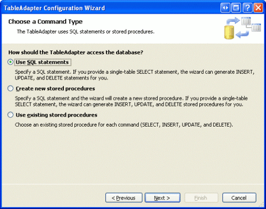](implementing-optimistic-concurrency-cs/_static/image10.png)

**Figure 4**: Specify the Data to Retrieve Using an Ad-Hoc SQL Statement ([Click to view full-size image](implementing-optimistic-concurrency-cs/_static/image12.png))

On the following screen, enter the SQL query to use to retrieve the product information. Let's use the exact same SQL query used for the `Products` TableAdapter from our original DAL, which returns all of the `Product` columns along with the product's supplier and category names:

[!code-sql[Main](implementing-optimistic-concurrency-cs/samples/sample2.sql)]

**Figure 5**: Use the Same SQL Query from the `Products` TableAdapter in the Original DAL ([Click to view full-size image](implementing-optimistic-concurrency-cs/_static/image15.png))

Before moving onto the next screen, click the Advanced Options button. To have this TableAdapter employ optimistic concurrency control, simply check the "Use optimistic concurrency" checkbox.

**Figure 6**: Enable Optimistic Concurrency Control by Checking the "Use optimistic concurrency" CheckBox ([Click to view full-size image](implementing-optimistic-concurrency-cs/_static/image18.png))

Lastly, indicate that the TableAdapter should use the data access patterns that both fill a DataTable and return a DataTable; also indicate that the DB direct methods should be created. Change the method name for the Return a DataTable pattern from GetData to GetProducts, so as to mirror the naming conventions we used in our original DAL.

[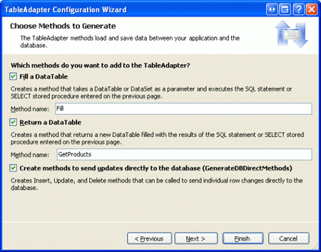](implementing-optimistic-concurrency-cs/_static/image19.png)

**Figure 7**: Have the TableAdapter Utilize All Data Access Patterns ([Click to view full-size image](implementing-optimistic-concurrency-cs/_static/image21.png))

After completing the wizard, the DataSet Designer will include a strongly-typed `Products` DataTable and TableAdapter. Take a moment to rename the DataTable from `Products` to `ProductsOptimisticConcurrency`, which you can do by right-clicking on the DataTable's title bar and choosing Rename from the context menu.

[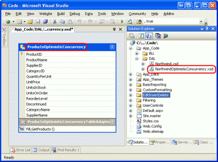](implementing-optimistic-concurrency-cs/_static/image22.png)

**Figure 8**: A DataTable and TableAdapter Have Been Added to the Typed DataSet ([Click to view full-size image](implementing-optimistic-concurrency-cs/_static/image24.png))

To see the differences between the `UPDATE` and `DELETE` queries between the `ProductsOptimisticConcurrency` TableAdapter (which uses optimistic concurrency) and the Products TableAdapter (which doesn't), click on the TableAdapter and go to the Properties window. In the `DeleteCommand` and `UpdateCommand` properties' `CommandText` subproperties you can see the actual SQL syntax that is sent to the database when the DAL's update or delete-related methods are invoked. For the `ProductsOptimisticConcurrency` TableAdapter the `DELETE` statement used is:

[!code-sql[Main](implementing-optimistic-concurrency-cs/samples/sample3.sql)]

Whereas the `DELETE` statement for the Product TableAdapter in our original DAL is the much simpler:

[!code-sql[Main](implementing-optimistic-concurrency-cs/samples/sample4.sql)]

As you can see, the `WHERE` clause in the `DELETE` statement for the TableAdapter that uses optimistic concurrency includes a comparison between each of the `Product` table's existing column values and the original values at the time the GridView (or DetailsView or FormView) was last populated. Since all fields other than `ProductID`, `ProductName`, and `Discontinued` can have `NULL` values, additional parameters and checks are included to correctly compare `NULL` values in the `WHERE` clause.

We won't be adding any additional DataTables to the optimistic concurrency-enabled DataSet for this tutorial, as our ASP.NET page will only provide updating and deleting product information. However, we do still need to add the `GetProductByProductID(productID)` method to the `ProductsOptimisticConcurrency` TableAdapter.

To accomplish this, right-click on the TableAdapter's title bar (the area right above the `Fill` and `GetProducts` method names) and choose Add Query from the context menu. This will launch the TableAdapter Query Configuration Wizard. As with our TableAdapter's initial configuration, opt to create the `GetProductByProductID(productID)` method using an ad-hoc SQL statement (see Figure 4). Since the `GetProductByProductID(productID)` method returns information about a particular product, indicate that this query is a `SELECT` query type that returns rows.

**Figure 9**: Mark the Query Type as a "`SELECT` which returns rows" ([Click to view full-size image](implementing-optimistic-concurrency-cs/_static/image27.png))

On the next screen we're prompted for the SQL query to use, with the TableAdapter's default query pre-loaded. Augment the existing query to include the clause `WHERE ProductID = @ProductID`, as shown in Figure 10.

[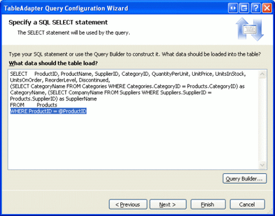](implementing-optimistic-concurrency-cs/_static/image28.png)

**Figure 10**: Add a `WHERE` Clause to the Pre-Loaded Query to Return a Specific Product Record ([Click to view full-size image](implementing-optimistic-concurrency-cs/_static/image30.png))

Finally, change the generated method names to `FillByProductID` and `GetProductByProductID`.

[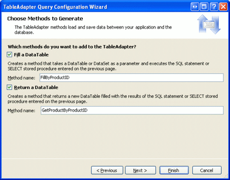](implementing-optimistic-concurrency-cs/_static/image31.png)

**Figure 11**: Rename the Methods to `FillByProductID` and `GetProductByProductID` ([Click to view full-size image](implementing-optimistic-concurrency-cs/_static/image33.png))

With this wizard complete, the TableAdapter now contains two methods for retrieving data: `GetProducts()`, which returns *all* products; and `GetProductByProductID(productID)`, which returns the specified product.

## Step 3: Creating a Business Logic Layer for the Optimistic Concurrency-Enabled DAL

Our existing `ProductsBLL` class has examples of using both the batch update and DB direct patterns. The `AddProduct` method and `UpdateProduct` overloads both use the batch update pattern, passing in a `ProductRow` instance to the TableAdapter's Update method. The `DeleteProduct` method, on the other hand, uses the DB direct pattern, calling the TableAdapter's `Delete(productID)` method.

With the new `ProductsOptimisticConcurrency` TableAdapter, the DB direct methods now require that the original values also be passed in. For example, the `Delete` method now expects ten input parameters: the original `ProductID`, `ProductName`, `SupplierID`, `CategoryID`, `QuantityPerUnit`, `UnitPrice`, `UnitsInStock`, `UnitsOnOrder`, `ReorderLevel`, and `Discontinued`. It uses these additional input parameters' values in `WHERE` clause of the `DELETE` statement sent to the database, only deleting the specified record if the database's current values map up to the original ones.

While the method signature for the TableAdapter's `Update` method used in the batch update pattern hasn't changed, the code needed to record the original and new values has. Therefore, rather than attempt to use the optimistic concurrency-enabled DAL with our existing `ProductsBLL` class, let's create a new Business Logic Layer class for working with our new DAL.

Add a class named `ProductsOptimisticConcurrencyBLL` to the `BLL` folder within the `App_Code` folder.

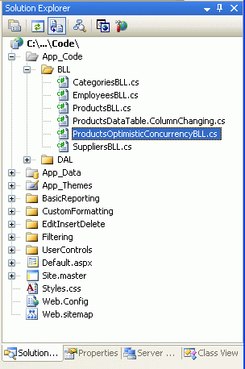

**Figure 12**: Add the `ProductsOptimisticConcurrencyBLL` Class to the BLL Folder

Next, add the following code to the `ProductsOptimisticConcurrencyBLL` class:

[!code-csharp[Main](implementing-optimistic-concurrency-cs/samples/sample5.cs)]

Note the using `NorthwindOptimisticConcurrencyTableAdapters` statement above the start of the class declaration. The `NorthwindOptimisticConcurrencyTableAdapters` namespace contains the `ProductsOptimisticConcurrencyTableAdapter` class, which provides the DAL's methods. Also before the class declaration you'll find the `System.ComponentModel.DataObject` attribute, which instructs Visual Studio to include this class in the ObjectDataSource wizard's drop-down list.

The `ProductsOptimisticConcurrencyBLL`'s `Adapter` property provides quick access to an instance of the `ProductsOptimisticConcurrencyTableAdapter` class, and follows the pattern used in our original BLL classes (`ProductsBLL`, `CategoriesBLL`, and so on). Finally, the `GetProducts()` method simply calls down into the DAL's `GetProducts()` method and returns a `ProductsOptimisticConcurrencyDataTable` object populated with a `ProductsOptimisticConcurrencyRow` instance for each product record in the database.

## Deleting a Product Using the DB Direct Pattern with Optimistic Concurrency

When using the DB direct pattern against a DAL that uses optimistic concurrency, the methods must be passed the new and original values. For deleting, there are no new values, so only the original values need be passed in. In our BLL, then, we must accept all of the original parameters as input parameters. Let's have the `DeleteProduct` method in the `ProductsOptimisticConcurrencyBLL` class use the DB direct method. This means that this method needs to take in all ten product data fields as input parameters, and pass these to the DAL, as shown in the following code:

[!code-csharp[Main](implementing-optimistic-concurrency-cs/samples/sample6.cs)]

If the original values - those values that were last loaded into the GridView (or DetailsView or FormView) - differ from the values in the database when the user clicks the Delete button the `WHERE` clause won't match up with any database record and no records will be affected. Hence, the TableAdapter's `Delete` method will return `0` and the BLL's `DeleteProduct` method will return `false`.

## Updating a Product Using the Batch Update Pattern with Optimistic Concurrency

As noted earlier, the TableAdapter's `Update` method for the batch update pattern has the same method signature regardless of whether or not optimistic concurrency is employed. Namely, the `Update` method expects a DataRow, an array of DataRows, a DataTable, or a Typed DataSet. There are no additional input parameters for specifying the original values. This is possible because the DataTable keeps track of the original and modified values for its DataRow(s). When the DAL issues its `UPDATE` statement, the `@original_ColumnName` parameters are populated with the DataRow's original values, whereas the `@ColumnName` parameters are populated with the DataRow's modified values.

In the `ProductsBLL` class (which uses our original, non-optimistic concurrency DAL), when using the batch update pattern to update product information our code performs the following sequence of events:

1. Read the current database product information into a `ProductRow` instance using the TableAdapter's `GetProductByProductID(productID)` method
2. Assign the new values to the `ProductRow` instance from Step 1
3. Call the TableAdapter's `Update` method, passing in the `ProductRow` instance

This sequence of steps, however, won't correctly support optimistic concurrency because the `ProductRow` populated in Step 1 is populated directly from the database, meaning that the original values used by the DataRow are those that currently exist in the database, and not those that were bound to the GridView at the start of the editing process. Instead, when using an optimistic concurrency-enabled DAL, we need to alter the `UpdateProduct` method overloads to use the following steps:

1. Read the current database product information into a `ProductsOptimisticConcurrencyRow` instance using the TableAdapter's `GetProductByProductID(productID)` method
2. Assign the *original* values to the `ProductsOptimisticConcurrencyRow` instance from Step 1
3. Call the `ProductsOptimisticConcurrencyRow` instance's `AcceptChanges()` method, which instructs the DataRow that its current values are the "original" ones
4. Assign the *new* values to the `ProductsOptimisticConcurrencyRow` instance
5. Call the TableAdapter's `Update` method, passing in the `ProductsOptimisticConcurrencyRow` instance

Step 1 reads in all of the current database values for the specified product record. This step is superfluous in the `UpdateProduct` overload that updates *all* of the product columns (as these values are overwritten in Step 2), but is essential for those overloads where only a subset of the column values are passed in as input parameters. Once the original values have been assigned to the `ProductsOptimisticConcurrencyRow` instance, the `AcceptChanges()` method is called, which marks the current DataRow values as the original values to be used in the `@original_ColumnName` parameters in the `UPDATE` statement. Next, the new parameter values are assigned to the `ProductsOptimisticConcurrencyRow` and, finally, the `Update` method is invoked, passing in the DataRow.

The following code shows the `UpdateProduct` overload that accepts all product data fields as input parameters. While not shown here, the `ProductsOptimisticConcurrencyBLL` class included in the download for this tutorial also contains an `UpdateProduct` overload that accepts just the product's name and price as input parameters.

[!code-csharp[Main](implementing-optimistic-concurrency-cs/samples/sample7.cs)]

## Step 4: Passing the Original and New Values From the ASP.NET Page to the BLL Methods

With the DAL and BLL complete, all that remains is to create an ASP.NET page that can utilize the optimistic concurrency logic built in to the system. Specifically, the data Web control (the GridView, DetailsView, or FormView) must remember its original values and the ObjectDataSource must pass both sets of values to the Business Logic Layer. Furthermore, the ASP.NET page must be configured to gracefully handle concurrency violations.

Start by opening the `OptimisticConcurrency.aspx` page in the `EditInsertDelete` folder and adding a GridView to the Designer, setting its `ID` property to `ProductsGrid`. From the GridView's smart tag, opt to create a new ObjectDataSource named `ProductsOptimisticConcurrencyDataSource`. Since we want this ObjectDataSource to use the DAL that supports optimistic concurrency, configure it to use the `ProductsOptimisticConcurrencyBLL` object.

[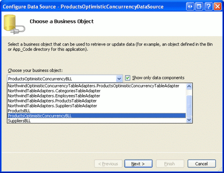](implementing-optimistic-concurrency-cs/_static/image35.png)

**Figure 13**: Have the ObjectDataSource Use the `ProductsOptimisticConcurrencyBLL` Object ([Click to view full-size image](implementing-optimistic-concurrency-cs/_static/image37.png))

Choose the `GetProducts`, `UpdateProduct`, and `DeleteProduct` methods from drop-down lists in the wizard. For the UpdateProduct method, use the overload that accepts all of the product's data fields.

## Configuring the ObjectDataSource Control's Properties

After completing the wizard, the ObjectDataSource's declarative markup should look like the following:

[!code-aspx[Main](implementing-optimistic-concurrency-cs/samples/sample8.aspx)]

As you can see, the `DeleteParameters` collection contains a `Parameter` instance for each of the ten input parameters in the `ProductsOptimisticConcurrencyBLL` class's `DeleteProduct` method. Likewise, the `UpdateParameters` collection contains a `Parameter` instance for each of the input parameters in `UpdateProduct`.

For those previous tutorials that involved data modification, we'd remove the ObjectDataSource's `OldValuesParameterFormatString` property at this point, since this property indicates that the BLL method expects the old (or original) values to be passed in as well as the new values. Furthermore, this property value indicates the input parameter names for the original values. Since we are passing in the original values into the BLL, do *not* remove this property.

> [!NOTE]
> The value of the `OldValuesParameterFormatString` property must map to the input parameter names in the BLL that expect the original values. Since we named these parameters `original_productName`, `original_supplierID`, and so on, you can leave the `OldValuesParameterFormatString` property value as `original_{0}`. If, however, the BLL methods' input parameters had names like `old_productName`, `old_supplierID`, and so on, you'd need to update the `OldValuesParameterFormatString` property to `old_{0}`.

There's one final property setting that needs to be made in order for the ObjectDataSource to correctly pass the original values to the BLL methods. The ObjectDataSource has a [ConflictDetection property](https://msdn.microsoft.com/en-US/library/system.web.ui.webcontrols.objectdatasource.conflictdetection.aspx) that can be assigned to [one of two values](https://msdn.microsoft.com/en-US/library/system.web.ui.conflictoptions.aspx):

- `OverwriteChanges` - the default value; does not send the original values to the BLL methods' original input parameters
- `CompareAllValues` - does send the original values to the BLL methods; choose this option when using optimistic concurrency

Take a moment to set the `ConflictDetection` property to `CompareAllValues`.

## Configuring the GridView's Properties and Fields

With the ObjectDataSource's properties properly configured, let's turn our attention to setting up the GridView. First, since we want the GridView to support editing and deleting, click the Enable Editing and Enable Deleting checkboxes from the GridView's smart tag. This will add a CommandField whose `ShowEditButton` and `ShowDeleteButton` are both set to `true`.

When bound to the `ProductsOptimisticConcurrencyDataSource` ObjectDataSource, the GridView contains a field for each of the product's data fields. While such a GridView can be edited, the user experience is anything but acceptable. The `CategoryID` and `SupplierID` BoundFields will render as TextBoxes, requiring the user to enter the appropriate category and supplier as ID numbers. There will be no formatting for the numeric fields and no validation controls to ensure that the product's name has been supplied and that the unit price, units in stock, units on order, and reorder level values are both proper numeric values and are greater than or equal to zero.

As we discussed in the *Adding Validation Controls to the Editing and Inserting Interfaces* and *Customizing the Data Modification Interface* tutorials, the user interface can be customized by replacing the BoundFields with TemplateFields. I've modified this GridView and its editing interface in the following ways:

- Removed the `ProductID`, `SupplierName`, and `CategoryName` BoundFields
- Converted the `ProductName` BoundField to a TemplateField and added a RequiredFieldValidation control.
- Converted the `CategoryID` and `SupplierID` BoundFields to TemplateFields, and adjusted the editing interface to use DropDownLists rather than TextBoxes. In these TemplateFields' `ItemTemplates`, the `CategoryName` and `SupplierName` data fields are displayed.
- Converted the `UnitPrice`, `UnitsInStock`, `UnitsOnOrder`, and `ReorderLevel` BoundFields to TemplateFields and added CompareValidator controls.

Since we've already examined how to accomplish these tasks in previous tutorials, I'll just list the final declarative syntax here and leave the implementation as practice.

[!code-aspx[Main](implementing-optimistic-concurrency-cs/samples/sample9.aspx)]

We're very close to having a fully-working example. However, there are a few subtleties that will creep up and cause us problems. Additionally, we still need some interface that alerts the user when a concurrency violation has occurred.

> [!NOTE]
> In order for a data Web control to correctly pass the original values to the ObjectDataSource (which are then passed to the BLL), it's vital that the GridView's `EnableViewState` property is set to `true` (the default). If you disable view state, the original values are lost on postback.

## Passing the Correct Original Values to the ObjectDataSource

There are a couple of problems with the way the GridView has been configured. If the ObjectDataSource's `ConflictDetection` property is set to `CompareAllValues` (as is ours), when the ObjectDataSource's `Update()` or `Delete()` methods are invoked by the GridView (or DetailsView or FormView), the ObjectDataSource attempts to copy the GridView's original values into its appropriate `Parameter` instances. Refer back to Figure 2 for a graphical representation of this process.

Specifically, the GridView's original values are assigned the values in the two-way databinding statements each time the data is bound to the GridView. Therefore, it's essential that the required original values all are captured via two-way databinding and that they are provided in a convertible format.

To see why this is important, take a moment to visit our page in a browser. As expected, the GridView lists each product with an Edit and Delete button in the leftmost column.

[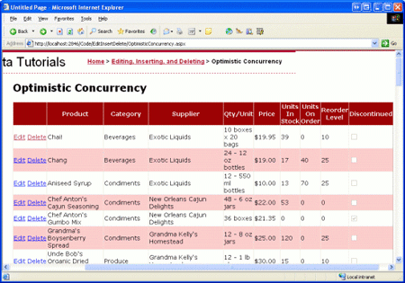](implementing-optimistic-concurrency-cs/_static/image38.png)

**Figure 14**: The Products are Listed in a GridView ([Click to view full-size image](implementing-optimistic-concurrency-cs/_static/image40.png))

If you click the Delete button for any product, a `FormatException` is thrown.

**Figure 15**: Attempting to Delete Any Product Results in a `FormatException` ([Click to view full-size image](implementing-optimistic-concurrency-cs/_static/image43.png))

The `FormatException` is raised when the ObjectDataSource attempts to read in the original `UnitPrice` value. Since the `ItemTemplate` has the `UnitPrice` formatted as a currency (`<%# Bind("UnitPrice", "{0:C}") %>`), it includes a currency symbol, like $19.95. The `FormatException` occurs as the ObjectDataSource attempts to convert this string into a `decimal`. To circumvent this problem, we have a number of options:

- Remove the currency formatting from the `ItemTemplate`. That is, instead of using `<%# Bind("UnitPrice", "{0:C}") %>`, simply use `<%# Bind("UnitPrice") %>`. The downside of this is that the price is no longer formatted.
- Display the `UnitPrice` formatted as a currency in the `ItemTemplate`, but use the `Eval` keyword to accomplish this. Recall that `Eval` performs one-way databinding. We still need to provide the `UnitPrice` value for the original values, so we'll still need a two-way databinding statement in the `ItemTemplate`, but this can be placed in a Label Web control whose `Visible` property is set to `false`. We could use the following markup in the ItemTemplate:

[!code-aspx[Main](implementing-optimistic-concurrency-cs/samples/sample10.aspx)]

- Remove the currency formatting from the `ItemTemplate`, using `<%# Bind("UnitPrice") %>`. In the GridView's `RowDataBound` event handler, programmatically access the Label Web control within which the `UnitPrice` value is displayed and set its `Text` property to the formatted version.
- Leave the `UnitPrice` formatted as a currency. In the GridView's `RowDeleting` event handler, replace the existing original `UnitPrice` value ($19.95) with an actual decimal value using `Decimal.Parse`. We saw how to accomplish something similar in the `RowUpdating` event handler in the [*Handling BLL- and DAL-Level Exceptions in an ASP.NET Page*](handling-bll-and-dal-level-exceptions-in-an-asp-net-page-cs.md) tutorial.

For my example I chose to go with the second approach, adding a hidden Label Web control whose `Text` property is two-way data bound to the unformatted `UnitPrice` value.

After solving this problem, try clicking the Delete button for any product again. This time you'll get an `InvalidOperationException` when the ObjectDataSource attempts to invoke the BLL's `UpdateProduct` method.

**Figure 16**: The ObjectDataSource Cannot Find a Method with the Input Parameters it Wants to Send ([Click to view full-size image](implementing-optimistic-concurrency-cs/_static/image46.png))

Looking at the exception's message, it's clear that the ObjectDataSource wants to invoke a BLL `DeleteProduct` method that includes `original_CategoryName` and `original_SupplierName` input parameters. This is because the `ItemTemplate` s for the `CategoryID` and `SupplierID` TemplateFields currently contain two-way Bind statements with the `CategoryName` and `SupplierName` data fields. Instead, we need to include `Bind` statements with the `CategoryID` and `SupplierID` data fields. To accomplish this, replace the existing Bind statements with `Eval` statements, and then add hidden Label controls whose `Text` properties are bound to the `CategoryID` and `SupplierID` data fields using two-way databinding, as shown below:

[!code-aspx[Main](implementing-optimistic-concurrency-cs/samples/sample11.aspx)]

With these changes, we are now able to successfully delete and edit product information! In Step 5 we'll look at how to verify that concurrency violations are being detected. But for now, take a few minutes to try updating and deleting a few records to ensure that updating and deleting for a single user works as expected.

## Step 5: Testing the Optimistic Concurrency Support

In order to verify that concurrency violations are being detected (rather than resulting in data being blindly overwritten), we need to open two browser windows to this page. In both browser instances, click on the Edit button for Chai. Then, in just one of the browsers, change the name to "Chai Tea" and click Update. The update should succeed and return the GridView to its pre-editing state, with "Chai Tea" as the new product name.

In the other browser window instance, however, the product name TextBox still shows "Chai". In this second browser window, update the `UnitPrice` to `25.00`. Without optimistic concurrency support, clicking update in the second browser instance would change the product name back to "Chai", thereby overwriting the changes made by the first browser instance. With optimistic concurrency employed, however, clicking the Update button in the second browser instance results in a [DBConcurrencyException](https://msdn.microsoft.com/en-us/library/system.data.dbconcurrencyexception.aspx).

[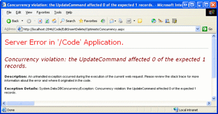](implementing-optimistic-concurrency-cs/_static/image47.png)

**Figure 17**: When a Concurrency Violation is Detected, a `DBConcurrencyException` is Thrown ([Click to view full-size image](implementing-optimistic-concurrency-cs/_static/image49.png))

The `DBConcurrencyException` is only thrown when the DAL's batch update pattern is utilized. The DB direct pattern does not raise an exception, it merely indicates that no rows were affected. To illustrate this, return both browser instances' GridView to their pre-editing state. Next, in the first browser instance, click the Edit button and change the product name from "Chai Tea" back to "Chai" and click Update. In the second browser window, click the Delete button for Chai.

Upon clicking Delete, the page posts back, the GridView invokes the ObjectDataSource's `Delete()` method, and the ObjectDataSource calls down into the `ProductsOptimisticConcurrencyBLL` class's `DeleteProduct` method, passing along the original values. The original `ProductName` value for the second browser instance is "Chai Tea", which doesn't match up with the current `ProductName` value in the database. Therefore the `DELETE` statement issued to the database affects zero rows since there's no record in the database that the `WHERE` clause satisfies. The `DeleteProduct` method returns `false` and the ObjectDataSource's data is rebound to the GridView.

From the end user's perspective, clicking on the Delete button for Chai Tea in the second browser window caused the screen to flash and, upon coming back, the product is still there, although now it's listed as "Chai" (the product name change made by the first browser instance). If the user clicks the Delete button again, the Delete will succeed, as the GridView's original `ProductName` value ("Chai") now matches up with the value in the database.

In both of these cases, the user experience is far from ideal. We clearly don't want to show the user the nitty-gritty details of the `DBConcurrencyException` exception when using the batch update pattern. And the behavior when using the DB direct pattern is somewhat confusing as the users command failed, but there was no precise indication of why.

To remedy these two issues, we can create Label Web controls on the page that provide an explanation to why an update or delete failed. For the batch update pattern, we can determine whether or not a `DBConcurrencyException` exception occurred in the GridView's post-level event handler, displaying the warning label as needed. For the DB direct method, we can examine the return value of the BLL method (which is `true` if one row was affected, `false` otherwise) and display an informational message as needed.

## Step 6: Adding Informational Messages and Displaying Them in the Face of a Concurrency Violation

When a concurrency violation occurs, the behavior exhibited depends on whether the DAL's batch update or DB direct pattern was used. Our tutorial uses both patterns, with the batch update pattern being used for updating and the DB direct pattern used for deleting. To get started, let's add two Label Web controls to our page that explain that a concurrency violation occurred when attempting to delete or update data. Set the Label control's `Visible` and `EnableViewState` properties to `false`; this will cause them to be hidden on each page visit except for those particular page visits where their `Visible` property is programmatically set to `true`.

[!code-aspx[Main](implementing-optimistic-concurrency-cs/samples/sample12.aspx)]

In addition to setting their `Visible`, `EnabledViewState`, and `Text` properties, I've also set the `CssClass` property to `Warning`, which causes the Label's to be displayed in a large, red, italic, bold font. This CSS `Warning` class was defined and added to Styles.css back in the *Examining the Events Associated with Inserting, Updating, and Deleting* tutorial.

After adding these Labels, the Designer in Visual Studio should look similar to Figure 18.

**Figure 18**: Two Label Controls Have Been Added to the Page ([Click to view full-size image](implementing-optimistic-concurrency-cs/_static/image52.png))

With these Label Web controls in place, we're ready to examine how to determine when a concurrency violation has occurred, at which point the appropriate Label's `Visible` property can be set to `true`, displaying the informational message.

## Handling Concurrency Violations When Updating

Let's first look at how to handle concurrency violations when using the batch update pattern. Since such violations with the batch update pattern cause a `DBConcurrencyException` exception to be thrown, we need to add code to our ASP.NET page to determine whether a `DBConcurrencyException` exception occurred during the update process. If so, we should display a message to the user explaining that their changes were not saved because another user had modified the same data between when they started editing the record and when they clicked the Update button.

As we saw in the *Handling BLL- and DAL-Level Exceptions in an ASP.NET Page* tutorial, such exceptions can be detected and suppressed in the data Web control's post-level event handlers. Therefore, we need to create an event handler for the GridView's `RowUpdated` event that checks if a `DBConcurrencyException` exception has been thrown. This event handler is passed a reference to any exception that was raised during the updating process, as shown in the event handler code below:

[!code-csharp[Main](implementing-optimistic-concurrency-cs/samples/sample13.cs)]

In the face of a `DBConcurrencyException` exception, this event handler displays the `UpdateConflictMessage` Label control and indicates that the exception has been handled. With this code in place, when a concurrency violation occurs when updating a record, the user's changes are lost, since they would have overwritten another user's modifications at the same time. In particular, the GridView is returned to its pre-editing state and bound to the current database data. This will update the GridView row with the other user's changes, which were previously not visible. Additionally, the `UpdateConflictMessage` Label control will explain to the user what just happened. This sequence of events is detailed in Figure 19.

**Figure 19**: A User s Updates are Lost in the Face of a Concurrency Violation ([Click to view full-size image](implementing-optimistic-concurrency-cs/_static/image55.png))

> [!NOTE]
> Alternatively, rather than returning the GridView to the pre-editing state, we could leave the GridView in its editing state by setting the `KeepInEditMode` property of the passed-in `GridViewUpdatedEventArgs` object to true. If you take this approach, however, be certain to rebind the data to the GridView (by invoking its `DataBind()` method) so that the other user's values are loaded into the editing interface. The code available for download with this tutorial has these two lines of code in the `RowUpdated` event handler commented out; simply uncomment these lines of code to have the GridView remain in edit mode after a concurrency violation.

## Responding to Concurrency Violations When Deleting

With the DB direct pattern, there is no exception raised in the face of a concurrency violation. Instead, the database statement simply affects no records, as the WHERE clause does not match with any record. All of the data modification methods created in the BLL have been designed such that they return a Boolean value indicating whether or not they affected precisely one record. Therefore, to determine if a concurrency violation occurred when deleting a record, we can examine the return value of the BLL's `DeleteProduct` method.

The return value for a BLL method can be examined in the ObjectDataSource's post-level event handlers through the `ReturnValue` property of the `ObjectDataSourceStatusEventArgs` object passed into the event handler. Since we are interested in determining the return value from the `DeleteProduct` method, we need to create an event handler for the ObjectDataSource's `Deleted` event. The `ReturnValue` property is of type `object` and can be `null` if an exception was raised and the method was interrupted before it could return a value. Therefore, we should first ensure that the `ReturnValue` property is not `null` and is a Boolean value. Assuming this check passes, we show the `DeleteConflictMessage` Label control if the `ReturnValue` is `false`. This can be accomplished by using the following code:

[!code-csharp[Main](implementing-optimistic-concurrency-cs/samples/sample14.cs)]

In the face of a concurrency violation, the user's delete request is canceled. The GridView is refreshed, showing the changes that occurred for that record between the time the user loaded the page and when he clicked the Delete button. When such a violation transpires, the `DeleteConflictMessage` Label is shown, explaining what just happened (see Figure 20).

[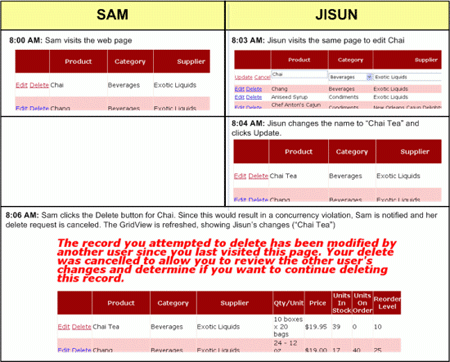](implementing-optimistic-concurrency-cs/_static/image56.png)

**Figure 20**: A User s Delete is Canceled in the Face of a Concurrency Violation ([Click to view full-size image](implementing-optimistic-concurrency-cs/_static/image58.png))

## Summary

Opportunities for concurrency violations exist in every application that allows multiple, concurrent users to update or delete data. If such violations are not accounted for, when two users simultaneously update the same data whoever gets in the last write "wins," overwriting the other user's changes changes. Alternatively, developers can implement either optimistic or pessimistic concurrency control. Optimistic concurrency control assumes that concurrency violations are infrequent and simply disallows an update or delete command that would constitute a concurrency violation. Pessimistic concurrency control assumes that concurrency violations are frequent and simply rejecting one user's update or delete command is not acceptable. With pessimistic concurrency control, updating a record involves locking it, thereby preventing any other users from modifying or deleting the record while it is locked.

The Typed DataSet in .NET provides functionality for supporting optimistic concurrency control. In particular, the `UPDATE` and `DELETE` statements issued to the database include all of the table's columns, thereby ensuring that the update or delete will only occur if the record's current data matches with the original data the user had when performing their update or delete. Once the DAL has been configured to support optimistic concurrency, the BLL methods need to be updated. Additionally, the ASP.NET page that calls down into the BLL must be configured such that the ObjectDataSource retrieves the original values from its data Web control and passes them down into the BLL.

As we saw in this tutorial, implementing optimistic concurrency control in an ASP.NET web application involves updating the DAL and BLL and adding support in the ASP.NET page. Whether or not this added work is a wise investment of your time and effort depends on your application. If you infrequently have concurrent users updating data, or the data they are updating is different from one another, then concurrency control is not a key issue. If, however, you routinely have multiple users on your site working with the same data, concurrency control can help prevent one user's updates or deletes from unwittingly overwriting another's.

Happy Programming!

## About the Author

[Scott Mitchell](http://www.4guysfromrolla.com/ScottMitchell.shtml), author of seven ASP/ASP.NET books and founder of [4GuysFromRolla.com](http://www.4guysfromrolla.com), has been working with Microsoft Web technologies since 1998. Scott works as an independent consultant, trainer, and writer. His latest book is [*Sams Teach Yourself ASP.NET 2.0 in 24 Hours*](https://www.amazon.com/exec/obidos/ASIN/0672327384/4guysfromrollaco). He can be reached at [mitchell@4GuysFromRolla.com.](mailto:mitchell@4GuysFromRolla.com) or via his blog, which can be found at [http://ScottOnWriting.NET](http://ScottOnWriting.NET).

>[!div class="step-by-step"]
[Previous](customizing-the-data-modification-interface-cs.md)
[Next](adding-client-side-confirmation-when-deleting-cs.md)