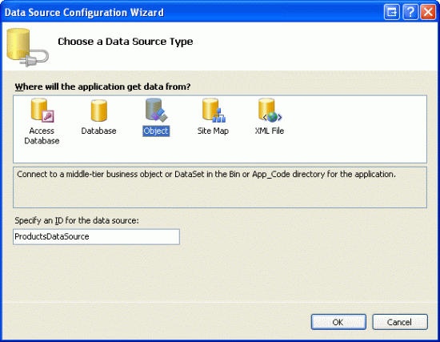
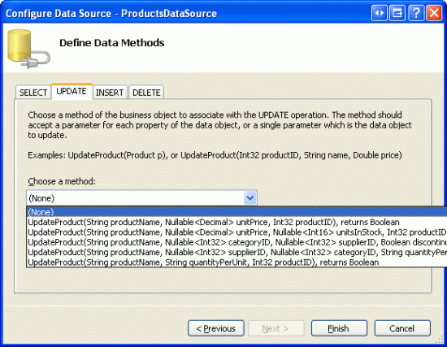
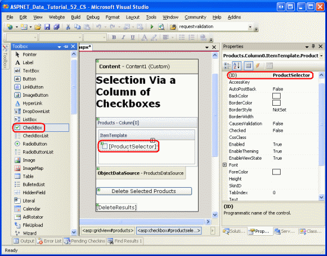
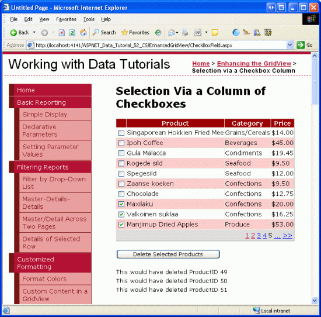

Adding a GridView Column of Checkboxes (C#)
====================
by [Scott Mitchell](https://twitter.com/ScottOnWriting)

[Download Sample App](http://download.microsoft.com/download/4/a/7/4a7a3b18-d80e-4014-8e53-a6a2427f0d93/ASPNET_Data_Tutorial_52_CS.exe) or [Download PDF](adding-a-gridview-column-of-checkboxes-cs/_static/datatutorial52cs1.pdf)

> This tutorial looks at how to add a column of check boxes to a GridView control to provide the user with an intuitive way of selecting multiple rows of the GridView.

## Introduction

In the preceding tutorial we examined how to add a column of radio buttons to the GridView for the purpose of selecting a particular record. A column of radio buttons is a suitable user interface when the user is limited to choosing at most one item from the grid. At times, however, we may want to allow the user to pick an arbitrary number of items from the grid. Web-based email clients, for example, typically display the list of messages with a column of checkboxes. The user can select an arbitrary number of messages and then perform some action, such as moving the emails to another folder or deleting them.

In this tutorial we will see how to add a column of checkboxes and how to determine what checkboxes were checked on postback. In particular, we'll build an example that closely mimics the web-based email client user interface. Our example will include a paged GridView listing the products in the `Products` database table with a checkbox in each row (see Figure 1). A Delete Selected Products button, when clicked, will delete those products selected.

**Figure 1**: Each Product Row Includes a Checkbox ([Click to view full-size image](adding-a-gridview-column-of-checkboxes-cs/_static/image2.png))

## Step 1: Adding a Paged GridView that Lists Product Information

Before we worry about adding a column of checkboxes, let s first focus on listing the products in a GridView that supports paging. Start by opening the `CheckBoxField.aspx` page in the `EnhancedGridView` folder and drag a GridView from the Toolbox onto the Designer, setting its `ID` to `Products`. Next, choose to bind the GridView to a new ObjectDataSource named `ProductsDataSource`. Configure the ObjectDataSource to use the `ProductsBLL` class, calling the `GetProducts()` method to return the data. Since this GridView will be read-only, set the drop-down lists in the UPDATE, INSERT, and DELETE tabs to (None) .

**Figure 2**: Create a New ObjectDataSource Named `ProductsDataSource` ([Click to view full-size image](adding-a-gridview-column-of-checkboxes-cs/_static/image4.png))

**Figure 3**: Configure the ObjectDataSource to Retrieve Data Using the `GetProducts()` Method ([Click to view full-size image](adding-a-gridview-column-of-checkboxes-cs/_static/image6.png))

**Figure 4**: Set the Drop-Down Lists in the UPDATE, INSERT, and DELETE Tabs to (None) ([Click to view full-size image](adding-a-gridview-column-of-checkboxes-cs/_static/image8.png))

After completing the Configure Data Source wizard, Visual Studio will automatically create BoundColumns and a CheckBoxColumn for the product-related data fields. Like we did in the previous tutorial, remove all but the `ProductName`, `CategoryName`, and `UnitPrice` BoundFields, and change the `HeaderText` properties to Product, Category, and Price. Configure the `UnitPrice` BoundField so that its value is formatted as a currency. Also configure the GridView to support paging by checking the Enable Paging checkbox from the smart tag.

Let s also add the user interface for deleting the selected products. Add a Button Web control beneath the GridView, setting its `ID` to `DeleteSelectedProducts` and its `Text` property to Delete Selected Products. Rather than actually deleting products from the database, for this example we'll just display a message stating the products that would have been deleted. To accommodate this, add a Label Web control beneath the Button. Set its ID to `DeleteResults`, clear out its `Text` property, and set its `Visible` and `EnableViewState` properties to `false`.

After making these changes, the GridView, ObjectDataSource, Button, and Label s declarative markup should similar to the following:

[!code-aspx[Main](adding-a-gridview-column-of-checkboxes-cs/samples/sample1.aspx)]

Take a moment to view the page in a browser (see Figure 5). At this point you should see the name, category, and price of the first ten products.

**Figure 5**: The Name, Category, and Price of the First Ten Products are Listed ([Click to view full-size image](adding-a-gridview-column-of-checkboxes-cs/_static/image10.png))

## Step 2: Adding a Column of Checkboxes

Since ASP.NET 2.0 includes a CheckBoxField, one might think that it could be used to add a column of checkboxes to a GridView. Unfortunately, that is not the case, as the CheckBoxField is designed to work with a Boolean data field. That is, in order to use the CheckBoxField we must specify the underlying data field whose value is consulted to determine whether the rendered checkbox is checked. We cannot use the CheckBoxField to just include a column of unchecked checkboxes.

Instead, we must add a TemplateField and add a CheckBox Web control to its `ItemTemplate`. Go ahead and add a TemplateField to the `Products` GridView and make it the first (far-left) field. From the GridView s smart tag, click on the Edit Templates link and then drag a CheckBox Web control from the Toolbox into the `ItemTemplate`. Set this CheckBox s `ID` property to `ProductSelector`.

**Figure 6**: Add a CheckBox Web Control Named `ProductSelector` to the TemplateField s `ItemTemplate` ([Click to view full-size image](adding-a-gridview-column-of-checkboxes-cs/_static/image12.png))

With the TemplateField and CheckBox Web control added, each row now includes a checkbox. Figure 7 shows this page, when viewed through a browser, after the TemplateField and CheckBox have been added.

**Figure 7**: Each Product Row Now Includes a Checkbox ([Click to view full-size image](adding-a-gridview-column-of-checkboxes-cs/_static/image14.png))

## Step 3: Determining What Checkboxes Were Checked On Postback

At this point we have a column of checkboxes but no way to determine what checkboxes were checked on postback. When the Delete Selected Products button is clicked, though, we need to know what checkboxes were checked in order to delete those products.

The GridView s [`Rows` property](https://msdn.microsoft.com/en-us/library/system.web.ui.webcontrols.gridview.rows.aspx) provides access to the data rows in the GridView. We can iterate through these rows, programmatically access the CheckBox control, and then consult its `Checked` property to determine whether the CheckBox has been selected.

Create an event handler for the `DeleteSelectedProducts` Button Web control s `Click` event and add the following code:

[!code-csharp[Main](adding-a-gridview-column-of-checkboxes-cs/samples/sample2.cs)]

The `Rows` property returns a collection of `GridViewRow` instances that makeup the GridView s data rows. The `foreach` loop here enumerates this collection. For each `GridViewRow` object, the row s CheckBox is programmatically accessed using `row.FindControl("controlID")`. If the CheckBox is checked, the row s corresponding `ProductID` value is retrieved from the `DataKeys` collection. In this exercise, we simply display an informative message in the `DeleteResults` Label, although in a working application we d instead make a call to the `ProductsBLL` class s `DeleteProduct(productID)` method.

With the addition of this event handler, clicking the Delete Selected Products button now displays the `ProductID` s of the selected products.

**Figure 8**: When the Delete Selected Products Button is Clicked the Selected Products `ProductID` s are Listed ([Click to view full-size image](adding-a-gridview-column-of-checkboxes-cs/_static/image16.png))

## Step 4: Adding Check All and Uncheck All Buttons

If a user wants to delete all products on the current page, they must check each of the ten checkboxes. We can help expedite this process by adding a Check All button that, when clicked, selects all of the checkboxes in the grid. An Uncheck All button would be equally helpful.

Add two Button Web controls to the page, placing them above the GridView. Set the first one s `ID` to `CheckAll` and its `Text` property to Check All ; set the second one s `ID` to `UncheckAll` and its `Text` property to Uncheck All .

[!code-aspx[Main](adding-a-gridview-column-of-checkboxes-cs/samples/sample3.aspx)]

Next, create a method in the code-behind class named `ToggleCheckState(checkState)` that, when invoked, enumerates the `Products` GridView s `Rows` collection and sets each CheckBox s `Checked` property to the value of the passed in *checkState* parameter.

[!code-csharp[Main](adding-a-gridview-column-of-checkboxes-cs/samples/sample4.cs)]

Next, create `Click` event handlers for the `CheckAll` and `UncheckAll` buttons. In `CheckAll` s event handler, simply call `ToggleCheckState(true)`; in `UncheckAll`, call `ToggleCheckState(false)`.

[!code-csharp[Main](adding-a-gridview-column-of-checkboxes-cs/samples/sample5.cs)]

With this code, clicking the Check All button causes a postback and checks all of the checkboxes in the GridView. Likewise, clicking Uncheck All unselects all checkboxes. Figure 9 shows the screen after the Check All button has been checked.

**Figure 9**: Clicking the Check All Button Selects All Checkboxes ([Click to view full-size image](adding-a-gridview-column-of-checkboxes-cs/_static/image18.png))

> [!NOTE]
> When displaying a column of checkboxes, one approach for selecting or unselecting all of the checkboxes is through a checkbox in the header row. Moreover, the current Check All / Uncheck All implementation requires a postback. The checkboxes can be checked or unchecked, however, entirely through client-side script, thereby providing a snappier user experience. To explore using a header row checkbox for Check All and Uncheck All in detail, along with a discussion on using client-side techniques, check out [Checking All CheckBoxes in a GridView Using Client-Side Script and a Check All CheckBox](http://aspnet.4guysfromrolla.com/articles/053106-1.aspx).

## Summary

In cases where you need to let users choose an arbitrary number of rows from a GridView before proceeding, adding a column of checkboxes is one option. As we saw in this tutorial, including a column of checkboxes in the GridView entails adding a TemplateField with a CheckBox Web control. By using a Web control (versus injecting markup directly into the template, as we did in the previous tutorial) ASP.NET automatically remembers what CheckBoxes were and were not checked across postback. We can also programmatically access the CheckBoxes in code to determine whether a given CheckBox is checked, or to chnage the checked state.

This tutorial and the last one looked at adding a row selector column to the GridView. In our next tutorial we'll examine how, with a bit of work, we can add inserting capabilities to the GridView.

Happy Programming!

## About the Author

[Scott Mitchell](http://www.4guysfromrolla.com/ScottMitchell.shtml), author of seven ASP/ASP.NET books and founder of [4GuysFromRolla.com](http://www.4guysfromrolla.com), has been working with Microsoft Web technologies since 1998. Scott works as an independent consultant, trainer, and writer. His latest book is [*Sams Teach Yourself ASP.NET 2.0 in 24 Hours*](https://www.amazon.com/exec/obidos/ASIN/0672327384/4guysfromrollaco). He can be reached at [mitchell@4GuysFromRolla.com.](mailto:mitchell@4GuysFromRolla.com) or via his blog, which can be found at [http://ScottOnWriting.NET](http://ScottOnWriting.NET).

>[!div class="step-by-step"]
[Previous](adding-a-gridview-column-of-radio-buttons-cs.md)
[Next](inserting-a-new-record-from-the-gridview-s-footer-cs.md)