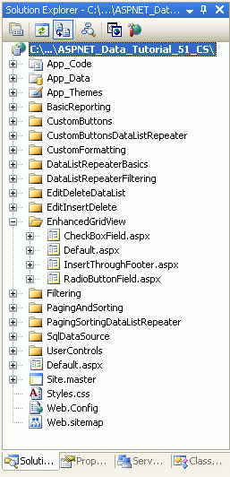
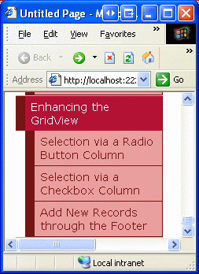
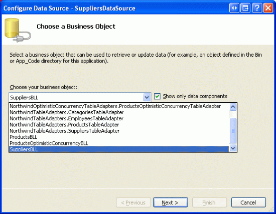
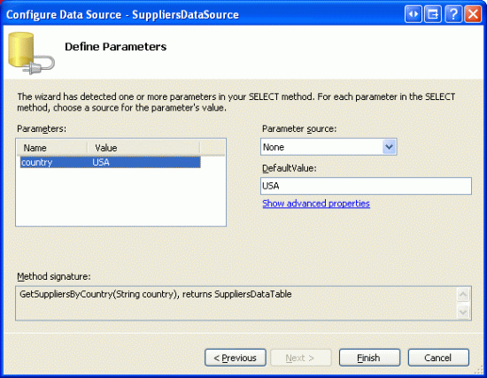
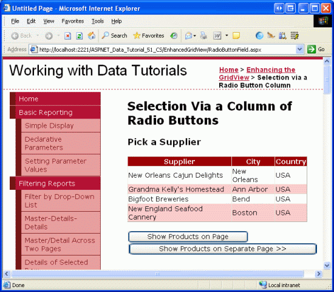
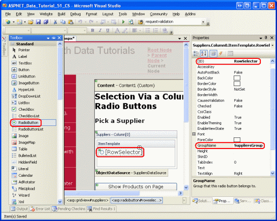
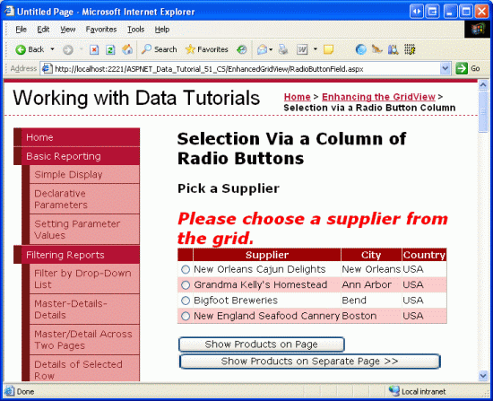
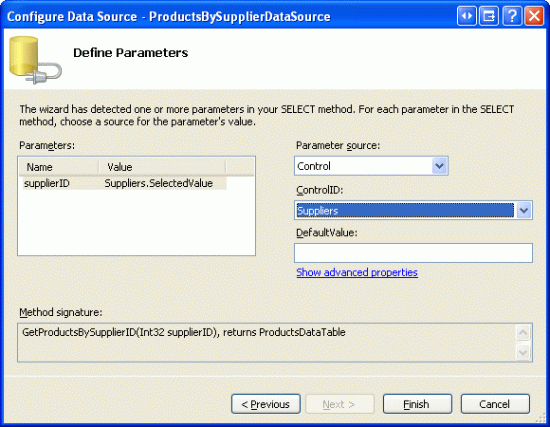
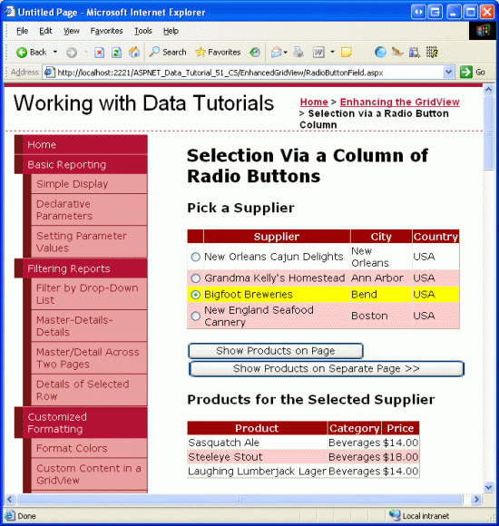

Adding a GridView Column of Radio Buttons (C#)
====================
by [Scott Mitchell](https://twitter.com/ScottOnWriting)

[Download Sample App](http://download.microsoft.com/download/4/a/7/4a7a3b18-d80e-4014-8e53-a6a2427f0d93/ASPNET_Data_Tutorial_51_CS.exe) or [Download PDF](adding-a-gridview-column-of-radio-buttons-cs/_static/datatutorial51cs1.pdf)

> This tutorial looks at how to add a column of radio buttons to a GridView control to provide the user with a more intuitive way of selecting a single row of the GridView.

## Introduction

The GridView control offers a great deal of built-in functionality. It includes a number of different fields for displaying text, images, hyperlinks, and buttons. It supports templates for further customization. With a few clicks of the mouse, it s possible to make a GridView where each row can be selected via a button, or to enable editing or deleting capabilities. Despite the plethora of provided features, there will often be situations in which additional, non-supported features will need to be added. In this tutorial and the next two we'll examine how to enhance the GridView s functionality to include additional features.

This tutorial and the next one focus on enhancing the row-selection process. As examined in the [Master/Detail Using a Selectable Master GridView with a Details DetailView](../masterdetail/master-detail-using-a-selectable-master-gridview-with-a-details-detailview-cs.md), we can add a CommandField to the GridView that includes a Select button. When clicked, a postback ensues and the GridView s `SelectedIndex` property is updated to the index of the row whose Select button was clicked. In the [Master/Detail Using a Selectable Master GridView with a Details DetailView](../masterdetail/master-detail-using-a-selectable-master-gridview-with-a-details-detailview-cs.md) tutorial, we saw how to use this feature to display details for the selected GridView row.

While the Select button works in many situations, it may not work as well for others. Rather than using a button, two other user interface elements are commonly used for selection: the radio button and checkbox. We can augment the GridView so that instead of a Select button, each row contains a radio button or checkbox. In scenarios where the user can only select one of the GridView records, the radio button might be preferred over the Select button. In situations where the user can potentially select multiple records such as in a web-based email application, where a user might want to select multiple messages to delete the checkbox offers functionality that is not available from the Select button or radio button user interfaces.

This tutorial looks at how to add a column of radio buttons to the GridView. The proceeding tutorial explores using checkboxes.

## Step 1: Creating the Enhancing the GridView Web Pages

Before we start enhancing the GridView to include a column of radio buttons, let s first take a moment to create the ASP.NET pages in our website project that we'll need for this tutorial and the next two. Start by adding a new folder named `EnhancedGridView`. Next, add the following ASP.NET pages to that folder, making sure to associate each page with the `Site.master` master page:

- `Default.aspx`
- `RadioButtonField.aspx`
- `CheckBoxField.aspx`
- `InsertThroughFooter.aspx`

**Figure 1**: Add the ASP.NET Pages for the SqlDataSource-Related Tutorials

Like in the other folders, `Default.aspx` in the `EnhancedGridView` folder will list the tutorials in its section. Recall that the `SectionLevelTutorialListing.ascx` User Control provides this functionality. Therefore, add this User Control to `Default.aspx` by dragging it from the Solution Explorer onto the page s Design view.

**Figure 2**: Add the `SectionLevelTutorialListing.ascx` User Control to `Default.aspx` ([Click to view full-size image](adding-a-gridview-column-of-radio-buttons-cs/_static/image2.png))

Lastly, add these four pages as entries to the `Web.sitemap` file. Specifically, add the following markup after the Using the SqlDataSource Control `<siteMapNode>`:

[!code-xml[Main](adding-a-gridview-column-of-radio-buttons-cs/samples/sample1.xml)]

After updating `Web.sitemap`, take a moment to view the tutorials website through a browser. The menu on the left now includes items for the editing, inserting, and deleting tutorials.

**Figure 3**: The Site Map Now Includes Entries for the Enhancing the GridView Tutorials

## Step 2: Displaying the Suppliers in a GridView

For this tutorial let s build a GridView that lists the suppliers from the USA, with each GridView row providing a radio button. After selecting a supplier via the radio button, the user can view the supplier s products by clicking a button. While this task may sound trivial, there are a number of subtleties that make it particularly tricky. Before we delve into these subtleties, let s first get a GridView listing the suppliers.

Start by opening the `RadioButtonField.aspx` page in the `EnhancedGridView` folder by dragging a GridView from the Toolbox onto the Designer. Set the GridView s `ID` to `Suppliers` and, from its smart tag, choose to create a new data source. Specifically, create an ObjectDataSource named `SuppliersDataSource` that pulls its data from the `SuppliersBLL` object.

**Figure 4**: Create a New ObjectDataSource Named `SuppliersDataSource` ([Click to view full-size image](adding-a-gridview-column-of-radio-buttons-cs/_static/image4.png))

**Figure 5**: Configure the ObjectDataSource to Use the `SuppliersBLL` Class ([Click to view full-size image](adding-a-gridview-column-of-radio-buttons-cs/_static/image6.png))

Since we only want to list those suppliers in the USA, choose the `GetSuppliersByCountry(country)` method from the drop-down list in the SELECT tab.

**Figure 6**: Configure the ObjectDataSource to Use the `SuppliersBLL` Class ([Click to view full-size image](adding-a-gridview-column-of-radio-buttons-cs/_static/image8.png))

From the UPDATE tab, select the (None) option and click Next.

**Figure 7**: Configure the ObjectDataSource to Use the `SuppliersBLL` Class ([Click to view full-size image](adding-a-gridview-column-of-radio-buttons-cs/_static/image10.png))

Since the `GetSuppliersByCountry(country)` method accepts a parameter, the Configure Data Source wizard prompts us for the source of that parameter. To specify a hard coded value ( USA, in this example), leave the Parameter source drop-down list set to None and enter the default value in the textbox. Click Finish to complete the wizard.

**Figure 8**: Use USA as the Default Value for the `country` Parameter ([Click to view full-size image](adding-a-gridview-column-of-radio-buttons-cs/_static/image12.png))

After completing the wizard, the GridView will include a BoundField for each of the supplier data fields. Remove all but the `CompanyName`, `City`, and `Country` BoundFields, and rename the `CompanyName` BoundFields `HeaderText` property to Supplier. After doing so, the GridView and ObjectDataSource declarative syntax should look similar to the following.

[!code-aspx[Main](adding-a-gridview-column-of-radio-buttons-cs/samples/sample2.aspx)]

For this tutorial, let s allow the user to view the selected supplier s products on the same page as the supplier list, or on a different page. To accommodate this, add two Button Web controls to the page. I ve set the `ID` s of these two Buttons to `ListProducts` and `SendToProducts`, with the idea that when `ListProducts` is clicked a postback will occur and the selected supplier s products will be listed on the same page, but when `SendToProducts` is clicked, the user will be whisked to a another page that lists the products.

Figure 9 shows the `Suppliers` GridView and the two Button Web controls when viewed through a browser.

**Figure 9**: Those Suppliers from the USA Have Their Name, City, and Country Information Listed ([Click to view full-size image](adding-a-gridview-column-of-radio-buttons-cs/_static/image14.png))

## Step 3: Adding a Column of Radio Buttons

At this point the `Suppliers` GridView has three BoundFields displaying the company name, city, and country of each supplier in the USA. It is still lacking a column of radio buttons, however. Unfortunately, the GridView doesn t include a built-in RadioButtonField, otherwise we could just add that to the grid and be done. Instead, we can add a TemplateField and configure its `ItemTemplate` to render a radio button, resulting in a radio button for each GridView row.

Initially, we might assume that the desired user interface can be implemented by adding a RadioButton Web control to the `ItemTemplate` of a TemplateField. While this will indeed add a single radio button to each row of the GridView, the radio buttons cannot be grouped and therefore are not mutually exclusive. That is, an end user is able to select multiple radio buttons simultaneously from the GridView.

Even though using a TemplateField of RadioButton Web controls does not offer the functionality we need, let s implement this approach, as it s worthwhile to examine why the resulting radio buttons are not grouped. Start by adding a TemplateField to the Suppliers GridView, making it the leftmost field. Next, from the GridView s smart tag, click the Edit Templates link and drag a RadioButton Web control from the Toolbox into the TemplateField s `ItemTemplate` (see Figure 10). Set the RadioButton s `ID` property to `RowSelector` and the `GroupName` property to `SuppliersGroup`.

**Figure 10**: Add a RadioButton Web Control to the `ItemTemplate` ([Click to view full-size image](adding-a-gridview-column-of-radio-buttons-cs/_static/image16.png))

After making these additions through the Designer, your GridView s markup should look similar to the following:

[!code-aspx[Main](adding-a-gridview-column-of-radio-buttons-cs/samples/sample3.aspx)]

The RadioButton s [`GroupName` property](https://msdn.microsoft.com/en-us/library/system.web.ui.webcontrols.radiobutton.groupname(VS.80).aspx) is what is used to group a series of radio buttons. All RadioButton controls with the same `GroupName` value are considered grouped; only one radio button can be selected from a group at a time. The `GroupName` property specifies the value for the rendered radio button s `name` attribute. The browser examines the radio buttons `name` attributes to determine the radio button groupings.

With the RadioButton Web control added to the `ItemTemplate`, visit this page through a browser and click on the radio buttons in the grid s rows. Notice how the radio buttons are not grouped, making it possible to select all of the rows, as Figure 11 shows.

**Figure 11**: The GridView s Radio Buttons are Not Grouped ([Click to view full-size image](adding-a-gridview-column-of-radio-buttons-cs/_static/image18.png))

The reason the radio buttons are not grouped is because their rendered `name` attributes are different, despite having the same `GroupName` property setting. To see these differences, do a View/Source from the browser and examine the radio button markup:

[!code-html[Main](adding-a-gridview-column-of-radio-buttons-cs/samples/sample4.html)]

Notice how both the `name` and `id` attributes are not the exact values as specified in the Properties window, but are prepended with a number of other `ID` values. The additional `ID` values added to the front of the rendered `id` and `name` attributes are the `ID` s of the radio buttons parent controls the `GridViewRow` s `ID` s, the GridView s `ID`, the Content control s `ID`, and the Web Form s `ID`. These `ID` s are added so that each rendered Web control in the GridView has a unique `id` and `name` values.

Each rendered control needs a different `name` and `id` because this is how the browser uniquely identifies each control on the client-side and how it identifies to the web server what action or change has occurred on postback. For example, imagine that we wanted to run some server-side code whenever a RadioButton s checked state was changed. We could accomplish this by setting the RadioButton s `AutoPostBack` property to `true` and creating an event handler for the `CheckChanged` event. However, if the rendered `name` and `id` values for all of the radio buttons were the same, on postback we could not determine what specific RadioButton was clicked.

The short of it is that we cannot create a column of radio buttons in a GridView using the RadioButton Web control. Instead, we must use rather archaic techniques to ensure that the appropriate markup is injected into each GridView row.

> [!NOTE]
> Like the RadioButton Web control, the radio button HTML control, when added to a template, will include the unique `name` attribute, making the radio buttons in the grid ungrouped. If you are not familiar with HTML controls, feel free to disregard this note, as HTML controls are rarely used, especially in ASP.NET 2.0. But if you are interested in learning more, see [K. Scott Allen](http://odetocode.com/blogs/scott/default.aspx) s blog entry [Web Controls and HTML Controls](http://www.odetocode.com/Articles/348.aspx).

## Using a Literal Control to Inject Radio Button Markup

In order to correctly group all of the radio buttons within the GridView, we need to manually inject the radio buttons markup into the `ItemTemplate`. Each radio button needs the same `name` attribute, but should have a unique `id` attribute (in case we want to access a radio button via client-side script). After a user selects a radio button and posts back the page, the browser will send back the value of the selected radio button s `value` attribute. Therefore, each radio button will need a unique `value` attribute. Finally, on postback we need to make sure to add the `checked` attribute to the one radio button that is selected, otherwise after the user makes a selection and posts back, the radio buttons will return to their default state (all unselected).

There are two approaches that can be taken in order to inject low-level markup into a template. One is to do a mix of markup and calls to formatting methods defined in the code-behind class. This technique was first discussed in the [Using TemplateFields in the GridView Control](../custom-formatting/using-templatefields-in-the-gridview-control-cs.md) tutorial. In our case it might look something like:

[!code-aspx[Main](adding-a-gridview-column-of-radio-buttons-cs/samples/sample5.aspx)]

Here, `GetUniqueRadioButton` and `GetRadioButtonValue` would be methods defined in the code-behind class that returned the appropriate `id` and `value` attribute values for each radio button. This approach works well for assigning the `id` and `value` attributes, but falls short when needing to specify the `checked` attribute value because the databinding syntax is only executed when data is first bound to the GridView. Therefore, if the GridView has view state enabled, the formatting methods will only fire when the page is first loaded (or when the GridView is explicitly rebound to the data source), and therefore the function that sets the `checked` attribute won t be called on postback. It s a rather subtle problem and a bit beyond the scope of this article, so I'll leave it at this. I do, however, encourage you to try using the above approach and work it through to the point where you'll get stuck. While such an exercise won t get you any closer to a working version, it will help foster a deeper understanding of the GridView and the databinding lifecycle.

The other approach to injecting custom, low-level markup in a template and the approach that we'll be using for this tutorial is to add a [Literal control](https://msdn.microsoft.com/en-us/library/sz4949ks(VS.80).aspx) to the template. Then, in the GridView s `RowCreated` or `RowDataBound` event handler, the Literal control can be programmatically accessed and its `Text` property set to the markup to emit.

Start by removing the RadioButton from the TemplateField s `ItemTemplate`, replacing it with a Literal control. Set the Literal control s `ID` to `RadioButtonMarkup`.

**Figure 12**: Add a Literal Control to the `ItemTemplate` ([Click to view full-size image](adding-a-gridview-column-of-radio-buttons-cs/_static/image20.png))

Next, create an event handler for the GridView s `RowCreated` event. The `RowCreated` event fires once for every row added, whether or not the data is being rebound to the GridView. That means that even on a postback when the data is reloaded from view state, the `RowCreated` event still fires and this is the reason we are using it instead of `RowDataBound` (which fires only when the data is explicitly bound to the data Web control).

In this event handler, we only want to proceed if we re dealing with a data row. For each data row we want to programmatically reference the `RadioButtonMarkup` Literal control and set its `Text` property to the markup to emit. As the following code shows, the markup emitted creates a radio button whose `name` attribute is set to `SuppliersGroup`, whose `id` attribute is set to `RowSelectorX`, where *X* is the index of the GridView row, and whose `value` attribute is set to the index of the GridView row.

[!code-csharp[Main](adding-a-gridview-column-of-radio-buttons-cs/samples/sample6.cs)]

When a GridView row is selected and a postback occurs, we are interested in the `SupplierID` of the selected supplier. Therefore, one might think that the value of each radio button should be the actual `SupplierID` (rather than the index of the GridView row). While this may work in certain circumstances, it would be a security risk to blindly accept and process a `SupplierID`. Our GridView, for example, lists only those suppliers in the USA. However, if the `SupplierID` is passed directly from the radio button, what s to stop a mischievous user from manipulating the `SupplierID` value sent back on postback? By using the row index as the `value`, and then getting the `SupplierID` on postback from the `DataKeys` collection, we can ensure that the user is only using one of the `SupplierID` values associated with one of the GridView rows.

After adding this event handler code, take a minute to test out the page in a browser. First, note that only one radio button in the grid can be selected at a time. However, when selecting a radio button and clicking one of the buttons, a postback occurs and the radio buttons all revert to their initial state (that is, on postback, the selected radio button is no longer selected). To fix this, we need to augment the `RowCreated` event handler so that it inspects the selected radio button index sent from the postback and adds the `checked="checked"` attribute to the emitted markup of the row index matches.

When a postback occurs, the browser sends back the `name` and `value` of the selected radio button. The value can be programmatically retrieved using `Request.Form["name"]`. The [`Request.Form` property](https://msdn.microsoft.com/en-us/library/system.web.httprequest.form.aspx) provides a [`NameValueCollection`](https://msdn.microsoft.com/en-us/library/system.collections.specialized.namevaluecollection.aspx) representing the form variables. The form variables are the names and values of the form fields in the web page, and are sent back by the web browser whenever a postback ensues. Because the rendered `name` attribute of the radio buttons in the GridView is `SuppliersGroup`, when the web page is posted back the browser will send `SuppliersGroup=valueOfSelectedRadioButton` back to the web server (along with the other form fields). This information can then be accessed from the `Request.Form` property using: `Request.Form["SuppliersGroup"]`.

Since we'll need to determine the selected radio button index not only in the `RowCreated` event handler, but in the `Click` event handlers for the Button Web controls, let s add a `SuppliersSelectedIndex` property to the code-behind class that returns `-1` if no radio button was selected and the selected index if one of the radio buttons is selected.

[!code-csharp[Main](adding-a-gridview-column-of-radio-buttons-cs/samples/sample7.cs)]

With this property added, we know to add the `checked="checked"` markup in the `RowCreated` event handler when `SuppliersSelectedIndex` equals `e.Row.RowIndex`. Update the event handler to include this logic:

[!code-csharp[Main](adding-a-gridview-column-of-radio-buttons-cs/samples/sample8.cs)]

With this change, the selected radio button remains selected after a postback. Now that we have the ability to specify what radio button is selected, we could change the behavior so that when the page was first visited, the first GridView row s radio button was selected (rather than having no radio buttons selected by default, which is the current behavior). To have the first radio button selected by default, simply change the `if (SuppliersSelectedIndex == e.Row.RowIndex)` statement to the following: `if (SuppliersSelectedIndex == e.Row.RowIndex || (!Page.IsPostBack && e.Row.RowIndex == 0))`.

At this point we have added a column of grouped radio buttons to the GridView that allows for a single GridView row to be selected and remembered across postbacks. Our next steps are to display the products provided by the selected supplier. In Step 4 we'll see how to redirect the user to another page, sending along the selected `SupplierID`. In Step 5, we'll see how to display the selected supplier s products in a GridView on the same page.

> [!NOTE]
> Rather than using a TemplateField (the focus of this lengthy Step 3), we could create a custom `DataControlField` class that renders the appropriate user interface and functionality. The [`DataControlField` class](https://msdn.microsoft.com/en-us/library/system.web.ui.webcontrols.datacontrolfield.aspx) is the base class from which the BoundField, CheckBoxField, TemplateField, and other built-in GridView and DetailsView fields derive. Creating a custom `DataControlField` class would mean that the column of radio buttons could be added just using declarative syntax, and would also make replicating the functionality on other web pages and other web applications significantly easier.

If you ve ever created custom, compiled controls in ASP.NET, however, you know that doing so requires a fair amount of legwork and carries with it a host of subtleties and edge cases that must be carefully handled. Therefore, we will forgo implementing a column of radio buttons as a custom `DataControlField` class for now and stick with the TemplateField option. Perhaps we'll have the chance to explore creating, using, and deploying custom `DataControlField` classes in a future tutorial!

## Step 4: Displaying the Selected Supplier s Products in a Separate Page

After the user has selected a GridView row, we need to show the selected supplier s products. In some circumstances, we may want to display these products in a separate page, in others we might prefer to do it in the same page. Let s first examine how to display the products in a separate page; in Step 5 we'll look at adding a GridView to `RadioButtonField.aspx` to display the selected supplier s products.

Currently there are two Button Web controls on the page `ListProducts` and `SendToProducts`. When the `SendToProducts` Button is clicked, we want to send the user to `~/Filtering/ProductsForSupplierDetails.aspx`. This page was created in the [Master/Detail Filtering Across Two Pages](../masterdetail/master-detail-filtering-across-two-pages-cs.md) tutorial and displays the products for the supplier whose `SupplierID` is passed through the querystring field named `SupplierID`.

To provide this functionality, create an event handler for the `SendToProducts` Button s `Click` event. In Step 3 we added the `SuppliersSelectedIndex` property, which returns the index of the row whose radio button is selected. The corresponding `SupplierID` can be retrieved from the GridView s `DataKeys` collection and the user can then be sent to `~/Filtering/ProductsForSupplierDetails.aspx?SupplierID=SupplierID` using `Response.Redirect("url")`.

[!code-csharp[Main](adding-a-gridview-column-of-radio-buttons-cs/samples/sample9.cs)]

This code works wonderfully as long as one of the radio buttons is selected from the GridView. If, initially, the GridView does not have any radio buttons selected, and the user clicks the `SendToProducts` button, `SuppliersSelectedIndex` will be `-1`, which will cause an exception to be thrown since `-1` is out of the index range of the `DataKeys` collection. This is not a concern, however, if you decided to update the `RowCreated` event handler as discussed in Step 3 so as to have the first radio button in the GridView initially selected.

To accommodate a `SuppliersSelectedIndex` value of `-1`, add a Label Web control to the page above the GridView. Set its `ID` property to `ChooseSupplierMsg`, its `CssClass` property to `Warning`, its `EnableViewState` and `Visible` properties to `false`, and its `Text` property to Please choose a supplier from the grid. The CSS class `Warning` displays text in a red, italic, bold, large font and is defined in `Styles.css`. By setting the `EnableViewState` and `Visible` properties to `false`, the Label is not rendered except for only those postbacks where the control s `Visible` property is programmatically set to `true`.

**Figure 13**: Add a Label Web Control Above the GridView ([Click to view full-size image](adding-a-gridview-column-of-radio-buttons-cs/_static/image22.png))

Next, augment the `Click` event handler to display the `ChooseSupplierMsg` Label if `SuppliersSelectedIndex` is less than zero, and redirect the user to `~/Filtering/ProductsForSupplierDetails.aspx?SupplierID=SupplierID` otherwise.

[!code-csharp[Main](adding-a-gridview-column-of-radio-buttons-cs/samples/sample10.cs)]

Visit the page in a browser and click the `SendToProducts` button before selecting a supplier from the GridView. As Figure 14 shows, this displays the `ChooseSupplierMsg` label. Next, select a supplier and click the `SendToProducts` button. This will whisk you to a page that lists the products supplied by the selected supplier. Figure 15 shows the `ProductsForSupplierDetails.aspx` page when the Bigfoot Breweries supplier was selected.

**Figure 14**: The `ChooseSupplierMsg` Label is Displayed if No Supplier is Selected ([Click to view full-size image](adding-a-gridview-column-of-radio-buttons-cs/_static/image24.png))

**Figure 15**: The Selected Supplier s Products are Displayed in `ProductsForSupplierDetails.aspx` ([Click to view full-size image](adding-a-gridview-column-of-radio-buttons-cs/_static/image26.png))

## Step 5: Displaying the Selected Supplier s Products on the Same Page

In Step 4 we saw how to send the user to another web page to display the selected supplier s products. Alternatively, the selected supplier s products can be displayed on the same page. To illustrate this, we'll add another GridView to `RadioButtonField.aspx` to display the selected supplier s products.

Since we only want this GridView of products to display once a supplier has been selected, add a Panel Web control beneath the `Suppliers` GridView, setting its `ID` to `ProductsBySupplierPanel` and its `Visible` property to `false`. Within the Panel, add the text Products for the Selected Supplier, followed by a GridView named `ProductsBySupplier`. From the GridView s smart tag, choose to bind it to a new ObjectDataSource named `ProductsBySupplierDataSource`.

**Figure 16**: Bind the `ProductsBySupplier` GridView to a New ObjectDataSource ([Click to view full-size image](adding-a-gridview-column-of-radio-buttons-cs/_static/image28.png))

Next, configure the ObjectDataSource to use the `ProductsBLL` class. Since we only want to retrieve those products provided by the selected supplier, specify that the ObjectDataSource should invoke the `GetProductsBySupplierID(supplierID)` method to retrieve its data. Select (None) from the drop-down lists in the UPDATE, INSERT, and DELETE tabs.

**Figure 17**: Configure the ObjectDataSource to Use the `GetProductsBySupplierID(supplierID)` Method ([Click to view full-size image](adding-a-gridview-column-of-radio-buttons-cs/_static/image30.png))

**Figure 18**: Set the Drop-Down Lists to (None) in the UPDATE, INSERT, and DELETE Tabs ([Click to view full-size image](adding-a-gridview-column-of-radio-buttons-cs/_static/image32.png))

After configuring the SELECT, UPDATE, INSERT, and DELETE tabs, click Next. Since the `GetProductsBySupplierID(supplierID)` method expects an input parameter, the Create Data Source wizard prompts us to specify the source for the parameter s value.

We have a couple of options here in specifying the source of the parameter s value. We could use the default Parameter object, and programmatically assign the value of the `SuppliersSelectedIndex` property to the Parameter s `DefaultValue` property in the ObjectDataSource s `Selecting` event handler. Refer back to the [Programmatically Setting the ObjectDataSource's Parameter Values](../basic-reporting/programmatically-setting-the-objectdatasource-s-parameter-values-cs.md) tutorial for a refresher on programmatically assigning values to the ObjectDataSource s parameters.

Alternatively, we can use a ControlParameter and refer to the `Suppliers` GridView s [`SelectedValue` property](https://msdn.microsoft.com/en-us/library/system.web.ui.webcontrols.gridview.selectedvalue.aspx) (see Figure 19). The GridView s `SelectedValue` property returns the `DataKey` value corresponding to the [`SelectedIndex` property](https://msdn.microsoft.com/en-us/library/system.web.ui.webcontrols.gridview.selectedindex.aspx). In order for this option to work, we need to programmatically set the GridView s `SelectedIndex` property to the selected row when the `ListProducts` button is clicked. As an added benefit, by setting the `SelectedIndex`, the selected record will take on the `SelectedRowStyle` defined in the `DataWebControls` Theme (a yellow background).

**Figure 19**: Use a ControlParameter to Specify the GridView s SelectedValue as the Parameter Source ([Click to view full-size image](adding-a-gridview-column-of-radio-buttons-cs/_static/image34.png))

Upon completing the wizard, Visual Studio will automatically add fields for the product s data fields. Remove all but the `ProductName`, `CategoryName`, and `UnitPrice` BoundFields, and change the `HeaderText` properties to Product, Category, and Price. Configure the `UnitPrice` BoundField so that its value is formatted as a currency. After making these changes, the Panel, GridView, and ObjectDataSource s declarative markup should look like the following:

[!code-aspx[Main](adding-a-gridview-column-of-radio-buttons-cs/samples/sample11.aspx)]

To complete this exercise, we need to set the GridView s `SelectedIndex` property to the `SelectedSuppliersIndex` and the `ProductsBySupplierPanel` Panel s `Visible` property to `true` when the `ListProducts` button is clicked. To accomplish this, create an event handler for the `ListProducts` Button Web control s `Click` event and add the following code:

[!code-csharp[Main](adding-a-gridview-column-of-radio-buttons-cs/samples/sample12.cs)]

If a supplier has not been selected from the GridView, the `ChooseSupplierMsg` Label is displayed and the `ProductsBySupplierPanel` Panel hidden. Otherwise, if a supplier has been selected, the `ProductsBySupplierPanel` is displayed and the GridView s `SelectedIndex` property is updated.

Figure 20 shows the results after the Bigfoot Breweries supplier has been selected and the Show Products on Page button has been clicked.

**Figure 20**: The Products Supplied by Bigfoot Breweries are Listed on the Same Page ([Click to view full-size image](adding-a-gridview-column-of-radio-buttons-cs/_static/image36.png))

## Summary

As discussed in the [Master/Detail Using a Selectable Master GridView with a Details DetailView](../masterdetail/master-detail-using-a-selectable-master-gridview-with-a-details-detailview-cs.md) tutorial, records can be selected from a GridView using a CommandField whose `ShowSelectButton` property is set to `true`. But the CommandField displays its buttons either as regular push buttons, links, or images. An alternative row-selection user interface is to provide a radio button or checkbox in each GridView row. In this tutorial we examined how to add a column of radio buttons.

Unfortunately, adding a column of radio buttons isn t as straightforward or simple as one might expect. There is no built-in RadioButtonField that can be added at the click of a button, and using the RadioButton Web control within a TemplateField introduces its own set of problems. In the end, to provide such an interface we either have to create a custom `DataControlField` class or resort to injecting the appropriate HTML into a TemplateField during the `RowCreated` event.

Having explored how to add a column of radio buttons, let us turn our attention to adding a column of checkboxes. With a column of checkboxes, a user can select one or more GridView rows and then perform some operation on all of the selected rows (such as selecting a set of emails from a web-based email client, and then choosing to delete all selected emails). In the next tutorial we'll see how to add such a column.

Happy Programming!

## About the Author

[Scott Mitchell](http://www.4guysfromrolla.com/ScottMitchell.shtml), author of seven ASP/ASP.NET books and founder of [4GuysFromRolla.com](http://www.4guysfromrolla.com), has been working with Microsoft Web technologies since 1998. Scott works as an independent consultant, trainer, and writer. His latest book is [*Sams Teach Yourself ASP.NET 2.0 in 24 Hours*](https://www.amazon.com/exec/obidos/ASIN/0672327384/4guysfromrollaco). He can be reached at [mitchell@4GuysFromRolla.com.](mailto:mitchell@4GuysFromRolla.com) or via his blog, which can be found at [http://ScottOnWriting.NET](http://ScottOnWriting.NET).

## Special Thanks To

This tutorial series was reviewed by many helpful reviewers. Lead reviewer for this tutorial was David Suru. Interested in reviewing my upcoming MSDN articles? If so, drop me a line at [mitchell@4GuysFromRolla.com.](mailto:mitchell@4GuysFromRolla.com)

>[!div class="step-by-step"]
[Next](adding-a-gridview-column-of-checkboxes-cs.md)