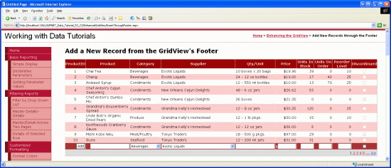
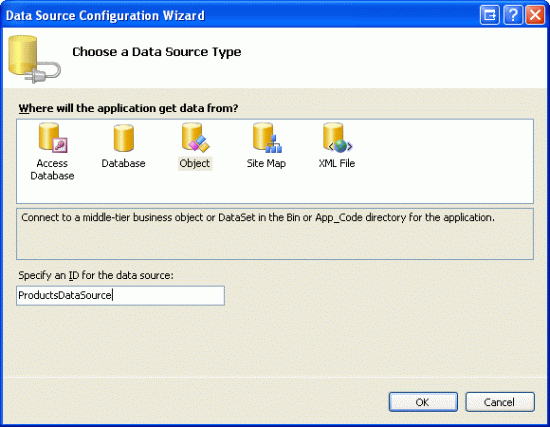
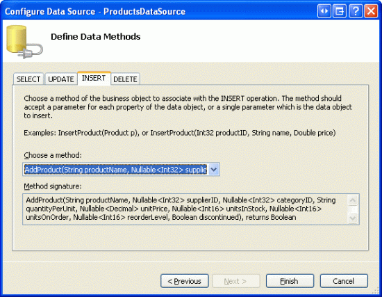
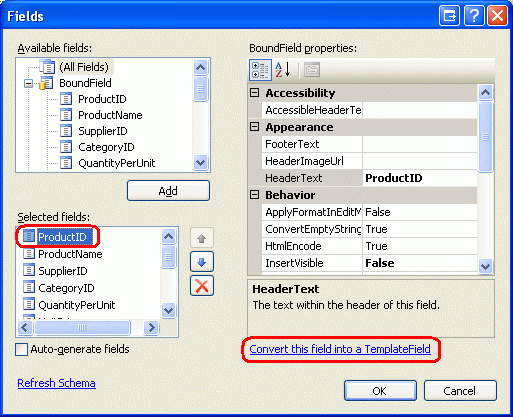
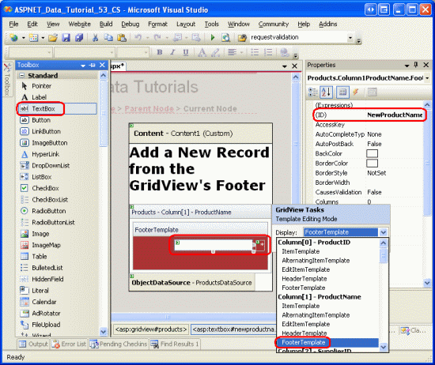
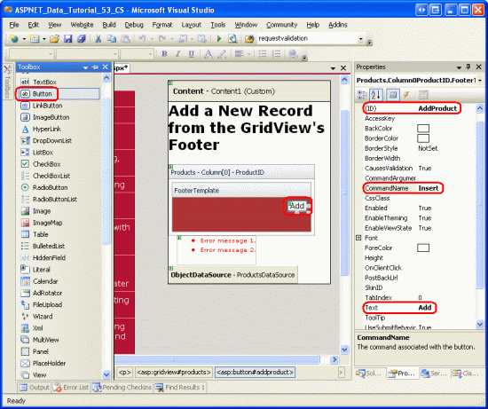
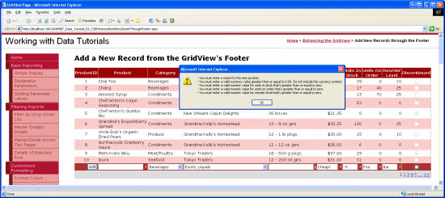

Inserting a New Record from the GridView's Footer (C#)
====================
by [Scott Mitchell](https://twitter.com/ScottOnWriting)

[Download Sample App](http://download.microsoft.com/download/4/a/7/4a7a3b18-d80e-4014-8e53-a6a2427f0d93/ASPNET_Data_Tutorial_53_CS.exe) or [Download PDF](inserting-a-new-record-from-the-gridview-s-footer-cs/_static/datatutorial53cs1.pdf)

> While the GridView control does not provide built-in support for inserting a new record of data, this tutorial shows how to augment the GridView to include an inserting interface.

## Introduction

As discussed in the [An Overview of Inserting, Updating, and Deleting Data](../editing-inserting-and-deleting-data/an-overview-of-inserting-updating-and-deleting-data-cs.md) tutorial, the GridView, DetailsView, and FormView Web controls each include built-in data modification capabilities. When used with declarative data source controls, these three Web controls can be quickly and easily configured to modify data - and in scenarios without needing to write a single line of code. Unfortunately, only the DetailsView and FormView controls provide built-in inserting, editing, and deleting capabilities. The GridView only offers editing and deleting support. However, with a little elbow grease, we can augment the GridView to include an inserting interface.

In adding inserting capabilities to the GridView, we are responsible for deciding on how new records will be added, creating the inserting interface, and writing the code to insert the new record. In this tutorial we will look at adding the inserting interface to the GridView s footer row (see Figure 1). The footer cell for each column includes the appropriate data collection user interface element (a TextBox for the product s name, a DropDownList for the supplier, and so on). We also need a column for an Add button that, when clicked, will cause a postback and insert a new record into the `Products` table using the values supplied in the footer row.

**Figure 1**: The Footer Row Provides an Interface for Adding New Products ([Click to view full-size image](inserting-a-new-record-from-the-gridview-s-footer-cs/_static/image2.png))

## Step 1: Displaying Product Information in a GridView

Before we concern ourselves with creating the inserting interface in the GridView s footer, let s first focus on adding a GridView to the page that lists the products in the database. Start by opening the `InsertThroughFooter.aspx` page in the `EnhancedGridView` folder and drag a GridView from the Toolbox onto the Designer, setting the GridView s `ID` property to `Products`. Next, use the GridView s smart tag to bind it to a new ObjectDataSource named `ProductsDataSource`.

**Figure 2**: Create a New ObjectDataSource Named `ProductsDataSource` ([Click to view full-size image](inserting-a-new-record-from-the-gridview-s-footer-cs/_static/image4.png))

Configure the ObjectDataSource to use the `ProductsBLL` class s `GetProducts()` method to retrieve product information. For this tutorial, let s focus strictly on adding inserting capabilities and not worry about editing and deleting. Therefore, make sure that the drop-down list in the INSERT tab is set to `AddProduct()` and that the drop-down lists in the UPDATE and DELETE tabs are set to (None) .

**Figure 3**: Map the `AddProduct` Method to the ObjectDataSource s `Insert()` Method ([Click to view full-size image](inserting-a-new-record-from-the-gridview-s-footer-cs/_static/image6.png))

**Figure 4**: Set the UPDATE and DELETE Tabs Drop-Down Lists to (None) ([Click to view full-size image](inserting-a-new-record-from-the-gridview-s-footer-cs/_static/image8.png))

After completing the ObjectDataSource s Configure Data Source wizard, Visual Studio will automatically add fields to the GridView for each of the corresponding data fields. For now, leave all of the fields added by Visual Studio. Later in this tutorial we'll come back and remove some of the fields whose values don t need to be specified when adding a new record.

Since there are close to 80 products in the database, a user will have to scroll all the way down to the bottom of the web page in order to add a new record. Therefore, let s enable paging to make the inserting interface more visible and accessible. To turn on paging, simply check the Enable Paging checkbox from the GridView s smart tag.

At this point, the GridView and ObjectDataSource s declarative markup should look similar to the following:

[!code-aspx[Main](inserting-a-new-record-from-the-gridview-s-footer-cs/samples/sample1.aspx)]

**Figure 5**: All Product Data Fields are Displayed in a Paged GridView ([Click to view full-size image](inserting-a-new-record-from-the-gridview-s-footer-cs/_static/image10.png))

## Step 2: Adding a Footer Row

Along with its header and data rows, the GridView includes a footer row. The header and footer rows are displayed depending on the values of the GridView s [`ShowHeader`](https://msdn.microsoft.com/en-gb/library/system.web.ui.webcontrols.gridview.showheader.aspx) and [`ShowFooter`](https://msdn.microsoft.com/en-gb/library/system.web.ui.webcontrols.gridview.showfooter.aspx) properties. To show the footer row, simply set the `ShowFooter` property to `true`. As Figure 6 illustrates, setting the `ShowFooter` property to `true` adds a footer row to the grid.

**Figure 6**: To Display the Footer Row, Set `ShowFooter` to `True` ([Click to view full-size image](inserting-a-new-record-from-the-gridview-s-footer-cs/_static/image12.png))

Note that the footer row has a dark red background color. This is due to the DataWebControls Theme we created and applied to all pages back in the [Displaying Data With the ObjectDataSource](../basic-reporting/displaying-data-with-the-objectdatasource-cs.md) tutorial. Specifically, the `GridView.skin` file configures the `FooterStyle` property such that is uses the `FooterStyle` CSS class. The `FooterStyle` class is defined in `Styles.css` as follows:

[!code-css[Main](inserting-a-new-record-from-the-gridview-s-footer-cs/samples/sample2.css)]

> [!NOTE]
> We ve explored using the GridView s footer row in previous tutorials. If needed, refer back to the [Displaying Summary Information in the GridView's Footer](../custom-formatting/displaying-summary-information-in-the-gridview-s-footer-cs.md) tutorial for a refresher.

After setting the `ShowFooter` property to `true`, take a moment to view the output in a browser. Currently the footer row doesn t contain any text or Web controls. In Step 3 we'll modify the footer for each GridView field so that it includes the appropriate inserting interface.

**Figure 7**: The Empty Footer Row is Displayed Above the Paging Interface Controls ([Click to view full-size image](inserting-a-new-record-from-the-gridview-s-footer-cs/_static/image14.png))

## Step 3: Customizing the Footer Row

Back in the [Using TemplateFields in the GridView Control](../custom-formatting/using-templatefields-in-the-gridview-control-cs.md) tutorial we saw how to greatly customize the display of a particular GridView column using TemplateFields (as opposed to BoundFields or CheckBoxFields); in [Customizing the Data Modification Interface](../editing-inserting-and-deleting-data/customizing-the-data-modification-interface-cs.md) we looked at using TemplateFields to customize the editing interface in a GridView. Recall that a TemplateField is composed of a number of templates that defines the mix of markup, Web controls, and databinding syntax used for certain types of rows. The `ItemTemplate`, for example, specifies the template used for read-only rows, while the `EditItemTemplate` defines the template for the editable row.

Along with the `ItemTemplate` and `EditItemTemplate`, the TemplateField also includes a `FooterTemplate` that specifies the content for the footer row. Therefore, we can add the Web controls needed for each field s inserting interface into the `FooterTemplate`. To start, convert all of the fields in the GridView to TemplateFields. This can be done by clicking the Edit Columns link in the GridView s smart tag, selecting each field in the lower left corner, and clicking the Convert this field into a TemplateField link.

**Figure 8**: Convert Each Field Into a TemplateField

Clicking the Convert this field into a TemplateField turns the current field type into an equivalent TemplateField. For example, each BoundField is replaced by a TemplateField with an `ItemTemplate` that contains a Label that displays the corresponding data field and an `EditItemTemplate` that displays the data field in a TextBox. The `ProductName` BoundField has been converted into the following TemplateField markup:

[!code-aspx[Main](inserting-a-new-record-from-the-gridview-s-footer-cs/samples/sample3.aspx)]

Likewise, the `Discontinued` CheckBoxField has been converted into a TemplateField whose `ItemTemplate` and `EditItemTemplate` contain a CheckBox Web control (with the `ItemTemplate` s CheckBox disabled). The read-only `ProductID` BoundField has been converted into a TemplateField with a Label control in both the `ItemTemplate` and `EditItemTemplate`. In short, converting an existing GridView field into a TemplateField is a quick and easy way to switch to the more customizable TemplateField without losing any of the existing field s functionality.

Since the GridView we re working with doesn t support editing, feel free to remove the `EditItemTemplate` from each TemplateField, leaving just the `ItemTemplate`. After doing this, your GridView s declarative markup should look like the following:

[!code-aspx[Main](inserting-a-new-record-from-the-gridview-s-footer-cs/samples/sample4.aspx)]

Now that each GridView field has been converted into a TemplateField, we can enter the appropriate inserting interface into each field s `FooterTemplate`. Some of the fields will not have an inserting interface (`ProductID`, for instance); others will vary in the Web controls used to collect the new product s information.

To create the editing interface, choose the Edit Templates link from the GridView s smart tag. Then, from the drop-down list, select the appropriate field s `FooterTemplate` and drag the appropriate control from the Toolbox onto the Designer.

**Figure 9**: Add the Appropriate Inserting Interface to Each Field s `FooterTemplate` ([Click to view full-size image](inserting-a-new-record-from-the-gridview-s-footer-cs/_static/image16.png))

The following bulleted list enumerates the GridView fields, specifying the inserting interface to add:

- `ProductID` none.
- `ProductName` add a TextBox and set its `ID` to `NewProductName`. Add a RequiredFieldValidator control as well to ensure that the user enters a value for the new product s name.
- `SupplierID` none.
- `CategoryID` none.
- `QuantityPerUnit` add a TextBox, setting its `ID` to `NewQuantityPerUnit`.
- `UnitPrice` add a TextBox named `NewUnitPrice` and a CompareValidator that ensures the value entered is a currency value greater than or equal to zero.
- `UnitsInStock` use a TextBox whose `ID` is set to `NewUnitsInStock`. Include a CompareValidator that ensures that the value entered is an integer value greater than or equal to zero.
- `UnitsOnOrder` use a TextBox whose `ID` is set to `NewUnitsOnOrder`. Include a CompareValidator that ensures that the value entered is an integer value greater than or equal to zero.
- `ReorderLevel` use a TextBox whose `ID` is set to `NewReorderLevel`. Include a CompareValidator that ensures that the value entered is an integer value greater than or equal to zero.
- `Discontinued` add a CheckBox, setting its `ID` to `NewDiscontinued`.
- `CategoryName` add a DropDownList and set its `ID` to `NewCategoryID`. Bind it to a new ObjectDataSource named `CategoriesDataSource` and configure it to use the `CategoriesBLL` class s `GetCategories()` method. Have the DropDownList s `ListItem` s display the `CategoryName` data field, using the `CategoryID` data field as their values.
- `SupplierName` add a DropDownList and set its `ID` to `NewSupplierID`. Bind it to a new ObjectDataSource named `SuppliersDataSource` and configure it to use the `SuppliersBLL` class s `GetSuppliers()` method. Have the DropDownList s `ListItem` s display the `CompanyName` data field, using the `SupplierID` data field as their values.

For each of the validation controls, clear out the `ForeColor` property so that the `FooterStyle` CSS class s white foreground color will be used in place of the default red. Also use the `ErrorMessage` property for a detailed description, but set the `Text` property to an asterisk. To prevent the validation control s text from causing the inserting interface to wrap to two lines, set the `FooterStyle` s `Wrap` property to false for each of the `FooterTemplate` s that use a validation control. Finally, add a ValidationSummary control beneath the GridView and set its `ShowMessageBox` property to `true` and its `ShowSummary` property to `false`.

When adding a new product, we need to provide the `CategoryID` and `SupplierID`. This information is captured through the DropDownLists in the footer cells for the `CategoryName` and `SupplierName` fields. I chose to use these fields as opposed to the `CategoryID` and `SupplierID` TemplateFields because in the grid s data rows the user is likely more interested in seeing the category and supplier names rather than their ID values. Since the `CategoryID` and `SupplierID` values are now being captured in the `CategoryName` and `SupplierName` field s inserting interfaces, we can remove the `CategoryID` and `SupplierID` TemplateFields from the GridView.

Similarly, the `ProductID` is not used when adding a new product, so the `ProductID` TemplateField can be removed as well. However, let s leave the `ProductID` field in the grid. In addition to the TextBoxes, DropDownLists, CheckBoxes, and validation controls that make up the inserting interface, we'll also need an Add button that, when clicked, performs the logic to add the new product to the database. In Step 4 we'll include an Add button in the inserting interface in the `ProductID` TemplateField s `FooterTemplate`.

Feel free to improve the appearance of the various GridView fields. For example, you might want to format the `UnitPrice` values as a currency, right-align the `UnitsInStock`, `UnitsOnOrder`, and `ReorderLevel` fields, and update the `HeaderText` values for the TemplateFields.

After creating the slew of inserting interfaces in the `FooterTemplate` s, removing the `SupplierID`, and `CategoryID` TemplateFields, and improving the aesthetics of the grid through formatting and aligning the TemplateFields, your GridView s declarative markup should look similar to the following:

[!code-aspx[Main](inserting-a-new-record-from-the-gridview-s-footer-cs/samples/sample5.aspx)]

When viewed through a browser, the GridView s footer row now includes the completed inserting interface (see Figure 10). At this point, the inserting interface doesn t include a means for the user to indicate that she s entered the data for the new product and wants to insert a new record into the database. Also, we ve yet to address how the data entered into the footer will translate into a new record in the `Products` database. In Step 4 we'll look at how to include an Add button to the inserting interface and how to execute code on postback when it s clicked. Step 5 shows how to insert a new record using the data from the footer.

**Figure 10**: The GridView Footer Provides an Interface for Adding a New Record ([Click to view full-size image](inserting-a-new-record-from-the-gridview-s-footer-cs/_static/image18.png))

## Step 4: Including an Add Button in the Inserting Interface

We need to include an Add button somewhere in the inserting interface since the footer row s inserting interface currently lacks the means for the user to indicate that they have completed entering the new product s information. This could be placed in one of the existing `FooterTemplate` s or we could add a new column to the grid for this purpose. For this tutorial, let s place the Add button in the `ProductID` TemplateField s `FooterTemplate`.

From the Designer, click on the Edit Templates link in the GridView s smart tag and then choose the `ProductID` field s `FooterTemplate` from the drop-down list. Add a Button Web control (or a LinkButton or ImageButton, if you prefer) to the template, setting its ID to `AddProduct`, its `CommandName` to Insert, and its `Text` property to Add as shown in Figure 11.

**Figure 11**: Place the Add Button in the `ProductID` TemplateField s `FooterTemplate` ([Click to view full-size image](inserting-a-new-record-from-the-gridview-s-footer-cs/_static/image20.png))

Once you ve included the Add button, test out the page in a browser. Note that when clicking the Add button with invalid data in the inserting interface, the postback is short circuited and the ValidationSummary control indicates the invalid data (see Figure 12). With appropriate data entered, clicking the Add button causes a postback. No record is added to the database, however. We will need to write a bit of code to actually perform the insert.

**Figure 12**: The Add Button s Postback is Short Circuited if There is Invalid Data in the Inserting Interface ([Click to view full-size image](inserting-a-new-record-from-the-gridview-s-footer-cs/_static/image22.png))

> [!NOTE]
> The validation controls in the inserting interface were not assigned to a validation group. This works fine so long as the inserting interface is the only set of validation controls on the page. If, however, there are other validation controls on the page (such as validation controls in the grid s editing interface), the validation controls in the inserting interface and Add button s `ValidationGroup` properties should be assigned the same value so as to associate these controls with a particular validation group. See [Dissecting the Validation Controls in ASP.NET 2.0](http://aspnet.4guysfromrolla.com/articles/112305-1.aspx) for more information on partitioning the validation controls and buttons on a page into validation groups.

## Step 5: Inserting a New Record Into the`Products`Table

When utilizing the built-in editing features of the GridView, the GridView automatically handles all of the work necessary for performing the update. In particular, when the Update button is clicked it copies the values entered from the editing interface to the parameters in the ObjectDataSource s `UpdateParameters` collection and kicks off the update by invoking the ObjectDataSource s `Update()` method. Since the GridView does not provide such built-in functionality for inserting, we must implement code that calls the ObjectDataSource s `Insert()` method and copies the values from the inserting interface to the ObjectDataSource s `InsertParameters` collection.

This insert logic should be executed after the Add button has been clicked. As discussed in the [Adding and Responding to Buttons in a GridView](../custom-button-actions/adding-and-responding-to-buttons-to-a-gridview-cs.md) tutorial, anytime a Button, LinkButton, or ImageButton in a GridView is clicked, the GridView s `RowCommand` event fires on postback. This event fires whether the Button, LinkButton, or ImageButton was added explicitly such as the Add button in the footer row or if it was automatically added by the GridView (such as the LinkButtons at the top of each column when Enable Sorting is selected, or the LinkButtons in the paging interface when Enable Paging is selected).

Therefore, to respond to the user clicking the Add button, we need to create an event handler for the GridView s `RowCommand` event. Since this event fires whenever *any* Button, LinkButton, or ImageButton in the GridView is clicked, it s vital that we only proceed with the inserting logic if the `CommandName` property passed into the event handler maps to the `CommandName` value of the Add button ( Insert ). Moreover, we should also only proceed if the validation controls report valid data. To accommodate this, create an event handler for the `RowCommand` event with the following code:

[!code-csharp[Main](inserting-a-new-record-from-the-gridview-s-footer-cs/samples/sample6.cs)]

> [!NOTE]
> You may be wondering why the event handler bothers checking the `Page.IsValid` property. After all, won t the postback be suppressed if invalid data is provided in the inserting interface? This assumption is correct as long as the user has not disabled JavaScript or has taken steps to circumvent the client-side validation logic. In short, one should never rely strictly on client-side validation; a server-side check for validity should always be performed before working with the data.

In Step 1 we created the `ProductsDataSource` ObjectDataSource such that its `Insert()` method is mapped to the `ProductsBLL` class s `AddProduct` method. To insert the new record into the `Products` table, we can simply invoke the ObjectDataSource s `Insert()` method:

[!code-csharp[Main](inserting-a-new-record-from-the-gridview-s-footer-cs/samples/sample7.cs)]

Now that the `Insert()` method has been invoked, all that remains is to copy the values from the inserting interface to the parameters passed to the `ProductsBLL` class s `AddProduct` method. As we saw back in the [Examining the Events Associated with Inserting, Updating, and Deleting](../editing-inserting-and-deleting-data/examining-the-events-associated-with-inserting-updating-and-deleting-cs.md) tutorial, this can be accomplished through the ObjectDataSource s `Inserting` event. In the `Inserting` event we need to programmatically reference the controls from the `Products` GridView s footer row and assign their values to the `e.InputParameters` collection. If the user omits a value such as leaving the `ReorderLevel` TextBox blank we need to specify that the value inserted into the database should be `NULL`. Since the `AddProducts` method accepts nullable types for the nullable database fields, simply use a nullable type and set its value to `null` in the case where user input is omitted.

[!code-csharp[Main](inserting-a-new-record-from-the-gridview-s-footer-cs/samples/sample8.cs)]

With the `Inserting` event handler completed, new records can be added to the `Products` database table via the GridView s footer row. Go ahead and try adding several new products.

## Enhancing and Customizing the Add Operation

Currently, clicking the Add button adds a new record to the database table but does not provide any sort of visual feedback that the record has successfully been added. Ideally, a Label Web control or client-side alert box would inform the user that their insert has completed with success. I leave this as an exercise for the reader.

The GridView used in this tutorial does not apply any sort order to the listed products, nor does it allow the end user to sort the data. Consequently, the records are ordered as they are in the database by their primary key field. Since each new record has a `ProductID` value greater than the last one, every time a new product is added it is tacked on to the end of the grid. Therefore, you may want to automatically send the user to the last page of the GridView after adding a new record. This can be accomplished by adding the following line of code after the call to `ProductsDataSource.Insert()` in the `RowCommand` event handler to indicate that the user needs to be sent to the last page after binding the data to the GridView:

[!code-csharp[Main](inserting-a-new-record-from-the-gridview-s-footer-cs/samples/sample9.cs)]

`SendUserToLastPage` is a page-level Boolean variable that is initially assigned a value of `false`. In the GridView s `DataBound` event handler, if `SendUserToLastPage` is false, the `PageIndex` property is updated to send the user to the last page.

[!code-csharp[Main](inserting-a-new-record-from-the-gridview-s-footer-cs/samples/sample10.cs)]

The reason the `PageIndex` property is set in the `DataBound` event handler (as opposed to the `RowCommand` event handler) is because when the `RowCommand` event handler fires we ve yet to add the new record to the `Products` database table. Therefore, in the `RowCommand` event handler the last page index (`PageCount - 1`) represents the last page index *before* the new product has been added. For the majority of products being added, the last page index is the same after adding the new product. But when the added product results in a new last page index, if we incorrectly update the `PageIndex` in the `RowCommand` event handler then we'll be taken to the second to last page (the last page index prior to adding the new product) as opposed to the new last page index. Since the `DataBound` event handler fires after the new product has been added and the data rebound to the grid, by setting the `PageIndex` property there we know we re getting the correct last page index.

Finally, the GridView used in this tutorial is quite wide due to the number of fields that must be collected for adding a new product. Due to this width, a DetailsView s vertical layout might be preferred. The GridView s overall width could be reduced by collecting fewer inputs. Perhaps we don t need to collect the `UnitsOnOrder`, `UnitsInStock`, and `ReorderLevel` fields when adding a new product, in which case these fields could be removed from the GridView.

To adjust the data collected, we can use one of two approaches:

- Continue to use the `AddProduct` method that expects values for the `UnitsOnOrder`, `UnitsInStock`, and `ReorderLevel` fields. In the `Inserting` event handler, provide hard-coded, default values to use for these inputs that have been removed from the inserting interface.
- Create a new overload of the `AddProduct` method in the `ProductsBLL` class that does not accept inputs for the `UnitsOnOrder`, `UnitsInStock`, and `ReorderLevel` fields. Then, in the ASP.NET page, configure the ObjectDataSource to use this new overload.

Either option will work equally as well. In past tutorials we used the latter option, creating multiple overloads for the `ProductsBLL` class s `UpdateProduct` method.

## Summary

The GridView lacks the built-in inserting capabilities found in the DetailsView and FormView, but with a bit of effort an inserting interface can be added to the footer row. To display the footer row in a GridView simply set its `ShowFooter` property to `true`. The footer row content can be customized for each field by converting the field to a TemplateField and adding the inserting interface to the `FooterTemplate`. As we saw in this tutorial, the `FooterTemplate` can contain Buttons, TextBoxes, DropDownLists, CheckBoxes, data source controls for populating data-driven Web controls (such as DropDownLists), and validation controls. Along with controls for collecting the user s input, an Add Button, LinkButton, or ImageButton is needed.

When the Add button is clicked, the ObjectDataSource s `Insert()` method is invoked to start the inserting workflow. The ObjectDataSource will then call the configured insert method (the `ProductsBLL` class s `AddProduct` method, in this tutorial). We must copy the values from the GridView s inserting interface to the ObjectDataSource s `InsertParameters` collection prior to the insert method being invoked. This can be accomplished by programmatically referencing the inserting interface Web controls in the ObjectDataSource s `Inserting` event handler.

This tutorial completes our look at techniques for enhancing the GridView s appearance. The next set of tutorials will examine how to work with binary data such as images, PDFs, Word documents, and so on and the data Web controls.

Happy Programming!

## About the Author

[Scott Mitchell](http://www.4guysfromrolla.com/ScottMitchell.shtml), author of seven ASP/ASP.NET books and founder of [4GuysFromRolla.com](http://www.4guysfromrolla.com), has been working with Microsoft Web technologies since 1998. Scott works as an independent consultant, trainer, and writer. His latest book is [*Sams Teach Yourself ASP.NET 2.0 in 24 Hours*](https://www.amazon.com/exec/obidos/ASIN/0672327384/4guysfromrollaco). He can be reached at [mitchell@4GuysFromRolla.com.](mailto:mitchell@4GuysFromRolla.com) or via his blog, which can be found at [http://ScottOnWriting.NET](http://ScottOnWriting.NET).

## Special Thanks To

This tutorial series was reviewed by many helpful reviewers. Lead reviewer for this tutorial was Bernadette Leigh. Interested in reviewing my upcoming MSDN articles? If so, drop me a line at [mitchell@4GuysFromRolla.com.](mailto:mitchell@4GuysFromRolla.com)

>[!div class="step-by-step"]
[Previous](adding-a-gridview-column-of-checkboxes-cs.md)
[Next](adding-a-gridview-column-of-radio-buttons-vb.md)