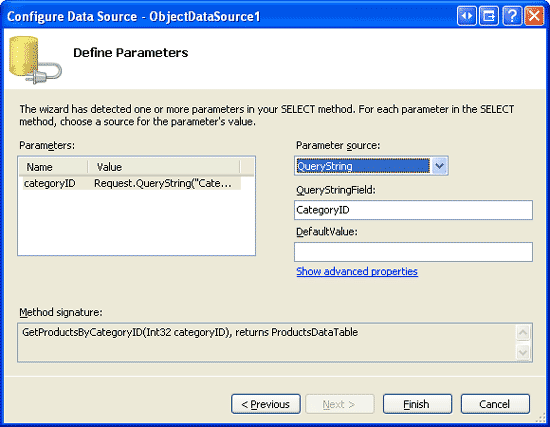
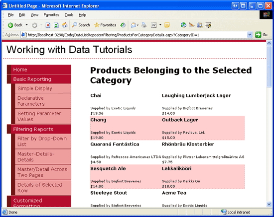
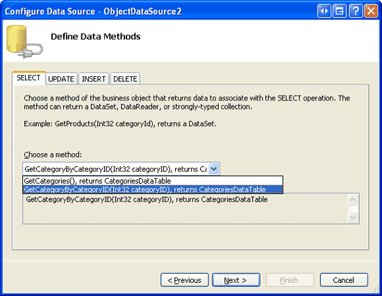
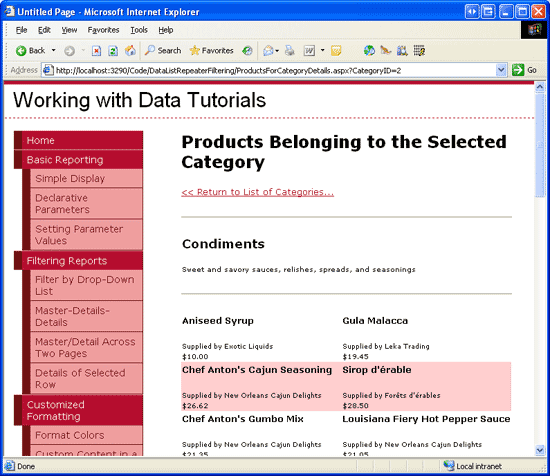

Master/Detail Filtering Across Two Pages (C#)
====================
by [Scott Mitchell](https://twitter.com/ScottOnWriting)

[Download Sample App](http://download.microsoft.com/download/9/c/1/9c1d03ee-29ba-4d58-aa1a-f201dcc822ea/ASPNET_Data_Tutorial_34_CS.exe) or [Download PDF](master-detail-filtering-acess-two-pages-datalist-cs/_static/datatutorial34cs1.pdf)

> In this tutorial we look at how to separate a master/detail report across two pages. In the "master" page we use a Repeater control to render a list of categories that, when clicked, will take the user to the "details" page where a two-column DataList shows those products belonging to the selected category.

## Introduction

In the [preceding tutorial](master-detail-filtering-with-a-dropdownlist-datalist-cs.md) we saw how to display master/detail reports in a single web page using DropDownLists to display the "master" records and a DataList to display the "details." Another common pattern used for master/detail reports is to have the master records on one web page and the details on another. In the earlier [Master/Detail Filtering Across Two Pages](../masterdetail/master-detail-filtering-across-two-pages-cs.md) tutorial, we examined this pattern using a GridView to display all of the suppliers in the system. This GridView included a HyperLinkField, which rendered as a link to a second page, passing along the `SupplierID` in the querystring. The second page used a GridView to list those products provided by the selected supplier.

Such two-page master/detail reports can be accomplished using DataList and Repeater controls as well. The only difference is that neither the DataList nor the Repeater provides support for the HyperLinkField control. Instead, we must add a HyperLink Web control or an anchor HTML element (`<a>`) within the control's `ItemTemplate`. The HyperLink's `NavigateUrl` property or the anchor's `href` attribute can then be customized using declarative or programmatic approaches.

In this tutorial we'll explore an example that lists the categories in a bulleted list on one page using a Repeater control. Each list item will include the category's name and description, with the category name displayed as a link to a second page. Clicking on this link will whisk the user to the second page, where a DataList will show those products that belong to the selected category.

## Step 1: Displaying the Categories in a Bulleted List

The first step in creating any master/detail report is to start by displaying the "master" records. Therefore, our first task is to display the categories in the "master" page. Open the `CategoryListMaster.aspx` page in the `DataListRepeaterFiltering` folder, add a Repeater control, and, from the smart tag, opt to add a new ObjectDataSource. Configure the new ObjectDataSource so that it accesses its data from the `CategoriesBLL` class's `GetCategories` method (see Figure 1).

**Figure 1**: Configure the ObjectDataSource to Use the `CategoriesBLL` Class's `GetCategories` Method ([Click to view full-size image](master-detail-filtering-acess-two-pages-datalist-cs/_static/image3.png))

Next, define the Repeater's templates such that it displays each category name and description as an item in a bulleted list. Let's not yet worry about having each category link to the details page. The following shows the declarative markup for the Repeater and ObjectDataSource:

[!code-aspx[Main](master-detail-filtering-acess-two-pages-datalist-cs/samples/sample1.aspx)]

With this markup complete, take a moment to view our progress through a browser. As Figure 2 shows, the Repeater renders as a bulleted list showing each category's name and description.

**Figure 2**: Each Category is Displayed as a Bulleted List Item ([Click to view full-size image](master-detail-filtering-acess-two-pages-datalist-cs/_static/image6.png))

## Step 2: Turning the Category Name into a Link to the Details Page

To allow a user to display the "details" information for a given category, we need to add a link to each bulleted list item that, when clicked, will take the user to the second page (`ProductsForCategoryDetails.aspx`). This second page will then display the products for the selected category using a DataList. In order to determine the category whose link was clicked, we need to pass the clicked category's `CategoryID` to the second page through some mechanism. The simplest, most straightforward way to transfer scalar data from one page to another is through the querystring, which is the option we'll use in this tutorial. In particular, the `ProductsForCategoryDetails.aspx` page will expect the selected *`categoryID`* value to be passed through a querystring field named `CategoryID`. For example, to view the products for the Beverages category, which has a `CategoryID` of 1, a user would visit `ProductsForCategoryDetails.aspx?CategoryID=1`.

To create a hyperlink for each bulleted list item in the Repeater we need to either add a HyperLink Web control or an HTML anchor element (`<a>`) to the `ItemTemplate`. In scenarios where the hyperlink is displayed the same for each row, either approach will suffice. For Repeaters, I prefer using the anchor element. To use the anchor element, update the Repeater's ItemTemplate to:

[!code-aspx[Main](master-detail-filtering-acess-two-pages-datalist-cs/samples/sample2.aspx)]

Note that the `CategoryID` can be injected directly within the anchor element's `href` attribute; however, to do so be certain to delimit the `href` attribute's value with apostrophes (and note quotation marks) since the `Eval` method within the `href` attribute delimits its string (`"CategoryID"`) with quotation marks. Alternatively, a HyperLink Web control can be used instead:

[!code-aspx[Main](master-detail-filtering-acess-two-pages-datalist-cs/samples/sample3.aspx)]

Note how the static portion of the URL — `ProductsForCategoryDetails.aspx?CategoryID` — is appended to the result of `Eval("CategoryID")` directly within the databinding syntax using string concatenation.

One benefit of using the HyperLink control is that it can be programmatically accessed from the Repeater's `ItemDataBound` event handler, if needed. For example, you might want to display the category name as text rather than as a link for categories with no associated products. Such a check could be programmatically performed in the `ItemDataBound` event handler; for categories with no associated products, the HyperLink's `NavigateUrl` property could be set to a blank string, thereby resulting in that particular category name rendering as plain text (rather than as a link). Refer back to the [Formatting the DataList and Repeater Based Upon Data](../displaying-data-with-the-datalist-and-repeater/formatting-the-datalist-and-repeater-based-upon-data-cs.md) tutorial for more information on formatting the DataList and Repeater's contents based on programmatic logic through the `ItemDataBound` event handler.

If you are following along, feel free to use either the anchor element or HyperLink control approach in your page. Regardless of the approach, when viewing the page through a browser each category name should be rendered as a link to `ProductsForCategoryDetails.aspx`, passing in the applicable `CategoryID` value (see Figure 3).

**Figure 3**: The Category Names Now Link to `ProductsForCategoryDetails.aspx` ([Click to view full-size image](master-detail-filtering-acess-two-pages-datalist-cs/_static/image9.png))

## Step 3: Listing the Products that Belong to the Selected Category

With the `CategoryListMaster.aspx` page complete, we're ready to turn our attention to implementing the "details" page, `ProductsForCategoryDetails.aspx`. Open this page, drag a DataList from the Toolbox onto the Designer, and set its `ID` property to `ProductsInCategory`. Next, from the DataList's smart tag choose to add a new ObjectDataSource to the page, naming it `ProductsInCategoryDataSource`. Configure it such that it calls the `ProductsBLL` class's `GetProductsByCategoryID(categoryID)` method; set the drop-down lists in the INSERT, UPDATE, and DELETE tabs to (None).

**Figure 4**: Configure the ObjectDataSource to Use the `ProductsBLL` Class's `GetProductsByCategoryID(categoryID)` Method ([Click to view full-size image](master-detail-filtering-acess-two-pages-datalist-cs/_static/image12.png))

Since the `GetProductsByCategoryID(categoryID)` method accepts an input parameter (*`categoryID`*), the Choose Data Source wizard offers us an opportunity to specify the parameter's source. Set the parameter source to QueryString using the QueryStringField `CategoryID`.

**Figure 5**: Use the Querystring Field `CategoryID` as the Parameter's Source ([Click to view full-size image](master-detail-filtering-acess-two-pages-datalist-cs/_static/image15.png))

As we've seen in previous tutorials, after completing the Choose Data Source wizard, Visual Studio automatically creates an `ItemTemplate` for the DataList that lists each data field name and value. Replace this template with one that lists only the product's name, supplier, and price. Also, set the DataList's `RepeatColumns` property to 2. After these changes, your DataList and ObjectDataSource's declarative markup should look similar to the following:

[!code-aspx[Main](master-detail-filtering-acess-two-pages-datalist-cs/samples/sample4.aspx)]

To view this page in action, start from the `CategoryListMaster.aspx` page; next, click on a link in the categories bulleted list. Doing so will take you to `ProductsForCategoryDetails.aspx`, passing along the `CategoryID` through the querystring. The `ProductsInCategoryDataSource` ObjectDataSource in `ProductsForCategoryDetails.aspx` will then get just those products for the specified category and display them in the DataList, which renders two products per row. Figure 6 shows a screenshot of `ProductsForCategoryDetails.aspx` when viewing the Beverages.

**Figure 6**: The Beverages are Displayed, Two per Row ([Click to view full-size image](master-detail-filtering-acess-two-pages-datalist-cs/_static/image18.png))

## Step 4: Displaying Category Information on ProductsForCategoryDetails.aspx

When a user clicks on a category in `CategoryListMaster.aspx`, they are taken to `ProductsForCategoryDetails.aspx` and shown the products that belong to the selected category. However, in `ProductsForCategoryDetails.aspx` there are no visual cues as to what category was selected. A user that meant to click Beverages, but accidentally clicked Condiments, has no way of realizing their mistake once they reach `ProductsForCategoryDetails.aspx`. To alleviate this potential problem, we can display information about the selected category — its name and description — at the top of the `ProductsForCategoryDetails.aspx` page.

To accomplish this, add a FormView above the Repeater control in `ProductsForCategoryDetails.aspx`. Next, add a new ObjectDataSource to the page from the FormView's smart tag named `CategoryDataSource` and configure it to use the `CategoriesBLL` class's `GetCategoryByCategoryID(categoryID)` method.

**Figure 7**: Access Information about the Category through the `CategoriesBLL` Class's `GetCategoryByCategoryID(categoryID)` Method ([Click to view full-size image](master-detail-filtering-acess-two-pages-datalist-cs/_static/image21.png))

As with the `ProductsInCategoryDataSource` ObjectDataSource added in Step 3, the `CategoryDataSource`'s Configure Data Source wizard prompts us for a source for the `GetCategoryByCategoryID(categoryID)` method's input parameter. Use the exact same settings as before, setting the parameter source to QueryString and the QueryStringField value to `CategoryID` (refer back to Figure 5).

After completing the wizard, Visual Studio automatically creates an `ItemTemplate`, `EditItemTemplate`, and `InsertItemTemplate` for the FormView. Since we're providing a read-only interface, feel free to remove the `EditItemTemplate` and `InsertItemTemplate`. Also, feel free to customize the FormView's `ItemTemplate`. After removing the superfluous templates and customizing the ItemTemplate, your FormView and ObjectDataSource's declarative markup should look similar to the following:

[!code-aspx[Main](master-detail-filtering-acess-two-pages-datalist-cs/samples/sample5.aspx)]

Figure 8 shows a screen shot when viewing this page through a browser.

> [!NOTE]
> In addition to the FormView, I've also added a HyperLink control above the FormView that will take the user back to the list of categories (`CategoryListMaster.aspx`). Feel free to place this link elsewhere or to omit it altogether.

**Figure 8**: Category Information is Now Displayed at the Top of the Page ([Click to view full-size image](master-detail-filtering-acess-two-pages-datalist-cs/_static/image24.png))

## Step 5: Displaying a Message if No Products Belong to the Selected Category

The `CategoryListMaster.aspx` page lists all categories in the system, regardless of whether there are any associated products. If a user clicks on a category with no associated products, the DataList in `ProductsForCategoryDetails.aspx` will not be rendered, as its data source will not have any items. As we've seen in past tutorials, the GridView provides an `EmptyDataText` property that can be used to specify a text message to display if there are no records in its data source. Unfortunately, neither the DataList nor Repeater has such a property.

In order to display a message informing the user that there are no matching products for the selected category, we need to add a Label control to the page whose `Text` property is assigned the message to display in the event that there are no matching products. We then need to programmatically set its `Visible` property based on whether or not the DataList contains any items.

To accomplish this, start by adding a Label beneath the DataList. Set its `ID` property to `NoProductsMessage` and its `Text` property to "There are no products for the selected category…" Next, we need to programmatically set this Label's `Visible` property based on whether or not any data was bound to the `ProductsInCategory` DataList. This assignment must be made after the data has been bound to the DataList. For the GridView, DetailsView, and FormView, we could create an event handler for the control's `DataBound` event, which fires after databinding has completed. However, neither the DataList nor the Repeater has a `DataBound` event available.

For this particular example we can assign the Label's `Visible` property in the `Page_Load` event handler, since the data will have been assigned to the DataList prior to the page's `Load` event. However, this approach would not work in the general case, as the data from the ObjectDataSource might be bound to the DataList later in the page's lifecycle. For example, if the displayed data is based upon the value in another control, such as it is when displaying a master/detail report using a DropDownList to hold the "master" records, the data may not rebound to the data Web control until the `PreRender` stage in the page's life cycle.

One solution which will work for all cases is to assign the `Visible` property to `False` in the DataList's `ItemDataBound` (or `ItemCreated`) event handler when binding an item type of `Item` or `AlternatingItem`. In such a case we know that there is at least one data item in the data source and therefore can hide the `NoProductsMessage` Label. In addition to this event handler, we also need an event handler for the DataList's `DataBinding` event, where we initialize the Label's `Visible` property to `True`. Since the `DataBinding` event fires before the `ItemDataBound` events, the Label's `Visible` property will initially be set to `True`; if there are any data items, however, it will be set to `False`. The following code implements this logic:

[!code-csharp[Main](master-detail-filtering-acess-two-pages-datalist-cs/samples/sample6.cs)]

All of the categories in the Northwind database are associated with one or more products. To test this feature, I've manually adjusted the Northwind database for this tutorial, reassigning all products associated with the Produce category (`CategoryID` = 7) to the Seafood category (`CategoryID` = 8). This can be accomplished from the Server Explorer by choosing New Query and using the following `UPDATE` statement:

[!code-sql[Main](master-detail-filtering-acess-two-pages-datalist-cs/samples/sample7.sql)]

After updating the database accordingly, return to the `CategoryListMaster.aspx` page and click on the Produce link. Since there are no longer any products belonging to the Produce category, you should see the "There are no products for the selected category…" message, as shown in Figure 9.

**Figure 9**: A Message is Displayed if there are No Products Belonging to the Selected Category ([Click to view full-size image](master-detail-filtering-acess-two-pages-datalist-cs/_static/image27.png))

## Summary

While master/detail reports can display both the master and detail records on a single page, in many websites they are separated out across two web pages. In this tutorial we looked at how to implement such a master/detail report by having the categories listed in a bulleted list using a Repeater in the "master" web page and the associated products listed in the "details" page. Each list item in the master web page contained a link to the details page that passed along the row's `CategoryID` value.

In the details page retrieving those products for the specified supplier was accomplished through the `ProductsBLL` class's `GetProductsByCategoryID(categoryID)` method. The *`categoryID`* parameter value was specified declaratively using the `CategoryID` querystring value as the parameter source. We also looked at how to display category details in the details page using a FormView and how to display a message if there were no products belonging to the selected category.

Happy Programming!

## About the Author

[Scott Mitchell](http://www.4guysfromrolla.com/ScottMitchell.shtml), author of seven ASP/ASP.NET books and founder of [4GuysFromRolla.com](http://www.4guysfromrolla.com), has been working with Microsoft Web technologies since 1998. Scott works as an independent consultant, trainer, and writer. His latest book is [*Sams Teach Yourself ASP.NET 2.0 in 24 Hours*](https://www.amazon.com/exec/obidos/ASIN/0672327384/4guysfromrollaco). He can be reached at [mitchell@4GuysFromRolla.com.](mailto:mitchell@4GuysFromRolla.com) or via his blog, which can be found at [http://ScottOnWriting.NET](http://ScottOnWriting.NET).

## Special Thanks To…

This tutorial series was reviewed by many helpful reviewers. Lead reviewers for this tutorial were Zack Jones and Liz Shulok. Interested in reviewing my upcoming MSDN articles? If so, drop me a line at [mitchell@4GuysFromRolla.com.](mailto:mitchell@4GuysFromRolla.com)

>[!div class="step-by-step"]
[Previous](master-detail-filtering-with-a-dropdownlist-datalist-cs.md)
[Next](master-detail-using-a-bulleted-list-of-master-records-with-a-details-datalist-cs.md)