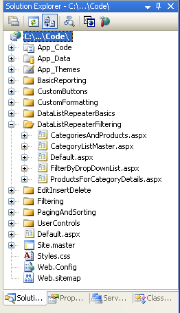
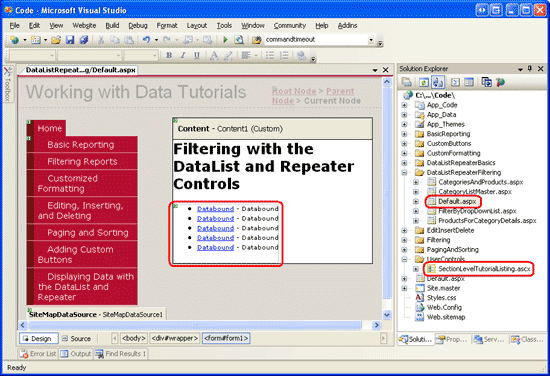
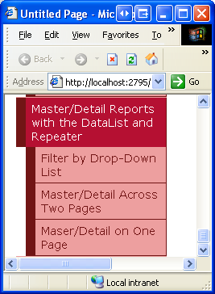
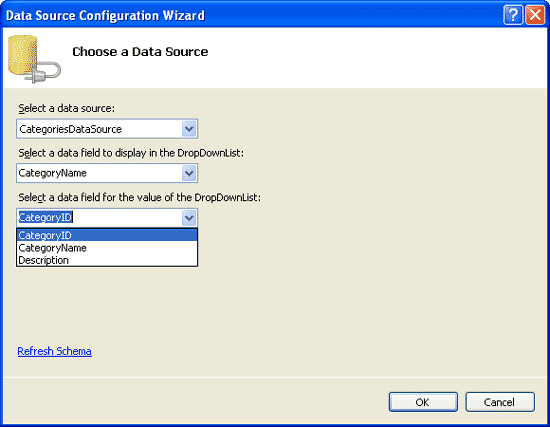
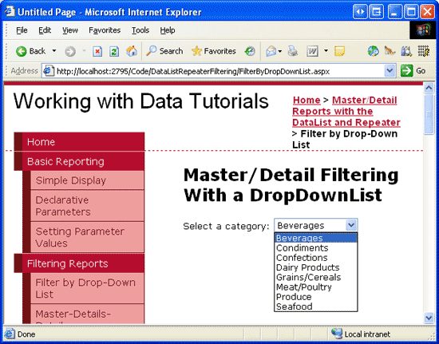
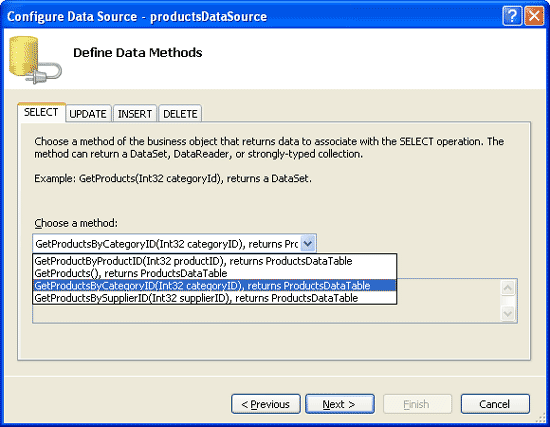
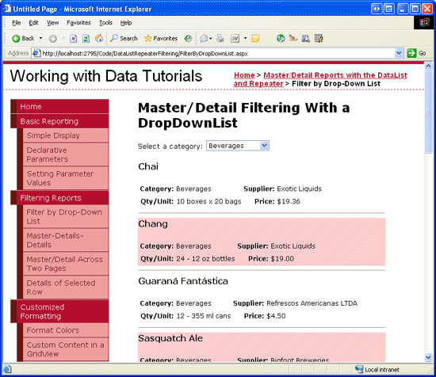
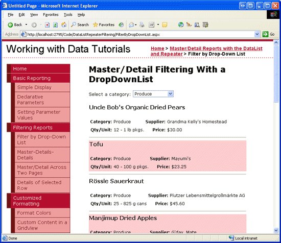
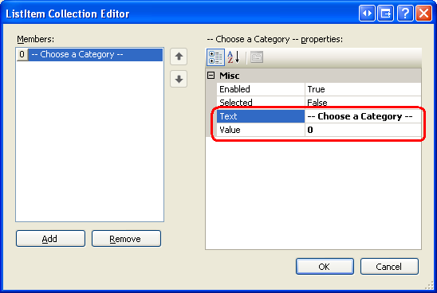
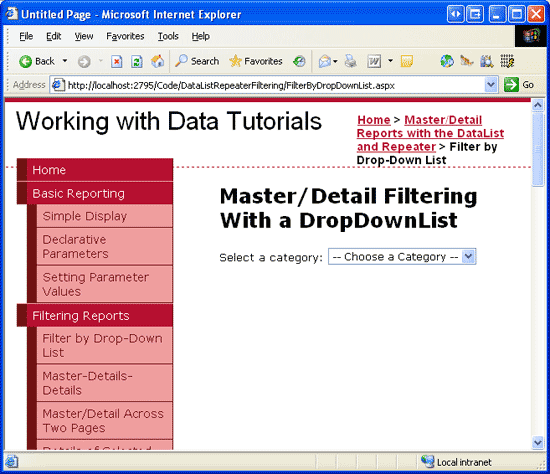

Master/Detail Filtering With a DropDownList (C#)
====================
by [Scott Mitchell](https://twitter.com/ScottOnWriting)

[Download Sample App](http://download.microsoft.com/download/9/c/1/9c1d03ee-29ba-4d58-aa1a-f201dcc822ea/ASPNET_Data_Tutorial_33_CS.exe) or [Download PDF](master-detail-filtering-with-a-dropdownlist-datalist-cs/_static/datatutorial33cs1.pdf)

> In this tutorial we see how to display master/detail reports in a single web page using DropDownLists to display the "master" records and a DataList to display the "details".

## Introduction

The master/detail report, which we first created using a GridView in the earlier [Master/Detail Filtering With a DropDownList](../masterdetail/master-detail-filtering-with-a-dropdownlist-cs.md) tutorial, begins by showing some set of "master" records. The user can then drill down into one of the master records, thereby viewing that master record's "details." Master/detail reports are an ideal choice for visualizing one-to-many relationships and for displaying detailed information from particularly "wide" tables (ones that have a lot of columns). We've explored how to implement master/detail reports using the GridView and DetailsView controls in previous tutorials. In this tutorial and the next two, we'll reexamine these concepts, but focus on using DataList and Repeater controls instead.

In this tutorial, we'll look at using a DropDownList to contain the "master" records, with the "details" records displayed in a DataList.

## Step 1: Adding the Master/Detail Tutorial Web Pages

Before we start this tutorial, let's first take a moment to add the folder and ASP.NET pages we'll need for this tutorial and the next two dealing with master/detail reports using the DataList and Repeater controls. Start by creating a new folder in the project named `DataListRepeaterFiltering`. Next, add the following five ASP.NET pages to this folder, having all of them configured to use the master page `Site.master`:

- `Default.aspx`
- `FilterByDropDownList.aspx`
- `CategoryListMaster.aspx`
- `ProductsForCategoryDetails.aspx`
- `CategoriesAndProducts.aspx`

**Figure 1**: Create a `DataListRepeaterFiltering` Folder and Add the Tutorial ASP.NET Pages

Next, open the `Default.aspx` page and drag the `SectionLevelTutorialListing.ascx` User Control from the `UserControls` folder onto the Design surface. This User Control, which we created in the [Master Pages and Site Navigation](../introduction/master-pages-and-site-navigation-cs.md) tutorial, enumerates the site map and displays the tutorials from the current section in a bulleted list.

**Figure 2**: Add the `SectionLevelTutorialListing.ascx` User Control to `Default.aspx` ([Click to view full-size image](master-detail-filtering-with-a-dropdownlist-datalist-cs/_static/image4.png))

In order to have the bulleted list display the master/detail tutorials we'll be creating, we need to add them to the site map. Open the `Web.sitemap` file and add the following markup after the "Displaying Data with the DataList and Repeater" site map node markup:

[!code-xml[Main](master-detail-filtering-with-a-dropdownlist-datalist-cs/samples/sample1.xml)]

**Figure 3**: Update the Site Map to Include the New ASP.NET Pages

## Step 2: Displaying the Categories in a DropDownList

Our master/detail report will list the categories in a DropDownList, with the selected list item's products displayed further down in the page in a DataList. The first task ahead of us, then, is to have the categories displayed in a DropDownList. Start by opening the `FilterByDropDownList.aspx` page in the `DataListRepeaterFiltering` folder and drag a DropDownList from the Toolbox onto the page's designer. Next, set the DropDownList's `ID` property to `Categories`. Click on the Choose Data Source link from the DropDownList's smart tag and create a new ObjectDataSource named `CategoriesDataSource`.

**Figure 4**: Add a New ObjectDataSource Named `CategoriesDataSource` ([Click to view full-size image](master-detail-filtering-with-a-dropdownlist-datalist-cs/_static/image8.png))

Configure the new ObjectDataSource such that it invokes the `CategoriesBLL` class's `GetCategories()` method. After configuring the ObjectDataSource we still need to specify what data source field should be displayed in the DropDownList and which one should be associated as the value for each list item. Have the `CategoryName` field as the display and `CategoryID` as the value for each list item.

**Figure 5**: Have the DropDownList Display the `CategoryName` Field and Use `CategoryID` as the Value ([Click to view full-size image](master-detail-filtering-with-a-dropdownlist-datalist-cs/_static/image11.png))

At this point we have a DropDownList control that's populated with the records from the `Categories` table (all accomplished in about six seconds). Figure 6 shows our progress thus far when viewed through a browser.

**Figure 6**: A Drop-Down Lists the Current Categories ([Click to view full-size image](master-detail-filtering-with-a-dropdownlist-datalist-cs/_static/image14.png))

## Step 2: Adding the Products DataList

The last step in our master/detail report is to list the products associated with the selected category. To accomplish this, add a DataList to the page and create a new ObjectDataSource named `ProductsByCategoryDataSource`. Have the `ProductsByCategoryDataSource` control retrieve its data from the `ProductsBLL` class's `GetProductsByCategoryID(categoryID)` method. Since this master/detail report is read-only, choose the (None) option in the INSERT, UPDATE, and DELETE tabs.

**Figure 7**: Select the `GetProductsByCategoryID(categoryID)` Method ([Click to view full-size image](master-detail-filtering-with-a-dropdownlist-datalist-cs/_static/image17.png))

After clicking Next, the ObjectDataSource wizard prompts us for the source of the value for the `GetProductsByCategoryID(categoryID)` method's *`categoryID`* parameter. To use the value of the selected `categories` DropDownList item set the Parameter source to Control and the ControlID to `Categories`.

**Figure 8**: Set the *`categoryID`* Parameter to the Value of the `Categories` DropDownList ([Click to view full-size image](master-detail-filtering-with-a-dropdownlist-datalist-cs/_static/image20.png))

Upon completing the Configure Data Source wizard, Visual Studio will automatically generate an `ItemTemplate` for the DataList that displays the name and value of each data field. Let's enhance the DataList to instead use an `ItemTemplate` that displays just the product's name, category, supplier, quantity per unit, and price along with a `SeparatorTemplate` that injects an `
` element between each item. I'm going to use the `ItemTemplate` from an example in the [Displaying Data with the DataList and Repeater Controls](../displaying-data-with-the-datalist-and-repeater/displaying-data-with-the-datalist-and-repeater-controls-cs.md) tutorial, but feel free to use whatever template markup you find most visually appealing.

After making these changes, your DataList and its ObjectDataSource's markup should look similar to the following:

[!code-aspx[Main](master-detail-filtering-with-a-dropdownlist-datalist-cs/samples/sample2.aspx)]

Take a moment to check out our progress in a browser. When first visiting the page, those products belonging to the selected category (Beverages) are displayed (as shown in Figure 9), but changing the DropDownList doesn't update the data. This is because a postback must occur for the DataList to update. To accomplish this we can either set the DropDownList's `AutoPostBack` property to `true` or add a Button Web control to the page. For this tutorial, I've opted to set the DropDownList's `AutoPostBack` property to `true`.

Figures 9 and 10 illustrate the master/detail report in action.

**Figure 9**: When First Visiting the Page, the Beverage Products are Displayed ([Click to view full-size image](master-detail-filtering-with-a-dropdownlist-datalist-cs/_static/image23.png))

**Figure 10**: Selecting a New Product (Produce) Automatically Causes a PostBack, Updating the DataList ([Click to view full-size image](master-detail-filtering-with-a-dropdownlist-datalist-cs/_static/image26.png))

## Adding a "-- Choose a Category --" List Item

When first visiting the `FilterByDropDownList.aspx` page the categories DropDownList's first list item (Beverages) is selected by default, showing the beverage products in the DataList. In the *Master/Detail Filtering With a DropDownList* tutorial we added a "-- Choose a Category --" option to the DropDownList that was selected by default and, when selected, displayed *all* of the products in the database. Such an approach was manageable when listing the products in a GridView, as each product row took up a small amount of screen real estate. With the DataList, however, each product's information consumes a much larger chunk of the screen. Let's still add a "-- Choose a Category --" option and have it selected by default, but instead of having it show all products when selected, let's configure it so that it shows no products.

To add a new list item to the DropDownList, go to the Properties window and click on the ellipses in the `Items` property. Add a new list item with the `Text` "-- Choose a Category --" and the `Value` `0`.

**Figure 11**: Add a "-- Choose a Category --" List Item

Alternatively, you can add the list item by adding the following markup to the DropDownList:

[!code-aspx[Main](master-detail-filtering-with-a-dropdownlist-datalist-cs/samples/sample3.aspx)]

Additionally, we need to set the DropDownList control's `AppendDataBoundItems` to `true` because if it's set to `false` (the default), when the categories are bound to the DropDownList from the ObjectDataSource they'll overwrite any manually-added list items.

**Figure 12**: Set the `AppendDataBoundItems` Property to True

The reason we chose the value `0` for the "-- Choose a Category --" list item is because there are no categories in the system with a value of `0`, hence no product records will be returned when the "-- Choose a Category --" list item is selected. To confirm this, take a moment to visit the page through a browser. As Figure 13 shows, when initially viewing the page the "-- Choose a Category --" list item is selected and no products are displayed.

**Figure 13**: When the "-- Choose a Category --" List Item is Selected, No Products are Displayed ([Click to view full-size image](master-detail-filtering-with-a-dropdownlist-datalist-cs/_static/image31.png))

If you'd rather display *all* of the products when the "-- Choose a Category --" option is selected, use a value of `-1` instead. The astute reader will recall that back in the *Master/Detail Filtering With a DropDownList* tutorial we updated the `ProductsBLL` class's `GetProductsByCategoryID(categoryID)` method so that if a *`categoryID`* value of `-1` was passed in, all product records were returned.

## Summary

When displaying hierarchically-related data, it often helps to present the data using master/detail reports, from which the user can start perusing the data from the top of the hierarchy and drill down into details. In this tutorial we examined building a simple master/detail report showing a selected category's products. This was accomplished by using a DropDownList for the list of categories and a DataList for the products belonging to the selected category.

In the next tutorial we'll look at separating the master and details records across two pages. In the first page, a list of "master" records will be displayed, with a link to view the details. Clicking on the link will whisk the user to the second page, which will display the details for the selected master record.

Happy Programming!

## About the Author

[Scott Mitchell](http://www.4guysfromrolla.com/ScottMitchell.shtml), author of seven ASP/ASP.NET books and founder of [4GuysFromRolla.com](http://www.4guysfromrolla.com), has been working with Microsoft Web technologies since 1998. Scott works as an independent consultant, trainer, and writer. His latest book is [*Sams Teach Yourself ASP.NET 2.0 in 24 Hours*](https://www.amazon.com/exec/obidos/ASIN/0672327384/4guysfromrollaco). He can be reached at [mitchell@4GuysFromRolla.com.](mailto:mitchell@4GuysFromRolla.com) or via his blog, which can be found at [http://ScottOnWriting.NET](http://ScottOnWriting.NET).

## Special Thanks To…

This tutorial series was reviewed by many helpful reviewers. Lead reviewer for this tutorial was Randy Schmidt. Interested in reviewing my upcoming MSDN articles? If so, drop me a line at [mitchell@4GuysFromRolla.com.](mailto:mitchell@4GuysFromRolla.com)

>[!div class="step-by-step"]
[Next](master-detail-filtering-acess-two-pages-datalist-cs.md)