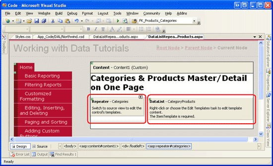
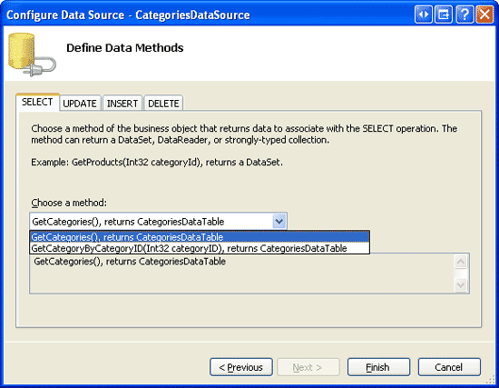
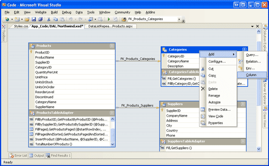
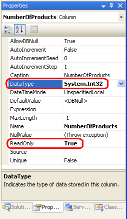
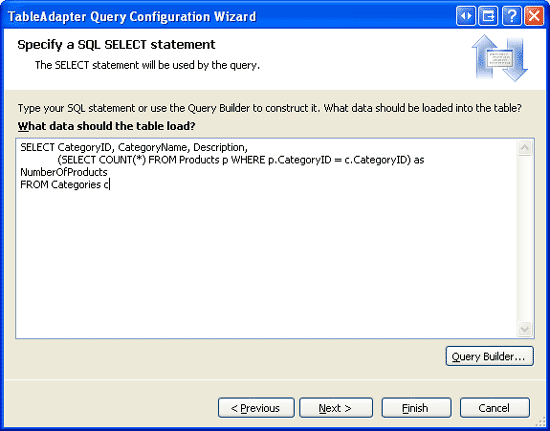
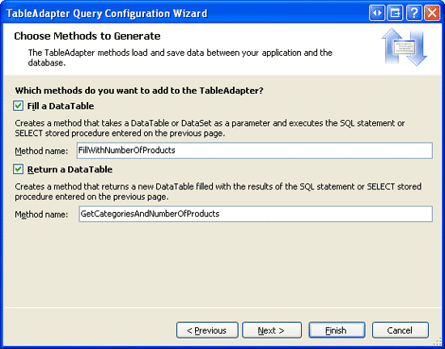
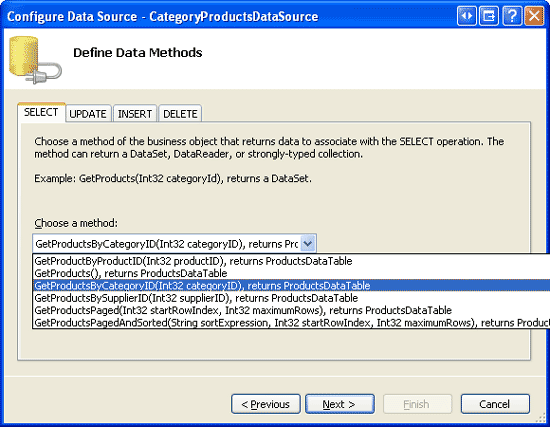
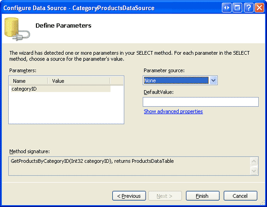

Master/Detail Using a Bulleted List of Master Records with a Details DataList (VB)
====================
by [Scott Mitchell](https://twitter.com/ScottOnWriting)

[Download Sample App](http://download.microsoft.com/download/9/c/1/9c1d03ee-29ba-4d58-aa1a-f201dcc822ea/ASPNET_Data_Tutorial_35_VB.exe) or [Download PDF](master-detail-using-a-bulleted-list-of-master-records-with-a-details-datalist-vb/_static/datatutorial35vb1.pdf)

> In this tutorial we'll compress the two-page master/detail report of the previous tutorial into a single page, showing a bulleted list of category names on the left side of the screen and the selected category's products on the right of the screen.

## Introduction

In the [preceding tutorial](master-detail-filtering-acess-two-pages-datalist-vb.md) we looked at how to separate a master/detail report across two pages. In the master page we used a Repeater control to render a bulleted list of categories. Each category name was a hyperlink that, when clicked, would take the user to the details page, where a two-column DataList showed those products belonging to the selected category.

In this tutorial we'll compress the two-page tutorial into a single page, showing a bulleted list of category names on the left side of the screen with each category name rendered as a LinkButton. Clicking one of the category name LinkButtons induces a postback and binds the selected category s products to a two-column DataList on the right of the screen. In addition to displaying each category s name, the Repeater on the left shows how many total products there are for a given category (see Figure 1).

**Figure 1**: The Category s Name and Total Number of Products are Displayed on the Left ([Click to view full-size image](master-detail-using-a-bulleted-list-of-master-records-with-a-details-datalist-vb/_static/image3.png))

## Step 1: Displaying a Repeater in the Left Portion of the Screen

For this tutorial we need to have the bulleted list of categories appear to the left of the selected category s products. Content within a web page can be positioned using standard HTML elements paragraph tags, non-breaking spaces, `<table>` s, and so on or through cascading stylesheet (CSS) techniques. All of our tutorials thus far have used CSS techniques for positioning. When we built the navigation user interface in our master page in the [Master Pages and Site Navigation](../introduction/master-pages-and-site-navigation-vb.md) tutorial we used *absolute positioning*, indicating the precise pixel offset for the navigation list and the main content. Alternatively, CSS can be used to position one element to the right or left of another through *floating*. We can have the bulleted list of categories appear to the left of the selected category s products by floating the Repeater to the left of the DataList

Open the `CategoriesAndProducts.aspx` page from the `DataListRepeaterFiltering` folder and add to the page a Repeater and a DataList. Set the Repeater s `ID` to `Categories` and the DataList s to `CategoryProducts`. Go to the Source view and put the Repeater and DataList controls within their own `
` elements. That is, enclose the Repeater within a `
` element first and then the DataList in its own `
` element directly after the Repeater. Your markup at this point should look similar to the following:

[!code-aspx[Main](master-detail-using-a-bulleted-list-of-master-records-with-a-details-datalist-vb/samples/sample1.aspx)]

To float the Repeater to the left of the DataList, we need to use the `float` CSS style attribute, like so:

[!code-html[Main](master-detail-using-a-bulleted-list-of-master-records-with-a-details-datalist-vb/samples/sample2.html)]

The `float: left;` floats the first `
` element to the left of the second one. The `width` and `padding-right` settings indicate the first `
` s `width` and how much padding is added between the `
` element s content and its right margin. For more information on floating elements in CSS check out the [Floatutorial](http://css.maxdesign.com.au/floatutorial/).

Rather than specify the style setting directly through the first `
` element s `style` attribute, let s instead create a new CSS class in `Styles.css` named `FloatLeft`:

[!code-css[Main](master-detail-using-a-bulleted-list-of-master-records-with-a-details-datalist-vb/samples/sample3.css)]

Then we can replace the `
` with `
`.

After adding the CSS class and configuring the markup in the `CategoriesAndProducts.aspx` page, go to the Designer. You should see the Repeater floating to the left of the DataList (although right now both just appear as gray boxes since we ve yet to configure their data sources or templates).

**Figure 2**: The Repeater is Floated to the Left of the DataList ([Click to view full-size image](master-detail-using-a-bulleted-list-of-master-records-with-a-details-datalist-vb/_static/image6.png))

## Step 2: Determining the Number of Products for Each Category

With the Repeater and DataList s surrounding markup complete, we re ready to bind the category data to the Repeater control. However, as the bulleted list of categories in Figure 1 shows, in addition to each category s name we also need to display the number of products associated with the category. To access this information we can either:

- **Determine this information from the ASP.NET page s code-behind class.** Given a particular *`categoryID`* we can determine the number of associated products by calling the `ProductsBLL` class s `GetProductsByCategoryID(categoryID)` method. This method returns a `ProductsDataTable` object whose `Count` property indicates how many `ProductsRow` s exists, which is the number of products for the specified *`categoryID`*. We can create an `ItemDataBound` event handler for the Repeater that, for each category bound to the Repeater, calls the `ProductsBLL` class s `GetProductsByCategoryID(categoryID)` method and includes its count in the output.
- **Update the `CategoriesDataTable` in the Typed DataSet to include a `NumberOfProducts` column.** We can then update the `GetCategories()` method in the `CategoriesDataTable` to include this information or, alternatively, leave `GetCategories()` as-is and create a new `CategoriesDataTable` method called `GetCategoriesAndNumberOfProducts()`.

Let s explore both of these techniques. The first approach is simpler to implement since we don t need to update the Data Access Layer; however, it requires more communications with the database. The call to the `ProductsBLL` class s `GetProductsByCategoryID(categoryID)` method in the `ItemDataBound` event handler adds an extra database call for each category displayed in the Repeater. With this technique there are *N* + 1 database calls, where *N* is the number of categories displayed in the Repeater. With the second approach, the product count is returned with information about each category from the `CategoriesBLL` class s `GetCategories()` (or `GetCategoriesAndNumberOfProducts()`) method, thereby resulting in just one trip to the database.

## Determining the Number of Products in the ItemDataBound Event Handler

Determining the number of products for each category in the Repeater s `ItemDataBound` event handler does not require any modifications to our existing Data Access Layer. All modifications can be made directly within the `CategoriesAndProducts.aspx` page. Start by adding a new ObjectDataSource named `CategoriesDataSource` via the Repeater s smart tag. Next, configure the `CategoriesDataSource` ObjectDataSource so that it retrieves its data from the `CategoriesBLL` class s `GetCategories()` method.

**Figure 3**: Configure the ObjectDataSource to Use the `CategoriesBLL` class s `GetCategories()` Method ([Click to view full-size image](master-detail-using-a-bulleted-list-of-master-records-with-a-details-datalist-vb/_static/image9.png))

Each item in the `Categories` Repeater needs to be clickable and, when clicked, cause the `CategoryProducts` DataList to display those products for the selected category. This can be accomplished by making each category a hyperlink, linking back to this same page (`CategoriesAndProducts.aspx`), but passing the `CategoryID` through the querystring, much like we saw in the previous tutorial. The advantage of this approach is that a page displaying a particular category s products can be bookmarked and indexed by a search engine.

Alternatively, we can make each category a LinkButton, which is the approach we'll use for this tutorial. The LinkButton renders in the user s browser as a hyperlink but, when clicked, induces a postback; on postback, the DataList s ObjectDataSource needs to be refreshed to display those products belonging to the selected category. For this tutorial, using a hyperlink makes more sense than using a LinkButton; however, there may be other scenarios where using a LinkButton is more advantageous. While the hyperlink approach would be ideal for this example, let s instead explore using the LinkButton. As we'll see, using a LinkButton introduces some challenges that would not otherwise arise with a hyperlink. Therefore, using a LinkButton in this tutorial will highlight these challenges and help provide solutions for those scenarios where we may want to use a LinkButton instead of a hyperlink.

> [!NOTE]
> You are encouraged to repeat this tutorial using a HyperLink control or `<a>` element in lieu of the LinkButton.

The following markup shows the declarative syntax for the Repeater and the ObjectDataSource. Note that the Repeater s templates render a bulleted list with each item as a LinkButton:

[!code-aspx[Main](master-detail-using-a-bulleted-list-of-master-records-with-a-details-datalist-vb/samples/sample4.aspx)]

> [!NOTE]
> For this tutorial the Repeater must have its view state enabled (note the omission of the `EnableViewState="False"` from the Repeater s declarative syntax). In step 3 we'll be creating an event handler for the Repeater s `ItemCommand` event in which we'll be updating the DataList s ObjectDataSource s `SelectParameters` collection. The Repeater s `ItemCommand`, however, won t fire if view state is disabled. See [A Stumper of an ASP.NET Question](http://scottonwriting.net/sowblog/posts/1263.aspx) and [its solution](http://scottonwriting.net/sowBlog/posts/1268.aspx) for more information on why view state must be enabled for a Repeater s `ItemCommand` event to fire.

The LinkButton with the `ID` property value of `ViewCategory` does not have its `Text` property set. If we had just wanted to display the category name, we would have set the Text property declaratively, through databinding syntax, like so:

[!code-aspx[Main](master-detail-using-a-bulleted-list-of-master-records-with-a-details-datalist-vb/samples/sample5.aspx)]

However, we want to show both the category s name *and* the number of products belonging to that category. This information can be retrieved from the Repeater s `ItemDataBound` event handler by making a call to the `ProductBLL` class s `GetCategoriesByProductID(categoryID)` method and determining how many records are returned in the resulting `ProductsDataTable`, as the following code illustrates:

[!code-vb[Main](master-detail-using-a-bulleted-list-of-master-records-with-a-details-datalist-vb/samples/sample6.vb)]

We start out by ensuring that we re working with a data item (one whose `ItemType` is `Item` or `AlternatingItem`) and then reference the `CategoriesRow` instance that has just been bound to the current `RepeaterItem`. Next, we determine the number of products for this category by creating an instance of the `ProductsBLL` class, calling its `GetCategoriesByProductID(categoryID)` method, and determining the number of records returned using the `Count` property. Finally, the `ViewCategory` LinkButton in the ItemTemplate is references and its `Text` property is set to *CategoryName* (*NumberOfProductsInCategory*), where *NumberOfProductsInCategory* is formatted as a number with zero decimal places.

> [!NOTE]
> Alternatively, we could have added a *formatting function* to the ASP.NET page s code-behind class that accepts a category s `CategoryName` and `CategoryID` values and returns the `CategoryName` concatenated with the number of products in the category (as determined by calling the `GetCategoriesByProductID(categoryID)` method). The results of such a formatting function could be declaratively assigned to the LinkButton s Text property replacing the need for the `ItemDataBound` event handler. Refer to the [Using TemplateFields in the GridView Control](../custom-formatting/using-templatefields-in-the-gridview-control-vb.md) or [Formatting the DataList and Repeater Based Upon Data](../displaying-data-with-the-datalist-and-repeater/formatting-the-datalist-and-repeater-based-upon-data-vb.md) tutorials for more information on using formatting functions.

After adding this event handler, take a moment to test the page through a browser. Note how each category is listed in a bulleted list, displaying the category s name and the number of products associated with the category (see Figure 4).

**Figure 4**: Each Category s Name and Number of Products are Displayed ([Click to view full-size image](master-detail-using-a-bulleted-list-of-master-records-with-a-details-datalist-vb/_static/image12.png))

## Updating the`CategoriesDataTable`and`CategoriesTableAdapter`to Include the Number of Products for Each Category

Rather than determining the number of products for each category as it s bound to the Repeater, we can streamline this process by adjusting the `CategoriesDataTable` and `CategoriesTableAdapter` in the Data Access Layer to include this information natively. To achieve this, we must add a new column to `CategoriesDataTable` to hold the number of associated products. To add a new column to a DataTable, open the Typed DataSet (`App_Code\DAL\Northwind.xsd`), right-click on the DataTable to modify, and choose Add / Column. Add a new column to the `CategoriesDataTable` (see Figure 5).

**Figure 5**: Add a New Column to the `CategoriesDataSource` ([Click to view full-size image](master-detail-using-a-bulleted-list-of-master-records-with-a-details-datalist-vb/_static/image15.png))

This will add a new column named `Column1`, which you can change by simply typing in a different name. Rename this new column to `NumberOfProducts`. Next, we need to configure this column s properties. Click on the new column and go to the Properties window. Change the column s `DataType` property from `System.String` to `System.Int32` and set the `ReadOnly` property to `True`, as shown in Figure 6.

**Figure 6**: Set the `DataType` and `ReadOnly` Properties of the New Column

While the `CategoriesDataTable` now has a `NumberOfProducts` column, its value is not set by any of the corresponding TableAdapter s queries. We can update the `GetCategories()` method to return this information if we want such information returned every time category information is retrieved. If, however, we only need to grab the number of associated products for the categories in rare instances (such as just for this tutorial), then we can leave `GetCategories()` as-is and create a new method that returns this information. Let s use this latter approach, creating a new method named `GetCategoriesAndNumberOfProducts()`.

To add this new `GetCategoriesAndNumberOfProducts()` method, right-click on the `CategoriesTableAdapter` and choose New Query. This brings up the TableAdapter Query Configuration Wizard, which we ve used numerous times in previous tutorials. For this method, start the wizard by indicating that the query uses an ad-hoc SQL statement that returns rows.

**Figure 7**: Create the Method Using an Ad-Hoc SQL Statement ([Click to view full-size image](master-detail-using-a-bulleted-list-of-master-records-with-a-details-datalist-vb/_static/image19.png))

**Figure 8**: The SQL Statement Returns Rows ([Click to view full-size image](master-detail-using-a-bulleted-list-of-master-records-with-a-details-datalist-vb/_static/image22.png))

The next wizard screen prompts us for the query to use. To return each category s `CategoryID`, `CategoryName`, and `Description` fields, along with the number of products associated with the category, use the following `SELECT` statement:

[!code-sql[Main](master-detail-using-a-bulleted-list-of-master-records-with-a-details-datalist-vb/samples/sample7.sql)]

**Figure 9**: Specify the Query to Use ([Click to view full-size image](master-detail-using-a-bulleted-list-of-master-records-with-a-details-datalist-vb/_static/image25.png))

Note that the subquery that computes the number of products associated with the category is aliased as `NumberOfProducts`. This naming match causes the value returned by this subquery to be associated with the `CategoriesDataTable` s `NumberOfProducts` column.

After entering this query, the last step is to choose the name for the new method. Use `FillWithNumberOfProducts` and `GetCategoriesAndNumberOfProducts` for the Fill a DataTable and Return a DataTable patterns, respectively.

**Figure 10**: Name the New TableAdapter s Methods `FillWithNumberOfProducts` and `GetCategoriesAndNumberOfProducts` ([Click to view full-size image](master-detail-using-a-bulleted-list-of-master-records-with-a-details-datalist-vb/_static/image28.png))

At this point the Data Access Layer has been extended to include the number of products per category. Since all our presentation layer routes all calls to the DAL through a separate Business Logic Layer we need to add a corresponding `GetCategoriesAndNumberOfProducts` method to the `CategoriesBLL` class:

[!code-vb[Main](master-detail-using-a-bulleted-list-of-master-records-with-a-details-datalist-vb/samples/sample8.vb)]

With the DAL and BLL complete, we re ready to bind this data to the `Categories` Repeater in `CategoriesAndProducts.aspx`! If you ve already created an ObjectDataSource for the Repeater from the Determining the Number of Products in the `ItemDataBound` Event Handler section, delete this ObjectDataSource and remove the Repeater s `DataSourceID` property setting; also unwire the Repeater s `ItemDataBound` event from the event handler by removing the `Handles Categories.OnItemDataBound` syntax in the ASP.NET code-behind class.

With the Repeater back in its original state, add a new ObjectDataSource named `CategoriesDataSource` via the Repeater s smart tag. Configure the ObjectDataSource to use the `CategoriesBLL` class, but instead of having it use the `GetCategories()` method, have it use `GetCategoriesAndNumberOfProducts()` instead (see Figure 11).

**Figure 11**: Configure the ObjectDataSource to Use the `GetCategoriesAndNumberOfProducts` Method ([Click to view full-size image](master-detail-using-a-bulleted-list-of-master-records-with-a-details-datalist-vb/_static/image31.png))

Next, update the `ItemTemplate` so that the LinkButton s `Text` property is declaratively assigned using databinding syntax and includes both the `CategoryName` and `NumberOfProducts` data fields. The complete declarative markup for the Repeater and the `CategoriesDataSource` ObjectDataSource follow:

[!code-aspx[Main](master-detail-using-a-bulleted-list-of-master-records-with-a-details-datalist-vb/samples/sample9.aspx)]

The output rendered by updating the DAL to include a `NumberOfProducts` column is the same as using the `ItemDataBound` event handler approach (refer back to Figure 4 to see a screen shot of the Repeater showing the category names and number of products).

## Step 3: Displaying the Selected Category s Products

At this point we have the `Categories` Repeater displaying the list of categories along with the number of products in each category. The Repeater uses a LinkButton for each category that, when clicked, causes a postback, at which point we need to display those products for the selected category in the `CategoryProducts` DataList.

One challenge facing us is how to have the DataList display just those products for the selected category. In the [Master/Detail Using a Selectable Master GridView with a Details DetailsView](../masterdetail/master-detail-using-a-selectable-master-gridview-with-a-details-detailview-vb.md) tutorial we saw how to build a GridView whose rows could be selected, with the selected row s details being displayed in a DetailsView on the same page. The GridView s ObjectDataSource returned information about all products using the `ProductsBLL` s `GetProducts()` method while the DetailsView s ObjectDataSource retrieved information about the selected product using the `GetProductsByProductID(productID)` method. The *`productID`* parameter value was provided declaratively by associating it with the value of the GridView s `SelectedValue` property. Unfortunately, the Repeater does not have a `SelectedValue` property and cannot serve as a parameter source.

> [!NOTE]
> This is one of those challenges that appear when using the LinkButton in a Repeater. Had we used a hyperlink to pass in the `CategoryID` through the querystring instead, we could use that QueryString field as the source for the parameter s value.

Before we worry about the lack of a `SelectedValue` property for the Repeater, though, let s first bind the DataList to an ObjectDataSource and specify its `ItemTemplate`.

From the DataList s smart tag, opt to add a new ObjectDataSource named `CategoryProductsDataSource` and configure it to use the `ProductsBLL` class s `GetProductsByCategoryID(categoryID)` method. Since the DataList in this tutorial offers a read-only interface, feel free to set the drop-down lists in the INSERT, UPDATE, and DELETE tabs to (None).

**Figure 12**: Configure the ObjectDataSource to Use `ProductsBLL` Class s `GetProductsByCategoryID(categoryID)` Method ([Click to view full-size image](master-detail-using-a-bulleted-list-of-master-records-with-a-details-datalist-vb/_static/image34.png))

Since the `GetProductsByCategoryID(categoryID)` method expects an input parameter (*`categoryID`*), the Configure Data Source wizard allows us to specify the parameter s source. Had the categories been listed in a GridView or a DataList, we d set the Parameter source drop-down list to Control and the ControlID to the `ID` of the data Web control. However, since the Repeater lacks a `SelectedValue` property it cannot be used as a parameter source. If you check, you'll find that the ControlID drop-down list only contains one control `ID``CategoryProducts`, the `ID` of the DataList.

For now, set the Parameter source drop-down list to None. We'll end up programmatically assigning this parameter value when a category LinkButton is clicked in the Repeater.

**Figure 13**: Do Not Specify a Parameter Source for the *`categoryID`* Parameter ([Click to view full-size image](master-detail-using-a-bulleted-list-of-master-records-with-a-details-datalist-vb/_static/image37.png))

After completing the Configure Data Source wizard, Visual Studio auto-generates the DataList s `ItemTemplate`. Replace this default `ItemTemplate` with the template we used in the preceding tutorial; also, set the DataList s `RepeatColumns` property to 2. After making these changes the declarative markup for your DataList and its associated ObjectDataSource should look like the following:

[!code-aspx[Main](master-detail-using-a-bulleted-list-of-master-records-with-a-details-datalist-vb/samples/sample10.aspx)]

Currently, the `CategoryProductsDataSource` ObjectDataSource s *`categoryID`* parameter is never set, so no products are displayed when viewing the page. What we need to do is have this parameter value set based on the `CategoryID` of the clicked category in the Repeater. This introduces two challenges: first, how do we determine when a LinkButton in the Repeater s `ItemTemplate` has been clicked; and second, how can we determine the `CategoryID` of the corresponding category whose LinkButton was clicked?

The LinkButton like the Button and ImageButton controls has a `Click` event and a [`Command` event](https://msdn.microsoft.com/en-us/library/system.web.ui.webcontrols.linkbutton.command.aspx). The `Click` event is designed to simply note that the LinkButton has been clicked. At times, however, in addition to noting that the LinkButton has been clicked we also need to pass some extra information to the event handler. If this is the case, the LinkButton s [`CommandName`](https://msdn.microsoft.com/en-us/library/system.web.ui.webcontrols.linkbutton.commandname.aspx) and [`CommandArgument`](https://msdn.microsoft.com/en-us/library/system.web.ui.webcontrols.linkbutton.commandargument.aspx) properties can be assigned this extra information. Then, when the LinkButton is clicked, its `Command` event fires (instead of its `Click` event) and the event handler is passed the values of the `CommandName` and `CommandArgument` properties.

When a `Command` event is raised from within a template in the Repeater, the Repeater s [`ItemCommand` event](https://msdn.microsoft.com/en-us/library/system.web.ui.webcontrols.repeater.itemcommand.aspx) fires and is passed the `CommandName` and `CommandArgument` values of the clicked LinkButton (or Button or ImageButton). Therefore, to determine when a category LinkButton in the Repeater has been clicked, we need to do the following:

1. Set the `CommandName` property of the LinkButton in the Repeater s `ItemTemplate` to some value (I ve used ListProducts ). By setting this `CommandName` value, the LinkButton s `Command` event fires when the LinkButton is clicked.
2. Set the LinkButton s `CommandArgument` property to the value of the current item s `CategoryID`.
3. Create an event handler for the Repeater s `ItemCommand` event. In the event handler, set the `CategoryProductsDataSource` ObjectDataSource s `CategoryID` parameter to the value of the passed-in `CommandArgument`.

The following `ItemTemplate` markup for the Categories Repeater implements steps 1 and 2. Note how the `CommandArgument` value is assigned the data item s `CategoryID` using databinding syntax:

[!code-aspx[Main](master-detail-using-a-bulleted-list-of-master-records-with-a-details-datalist-vb/samples/sample11.aspx)]

Whenever creating an `ItemCommand` event handler it is prudent to always first check the incoming `CommandName` value because *any* `Command` event raised by *any* Button, LinkButton, or ImageButton within the Repeater will cause the `ItemCommand` event to fire. While we currently only have one such LinkButton now, in the future we (or another developer on our team) might add additional button Web controls to the Repeater that, when clicked, raises the same `ItemCommand` event handler. Therefore, it s best to always make sure you check the `CommandName` property and only proceed with your programmatic logic if it matches up to the value expected.

After ensuring that the passed-in `CommandName` value equals ListProducts, the event handler then assigns the `CategoryProductsDataSource` ObjectDataSource s `CategoryID` parameter to the value of the passed-in `CommandArgument`. This modification to the ObjectDataSource s `SelectParameters` automatically causes the DataList to rebind itself to the data source, showing the products for the newly selected category.

[!code-vb[Main](master-detail-using-a-bulleted-list-of-master-records-with-a-details-datalist-vb/samples/sample12.vb)]

With these additions, our tutorial is complete! Take a moment to test it out in a browser. Figure 14 shows the screen when first visiting the page. Since a category has yet to be selected, no products are displayed. Clicking on a category, such as Produce, displays those products in the Product category in a two-column view (see Figure 15).

**Figure 14**: No Products are Displayed When First Visiting the Page ([Click to view full-size image](master-detail-using-a-bulleted-list-of-master-records-with-a-details-datalist-vb/_static/image40.png))

**Figure 15**: Clicking the Produce Category Lists the Matching Products to the Right ([Click to view full-size image](master-detail-using-a-bulleted-list-of-master-records-with-a-details-datalist-vb/_static/image43.png))

## Summary

As we saw in this tutorial and the preceding one, master/detail reports can be spread out across two pages, or consolidated on one. Displaying a master/details report on a single page, however, introduces some challenges on how best to layout the master and details records on the page. In the *Master/Detail Using a Selectable Master GridView with a Details DetailsView* tutorial we had the details records appear above the master records; in this tutorial we used CSS techniques to have the master records float to the left of the details.

Along with displaying master/details reports, we also had the opportunity to explore how to retrieve the number of products associated with each category as well as how to perform server-side logic when a LinkButton (or Button or ImageButton) is clicked from within a Repeater.

This tutorial completes our examination of master/detail reports with the DataList and Repeater. Our next set of tutorials will illustrate how to add editing and deleting capabilities to the DataList control.

Happy Programming!

## Further Reading

For more information on the topics discussed in this tutorial, refer to the following resources:

- [Floatutorial](http://css.maxdesign.com.au/floatutorial/) a tutorial on floating CSS elements with CSS
- [CSS Positioning](http://www.brainjar.com/css/positioning/) more information on positioning elements with CSS
- [Laying Out Content with HTML](http://www.w3schools.com/html/html_layout.asp) using `<table>` s and other HTML elements for positioning

## About the Author

[Scott Mitchell](http://www.4guysfromrolla.com/ScottMitchell.shtml), author of seven ASP/ASP.NET books and founder of [4GuysFromRolla.com](http://www.4guysfromrolla.com), has been working with Microsoft Web technologies since 1998. Scott works as an independent consultant, trainer, and writer. His latest book is [*Sams Teach Yourself ASP.NET 2.0 in 24 Hours*](https://www.amazon.com/exec/obidos/ASIN/0672327384/4guysfromrollaco). He can be reached at [mitchell@4GuysFromRolla.com.](mailto:mitchell@4GuysFromRolla.com) or via his blog, which can be found at [http://ScottOnWriting.NET](http://ScottOnWriting.NET).

## Special Thanks To

This tutorial series was reviewed by many helpful reviewers. Lead reviewer for this tutorial was Zack Jones. Interested in reviewing my upcoming MSDN articles? If so, drop me a line at [mitchell@4GuysFromRolla.com.](mailto:mitchell@4GuysFromRolla.com)

>[!div class="step-by-step"]
[Previous](master-detail-filtering-acess-two-pages-datalist-vb.md)