Creating a Data Access Layer (C#)
====================
by [Scott Mitchell](https://twitter.com/ScottOnWriting)

[Download Sample App](http://download.microsoft.com/download/4/6/3/463cf87c-4724-4cbc-b7b5-3f866f43ba50/ASPNET_Data_Tutorial_1_CS.exe) or [Download PDF](creating-a-data-access-layer-cs/_static/datatutorial01cs1.pdf)

> In this tutorial we'll start from the very beginning and create the Data Access Layer (DAL), using typed DataSets, to access the information in a database.

## Introduction

As web developers, our lives revolve around working with data. We create databases to store the data, code to retrieve and modify it, and web pages to collect and summarize it. This is the first tutorial in a lengthy series that will explore techniques for implementing these common patterns in ASP.NET 2.0. We'll start with creating a [software architecture](http://en.wikipedia.org/wiki/Software_architecture) composed of a Data Access Layer (DAL) using Typed DataSets, a Business Logic Layer (BLL) that enforces custom business rules, and a presentation layer composed of ASP.NET pages that share a common page layout. Once this backend groundwork has been laid, we'll move into reporting, showing how to display, summarize, collect, and validate data from a web application. These tutorials are geared to be concise and provide step-by-step instructions with plenty of screen shots to walk you through the process visually. Each tutorial is available in C# and Visual Basic versions and includes a download of the complete code used. (This first tutorial is quite lengthy, but the rest are presented in much more digestible chunks.)

For these tutorials we'll be using a Microsoft SQL Server 2005 Express Edition version of the Northwind database placed in the **App\_Data** directory. In addition to the database file, the **App\_Data** folder also contains the SQL scripts for creating the database, in case you want to use a different database version. These scripts can be also be [downloaded directly from Microsoft](https://www.microsoft.com/downloads/details.aspx?FamilyID=06616212-0356-46a0-8da2-eebc53a68034&amp;DisplayLang=en), if you'd prefer. If you use a different SQL Server version of the Northwind database, you will need to update the **NORTHWNDConnectionString** setting in the application's **Web.config** file. The web application was built using Visual Studio 2005 Professional Edition as a file system-based Web site project. However, all of the tutorials will work equally well with the free version of Visual Studio 2005, [Visual Web Developer](https://msdn.microsoft.com/vstudio/express/vwd/).  
  
In this tutorial we'll start from the very beginning and create the Data Access Layer (DAL), followed by creating the Business Logic Layer (BLL) in the second tutorial, and working on page layout and navigation in the third. The tutorials after the third one will build upon the foundation laid in the first three. We've got a lot to cover in this first tutorial, so fire up Visual Studio and let's get started!

## Step 1: Creating a Web Project and Connecting to the Database

Before we can create our Data Access Layer (DAL), we first need to create a web site and setup our database. Start by creating a new file system-based ASP.NET web site. To accomplish this, go to the File menu and choose New Web Site, displaying the New Web Site dialog box. Choose the ASP.NET Web Site template, set the Location drop-down list to File System, choose a folder to place the web site, and set the language to C#.

[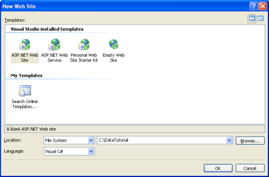](creating-a-data-access-layer-cs/_static/image1.png)

**Figure 1**: Create a New File System-Based Web Site ([Click to view full-size image](creating-a-data-access-layer-cs/_static/image3.png))

This will create a new web site with a **Default.aspx** ASP.NET page and an **App\_Data** folder.

With the web site created, the next step is to add a reference to the database in Visual Studio's Server Explorer. By adding a database to the Server Explorer you can add tables, stored procedures, views, and so on all from within Visual Studio. You can also view table data or create your own queries either by hand or graphically via the Query Builder. Furthermore, when we build the Typed DataSets for the DAL we'll need to point Visual Studio to the database from which the Typed DataSets should be constructed. While we can provide this connection information at that point in time, Visual Studio automatically populates a drop-down list of the databases already registered in the Server Explorer.

The steps for adding the Northwind database to the Server Explorer depend on whether you want to use the SQL Server 2005 Express Edition database in the **App\_Data** folder or if you have a Microsoft SQL Server 2000 or 2005 database server setup that you want to use instead.

## Using a Database in theApp\_DataFolder

If you do not have a SQL Server 2000 or 2005 database server to connect to, or you simply want to avoid having to add the database to a database server, you can use the SQL Server 2005 Express Edition version of the Northwind database that is located in the downloaded website's **App\_Data** folder (**NORTHWND.MDF**).

A database placed in the **App\_Data** folder is automatically added to the Server Explorer. Assuming you have SQL Server 2005 Express Edition installed on your machine you should see a node named NORTHWND.MDF in the Server Explorer, which you can expand and explore its tables, views, stored procedure, and so on (see Figure 2).

The **App\_Data** folder can also hold Microsoft Access **.mdb** files, which, like their SQL Server counterparts, are automatically added to the Server Explorer. If you don't want to use any of the SQL Server options, you can always [download a Microsoft Access version of the Northwind database file](https://www.microsoft.com/downloads/details.aspx?FamilyID=C6661372-8DBE-422B-8676-C632D66C529C&amp;displaylang=EN) and drop into the **App\_Data** directory. Keep in mind, however, that Access databases aren't as feature-rich as SQL Server, and aren't designed to be used in web site scenarios. Furthermore, a couple of the 35+ tutorials will utilize certain database-level features that aren't supported by Access.

## Connecting to the Database in a Microsoft SQL Server 2000 or 2005 Database Server

Alternatively, you may connect to a Northwind database installed on a database server. If the database server does not already have the Northwind database installed, you first must add it to database server by running the installation script included in this tutorial's download or by [downloading the SQL Server 2000 version of Northwind and installation script](https://www.microsoft.com/downloads/details.aspx?FamilyID=06616212-0356-46a0-8da2-eebc53a68034&amp;DisplayLang=en) directly from Microsoft's web site.

Once you have the database installed, go to the Server Explorer in Visual Studio, right-click on the Data Connections node, and choose Add Connection. If you don't see the Server Explorer go to the View / Server Explorer, or hit Ctrl+Alt+S. This will bring up the Add Connection dialog box, where you can specify the server to connect to, the authentication information, and the database name. Once you have successfully configured the database connection information and clicked the OK button, the database will be added as a node underneath the Data Connections node. You can expand the database node to explore its tables, views, stored procedures, and so on.

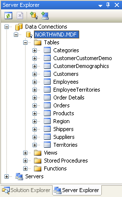

**Figure 2**: Add a Connection to Your Database Server's Northwind Database

## Step 2: Creating the Data Access Layer

When working with data one option is to embed the data-specific logic directly into the presentation layer (in a web application, the ASP.NET pages make up the presentation layer). This may take the form of writing ADO.NET code in the ASP.NET page's code portion or using the SqlDataSource control from the markup portion. In either case, this approach tightly couples the data access logic with the presentation layer. The recommended approach, however, is to separate the data access logic from the presentation layer. This separate layer is referred to as the Data Access Layer, DAL for short, and is typically implemented as a separate Class Library project. The benefits of this layered architecture are well documented (see the "Further Readings" section at the end of this tutorial for information on these advantages) and is the approach we will take in this series.

All code that is specific to the underlying data source such as creating a connection to the database, issuing **SELECT**, **INSERT**, **UPDATE**, and **DELETE** commands, and so on should be located in the DAL. The presentation layer should not contain any references to such data access code, but should instead make calls into the DAL for any and all data requests. Data Access Layers typically contain methods for accessing the underlying database data. The Northwind database, for example, has **Products** and **Categories** tables that record the products for sale and the categories to which they belong. In our DAL we will have methods like:

- **GetCategories(),** which will return information about all of the categories
- **GetProducts()**, which will return information about all of the products
- **GetProductsByCategoryID(*categoryID*)**, which will return all products that belong to a specified category
- **GetProductByProductID(*productID*)**, which will return information about a particular product

These methods, when invoked, will connect to the database, issue the appropriate query, and return the results. How we return these results is important. These methods could simply return a DataSet or DataReader populated by the database query, but ideally these results should be returned using *strongly-typed objects*. A strongly-typed object is one whose schema is rigidly defined at compile time, whereas the opposite, a loosely-typed object, is one whose schema is not known until runtime.

For example, the DataReader and the DataSet (by default) are loosely-typed objects since their schema is defined by the columns returned by the database query used to populate them. To access a particular column from a loosely-typed DataTable we need to use syntax like: ***DataTable*.Rows[*index*]["*columnName*"]**. The DataTable's loose typing in this example is exhibited by the fact that we need to access the column name using a string or ordinal index. A strongly-typed DataTable, on the other hand, will have each of its columns implemented as properties, resulting in code that looks like: ***DataTable*.Rows[*index*].*columnName***.

To return strongly-typed objects, developers can either create their own custom business objects or use Typed DataSets. A business object is implemented by the developer as a class whose properties typically reflect the columns of the underlying database table the business object represents. A Typed DataSet is a class generated for you by Visual Studio based on a database schema and whose members are strongly-typed according to this schema. The Typed DataSet itself consists of classes that extend the ADO.NET DataSet, DataTable, and DataRow classes. In addition to strongly-typed DataTables, Typed DataSets now also include TableAdapters, which are classes with methods for populating the DataSet's DataTables and propagating modifications within the DataTables back to the database.

> [!NOTE]
> For more information on the advantages and disadvantages of using Typed DataSets versus custom business objects, refer to [Designing Data Tier Components and Passing Data Through Tiers](https://msdn.microsoft.com/en-us/library/ms978496.aspx).

We'll use strongly-typed DataSets for these tutorials' architecture. Figure 3 illustrates the workflow between the different layers of an application that uses Typed DataSets.

[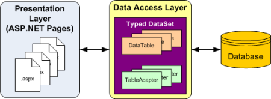](creating-a-data-access-layer-cs/_static/image5.png)

**Figure 3**: All Data Access Code is Relegated to the DAL ([Click to view full-size image](creating-a-data-access-layer-cs/_static/image7.png))

## Creating a Typed DataSet and Table Adapter

To begin creating our DAL, we start by adding a Typed DataSet to our project. To accomplish this, right-click on the project node in the Solution Explorer and choose Add a New Item. Select the DataSet option from the list of templates and name it **Northwind.xsd**.

[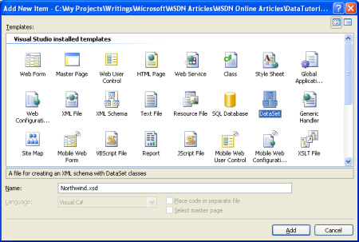](creating-a-data-access-layer-cs/_static/image8.png)

**Figure 4**: Choose to Add a New DataSet to Your Project ([Click to view full-size image](creating-a-data-access-layer-cs/_static/image10.png))

After clicking Add, when prompted to add the DataSet to the **App\_Code** folder, choose Yes. The Designer for the Typed DataSet will then be displayed, and the TableAdapter Configuration Wizard will start, allowing you to add your first TableAdapter to the Typed DataSet.

A Typed DataSet serves as a strongly-typed collection of data; it is composed of strongly-typed DataTable instances, each of which is in turn composed of strongly-typed DataRow instances. We will create a strongly-typed DataTable for each of the underlying database tables that we need to work with in this tutorials series. Let's start with creating a DataTable for the **Products** table.

Keep in mind that strongly-typed DataTables do not include any information on how to access data from their underlying database table. In order to retrieve the data to populate the DataTable, we use a TableAdapter class, which functions as our Data Access Layer. For our **Products** DataTable, the TableAdapter will contain the methods **GetProducts()**, **GetProductByCategoryID(*categoryID*)**, and so on that we'll invoke from the presentation layer. The DataTable's role is to serve as the strongly-typed objects used to pass data between the layers.

The TableAdapter Configuration Wizard begins by prompting you to select which database to work with. The drop-down list shows those databases in the Server Explorer. If you did not add the Northwind database to the Server Explorer, you can click the New Connection button at this time to do so.

[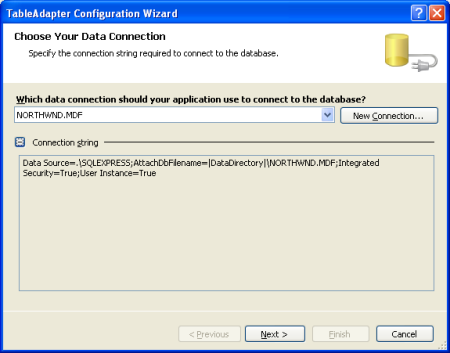](creating-a-data-access-layer-cs/_static/image11.png)

**Figure 5**: Choose the Northwind Database from the Drop-Down List ([Click to view full-size image](creating-a-data-access-layer-cs/_static/image13.png))

After selecting the database and clicking Next, you'll be asked if you want to save the connection string in the **Web.config** file. By saving the connection string you'll avoid having it hard coded in the TableAdapter classes, which simplifies things if the connection string information changes in the future. If you opt to save the connection string in the configuration file it's placed in the **&lt;connectionStrings&gt;** section, which can be [optionally encrypted](http://aspnet.4guysfromrolla.com/articles/021506-1.aspx) for improved security or modified later through the new ASP.NET 2.0 Property Page within the IIS GUI Admin Tool, which is more ideal for administrators.

**Figure 6**: Save the Connection String to **Web.config** ([Click to view full-size image](creating-a-data-access-layer-cs/_static/image16.png))

Next, we need to define the schema for the first strongly-typed DataTable and provide the first method for our TableAdapter to use when populating the strongly-typed DataSet. These two steps are accomplished simultaneously by creating a query that returns the columns from the table that we want reflected in our DataTable. At the end of the wizard we'll give a method name to this query. Once that's been accomplished, this method can be invoked from our presentation layer. The method will execute the defined query and populate a strongly-typed DataTable.

To get started defining the SQL query we must first indicate how we want the TableAdapter to issue the query. We can use an ad-hoc SQL statement, create a new stored procedure, or use an existing stored procedure. For these tutorials we'll use ad-hoc SQL statements. Refer to [Brian Noyes](http://briannoyes.net/)'s article, [Build a Data Access Layer with the Visual Studio 2005 DataSet Designer](http://www.theserverside.net/articles/showarticle.tss?id=DataSetDesigner) for an example of using stored procedures.

[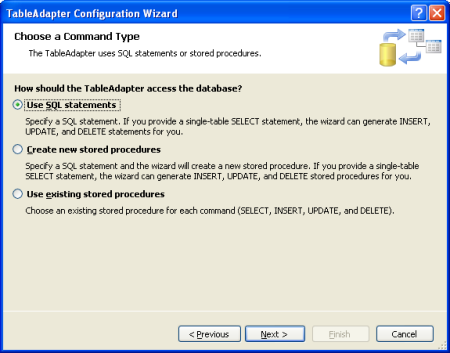](creating-a-data-access-layer-cs/_static/image17.png)

**Figure 7**: Query the Data Using an Ad-Hoc SQL Statement ([Click to view full-size image](creating-a-data-access-layer-cs/_static/image19.png))

At this point we can type in the SQL query by hand. When creating the first method in the TableAdapter you typically want to have the query return those columns that need to be expressed in the corresponding DataTable. We can accomplish this by creating a query that returns all columns and all rows from the **Products** table:

**Figure 8**: Enter the SQL Query Into the Textbox ([Click to view full-size image](creating-a-data-access-layer-cs/_static/image22.png))

Alternatively, use the Query Builder and graphically construct the query, as shown in Figure 9.

**Figure 9**: Create the Query Graphically, through the Query Editor ([Click to view full-size image](creating-a-data-access-layer-cs/_static/image25.png))

After creating the query, but before moving onto the next screen, click the Advanced Options button. In Web Site Projects, "Generate Insert, Update, and Delete statements" is the only advanced option selected by default; if you run this wizard from a Class Library or a Windows Project the "Use optimistic concurrency" option will also be selected. Leave the "Use optimistic concurrency" option unchecked for now. We'll examine optimistic concurrency in future tutorials.

[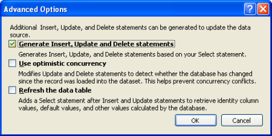](creating-a-data-access-layer-cs/_static/image26.png)

**Figure 10**: Select Only the Generate Insert, Update, and Delete statements Option ([Click to view full-size image](creating-a-data-access-layer-cs/_static/image28.png))

After verifying the advanced options, click Next to proceed to the final screen. Here we are asked to select which methods to add to the TableAdapter. There are two patterns for populating data:

- **Fill a DataTable** with this approach a method is created that takes in a DataTable as a parameter and populates it based on the results of the query. The ADO.NET DataAdapter class, for example, implements this pattern with its **Fill()** method.
- **Return a DataTable** with this approach the method creates and fills the DataTable for you and returns it as the methods return value.

You can have the TableAdapter implement one or both of these patterns. You can also rename the methods provided here. Let's leave both checkboxes checked, even though we'll only be using the latter pattern throughout these tutorials. Also, let's rename the rather generic **GetData** method to **GetProducts**.

If checked, the final checkbox, "GenerateDBDirectMethods," creates **Insert()**, **Update()**, and **Delete()** methods for the TableAdapter. If you leave this option unchecked, all updates will need to be done through the TableAdapter's sole **Update()** method, which takes in the Typed DataSet, a DataTable, a single DataRow, or an array of DataRows. (If you've unchecked the "Generate Insert, Update, and Delete statements" option from the advanced properties in Figure 9 this checkbox's setting will have no effect.) Let's leave this checkbox selected.

[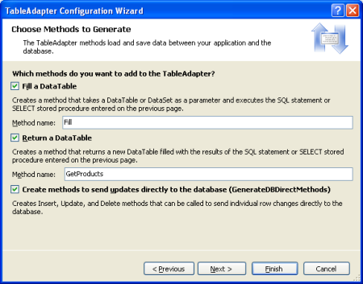](creating-a-data-access-layer-cs/_static/image29.png)

**Figure 11**: Change the Method Name from **GetData** to **GetProducts** ([Click to view full-size image](creating-a-data-access-layer-cs/_static/image31.png))

Complete the wizard by clicking Finish. After the wizard closes we are returned to the DataSet Designer which shows the DataTable we just created. You can see the list of columns in the **Products** DataTable (**ProductID**, **ProductName**, and so on), as well as the methods of the **ProductsTableAdapter** (**Fill()** and **GetProducts()**).

[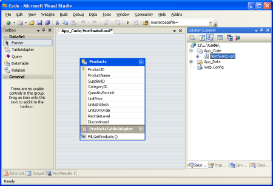](creating-a-data-access-layer-cs/_static/image32.png)

**Figure 12**: The **Products** DataTable and **ProductsTableAdapter** have been Added to the Typed DataSet ([Click to view full-size image](creating-a-data-access-layer-cs/_static/image34.png))

At this point we have a Typed DataSet with a single DataTable (**Northwind.Products**) and a strongly-typed DataAdapter class (**NorthwindTableAdapters.ProductsTableAdapter**) with a **GetProducts()** method. These objects can be used to access a list of all products from code like:

[!code-html[Main](creating-a-data-access-layer-cs/samples/sample1.html)]

This code did not require us to write one bit of data access-specific code. We did not have to instantiate any ADO.NET classes, we didn't have to refer to any connection strings, SQL queries, or stored procedures. Instead, the TableAdapter provides the low-level data access code for us.

Each object used in this example is also strongly-typed, allowing Visual Studio to provide IntelliSense and compile-time type checking. And best of all the DataTables returned by the TableAdapter can be bound to ASP.NET data Web controls, such as the GridView, DetailsView, DropDownList, CheckBoxList, and several others. The following example illustrates binding the DataTable returned by the **GetProducts()** method to a GridView in just a scant three lines of code within the **Page\_Load** event handler.

AllProducts.aspx

[!code-aspx[Main](creating-a-data-access-layer-cs/samples/sample2.aspx)]

AllProducts.aspx.cs

[!code-csharp[Main](creating-a-data-access-layer-cs/samples/sample3.cs)]

[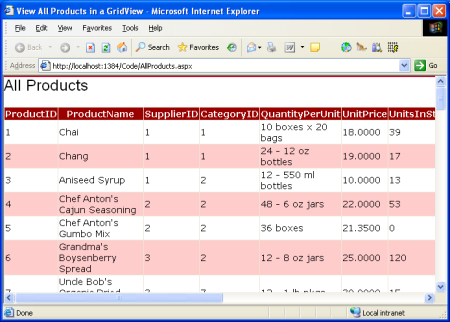](creating-a-data-access-layer-cs/_static/image35.png)

**Figure 13**: The List of Products is Displayed in a GridView ([Click to view full-size image](creating-a-data-access-layer-cs/_static/image37.png))

While this example required that we write three lines of code in our ASP.NET page's **Page\_Load** event handler, in future tutorials we'll examine how to use the ObjectDataSource to declaratively retrieve the data from the DAL. With the ObjectDataSource we'll not have to write any code and will get paging and sorting support as well!

## Step 3: Adding Parameterized Methods to the Data Access Layer

At this point our **ProductsTableAdapter** class has but one method, **GetProducts()**, which returns all of the products in the database. While being able to work with all products is definitely useful, there are times when we'll want to retrieve information about a specific product, or all products that belong to a particular category. To add such functionality to our Data Access Layer we can add parameterized methods to the TableAdapter.

Let's add the **GetProductsByCategoryID(*categoryID*)** method. To add a new method to the DAL, return to the DataSet Designer, right-click in the **ProductsTableAdapter** section, and choose Add Query.

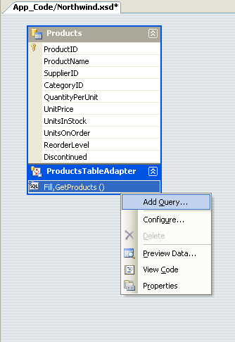

**Figure 14**: Right-Click on the TableAdapter and Choose Add Query

We are first prompted about whether we want to access the database using an ad-hoc SQL statement or a new or existing stored procedure. Let's choose to use an ad-hoc SQL statement again. Next, we are asked what type of SQL query we'd like to use. Since we want to return all products that belong to a specified category, we want to write a **SELECT** statement which returns rows.

**Figure 15**: Choose to Create a **SELECT** Statement Which Returns Rows ([Click to view full-size image](creating-a-data-access-layer-cs/_static/image41.png))

The next step is to define the SQL query used to access the data. Since we want to return only those products that belong to a particular category, I use the same **SELECT** statement from **GetProducts()**, but add the following **WHERE** clause: **WHERE CategoryID = @CategoryID**. The **@CategoryID** parameter indicates to the TableAdapter wizard that the method we're creating will require an input parameter of the corresponding type (namely, a nullable integer).

**Figure 16**: Enter a Query to Only Return Products in a Specified Category ([Click to view full-size image](creating-a-data-access-layer-cs/_static/image44.png))

In the final step we can choose which data access patterns to use, as well as customize the names of the methods generated. For the Fill pattern, let's change the name to **FillByCategoryID** and for the return a DataTable return pattern (the **Get*X*** methods), let's use **GetProductsByCategoryID**.

[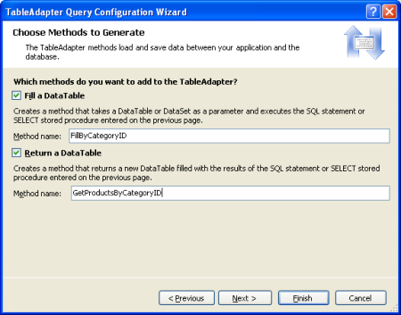](creating-a-data-access-layer-cs/_static/image45.png)

**Figure 17**: Choose the Names for the TableAdapter Methods ([Click to view full-size image](creating-a-data-access-layer-cs/_static/image47.png))

After completing the wizard, the DataSet Designer includes the new TableAdapter methods.

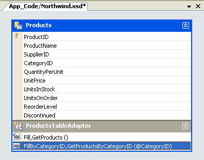

**Figure 18**: The Products Can Now be Queried by Category

Take a moment to add a **GetProductByProductID(*productID*)** method using the same technique.

These parameterized queries can be tested directly from the DataSet Designer. Right-click on the method in the TableAdapter and choose Preview Data. Next, enter the values to use for the parameters and click Preview.

[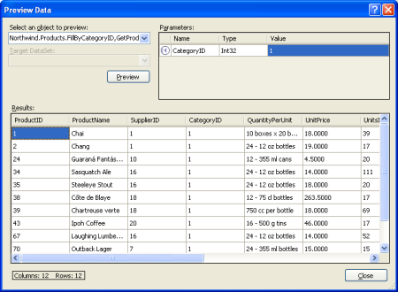](creating-a-data-access-layer-cs/_static/image49.png)

**Figure 19**: Those Products Belonging to the Beverages Category are Shown ([Click to view full-size image](creating-a-data-access-layer-cs/_static/image51.png))

With the **GetProductsByCategoryID(*categoryID*)** method in our DAL, we can now create an ASP.NET page that displays only those products in a specified category. The following example shows all products that are in the Beverages category, which have a **CategoryID** of 1.

Beverages.asp

[!code-aspx[Main](creating-a-data-access-layer-cs/samples/sample4.aspx)]

Beverages.aspx.cs

[!code-csharp[Main](creating-a-data-access-layer-cs/samples/sample5.cs)]

**Figure 20**: Those Products in the Beverages Category are Displayed ([Click to view full-size image](creating-a-data-access-layer-cs/_static/image54.png))

## Step 4: Inserting, Updating, and Deleting Data

There are two patterns commonly used for inserting, updating, and deleting data. The first pattern, which I'll call the database direct pattern, involves creating methods that, when invoked, issue an **INSERT**, **UPDATE**, or **DELETE** command to the database that operates on a single database record. Such methods are typically passed in a series of scalar values (integers, strings, Booleans, DateTimes, and so on) that correspond to the values to insert, update, or delete. For example, with this pattern for the **Products** table the delete method would take in an integer parameter, indicating the **ProductID** of the record to delete, while the insert method would take in a string for the **ProductName**, a decimal for the **UnitPrice**, an integer for the **UnitsOnStock**, and so on.

**Figure 21**: Each Insert, Update, and Delete Request is Sent to the Database Immediately ([Click to view full-size image](creating-a-data-access-layer-cs/_static/image57.png))

The other pattern, which I'll refer to as the batch update pattern, is to update an entire DataSet, DataTable, or collection of DataRows in one method call. With this pattern a developer deletes, inserts, and modifies the DataRows in a DataTable and then passes those DataRows or DataTable into an update method. This method then enumerates the DataRows passed in, determines whether or not they've been modified, added, or deleted (via the DataRow's [RowState property](https://msdn.microsoft.com/en-us/library/system.data.datarow.rowstate.aspx) value), and issues the appropriate database request for each record.

[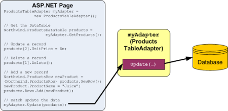](creating-a-data-access-layer-cs/_static/image58.png)

**Figure 22**: All Changes are Synchronized with the Database When the Update Method is Invoked ([Click to view full-size image](creating-a-data-access-layer-cs/_static/image60.png))

The TableAdapter uses the batch update pattern by default, but also supports the DB direct pattern. Since we selected the "Generate Insert, Update, and Delete statements" option from the Advanced Properties when creating our TableAdapter, the **ProductsTableAdapter** contains an **Update()** method, which implements the batch update pattern. Specifically, the TableAdapter contains an **Update()** method that can be passed the Typed DataSet, a strongly-typed DataTable, or one or more DataRows. If you left the "GenerateDBDirectMethods" checkbox checked when first creating the TableAdapter the DB direct pattern will also be implemented via **Insert()**, **Update()**, and **Delete()** methods.

Both data modification patterns use the TableAdapter's **InsertCommand**, **UpdateCommand**, and **DeleteCommand** properties to issue their **INSERT**, **UPDATE**, and **DELETE** commands to the database. You can inspect and modify the **InsertCommand**, **UpdateCommand**, and **DeleteCommand** properties by clicking on the TableAdapter in the DataSet Designer and then going to the Properties window. (Make sure you have selected the TableAdapter, and that the **ProductsTableAdapter** object is the one selected in the drop-down list in the Properties window.)

**Figure 23**: The TableAdapter has **InsertCommand**, **UpdateCommand**, and **DeleteCommand** Properties ([Click to view full-size image](creating-a-data-access-layer-cs/_static/image63.png))

To examine or modify any of these database command properties, click on the **CommandText** subproperty, which will bring up the Query Builder.

[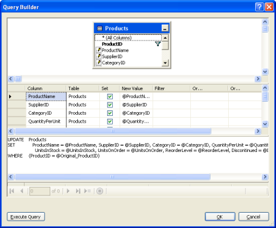](creating-a-data-access-layer-cs/_static/image64.png)

**Figure 24**: Configure the **INSERT**, **UPDATE**, and **DELETE** Statements in the Query Builder ([Click to view full-size image](creating-a-data-access-layer-cs/_static/image66.png))

The following code example shows how to use the batch update pattern to double the price of all products that are not discontinued and that have 25 units in stock or less:

[!code-csharp[Main](creating-a-data-access-layer-cs/samples/sample6.cs)]

The code below illustrates how to use the DB direct pattern to programmatically delete a particular product, then update one, and then add a new one:

[!code-csharp[Main](creating-a-data-access-layer-cs/samples/sample7.cs)]

## Creating Custom Insert, Update, and Delete Methods

The **Insert()**, **Update()**, and **Delete()** methods created by the DB direct method can be a bit cumbersome, especially for tables with many columns. Looking at the previous code example, without IntelliSense's help it's not particularly clear what **Products** table column maps to each input parameter to the **Update()** and **Insert()** methods. There may be times when we only want to update a single column or two, or want a customized **Insert()** method that will, perhaps, return the value of the newly inserted record's **IDENTITY** (auto-increment) field.

To create such a custom method, return to the DataSet Designer. Right-click on the TableAdapter and choose Add Query, returning to the TableAdapter wizard. On the second screen we can indicate the type of query to create. Let's create a method that adds a new product and then returns the value of the newly added record's **ProductID**. Therefore, opt to create an **INSERT** query.

**Figure 25**: Create a Method to Add a New Row to the **Products** Table ([Click to view full-size image](creating-a-data-access-layer-cs/_static/image69.png))

On the next screen the **InsertCommand**'s **CommandText** appears. Augment this query by adding **SELECT SCOPE\_IDENTITY()** at the end of the query, which will return the last identity value inserted into an **IDENTITY** column in the same scope. (See the [technical documentation](https://msdn.microsoft.com/en-us/library/ms190315.aspx) for more information about **SCOPE\_IDENTITY()** and why you probably want to [use SCOPE\_IDENTITY() in lieu of @@IDENTITY](http://weblogs.sqlteam.com/travisl/archive/2003/10/29/405.aspx).) Make sure that you end the **INSERT** statement with a semi-colon before adding the **SELECT** statement.

[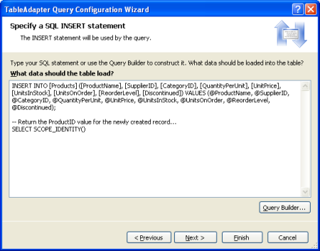](creating-a-data-access-layer-cs/_static/image70.png)

**Figure 26**: Augment the Query to Return the **SCOPE\_IDENTITY()** Value ([Click to view full-size image](creating-a-data-access-layer-cs/_static/image72.png))

Finally, name the new method **InsertProduct**.

**Figure 27**: Set the New Method Name to **InsertProduct** ([Click to view full-size image](creating-a-data-access-layer-cs/_static/image75.png))

When you return to the DataSet Designer you'll see that the **ProductsTableAdapter** contains a new method, **InsertProduct**. If this new method doesn't have a parameter for each column in the **Products** table, chances are you forgot to terminate the **INSERT** statement with a semi-colon. Configure the **InsertProduct** method and ensure you have a semi-colon delimiting the **INSERT** and **SELECT** statements.

By default, insert methods issue non-query methods, meaning that they return the number of affected rows. However, we want the **InsertProduct** method to return the value returned by the query, not the number of rows affected. To accomplish this, adjust the **InsertProduct** method's **ExecuteMode** property to **Scalar**.

[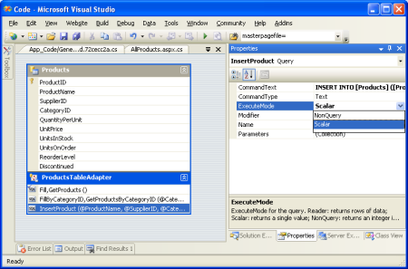](creating-a-data-access-layer-cs/_static/image76.png)

**Figure 28**: Change the **ExecuteMode** Property to **Scalar** ([Click to view full-size image](creating-a-data-access-layer-cs/_static/image78.png))

The following code shows this new **InsertProduct** method in action:

[!code-csharp[Main](creating-a-data-access-layer-cs/samples/sample8.cs)]

## Step 5: Completing the Data Access Layer

Note that the **ProductsTableAdapters** class returns the **CategoryID** and **SupplierID** values from the **Products** table, but doesn't include the **CategoryName** column from the **Categories** table or the **CompanyName** column from the **Suppliers** table, although these are likely the columns we want to display when showing product information. We can augment the TableAdapter's initial method, **GetProducts()**, to include both the **CategoryName** and **CompanyName** column values, which will update the strongly-typed DataTable to include these new columns as well.

This can present a problem, however, as the TableAdapter's methods for inserting, updating, and deleting data are based off of this initial method. Fortunately, the auto-generated methods for inserting, updating, and deleting are not affected by subqueries in the **SELECT** clause. By taking care to add our queries to **Categories** and **Suppliers** as subqueries, rather than **JOIN** s, we'll avoid having to rework those methods for modifying data. Right-click on the **GetProducts()** method in the **ProductsTableAdapter** and choose Configure. Then, adjust the **SELECT** clause so that it looks like:

[!code-sql[Main](creating-a-data-access-layer-cs/samples/sample9.sql)]

[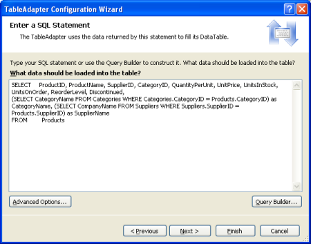](creating-a-data-access-layer-cs/_static/image79.png)

**Figure 29**: Update the **SELECT** Statement for the **GetProducts()** Method ([Click to view full-size image](creating-a-data-access-layer-cs/_static/image81.png))

After updating the **GetProducts()** method to use this new query the DataTable will include two new columns: **CategoryName** and **SupplierName**.

**Figure 30**: The **Products** DataTable has Two New Columns

Take a moment to update the **SELECT** clause in the **GetProductsByCategoryID(*categoryID*)** method as well.

If you update the **GetProducts()** **SELECT** using **JOIN** syntax the DataSet Designer won't be able to auto-generate the methods for inserting, updating, and deleting database data using the DB direct pattern. Instead, you'll have to manually create them much like we did with the **InsertProduct** method earlier in this tutorial. Furthermore, you'll manually have to provide the **InsertCommand**, **UpdateCommand**, and **DeleteCommand** property values if you want to use the batch updating pattern.

## Adding the Remaining TableAdapters

Up until now, we've only looked at working with a single TableAdapter for a single database table. However, the Northwind database contains several related tables that we'll need to work with in our web application. A Typed DataSet can contain multiple, related DataTables. Therefore, to complete our DAL we need to add DataTables for the other tables we'll be using in these tutorials. To add a new TableAdapter to a Typed DataSet, open the DataSet Designer, right-click in the Designer, and choose Add / TableAdapter. This will create a new DataTable and TableAdapter and walk you through the wizard we examined earlier in this tutorial.

Take a few minutes to create the following TableAdapters and methods using the following queries. Note that the queries in the **ProductsTableAdapter** include the subqueries to grab each product's category and supplier names. Additionally, if you've been following along, you've already added the **ProductsTableAdapter** class's **GetProducts()** and **GetProductsByCategoryID(*categoryID*)** methods.

- **ProductsTableAdapter**

    - **GetProducts**: 

        [!code-sql[Main](creating-a-data-access-layer-cs/samples/sample10.sql)]
    - **GetProductsByCategoryID**: 

        [!code-sql[Main](creating-a-data-access-layer-cs/samples/sample11.sql)]
    - **GetProductsBySupplierID**: 

        [!code-sql[Main](creating-a-data-access-layer-cs/samples/sample12.sql)]
    - **GetProductByProductID**: 

        [!code-sql[Main](creating-a-data-access-layer-cs/samples/sample13.sql)]
- **CategoriesTableAdapter**

    - **GetCategories**: 

        [!code-sql[Main](creating-a-data-access-layer-cs/samples/sample14.sql)]
    - **GetCategoryByCategoryID**: 

        [!code-sql[Main](creating-a-data-access-layer-cs/samples/sample15.sql)]
- **SuppliersTableAdapter**

    - **GetSuppliers**: 

        [!code-sql[Main](creating-a-data-access-layer-cs/samples/sample16.sql)]
    - **GetSuppliersByCountry**: 

        [!code-sql[Main](creating-a-data-access-layer-cs/samples/sample17.sql)]
    - **GetSupplierBySupplierID**: 

        [!code-sql[Main](creating-a-data-access-layer-cs/samples/sample18.sql)]
- **EmployeesTableAdapter**

    - **GetEmployees**: 

        [!code-sql[Main](creating-a-data-access-layer-cs/samples/sample19.sql)]
    - **GetEmployeesByManager**: 

        [!code-sql[Main](creating-a-data-access-layer-cs/samples/sample20.sql)]
    - **GetEmployeeByEmployeeID**: 

        [!code-sql[Main](creating-a-data-access-layer-cs/samples/sample21.sql)]

[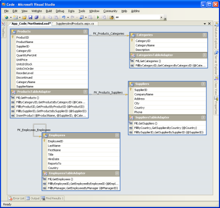](creating-a-data-access-layer-cs/_static/image83.png)

**Figure 31**: The DataSet Designer After the Four TableAdapters Have Been Added ([Click to view full-size image](creating-a-data-access-layer-cs/_static/image85.png))

## Adding Custom Code to the DAL

The TableAdapters and DataTables added to the Typed DataSet are expressed as an XML Schema Definition file (**Northwind.xsd**). You can view this schema information by right-clicking on the **Northwind.xsd** file in the Solution Explorer and choosing View Code.

**Figure 32**: The XML Schema Definition (XSD) File for the Northwinds Typed DataSet ([Click to view full-size image](creating-a-data-access-layer-cs/_static/image88.png))

This schema information is translated into C# or Visual Basic code at design time when compiled or at runtime (if needed), at which point you can step through it with the debugger. To view this auto-generated code go to the Class View and drill down to the TableAdapter or Typed DataSet classes. If you don't see the Class View on your screen, go to the View menu and select it from there, or hit Ctrl+Shift+C. From the Class View you can see the properties, methods, and events of the Typed DataSet and TableAdapter classes. To view the code for a particular method, double-click the method name in the Class View or right-click on it and choose Go To Definition.

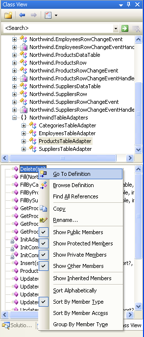

**Figure 33**: Inspect the Auto-Generated Code by Selecting Go To Definition from the Class View

While auto-generated code can be a great time saver, the code is often very generic and needs to be customized to meet the unique needs of an application. The risk of extending auto-generated code, though, is that the tool that generated the code might decide it's time to "regenerate" and overwrite your customizations. With .NET 2.0's new partial class concept, it's easy to split a class across multiple files. This enables us to add our own methods, properties, and events to the auto-generated classes without having to worry about Visual Studio overwriting our customizations.

To demonstrate how to customize the DAL, let's add a **GetProducts()** method to the **SuppliersRow** class. The **SuppliersRow** class represents a single record in the **Suppliers** table; each supplier can provider zero to many products, so **GetProducts()** will return those products of the specified supplier. To accomplish this create a new class file in the **App\_Code** folder named **SuppliersRow.cs** and add the following code:

[!code-csharp[Main](creating-a-data-access-layer-cs/samples/sample22.cs)]

This partial class instructs the compiler that when building the **Northwind.SuppliersRow** class to include the **GetProducts()** method we just defined. If you build your project and then return to the Class View you'll see **GetProducts()** now listed as a method of **Northwind.SuppliersRow**.

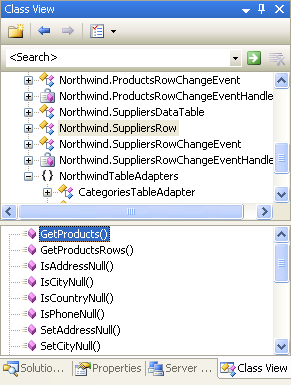

**Figure 34**: The **GetProducts()** Method is Now Part of the **Northwind.SuppliersRow** Class

The **GetProducts()** method can now be used to enumerate the set of products for a particular supplier, as the following code shows:

[!code-html[Main](creating-a-data-access-layer-cs/samples/sample23.html)]

This data can also be displayed in any of ASP.NET's data Web controls. The following page uses a GridView control with two fields:

- A BoundField that displays the name of each supplier, and
- A TemplateField that contains a BulletedList control that is bound to the results returned by the **GetProducts()** method for each supplier.

We'll examine how to display such master-detail reports in future tutorials. For now, this example is designed to illustrate using the custom method added to the **Northwind.SuppliersRow** class.

SuppliersAndProducts.aspx

[!code-aspx[Main](creating-a-data-access-layer-cs/samples/sample24.aspx)]

SuppliersAndProducts.aspx.cs

[!code-csharp[Main](creating-a-data-access-layer-cs/samples/sample25.cs)]

[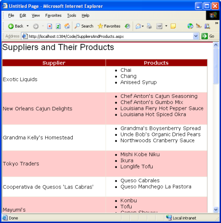](creating-a-data-access-layer-cs/_static/image91.png)

**Figure 35**: The Supplier's Company Name is Listed in the Left Column, Their Products in the Right ([Click to view full-size image](creating-a-data-access-layer-cs/_static/image93.png))

## Summary

When building a web application creating the DAL should be one of your first steps, occurring before you start creating your presentation layer. With Visual Studio, creating a DAL based on Typed DataSets is a task that can be accomplished in 10-15 minutes without writing a line of code. The tutorials moving forward will build upon this DAL. In the [next tutorial](creating-a-business-logic-layer-cs.md) we'll define a number of business rules and see how to implement them in a separate Business Logic Layer.

Happy Programming!

## Further Reading

For more information on the topics discussed in this tutorial, refer to the following resources:

- [Building a DAL using Strongly Typed TableAdapters and DataTables in VS 2005 and ASP.NET 2.0](https://weblogs.asp.net/scottgu/435498)
- [Designing Data Tier Components and Passing Data Through Tiers](https://msdn.microsoft.com/en-us/library/ms978496.aspx)
- [Build a Data Access Layer with the Visual Studio 2005 DataSet Designer](http://www.theserverside.net/articles/showarticle.tss?id=DataSetDesigner)
- [Encrypting Configuration Information in ASP.NET 2.0 Applications](http://aspnet.4guysfromrolla.com/articles/021506-1.aspx)
- [TableAdapter Overview](https://msdn.microsoft.com/en-us/library/bz9tthwx.aspx)
- [Working with a Typed DataSet](https://msdn.microsoft.com/en-us/library/esbykkzb.aspx)
- [Using Strongly-Typed Data Access in Visual Studio 2005 and ASP.NET 2.0](http://aspnet.4guysfromrolla.com/articles/020806-1.aspx)
- [How to Extend TableAdapter Methods](https://blogs.msdn.com/vbteam/archive/2005/05/04/ExtendingTableAdapters.aspx)
- [Retrieving Scalar Data from a Stored Procedure](http://aspnet.4guysfromrolla.com/articles/062905-1.aspx)

### Video Training on Topics Contained in this Tutorial

- [Data Access Layers in ASP.NET Applications](../../../videos/data-access/adonet-data-services/data-access-layers-in-aspnet-applications.md)
- [How to Manually Bind a Dataset to a Datagrid](../../../videos/data-access/adonet-data-services/how-to-manually-bind-a-dataset-to-a-datagrid.md)
- [How to Work with Datasets and Filters from an ASP Application](../../../videos/data-access/adonet-data-services/how-to-work-with-datasets-and-filters-from-an-asp-application.md)

## About the Author

[Scott Mitchell](http://www.4guysfromrolla.com/ScottMitchell.shtml), author of seven ASP/ASP.NET books and founder of [4GuysFromRolla.com](http://www.4guysfromrolla.com), has been working with Microsoft Web technologies since 1998. Scott works as an independent consultant, trainer, and writer. His latest book is [*Sams Teach Yourself ASP.NET 2.0 in 24 Hours*](https://www.amazon.com/exec/obidos/ASIN/0672327384/4guysfromrollaco). He can be reached at [mitchell@4GuysFromRolla.com.](mailto:mitchell@4GuysFromRolla.com) or via his blog, which can be found at [http://ScottOnWriting.NET](http://ScottOnWriting.NET).

## Special Thanks To

This tutorial series was reviewed by many helpful reviewers. Lead reviewers for this tutorial were Ron Green, Hilton Giesenow, Dennis Patterson, Liz Shulok, Abel Gomez, and Carlos Santos. Interested in reviewing my upcoming MSDN articles? If so, drop me a line at [mitchell@4GuysFromRolla.com.](mailto:mitchell@4GuysFromRolla.com)

>[!div class="step-by-step"]
[Next](creating-a-business-logic-layer-cs.md)