Master Pages and Site Navigation (VB)
====================
by [Scott Mitchell](https://twitter.com/ScottOnWriting)

[Download Sample App](http://download.microsoft.com/download/5/d/7/5d7571fc-d0b7-4798-ad4a-c976c02363ce/ASPNET_Data_Tutorial_3_VB.exe) or [Download PDF](master-pages-and-site-navigation-vb/_static/datatutorial03vb1.pdf)

> One common characteristic of user-friendly websites is that they have a consistent, site-wide page layout and navigation scheme. This tutorial looks at how you can create a consistent look and feel across all pages that can easily be updated.

## Introduction

One common characteristic of user-friendly websites is that they have a consistent, site-wide page layout and navigation scheme. ASP.NET 2.0 introduces two new features that greatly simplify implementing both a site-wide page layout and navigation scheme: master pages and site navigation. Master pages allow for developers to create a site-wide template with designated editable regions. This template can then be applied to ASP.NET pages in the site. Such ASP.NET pages need only provide content for the master page's specified editable regions all other markup in the master page is identical across all ASP.NET pages that use the master page. This model allows developers to define and centralize a site-wide page layout, thereby making it easier to create a consistent look and feel across all pages that can easily be updated.

The [site navigation system](http://aspnet.4guysfromrolla.com/articles/111605-1.aspx) provides both a mechanism for page developers to define a site map and an API for that site map to be programmatically queried. The new navigation Web controls the Menu, TreeView, and SiteMapPath make it easy to render all or part of the site map in a common navigation user interface element. We'll be using the default site navigation provider, meaning that our site map will be defined in an XML-formatted file.

To illustrate these concepts and make our tutorials website more usable, let's spend this lesson defining a site-wide page layout, implementing a site map, and adding the navigation UI. By the end of this tutorial we'll have a polished website design for building our tutorial web pages.

[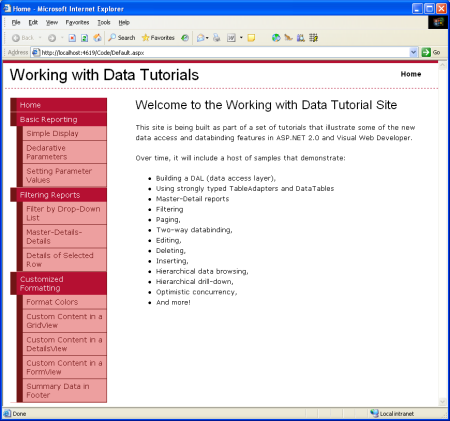](master-pages-and-site-navigation-vb/_static/image1.png)

**Figure 1**: The End Result of This Tutorial ([Click to view full-size image](master-pages-and-site-navigation-vb/_static/image3.png))

## Step 1: Creating the Master Page

The first step is to create the master page for the site. Right now our website consists of only the Typed DataSet (`Northwind.xsd`, in the `App_Code` folder), the BLL classes (`ProductsBLL.vb`, `CategoriesBLL.vb`, and so on, all in the `App_Code` folder), the database (`NORTHWND.MDF`, in the `App_Data` folder), the configuration file (`Web.config`), and a CSS stylesheet file (`Styles.css`). I cleaned out those pages and files demonstrating using the DAL and BLL from the first two tutorials since we will be reexamining those examples in greater detail in future tutorials.

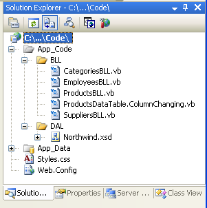

**Figure 2**: The Files in Our Project

To create a master page, right-click on the project name in the Solution Explorer and choose Add New Item. Then select the Master Page type from the list of templates and name it `Site.master`.

[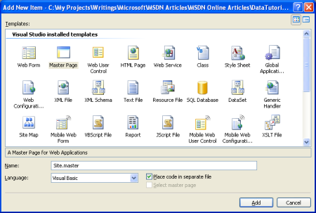](master-pages-and-site-navigation-vb/_static/image5.png)

**Figure 3**: Add a New Master Page to the Website ([Click to view full-size image](master-pages-and-site-navigation-vb/_static/image7.png))

Define the site-wide page layout here in the master page. You can use the Design view and add whatever Layout or Web controls you need, or you can manually add the markup by hand in the Source view. In my master page I use [cascading style sheets](http://www.w3schools.com/css/default.asp) for positioning and styles with the CSS settings defined in the external file `Style.css`. While you cannot tell from the markup shown below, the CSS rules are defined such that the navigation `
`'s content is absolutely positioned so that it appears on the left and has a fixed width of 200 pixels.

Site.master

[!code-aspx[Main](master-pages-and-site-navigation-vb/samples/sample1.aspx)]

A master page defines both the static page layout and the regions that can be edited by the ASP.NET pages that use the master page. These content editable regions are indicated by the ContentPlaceHolder control, which can be seen within the content `
`. Our master page has a single ContentPlaceHolder (`MainContent`), but master page's may have multiple ContentPlaceHolders.

With the markup entered above, switching to the Design view shows the master page's layout. Any ASP.NET pages that use this master page will have this uniform layout, with the ability to specify the markup for the `MainContent` region.

[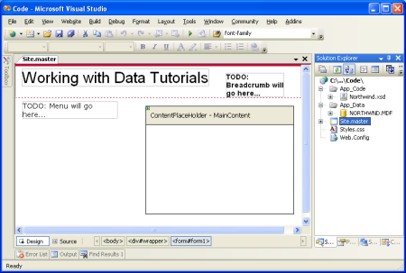](master-pages-and-site-navigation-vb/_static/image8.png)

**Figure 4**: The Master Page, When Viewed Through the Design View ([Click to view full-size image](master-pages-and-site-navigation-vb/_static/image10.png))

## Step 2: Adding a Homepage to the Website

With the master page defined, we're ready to add the ASP.NET pages for the website. Let's start by adding `Default.aspx`, our website's homepage. Right-click on the project name in the Solution Explorer and choose Add New Item. Pick the Web Form option from the template list and name the file `Default.aspx`. Also, check the "Select master page" checkbox.

[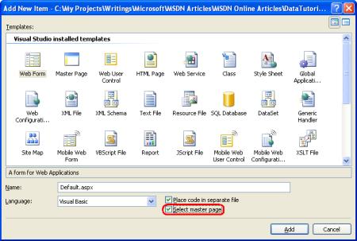](master-pages-and-site-navigation-vb/_static/image11.png)

**Figure 5**: Add a New Web Form, Checking the Select master page Checkbox ([Click to view full-size image](master-pages-and-site-navigation-vb/_static/image13.png))

After clicking the OK button, we're asked to choose what master page this new ASP.NET page should use. While you can have multiple master pages in your project, we have only one.

[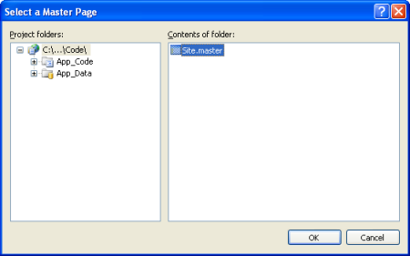](master-pages-and-site-navigation-vb/_static/image14.png)

**Figure 6**: Choose the Master Page this ASP.NET Page Should Use ([Click to view full-size image](master-pages-and-site-navigation-vb/_static/image16.png))

After picking the master page, the new ASP.NET pages will contain the following markup:

Default.aspx

[!code-aspx[Main](master-pages-and-site-navigation-vb/samples/sample2.aspx)]

In the `@Page` directive there's a reference to the master page file used (`MasterPageFile="~/Site.master"`), and the ASP.NET page's markup contains a Content control for each of the ContentPlaceHolder controls defined in the master page, with the control's `ContentPlaceHolderID` mapping the Content control to a specific ContentPlaceHolder. The Content control is where you place the markup you want to appear in the corresponding ContentPlaceHolder. Set the `@Page` directive's `Title` attribute to Home and add some welcoming content to the Content control:

Default.aspx

[!code-aspx[Main](master-pages-and-site-navigation-vb/samples/sample3.aspx)]

The `Title` attribute in the `@Page` directive allows us to set the page's title from the ASP.NET page, even though the `<title>` element is defined in the master page. We can also set the title programmatically, using `Page.Title`. Also note that the master page's references to stylesheets (such as `Style.css`) are automatically updated so that they work in any ASP.NET page, regardless of what directory the ASP.NET page is in relative to the master page.

Switching to the Design view we can see how our page will look in a browser. Note that in the Design view for the ASP.NET page that only the content editable regions are editable the non-ContentPlaceHolder markup defined in the master page is grayed out.

[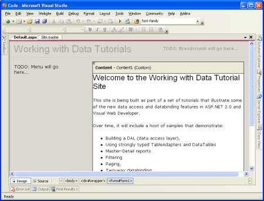](master-pages-and-site-navigation-vb/_static/image17.png)

**Figure 7**: The Design View for the ASP.NET Page Shows Both the Editable and Non-Editable Regions ([Click to view full-size image](master-pages-and-site-navigation-vb/_static/image19.png))

When the `Default.aspx` page is visited by a browser, the ASP.NET engine automatically merges the page's master page content and the ASP.NET's content, and renders the merged content into the final HTML that is sent down to the requesting browser. When the master page's content is updated, all ASP.NET pages that use this master page will have their content remerged with the new master page content the next time they are requested. In short, the master page model allows for a single page layout template to be defined (the master page) whose changes are immediately reflected across the entire site.

## Adding Additional ASP.NET Pages to the Website

Let's take a moment to add additional ASP.NET page stubs to the site that will eventually hold the various reporting demos. There will be more than 35 demos in total, so rather than creating all of the stub pages let's just create the first few. Since there will also be many categories of demos, to better manage the demos add a folder for the categories. Add the following three folders for now:

- `BasicReporting`
- `Filtering`
- `CustomFormatting`

Finally, add new files as shown in the Solution Explorer in Figure 8. When adding each file, remember to check the "Select master page" checkbox.

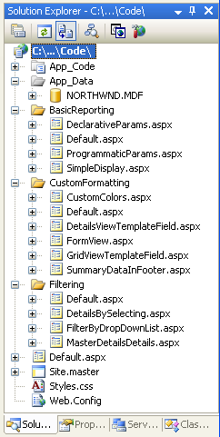

**Figure 8**: Add the Following Files

## Step 2: Creating a Site Map

One of the challenges of managing a website composed of more than a handful of pages is providing a straightforward way for visitors to navigate through the site. To begin with, the site's navigational structure must be defined. Next, this structure must be translated into navigable user interface elements, such as menus or breadcrumbs. Finally, this whole process needs to be maintained and updated as new pages are added to the site and existing ones removed. Prior to ASP.NET 2.0, developers were on their own for creating the site's navigational structure, maintaining it, and translating it into navigable user interface elements. With ASP.NET 2.0, however, developers can utilize the very flexible built in site navigation system.

The ASP.NET 2.0 site navigation system provides a means for a developer to define a site map and to then access this information through a programmatic API. ASP.NET ships with a site map provider that expects site map data to be stored in an XML file formatted in a particular way. But, since the site navigation system is built on the [provider model](http://aspnet.4guysfromrolla.com/articles/101905-1.aspx) it can be extended to support alternative ways for serializing the site map information. Jeff Prosise's article, [The SQL Site Map Provider You've Been Waiting For](https://msdn.microsoft.com/msdnmag/issues/06/02/WickedCode/default.aspx) shows how to create a site map provider that stores the site map in a SQL Server database; another option is to create [a site map provider based on the file system structure](http://aspnet.4guysfromrolla.com/articles/020106-1.aspx).

For this tutorial, however, let's use the default site map provider that ships with ASP.NET 2.0. To create the site map, simply right-click on the project name in the Solution Explorer, choose Add New Item, and choose the Site Map option. Leave the name as `Web.sitemap` and click the Add button.

[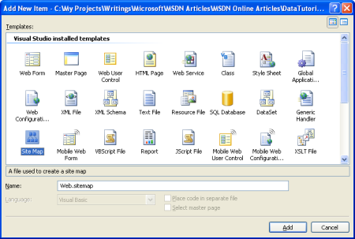](master-pages-and-site-navigation-vb/_static/image21.png)

**Figure 9**: Add a Site Map to Your Project ([Click to view full-size image](master-pages-and-site-navigation-vb/_static/image23.png))

The site map file is an XML file. Note that Visual Studio provides IntelliSense for the site map structure. The site map file must have the `<siteMap>` node as its root node, which must contain precisely one `<siteMapNode>` child element. That first `<siteMapNode>` element can then contain an arbitrary number of descendent `<siteMapNode>` elements.

Define the site map to mimic the file system structure. That is, add a `<siteMapNode>` element for each of the three folders, and child `<siteMapNode>` elements for each of the ASP.NET pages in those folders, like so:

Web.sitemap

[!code-xml[Main](master-pages-and-site-navigation-vb/samples/sample4.xml)]

The site map defines the website's navigational structure, which is a hierarchy that describes the various sections of the site. Each `<siteMapNode>` element in `Web.sitemap` represents a section in the site's navigational structure.

[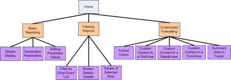](master-pages-and-site-navigation-vb/_static/image24.png)

**Figure 10**: The Site Map Represents a Hierarchical Navigational Structure ([Click to view full-size image](master-pages-and-site-navigation-vb/_static/image26.png))

ASP.NET exposes the site map's structure through the .NET Framework's [SiteMap class](https://msdn.microsoft.com/en-us/library/system.web.sitemap.aspx). This class has a `CurrentNode` property, which returns information about the section the user is currently visiting; the `RootNode` property returns the root of the site map (Home, in our site map). Both the `CurrentNode` and `RootNode` properties return [SiteMapNode](https://msdn.microsoft.com/en-us/library/system.web.sitemapnode.aspx) instances, which have properties like `ParentNode`, `ChildNodes`, `NextSibling`, `PreviousSibling`, and so on, that allow for the site map hierarchy to be walked.

## Step 3: Displaying a Menu Based on the Site Map

Accessing data in ASP.NET 2.0 can be accomplished programmatically, like in ASP.NET 1.x, or declaratively, through the new [data source controls](https://msdn.microsoft.com/en-us/library/ms227679.aspx). There are several built-in data source controls such as the SqlDataSource control, for accessing relational database data, the ObjectDataSource control, for accessing data from classes, and others. You can even create your own [custom data source controls](https://msdn.microsoft.com/asp.net/reference/data/default.aspx?pull=/library/en-us/dnvs05/html/DataSourceCon1.asp).

The data source controls serve as a proxy between your ASP.NET page and the underlying data. In order to display a data source control's retrieved data, we'll typically add another Web control to the page and bind it to the data source control. To bind a Web control to a data source control, simply set the Web control's `DataSourceID` property to the value of the data source control's `ID` property.

To aid in working with the site map's data, ASP.NET includes the SiteMapDataSource control, which allows us to bind a Web control against our website's site map. Two Web controls the TreeView and Menu are commonly used to provide a navigation user interface. To bind the site map data to one of these two controls, simply add a SiteMapDataSource to the page along with a TreeView or Menu control whose `DataSourceID` property is set accordingly. For example, we could add a Menu control to the master page using the following markup:

[!code-aspx[Main](master-pages-and-site-navigation-vb/samples/sample5.aspx)]

For a finer degree of control over the emitted HTML, we can bind the SiteMapDataSource control to the Repeater control, like so:

[!code-aspx[Main](master-pages-and-site-navigation-vb/samples/sample6.aspx)]

The SiteMapDataSource control returns the site map hierarchy one level at a time, starting with the root site map node (Home, in our site map), then the next level (Basic Reporting, Filtering Reports, and Customized Formatting), and so on. When binding the SiteMapDataSource to a Repeater, it enumerates the first level returned and instantiates the `ItemTemplate` for each `SiteMapNode` instance in that first level. To access a particular property of the `SiteMapNode`, we can use `Eval(propertyName)`, which is how we get each `SiteMapNode`'s `Url` and `Title` properties for the HyperLink control.

The Repeater example above will render the following markup:

[!code-html[Main](master-pages-and-site-navigation-vb/samples/sample7.html)]

These site map nodes (Basic Reporting, Filtering Reports, and Customized Formatting) comprise the *second* level of the site map being rendered, not the first. This is because the SiteMapDataSource's `ShowStartingNode` property is set to False, causing the SiteMapDataSource to bypass the root site map node and instead begin by returning the second level in the site map hierarchy.

To display the children for the Basic Reporting, Filtering Reports, and Customized Formatting `SiteMapNode` s, we can add another Repeater to the initial Repeater's `ItemTemplate`. This second Repeater will be bound to the `SiteMapNode` instance's `ChildNodes` property, like so:

[!code-aspx[Main](master-pages-and-site-navigation-vb/samples/sample8.aspx)]

These two Repeaters result in the following markup (some markup has been removed for brevity):

[!code-html[Main](master-pages-and-site-navigation-vb/samples/sample9.html)]

Using CSS styles chosen from [Rachel Andrew](http://www.rachelandrew.co.uk/)'s book [The CSS Anthology: 101 Essential Tips, Tricks, &amp; Hacks](https://www.amazon.com/gp/product/0957921888/qid=1137565739/sr=8-1/ref=pd_bbs_1/103-0562306-3386214?n=507846&amp;s=books&amp;v=glance), the `<ul>` and `<li>` elements are styled such that the markup produces the following visual output:

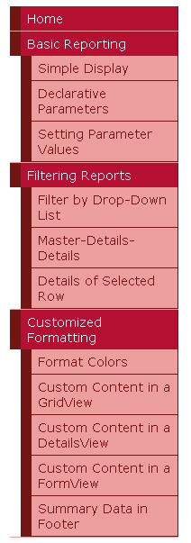

**Figure 11**: A Menu Composed from Two Repeaters and Some CSS

This menu is in the master page and bound to the site map defined in `Web.sitemap`, meaning that any change to the site map will be immediately reflected on all pages that use the `Site.master` master page.

## Disabling ViewState

All ASP.NET controls can optionally persist their state to the [view state](https://msdn.microsoft.com/msdnmag/issues/03/02/CuttingEdge/), which is serialized as a hidden form field in the rendered HTML. View state is used by controls to remember their programmatically-changed state across postbacks, such as the data bound to a data Web control. While view state permits information to be remembered across postbacks, it increases the size of the markup that must be sent to the client and can lead to severe page bloat if not closely monitored. Data Web controls especially the GridView are particularly notorious for adding dozens of extra kilobytes of markup to a page. While such an increase may be negligible for broadband or intranet users, view state can add several seconds to the round trip for dial-up users.

To see the impact of view state, visit a page in a browser and then view the source sent by the web page (in Internet Explorer, go to the View menu and choose the Source option). You can also turn on [page tracing](https://msdn.microsoft.com/en-us/library/sfbfw58f.aspx) to see the view state allocation used by each of the controls on the page. The view state information is serialized in a hidden form field named `__VIEWSTATE`, located in a `
` element immediately after the opening `<form>` tag. View state is only persisted when there is a Web Form being used; if your ASP.NET page does not include a `<form runat="server">` in its declarative syntax there won't be a `__VIEWSTATE` hidden form field in the rendered markup.

The `__VIEWSTATE` form field generated by the master page adds roughly 1,800 bytes to the page's generated markup. This extra bloat is due primarily to the Repeater control, as the contents of the SiteMapDataSource control are persisted to view state. While an extra 1,800 bytes may not seem like much to get excited about, when using a GridView with many fields and records, the view state can easily swell by a factor of 10 or more.

View state can be disabled at the page or control level by setting the `EnableViewState` property to `False`, thereby reducing the size of the rendered markup. Since the view state for a data Web control persists the data bound to the data Web control across postbacks, when disabling the view state for a data Web control the data must be bound on each and every postback. In ASP.NET version 1.x this responsibility fell on the shoulders of the page developer; with ASP.NET 2.0, however, the data Web controls will rebind to their data source control on each postback if needed.

To reduce the page's view state let's set the Repeater control's `EnableViewState` property to `False`. This can be done through the Properties window in the Designer or declaratively in the Source view. After making this change the Repeater's declarative markup should look like:

[!code-aspx[Main](master-pages-and-site-navigation-vb/samples/sample10.aspx)]

After this change, the page's rendered view state size has shrunk to a mere 52 bytes, a 97% savings in view state size! In the tutorials throughout this series we'll disable the view state of the data Web controls by default in order to reduce the size of the rendered markup. In the majority of the examples the `EnableViewState` property will be set to `False` and done so without mention. The only time view state will be discussed is in scenarios where it must be enabled in order for the data Web control to provide its expected functionality.

## Step 4: Adding Breadcrumb Navigation

To complete the master page, let's add a breadcrumb navigation UI element to each page. The breadcrumb quickly shows users their current position within the site hierarchy. Adding a breadcrumb in ASP.NET 2.0 is easy just add a SiteMapPath control to the page; no code is needed.

For our site, add this control to the header `
`:

[!code-aspx[Main](master-pages-and-site-navigation-vb/samples/sample11.aspx)]

The breadcrumb shows the current page the user is visiting in the site map hierarchy as well as that site map node's "ancestors," all the way up to the root (Home, in our site map).

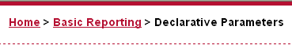

**Figure 12**: The Breadcrumb Displays the Current Page and its Ancestors in the Site Map Hierarchy

## Step 5: Adding the Default Page for Each Section

The tutorials in our site are broken down into different categories Basic Reporting, Filtering, Custom Formatting, and so on with a folder for each category and the corresponding tutorials as ASP.NET pages within that folder. Additionally, each folder contains a `Default.aspx` page. For this default page, let's display all of the tutorials for the current section. That is, for the `Default.aspx` in the `BasicReporting` folder we'd have links to `SimpleDisplay.aspx`, `DeclarativeParams.aspx`, and `ProgrammaticParams.aspx`. Here, again, we can use the `SiteMap` class and a data Web control to display this information based upon the site map defined in `Web.sitemap`.

Let's display an unordered list using a Repeater again, but this time we'll display the title and description of the tutorials. Since the markup and code to accomplish this will need to be repeated for each `Default.aspx` page, we can encapsulate this UI logic in a [User Control](https://msdn.microsoft.com/en-us/library/y6wb1a0e.aspx). Create a folder in the website called `UserControls` and add to that a new item of type Web User Control named `SectionLevelTutorialListing.ascx`, and add the following markup:

[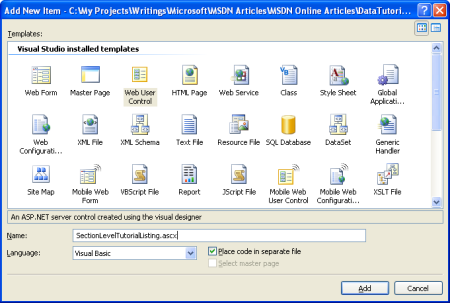](master-pages-and-site-navigation-vb/_static/image29.png)

**Figure 13**: Add a New Web User Control to the `UserControls` Folder ([Click to view full-size image](master-pages-and-site-navigation-vb/_static/image31.png))

SectionLevelTutorialListing.ascx

[!code-aspx[Main](master-pages-and-site-navigation-vb/samples/sample12.aspx)]

SectionLevelTutorialListing.ascx.vb

[!code-vb[Main](master-pages-and-site-navigation-vb/samples/sample13.vb)]

In the previous Repeater example we bound the `SiteMap` data to the Repeater declaratively; the `SectionLevelTutorialListing` User Control, however, does so programmatically. In the `Page_Load` event handler, a check is made to ensure that this page s URL maps to a node in the site map. If this User Control is used in a page that does not have a corresponding `<siteMapNode>` entry, `SiteMap.CurrentNode` will return `Nothing` and no data will be bound to the Repeater. Assuming we have a `CurrentNode`, we bind its `ChildNodes` collection to the Repeater. Since our site map is set up such that the `Default.aspx` page in each section is the parent node of all of the tutorials within that section, this code will display links to and descriptions of all of the section's tutorials, as shown in the screen shot below.

Once this Repeater has been created, open the `Default.aspx` pages in each of the folders, go to the Design view, and simply drag the User Control from the Solution Explorer onto the Design surface where you want the tutorial list to appear.

[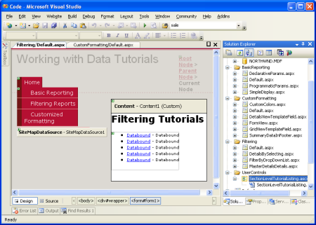](master-pages-and-site-navigation-vb/_static/image32.png)

**Figure 14**: The User Control has Been Added to `Default.aspx` ([Click to view full-size image](master-pages-and-site-navigation-vb/_static/image34.png))

**Figure 15**: The Basic Reporting Tutorials are Listed ([Click to view full-size image](master-pages-and-site-navigation-vb/_static/image37.png))

## Summary

With the site map defined and the master page complete, we now have a consistent page layout and navigation scheme for our data-related tutorials. Regardless of how many pages we add to our site, updating the site-wide page layout or site navigation information is a quick and simple process due to this information being centralized. Specifically, the page layout information is defined in the master page `Site.master` and the site map in `Web.sitemap`. We didn't need to write *any* code to achieve this site-wide page layout and navigation mechanism, and we retain full WYSIWYG designer support in Visual Studio.

Having completed the Data Access Layer and Business Logic Layer and having a consistent page layout and site navigation defined, we're ready to begin exploring common reporting patterns. In the next three tutorials we'll look at basic reporting tasks displaying data retrieved from the BLL in the GridView, DetailsView, and FormView controls.

Happy Programming!

## Further Reading

For more information on the topics discussed in this tutorial, refer to the following resources:

- [ASP.NET Master Pages Overview](https://msdn.microsoft.com/en-us/library/wtxbf3hh.aspx)
- [Master Pages in ASP.NET 2.0](http://odetocode.com/Articles/419.aspx)
- [ASP.NET 2.0 Design Templates](https://msdn.microsoft.com/asp.net/reference/design/templates/default.aspx)
- [ASP.NET Site Navigation Overview](https://msdn.microsoft.com/en-us/library/e468hxky.aspx)
- [Examining ASP.NET 2.0's Site Navigation](http://aspnet.4guysfromrolla.com/articles/111605-1.aspx)
- [ASP.NET 2.0 Site Navigation Features](https://weblogs.asp.net/scottgu/archive/2005/11/20/431019.aspx)
- [Understanding ASP.NET View State](https://msdn.microsoft.com/library/default.asp?url=/library/en-us/dnaspp/html/viewstate.asp)
- [How to: Enable Tracing for an ASP.NET Page](https://msdn.microsoft.com/en-us/library/94c55d08%28VS.80%29.aspx)
- [ASP.NET User Controls](https://msdn.microsoft.com/en-us/library/y6wb1a0e.aspx)

## About the Author

[Scott Mitchell](http://www.4guysfromrolla.com/ScottMitchell.shtml), author of seven ASP/ASP.NET books and founder of [4GuysFromRolla.com](http://www.4guysfromrolla.com), has been working with Microsoft Web technologies since 1998. Scott works as an independent consultant, trainer, and writer. His latest book is [*Sams Teach Yourself ASP.NET 2.0 in 24 Hours*](https://www.amazon.com/exec/obidos/ASIN/0672327384/4guysfromrollaco). He can be reached at [mitchell@4GuysFromRolla.com.](mailto:mitchell@4GuysFromRolla.com) or via his blog, which can be found at [http://ScottOnWriting.NET](http://ScottOnWriting.NET).

## Special Thanks To

This tutorial series was reviewed by many helpful reviewers. Lead reviewers for this tutorial were Liz Shulok, Dennis Patterson, and Hilton Giesenow. Interested in reviewing my upcoming MSDN articles? If so, drop me a line at [mitchell@4GuysFromRolla.com.](mailto:mitchell@4GuysFromRolla.com)

>[!div class="step-by-step"]
[Previous](creating-a-business-logic-layer-vb.md)