Master/Detail Filtering Across Two Pages (VB)
====================
by [Scott Mitchell](https://twitter.com/ScottOnWriting)

[Download Sample App](http://download.microsoft.com/download/5/d/7/5d7571fc-d0b7-4798-ad4a-c976c02363ce/ASPNET_Data_Tutorial_9_VB.exe) or [Download PDF](master-detail-filtering-across-two-pages-vb/_static/datatutorial09vb1.pdf)

> In this tutorial we'll implement this pattern by using a GridView to list the suppliers in the database. Each supplier row in the GridView will contain a View Products link that, when clicked, will take the user to a separate page that lists those products for the selected supplier.

## Introduction

In the previous two tutorials we saw how to display master/detail reports in a single web page using DropDownLists to display the "master" records and a [GridView](master-detail-filtering-with-a-dropdownlist-vb.md) or [DetailsView](master-detail-filtering-with-two-dropdownlists-vb.md) control to display the "details." Another common pattern used for master/details reports is to have the master records on one web page and the details shown on another. A forum website, like [the ASP.NET Forums](https://forums.asp.net/), is a great example of this pattern in practice. The ASP.NET Forums are composed of a variety of forums Getting Started, Web Forms, Data Presentation Controls, and so on. Each forum is composed of many threads and each thread is composed of a number of posts. On the ASP.NET Forums homepage, the forums are listed. Clicking on a forum whisks you to a `ShowForum.aspx` page, which lists the threads for that forum. Likewise, clicking on a thread takes you to `ShowPost.aspx`, which displays the posts for the thread that was clicked.

In this tutorial we'll implement this pattern by using a GridView to list the suppliers in the database. Each supplier row in the GridView will contain a View Products link that, when clicked, will take the user to a separate page that lists those products for the selected supplier.

## Step 1: Adding`SupplierListMaster.aspx`and`ProductsForSupplierDetails.aspx`Pages to the`Filtering`Folder

When defining the page layout in the third tutorial we added a number of "starter" pages in the `BasicReporting`, `Filtering`, and `CustomFormatting` folders. However, we did not add a starter page for this tutorial at that time, so take a moment to add two new pages to the `Filtering` folder: `SupplierListMaster.aspx` and `ProductsForSupplierDetails.aspx`. `SupplierListMaster.aspx` will list the "master" records (the suppliers) while `ProductsForSupplierDetails.aspx` will display the products for the selected supplier.

When creating these two new pages be certain to associate them with the `Site.master` master page.

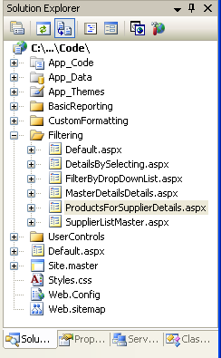

**Figure 1**: Add the `SupplierListMaster.aspx` and `ProductsForSupplierDetails.aspx` Pages to the `Filtering` Folder

Also, when adding new pages to the project, be sure to update the site map file, `Web.sitemap`, accordingly. For this tutorial simply add the `SupplierListMaster.aspx` page to the site map using the following XML content as a child of the Filtering Reports `<siteMapNode>` element:

[!code-xml[Main](master-detail-filtering-across-two-pages-vb/samples/sample1.xml)]

> [!NOTE]
> You can help automate the process of updating the site map file when adding new ASP.NET pages using [K. Scott Allen](http://odetocode.com/Blogs/scott/)'s free Visual Studio [Site Map Macro](http://odetocode.com/Blogs/scott/archive/2005/11/29/2537.aspx).

## Step 2: Displaying the Supplier List in`SupplierListMaster.aspx`

With the `SupplierListMaster.aspx` and `ProductsForSupplierDetails.aspx` pages created, our next step is to create the GridView of suppliers in `SupplierListMaster.aspx`. Add a GridView to the page and bind it to a new ObjectDataSource. This ObjectDataSource should use the `SuppliersBLL` class's `GetSuppliers()` method to return all suppliers.

**Figure 2**: Select the `SuppliersBLL` Class ([Click to view full-size image](master-detail-filtering-across-two-pages-vb/_static/image4.png))

[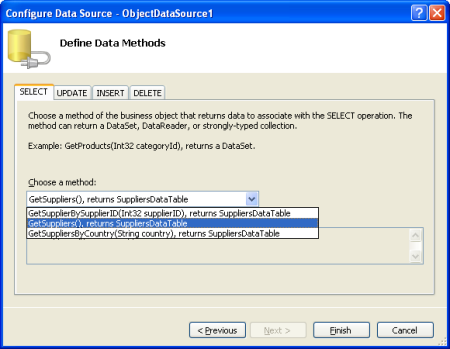](master-detail-filtering-across-two-pages-vb/_static/image5.png)

**Figure 3**: Configure the ObjectDataSource to Use the `GetSuppliers()` Method ([Click to view full-size image](master-detail-filtering-across-two-pages-vb/_static/image7.png))

We need to include a link titled View Products in each GridView row that, when clicked, takes the user to `ProductsForSupplierDetails.aspx` passing in the selected row's `SupplierID` value through the querystring. For example, if user clicks on the View Products link for the Tokyo Traders supplier (which has a `SupplierID` value of 4), they should be sent to `ProductsForSupplierDetails.aspx?SupplierID=4`.

To accomplish this, add a [HyperLinkField](https://msdn.microsoft.com/en-us/library/system.web.ui.webcontrols.hyperlinkfield.aspx) to the GridView, which adds a hyperlink to each GridView row. Start by clicking the Edit Columns link from the GridView's smart tag. Next, select the HyperLinkField from the list in the upper left and click Add to include the HyperLinkField in the GridView's field list.

**Figure 4**: Add a HyperLinkField to the GridView ([Click to view full-size image](master-detail-filtering-across-two-pages-vb/_static/image10.png))

The HyperLinkField can be configured to use the same text or URL values the link in each GridView row, or can base these values on the data values bound to each particular row. To specify a static value across all rows use the HyperLinkField's `Text` or `NavigateUrl` properties. Since we want the link text to be the same for all rows, set the HyperLinkField's `Text` property to View Products.

[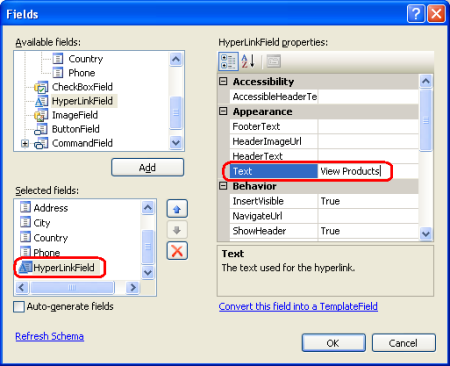](master-detail-filtering-across-two-pages-vb/_static/image11.png)

**Figure 5**: Set the HyperLinkField's `Text` Property to View Products ([Click to view full-size image](master-detail-filtering-across-two-pages-vb/_static/image13.png))

To set the text or URL values to be based on the underlying data bound to the GridView row, specify the data fields the text or URL values should be pulled from in the `DataTextField` or `DataNavigateUrlFields` properties. `DataTextField` can only be set to a single data field; `DataNavigateUrlFields`, however, can be set to a comma-delimited list of data fields. We frequently need to base the text or URL on a combination of the current row's data field value and some static markup. In this tutorial, for example, we want the URL of the HyperLinkField's links to be `ProductsForSupplierDetails.aspx?SupplierID=supplierID`, where *`supplierID`* is each GridView's row's `SupplierID` value. Notice that we need both static and data-driven values here: the `ProductsForSupplierDetails.aspx?SupplierID=` portion of the link's URL is static, whereas the *`supplierID`* portion is data-driven as its value is each row's own `SupplierID` value.

To indicate a combination of static and data-driven values, use the `DataTextFormatString` and `DataNavigateUrlFormatString` properties. In these properties enter the static markup as needed and then use the marker `{0}` where you want the value of the field specified in the `DataTextField` or `DataNavigateUrlFields` properties to appear. If the `DataNavigateUrlFields` property has multiple fields specified use `{0}` where you want the first field value inserted, `{1}` for the second field value, and so on.

Applying this to our tutorial, we need to set the `DataNavigateUrlFields` property to `SupplierID`, since that's the data field whose value we need to customize on a per-row basis, and the `DataNavigateUrlFormatString` property to `ProductsForSupplierDetails.aspx?SupplierID={0}`.

[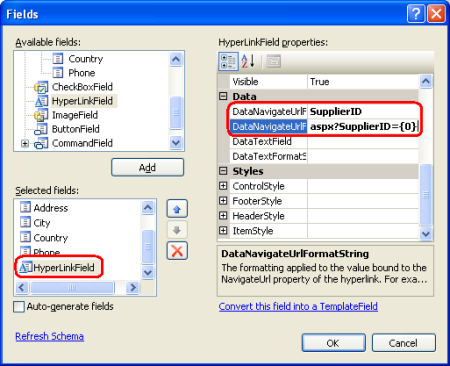](master-detail-filtering-across-two-pages-vb/_static/image14.png)

**Figure 6**: Configure the HyperLinkField to Include the Proper Link URL Based Upon the `SupplierID` ([Click to view full-size image](master-detail-filtering-across-two-pages-vb/_static/image16.png))

After adding the HyperLinkField, feel free to customize and reorder the GridView's fields. The following markup shows the GridView after I've made some minor field-level customizations.

[!code-aspx[Main](master-detail-filtering-across-two-pages-vb/samples/sample2.aspx)]

Take a moment to view the `SupplierListMaster.aspx` page through a browser. As Figure 7 shows, the page currently lists all of the suppliers including a View Products link. Clicking on the View Products link will take you to `ProductsForSupplierDetails.aspx`, passing along the supplier's `SupplierID` in the querystring.

[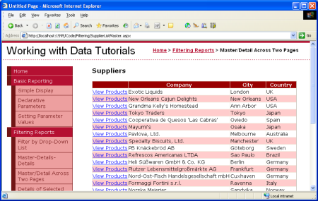](master-detail-filtering-across-two-pages-vb/_static/image17.png)

**Figure 7**: Each Supplier Row Contains a View Products Link ([Click to view full-size image](master-detail-filtering-across-two-pages-vb/_static/image19.png))

## Step 3: Listing the Supplier's Products in`ProductsForSupplierDetails.aspx`

At this point the `SupplierListMaster.aspx` page is sending users to `ProductsForSupplierDetails.aspx`, passing the selected supplier's `SupplierID` in the querystring. The tutorial's final step is to display the products in a GridView in `ProductsForSupplierDetails.aspx` whose `SupplierID` equals the `SupplierID` passed in through the querystring. To accomplish this start by adding a GridView to the `ProductsForSupplierDetails.aspx` page, using a new ObjectDataSource control named `ProductsBySupplierDataSource` that invokes the `GetProductsBySupplierID(supplierID)` method from the `ProductsBLL` class.

**Figure 8**: Add a New ObjectDataSource Named `ProductsBySupplierDataSource` ([Click to view full-size image](master-detail-filtering-across-two-pages-vb/_static/image22.png))

[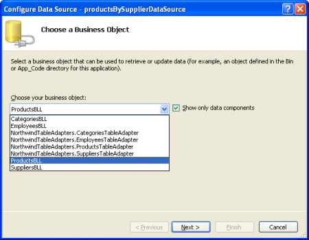](master-detail-filtering-across-two-pages-vb/_static/image23.png)

**Figure 9**: Select the `ProductsBLL` Class ([Click to view full-size image](master-detail-filtering-across-two-pages-vb/_static/image25.png))

[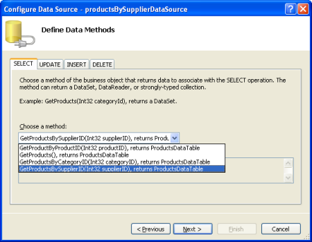](master-detail-filtering-across-two-pages-vb/_static/image26.png)

**Figure 10**: Have the ObjectDataSource Invoke the `GetProductsBySupplierID(supplierID)` Method ([Click to view full-size image](master-detail-filtering-across-two-pages-vb/_static/image28.png))

The final step of the Configure Data Source wizard asks us to provide the source of the `GetProductsBySupplierID(supplierID)` method's *`supplierID`* parameter. To use the querystring value, set the Parameter source to QueryString and enter the name of the querystring value to use in the QueryStringField textbox (`SupplierID`).

[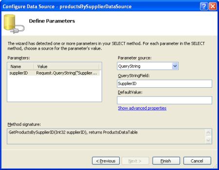](master-detail-filtering-across-two-pages-vb/_static/image29.png)

**Figure 11**: Populate the *`supplierID`* Parameter Value from the `SupplierID` Querystring Value ([Click to view full-size image](master-detail-filtering-across-two-pages-vb/_static/image31.png))

That's all there is to it! Figure 12 shows the `ProductsForSupplierDetails.aspx` page when visited by clicking the Tokyo Traders link from `SupplierListMaster.aspx`.

**Figure 12**: The Products Supplied by Tokyo Traders are Shown ([Click to view full-size image](master-detail-filtering-across-two-pages-vb/_static/image34.png))

## Displaying Supplier Information in`ProductsForSupplierDetails.aspx`

As Figure 12 shows, the `ProductsForSupplierDetails.aspx` page simply lists the products that are supplied by the `SupplierID` specified in the querystring. Someone sent directly to this page, however, would not know that Figure 12 is showing Tokyo Traders' products. To remedy this we can display supplier information in this page as well.

Start by adding a FormView above the products GridView. Create a new ObjectDataSource control named `SuppliersDataSource` that invokes the `SuppliersBLL` class's `GetSupplierBySupplierID(supplierID)` method.

[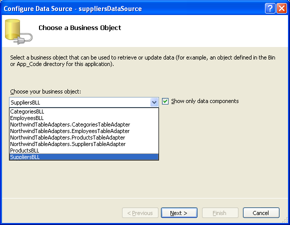](master-detail-filtering-across-two-pages-vb/_static/image35.png)

**Figure 13**: Select the `SuppliersBLL` Class ([Click to view full-size image](master-detail-filtering-across-two-pages-vb/_static/image37.png))

**Figure 14**: Have the ObjectDataSource Invoke the `GetSupplierBySupplierID(supplierID)` Method ([Click to view full-size image](master-detail-filtering-across-two-pages-vb/_static/image40.png))

As with the `ProductsBySupplierDataSource`, have the *`supplierID`* parameter assigned the value of the `SupplierID` querystring value.

[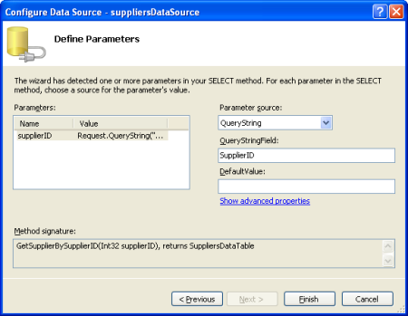](master-detail-filtering-across-two-pages-vb/_static/image41.png)

**Figure 15**: Populate the *`supplierID`* Parameter Value from the `SupplierID` Querystring Value ([Click to view full-size image](master-detail-filtering-across-two-pages-vb/_static/image43.png))

When binding the FormView to the ObjectDataSource in the Design view, Visual Studio will automatically create the FormView's `ItemTemplate`, `InsertItemTemplate`, and `EditItemTemplate` with Label and TextBox Web controls for each of the data fields returned by the ObjectDataSource. Since we just want to display supplier information feel free to remove the `InsertItemTemplate` and `EditItemTemplate`. Next, edit the ItemTemplate so that it displays the supplier's company name in an `<h3>` element and the address, city, country, and phone number beneath the company name. Alternatively, you can manually set the FormView's `DataSourceID` and create the `ItemTemplate` markup, as we did back in the "[Displaying Data With the ObjectDataSource](../basic-reporting/displaying-data-with-the-objectdatasource-cs.md)" tutorial.

After these edits the FormView's declarative markup should look similar to the following:

[!code-aspx[Main](master-detail-filtering-across-two-pages-vb/samples/sample3.aspx)]

Figure 16 shows a screen shot of the `ProductsForSupplierDetails.aspx` page after the supplier information detailed above has been included.

**Figure 16**: The List of Products Includes a Summary About the Supplier ([Click to view full-size image](master-detail-filtering-across-two-pages-vb/_static/image46.png))

## Applying the Final Touches for the`ProductsForSupplierDetails.aspx`UI

To improve the user experience for this report there are a couple of additions we ought to make to the `ProductsForSupplierDetails.aspx` page. Currently the only way a user can go from the `ProductsForSupplierDetails.aspx` page back to the list of suppliers is to click their browser's back button. Let's add a HyperLink control to the `ProductsForSupplierDetails.aspx` page that links back to `SupplierListMaster.aspx`, providing another way for the user to return to the master list.

[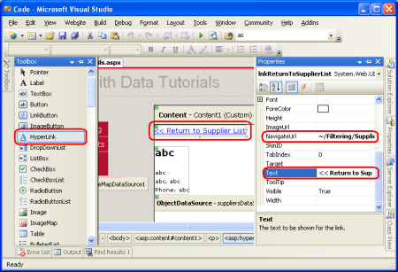](master-detail-filtering-across-two-pages-vb/_static/image47.png)

**Figure 17**: Add a HyperLink Control to Take the User Back to `SupplierListMaster.aspx` ([Click to view full-size image](master-detail-filtering-across-two-pages-vb/_static/image49.png))

If the user clicks on the View Products link for a supplier that doesn't have any products, the `ProductsBySupplierDataSource` ObjectDataSource in `ProductsForSupplierDetails.aspx` won't return any results. The GridView bound to the ObjectDataSource won't render any markup resulting in a blank region on the page in the user's browser. To more clearly communicate to the user that there are no products associated with the selected supplier we can set the GridView's `EmptyDataText` property to the message we want displayed when such a situation arises. I've set this property to "There are no products provided by this supplier�"

By default, all suppliers in the Northwinds database provide at least one product. However, for this tutorial I've manually modified the `Products` table so that the supplier Escargots Nouveaux is no longer associated with any products. Figure 18 shows the details page for Escargots Nouveaux after this change has been made.

[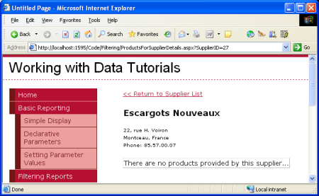](master-detail-filtering-across-two-pages-vb/_static/image50.png)

**Figure 18**: Users are Informed that the Supplier Doesn't Provide Any Products ([Click to view full-size image](master-detail-filtering-across-two-pages-vb/_static/image52.png))

## Summary

While master/detail reports can display both the master and detail records on a single page, in many websites they are separated out across two web pages. In this tutorial we looked at how to implement such a master/detail report by having the suppliers listed in a GridView in the "master" web page and the associated products listed in the "details" page. Each supplier row in the master web page contained a link to the details page that passed along the row's `SupplierID` value. Such row-specific links can be easily added using the GridView's HyperLinkField.

In the details page retrieving those products for the specified supplier was accomplished by invoking the `ProductsBLL` class's `GetProductsBySupplierID(supplierID)` method. The *`supplierID`* parameter value was specified declaratively using the querystring as the parameter source. We also looked at how to display the supplier details in the details page using a FormView.

Our [next tutorial](master-detail-using-a-selectable-master-gridview-with-a-details-detailview-vb.md) is the final one on master/detail reports. We'll look at how to display a list of products in a GridView where each row has a Select button. Clicking on the Select button will display that product's details in a DetailsView control on the same page.

Happy Programming!

## About the Author

[Scott Mitchell](http://www.4guysfromrolla.com/ScottMitchell.shtml), author of seven ASP/ASP.NET books and founder of [4GuysFromRolla.com](http://www.4guysfromrolla.com), has been working with Microsoft Web technologies since 1998. Scott works as an independent consultant, trainer, and writer. His latest book is [*Sams Teach Yourself ASP.NET 2.0 in 24 Hours*](https://www.amazon.com/exec/obidos/ASIN/0672327384/4guysfromrollaco). He can be reached at [mitchell@4GuysFromRolla.com.](mailto:mitchell@4GuysFromRolla.com) or via his blog, which can be found at [http://ScottOnWriting.NET](http://ScottOnWriting.NET).

## Special Thanks To

This tutorial series was reviewed by many helpful reviewers. Lead reviewer for this tutorial was Hilton Giesenow. Interested in reviewing my upcoming MSDN articles? If so, drop me a line at [mitchell@4GuysFromRolla.com.](mailto:mitchell@4GuysFromRolla.com)

>[!div class="step-by-step"]
[Previous](master-detail-filtering-with-two-dropdownlists-vb.md)
[Next](master-detail-using-a-selectable-master-gridview-with-a-details-detailview-vb.md)