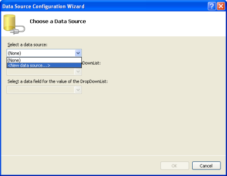
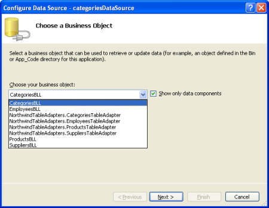
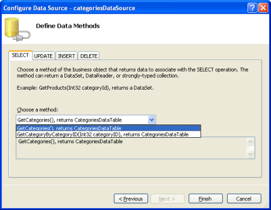
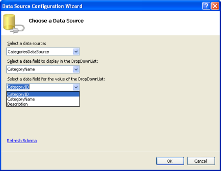
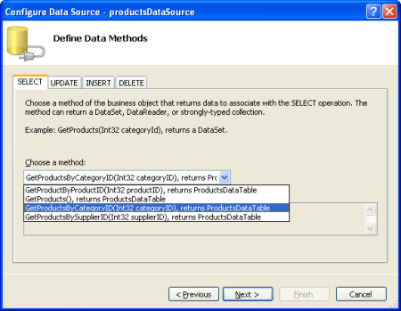
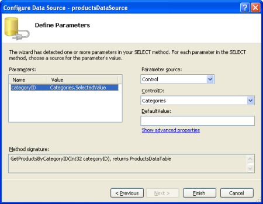
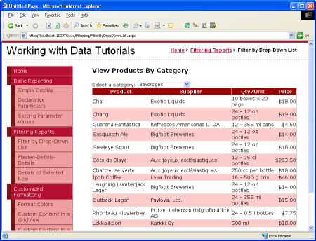
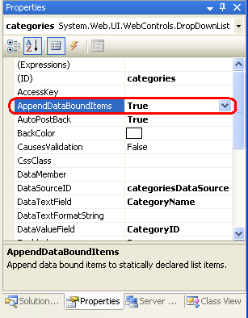
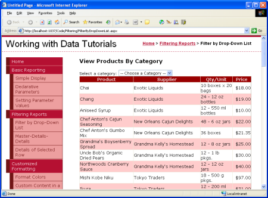

Master/Detail Filtering With a DropDownList (C#)
====================
by [Scott Mitchell](https://twitter.com/ScottOnWriting)

[Download Sample App](http://download.microsoft.com/download/4/6/3/463cf87c-4724-4cbc-b7b5-3f866f43ba50/ASPNET_Data_Tutorial_7_CS.exe) or [Download PDF](master-detail-filtering-with-a-dropdownlist-cs/_static/datatutorial07cs1.pdf)

> In this tutorial we'll see how to display the master records in a DropDownList control and the details of the selected list item in a GridView.

## Introduction

A common type of report is the *master/detail report*, in which the report begins by showing some set of "master" records. The user can then drill down into one of the master records, thereby viewing that master record's "details." Master/detail reports are an ideal choice for visualizing one-to-many relationships, such as a report showing all of the categories and then allowing a user to select a particular category and display its associated products. Additionally, master/detail reports are useful for displaying detailed information from particularly "wide" tables (ones that have a lot of columns). For example, the "master" level of a master/detail report might show just the product name and unit price of the products in the database, and drilling down into a particular product would show the additional product fields (category, supplier, quantity per unit, and so on).

There are many ways with which a master/detail report can be implemented. Over this and the next three tutorials we'll look at a variety of master/detail reports. In this tutorial we'll see how to display the master records in a [DropDownList control](https://msdn.microsoft.com/en-us/library/dtx91y0z.aspx) and the details of the selected list item in a GridView. In particular, this tutorial's master/detail report will list category and product information.

## Step 1: Displaying the Categories in a DropDownList

Our master/detail report will list the categories in a DropDownList, with the selected list item's products displayed further down in the page in a GridView. The first task ahead of us, then, is to have the categories displayed in a DropDownList. Open the `FilterByDropDownList.aspx` page in the `Filtering` folder, drag on a DropDownList from the Toolbox onto the page's designer, and set its `ID` property to `Categories`. Next, click on the Choose Data Source link from the DropDownList's smart tag. This will display the Data Source Configuration wizard.

**Figure 1**: Specify the DropDownList's Data Source ([Click to view full-size image](master-detail-filtering-with-a-dropdownlist-cs/_static/image3.png))

Choose to add a new ObjectDataSource named `CategoriesDataSource` that invokes the `CategoriesBLL` class's `GetCategories()` method.

**Figure 2**: Add a New ObjectDataSource Named `CategoriesDataSource` ([Click to view full-size image](master-detail-filtering-with-a-dropdownlist-cs/_static/image6.png))

**Figure 3**: Choose to Use the `CategoriesBLL` Class ([Click to view full-size image](master-detail-filtering-with-a-dropdownlist-cs/_static/image9.png))

**Figure 4**: Configure the ObjectDataSource to Use the `GetCategories()` Method ([Click to view full-size image](master-detail-filtering-with-a-dropdownlist-cs/_static/image12.png))

After configuring the ObjectDataSource we still need to specify what data source field should be displayed in DropDownList and which one should be associated as the value for the list item. Have the `CategoryName` field as the display and `CategoryID` as the value for each list item.

**Figure 5**: Have the DropDownList Display the `CategoryName` Field and Use `CategoryID` as the Value ([Click to view full-size image](master-detail-filtering-with-a-dropdownlist-cs/_static/image15.png))

At this point we have a DropDownList control that's populated with the records from the `Categories` table (all accomplished in about six seconds). Figure 6 shows our progress thus far when viewed through a browser.

**Figure 6**: A Drop-Down Lists the Current Categories ([Click to view full-size image](master-detail-filtering-with-a-dropdownlist-cs/_static/image18.png))

## Step 2: Adding the Products GridView

That last step in our master/detail report is to list the products associated with the selected category. To accomplish this, add a GridView to the page and create a new ObjectDataSource named `productsDataSource`. Have the `productsDataSource` control cull its data from the `ProductsBLL` class's `GetProductsByCategoryID(categoryID)` method.

**Figure 7**: Select the `GetProductsByCategoryID(categoryID)` Method ([Click to view full-size image](master-detail-filtering-with-a-dropdownlist-cs/_static/image21.png))

After choosing this method, the ObjectDataSource wizard prompts us for the value for the method's *`categoryID`* parameter. To use the value of the selected `categories` DropDownList item set the Parameter source to Control and the ControlID to `Categories`.

**Figure 8**: Set the *`categoryID`* Parameter to the Value of the `Categories` DropDownList ([Click to view full-size image](master-detail-filtering-with-a-dropdownlist-cs/_static/image24.png))

Take a moment to check out our progress in a browser. When first visiting the page, those products belong to the selected category (Beverages) are displayed (as shown in Figure 9), but changing the DropDownList doesn't update the data. This is because a postback must occur for the GridView to update. To accomplish this we have two options (neither of which requires writing any code):

- **Set the categories DropDownList's**[AutoPostBack property](https://msdn.microsoft.com/en-US/library/system.web.ui.webcontrols.listcontrol.autopostback%28VS.80%29.aspx)**to True.** (You can accomplish this by checking the Enable AutoPostBack option in the DropDownList's smart tag.) This will trigger a postback whenever the DropDownList's selected item is changed by the user. Therefore, when the user selects a new category from the DropDownList a postback will ensue and the GridView will be updated with the products for the newly selected category. (This is the approach I've used in this tutorial.)
- **Add a Button Web control next to the DropDownList.** Set its `Text` property to Refresh or something similar. With this approach, the user will need to select a new category and then click the Button. Clicking the Button will cause a postback and update the GridView to list those products of the selected category.

Figures 9 and 10 illustrate the master/detail report in action.

**Figure 9**: When First Visiting the Page, the Beverage Products are Displayed ([Click to view full-size image](master-detail-filtering-with-a-dropdownlist-cs/_static/image27.png))

**Figure 10**: Selecting a New Product (Produce) Automatically Causes a PostBack, Updating the GridView ([Click to view full-size image](master-detail-filtering-with-a-dropdownlist-cs/_static/image30.png))

## Adding a "-- Choose a Category --" List Item

When first visiting the `FilterByDropDownList.aspx` page the categories DropDownList's first list item (Beverages) is selected by default, showing the beverage products in the GridView. Rather than showing the first category's products, we may want to instead have a DropDownList item selected that says something like, "-- Choose a Category --".

To add a new list item to the DropDownList, go to the Properties window and click on the ellipses in the `Items` property. Add a new list item with the `Text` "-- Choose a Category --" and the `Value` `-1`.

**Figure 11**: Add a -- Choose a Category -- List Item ([Click to view full-size image](master-detail-filtering-with-a-dropdownlist-cs/_static/image33.png))

Alternatively, you can add the list item by adding the following markup to the DropDownList:

[!code-aspx[Main](master-detail-filtering-with-a-dropdownlist-cs/samples/sample1.aspx)]

Additionally, we need to set the DropDownList control's `AppendDataBoundItems` to True because when the categories are bound to the DropDownList from the ObjectDataSource they'll overwrite any manually-added list items if `AppendDataBoundItems` isn't True.

**Figure 12**: Set the `AppendDataBoundItems` Property to True

After these changes, when first visiting the page the "-- Choose a Category --" option is selected and no products are displayed.

**Figure 13**: On the Initial Page Load No Products are Displayed ([Click to view full-size image](master-detail-filtering-with-a-dropdownlist-cs/_static/image37.png))

The reason no products are displayed when because the "-- Choose a Category --" list item is selected is because its value is `-1` and there are no products in the database with a `CategoryID` of `-1`. If this is the behavior you want then you're done at this point! If, however, you want to display *all* of the categories when the "-- Choose a Category --" list item is selected, return to the `ProductsBLL` class and customize the `GetProductsByCategoryID(categoryID)` method so that it invokes the `GetProducts()` method if the passed in *`categoryID`* parameter is less than zero:

[!code-csharp[Main](master-detail-filtering-with-a-dropdownlist-cs/samples/sample2.cs)]

The technique used here is similar to the approach we used to display all suppliers back in the [Declarative Parameters](../basic-reporting/declarative-parameters-cs.md) tutorial, although for this example we're using a value of `-1` to indicate that all records should be retrieved as opposed to `null`. This is because the *`categoryID`* parameter of the `GetProductsByCategoryID(categoryID)` method expects as integer value passed in, whereas in the Declarative Parameters tutorial we were passing in a string input parameter.

Figure 14 shows a screen shot of `FilterByDropDownList.aspx` when the "-- Choose a Category --" option is selected. Here, all of the products are displayed by default, and the user can narrow the display by choosing a specific category.

**Figure 14**: All of the Products are Now Listed By Default ([Click to view full-size image](master-detail-filtering-with-a-dropdownlist-cs/_static/image40.png))

## Summary

When displaying hierarchically-related data, it often helps to present the data using master/detail reports, from which the user can start perusing the data from the top of the hierarchy and drill down into details. In this tutorial we examined building a simple master/detail report showing a selected category's products. This was accomplished by using a DropDownList for the list of categories and a GridView for the products belonging to the selected category.

In the [next tutorial](master-detail-filtering-with-two-dropdownlists-cs.md) we'll take the DropDownList interface one step further, using two DropDownLists.

Happy Programming!

## About the Author

[Scott Mitchell](http://www.4guysfromrolla.com/ScottMitchell.shtml), author of seven ASP/ASP.NET books and founder of [4GuysFromRolla.com](http://www.4guysfromrolla.com), has been working with Microsoft Web technologies since 1998. Scott works as an independent consultant, trainer, and writer. His latest book is [*Sams Teach Yourself ASP.NET 2.0 in 24 Hours*](https://www.amazon.com/exec/obidos/ASIN/0672327384/4guysfromrollaco). He can be reached at [mitchell@4GuysFromRolla.com.](mailto:mitchell@4GuysFromRolla.com) or via his blog, which can be found at [http://ScottOnWriting.NET](http://ScottOnWriting.NET).

>[!div class="step-by-step"]
[Next](master-detail-filtering-with-two-dropdownlists-cs.md)