Master/Detail Filtering With Two DropDownLists (C#)
====================
by [Scott Mitchell](https://twitter.com/ScottOnWriting)

[Download Sample App](http://download.microsoft.com/download/4/6/3/463cf87c-4724-4cbc-b7b5-3f866f43ba50/ASPNET_Data_Tutorial_8_CS.exe) or [Download PDF](master-detail-filtering-with-two-dropdownlists-cs/_static/datatutorial08cs1.pdf)

> This tutorial expands the master/detail relationship to add a third layer, using two DropDownList controls to select the desired parent and grandparent records.

## Introduction

In the [previous tutorial](master-detail-filtering-with-a-dropdownlist-cs.md) we examined how to display a simple master/details report using a single DropDownList populated with the categories and a GridView showing those products that belong to the selected category. This report pattern works well when displaying records that have a one-to-many relationship and can easily be extended to work for scenarios that include multiple one-to-many relationships. For example, an order entry system would have tables that correspond to customers, orders, and order line items. A given customer may have multiple orders with each order consisting of multiple items. Such data can be presented to the user with two DropDownLists and a GridView. The first DropDownList would have a list item for each customer in the database with the second one's contents being the orders placed by the selected customer. A GridView would list the line items from the selected order.

While the Northwind database include the canonical customer/order/order details information in its `Customers`, `Orders`, and `Order Details` tables, these tables aren't captured in our architecture. Nonetheless, we can still illustrate using two dependent DropDownLists. The first DropDownList will list the categories and the second the products belonging to the selected category. A DetailsView will then list the details of the selected product.

## Step 1: Creating and Populating the Categories DropDownList

Our first goal is to add the DropDownList that lists the categories. These steps were examined in detail in the preceding tutorial, but are summarized here for completeness.

Open the `MasterDetailsDetails.aspx` page in the `Filtering` folder, add a DropDownList to the page, set its `ID` property to `Categories`, and then click the Configure Data Source link in its smart tag. From the Data Source Configuration Wizard choose to add a new data source.

**Figure 1**: Add a New Data Source for the DropDownList ([Click to view full-size image](master-detail-filtering-with-two-dropdownlists-cs/_static/image3.png))

The new data source should, naturally, be an ObjectDataSource. Name this new ObjectDataSource `CategoriesDataSource` and have it invoke the `CategoriesBLL` object's `GetCategories()` method.

[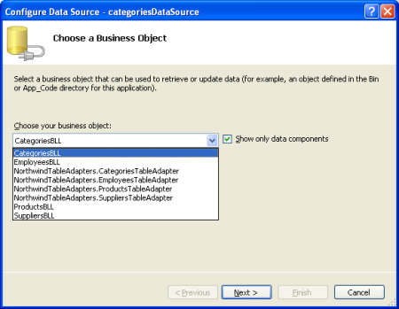](master-detail-filtering-with-two-dropdownlists-cs/_static/image4.png)

**Figure 2**: Choose to Use the `CategoriesBLL` Class ([Click to view full-size image](master-detail-filtering-with-two-dropdownlists-cs/_static/image6.png))

[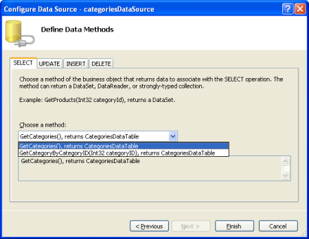](master-detail-filtering-with-two-dropdownlists-cs/_static/image7.png)

**Figure 3**: Configure the ObjectDataSource to Use the `GetCategories()` Method ([Click to view full-size image](master-detail-filtering-with-two-dropdownlists-cs/_static/image9.png))

After configuring the ObjectDataSource we still need to specify which data source field should be displayed in the `Categories` DropDownList and which one should be configured as the value for the list item. Set the `CategoryName` field as the display and `CategoryID` as the value for each list item.

[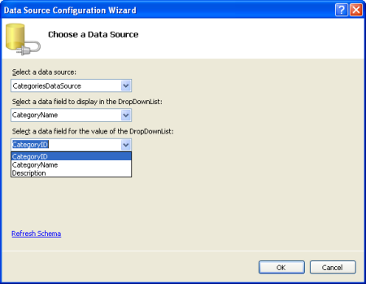](master-detail-filtering-with-two-dropdownlists-cs/_static/image10.png)

**Figure 4**: Have the DropDownList Display the `CategoryName` Field and Use `CategoryID` as the Value ([Click to view full-size image](master-detail-filtering-with-two-dropdownlists-cs/_static/image12.png))

At this point we have a DropDownList control (`Categories`) that's populated with the records from the `Categories` table. When the user chooses a new category from the DropDownList we'll want a postback to occur in order to refresh the product DropDownList that we're going to create in Step 2. Therefore, check the Enable AutoPostBack option from the `categories` DropDownList's smart tag.

[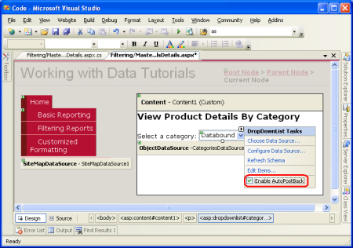](master-detail-filtering-with-two-dropdownlists-cs/_static/image13.png)

**Figure 5**: Enable AutoPostBack for the `Categories` DropDownList ([Click to view full-size image](master-detail-filtering-with-two-dropdownlists-cs/_static/image15.png))

## Step 2: Displaying the Selected Category's Products in a Second DropDownList

With the `Categories` DropDownList completed, our next step is to display a DropDownList of products belonging to the selected category. To accomplish this, add another DropDownList to the page named `ProductsByCategory`. As with the `Categories` DropDownList, create a new ObjectDataSource for the `ProductsByCategory` DropDownList named `ProductsByCategoryDataSource`.

[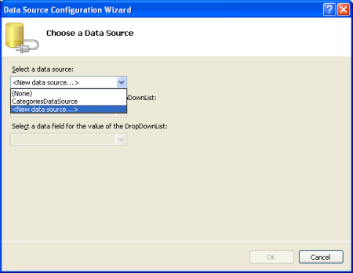](master-detail-filtering-with-two-dropdownlists-cs/_static/image16.png)

**Figure 6**: Add a New Data Source for the `ProductsByCategory` DropDownList ([Click to view full-size image](master-detail-filtering-with-two-dropdownlists-cs/_static/image18.png))

**Figure 7**: Create a New ObjectDataSource Named `ProductsByCategoryDataSource` ([Click to view full-size image](master-detail-filtering-with-two-dropdownlists-cs/_static/image21.png))

Since the `ProductsByCategory` DropDownList needs to display just those products belonging to the selected category, have the ObjectDataSource invoke the `GetProductsByCategoryID(categoryID)` method from the `ProductsBLL` object.

**Figure 8**: Choose to Use the `ProductsBLL` Class ([Click to view full-size image](master-detail-filtering-with-two-dropdownlists-cs/_static/image24.png))

[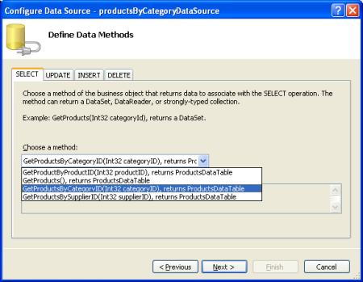](master-detail-filtering-with-two-dropdownlists-cs/_static/image25.png)

**Figure 9**: Configure the ObjectDataSource to Use the `GetProductsByCategoryID(categoryID)` Method ([Click to view full-size image](master-detail-filtering-with-two-dropdownlists-cs/_static/image27.png))

In the final step of the wizard we need to specify the value of the *`categoryID`* parameter. Assign this parameter to the selected item from the `Categories` DropDownList.

**Figure 10**: Pull the *`categoryID`* Parameter Value from the `Categories` DropDownList ([Click to view full-size image](master-detail-filtering-with-two-dropdownlists-cs/_static/image30.png))

With the ObjectDataSource configured, all that remains is to specify what data source fields are used for the display and value of the DropDownList's items. Display the `ProductName` field and use the `ProductID` field as the value.

**Figure 11**: Specify the Data Source Fields Used for the DropDownList's `ListItem` s' `Text` and `Value` Properties ([Click to view full-size image](master-detail-filtering-with-two-dropdownlists-cs/_static/image33.png))

With the ObjectDataSource and `ProductsByCategory` DropDownList configured our page will display two DropDownLists: the first will list all of the categories while the second will list those products belonging to the selected category. When the user selects a new category from the first DropDownList, a postback will ensue and the second DropDownList will be rebound, showing those products that belong to the newly selected category. Figures 12 and 13 show `MasterDetailsDetails.aspx` in action when viewed through a browser.

[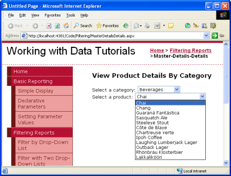](master-detail-filtering-with-two-dropdownlists-cs/_static/image34.png)

**Figure 12**: When First Visiting the Page, the Beverages Category is Selected ([Click to view full-size image](master-detail-filtering-with-two-dropdownlists-cs/_static/image36.png))

**Figure 13**: Choosing a Different Category Displays the New Category's Products ([Click to view full-size image](master-detail-filtering-with-two-dropdownlists-cs/_static/image39.png))

Currently the `productsByCategory` DropDownList, when changed, does *not* cause a postback. However, we will want a postback to occur once we add a DetailsView to display the selected product's details (Step 3). Therefore, check the Enable AutoPostBack checkbox from the `productsByCategory` DropDownList's smart tag.

[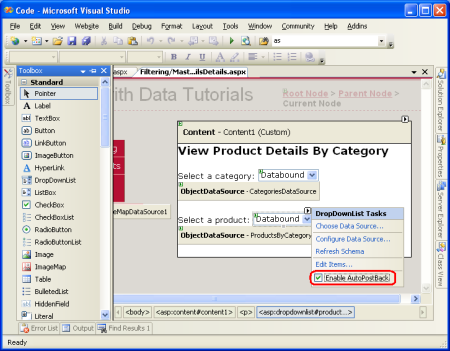](master-detail-filtering-with-two-dropdownlists-cs/_static/image40.png)

**Figure 14**: Enable the AutoPostBack Feature for the `productsByCategory` DropDownList ([Click to view full-size image](master-detail-filtering-with-two-dropdownlists-cs/_static/image42.png))

## Step 3: Using a DetailsView to Display Details for the Selected Product

The final step is to display the details for the selected product in a DetailsView. To accomplish this, add a DetailsView to the page, set its `ID` property to `ProductDetails`, and create a new ObjectDataSource for it. Configure this ObjectDataSource to pull its data from the `ProductsBLL` class's `GetProductByProductID(productID)` method using the selected value of the `ProductsByCategory` DropDownList for the value of the *`productID`* parameter.

[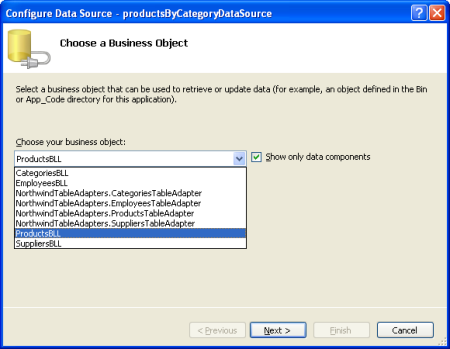](master-detail-filtering-with-two-dropdownlists-cs/_static/image43.png)

**Figure 15**: Choose to Use the `ProductsBLL` Class ([Click to view full-size image](master-detail-filtering-with-two-dropdownlists-cs/_static/image45.png))

[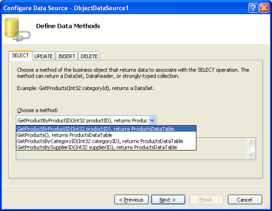](master-detail-filtering-with-two-dropdownlists-cs/_static/image46.png)

**Figure 16**: Configure the ObjectDataSource to Use the `GetProductByProductID(productID)` Method ([Click to view full-size image](master-detail-filtering-with-two-dropdownlists-cs/_static/image48.png))

**Figure 17**: Pull the *`productID`* Parameter Value from the `ProductsByCategory` DropDownList ([Click to view full-size image](master-detail-filtering-with-two-dropdownlists-cs/_static/image51.png))

You can choose to display any of the available fields in the DetailsView. I've opted to remove the `ProductID`, `SupplierID`, and `CategoryID` fields and reordered and formatted the remaining fields. In addition, I cleared out the DetailsView's `Height` and `Width` properties, allowing the DetailsView to expand to the width needed to best display its data rather than having it constrained to a specified size. The full markup appears below:

[!code-aspx[Main](master-detail-filtering-with-two-dropdownlists-cs/samples/sample1.aspx)]

Take a moment to try out the `MasterDetailsDetails.aspx` page in a browser. At first glance it may appear that everything is working as desired, but there's a subtle problem. When you choose a new category the `ProductsByCategory` DropDownList is updated to include those products for the selected category, but the `ProductDetails` DetailsView continued to show the previous product information. The DetailsView is updated when choosing a different product for the selected category. Furthermore, if you test thoroughly enough, you'll find that if you continually choose new categories (such as choosing Beverages from the `Categories` DropDownList, then Condiments, then Confections) every other category selection causes the `ProductDetails` DetailsView to be refreshed.

To help concretize this problem, let's look at a specific example. When you first visit the page the Beverages category is selected and the related products are loaded in the `ProductsByCategory` DropDownList. Chai is the selected product and its details are displayed in the `ProductDetails` DetailsView, as shown in Figure 18.

[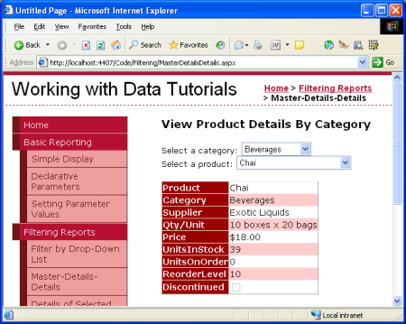](master-detail-filtering-with-two-dropdownlists-cs/_static/image52.png)

**Figure 18**: The Selected Product's Details are Displayed in a DetailsView ([Click to view full-size image](master-detail-filtering-with-two-dropdownlists-cs/_static/image54.png))

If you change the category selection from Beverages to Condiments, a postback occurs and the `ProductsByCategory` DropDownList is updated accordingly, but the DetailsView still displays details for Chai.

[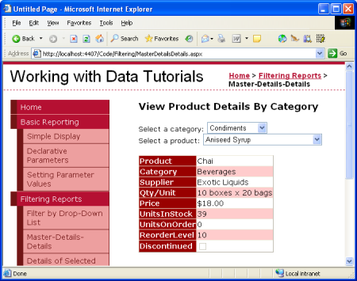](master-detail-filtering-with-two-dropdownlists-cs/_static/image55.png)

**Figure 19**: The Previously Selected Product's Details are Still Displayed ([Click to view full-size image](master-detail-filtering-with-two-dropdownlists-cs/_static/image57.png))

Picking a new product from the list refreshes the DetailsView as expected. If you pick a new category after changing the product, the DetailsView again won't refresh. However, if instead of choosing a new product you selected a new category, the DetailsView would refresh. What in the world is going on here?

The problem is a timing issue in the page's lifecycle. Whenever a page is requested it proceeds through a number of steps as its rendering. In one of these steps the ObjectDataSource controls check to see if any of their `SelectParameters` values have changed. If so, the data Web control bound to the ObjectDataSource knows that it needs to refresh its display. For example, when a new category is selected, the `ProductsByCategoryDataSource` ObjectDataSource detects that its parameter values have changed and the `ProductsByCategory` DropDownList rebinds itself, getting the products for the selected category.

The problem that arises in this situation is that the point in the page lifecycle that the ObjectDataSources check for changed parameters occurs *before* the rebinding of the associated data Web controls. Therefore, when selecting a new category the `ProductsByCategoryDataSource` ObjectDataSource detects a change in its parameter's value. The ObjectDataSource used by the `ProductDetails` DetailsView, however, doesn't note any such changes because the `ProductsByCategory` DropDownList has yet to be rebound. Later in the lifecycle the `ProductsByCategory` DropDownList rebinds to its ObjectDataSource, grabbing the products for the newly selected category. While the `ProductsByCategory` DropDownList's value has changed, the `ProductDetails` DetailsView's ObjectDataSource has already done its parameter value check; therefore, the DetailsView displays its previous results. This interaction is depicted in Figure 20.

[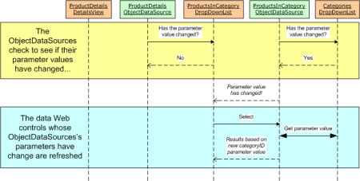](master-detail-filtering-with-two-dropdownlists-cs/_static/image58.png)

**Figure 20**: The `ProductsByCategory` DropDownList Value Changes After the `ProductDetails` DetailsView's ObjectDataSource Checks for Changes ([Click to view full-size image](master-detail-filtering-with-two-dropdownlists-cs/_static/image60.png))

To remedy this we need to explicitly rebind the `ProductDetails` DetailsView after the `ProductsByCategory` DropDownList has been bound. We can accomplish this by calling the `ProductDetails` DetailsView's `DataBind()` method when the `ProductsByCategory` DropDownList's `DataBound` event fires. Add the following event handler code to the `MasterDetailsDetails.aspx` page's code-behind class (refer to the "[Programmatically Setting the ObjectDataSource's Parameter Values](../basic-reporting/programmatically-setting-the-objectdatasource-s-parameter-values-cs.md)" for a discussion on how to add an event handler):

[!code-csharp[Main](master-detail-filtering-with-two-dropdownlists-cs/samples/sample2.cs)]

After this explicit call to the `ProductDetails` DetailsView's `DataBind()` method has been added, the tutorial works as expected. Figure 21 highlights how this changed remedied our earlier problem.

**Figure 21**: The `ProductDetails` DetailsView is Explicitly Refreshed When the `ProductsByCategory` DropDownList's `DataBound` Event Fires ([Click to view full-size image](master-detail-filtering-with-two-dropdownlists-cs/_static/image63.png))

## Summary

The DropDownList serves as an ideal user interface element for master/detail reports where there is a one-to-many relationship between the master and detail records. In the preceding tutorial we saw how to use a single DropDownList to filter the products displayed by the selected category. In this tutorial we replaced the GridView of products with a DropDownList, and used a DetailsView to display the details of the selected product. The concepts discussed in this tutorial can easily be extended to data models involving multiple one-to-many relationships, such as customers, orders, and order items. In general, you can always add a DropDownList for each of the "one" entities in the one-to-many relationships.

Happy Programming!

## About the Author

[Scott Mitchell](http://www.4guysfromrolla.com/ScottMitchell.shtml), author of seven ASP/ASP.NET books and founder of [4GuysFromRolla.com](http://www.4guysfromrolla.com), has been working with Microsoft Web technologies since 1998. Scott works as an independent consultant, trainer, and writer. His latest book is [*Sams Teach Yourself ASP.NET 2.0 in 24 Hours*](https://www.amazon.com/exec/obidos/ASIN/0672327384/4guysfromrollaco). He can be reached at [mitchell@4GuysFromRolla.com.](mailto:mitchell@4GuysFromRolla.com) or via his blog, which can be found at [http://ScottOnWriting.NET](http://ScottOnWriting.NET).

## Special Thanks To

This tutorial series was reviewed by many helpful reviewers. Lead reviewer for this tutorial was Hilton Giesenow. Interested in reviewing my upcoming MSDN articles? If so, drop me a line at [mitchell@4GuysFromRolla.com.](mailto:mitchell@4GuysFromRolla.com)

>[!div class="step-by-step"]
[Previous](master-detail-filtering-with-a-dropdownlist-cs.md)
[Next](master-detail-filtering-across-two-pages-cs.md)