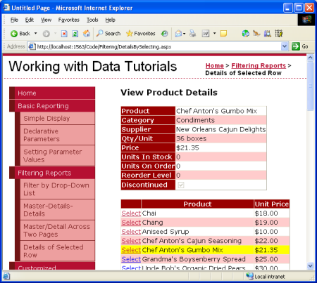
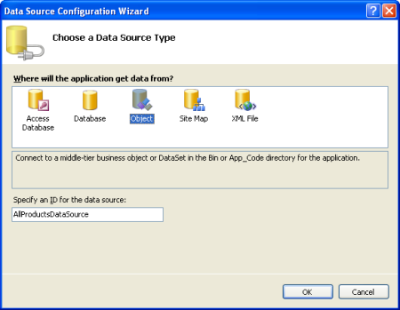
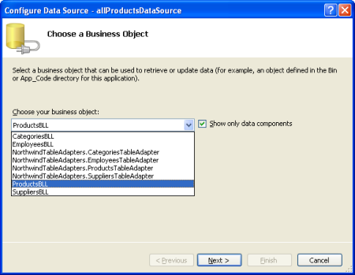
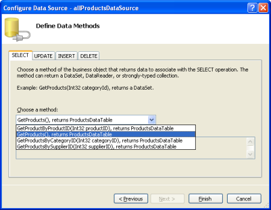
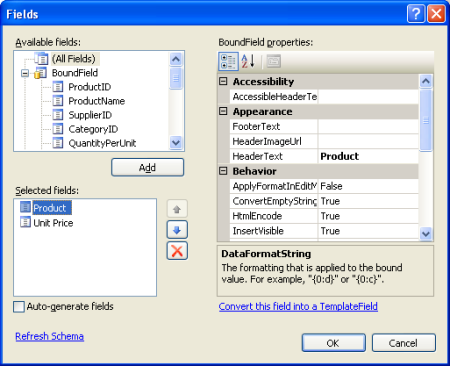
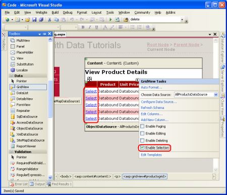
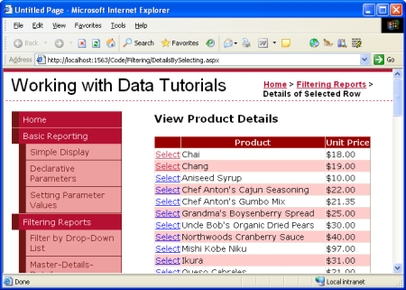
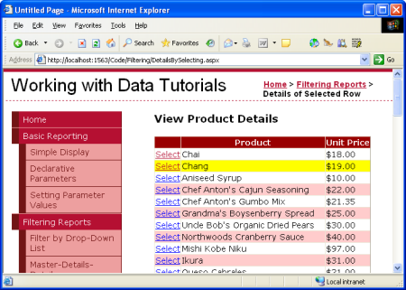
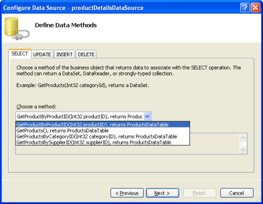
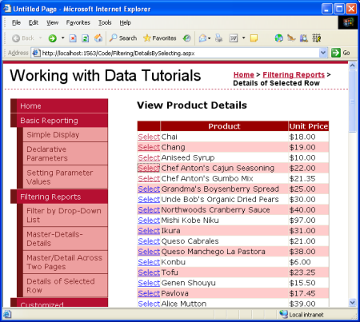

Master/Detail Using a Selectable Master GridView with a Details DetailView (VB)
====================
by [Scott Mitchell](https://twitter.com/ScottOnWriting)

[Download Sample App](http://download.microsoft.com/download/5/d/7/5d7571fc-d0b7-4798-ad4a-c976c02363ce/ASPNET_Data_Tutorial_10_VB.exe) or [Download PDF](master-detail-using-a-selectable-master-gridview-with-a-details-detailview-vb/_static/datatutorial10vb1.pdf)

> This tutorial will have a GridView whose rows include the name and price of each product along with a Select button. Clicking the Select button for a particular product will cause its full details to be displayed in a DetailsView control on the same page.

## Introduction

In the [previous tutorial](master-detail-filtering-across-two-pages-vb.md) we saw how to create a master/detail report using two web pages: a "master" web page, from which we displayed the list of suppliers; and a "details" web page that listed those products provided by the selected supplier. This two page report format can be condensed into one page. This tutorial will have a GridView whose rows include the name and price of each product along with a Select button. Clicking the Select button for a particular product will cause its full details to be displayed in a DetailsView control on the same page.

**Figure 1**: Clicking the Select Button Displays the Product's Details ([Click to view full-size image](master-detail-using-a-selectable-master-gridview-with-a-details-detailview-vb/_static/image3.png))

## Step 1: Creating a Selectable GridView

Recall that in the two-page master/detail report that each master record included a hyperlink that, when clicked, sent the user to the details page passing the clicked row's `SupplierID` value in the querystring. Such a hyperlink was added to each GridView row using a HyperLinkField. For the single page master/details report, we will need a Button for each GridView row that, when clicked, shows the details. The GridView control can be configured to include a Select button for each row that causes a postback and marks that row as the GridView's [SelectedRow](https://msdn.microsoft.com/en-us/library/system.web.ui.webcontrols.gridview.selectedrow.aspx).

Start by adding a GridView control to the `DetailsBySelecting.aspx` page in the `Filtering` folder, setting its `ID` property to `ProductsGrid`. Next, add a new ObjectDataSource named `AllProductsDataSource` that invokes the `ProductsBLL` class's `GetProducts()` method.

**Figure 2**: Create an ObjectDataSource Named `AllProductsDataSource` ([Click to view full-size image](master-detail-using-a-selectable-master-gridview-with-a-details-detailview-vb/_static/image6.png))

**Figure 3**: Use the `ProductsBLL` Class ([Click to view full-size image](master-detail-using-a-selectable-master-gridview-with-a-details-detailview-vb/_static/image9.png))

**Figure 4**: Configure the ObjectDataSource to Invoke the `GetProducts()` Method ([Click to view full-size image](master-detail-using-a-selectable-master-gridview-with-a-details-detailview-vb/_static/image12.png))

Edit the GridView's fields removing all but the `ProductName` and `UnitPrice` BoundFields. Also, feel free to customize these BoundFields as needed, such as formatting the `UnitPrice` BoundField as a currency and changing the `HeaderText` properties of the BoundFields. These steps can be accomplished graphically, by clicking the Edit Columns link from the GridView's smart tag, or by manually configuring the declarative syntax.

**Figure 5**: Remove All But the `ProductName` and `UnitPrice` BoundFields ([Click to view full-size image](master-detail-using-a-selectable-master-gridview-with-a-details-detailview-vb/_static/image15.png))

The final markup for the GridView is:

[!code-aspx[Main](master-detail-using-a-selectable-master-gridview-with-a-details-detailview-vb/samples/sample1.aspx)]

Next, we need to mark the GridView as selectable, which will add a Select button to each row. To accomplish this, simply check the Enable Selection checkbox in the GridView's smart tag.

**Figure 6**: Make the GridView's Rows Selectable ([Click to view full-size image](master-detail-using-a-selectable-master-gridview-with-a-details-detailview-vb/_static/image18.png))

Checking the Enabling Selection option adds a CommandField to the `ProductsGrid` GridView with its `ShowSelectButton` property set to True. This results in a Select button for each row of the GridView, as Figure 6 illustrates. By default, the Select buttons are rendered as LinkButtons, but you can use Buttons or ImageButtons instead through the CommandField's `ButtonType` property.

[!code-aspx[Main](master-detail-using-a-selectable-master-gridview-with-a-details-detailview-vb/samples/sample2.aspx)]

When a GridView row's Select button is clicked a postback ensues and the GridView's `SelectedRow` property is updated. In addition to the `SelectedRow` property, the GridView provides the [SelectedIndex](https://msdn.microsoft.com/en-us/library/system.web.ui.webcontrols.gridview.selectedindex%28VS.80%29.aspx), [SelectedValue](https://msdn.microsoft.com/en-us/library/system.web.ui.webcontrols.gridview.selectedvalue%28VS.80%29.aspx), and [SelectedDataKey](https://msdn.microsoft.com/en-us/library/system.web.ui.webcontrols.gridview.selecteddatakey%28VS.80%29.aspx) properties. The `SelectedIndex` property returns the index of the selected row, whereas the `SelectedValue` and `SelectedDataKey` properties return values based upon the GridView's [DataKeyNames property](https://msdn.microsoft.com/en-us/library/system.web.ui.webcontrols.gridview.datakeynames%28VS.80%29.aspx).

The `DataKeyNames` property is used to associate one or more data field values with each row and is commonly used to attribute uniquely identifying information from the underlying data with each GridView row. The `SelectedValue` property returns the value of the first `DataKeyNames` data field for the selected row where as the `SelectedDataKey` property returns the selected row's `DataKey` object, which contains all of the values for the specified data key fields for that row.

The `DataKeyNames` property is automatically set to the uniquely-identifying data field(s) when you bind a data source to a GridView, DetailsView, or FormView through the Designer. While this property has been set for us automatically in the preceding tutorials, the examples would have worked without the `DataKeyNames` property specified. However, for the selectable GridView in this tutorial, as well as for future tutorials in which we'll be examining inserting, updating, and deleting, the `DataKeyNames` property must be set properly. Take a moment to ensure that your GridView's `DataKeyNames` property is set to `ProductID`.

Let's view our progress thus far through a browser. Note that the GridView lists the name and price for all of the products along with a Select LinkButton. Clicking the Select button causes a postback. In Step 2 we'll see how to have a DetailsView respond to this postback by displaying the details for the selected product.

**Figure 7**: Each Product Row Contains a Select LinkButton ([Click to view full-size image](master-detail-using-a-selectable-master-gridview-with-a-details-detailview-vb/_static/image21.png))

## Highlighting the Selected Row

The `ProductsGrid` GridView has a `SelectedRowStyle` property that can be used to dictate the visual style for the selected row. Used properly, this can improve the user's experience by more clearly showing which row of the GridView is currently selected. For this tutorial, let's have the selected row be highlighted with a yellow background.

As with our earlier tutorials, let's strive to keep the aesthetic-related settings defined as CSS classes. Therefore, create a new CSS class in `Styles.css` named `SelectedRowStyle`.

[!code-css[Main](master-detail-using-a-selectable-master-gridview-with-a-details-detailview-vb/samples/sample3.css)]

To apply this CSS class to the `SelectedRowStyle` property of *all* GridViews in our tutorial series, edit the `GridView.skin` Skin in the `DataWebControls` Theme to include the `SelectedRowStyle` settings as shown below:

[!code-aspx[Main](master-detail-using-a-selectable-master-gridview-with-a-details-detailview-vb/samples/sample4.aspx)]

With this addition, the selected GridView row is now highlighted with a yellow background color.

**Figure 8**: Customize the Selected Row's Appearance Using the GridView's `SelectedRowStyle` Property ([Click to view full-size image](master-detail-using-a-selectable-master-gridview-with-a-details-detailview-vb/_static/image24.png))

## Step 2: Displaying the Selected Product's Details in a DetailsView

With the `ProductsGrid` GridView complete, all that remains is to add a DetailsView that displays information about the particular product selected. Add a DetailsView control above the GridView and create a new ObjectDataSource named `ProductDetailsDataSource`. Since we want this DetailsView to display particular information about the selected product, configure the `ProductDetailsDataSource` to use the `ProductsBLL` class's `GetProductByProductID(productID)` method.

**Figure 9**: Invoke the `ProductsBLL` Class's `GetProductByProductID(productID)` Method ([Click to view full-size image](master-detail-using-a-selectable-master-gridview-with-a-details-detailview-vb/_static/image27.png))

Have the *`productID`* parameter's value obtained from the GridView control's `SelectedValue` property. As we discussed earlier, the GridView's `SelectedValue` property returns the first data key value for the selected row. Therefore, it's imperative that the GridView's `DataKeyNames` property is set to `ProductID`, so that the selected row's `ProductID` value is returned by `SelectedValue`.

**Figure 10**: Set the *`productID`* Parameter to the GridView's `SelectedValue` Property ([Click to view full-size image](master-detail-using-a-selectable-master-gridview-with-a-details-detailview-vb/_static/image30.png))

Once the `productDetailsDataSource` ObjectDataSource has been configured correctly and bound to the DetailsView, this tutorial is complete! When the page is first visited no row is selected, so the GridView's `SelectedValue` property returns `Nothing`. Since there are no products with a `NULL` `ProductID` value, no records are returned by the `GetProductByProductID(productID)` method, meaning that the DetailsView isn't displayed (see Figure 11). Upon clicking a GridView row's Select button, a postback ensues and the DetailsView is refreshed. This time the GridView's `SelectedValue` property returns the `ProductID` of the selected row, the `GetProductByProductID(productID)` method returns a `ProductsDataTable` with information about that particular product, and the DetailsView shows these details (see Figure 12).

**Figure 11**: When First Visited, Only the GridView is Displayed ([Click to view full-size image](master-detail-using-a-selectable-master-gridview-with-a-details-detailview-vb/_static/image33.png))

**Figure 12**: Upon Selecting a Row, the Product's Details are Displayed ([Click to view full-size image](master-detail-using-a-selectable-master-gridview-with-a-details-detailview-vb/_static/image36.png))

## Summary

In this and the preceding three tutorials we've seen a number of techniques for displaying master/detail reports. In this tutorial we examined using a selectable GridView to house the master records and a DetailsView to display details about the selected master record on the same page. In the earlier tutorials we looked at how to display master/details reports using DropDownLists and displaying master records on one web page and detail records on another.

This tutorial concludes our examination of master/detail reports. Starting with the next tutorial we'll begin our exploration of customized formatting with the GridView, DetailsView, and FormView. We'll see how to customize the appearance of these controls based on the data bound to them, how to summarize data in the GridView's footer, and how to use templates to obtain a greater degree of control over the layout.

Happy Programming!

## About the Author

[Scott Mitchell](http://www.4guysfromrolla.com/ScottMitchell.shtml), author of seven ASP/ASP.NET books and founder of [4GuysFromRolla.com](http://www.4guysfromrolla.com), has been working with Microsoft Web technologies since 1998. Scott works as an independent consultant, trainer, and writer. His latest book is [*Sams Teach Yourself ASP.NET 2.0 in 24 Hours*](https://www.amazon.com/exec/obidos/ASIN/0672327384/4guysfromrollaco). He can be reached at [mitchell@4GuysFromRolla.com.](mailto:mitchell@4GuysFromRolla.com) or via his blog, which can be found at [http://ScottOnWriting.NET](http://ScottOnWriting.NET).

## Special Thanks To

This tutorial series was reviewed by many helpful reviewers. Lead reviewer for this tutorial was Hilton Giesenow. Interested in reviewing my upcoming MSDN articles? If so, drop me a line at [mitchell@4GuysFromRolla.com.](mailto:mitchell@4GuysFromRolla.com)

>[!div class="step-by-step"]
[Previous](master-detail-filtering-across-two-pages-vb.md)