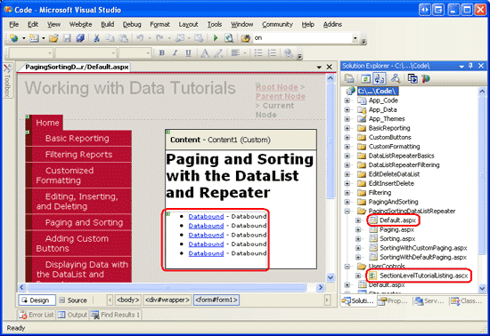
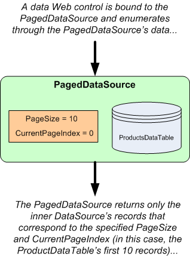
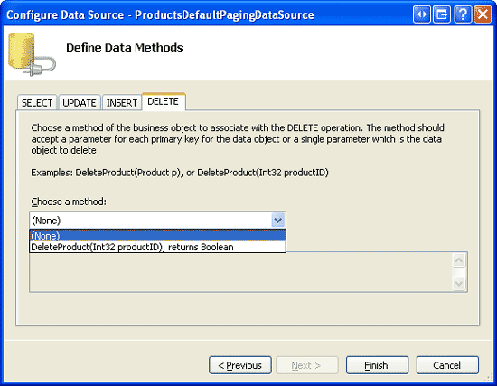
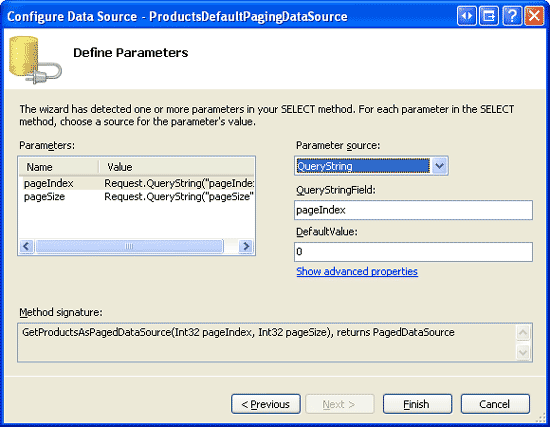
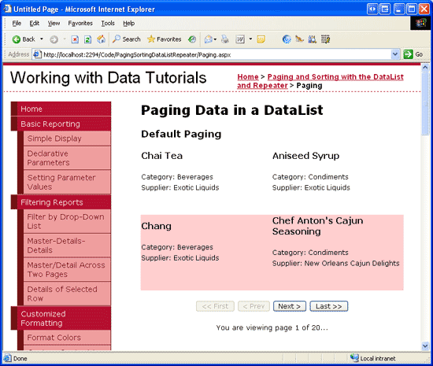

Paging Report Data in a DataList or Repeater Control (VB)
====================
by [Scott Mitchell](https://twitter.com/ScottOnWriting)

[Download Sample App](http://download.microsoft.com/download/4/a/7/4a7a3b18-d80e-4014-8e53-a6a2427f0d93/ASPNET_Data_Tutorial_44_VB.exe) or [Download PDF](paging-report-data-in-a-datalist-or-repeater-control-vb/_static/datatutorial44vb1.pdf)

> While neither the DataList nor Repeater offer automatic paging or sorting support, this tutorial shows how to add paging support to the DataList or Repeater, which allows for much more flexible paging and data display interfaces.

## Introduction

Paging and sorting are two very common features when displaying data in an online application. For example, when searching for ASP.NET books at an online bookstore, there may be hundreds of such books, but the report listing the search results lists only ten matches per page. Moreover, the results can be sorted by title, price, page count, author name, and so on. As we discussed in the [Paging and Sorting Report Data](../paging-and-sorting/paging-and-sorting-report-data-vb.md) tutorial, the GridView, DetailsView, and FormView controls all provide built-in paging support that can be enabled at the tick of a checkbox. The GridView also includes sorting support.

Unfortunately, neither the DataList nor Repeater offer automatic paging or sorting support. In this tutorial we'll examine how to add paging support to the DataList or Repeater. We must manually create the paging interface, display the appropriate page of records, and remember the page being visited across postbacks. While this does take more time and code than with the GridView, DetailsView, or FormView, the DataList and Repeater allow for much more flexible paging and data display interfaces.

> [!NOTE]
> This tutorial focuses exclusively on paging. In the next tutorial we'll turn our attention to adding sorting capabilities.

## Step 1: Adding the Paging and Sorting Tutorial Web Pages

Before we start this tutorial, let s first take a moment to add the ASP.NET pages we'll need for this tutorial and the next one. Start by creating a new folder in the project named `PagingSortingDataListRepeater`. Next, add the following five ASP.NET pages to this folder, having all of them configured to use the master page `Site.master`:

- `Default.aspx`
- `Paging.aspx`
- `Sorting.aspx`
- `SortingWithDefaultPaging.aspx`
- `SortingWithCustomPaging.aspx`

**Figure 1**: Create a `PagingSortingDataListRepeater` Folder and Add the Tutorial ASP.NET Pages

Next, open the `Default.aspx` page and drag the `SectionLevelTutorialListing.ascx` User Control from the `UserControls` folder onto the Design surface. This User Control, which we created in the [Master Pages and Site Navigation](../introduction/master-pages-and-site-navigation-vb.md) tutorial, enumerates the site map and displays those tutorials in the current section in a bulleted list.

**Figure 2**: Add the `SectionLevelTutorialListing.ascx` User Control to `Default.aspx` ([Click to view full-size image](paging-report-data-in-a-datalist-or-repeater-control-vb/_static/image4.png))

In order to have the bulleted list display the paging and sorting tutorials we'll be creating, we need to add them to the site map. Open the `Web.sitemap` file and add the following markup after the Editing and Deleting with the DataList site map node markup:

[!code-xml[Main](paging-report-data-in-a-datalist-or-repeater-control-vb/samples/sample1.xml)]

**Figure 3**: Update the Site Map to Include the New ASP.NET Pages

## A Review of Paging

In previous tutorials we saw how to page through the data in the GridView, DetailsView, and FormView controls. These three controls offer a simple form of paging called *default paging* that can be implemented by simply checking the Enable Paging option in the control s smart tag. With default paging, each time a page of data is requested either on the first page visit or when the user navigates to a different page of data the GridView, DetailsView, or FormView control re-requests *all* of the data from the ObjectDataSource. It then snips out the particular set of records to display given the requested page index and the number of records to display per page. We discussed default paging in detail in the [Paging and Sorting Report Data](../paging-and-sorting/paging-and-sorting-report-data-vb.md) tutorial.

Since default paging re-requests all records for each page, it is not practical when paging through sufficiently large amounts of data. For example, imagine paging through 50,000 records with a page size of 10. Each time the user moves to a new page, all 50,000 records must be retrieved from the database, even though only ten of them are displayed.

*Custom paging* solves the performance concerns of default paging by grabbing only the precise subset of records to display on the requested page. When implementing custom paging, we must write the SQL query that will efficiently return just the correct set of records. We saw how to create such a query using SQL Server 2005 s new [`ROW_NUMBER()` keyword](http://www.4guysfromrolla.com/webtech/010406-1.shtml) back in the [Efficiently Paging Through Large Amounts of Data](../paging-and-sorting/efficiently-paging-through-large-amounts-of-data-vb.md) tutorial.

To implement default paging in the DataList or Repeater controls, we can use the [`PagedDataSource` class](https://msdn.microsoft.com/en-us/library/system.web.ui.webcontrols.pageddatasource.aspx) as a wrapper around the `ProductsDataTable` whose contents are being paged. The `PagedDataSource` class has a `DataSource` property that can be assigned to any enumerable object and [`PageSize`](https://msdn.microsoft.com/en-us/library/system.web.ui.webcontrols.pageddatasource.pagesize.aspx) and [`CurrentPageIndex`](https://msdn.microsoft.com/en-us/library/system.web.ui.webcontrols.pageddatasource.currentpageindex.aspx) properties that indicate how many records to show per page and the current page index. Once these properties have been set, the `PagedDataSource` can be used as the data source of any data Web control. The `PagedDataSource`, when enumerated, will only return the appropriate subset of records of its inner `DataSource` based on the `PageSize` and `CurrentPageIndex` properties. Figure 4 depicts the functionality of the `PagedDataSource` class.

**Figure 4**: The `PagedDataSource` Wraps an Enumerable Object with a Pageable Interface

The `PagedDataSource` object can be created and configured directly from the Business Logic Layer and bound to a DataList or Repeater through an ObjectDataSource, or can be created and configured directly in the ASP.NET page s code-behind class. If the latter approach is used, we must forgo using the ObjectDataSource and instead bind the paged data to the DataList or Repeater programmatically.

The `PagedDataSource` object also has properties to support custom paging. However, we can bypass using a `PagedDataSource` for custom paging because we already have BLL methods in the `ProductsBLL` class designed for custom paging that return the precise records to display.

In this tutorial we'll look at implementing default paging in a DataList by adding a new method to the `ProductsBLL` class that returns an appropriately configured `PagedDataSource` object. In the next tutorial, we'll see how to use custom paging.

## Step 2: Adding a Default Paging Method in the Business Logic Layer

The `ProductsBLL` class currently has a method for returning all product information `GetProducts()` and one for returning a particular subset of products at a starting index `GetProductsPaged(startRowIndex, maximumRows)`. With default paging, the GridView, DetailsView, and FormView controls all use the `GetProducts()` method to retrieve all products, but then use a `PagedDataSource` internally to display only the correct subset of records. To replicate this functionality with the DataList and Repeater controls, we can create a new method in the BLL that mimics this behavior.

Add a method to the `ProductsBLL` class named `GetProductsAsPagedDataSource` that takes in two integer input parameters:

- `pageIndex` the index of the page to display, indexed at zero, and
- `pageSize` the number of records to display per page.

`GetProductsAsPagedDataSource` starts by retrieving *all* of the records from `GetProducts()`. It then creates a `PagedDataSource` object, setting its `CurrentPageIndex` and `PageSize` properties to the values of the passed-in `pageIndex` and `pageSize` parameters. The method concludes by returning this configured `PagedDataSource`:

[!code-vb[Main](paging-report-data-in-a-datalist-or-repeater-control-vb/samples/sample2.vb)]

## Step 3: Displaying Product Information in a DataList Using Default Paging

With the `GetProductsAsPagedDataSource` method added to the `ProductsBLL` class, we can now create a DataList or Repeater that provides default paging. Start by opening the `Paging.aspx` page in the `PagingSortingDataListRepeater` folder and drag a DataList from the Toolbox onto the Designer, setting the DataList s `ID` property to `ProductsDefaultPaging`. From the DataList s smart tag, create a new ObjectDataSource named `ProductsDefaultPagingDataSource` and configure it so that it retrieves data using the `GetProductsAsPagedDataSource` method.

**Figure 5**: Create an ObjectDataSource and Configure it to Use the `GetProductsAsPagedDataSource` `()` Method ([Click to view full-size image](paging-report-data-in-a-datalist-or-repeater-control-vb/_static/image9.png))

Set the drop-down lists in the UPDATE, INSERT, and DELETE tabs to (None) .

**Figure 6**: Set the Drop-Down Lists in the UPDATE, INSERT, and DELETE tabs to (None) ([Click to view full-size image](paging-report-data-in-a-datalist-or-repeater-control-vb/_static/image12.png))

Since the `GetProductsAsPagedDataSource` method expects two input parameters, the wizard prompts us for the source of these parameter values.

The page index and page size values must be remembered across postbacks. They can be stored in view state, persisted to the querystring, stored in session variables, or remembered using some other technique. For this tutorial we'll use the querystring, which has the advantage of allowing a particular page of data to be bookmarked.

In particular, use the querystring fields pageIndex and pageSize for the `pageIndex` and `pageSize` parameters, respectively (see Figure 7). Take a moment to set the default values for these parameters, as the querystring values won t be present when a user first visits this page. For `pageIndex`, set the default value to 0 (which will show the first page of data) and `pageSize` s default value to 4.

**Figure 7**: Use the QueryString as the Source for the `pageIndex` and `pageSize` Parameters ([Click to view full-size image](paging-report-data-in-a-datalist-or-repeater-control-vb/_static/image15.png))

After configuring the ObjectDataSource, Visual Studio automatically creates an `ItemTemplate` for the DataList. Customize the `ItemTemplate` so that only the product s name, category, and supplier are shown. Also set the DataList s `RepeatColumns` property to 2, its `Width` to 100%, and its `ItemStyle` s `Width` to 50%. These width settings will provide equal spacing for the two columns.

After making these changes, the DataList and ObjectDataSource s markup should look similar to the following:

[!code-aspx[Main](paging-report-data-in-a-datalist-or-repeater-control-vb/samples/sample3.aspx)]

> [!NOTE]
> Since we are not performing any update or delete functionality in this tutorial, you may disable the DataList s view state to reduce the rendered page size.

When initially visiting this page through a browser, neither the `pageIndex` nor `pageSize` querystring parameters are provided. Hence, the default values of 0 and 4 are used. As Figure 8 shows, this results in a DataList that displays the first four products.

**Figure 8**: The First Four Products are Listed ([Click to view full-size image](paging-report-data-in-a-datalist-or-repeater-control-vb/_static/image18.png))

Without a paging interface, there s currently no straightforward means for a user to navigate to the second page of data. We'll create a paging interface in step 4. For now, though, paging can only be accomplished by directly specifying the paging criteria in the querystring. For example, to view the second page, change the URL in the browser s Address bar from `Paging.aspx` to `Paging.aspx?pageIndex=2` and hit Enter. This causes the second page of data to be displayed (see Figure 9).

**Figure 9**: The Second Page of Data is Displayed ([Click to view full-size image](paging-report-data-in-a-datalist-or-repeater-control-vb/_static/image21.png))

## Step 4: Creating the Paging Interface

There are a variety of different paging interfaces that can be implemented. The GridView, DetailsView, and FormView controls provide four different interfaces to choose among:

- **Next, Previous** users can move one page at a time, to either the next or previous one.
- **Next, Previous, First, Last** in addition to Next and Previous buttons, this interface includes First and Last buttons for moving to the very first or very last page.
- **Numeric** lists the page numbers in the paging interface, allowing a user to quickly jump to a particular page.
- **Numeric, First, Last** in addition to the numeric page numbers, includes buttons for moving to the very first or very last page.

For the DataList and Repeater, we are responsible for deciding upon a paging interface and implementing it. This involves creating the needed Web controls in the page and displaying the requested page when a particular paging interface button is clicked. Additionally, certain paging interface controls may need to be disabled. For example, when viewing the first page of data using the Next, Previous, First, Last interface, both the First and Previous buttons would be disabled.

For this tutorial, let s use the Next, Previous, First, Last interface. Add four Button Web controls to the page and set their `ID` s to `FirstPage`, `PrevPage`, `NextPage`, and `LastPage`. Set the `Text` properties to &lt;&lt; First, &lt; Prev, Next &gt;, and Last &gt;&gt; .

[!code-aspx[Main](paging-report-data-in-a-datalist-or-repeater-control-vb/samples/sample4.aspx)]

Next, create a `Click` event handler for each of these Buttons. In a moment we'll add the code necessary to display the requested page.

## Remembering the Total Number of Records Being Paged Through

Regardless of the paging interface selected, we need to compute and remember the total number of records being paged through. The total row count (in conjunction with the page size) determines how many total pages of data are being paged through, which determines what paging interface controls are added or are enabled. In the Next, Previous, First, Last interface that we are building, the page count is used in two ways:

- To determine whether we are viewing the last page, in which case the Next and Last buttons are disabled.
- If the user clicks the Last button we need to whisk them to the last page, whose index is one less than the page count.

The page count is calculated as the ceiling of the total row count divided by the page size. For example, if we are paging through 79 records with four records per page, then the page count is 20 (the ceiling of 79 / 4). If we are using the Numeric paging interface, this information informs us as to how many numeric page buttons to display; if our paging interface includes Next or Last buttons, the page count is used to determine when to disable the Next or Last buttons.

If the paging interface includes a Last button, it is imperative that the total number of records being paged through be remembered across postbacks so that when the Last button is clicked we can determine the last page index. To facilitate this, create a `TotalRowCount` property in the ASP.NET page s code-behind class that persists its value to view state:

[!code-vb[Main](paging-report-data-in-a-datalist-or-repeater-control-vb/samples/sample5.vb)]

In addition to `TotalRowCount`, take a minute to create read-only page-level properties for easily accessing the page index, page size, and page count:

[!code-vb[Main](paging-report-data-in-a-datalist-or-repeater-control-vb/samples/sample6.vb)]

## Determining the Total Number of Records Being Paged Through

The `PagedDataSource` object returned from the ObjectDataSource s `Select()` method has within it *all* of the product records, even though only a subset of them are displayed in the DataList. The `PagedDataSource` s [`Count` property](https://msdn.microsoft.com/en-us/library/system.web.ui.webcontrols.pageddatasource.count.aspx) returns only the number of items that will be displayed in the DataList; the [`DataSourceCount` property](https://msdn.microsoft.com/en-us/library/system.web.ui.webcontrols.pageddatasource.datasourcecount.aspx) returns the total number of items within the `PagedDataSource`. Therefore, we need to assign the ASP.NET page s `TotalRowCount` property the value of the `PagedDataSource` s `DataSourceCount` property.

To accomplish this, create an event handler for the ObjectDataSource s `Selected` event. In the `Selected` event handler we have access to the return value of the ObjectDataSource s `Select()` method in this case, the `PagedDataSource`.

[!code-vb[Main](paging-report-data-in-a-datalist-or-repeater-control-vb/samples/sample7.vb)]

## Displaying the Requested Page of Data

When the user clicks one of the buttons in the paging interface, we need to display the requested page of data. Since the paging parameters are specified via the querystring, to show the requested page of data use `Response.Redirect(url)` to have the user s browser re-request the `Paging.aspx` page with the appropriate paging parameters. For example, to display the second page of data, we would redirect the user to `Paging.aspx?pageIndex=1`.

To facilitate this, create a `RedirectUser(sendUserToPageIndex)` method that redirects the user to `Paging.aspx?pageIndex=sendUserToPageIndex`. Then, call this method from the four Button `Click` event handlers. In the `FirstPage` `Click` event handler, call `RedirectUser(0)`, to send them to the first page; in the `PrevPage` `Click` event handler, use `PageIndex - 1` as the page index; and so on.

[!code-vb[Main](paging-report-data-in-a-datalist-or-repeater-control-vb/samples/sample8.vb)]

With the `Click` event handlers complete, the DataList s records can be paged through by clicking the buttons. Take a moment to try it out!

## Disabling Paging Interface Controls

Currently, all four buttons are enabled regardless of the page being viewed. However, we want to disable the First and Previous buttons when showing the first page of data, and the Next and Last buttons when showing the last page. The `PagedDataSource` object returned by the ObjectDataSource s `Select()` method has properties [`IsFirstPage`](https://msdn.microsoft.com/en-us/library/system.web.ui.webcontrols.pageddatasource.isfirstpage.aspx) and [`IsLastPage`](https://msdn.microsoft.com/en-us/library/system.web.ui.webcontrols.pageddatasource.islastpage.aspx) that we can examine to determine if we are viewing the first or last page of data.

Add the following to the ObjectDataSource s `Selected` event handler:

[!code-vb[Main](paging-report-data-in-a-datalist-or-repeater-control-vb/samples/sample9.vb)]

With this addition, the First and Previous buttons will be disabled when viewing the first page, while the Next and Last buttons will be disabled when viewing the last page.

Let s complete the paging interface by informing the user what page they re currently viewing and how many total pages exist. Add a Label Web control to the page and set its `ID` property to `CurrentPageNumber`. Set its `Text` property in the ObjectDataSource s Selected event handler such that it includes the current page being viewed (`PageIndex + 1`) and the total number of pages (`PageCount`).

[!code-vb[Main](paging-report-data-in-a-datalist-or-repeater-control-vb/samples/sample10.vb)]

Figure 10 shows `Paging.aspx` when first visited. Since the querystring is empty, the DataList defaults to showing the first four products; the First and Previous buttons are disabled. Clicking Next displays the next four records (see Figure 11); the First and Previous buttons are now enabled.

**Figure 10**: The First Page of Data is Displayed ([Click to view full-size image](paging-report-data-in-a-datalist-or-repeater-control-vb/_static/image24.png))

**Figure 11**: The Second Page of Data is Displayed ([Click to view full-size image](paging-report-data-in-a-datalist-or-repeater-control-vb/_static/image27.png))

> [!NOTE]
> The paging interface can be further enhanced by allowing the user to specify how many pages to view per page. For example, a DropDownList could be added listing page size options like 5, 10, 25, 50, and All. Upon selecting a page size, the user would need to be redirected back to `Paging.aspx?pageIndex=0&pageSize=selectedPageSize`. I leave implementing this enhancement as an exercise for the reader.

## Using Custom Paging

The DataList pages through its data using the inefficient default paging technique. When paging through sufficiently large amounts of data, it is imperative that custom paging be used. Although the implementation details differ slightly, the concepts behind implementing custom paging in a DataList are the same as with default paging. With custom paging, use the `ProductBLL` class s `GetProductsPaged` method (instead of `GetProductsAsPagedDataSource`). As discussed in the [Efficiently Paging Through Large Amounts of Data](../paging-and-sorting/efficiently-paging-through-large-amounts-of-data-vb.md) tutorial, `GetProductsPaged` must be passed the start row index and maximum number of rows to return. These parameters can be maintained through the querystring just like the `pageIndex` and `pageSize` parameters used in default paging.

Since there s no `PagedDataSource` with custom paging, alternative techniques must be used to determine the total number of records being paged through and whether we re displaying the first or last page of data. The `TotalNumberOfProducts()` method in the `ProductsBLL` class returns the total number of products being paged through. To determine if the first page of data is being viewed, examine the start row index if it is zero, then the first page is being viewed. The last page is being viewed if the start row index plus the maximum rows to return is greater than or equal to the total number of records being paged through.

We'll explore implementing custom paging in greater detail in the next tutorial.

## Summary

While neither the DataList nor Repeater offers the out of the box paging support found in the GridView, DetailsView, and FormView controls, such functionality can be added with minimal effort. The easiest way to implement default paging is to wrap the entire set of products within a `PagedDataSource` and then bind the `PagedDataSource` to the DataList or Repeater. In this tutorial we added the `GetProductsAsPagedDataSource` method to the `ProductsBLL` class to return the `PagedDataSource`. The `ProductsBLL` class already contains the methods needed for custom paging `GetProductsPaged` and `TotalNumberOfProducts`.

Along with retrieving either the precise set of records to display for custom paging or all records in a `PagedDataSource` for default paging, we also need to manually add the paging interface. For this tutorial we created a Next, Previous, First, Last interface with four Button Web controls. Also, a Label control displaying the current page number and total number of pages was added.

In the next tutorial we'll see how to add sorting support to the DataList and Repeater. We'll also see how to create a DataList that can be both paged and sorted (with examples using default and custom paging).

Happy Programming!

## About the Author

[Scott Mitchell](http://www.4guysfromrolla.com/ScottMitchell.shtml), author of seven ASP/ASP.NET books and founder of [4GuysFromRolla.com](http://www.4guysfromrolla.com), has been working with Microsoft Web technologies since 1998. Scott works as an independent consultant, trainer, and writer. His latest book is [*Sams Teach Yourself ASP.NET 2.0 in 24 Hours*](https://www.amazon.com/exec/obidos/ASIN/0672327384/4guysfromrollaco). He can be reached at [mitchell@4GuysFromRolla.com.](mailto:mitchell@4GuysFromRolla.com) or via his blog, which can be found at [http://ScottOnWriting.NET](http://ScottOnWriting.NET).

## Special Thanks To

This tutorial series was reviewed by many helpful reviewers. Lead reviewers for this tutorial were Liz Shulok, Ken Pespisa, and Bernadette Leigh. Interested in reviewing my upcoming MSDN articles? If so, drop me a line at [mitchell@4GuysFromRolla.com.](mailto:mitchell@4GuysFromRolla.com)

>[!div class="step-by-step"]
[Previous](sorting-data-in-a-datalist-or-repeater-control-cs.md)
[Next](sorting-data-in-a-datalist-or-repeater-control-vb.md)