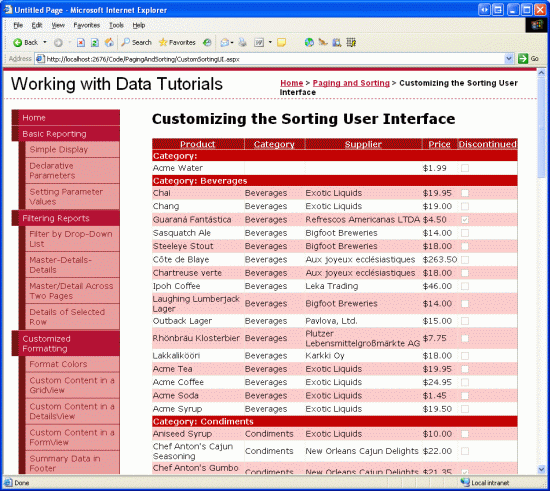
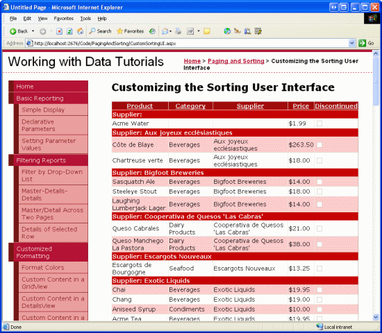
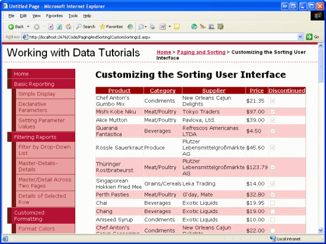

Creating a Customized Sorting User Interface (VB)
====================
by [Scott Mitchell](https://twitter.com/ScottOnWriting)

[Download Sample App](http://download.microsoft.com/download/9/c/1/9c1d03ee-29ba-4d58-aa1a-f201dcc822ea/ASPNET_Data_Tutorial_27_VB.exe) or [Download PDF](creating-a-customized-sorting-user-interface-vb/_static/datatutorial27vb1.pdf)

> When displaying a long list of sorted data, it can be very helpful to group related data by introducing separator rows. In this tutorial we'll see how to create such a sorting user interface.

## Introduction

When displaying a long list of sorted data where there are only a handful of different values in the sorted column, an end user might find it hard to discern where, exactly, the difference boundaries occur. For example, there are 81 products in the database, but only nine different category choices (eight unique categories plus the `NULL` option). Consider the case of a user who is interested in examining the products that fall under the Seafood category. From a page that lists *all* of the products in a single GridView, the user might decide her best bet is to sort the results by category, which will group together all of the Seafood products together. After sorting by category, the user then needs to hunt through the list, looking for where the Seafood-grouped products start and end. Since the results are ordered alphabetically by the category name finding the Seafood products is not difficult, but it still requires closely scanning the list of items in the grid.

To help highlight the boundaries between sorted groups, many websites employ a user interface that adds a separator between such groups. Separators like the ones shown in Figure 1 enables a user to more quickly find a particular group and identify its boundaries, as well as ascertain what distinct groups exist in the data.

**Figure 1**: Each Category Group is Clearly Identified ([Click to view full-size image](creating-a-customized-sorting-user-interface-vb/_static/image3.png))

In this tutorial we'll see how to create such a sorting user interface.

## Step 1: Creating a Standard, Sortable GridView

Before we explore how to augment the GridView to provide the enhanced sorting interface, let s first create a standard, sortable GridView that lists the products. Start by opening the `CustomSortingUI.aspx` page in the `PagingAndSorting` folder. Add a GridView to the page, set its `ID` property to `ProductList`, and bind it to a new ObjectDataSource. Configure the ObjectDataSource to use the `ProductsBLL` class s `GetProducts()` method for selecting records.

Next, configure the GridView such that it only contains the `ProductName`, `CategoryName`, `SupplierName`, and `UnitPrice` BoundFields and the Discontinued CheckBoxField. Finally, configure the GridView to support sorting by checking the Enable Sorting checkbox in the GridView s smart tag (or by setting its `AllowSorting` property to `true`). After making these additions to the `CustomSortingUI.aspx` page, the declarative markup should look similar to the following:

[!code-aspx[Main](creating-a-customized-sorting-user-interface-vb/samples/sample1.aspx)]

Take a moment to view our progress thus far in a browser. Figure 2 shows the sortable GridView when its data is sorted by category in alphabetical order.

**Figure 2**: The Sortable GridView s Data is Ordered by Category ([Click to view full-size image](creating-a-customized-sorting-user-interface-vb/_static/image6.png))

## Step 2: Exploring Techniques for Adding the Separator Rows

With the generic, sortable GridView complete, all that remains is to be able to add the separator rows in the GridView before each unique sorted group. But how can such rows be injected into the GridView? Essentially, we need to iterate through the GridView s rows, determine where the differences occur between the values in the sorted column, and then add the appropriate separator row. When thinking about this problem, it seems natural that the solution lies somewhere in the GridView s `RowDataBound` event handler. As we discussed in the [Custom Formatting Based Upon Data](../custom-formatting/custom-formatting-based-upon-data-vb.md) tutorial, this event handler is commonly used when applying row-level formatting based on the row s data. However, the `RowDataBound` event handler is not the solution here, as rows cannot be added to the GridView programmatically from this event handler. The GridView s `Rows` collection, in fact, is read-only.

To add additional rows to the GridView we have three choices:

- Add these metadata separator rows to the actual data that is bound to the GridView
- After the GridView has been bound to the data, add additional `TableRow` instances to the GridView s control collection
- Create a custom server control that extends the GridView control and overrides those methods responsible for constructing the GridView s structure

Creating a custom server control would be the best approach if this functionality was needed on many web pages or across several websites. However, it would entail quite a bit of code and a thorough exploration into the depths of the GridView s internal workings. Therefore, we'll not consider that option for this tutorial.

The other two options adding separator rows to the actual data being bound to the GridView and manipulating the GridView s control collection after its been bound - attack the problem differently and merit a discussion.

## Adding Rows to the Data Bound to the GridView

When the GridView is bound to a data source, it creates a `GridViewRow` for each record returned by the data source. Therefore, we can inject the needed separator rows by adding separator records to the data source before binding it to the GridView. Figure 3 illustrates this concept.

**Figure 3**: One Technique Involves Adding Separator Rows to the Data Source

I use the term separator records in quotes because there is no special separator record; rather, we must somehow flag that a particular record in the data source serves as a separator rather than a normal data row. For our examples, we re binding a `ProductsDataTable` instance to the GridView, which is composed of `ProductRows`. We might flag a record as a separator row by setting its `CategoryID` property to `-1` (since such a value couldn t exist normally).

To utilize this technique we d need to perform the following steps:

1. Programmatically retrieve the data to bind to the GridView (a `ProductsDataTable` instance)
2. Sort the data based on the GridView s `SortExpression` and `SortDirection` properties
3. Iterate through the `ProductsRows` in the `ProductsDataTable`, looking for where the differences in the sorted column lie
4. At each group boundary, inject a separator record `ProductsRow` instance into the DataTable, one that has it s `CategoryID` set to `-1` (or whatever designation was decided upon to mark a record as a separator record )
5. After injecting the separator rows, programmatically bind the data to the GridView

In addition to these five steps, we d also need to provide an event handler for the GridView s `RowDataBound` event. Here, we d check each `DataRow` and determine if it was a separator row, one whose `CategoryID` setting was `-1`. If so, we d probably want to adjust its formatting or the text displayed in the cell(s).

Using this technique for injecting the sorting group boundaries requires a bit more work than outlined above, as you need to also provide an event handler for the GridView s `Sorting` event and keep track of the `SortExpression` and `SortDirection` values.

## Manipulating the GridView s Control Collection After It s Been Databound

Rather than messaging the data before binding it to the GridView, we can add the separator rows *after* the data has been bound to the GridView. The process of data binding builds up the GridView s control hierarchy, which in reality is simply a `Table` instance composed of a collection of rows, each of which is composed of a collection of cells. Specifically, the GridView s control collection contains a `Table` object at its root, a `GridViewRow` (which is derived from the `TableRow` class) for each record in the `DataSource` bound to the GridView, and a `TableCell` object in each `GridViewRow` instance for each data field in the `DataSource`.

To add separator rows between each sorting group, we can directly manipulate this control hierarchy once it has been created. We can be confident that the GridView s control hierarchy has been created for the last time by the time the page is being rendered. Therefore, this approach overrides the `Page` class s `Render` method, at which point the GridView s final control hierarchy is updated to include the needed separator rows. Figure 4 illustrates this process.

**Figure 4**: An Alternate Technique Manipulates the GridView s Control Hierarchy ([Click to view full-size image](creating-a-customized-sorting-user-interface-vb/_static/image10.png))

For this tutorial, we'll use this latter approach to customize the sorting user experience.

> [!NOTE]
> The code I m presenting in this tutorial is based on the example provided in [Teemu Keiski](http://aspadvice.com/blogs/joteke/default.aspx) s blog entry, [Playing a Bit with GridView Sort Grouping](http://aspadvice.com/blogs/joteke/archive/2006/02/11/15130.aspx).

## Step 3: Adding the Separator Rows to the GridView s Control Hierarchy

Since we only want to add the separator rows to the GridView s control hierarchy after its control hierarchy has been created and created for the last time on that page visit, we want to perform this addition at the end of the page lifecycle, but before the actual GridView control hierarchy has been rendered into HTML. The latest possible point at which we can accomplish this is the `Page` class s `Render` event, which we can override in our code-behind class using the following method signature:

[!code-vb[Main](creating-a-customized-sorting-user-interface-vb/samples/sample2.vb)]

When the `Page` class s original `Render` method is invoked `base.Render(writer)` each of the controls in the page will be rendered, generating the markup based on their control hierarchy. Therefore it is imperative that we both call `base.Render(writer)`, so that the page is rendered, and that we manipulate the GridView s control hierarchy prior to calling `base.Render(writer)`, so that the separator rows have been added to the GridView s control hierarchy before it s been rendered.

To inject the sort group headers we first need to ensure that the user has requested that the data be sorted. By default, the GridView s contents are not sorted, and therefore we don t need to enter any group sorting headers.

> [!NOTE]
> If you want the GridView to be sorted by a particular column when the page is first loaded, call the GridView s `Sort` method on the first page visit (but not on subsequent postbacks). To accomplish this, add this call in the `Page_Load` event handler within an `if (!Page.IsPostBack)` conditional. Refer back to the [Paging and Sorting Report Data](paging-and-sorting-report-data-vb.md) tutorial information for more on the `Sort` method.

Assuming that the data has been sorted, our next task is to determine what column the data was sorted by and then to scan the rows looking for differences in that column s values. The following code ensures that the data has been sorted and finds the column by which the data has been sorted:

[!code-vb[Main](creating-a-customized-sorting-user-interface-vb/samples/sample3.vb)]

If the GridView has yet to be sorted, the GridView s `SortExpression` property will not have been set. Therefore, we only want to add the separator rows if this property has some value. If it does, we next need to determine the index of the column by which the data was sorted. This is accomplished by looping through the GridView s `Columns` collection, searching for the column whose `SortExpression` property equals the GridView s `SortExpression` property. In addition to the column s index, we also grab the `HeaderText` property, which is used when displaying the separator rows.

With the index of the column by which the data is sorted, the final step is to enumerate the rows of the GridView. For each row we need to determine whether the sorted column s value differs from the previous row s sorted column s value. If so, we need to inject a new `GridViewRow` instance into the control hierarchy. This is accomplished with the following code:

[!code-vb[Main](creating-a-customized-sorting-user-interface-vb/samples/sample4.vb)]

This code starts by programmatically referencing the `Table` object found at the root of the GridView s control hierarchy and creating a string variable named `lastValue`. `lastValue` is used to compare the current row s sorted column value with the previous row s value. Next, the GridView s `Rows` collection is enumerated and for each row the value of the sorted column is stored in the `currentValue` variable.

> [!NOTE]
> To determine the value of the particular row s sorted column I use the cell s `Text` property. This works well for BoundFields, but will not work as desired for TemplateFields, CheckBoxFields, and so on. We'll look at how to account for alternate GridView fields shortly.

The `currentValue` and `lastValue` variables are then compared. If they differ we need to add a new separator row to the control hierarchy. This is accomplished by determining the index of the `GridViewRow` in the `Table` object s `Rows` collection, creating new `GridViewRow` and `TableCell` instances, and then adding the `TableCell` and `GridViewRow` to the control hierarchy.

Note that the separator row s lone `TableCell` is formatted such that it spans the entire width of the GridView, is formatted using the `SortHeaderRowStyle` CSS class, and has its `Text` property such that it shows both the sort group name (such as Category ) and the group s value (such as Beverages ). Finally, `lastValue` is updated to the value of `currentValue`.

The CSS class used to format the sorting group header row `SortHeaderRowStyle` needs to be specified in the `Styles.css` file. Feel free to use whatever style settings appeal to you; I used the following:

[!code-css[Main](creating-a-customized-sorting-user-interface-vb/samples/sample5.css)]

With the current code, the sorting interface adds sort group headers when sorting by any BoundField (see Figure 5, which shows a screenshot when sorting by supplier). However, when sorting by any other field type (such as a CheckBoxField or TemplateField), the sort group headers are nowhere to be found (see Figure 6).

**Figure 5**: The Sorting Interface Includes Sort Group Headers When Sorting by BoundFields ([Click to view full-size image](creating-a-customized-sorting-user-interface-vb/_static/image13.png))

**Figure 6**: The Sort Group Headers are Missing When Sorting a CheckBoxField ([Click to view full-size image](creating-a-customized-sorting-user-interface-vb/_static/image16.png))

The reason the sort group headers are missing when sorting by a CheckBoxField is because the code currently uses just the `TableCell` s `Text` property to determine the value of the sorted column for each row. For CheckBoxFields, the `TableCell` s `Text` property is an empty string; instead, the value is available through a CheckBox Web control that resides within the `TableCell` s `Controls` collection.

To handle field types other than BoundFields, we need to augment the code where the `currentValue` variable is assigned to check for the existence of a CheckBox in the `TableCell` s `Controls` collection. Instead of using `currentValue = gvr.Cells(sortColumnIndex).Text`, replace this code with the following:

[!code-vb[Main](creating-a-customized-sorting-user-interface-vb/samples/sample6.vb)]

This code examines the sorted column `TableCell` for the current row to determine if there are any controls in the `Controls` collection. If there are, and the first control is a CheckBox, the `currentValue` variable is set to Yes or No, depending on the CheckBox s `Checked` property. Otherwise, the value is taken from the `TableCell` s `Text` property. This logic can be replicated to handle sorting for any TemplateFields that may exist in the GridView.

With the above code addition, the sort group headers are now present when sorting by the Discontinued CheckBoxField (see Figure 7).

**Figure 7**: The Sort Group Headers are Now Present When Sorting a CheckBoxField ([Click to view full-size image](creating-a-customized-sorting-user-interface-vb/_static/image19.png))

> [!NOTE]
> If you have products with `NULL` database values for the `CategoryID`, `SupplierID`, or `UnitPrice` fields, those values will appear as empty strings in the GridView by default, meaning the separator row s text for those products with `NULL` values will read like Category: (that is, there s no name after Category: like with Category: Beverages ). If you want a value displayed here you can either set the BoundFields [`NullDisplayText` property](https://msdn.microsoft.com/en-us/library/system.web.ui.webcontrols.boundfield.nulldisplaytext.aspx) to the text you want displayed or you can add a conditional statement in the Render method when assigning the `currentValue` to the separator row s `Text` property.

## Summary

The GridView does not include many built-in options for customizing the sorting interface. However, with a bit of low-level code, it s possible to tweak the GridView s control hierarchy to create a more customized interface. In this tutorial we saw how to add a sort group separator row for a sortable GridView, which more easily identifies the distinct groups and those groups boundaries. For additional examples of customized sorting interfaces, check out [Scott Guthrie](https://weblogs.asp.net/scottgu/) s [A Few ASP.NET 2.0 GridView Sorting Tips and Tricks](https://weblogs.asp.net/scottgu/archive/2006/02/11/437995.aspx) blog entry.

Happy Programming!

## About the Author

[Scott Mitchell](http://www.4guysfromrolla.com/ScottMitchell.shtml), author of seven ASP/ASP.NET books and founder of [4GuysFromRolla.com](http://www.4guysfromrolla.com), has been working with Microsoft Web technologies since 1998. Scott works as an independent consultant, trainer, and writer. His latest book is [*Sams Teach Yourself ASP.NET 2.0 in 24 Hours*](https://www.amazon.com/exec/obidos/ASIN/0672327384/4guysfromrollaco). He can be reached at [mitchell@4GuysFromRolla.com.](mailto:mitchell@4GuysFromRolla.com) or via his blog, which can be found at [http://ScottOnWriting.NET](http://ScottOnWriting.NET).

>[!div class="step-by-step"]
[Previous](sorting-custom-paged-data-vb.md)