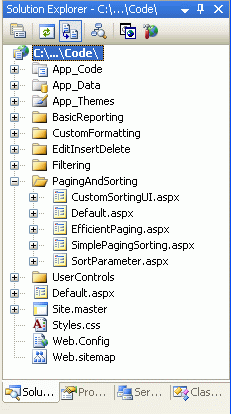
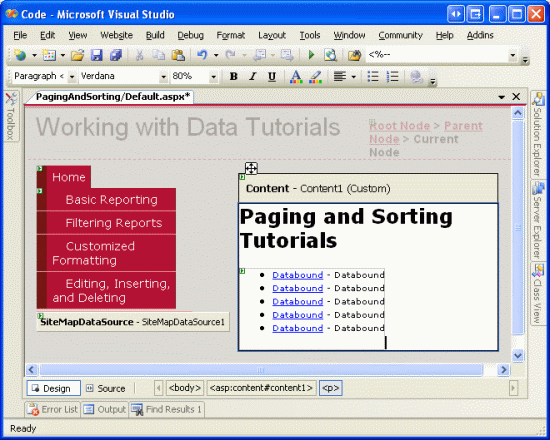
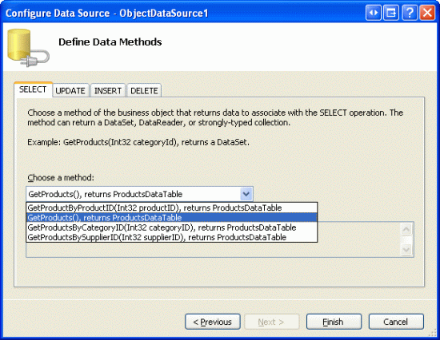
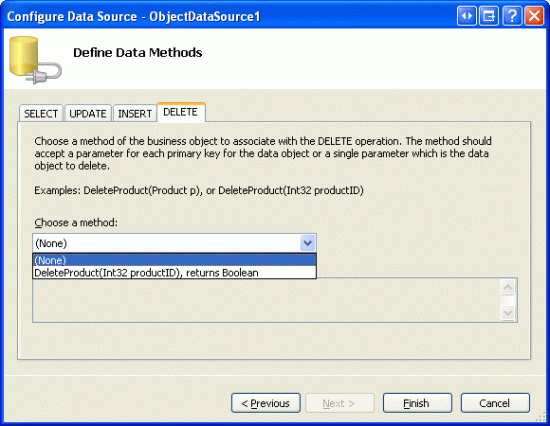
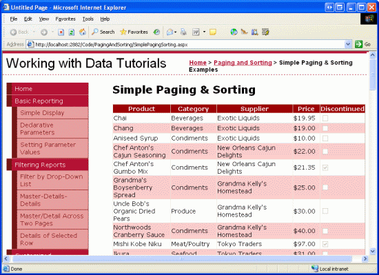
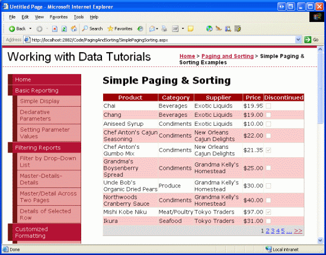
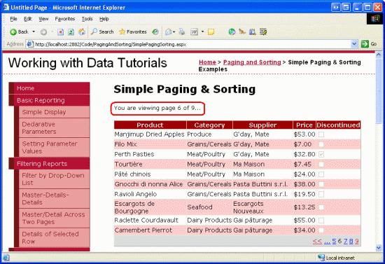
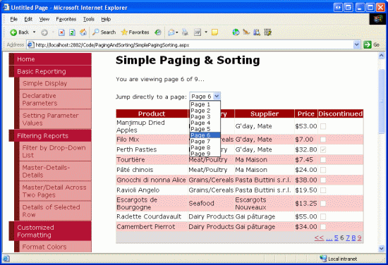
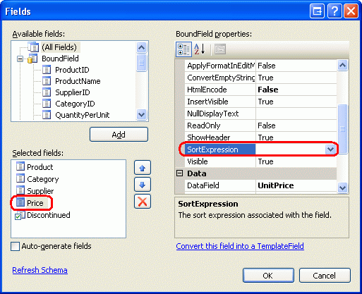
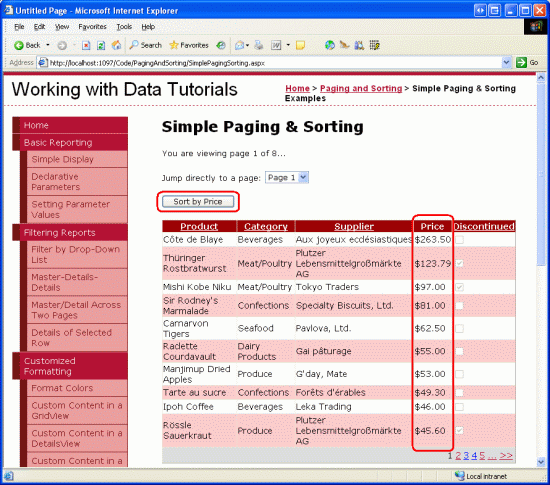

Paging and Sorting Report Data (VB)
====================
by [Scott Mitchell](https://twitter.com/ScottOnWriting)

[Download Sample App](http://download.microsoft.com/download/9/c/1/9c1d03ee-29ba-4d58-aa1a-f201dcc822ea/ASPNET_Data_Tutorial_24_VB.exe) or [Download PDF](paging-and-sorting-report-data-vb/_static/datatutorial24vb1.pdf)

> Paging and sorting are two very common features when displaying data in an online application. In this tutorial we'll take a first look at adding sorting and paging to our reports, which we will then build upon in future tutorials.

## Introduction

Paging and sorting are two very common features when displaying data in an online application. For example, when searching for ASP.NET books at an online bookstore, there may be hundreds of such books, but the report listing the search results lists only ten matches per page. Moreover, the results can be sorted by title, price, page count, author name, and so on. While the past 23 tutorials have examined how to build a variety of reports, including interfaces that permit adding, editing, and deleting data, we ve not looked at how to sort data and the only paging examples we ve seen have been with the DetailsView and FormView controls.

In this tutorial we'll see how to add sorting and paging to our reports, which can be accomplished by simply checking a few checkboxes. Unfortunately, this simplistic implementation has its drawbacks the sorting interface leaves a bit to be desired and the paging routines are not designed for efficiently paging through large result sets. Future tutorials will explore how to overcome the limitations of the out-of-the-box paging and sorting solutions.

## Step 1: Adding the Paging and Sorting Tutorial Web Pages

Before we start this tutorial, let s first take a moment to add the ASP.NET pages we'll need for this tutorial and the next three. Start by creating a new folder in the project named `PagingAndSorting`. Next, add the following five ASP.NET pages to this folder, having all of them configured to use the master page `Site.master`:

- `Default.aspx`
- `SimplePagingSorting.aspx`
- `EfficientPaging.aspx`
- `SortParameter.aspx`
- `CustomSortingUI.aspx`

**Figure 1**: Create a PagingAndSorting Folder and Add the Tutorial ASP.NET Pages

Next, open the `Default.aspx` page and drag the `SectionLevelTutorialListing.ascx` User Control from the `UserControls` folder onto the Design surface. This User Control, which we created in the [Master Pages and Site Navigation](../introduction/master-pages-and-site-navigation-vb.md) tutorial, enumerates the site map and displays those tutorials in the current section in a bulleted list.

**Figure 2**: Add the SectionLevelTutorialListing.ascx User Control to Default.aspx

In order to have the bulleted list display the paging and sorting tutorials we'll be creating, we need to add them to the site map. Open the `Web.sitemap` file and add the following markup after the Editing, Inserting, and Deleting site map node markup:

[!code-xml[Main](paging-and-sorting-report-data-vb/samples/sample1.xml)]

**Figure 3**: Update the Site Map to Include the New ASP.NET Pages

## Step 2: Displaying Product Information in a GridView

Before we actually implement paging and sorting capabilities, let s first create a standard non-srotable, non-pageable GridView that lists the product information. This is a task we ve done many times before throughout this tutorial series so these steps should be familiar. Start by opening the `SimplePagingSorting.aspx` page and drag a GridView control from the Toolbox onto the Designer, setting its `ID` property to `Products`. Next, create a new ObjectDataSource that uses the ProductsBLL class s `GetProducts()` method to return all of the product information.

**Figure 4**: Retrieve Information About All of the Products Using the GetProducts() Method

Since this report is a read-only report, there s no need to map the ObjectDataSource s `Insert()`, `Update()`, or `Delete()` methods to corresponding `ProductsBLL` methods; therefore, choose (None) from the drop-down list for the UPDATE, INSERT, and DELETE tabs.

**Figure 5**: Choose the (None) Option in the Drop-Down List in the UPDATE, INSERT, and DELETE Tabs

Next, let s customize the GridView s fields so that only the products names, suppliers, categories, prices, and discontinued statuses are displayed. Furthermore, feel free to make any field-level formatting changes, such as adjusting the `HeaderText` properties or formatting the price as a currency. After these changes, your GridView s declarative markup should look similar to the following:

[!code-aspx[Main](paging-and-sorting-report-data-vb/samples/sample2.aspx)]

Figure 6 shows our progress thus far when viewed through a browser. Note that the page lists all of the products in one screen, showing each product s name, category, supplier, price, and discontinued status.

**Figure 6**: Each of the Products are Listed ([Click to view full-size image](paging-and-sorting-report-data-vb/_static/image8.png))

## Step 3: Adding Paging Support

Listing *all* of the products on one screen can lead to information overload for the user perusing the data. To help make the results more manageable, we can break up the data into smaller pages of data and allow the user to step through the data one page at a time. To accomplish this simply check the Enable Paging checkbox from the GridView s smart tag (this sets the GridView s [`AllowPaging` property](https://msdn.microsoft.com/en-us/library/system.web.ui.webcontrols.gridview.allowpaging.aspx) to `true`).

**Figure 7**: Check the Enable Paging Checkbox to Add Paging Support ([Click to view full-size image](paging-and-sorting-report-data-vb/_static/image11.png))

Enabling paging limits the number of records shown per page and adds a *paging interface* to the GridView. The default paging interface, shown in Figure 7, is a series of page numbers, allowing the user to quickly navigate from one page of data to another. This paging interface should look familiar, as we ve seen it when adding paging support to the DetailsView and FormView controls in past tutorials.

Both the DetailsView and FormView controls only show a single record per page. The GridView, however, consults its [`PageSize` property](https://msdn.microsoft.com/en-US/library/system.web.ui.webcontrols.gridview.pagesize.aspx) to determine how many records to show per page (this property defaults to a value of 10).

This GridView, DetailsView, and FormView s paging interface can be customized using the following properties:

- `PagerStyle` indicates the style information for the paging interface; can specify settings like `BackColor`, `ForeColor`, `CssClass`, `HorizontalAlign`, and so on.
- `PagerSettings` contains a bevy of properties that can customize the functionality of the paging interface; `PageButtonCount` indicates the maximum number of numeric page numbers displayed in the paging interface (the default is 10); the [`Mode` property](https://msdn.microsoft.com/en-US/library/system.web.ui.webcontrols.pagersettings.mode.aspx) indicates how the paging interface operates and can be set to: 

    - `NextPrevious` shows a Next and Previous buttons, allowing the user to step forwards or backwards one page at a time
    - `NextPreviousFirstLast` in addition to Next and Previous buttons, First and Last buttons are also included, allowing the user to quickly move to the first or last page of data
    - `Numeric` shows a series of page numbers, allowing the user to immediately jump to any page
    - `NumericFirstLast` in addition to the page numbers, includes First and Last buttons, allowing the user to quickly move to the first or last page of data; the First/Last buttons are only shown if all of the numeric page numbers cannot fit

Moreover, the GridView, DetailsView, and FormView all offer the `PageIndex` and `PageCount` properties, which indicate the current page being viewed and the total number of pages of data, respectively. The `PageIndex` property is indexed starting at 0, meaning that when viewing the first page of data `PageIndex` will equal 0. `PageCount`, on the other hand, starts counting at 1, meaning that `PageIndex` is limited to the values between 0 and `PageCount - 1`.

Let s take a moment to improve the default appearance of our GridView s paging interface. Specifically, let s have the paging interface right-aligned with a light gray background. Rather than setting these properties directly through the GridView s `PagerStyle` property, let s create a CSS class in `Styles.css` named `PagerRowStyle` and then assign the `PagerStyle` s `CssClass` property through our Theme. Start by opening `Styles.css` and adding the following CSS class definition:

[!code-css[Main](paging-and-sorting-report-data-vb/samples/sample3.css)]

Next, open the `GridView.skin` file in the `DataWebControls` folder within the `App_Themes` folder. As we discussed in the *Master Pages and Site Navigation* tutorial, Skin files can be used to specify the default property values for a Web control. Therefore, augment the existing settings to include setting the `PagerStyle` s `CssClass` property to `PagerRowStyle`. Also, let s configure the paging interface to show at most five numeric page buttons using the `NumericFirstLast` paging interface.

[!code-aspx[Main](paging-and-sorting-report-data-vb/samples/sample4.aspx)]

## The Paging User Experience

Figure 8 shows the web page when visited through a browser after the GridView s Enable Paging checkbox has been checked and the `PagerStyle` and `PagerSettings` configurations have been made through the `GridView.skin` file. Note how only ten records are shown, and the paging interface indicates that we are viewing the first page of data.

**Figure 8**: With Paging Enabled, Only a Subset of the Records are Displayed at a Time ([Click to view full-size image](paging-and-sorting-report-data-vb/_static/image14.png))

When the user clicks on one of the page numbers in the paging interface, a postback ensues and the page reloads showing that requested page s records. Figure 9 shows the results after opting to view the final page of data. Notice that the final page only has one record; this is because there are 81 records in total, resulting in eight pages of 10 records per page plus one page with a lone record.

**Figure 9**: Clicking On a Page Number Causes a Postback and Shows the Appropriate Subset of Records ([Click to view full-size image](paging-and-sorting-report-data-vb/_static/image17.png))

## Paging s Server-Side Workflow

When the end user clicks on a button in the paging interface, a postback ensues and the following server-side workflow begins:

1. The GridView s (or DetailsView or FormView) `PageIndexChanging` event fires
2. The ObjectDataSource re-requests *all* of the data from the BLL; the GridView s `PageIndex` and `PageSize` property values are used to determine what records returned from the BLL need to be displayed in the GridView
3. The GridView s `PageIndexChanged` event fires

In Step 2, the ObjectDataSource re-requests all of the data from its data source. This style of paging is commonly referred to as *default paging*, as it s the paging behavior used by default when setting the `AllowPaging` property to `true`. With default paging the data Web control naively retrieves all records for each page of data, even though only a subset of records are actually rendered into the HTML that s sent to the browser. Unless the database data is cached by the BLL or ObjectDataSource, default paging is unworkable for sufficiently large result sets or for web applications with many concurrent users.

In the next tutorial we'll examine how to implement *custom paging*. With custom paging you can specifically instruct the ObjectDataSource to only retrieve the precise set of records needed for the requested page of data. As you can imagine, custom paging greatly improves the efficiency of paging through large result sets.

> [!NOTE]
> While default paging is not suitable when paging through sufficiently large result sets or for sites with many simultaneous users, realize that custom paging requires more changes and effort to implement and is not as simple as checking a checkbox (as is default paging). Therefore, default paging may be the ideal choice for small, low-traffic websites or when paging through relatively small result sets, as it s much easier and quicker to implement.

For example, if we know that we'll never have more than 100 products in our database, the minimal performance gain enjoyed by custom paging is likely offset by the effort required to implement it. If, however, we may one day have thousands or tens of thousands of products, *not* implementing custom paging would greatly hamper the scalability of our application.

## Step 4: Customizing the Paging Experience

The data Web controls provide a number of properties that can be used to enhance the user s paging experience. The `PageCount` property, for example, indicates how many total pages there are, while the `PageIndex` property indicates the current page being visited and can be set to quickly move a user to a specific page. To illustrate how to use these properties to improve upon the user s paging experience, let s add a Label Web control to our page that informs the user what page they re currently visiting, along with a DropDownList control that allows them to quickly jump to any given page.

First, add a Label Web control to your page, set its `ID` property to `PagingInformation`, and clear out its `Text` property. Next, create an event handler for the GridView s `DataBound` event and add the following code:

[!code-vb[Main](paging-and-sorting-report-data-vb/samples/sample5.vb)]

This event handler assigns the `PagingInformation` Label s `Text` property to a message informing the user the page they are currently visiting `Products.PageIndex + 1` out of how many total pages `Products.PageCount` (we add 1 to the `Products.PageIndex` property because `PageIndex` is indexed starting at 0). I chose the assign this Label s `Text` property in the `DataBound` event handler as opposed to the `PageIndexChanged` event handler because the `DataBound` event fires every time data is bound to the GridView whereas the `PageIndexChanged` event handler only fires when the page index is changed. When the GridView is initially data bound on the first page visit, the `PageIndexChanging` event doesn t fire (whereas the `DataBound` event does).

With this addition, the user is now shown a message indicating what page they are visiting and how many total pages of data there are.

**Figure 10**: The Current Page Number and Total Number of Pages are Displayed ([Click to view full-size image](paging-and-sorting-report-data-vb/_static/image20.png))

In addition to the Label control, let s also add a DropDownList control that lists the page numbers in the GridView with the currently viewed page selected. The idea here is that the user can quickly jump from the current page to another by simply selecting the new page index from the DropDownList. Start by adding a DropDownList to the Designer, setting its `ID` property to `PageList` and checking the Enable AutoPostBack option from its smart tag.

Next, return to the `DataBound` event handler and add the following code:

[!code-vb[Main](paging-and-sorting-report-data-vb/samples/sample6.vb)]

This code begins by clearing out the items in the `PageList` DropDownList. This may seem superfluous, since one wouldn t expect the number of pages to change, but other users may be using the system simultaneously, adding or removing records from the `Products` table. Such insertions or deletions could alter the number of pages of data.

Next, we need to create the page numbers again and have the one that maps to the current GridView `PageIndex` selected by default. We accomplish this with a loop from 0 to `PageCount - 1`, adding a new `ListItem` in each iteration and setting its `Selected` property to true if the current iteration index equals the GridView s `PageIndex` property.

Finally, we need to create an event handler for the DropDownList s `SelectedIndexChanged` event, which fires each time the user pick a different item from the list. To create this event handler, simply double-click the DropDownList in the Designer, then add the following code:

[!code-vb[Main](paging-and-sorting-report-data-vb/samples/sample7.vb)]

As Figure 11 shows, merely changing the GridView s `PageIndex` property causes the data to be rebound to the GridView. In the GridView s `DataBound` event handler, the appropriate DropDownList `ListItem` is selected.

**Figure 11**: The User is Automatically Taken to the Sixth Page When Selecting the Page 6 Drop-Down List Item ([Click to view full-size image](paging-and-sorting-report-data-vb/_static/image23.png))

## Step 5: Adding Bi-Directional Sorting Support

Adding bi-directional sorting support is as simple as adding paging support simply check the Enable Sorting option from the GridView s smart tag (which sets the GridView s [`AllowSorting` property](https://msdn.microsoft.com/en-US/library/system.web.ui.webcontrols.gridview.allowsorting.aspx) to `true`). This renders each of the headers of the GridView s fields as LinkButtons that, when clicked, cause a postback and return the data sorted by the clicked column in ascending order. Clicking the same header LinkButton again re-sorts the data in descending order.

> [!NOTE]
> If you are using a custom Data Access Layer rather than a Typed DataSet, you may not have an Enable Sorting option in the GridView s smart tag. Only GridViews bound to data sources that natively support sorting have this checkbox available. The Typed DataSet provides out-of-the-box sorting support since the ADO.NET DataTable provides a `Sort` method that, when invoked, sorts the DataTable s DataRows using the criteria specified.

If your DAL does not return objects that natively support sorting you will need to configure the ObjectDataSource to pass sorting information to the Business Logic Layer, which can either sort the data or have the data sorted by the DAL. We'll explore how to sort data at the Business Logic and Data Access Layers in a future tutorial.

The sorting LinkButtons are rendered as HTML hyperlinks, whose current colors (blue for an unvisited link and a dark red for a visited link) clash with the background color of the header row. Instead, let s have all header row links displayed in white, regardless of whether they ve been visited or not. This can be accomplished by adding the following to the `Styles.css` class:

[!code-css[Main](paging-and-sorting-report-data-vb/samples/sample8.css)]

This syntax indicates to use white text when displaying those hyperlinks within an element that uses the HeaderStyle class.

After this CSS addition, when visiting the page through a browser your screen should look similar to Figure 12. In particular, Figure 12 shows the results after the Price field s header link has been clicked.

**Figure 12**: The Results Have Been Sorted by the UnitPrice in Ascending Order ([Click to view full-size image](paging-and-sorting-report-data-vb/_static/image26.png))

## Examining the Sorting Workflow

All GridView fields the BoundField, CheckBoxField, TemplateField, and so on have a `SortExpression` property that indicates the expression that should be used to sort the data when that field s sorting header link is clicked. The GridView also has a `SortExpression` property. When a sorting header LinkButton is clicked, the GridView assigns that field s `SortExpression` value to its `SortExpression` property. Next, the data is re-retrieved from the ObjectDataSource and sorted according to the GridView s `SortExpression` property. The following list details the sequence of steps that transpires when an end user sorts the data in a GridView:

1. The GridView s [Sorting event](https://msdn.microsoft.com/en-us/library/system.web.ui.webcontrols.gridview.sorting(VS.80).aspx) fires
2. The GridView s [`SortExpression` property](https://msdn.microsoft.com/en-us/library/system.web.ui.webcontrols.gridview.sortexpression.aspx) is set to the `SortExpression` of the field whose sorting header LinkButton was clicked
3. The ObjectDataSource re-retrieves all of the data from the BLL and then sorts the data using the GridView s `SortExpression`
4. The GridView s `PageIndex` property is reset to 0, meaning that when sorting the user is returned to the first page of data (assuming paging support has been implemented)
5. The GridView s [`Sorted` event](https://msdn.microsoft.com/en-us/library/system.web.ui.webcontrols.gridview.sorted(VS.80).aspx) fires

Like with default paging, the default sorting option re-retrieves *all* of the records from the BLL. When using sorting without paging or when using sorting with default paging, there s no way to circumvent this performance hit (short of caching the database data). However, as we'll see in a future tutorial, it s possible to efficiently sort data when using custom paging.

When binding an ObjectDataSource to the GridView through the drop-down list in the GridView s smart tag, each GridView field automatically has its `SortExpression` property assigned to the name of the data field in the `ProductsRow` class. For example, the `ProductName` BoundField s `SortExpression` is set to `ProductName`, as shown in the following declarative markup:

[!code-aspx[Main](paging-and-sorting-report-data-vb/samples/sample9.aspx)]

A field can be configured so that it s not sortable by clearing out its `SortExpression` property (assigning it to an empty string). To illustrate this, imagine that we didn t want to let our customers sort our products by price. The `UnitPrice` BoundField s `SortExpression` property can be removed either from the declarative markup or through the Fields dialog box (which is accessible by clicking on the Edit Columns link in the GridView s smart tag).

**Figure 13**: The Results Have Been Sorted by the UnitPrice in Ascending Order

Once the `SortExpression` property has been removed for the `UnitPrice` BoundField, the header is rendered as text rather than as a link, thereby preventing users from sorting the data by price.

**Figure 14**: By Removing the SortExpression Property, Users Can No Longer Sort the Products By Price ([Click to view full-size image](paging-and-sorting-report-data-vb/_static/image30.png))

## Programmatically Sorting the GridView

You can also sort the contents of the GridView programmatically by using the GridView s [`Sort` method](https://msdn.microsoft.com/en-us/library/system.web.ui.webcontrols.gridview.sort.aspx). Simply pass in the `SortExpression` value to sort by along with the [`SortDirection`](https://msdn.microsoft.com/en-us/library/system.web.ui.webcontrols.sortdirection.aspx) (`Ascending` or `Descending`), and the GridView s data will be re-sorted.

Imagine that the reason we turned off sorting by the `UnitPrice` was because we were worried that our customers would simply buy only the lowest-priced products. However, we want to encourage them to buy the most expensive products, so we d like them to be able to sort the products by price, but only from the most expensive price to the least.

To accomplish this add a Button Web control to the page, set its `ID` property to `SortPriceDescending`, and its `Text` property to Sort by Price. Next, create an event handler for the Button s `Click` event by double-clicking the Button control in the Designer. Add the following code to this event handler:

[!code-vb[Main](paging-and-sorting-report-data-vb/samples/sample10.vb)]

Clicking this Button returns the user to the first page with the products sorted by price, from most expensive to least expensive (see Figure 15).

**Figure 15**: Clicking the Button Orders the Products From the Most Expensive to the Least ([Click to view full-size image](paging-and-sorting-report-data-vb/_static/image33.png))

## Summary

In this tutorial we saw how to implement default paging and sorting capabilities, both of which were as easy as checking a checkbox! When a user sorts or pages through data, a similar workflow unfolds:

1. A postback ensues
2. The data Web control s pre-level event fires (`PageIndexChanging` or `Sorting`)
3. All of the data is re-retrieved by the ObjectDataSource
4. The data Web control s post-level event fires (`PageIndexChanged` or `Sorted`)

While implementing basic paging and sorting is a breeze, more effort must be exerted to utilize the more efficient custom paging or to further enhance the paging or sorting interface. Future tutorials will explore these topics.

Happy Programming!

## About the Author

[Scott Mitchell](http://www.4guysfromrolla.com/ScottMitchell.shtml), author of seven ASP/ASP.NET books and founder of [4GuysFromRolla.com](http://www.4guysfromrolla.com), has been working with Microsoft Web technologies since 1998. Scott works as an independent consultant, trainer, and writer. His latest book is [*Sams Teach Yourself ASP.NET 2.0 in 24 Hours*](https://www.amazon.com/exec/obidos/ASIN/0672327384/4guysfromrollaco). He can be reached at [mitchell@4GuysFromRolla.com.](mailto:mitchell@4GuysFromRolla.com) or via his blog, which can be found at [http://ScottOnWriting.NET](http://ScottOnWriting.NET).

>[!div class="step-by-step"]
[Previous](creating-a-customized-sorting-user-interface-cs.md)
[Next](efficiently-paging-through-large-amounts-of-data-vb.md)