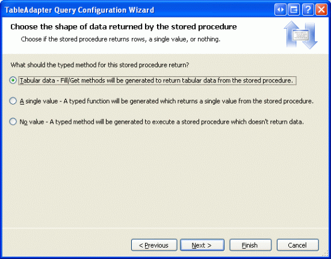
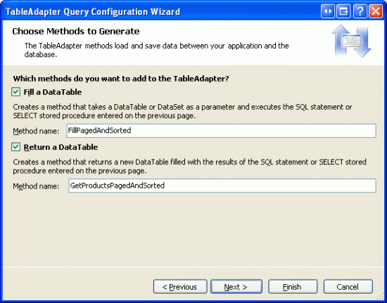
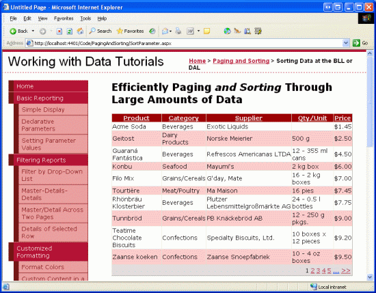

Sorting Custom Paged Data (C#)
====================
by [Scott Mitchell](https://twitter.com/ScottOnWriting)

[Download Sample App](http://download.microsoft.com/download/9/c/1/9c1d03ee-29ba-4d58-aa1a-f201dcc822ea/ASPNET_Data_Tutorial_26_CS.exe) or [Download PDF](sorting-custom-paged-data-cs/_static/datatutorial26cs1.pdf)

> In the previous tutorial we learned how to implement custom paging when presentating data on a web page. In this tutorial we see how to extend the preceding example to include support for sorting custom paging.

## Introduction

Compared to default paging, custom paging can improve the performance of paging through data by several orders of magnitude, making custom paging the de facto paging implementation choice when paging through large amounts of data. Implementing custom paging is more involved than implementing default paging, however, especially when adding sorting to the mix. In this tutorial we'll extend the example from the preceding one to include support for sorting *and* custom paging.

> [!NOTE]
> Since this tutorial builds upon the preceding one, before beginning take a moment to copy the declarative syntax within the `<asp:Content>` element from the preceding tutorial s web page (`EfficientPaging.aspx`) and paste it between the `<asp:Content>` element in the `SortParameter.aspx` page. Refer back to Step 1 of the [Adding Validation Controls to the Editing and Inserting Interfaces](../editing-inserting-and-deleting-data/adding-validation-controls-to-the-editing-and-inserting-interfaces-cs.md) tutorial for a more detailed discussion on replicating the functionality of one ASP.NET page to another.

## Step 1: Reexamining the Custom Paging Technique

For custom paging to work properly, we must implement some technique that can efficiently grab a particular subset of records given the Start Row Index and Maximum Rows parameters. There are a handful of techniques that can be used to achieve this aim. In the preceding tutorial we looked at accomplishing this using Microsoft SQL Server 2005 s new `ROW_NUMBER()` ranking function. In short, the `ROW_NUMBER()` ranking function assigns a row number to each row returned by a query that is ranked by a specified sort order. The appropriate subset of records is then obtained by returning a particular section of the numbered results. The following query illustrates how to use this technique to return those products numbered 11 through 20 when ranking the results ordered alphabetically by the `ProductName`:

[!code-sql[Main](sorting-custom-paged-data-cs/samples/sample1.sql)]

This technique works well for paging using a specific sort order (`ProductName` sorted alphabetically, in this case), but the query needs to be modified to show the results sorted by a different sort expression. Ideally, the above query could be rewritten to use a parameter in the `OVER` clause, like so:

[!code-sql[Main](sorting-custom-paged-data-cs/samples/sample2.sql)]

Unfortunately, parameterized `ORDER BY` clauses are not allowed. Instead, we must create a stored procedure that accepts a `@sortExpression` input parameter, but uses one of the following workarounds:

- Write hard-coded queries for each of the sort expressions that may be used; then, use `IF/ELSE` T-SQL statements to determine which query to execute.
- Use a `CASE` statement to provide dynamic `ORDER BY` expressions based on the `@sortExpressio` n input parameter; see the Used to Dynamically Sort Query Results section in [The Power of SQL `CASE` Statements](http://www.4guysfromrolla.com/webtech/102704-1.shtml) for more information.
- Craft the appropriate query as a string in the stored procedure and then use [the `sp_executesql` system stored procedure](https://msdn.microsoft.com/en-us/library/ms188001.aspx) to execute the dynamic query.

Each of these workarounds has some drawbacks. The first option is not as maintainable as the other two as it requires that you create a query for each possible sort expression. Therefore, if later you decide to add new, sortable fields to the GridView you will also need to go back and update the stored procedure. The second approach has some subtleties that introduce performance concerns when sorting by non-string database columns and also suffers from the same maintainability issues as the first. And the third choice, which uses dynamic SQL, introduces the risk for a SQL injection attack if an attacker is able to execute the stored procedure passing in the input parameter values of their choosing.

While none of these approaches is perfect, I think the third option is the best of the three. With its use of dynamic SQL, it offers a level of flexibility the other two do not. Furthermore, a SQL injection attack can only be exploited if an attacker is able to execute the stored procedure passing in the input parameters of his choice. Since the DAL uses parameterized queries, ADO.NET will protect those parameters that are sent to the database through the architecture, meaning that the SQL injection attack vulnerability only exists if the attacker can directly execute the stored procedure.

To implement this functionality, create a new stored procedure in the Northwind database named `GetProductsPagedAndSorted`. This stored procedure should accept three input parameters: `@sortExpression`, an input parameter of type `nvarchar(100`) that specifies how the results should be sorted and is injected directly after the `ORDER BY` text in the `OVER` clause; and `@startRowIndex` and `@maximumRows`, the same two integer input parameters from the `GetProductsPaged` stored procedure examined in the preceding tutorial. Create the `GetProductsPagedAndSorted` stored procedure using the following script:

[!code-sql[Main](sorting-custom-paged-data-cs/samples/sample3.sql)]

The stored procedure starts by ensuring that a value for the `@sortExpression` parameter has been specified. If it is missing, the results are ranked by `ProductID`. Next, the dynamic SQL query is constructed. Note that the dynamic SQL query here differs slightly from our previous queries used to retrieve all rows from the Products table. In prior examples, we obtained each product s associated category s and supplier s names using a subquery. This decision was made back in the [Creating a Data Access Layer](../introduction/creating-a-data-access-layer-cs.md) tutorial and was done in lieu of using `JOIN` s because the TableAdapter cannot automatically create the associated insert, update, and delete methods for such queries. The `GetProductsPagedAndSorted` stored procedure, however, must use `JOIN` s for the results to be ordered by the category or supplier names.

This dynamic query is built up by concatenating the static query portions and the `@sortExpression`, `@startRowIndex`, and `@maximumRows` parameters. Since `@startRowIndex` and `@maximumRows` are integer parameters, they must be converted into nvarchars in order to be correctly concatenated. Once this dynamic SQL query has been constructed, it is executed via `sp_executesql`.

Take a moment to test this stored procedure with different values for the `@sortExpression`, `@startRowIndex`, and `@maximumRows` parameters. From the Server Explorer, right-click on the stored procedure name and choose Execute. This will bring up the Run Stored Procedure dialog box into which you can enter the input parameters (see Figure 1). To sort the results by the category name, use CategoryName for the `@sortExpression` parameter value; to sort by the supplier s company name, use CompanyName. After providing the parameters values, click OK. The results are displayed in the Output window. Figure 2 shows the results when returning products ranked 11 through 20 when ordering by the `UnitPrice` in descending order.

**Figure 1**: Try Different Values for the Stored Procedure s Three Input Parameters

**Figure 2**: The Stored Procedure s Results are Shown in the Output Window ([Click to view full-size image](sorting-custom-paged-data-cs/_static/image4.png))

> [!NOTE]
> When ranking the results by the specified `ORDER BY` column in the `OVER` clause, SQL Server must sort the results. This is a quick operation if there is a clustered index over the column(s) the results are being ordered by or if there is a covering index, but can be more costly otherwise. To improve performance for sufficiently large queries, consider adding a non-clustered index for the column by which the results are ordered by. Refer to [Ranking Functions and Performance in SQL Server 2005](http://www.sql-server-performance.com/ak_ranking_functions.asp) for more details.

## Step 2: Augmenting the Data Access and Business Logic Layers

With the `GetProductsPagedAndSorted` stored procedure created, our next step is to provide a means to execute that stored procedure through our application architecture. This entails adding an appropriate method to both the DAL and BLL. Let s start by adding a method to the DAL. Open the `Northwind.xsd` Typed DataSet, right-click on the `ProductsTableAdapter`, and choose the Add Query option from the context menu. As we did in the preceding tutorial, we want to configure this new DAL method to use an existing stored procedure - `GetProductsPagedAndSorted`, in this case. Start by indicating that you want the new TableAdapter method to use an existing stored procedure.

**Figure 3**: Choose to Use an Existing Stored Procedure

To specify the stored procedure to use, select the `GetProductsPagedAndSorted` stored procedure from the drop-down list in the next screen.

**Figure 4**: Use the GetProductsPagedAndSorted Stored Procedure

This stored procedure returns a set of records as its results so, in the next screen, indicate that it returns tabular data.

**Figure 5**: Indicate that the Stored Procedure Returns Tabular Data

Finally, create DAL methods that use both the Fill a DataTable and Return a DataTable patterns, naming the methods `FillPagedAndSorted` and `GetProductsPagedAndSorted`, respectively.

**Figure 6**: Choose the Methods Names

Now that we ve extended the DAL, we re ready to turn to the BLL. Open the `ProductsBLL` class file and add a new method, `GetProductsPagedAndSorted`. This method needs to accept three input parameters `sortExpression`, `startRowIndex`, and `maximumRows` and should simply call down into the DAL s `GetProductsPagedAndSorted` method, like so:

[!code-csharp[Main](sorting-custom-paged-data-cs/samples/sample4.cs)]

## Step 3: Configuring the ObjectDataSource to Pass in the SortExpression Parameter

Having augmented the DAL and BLL to include methods that utilize the `GetProductsPagedAndSorted` stored procedure, all that remains is to configure the ObjectDataSource in the `SortParameter.aspx` page to use the new BLL method and to pass in the `SortExpression` parameter based on the column that the user has requested to sort the results by.

Start by changing the ObjectDataSource s `SelectMethod` from `GetProductsPaged` to `GetProductsPagedAndSorted`. This can be done through the Configure Data Source wizard, from the Properties window, or directly through the declarative syntax. Next, we need to provide a value for the ObjectDataSource s [`SortParameterName` property](https://msdn.microsoft.com/en-us/library/system.web.ui.webcontrols.objectdatasource.sortparametername.aspx). If this property is set, the ObjectDataSource attempts to pass in the GridView s `SortExpression` property to the `SelectMethod`. In particular, the ObjectDataSource looks for an input parameter whose name is equal to the value of the `SortParameterName` property. Since the BLL s `GetProductsPagedAndSorted` method has the sort expression input parameter named `sortExpression`, set the ObjectDataSource s `SortExpression` property to sortExpression .

After making these two changes, the ObjectDataSource s declarative syntax should look similar to the following:

[!code-aspx[Main](sorting-custom-paged-data-cs/samples/sample5.aspx)]

> [!NOTE]
> As with the preceding tutorial, ensure that the ObjectDataSource does *not* include the sortExpression, startRowIndex, or maximumRows input parameters in its SelectParameters collection.

To enable sorting in the GridView, simply check the Enable Sorting checkbox in the GridView s smart tag, which sets the GridView s `AllowSorting` property to `true` and causing the header text for each column to be rendered as a LinkButton. When the end user clicks on one of the header LinkButtons, a postback ensues and the following steps transpire:

1. The GridView updates its [`SortExpression` property](https://msdn.microsoft.com/en-US/library/system.web.ui.webcontrols.gridview.sortexpression.aspx) to the value of the `SortExpression` of the field whose header link was clicked
2. The ObjectDataSource invokes the BLL s `GetProductsPagedAndSorted` method, passing in the GridView s `SortExpression` property as the value for the method s `sortExpression` input parameter (along with the appropriate `startRowIndex` and `maximumRows` input parameter values)
3. The BLL invokes the DAL s `GetProductsPagedAndSorted` method
4. The DAL executes the `GetProductsPagedAndSorted` stored procedure, passing in the `@sortExpression` parameter (along with the `@startRowIndex` and `@maximumRows` input parameter values)
5. The stored procedure returns the appropriate subset of data to the BLL, which returns it to the ObjectDataSource; this data is then bound to the GridView, rendered into HTML, and sent down to the end user

Figure 7 shows the first page of results when sorted by the `UnitPrice` in ascending order.

**Figure 7**: The Results are Sorted by the UnitPrice ([Click to view full-size image](sorting-custom-paged-data-cs/_static/image11.png))

While the current implementation can correctly sort the results by product name, category name, quantity per unit, and unit price, attempting to order the results by the supplier name results in a runtime exception (see Figure 8).

**Figure 8**: Attempting to Sort the Results by the Supplier Results in the Following Runtime Exception

This exception occurs because the `SortExpression` of the GridView s `SupplierName` BoundField is set to `SupplierName`. However, the supplier s name in the `Suppliers` table is actually called `CompanyName` we have been aliased this column name as `SupplierName`. However, the `OVER` clause used by the `ROW_NUMBER()` function cannot use the alias and must use the actual column name. Therefore, change the `SupplierName` BoundField s `SortExpression` from SupplierName to CompanyName (see Figure 9). As Figure 10 shows, after this change the results can be sorted by the supplier.

**Figure 9**: Change the SupplierName BoundField s SortExpression to CompanyName

**Figure 10**: The Results Can Now Be Sorted by Supplier ([Click to view full-size image](sorting-custom-paged-data-cs/_static/image16.png))

## Summary

The custom paging implementation we examined in the preceding tutorial required that the order by which the results were to be sorted be specified at design time. In short, this meant that the custom paging implementation we implemented could not, at the same time, provide sorting capabilities. In this tutorial we overcame this limitation by extending the stored procedure from the first to include a `@sortExpression` input parameter by which the results could be sorted.

After creating this stored procedure and creating new methods in the DAL and BLL, we were able to implement a GridView that offered both sorting and custom paging by configuring the ObjectDataSource to pass in the GridView s current `SortExpression` property to the BLL `SelectMethod`.

Happy Programming!

## About the Author

[Scott Mitchell](http://www.4guysfromrolla.com/ScottMitchell.shtml), author of seven ASP/ASP.NET books and founder of [4GuysFromRolla.com](http://www.4guysfromrolla.com), has been working with Microsoft Web technologies since 1998. Scott works as an independent consultant, trainer, and writer. His latest book is [*Sams Teach Yourself ASP.NET 2.0 in 24 Hours*](https://www.amazon.com/exec/obidos/ASIN/0672327384/4guysfromrollaco). He can be reached at [mitchell@4GuysFromRolla.com.](mailto:mitchell@4GuysFromRolla.com) or via his blog, which can be found at [http://ScottOnWriting.NET](http://ScottOnWriting.NET).

## Special Thanks To

This tutorial series was reviewed by many helpful reviewers. Lead reviewer for this tutorial was Carlos Santos. Interested in reviewing my upcoming MSDN articles? If so, drop me a line at [mitchell@4GuysFromRolla.com.](mailto:mitchell@4GuysFromRolla.com)

>[!div class="step-by-step"]
[Previous](efficiently-paging-through-large-amounts-of-data-cs.md)
[Next](creating-a-customized-sorting-user-interface-cs.md)