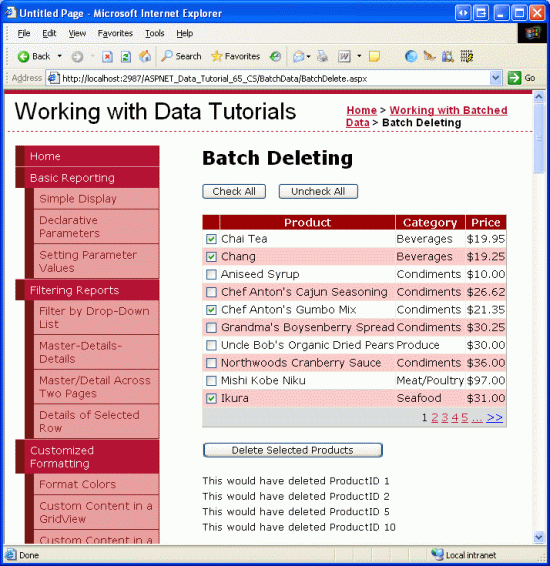
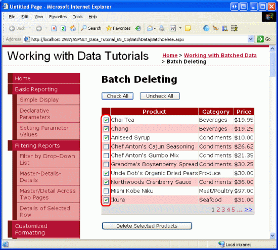

Batch Deleting (C#)
====================
by [Scott Mitchell](https://twitter.com/ScottOnWriting)

[Download Code](http://download.microsoft.com/download/3/9/f/39f92b37-e92e-4ab3-909e-b4ef23d01aa3/ASPNET_Data_Tutorial_65_CS.zip) or [Download PDF](batch-deleting-cs/_static/datatutorial65cs1.pdf)

> Learn how to delete multiple database records in a single operation. In the User Interface Layer we build upon an enhanced GridView created in an earlier tutorial. In the Data Access Layer we wrap the multiple Delete operations within a transaction to ensure that all deletions succeed or all deletions are rolled back.

## Introduction

The [preceding tutorial](batch-updating-cs.md) explored how to create a batch editing interface using a fully-editable GridView. In situations where users are commonly editing many records at once, a batch editing interface will require far fewer postbacks and keyboard-to-mouse context switches, thereby improving the end user s efficiency. This technique is similarly useful for pages where it is common for users to delete many records in one go.

Anyone who has used an online email client is already familiar with one of the most common batch deleting interfaces: a checkbox in each row in a grid with a corresponding Delete All Checked Items button (see Figure 1). This tutorial is rather short because we ve already done all of the hard work in previous tutorials in creating both the web-based interface and a method to delete a series of records as a single atomic operation. In the [Adding a GridView Column of Checkboxes](../enhancing-the-gridview/adding-a-gridview-column-of-checkboxes-cs.md) tutorial we created a GridView with a column of checkboxes and in the [Wrapping Database Modifications within a Transaction](wrapping-database-modifications-within-a-transaction-cs.md) tutorial we created a method in the BLL that would use a transaction to delete a `List<T>` of `ProductID` values. In this tutorial, we will build upon and merge our previous experiences to create a working batch deleting example.

**Figure 1**: Each Row Includes a Checkbox ([Click to view full-size image](batch-deleting-cs/_static/image2.png))

## Step 1: Creating the Batch Deleting Interface

Since we already created the batch deleting interface in the [Adding a GridView Column of Checkboxes](../enhancing-the-gridview/adding-a-gridview-column-of-checkboxes-cs.md) tutorial, we can simply copy it to `BatchDelete.aspx` rather than creating it from scratch. Start by opening the `BatchDelete.aspx` page in the `BatchData` folder and the `CheckBoxField.aspx` page in the `EnhancedGridView` folder. From the `CheckBoxField.aspx` page, go to the Source view and copy the markup between the `<asp:Content>` tags as shown in Figure 2.

**Figure 2**: Copy the Declarative Markup of `CheckBoxField.aspx` to the Clipboard ([Click to view full-size image](batch-deleting-cs/_static/image4.png))

Next, go to the Source view in `BatchDelete.aspx` and paste the contents of the clipboard within the `<asp:Content>` tags. Also copy and paste the code from within the code-behind class in `CheckBoxField.aspx.cs` to within the code-behind class in `BatchDelete.aspx.cs` (the `DeleteSelectedProducts` Button s `Click` event handler, the `ToggleCheckState` method, and the `Click` event handlers for the `CheckAll` and `UncheckAll` Buttons). After copying over this content, the `BatchDelete.aspx` page s code-behind class should contain the following code:

[!code-csharp[Main](batch-deleting-cs/samples/sample1.cs)]

After copying over the declarative markup and source code, take a moment to test `BatchDelete.aspx` by viewing it through a browser. You should see a GridView listing the first ten products in a GridView with each row listing the product s name, category, and price along with a checkbox. There should be three buttons: Check All, Uncheck All, and Delete Selected Products. Clicking the Check All button selects all checkboxes, while Uncheck All clears all checkboxes. Clicking Delete Selected Products displays a message that lists the `ProductID` values of the selected products, but does not actually delete the products.

**Figure 3**: The Interface from `CheckBoxField.aspx` has been Moved to `BatchDeleting.aspx` ([Click to view full-size image](batch-deleting-cs/_static/image6.png))

## Step 2: Deleting the Checked Products Using Transactions

With the batch deleting interface successfully copied over to `BatchDeleting.aspx`, all that remains is to update the code so that the Delete Selected Products button deletes the checked products using the `DeleteProductsWithTransaction` method in the `ProductsBLL` class. This method, added in the [Wrapping Database Modifications within a Transaction](wrapping-database-modifications-within-a-transaction-cs.md) tutorial, accepts as its input a `List<T>` of `ProductID` values and deletes each corresponding `ProductID` within the scope of a transaction.

The `DeleteSelectedProducts` Button s `Click` event handler currently uses the following `foreach` loop to iterate through each GridView row:

[!code-csharp[Main](batch-deleting-cs/samples/sample2.cs)]

For each row, the `ProductSelector` CheckBox Web control is programmatically referenced. If it is checked, the row s `ProductID` is retrieved from the `DataKeys` collection and the `DeleteResults` Label s `Text` property is updated to include a message indicating that the row was selected for deletion.

The above code does not actually delete any records as the call to the `ProductsBLL` class s `Delete` method is commented out. Were this delete logic to be applied, the code would delete the products but not within an atomic operation. That is, if the first few deletes in the sequence succeeded, but a later one failed (perhaps due to a foreign key constraint violation), an exception would be thrown but those products already deleted would remain deleted.

In order to assure atomicity, we need to instead use the `ProductsBLL` class s `DeleteProductsWithTransaction` method. Because this method accepts a list of `ProductID` values, we need to first compile this list from the grid and then pass it as a parameter. We first create an instance of a `List<T>` of type `int`. Within the `foreach` loop we need to add the selected products `ProductID` values to this `List<T>`. After the loop this `List<T>` must be passed to the `ProductsBLL` class s `DeleteProductsWithTransaction` method. Update the `DeleteSelectedProducts` Button s `Click` event handler with the following code:

[!code-csharp[Main](batch-deleting-cs/samples/sample3.cs)]

The updated code creates a `List<T>` of type `int` (`productIDsToDelete`) and populates it with the `ProductID` values to delete. After the `foreach` loop, if there is at least one product selected, the `ProductsBLL` class s `DeleteProductsWithTransaction` method is called and passed this list. The `DeleteResults` Label is also displayed and the data rebound to the GridView (so that the newly-deleted records no longer appear as rows in the grid).

Figure 4 shows the GridView after a number of rows have been selected for deletion. Figure 5 shows the screen immediately after the Delete Selected Products button has been clicked. Note that in Figure 5 the `ProductID` values of the deleted records are displayed in the Label beneath the GridView and those rows are no longer in the GridView.

**Figure 4**: The Selected Products Will Be Deleted ([Click to view full-size image](batch-deleting-cs/_static/image8.png))

**Figure 5**: The Deleted Products `ProductID` Values are Listed Beneath the GridView ([Click to view full-size image](batch-deleting-cs/_static/image10.png))

> [!NOTE]
> To test the `DeleteProductsWithTransaction` method s atomicity, manually add an entry for a product in the `Order Details` table and then attempt to delete that product (along with others). You will receive a foreign key constraint violation when attempting to delete the product with an associated order, but note how the other selected products deletions are rolled back.

## Summary

Creating a batch deleting interface involves adding a GridView with a column of checkboxes and a Button Web control that, when clicked, will delete all of the selected rows as a single atomic operation. In this tutorial we built such an interface by piecing together work done in two previous tutorials, [Adding a GridView Column of Checkboxes](../enhancing-the-gridview/adding-a-gridview-column-of-checkboxes-cs.md) and [Wrapping Database Modifications within a Transaction](wrapping-database-modifications-within-a-transaction-cs.md). In the first tutorial we created a GridView with a column of checkboxes and in the latter we implemented a method in the BLL that, when passed a `List<T>` of `ProductID` values, deleted them all within the scope of a transaction.

In the next tutorial we'll create an interface for performing batch inserts.

Happy Programming!

## About the Author

[Scott Mitchell](http://www.4guysfromrolla.com/ScottMitchell.shtml), author of seven ASP/ASP.NET books and founder of [4GuysFromRolla.com](http://www.4guysfromrolla.com), has been working with Microsoft Web technologies since 1998. Scott works as an independent consultant, trainer, and writer. His latest book is [*Sams Teach Yourself ASP.NET 2.0 in 24 Hours*](https://www.amazon.com/exec/obidos/ASIN/0672327384/4guysfromrollaco). He can be reached at [mitchell@4GuysFromRolla.com.](mailto:mitchell@4GuysFromRolla.com) or via his blog, which can be found at [http://ScottOnWriting.NET](http://ScottOnWriting.NET).

## Special Thanks To

This tutorial series was reviewed by many helpful reviewers. Lead reviewers for this tutorial were Hilton Giesenow and Teresa Murphy. Interested in reviewing my upcoming MSDN articles? If so, drop me a line at [mitchell@4GuysFromRolla.com.](mailto:mitchell@4GuysFromRolla.com)

>[!div class="step-by-step"]
[Previous](batch-updating-cs.md)
[Next](batch-inserting-cs.md)