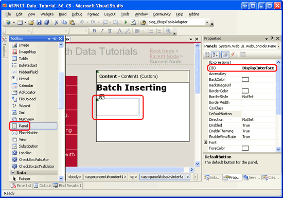
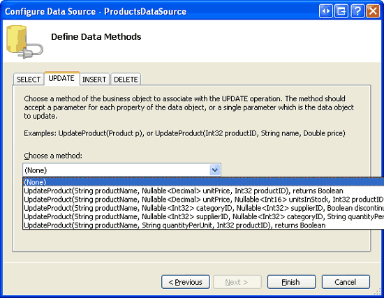
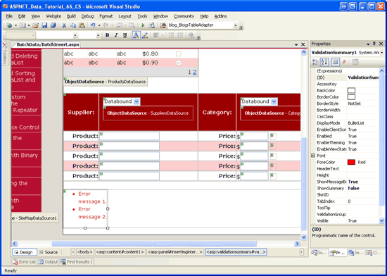
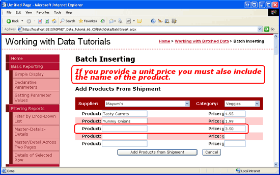

Batch Inserting (VB)
====================
by [Scott Mitchell](https://twitter.com/ScottOnWriting)

[Download Code](http://download.microsoft.com/download/3/9/f/39f92b37-e92e-4ab3-909e-b4ef23d01aa3/ASPNET_Data_Tutorial_66_VB.zip) or [Download PDF](batch-inserting-vb/_static/datatutorial66vb1.pdf)

> Learn how to insert multiple database records in a single operation. In the User Interface Layer we extend the GridView to allow the user to enter multiple new records. In the Data Access Layer we wrap the multiple Insert operations within a transaction to ensure that all insertions succeed or all insertions are rolled back.

## Introduction

In the [Batch Updating](batch-updating-vb.md) tutorial we looked at customizing the GridView control to present an interface where multiple records were editable. The user visiting the page could make a series of changes and then, with a single button click, perform a batch update. For situations where users commonly update many records in one go, such an interface can save countless clicks and keyboard-to-mouse context switches when compared to the default per-row editing features that were first explored back in the [An Overview of Inserting, Updating, and Deleting Data](../editing-inserting-and-deleting-data/an-overview-of-inserting-updating-and-deleting-data-vb.md) tutorial.

This concept can also be applied when adding records. Imagine that here at Northwind Traders we commonly receive shipments from suppliers that contain a number of products for a particular category. As an example, we might receive a shipment of six different tea and coffee products from Tokyo Traders. If a user enters the six products one at a time through a DetailsView control, they will have to choose many of the same values over and over again: they will need to choose the same category (Beverages), the same supplier (Tokyo Traders), the same discontinued value (False), and the same units on order value (0). This repetitive data entry is not only time consuming, but is prone to errors.

With a little work we can create a batch inserting interface that enables the user to choose the supplier and category once, enter a series of product names and unit prices, and then click a button to add the new products to the database (see Figure 1). As each product is added, its `ProductName` and `UnitPrice` data fields are assigned the values entered in the TextBoxes, while its `CategoryID` and `SupplierID` values are assigned the values from the DropDownLists at the top fo the form. The `Discontinued` and `UnitsOnOrder` values are set to the hard-coded values of `False` and 0, respectively.

**Figure 1**: The Batch Inserting Interface ([Click to view full-size image](batch-inserting-vb/_static/image3.png))

In this tutorial we will create a page that implements the batch inserting interface shown in Figure 1. As with the previous two tutorials, we will wrap the insertions within the scope of a transaction to ensure atomicity. Let s get started!

## Step 1: Creating the Display Interface

This tutorial will consist of a single page that is divided into two regions: a display region and an inserting region. The display interface, which we'll create in this step, shows the products in a GridView and includes a button titled Process Product Shipment. When this button is clicked, the display interface is replaced with the inserting interface, which is shown in Figure 1. The display interface returns after the Add Products from Shipment or Cancel buttons are clicked. We'll create the inserting interface in Step 2.

When creating a page that has two interfaces, only one of which is visible at a time, each interface typically is placed within a [Panel Web control](http://www.w3schools.com/aspnet/control_panel.asp), which serves as a container for other controls. Therefore, our page will have two Panel controls one for each interface.

Start by opening the `BatchInsert.aspx` page in the `BatchData` folder and drag a Panel from the Toolbox onto the Designer (see Figure 2). Set the Panel s `ID` property to `DisplayInterface`. When adding the Panel to the Designer, its `Height` and `Width` properties are set to 50px and 125px, respectively. Clear out these property values from the Properties window.

**Figure 2**: Drag a Panel from the Toolbox onto the Designer ([Click to view full-size image](batch-inserting-vb/_static/image6.png))

Next, drag a Button and GridView control into the Panel. Set the Button s `ID` property to `ProcessShipment` and its `Text` property to Process Product Shipment. Set the GridView s `ID` property to `ProductsGrid` and, from its smart tag, bind it to a new ObjectDataSource named `ProductsDataSource`. Configure the ObjectDataSource to pull its data from the `ProductsBLL` class s `GetProducts` method. Since this GridView is used only to display data, set the drop-down lists in the UPDATE, INSERT, and DELETE tabs to (None). Click Finish to complete the Configure Data Source wizard.

**Figure 3**: Display the Data Returned from the `ProductsBLL` Class s `GetProducts` Method ([Click to view full-size image](batch-inserting-vb/_static/image9.png))

**Figure 4**: Set the Drop-Down Lists in the UPDATE, INSERT, and DELETE Tabs to (None) ([Click to view full-size image](batch-inserting-vb/_static/image12.png))

After completing the ObjectDataSource wizard, Visual Studio will add BoundFields and a CheckBoxField for the product data fields. Remove all but the `ProductName`, `CategoryName`, `SupplierName`, `UnitPrice`, and `Discontinued` fields. Feel free to make any aesthetic customizations. I decided to format the `UnitPrice` field as a currency value, reordered the fields, and renamed several of the fields `HeaderText` values. Also configure the GridView to include paging and sorting support by checking the Enable Paging and Enable Sorting checkboxes in the GridView s smart tag.

After adding the Panel, Button, GridView, and ObjectDataSource controls and customizing the GridView s fields, your page s declarative markup should look similar to the following:

[!code-aspx[Main](batch-inserting-vb/samples/sample1.aspx)]

Note that the markup for the Button and GridView appear within the opening and closing `<asp:Panel>` tags. Since these controls are within the `DisplayInterface` Panel, we can hide them by simply setting the Panel s `Visible` property to `False`. Step 3 looks at programmatically changing the Panel s `Visible` property in response to a button click to show one interface while hiding the other.

Take a moment to view our progress through a browser. As Figure 5 shows, you should see a Process Product Shipment button above a GridView that lists the products ten at a time.

**Figure 5**: The GridView Lists the Products and Offers Sorting and Paging Capabilities ([Click to view full-size image](batch-inserting-vb/_static/image15.png))

## Step 2: Creating the Inserting Interface

With the display interface complete, we re ready to create the inserting interface. For this tutorial, let s create an inserting interface that prompts for a single supplier and category value and then allows the user to enter up to five product names and unit price values. With this interface, the user can add one to five new products that all share the same category and supplier, but have unique product names and prices.

Start by dragging a Panel from the Toolbox onto the Designer, placing it beneath the existing `DisplayInterface` Panel. Set the `ID` property of this newly added Panel to `InsertingInterface` and set its `Visible` property to `False`. We'll add code that sets the `InsertingInterface` Panel s `Visible` property to `True` in Step 3. Also clear out the Panel s `Height` and `Width` property values.

Next, we need to create the inserting interface that was shown back in Figure 1. This interface can be created through a variety of HTML techniques, but we will use a fairly straightforward one: a four-column, seven-row table.

> [!NOTE]
> When entering markup for HTML `<table>` elements, I prefer to use the Source view. While Visual Studio does have tools for adding `<table>` elements through the Designer, the Designer seems all too willing to inject unasked for `style` settings into the markup. Once I have created the `<table>` markup, I usually return to the Designer to add the Web controls and set their properties. When creating tables with pre-determined columns and rows I prefer using static HTML rather than the [Table Web control](https://msdn.microsoft.com/en-us/library/system.web.ui.webcontrols.table.aspx) because any Web controls placed within a Table Web control can only be accessed using the `FindControl("controlID")` pattern. I do, however, use Table Web controls for dynamically-sized tables (ones whose rows or columns are based on some database or user-specified criteria), since the Table Web control can be constructed programmatically.

Enter the following markup within the `<asp:Panel>` tags of the `InsertingInterface` Panel:

[!code-html[Main](batch-inserting-vb/samples/sample2.html)]

This `<table>` markup does not include any Web controls yet, we'll add those momentarily. Note that each `<tr>` element contains a particular CSS class setting: `BatchInsertHeaderRow` for the header row where the supplier and category DropDownLists will go; `BatchInsertFooterRow` for the footer row where the Add Products from Shipment and Cancel Buttons will go; and alternating `BatchInsertRow` and `BatchInsertAlternatingRow` values for the rows that will contain the product and unit price TextBox controls. I ve created corresponding CSS classes in the `Styles.css` file to give the inserting interface an appearance similar to the GridView and DetailsView controls we ve used throughout these tutorials. These CSS classes are shown below.

[!code-css[Main](batch-inserting-vb/samples/sample3.css)]

With this markup entered, return to the Design view. This `<table>` should show as a four-column, seven-row table in the Designer, as Figure 6 illustrates.

**Figure 6**: The Inserting Interface is Composed of a Four-Column, Seven-Row Table ([Click to view full-size image](batch-inserting-vb/_static/image18.png))

We re now ready to add the Web controls to the inserting interface. Drag two DropDownLists from the Toolbox into the appropriate cells in the table one for the supplier and one for the category.

Set the supplier DropDownList s `ID` property to `Suppliers` and bind it to a new ObjectDataSource named `SuppliersDataSource`. Configure the new ObjectDataSource to retrieve its data from the `SuppliersBLL` class s `GetSuppliers` method and set the UPDATE tab s drop-down list to (None). Click Finish to complete the wizard.

**Figure 7**: Configure the ObjectDataSource to Use the `SuppliersBLL` Class s `GetSuppliers` Method ([Click to view full-size image](batch-inserting-vb/_static/image21.png))

Have the `Suppliers` DropDownList display the `CompanyName` data field and use the `SupplierID` data field as its `ListItem` s values.

**Figure 8**: Display the `CompanyName` Data Field and Use `SupplierID` as the Value ([Click to view full-size image](batch-inserting-vb/_static/image24.png))

Name the second DropDownList `Categories` and bind it to a new ObjectDataSource named `CategoriesDataSource`. Configure the `CategoriesDataSource` ObjectDataSource to use the `CategoriesBLL` class s `GetCategories` method; set the drop-down lists in the UPDATE and DELETE tabs to (None) and click Finish to complete the wizard. Finally, have the DropDownList display the `CategoryName` data field and use the `CategoryID` as the value.

After these two DropDownLists have been added and bound to appropriately configured ObjectDataSources, your screen should look similar to Figure 9.

**Figure 9**: The Header Row Now Contains the `Suppliers` and `Categories` DropDownLists ([Click to view full-size image](batch-inserting-vb/_static/image27.png))

We now need to create the TextBoxes to collect the name and price for each new product. Drag a TextBox control from the Toolbox onto the Designer for each of the five product name and price rows. Set the `ID` properties of the TextBoxes to `ProductName1`, `UnitPrice1`, `ProductName2`, `UnitPrice2`, `ProductName3`, `UnitPrice3`, and so on.

Add a CompareValidator after each of the unit price TextBoxes, setting the `ControlToValidate` property to the appropriate `ID`. Also set the `Operator` property to `GreaterThanEqual`, `ValueToCompare` to 0, and `Type` to `Currency`. These settings instruct the CompareValidator to ensure that the price, if entered, is a valid currency value that is greater than or equal to zero. Set the `Text` property to \*, and `ErrorMessage` to The price must be greater than or equal to zero. Also, please omit any currency symbols.

> [!NOTE]
> The inserting interface does not include any RequiredFieldValidator controls, even though the `ProductName` field in the `Products` database table does not allow `NULL` values. This is because we want to let the user enter up to five products. For example, if the user were to provide the product name and unit price for the first three rows, leaving the last two rows blank, we d just add three new products to the system. Since `ProductName` is required, however, we will need to programmatically check to ensure that if a unit price is entered that a corresponding product name value is provided. We'll tackle this check in Step 4.

When validating the user s input, the CompareValidator reports invalid data if the value contains a currency symbol. Add a $ in front of each of the unit price TextBoxes to serve as a visual cue that instructs the user to omit the currency symbol when entering the price.

Lastly, add a ValidationSummary control within the `InsertingInterface` Panel, settings its `ShowMessageBox` property to `True` and its `ShowSummary` property to `False`. With these settings, if the user enters an invalid unit price value, an asterisk will appear next to the offending TextBox controls and the ValidationSummary will display a client-side messagebox that shows the error message we specified earlier.

At this point, your screen should look similar to Figure 10.

**Figure 10**: The Inserting Interface Now Includes TextBoxes for the Products Names and Prices ([Click to view full-size image](batch-inserting-vb/_static/image30.png))

Next we need to add the Add Products from Shipment and Cancel buttons to the footer row. Drag two Button controls from the Toolbox into the footer of the inserting interface, setting the Buttons `ID` properties to `AddProducts` and `CancelButton` and `Text` properties to Add Products from Shipment and Cancel, respectively. In addition, set the `CancelButton` control s `CausesValidation` property to `false`.

Finally, we need to add a Label Web control that will display status messages for the two interfaces. For example, when a user successfully adds a new shipment of products, we want to return to the display interface and display a confirmation message. If, however, the user provides a price for a new product but leaves off the product name, we need to display a warning message since the `ProductName` field is required. Since we need this message to display for both interfaces, place it at the top of the page outside of the Panels.

Drag a Label Web control from the Toolbox to the top of the page in the Designer. Set the `ID` property to `StatusLabel`, clear out the `Text` property, and set the `Visible` and `EnableViewState` properties to `False`. As we have seen in previous tutorials, setting the `EnableViewState` property to `False` allows us to programmatically change the Label s property values and have them automatically revert back to their defaults on the subsequent postback. This simplifies the code for showing a status message in response to some user action that disappears on the subsequent postback. Finally, set the `StatusLabel` control s `CssClass` property to Warning, which is the name of a CSS class defined in `Styles.css` that displays text in a large, italic, bold, red font.

Figure 11 shows the Visual Studio Designer after the Label has been added and configured.

**Figure 11**: Place the `StatusLabel` Control Above the Two Panel Controls ([Click to view full-size image](batch-inserting-vb/_static/image33.png))

## Step 3: Switching Between the Display and Inserting Interfaces

At this point we have completed the markup for our display and inserting interfaces, but we re still left with two tasks:

- Switching between the display and inserting interfaces
- Adding the products in the shipment to the database

Currently, the display interface is visible but the inserting interface is hidden. This is because the `DisplayInterface` Panel s `Visible` property is set to `True` (the default value), while the `InsertingInterface` Panel s `Visible` property is set to `False`. To switch between the two interfaces we simply need to toggle each control s `Visible` property value.

We want to move from the display interface to the inserting interface when the Process Product Shipment button is clicked. Therefore, create an event handler for this Button s `Click` event that contains the following code:

[!code-vb[Main](batch-inserting-vb/samples/sample4.vb)]

This code simply hides the `DisplayInterface` Panel and shows the `InsertingInterface` Panel.

Next, create event handlers for the Add Products from Shipment and Cancel Button controls in the inserting interface. When either of these Buttons is clicked, we need to revert back to the display interface. Create `Click` event handlers for both Button controls so that they call `ReturnToDisplayInterface`, a method we will add momentarily. In addition to hiding the `InsertingInterface` Panel and showing the `DisplayInterface` Panel, the `ReturnToDisplayInterface` method needs to return the Web controls to their pre-editing state. This involves setting the DropDownLists `SelectedIndex` properties to 0 and clearing out the `Text` properties of the TextBox controls.

> [!NOTE]
> Consider what might happen if we didn t return the controls to their pre-editing state before returning to the display interface. A user might click the Process Product Shipment button, enter the products from the shipment, and then click Add Products from Shipment. This would add the products and return the user to the display interface. At this point the user might want to add another shipment. Upon clicking the Process Product Shipment button they would return to the inserting interface but the DropDownList selections and TextBox values would still be populated with their previous values.

[!code-vb[Main](batch-inserting-vb/samples/sample5.vb)]

Both `Click` event handlers simply call the `ReturnToDisplayInterface` method, although we'll return to the Add Products from Shipment `Click` event handler in Step 4 and add code to save the products. `ReturnToDisplayInterface` starts by returning the `Suppliers` and `Categories` DropDownLists to their first options. The two constants `firstControlID` and `lastControlID` mark the starting and ending control index values used in naming the product name and unit price TextBoxes in the inserting interface and are used in the bounds of the `For` loop that sets the `Text` properties of the TextBox controls back to an empty string. Finally, the Panels `Visible` properties are reset so that the inserting interface is hidden and the display interface shown.

Take a moment to test out this page in a browser. When first visiting the page you should see the display interface as was shown in Figure 5. Click the Process Product Shipment button. The page will postback and you should now see the inserting interface as shown in Figure 12. Clicking either the Add Products from Shipment or Cancel buttons returns you to the display interface.

> [!NOTE]
> While viewing the inserting interface, take a moment to test out the CompareValidators on the unit price TextBoxes. You should see a client-side messagebox warning when clicking the Add Products from Shipment button with invalid currency values or prices with a value less than zero.

**Figure 12**: The Inserting Interface is Displayed After Clicking the Process Product Shipment Button ([Click to view full-size image](batch-inserting-vb/_static/image36.png))

## Step 4: Adding the Products

All that remains for this tutorial is to save the products to the database in the Add Products from Shipment Button s `Click` event handler. This can be accomplished by creating a `ProductsDataTable` and adding a `ProductsRow` instance for each of the product names supplied. Once these `ProductsRow` s have been added we will make a call to the `ProductsBLL` class s `UpdateWithTransaction` method passing in the `ProductsDataTable`. Recall that the `UpdateWithTransaction` method, which was created back in the [Wrapping Database Modifications within a Transaction](wrapping-database-modifications-within-a-transaction-vb.md) tutorial, passes the `ProductsDataTable` to the `ProductsTableAdapter` s `UpdateWithTransaction` method. From there, an ADO.NET transaction is started and the TableAdatper issues an `INSERT` statement to the database for each added `ProductsRow` in the DataTable. Assuming all products are added without error, the transaction is committed, otherwise it is rolled back.

The code for the Add Products from Shipment Button s `Click` event handler also needs to perform a bit of error checking. Since there are no RequiredFieldValidators used in the inserting interface, a user could enter a price for a product while omitting its name. Since the product s name is required, if such a condition unfolds we need to alert the user and not proceed with the inserts. The complete `Click` event handler code follows:

[!code-vb[Main](batch-inserting-vb/samples/sample6.vb)]

The event handler starts by ensuring that the `Page.IsValid` property returns a value of `True`. If it returns `False`, then that means one or more of the CompareValidators are reporting invalid data; in such a case we do not want to attempt to insert the entered products or we'll end up with an exception when attempting to assign the user-entered unit price value to the `ProductsRow` s `UnitPrice` property.

Next, a new `ProductsDataTable` instance is created (`products`). A `For` loop is used to iterate through the product name and unit price TextBoxes and the `Text` properties are read into the local variables `productName` and `unitPrice`. If the user has entered a value for the unit price but not for the corresponding product name, the `StatusLabel` displays the message If you provide a unit price you must also include the name of the product and the event handler is exited.

If a product name has been provided, a new `ProductsRow` instance is created using the `ProductsDataTable` s `NewProductsRow` method. This new `ProductsRow` instance s `ProductName` property is set to the current product name TextBox while the `SupplierID` and `CategoryID` properties are assigned to the `SelectedValue` properties of the DropDownLists in the inserting interface s header. If the user entered a value for the product s price, it is assigned to the `ProductsRow` instance s `UnitPrice` property; otherwise, the property is left unassigned, which will result in a `NULL` value for `UnitPrice` in the database. Finally, the `Discontinued` and `UnitsOnOrder` properties are assigned to the hard-coded values `False` and 0, respectively.

After the properties have been assigned to the `ProductsRow` instance it is added to the `ProductsDataTable`.

At the completion of the `For` loop, we check whether any products have been added. The user may, after all, have clicked the Add Products from Shipment before entering any product names or prices. If there is at least one product in the `ProductsDataTable`, the `ProductsBLL` class s `UpdateWithTransaction` method is called. Next, the data is rebound to the `ProductsGrid` GridView so that the newly added products will appear in the display interface. The `StatusLabel` is updated to display a confirmation message and the `ReturnToDisplayInterface` is invoked, hiding the inserting interface and showing the display interface.

If no products were entered, the inserting interface remains displayed but the message No products were added. Please enter the product names and unit prices in the textboxes is displayed.

Figure s 13, 14, and 15 show the inserting and display interfaces in action. In Figure 13, the user has entered a unit price value without a corresponding product name. Figure 14 shows the display interface after three new products have been added successfully, while Figure 15 shows two of the newly added products in the GridView (the third one is on the previous page).

**Figure 13**: A Product Name is Required When Entering a Unit Price ([Click to view full-size image](batch-inserting-vb/_static/image39.png))

**Figure 14**: Three New Veggies Have Been Added for the Supplier Mayumi s ([Click to view full-size image](batch-inserting-vb/_static/image42.png))

**Figure 15**: The New Products Can Be Found in the Last Page of the GridView ([Click to view full-size image](batch-inserting-vb/_static/image45.png))

> [!NOTE]
> The batch inserting logic used in this tutorial wraps the inserts within the scope of transaction. To verify this, purposefully introduce a database-level error. For example, rather than assigning the new `ProductsRow` instance s `CategoryID` property to the selected value in the `Categories` DropDownList, assign it to a value like `i * 5`. Here `i` is the loop indexer and has values ranging from 1 to 5. Therefore, when adding two or more products in batch insert the first product will have a valid `CategoryID` value (5), but subsequent products will have `CategoryID` values that do not match up to `CategoryID` values in the `Categories` table. The net effect is that while the first `INSERT` will succeed, subsequent ones will fail with a foreign key constraint violation. Since the batch insert is atomic, the first `INSERT` will be rolled back, returning the database to its state before the batch insert process began.

## Summary

Over this and the previous two tutorials we have created interfaces that allow for updating, deleting, and inserting batches of data, all of which used the transaction support we added to the Data Access Layer in the [Wrapping Database Modifications within a Transaction](wrapping-database-modifications-within-a-transaction-vb.md) tutorial. For certain scenarios, such batch processing user interfaces greatly improve end user efficiency by cutting down on the number of clicks, postbacks, and keyboard-to-mouse context switches, while also maintaining the integrity of the underlying data.

This tutorial completes our look at working with batched data. The next set of tutorials explores a variety of advanced Data Access Layer scenarios, including using stored procedures in the TableAdapter s methods, configuring connection- and command-level settings in the DAL, encrypting connection strings, and more!

Happy Programming!

## About the Author

[Scott Mitchell](http://www.4guysfromrolla.com/ScottMitchell.shtml), author of seven ASP/ASP.NET books and founder of [4GuysFromRolla.com](http://www.4guysfromrolla.com), has been working with Microsoft Web technologies since 1998. Scott works as an independent consultant, trainer, and writer. His latest book is [*Sams Teach Yourself ASP.NET 2.0 in 24 Hours*](https://www.amazon.com/exec/obidos/ASIN/0672327384/4guysfromrollaco). He can be reached at [mitchell@4GuysFromRolla.com.](mailto:mitchell@4GuysFromRolla.com) or via his blog, which can be found at [http://ScottOnWriting.NET](http://ScottOnWriting.NET).

## Special Thanks To

This tutorial series was reviewed by many helpful reviewers. Lead reviewers for this tutorial were Hilton Giesenow and S ren Jacob Lauritsen. Interested in reviewing my upcoming MSDN articles? If so, drop me a line at [mitchell@4GuysFromRolla.com.](mailto:mitchell@4GuysFromRolla.com)

>[!div class="step-by-step"]
[Previous](batch-deleting-vb.md)