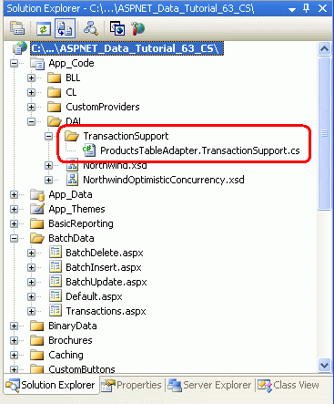
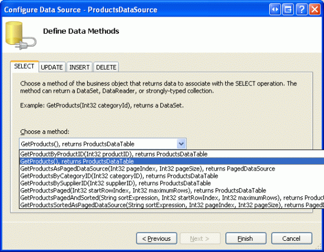
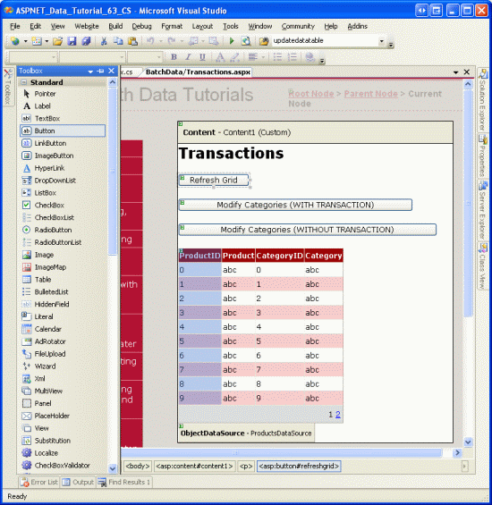
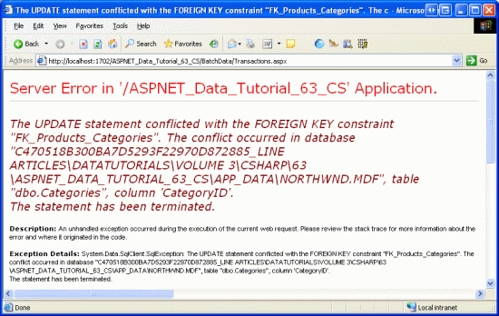
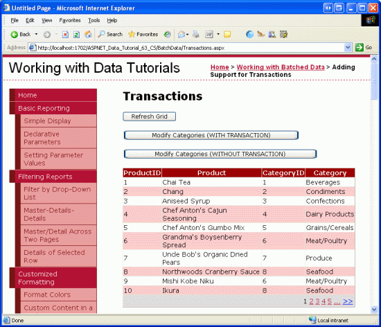

Wrapping Database Modifications within a Transaction (C#)
====================
by [Scott Mitchell](https://twitter.com/ScottOnWriting)

[Download Code](http://download.microsoft.com/download/3/9/f/39f92b37-e92e-4ab3-909e-b4ef23d01aa3/ASPNET_Data_Tutorial_63_CS.zip) or [Download PDF](wrapping-database-modifications-within-a-transaction-cs/_static/datatutorial63cs1.pdf)

> This tutorial is the first of four that looks at updating, deleting, and inserting batches of data. In this tutorial we learn how database transactions allow batch modifications to be carried out as an atomic operation, which ensures that either all steps succeed or all steps fail.

## Introduction

As we saw starting with the [An Overview of Inserting, Updating, and Deleting Data](../editing-inserting-and-deleting-data/an-overview-of-inserting-updating-and-deleting-data-cs.md) tutorial, the GridView provides built-in support for row-level editing and deleting. With a few clicks of the mouse it is possible to create a rich data modification interface without writing a line of code, so long as you are content with editing and deleting on a per-row basis. However, in certain scenarios this is insufficient and we need to provide users with the ability to edit or delete a batch of records.

For example, most web-based email clients use a grid to list each message where each row includes a checkbox along with the email s information (subject, sender, and so forth). This interface permits the user to delete multiple messages by checking them and then clicking a Delete Selected Messages button. A batch editing interface is ideal in situations where users commonly edit many different records. Rather than forcing the user to click Edit, make their change, and then click Update for each record that needs to be modified, a batch editing interface renders each row with its editing interface. The user can quickly modify the set of rows that need to be changed and then save these changes by clicking an Update All button. In this set of tutorials we'll examine how to create interfaces for inserting, editing, and deleting batches of data.

When performing batch operations it s important to determine whether it should be possible for some of the operations in the batch to succeed while others fail. Consider a batch deleting interface - what should happen if the first selected record is deleted successfully, but the second one fails, say, because of a foreign key constraint violation? Should the first record s delete be rolled back or is it acceptable for the first record to remain deleted?

If you want the batch operation to be treated as an [atomic operation](http://en.wikipedia.org/wiki/Atomic_operation), one where either all of the steps succeed or all of the steps fail, then the Data Access Layer needs to be augmented to include support for [database transactions](http://en.wikipedia.org/wiki/Database_transaction). Database transactions guarantee atomicity for the set of `INSERT`, `UPDATE`, and `DELETE` statements executed under the umbrella of the transaction and are a feature supported by most all modern database systems.

In this tutorial we'll look at how to extend the DAL to use database transactions. Subsequent tutorials will examine implementing web pages for batch inserting, updating, and deleting interfaces. Let s get started!

> [!NOTE]
> When modifying data in a batch transaction, atomicity is not always needed. In some scenarios, it may be acceptable to have some data modifications succeed and others in the same batch fail, such as when deleting a set of emails from a web-based email client. If there s a database error midway through the deletion process, it s probably acceptable that those records processed without error remain deleted. In such cases, the DAL does not need to be modified to support database transactions. There are other batch operation scenarios, however, where atomicity is vital. When a customer moves her funds from one bank account to another, two operations must be performed: the funds must be deducted from the first account and then added to the second. While the bank may not mind having the first step succeed but the second step fail, its customers would understandably be upset. I encourage you to work through this tutorial and implement the enhancements to the DAL to support database transactions even if you do not plan on using them in the batch inserting, updating, and deleting interfaces we'll be building in the following three tutorials.

## An Overview of Transactions

Most databases include support for *transactions*, which enable multiple database commands to be grouped into a single logical unit of work. The database commands that comprise a transaction are guaranteed to be atomic, meaning that either all commands will fail or all will succeed.

In general, transactions are implemented through SQL statements using the following pattern:

1. Indicate the start of a transaction.
2. Execute the SQL statements that comprise the transaction.
3. If there is an error in one of the statements from Step 2, rollback the transaction.
4. If all of the statements from Step 2 complete without error, commit the transaction.

The SQL statements used to create, commit, and roll back the transaction can be entered manually when writing SQL scripts or creating stored procedures, or through programmatic means using either ADO.NET or the classes in the [`System.Transactions` namespace](https://msdn.microsoft.com/en-us/library/system.transactions.aspx). In this tutorial we will only examine managing transactions using ADO.NET. In a future tutorial we will look at how to use stored procedures in the Data Access Layer, at which time we'll explore the SQL statements for creating, rolling back, and committing transactions. In the meantime, consult [Managing Transactions in SQL Server Stored Procedures](http://www.4guysfromrolla.com/webtech/080305-1.shtml) for more information.

> [!NOTE]
> The [`TransactionScope` class](https://msdn.microsoft.com/en-us/library/system.transactions.transactionscope.aspx) in the `System.Transactions` namespace enables developers to programmatically wrap a series of statements within the scope of a transaction and includes support for complex transactions that involve multiple sources, such as two different databases or even heterogeneous types of data stores, such as a Microsoft SQL Server database, an Oracle database, and a Web service. I ve decided to use ADO.NET transactions for this tutorial instead of the `TransactionScope` class because ADO.NET is more specific for database transactions and, in many cases, is far less resource intensive. In addition, under certain scenarios the `TransactionScope` class uses the Microsoft Distributed Transaction Coordinator (MSDTC). The configuration, implementation, and performance issues surrounding MSDTC makes it a rather specialized and advanced topic and beyond the scope of these tutorials.

When working with the SqlClient provider in ADO.NET, transactions are initiated through a call to the [`SqlConnection` class](https://msdn.microsoft.com/en-US/library/system.data.sqlclient.sqlconnection.aspx) s [`BeginTransaction` method](https://msdn.microsoft.com/en-us/library/system.data.sqlclient.sqlconnection.begintransaction.aspx), which returns a [`SqlTransaction` object](https://msdn.microsoft.com/en-US/library/system.data.sqlclient.sqltransaction.aspx). The data modification statements that makeup the transaction are placed within a `try...catch` block. If an error occurs in a statement in the `try` block, execution transfers to the `catch` block where the transaction can be rolled back via the `SqlTransaction` object s [`Rollback` method](https://msdn.microsoft.com/en-us/library/system.data.sqlclient.sqltransaction.rollback.aspx). If all of the statements complete successfully, a call to the `SqlTransaction` object s [`Commit` method](https://msdn.microsoft.com/en-us/library/system.data.sqlclient.sqltransaction.commit.aspx) at the end of the `try` block commits the transaction. The following code snippet illustrates this pattern. See [Maintaining Database Consistency with Transactions](http://aspnet.4guysfromrolla.com/articles/072705-1.aspx) for additional syntax and examples of using transactions with ADO.NET.

[!code-csharp[Main](wrapping-database-modifications-within-a-transaction-cs/samples/sample1.cs)]

By default, the TableAdapters in a Typed DataSet do not use transactions. To provide support for transactions we need to augment the TableAdapter classes to include additional methods that use the above pattern to perform a series of data modification statements within the scope of a transaction. In Step 2 we'll see how to use partial classes to add these methods.

## Step 1: Creating the Working with Batched Data Web Pages

Before we start exploring how to augment the DAL to support database transactions, let s first take a moment to create the ASP.NET web pages that we will need for this tutorial and the three that follow. Start by adding a new folder named `BatchData` and then add the following ASP.NET pages, associating each page with the `Site.master` master page.

- `Default.aspx`
- `Transactions.aspx`
- `BatchUpdate.aspx`
- `BatchDelete.aspx`
- `BatchInsert.aspx`

**Figure 1**: Add the ASP.NET Pages for the SqlDataSource-Related Tutorials

As with the other folders, `Default.aspx` will use the `SectionLevelTutorialListing.ascx` User Control to list the tutorials within its section. Therefore, add this User Control to `Default.aspx` by dragging it from the Solution Explorer onto the page s Design view.

**Figure 2**: Add the `SectionLevelTutorialListing.ascx` User Control to `Default.aspx` ([Click to view full-size image](wrapping-database-modifications-within-a-transaction-cs/_static/image2.png))

Lastly, add these four pages as entries to the `Web.sitemap` file. Specifically, add the following markup after the Customizing the Site Map `<siteMapNode>`:

[!code-xml[Main](wrapping-database-modifications-within-a-transaction-cs/samples/sample2.xml)]

After updating `Web.sitemap`, take a moment to view the tutorials website through a browser. The menu on the left now includes items for the working with batched data tutorials.

**Figure 3**: The Site Map Now Includes Entries for the Working with Batched Data Tutorials

## Step 2: Updating the Data Access Layer to Support Database Transactions

As we discussed back in the first tutorial, [Creating a Data Access Layer](../introduction/creating-a-data-access-layer-cs.md), the Typed DataSet in our DAL is composed of DataTables and TableAdapters. The DataTables hold data while the TableAdapters provide the functionality to read data from the database into the DataTables, to update the database with changes made to the DataTables, and so forth. Recall that the TableAdapters provide two patterns for updating data, which I referred to as Batch Update and DB-Direct. With the Batch Update pattern, the TableAdapter is passed a DataSet, DataTable, or collection of DataRows. This data is enumerated and for each inserted, modified, or deleted row, the `InsertCommand`, `UpdateCommand`, or `DeleteCommand` is executed. With the DB-Direct pattern, the TableAdapter is instead passed the values of the columns necessary for inserting, updating, or deleting a single record. The DB Direct pattern method then uses those passed-in values to execute the appropriate `InsertCommand`, `UpdateCommand`, or `DeleteCommand` statement.

Regardless of the update pattern used, the TableAdapters auto-generated methods do not use transactions. By default each insert, update, or delete performed by the TableAdapter is treated as a single discrete operation. For instance, imagine that the DB-Direct pattern is used by some code in the BLL to insert ten records into the database. This code would call the TableAdapter s `Insert` method ten times. If the first five inserts succeed, but the sixth one resulted in an exception, the first five inserted records would remain in the database. Similarly, if the Batch Update pattern is used to perform inserts, updates, and deletes to the inserted, modified, and deleted rows in a DataTable, if the first several modifications succeeded but a later one encountered an error, those earlier modifications that completed would remain in the database.

In certain scenarios we want to ensure atomicity across a series of modifications. To accomplish this we must manually extend the TableAdapter by adding new methods that execute the `InsertCommand`, `UpdateCommand`, and `DeleteCommand` s under the umbrella of a transaction. In [Creating a Data Access Layer](../introduction/creating-a-data-access-layer-cs.md) we looked at using [partial classes](http://en.wikipedia.org/wiki/Partial_type) to extend the functionality of the DataTables within the Typed DataSet. This technique can also be used with TableAdapters.

The Typed DataSet `Northwind.xsd` is located in the `App_Code` folder s `DAL` subfolder. Create a subfolder in the `DAL` folder named `TransactionSupport` and add a new class file named `ProductsTableAdapter.TransactionSupport.cs` (see Figure 4). This file will hold the partial implementation of the `ProductsTableAdapter` that includes methods for performing data modifications using a transaction.

**Figure 4**: Add a Folder Named `TransactionSupport` and a Class File Named `ProductsTableAdapter.TransactionSupport.cs`

Enter the following code into the `ProductsTableAdapter.TransactionSupport.cs` file:

[!code-csharp[Main](wrapping-database-modifications-within-a-transaction-cs/samples/sample3.cs)]

The `partial` keyword in the class declaration here indicates to the compiler that the members added within are to be added to the `ProductsTableAdapter` class in the `NorthwindTableAdapters` namespace. Note the `using System.Data.SqlClient` statement at the top of the file. Since the TableAdapter was configured to use the SqlClient provider, internally it uses a [`SqlDataAdapter`](https://msdn.microsoft.com/en-us/library/system.data.sqlclient.sqldataadapter.aspx) object to issue its commands to the database. Consequently, we need to use the `SqlTransaction` class to begin the transaction and then to commit it or roll it back. If you are using a data store other than Microsoft SQL Server, you'll need to use the appropriate provider.

These methods provide the building blocks needed to start, rollback, and commit a transaction. They are marked `public`, enabling them to be used from within the `ProductsTableAdapter`, from another class in the DAL, or from another layer in the architecture, such as the BLL. `BeginTransaction` opens the TableAdapter s internal `SqlConnection` (if needed), begins the transaction and assigns it to the `Transaction` property, and attaches the transaction to the internal `SqlDataAdapter` s `SqlCommand` objects. `CommitTransaction` and `RollbackTransaction` call the `Transaction` object s `Commit` and `Rollback` methods, respectively, before closing the internal `Connection` object.

## Step 3: Adding Methods to Update and Delete Data Under the Umbrella of a Transaction

With these methods complete, we re ready to add methods to `ProductsDataTable` or the BLL that perform a series of commands under the umbrella of a transaction. The following method uses the Batch Update pattern to update a `ProductsDataTable` instance using a transaction. It starts a transaction by calling the `BeginTransaction` method and then uses a `try...catch` block to issue the data modification statements. If the call to the `Adapter` object s `Update` method results in an exception, execution will transfer to the `catch` block where the transaction will be rolled back and the exception re-thrown. Recall that the `Update` method implements the Batch Update pattern by enumerating the rows of the supplied `ProductsDataTable` and performing the necessary `InsertCommand`, `UpdateCommand`, and `DeleteCommand` s. If any one of these commands results in an error, the transaction is rolled back, undoing the previous modifications made during the transaction s lifetime. Should the `Update` statement complete without error, the transaction is committed in its entirety.

[!code-csharp[Main](wrapping-database-modifications-within-a-transaction-cs/samples/sample4.cs)]

Add the `UpdateWithTransaction` method to the `ProductsTableAdapter` class through the partial class in `ProductsTableAdapter.TransactionSupport.cs`. Alternatively, this method could be added to the Business Logic Layer s `ProductsBLL` class with a few minor syntactical changes. Namely, the keyword this in `this.BeginTransaction()`, `this.CommitTransaction()`, and `this.RollbackTransaction()` would need to be replaced with `Adapter` (recall that `Adapter` is the name of a property in `ProductsBLL` of type `ProductsTableAdapter`).

The `UpdateWithTransaction` method uses the Batch Update pattern, but a series of DB-Direct calls can also be used within the scope of a transaction, as the following method shows. The `DeleteProductsWithTransaction` method accepts as input a `List<T>` of type `int`, which are the `ProductID` s to delete. The method initiates the transaction via a call to `BeginTransaction` and then, in the `try` block, iterates through the supplied list calling the DB-Direct pattern `Delete` method for each `ProductID` value. If any of the calls to `Delete` fails, control is transferred to the `catch` block where the transaction is rolled back and the exception re-thrown. If all calls to `Delete` succeed, then transaction is committed. Add this method to the `ProductsBLL` class.

[!code-csharp[Main](wrapping-database-modifications-within-a-transaction-cs/samples/sample5.cs)]

## Applying Transactions Across Multiple TableAdapters

The transaction-related code examined in this tutorial allows for multiple statements against the `ProductsTableAdapter` to be treated as an atomic operation. But what if multiple modifications to different database tables need to be performed atomically? For instance, when deleting a category, we might first want to reassign its current products to some other category. These two steps reassigning the products and deleting the category should be executed as an atomic operation. But the `ProductsTableAdapter` includes only methods for modifying the `Products` table and the `CategoriesTableAdapter` includes only methods for modifying the `Categories` table. So how can a transaction encompass both TableAdapters?

One option is to add a method to the `CategoriesTableAdapter` named `DeleteCategoryAndReassignProducts(categoryIDtoDelete, reassignToCategoryID)` and have that method call a stored procedure that both reassigns the products and deletes the category within the scope of a transaction defined within the stored procedure. We'll look at how to begin, commit, and rollback transactions in stored procedures in a future tutorial.

Another option is to create a helper class in the DAL that contains the `DeleteCategoryAndReassignProducts(categoryIDtoDelete, reassignToCategoryID)` method. This method would create an instance of the `CategoriesTableAdapter` and the `ProductsTableAdapter` and then set these two TableAdapters `Connection` properties to the same `SqlConnection` instance. At that point, either one of the two TableAdapters would initiate the transaction with a call to `BeginTransaction`. The TableAdapters methods for reassigning the products and deleting the category would be invoked in a `try...catch` block with the transaction committed or rolled back as needed.

## Step 4: Adding the`UpdateWithTransaction`Method to the Business Logic Layer

In Step 3 we added an `UpdateWithTransaction` method to the `ProductsTableAdapter` in the DAL. We should add a corresponding method to the BLL. While the Presentation Layer could call directly down to the DAL to invoke the `UpdateWithTransaction` method, these tutorials have strived to define a layered architecture that insulates the DAL from the Presentation Layer. Therefore, it behooves us to continue this approach.

Open the `ProductsBLL` class file and add a method named `UpdateWithTransaction` that simply calls down to the corresponding DAL method. There should now be two new methods in `ProductsBLL`: `UpdateWithTransaction`, which you just added, and `DeleteProductsWithTransaction`, which was added in Step 3.

[!code-csharp[Main](wrapping-database-modifications-within-a-transaction-cs/samples/sample6.cs)]

> [!NOTE]
> These methods do not include the `DataObjectMethodAttribute` attribute assigned to most other methods in the `ProductsBLL` class because we'll be invoking these methods directly from the ASP.NET pages code-behind classes. Recall that `DataObjectMethodAttribute` is used to flag what methods should appear in the ObjectDataSource s Configure Data Source wizard and under what tab (SELECT, UPDATE, INSERT, or DELETE). Since the GridView lacks any built-in support for batch editing or deleting, we'll have to invoke these methods programmatically rather than use the code-free declarative approach.

## Step 5: Atomically Updating Database Data from the Presentation Layer

To illustrate the effect that the transaction has when updating a batch of records, let s create a user interface that lists all products in a GridView and includes a Button Web control that, when clicked, reassigns the products `CategoryID` values. In particular, the category reassignment will progress so that the first several products are assigned a valid `CategoryID` value while others are purposefully assigned a non-existent `CategoryID` value. If we attempt to update the database with a product whose `CategoryID` does not match an existing category s `CategoryID`, a foreign key constraint violation will occur and an exception will be raised. What we'll see in this example is that when using a transaction the exception raised from the foreign key constraint violation will cause the previous valid `CategoryID` changes to be rolled back. When not using a transaction, however, the modifications to the initial categories will remain.

Start by opening the `Transactions.aspx` page in the `BatchData` folder and drag a GridView from the Toolbox onto the Designer. Set its `ID` to `Products` and, from its smart tag, bind it to a new ObjectDataSource named `ProductsDataSource`. Configure the ObjectDataSource to pull its data from the `ProductsBLL` class s `GetProducts` method. This will be a read-only GridView, so set the drop-down lists in the UPDATE, INSERT, and DELETE tabs to (None) and click Finish.

**Figure 5**: Figure 5: Configure the ObjectDataSource to Use the `ProductsBLL` Class s `GetProducts` Method ([Click to view full-size image](wrapping-database-modifications-within-a-transaction-cs/_static/image4.png))

**Figure 6**: Set the Drop-Down Lists in the UPDATE, INSERT, and DELETE Tabs to (None) ([Click to view full-size image](wrapping-database-modifications-within-a-transaction-cs/_static/image6.png))

After completing the Configure Data Source wizard, Visual Studio will create BoundFields and a CheckBoxField for the product data fields. Remove all of these fields except for `ProductID`, `ProductName`, `CategoryID`, and `CategoryName` and rename the `ProductName` and `CategoryName` BoundFields `HeaderText` properties to Product and Category, respectively. From the smart tag, check the Enable Paging option. After making these modifications, the GridView and ObjectDataSource s declarative markup should look like the following:

[!code-aspx[Main](wrapping-database-modifications-within-a-transaction-cs/samples/sample7.aspx)]

Next, add three Button Web controls above the GridView. Set the first Button s Text property to Refresh Grid, the second s to Modify Categories (WITH TRANSACTION), and the third one s to Modify Categories (WITHOUT TRANSACTION) .

[!code-aspx[Main](wrapping-database-modifications-within-a-transaction-cs/samples/sample8.aspx)]

At this point the Design view in Visual Studio should look similar to the screen shot shown in Figure 7.

**Figure 7**: The Page Contains a GridView and Three Button Web Controls ([Click to view full-size image](wrapping-database-modifications-within-a-transaction-cs/_static/image8.png))

Create event handlers for each of the three Button s `Click` events and use the following code:

[!code-csharp[Main](wrapping-database-modifications-within-a-transaction-cs/samples/sample9.cs)]

The refresh Button s `Click` event handler simply rebinds the data to the GridView by calling the `Products` GridView s `DataBind` method.

The second event handler reassigns the products `CategoryID` s and uses the new transaction method from the BLL to perform the database updates under the umbrella of a transaction. Note that each product s `CategoryID` is arbitrarily set to the same value as its `ProductID`. This will work fine for the first few products, since those products have `ProductID` values that happen to map to valid `CategoryID` s. But once the `ProductID` s start getting too large, this coincidental overlap of `ProductID` s and `CategoryID` s no longer applies.

The third `Click` event handler updates the products `CategoryID` s in the same manner, but sends the update to the database using the `ProductsTableAdapter` s default `Update` method. This `Update` method does not wrap the series of commands within a transaction, so those changes are made prior to the first encountered foreign key constraint violation error will persist.

To demonstrate this behavior, visit this page through a browser. Initially you should see the first page of data as shown in Figure 8. Next, click the Modify Categories (WITH TRANSACTION) button. This will cause a postback and attempt to update all of the products `CategoryID` values, but will result in a foreign key constraint violation (see Figure 9).

**Figure 8**: The Products are Displayed in a Pageable GridView ([Click to view full-size image](wrapping-database-modifications-within-a-transaction-cs/_static/image10.png))

**Figure 9**: Reassigning the Categories Results in a Foreign Key Constraint Violation ([Click to view full-size image](wrapping-database-modifications-within-a-transaction-cs/_static/image12.png))

Now hit your browser s Back button and then click the Refresh Grid button. Upon refreshing the data you should see the exact same output as shown in Figure 8. That is, even though some of the products `CategoryID` s were changed to legal values and updated in the database, they were rolled back when the foreign key constraint violation occurred.

Now try clicking the Modify Categories (WITHOUT TRANSACTION) button. This will result in the same foreign key constraint violation error (see Figure 9), but this time those products whose `CategoryID` values were changed to a legal value will not be rolled back. Hit your browser s Back button and then the Refresh Grid button. As Figure 10 shows, the `CategoryID` s of the first eight products have been reassigned. For example, in Figure 8, Chang had a `CategoryID` of 1, but in Figure 10 it s been reassigned to 2.

**Figure 10**: Some Products `CategoryID` Values were Updated While Others Were Not ([Click to view full-size image](wrapping-database-modifications-within-a-transaction-cs/_static/image14.png))

## Summary

By default, the TableAdapter s methods do not wrap the executed database statements within the scope of a transaction, but with a little work we can add methods that will create, commit, and rollback a transaction. In this tutorial we created three such methods in the `ProductsTableAdapter` class: `BeginTransaction`, `CommitTransaction`, and `RollbackTransaction`. We saw how to use these methods along with a `try...catch` block to make a series of data modification statements atomic. In particular, we created the `UpdateWithTransaction` method in the `ProductsTableAdapter`, which uses the Batch Update pattern to perform the necessary modifications to the rows of a supplied `ProductsDataTable`. We also added the `DeleteProductsWithTransaction` method to the `ProductsBLL` class in the BLL, which accepts a `List` of `ProductID` values as its input and calls the DB-Direct pattern method `Delete` for each `ProductID`. Both methods start by creating a transaction and then executing the data modification statements within a `try...catch` block. If an exception occurs, the transaction is rolled back, otherwise it is committed.

Step 5 illustrated the effect of transactional batch updates versus batch updates that neglected to use a transaction. In the next three tutorials we will build upon the foundation laid in this tutorial and create user interfaces for performing batch updates, deletes, and inserts.

Happy Programming!

## Further Reading

For more information on the topics discussed in this tutorial, refer to the following resources:

- [Maintaining Database Consistency with Transactions](http://aspnet.4guysfromrolla.com/articles/072705-1.aspx)
- [Managing Transactions in SQL Server Stored Procedures](http://www.4guysfromrolla.com/webtech/080305-1.shtml)
- [Transactions Made Easy: `System.Transactions`](https://blogs.msdn.com/florinlazar/archive/2004/07/23/192239.aspx)
- [TransactionScope and DataAdapters](http://andyclymer.blogspot.com/2007/01/transactionscope-and-dataadapters.html)
- [Using Oracle Database Transactions in .NET](http://www.oracle.com/technology/pub/articles/price_dbtrans_dotnet.html)

## About the Author

[Scott Mitchell](http://www.4guysfromrolla.com/ScottMitchell.shtml), author of seven ASP/ASP.NET books and founder of [4GuysFromRolla.com](http://www.4guysfromrolla.com), has been working with Microsoft Web technologies since 1998. Scott works as an independent consultant, trainer, and writer. His latest book is [*Sams Teach Yourself ASP.NET 2.0 in 24 Hours*](https://www.amazon.com/exec/obidos/ASIN/0672327384/4guysfromrollaco). He can be reached at [mitchell@4GuysFromRolla.com.](mailto:mitchell@4GuysFromRolla.com) or via his blog, which can be found at [http://ScottOnWriting.NET](http://ScottOnWriting.NET).

## Special Thanks To

This tutorial series was reviewed by many helpful reviewers. Lead reviewers for this tutorial were Dave Gardner, Hilton Giesenow, and Teresa Murphy. Interested in reviewing my upcoming MSDN articles? If so, drop me a line at [mitchell@4GuysFromRolla.com.](mailto:mitchell@4GuysFromRolla.com)

>[!div class="step-by-step"]
[Next](batch-updating-cs.md)