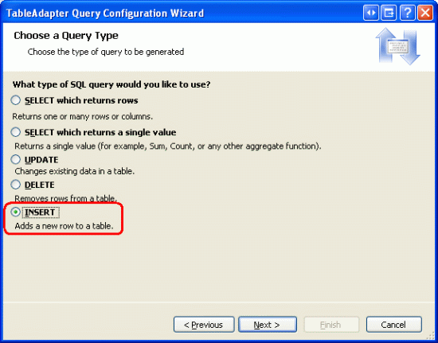
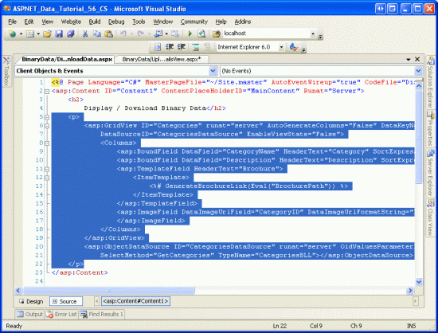
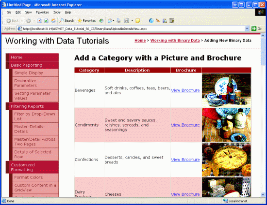
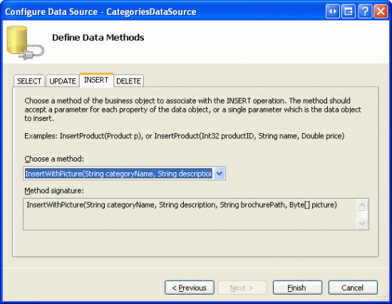
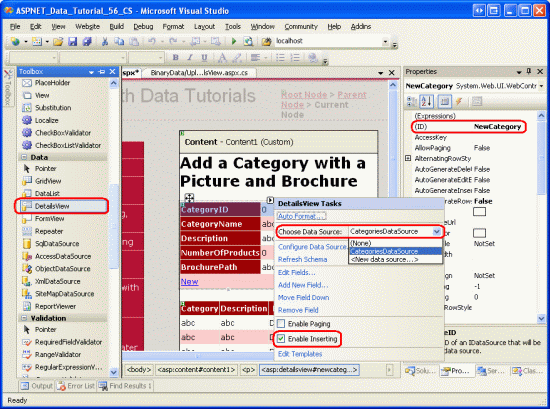
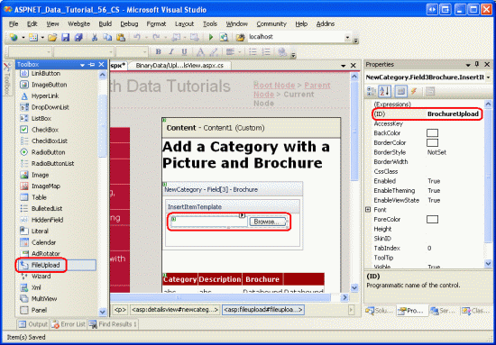
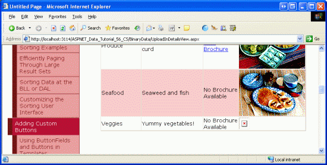

Including a File Upload Option When Adding a New Record (VB)
====================
by [Scott Mitchell](https://twitter.com/ScottOnWriting)

[Download Sample App](http://download.microsoft.com/download/4/a/7/4a7a3b18-d80e-4014-8e53-a6a2427f0d93/ASPNET_Data_Tutorial_56_VB.exe) or [Download PDF](including-a-file-upload-option-when-adding-a-new-record-vb/_static/datatutorial56vb1.pdf)

> This tutorial shows how to create a Web interface that allows the user to both enter text data and upload binary files. To illustrate the options available to store binary data, one file will be saved in the database while the other is stored in the file system.

## Introduction

In the previous two tutorials we explored techniques for storing binary data that is associated with the application s data model, looked at how to use the FileUpload control to send files from the client to the web server, and saw how to present this binary data in a data Web control. We ve yet to talk about how to associate uploaded data with the data model, though.

In this tutorial we will create a web page to add a new category. In addition to TextBoxes for the category s name and description, this page will need to include two FileUpload controls one for the new category s picture and one for the brochure. The uploaded picture will be stored directly in the new record s `Picture` column, whereas the brochure will be saved to the `~/Brochures` folder with the path to the file saved in the new record s `BrochurePath` column.

Before creating this new web page, we'll need to update the architecture. The `CategoriesTableAdapter` s main query does not retrieve the `Picture` column. Consequently, the auto-generated `Insert` method only has inputs for the `CategoryName`, `Description`, and `BrochurePath` fields. Therefore, we need to create an additional method in the TableAdapter that prompts for all four `Categories` fields. The `CategoriesBLL` class in the Business Logic Layer will also need to be updated.

## Step 1: Adding an`InsertWithPicture`Method to the`CategoriesTableAdapter`

When we created the `CategoriesTableAdapter` back in the [Creating a Data Access Layer](../introduction/creating-a-data-access-layer-vb.md) tutorial, we configured it to automatically generate `INSERT`, `UPDATE`, and `DELETE` statements based on the main query. Moreover, we instructed the TableAdapter to employ the DB Direct approach, which created the methods `Insert`, `Update`, and `Delete`. These methods execute the auto-generated `INSERT`, `UPDATE`, and `DELETE` statements and, consequently, accept input parameters based on the columns returned by the main query. In the [Uploading Files](uploading-files-vb.md) tutorial we augmented the `CategoriesTableAdapter` s main query to use the `BrochurePath` column.

Since the `CategoriesTableAdapter` s main query does not reference the `Picture` column, we can neither add a new record nor update an existing record with a value for the `Picture` column. In order to capture this information, we can either create a new method in the TableAdapter that is used specifically to insert a record with binary data or we can customize the auto-generated `INSERT` statement. The problem with customizing the auto-generated `INSERT` statement is that we risk having our customizations overwritten by the wizard. For example, imagine that we customized the `INSERT` statement to include use of the `Picture` column. This would update the TableAdapter s `Insert` method to include an additional input parameter for the category s picture s binary data. We could then create a method in the Business Logic Layer to use this DAL method and invoke this BLL method through the Presentation Layer, and everything would work wonderfully. That is, until the next time we configured the TableAdapter through the TableAdapter Configuration wizard. As soon as the wizard completed, our customizations to the `INSERT` statement would be overwritten, the `Insert` method would revert to its old form, and our code would no longer compile!

> [!NOTE]
> This annoyance is a non-issue when using stored procedures instead of ad-hoc SQL statements. A future tutorial will explore using stored procedures in lieu of ad-hoc SQL statements in the Data Access Layer.

To avoid this potential headache, rather than customizing the auto-generated SQL statements let s instead create a new method for the TableAdapter. This method, named `InsertWithPicture`, will accept values for the `CategoryName`, `Description`, `BrochurePath`, and `Picture` columns and execute an `INSERT` statement that stores all four values in a new record.

Open the Typed DataSet and, from the Designer, right-click on the `CategoriesTableAdapter` s header and choose Add Query from the context menu. This launches the TableAdapter Query Configuration Wizard, which begins by asking us how the TableAdapter query should access the database. Choose Use SQL statements and click Next. The next step prompts for the type of query to be generated. Since we re creating a query to add a new record to the `Categories` table, choose INSERT and click Next.

**Figure 1**: Select the INSERT Option ([Click to view full-size image](including-a-file-upload-option-when-adding-a-new-record-vb/_static/image2.png))

We now need to specify the `INSERT` SQL statement. The wizard automatically suggests an `INSERT` statement corresponding to the TableAdapter s main query. In this case, it s an `INSERT` statement that inserts the `CategoryName`, `Description`, and `BrochurePath` values. Update the statement so that the `Picture` column is included along with a `@Picture` parameter, like so:

[!code-sql[Main](including-a-file-upload-option-when-adding-a-new-record-vb/samples/sample1.sql)]

The final screen of the wizard asks us to name the new TableAdapter method. Enter `InsertWithPicture` and click Finish.

**Figure 2**: Name the New TableAdapter Method `InsertWithPicture` ([Click to view full-size image](including-a-file-upload-option-when-adding-a-new-record-vb/_static/image4.png))

## Step 2: Updating the Business Logic Layer

Since the Presentation Layer should only interface with the Business Logic Layer rather than bypassing it to go directly to the Data Access Layer, we need to create a BLL method that invokes the DAL method we just created (`InsertWithPicture`). For this tutorial, create a method in the `CategoriesBLL` class named `InsertWithPicture` that accepts as input three `String` s and a `Byte` array. The `String` input parameters are for the category s name, description, and brochure file path, while the `Byte` array is for the binary contents of the category s picture. As the following code shows, this BLL method invokes the corresponding DAL method:

[!code-vb[Main](including-a-file-upload-option-when-adding-a-new-record-vb/samples/sample2.vb)]

> [!NOTE]
> Make sure that you have saved the Typed DataSet before adding the `InsertWithPicture` method to the BLL. Since the `CategoriesTableAdapter` class code is auto-generated based on the Typed DataSet, if you don t first save your changes to the Typed DataSet the `Adapter` property won t know about the `InsertWithPicture` method.

## Step 3: Listing the Existing Categories and their Binary Data

In this tutorial we will create a page that allows an end user to add a new category to the system, providing a picture and brochure for the new category. In the [preceding tutorial](displaying-binary-data-in-the-data-web-controls-vb.md) we used a GridView with a TemplateField and ImageField to display each category s name, description, picture, and a link to download its brochure. Let s replicate that functionality for this tutorial, creating a page that both lists all existing categories and allows for new ones to be created.

Start by opening the `DisplayOrDownload.aspx` page from the `BinaryData` folder. Go to the Source view and copy the GridView and ObjectDataSource s declarative syntax, pasting it within the `<asp:Content>` element in `UploadInDetailsView.aspx`. Also, don t forget to copy over the `GenerateBrochureLink` method from the code-behind class of `DisplayOrDownload.aspx` to `UploadInDetailsView.aspx`.

**Figure 3**: Copy and Paste the Declarative Syntax from `DisplayOrDownload.aspx` to `UploadInDetailsView.aspx` ([Click to view full-size image](including-a-file-upload-option-when-adding-a-new-record-vb/_static/image6.png))

After copying the declarative syntax and `GenerateBrochureLink` method over to the `UploadInDetailsView.aspx` page, view the page through a browser to ensure that everything was copied over correctly. You should see a GridView listing the eight categories that includes a link to download the brochure as well as the category s picture.

**Figure 4**: You Should Now See Each Category Along with Its Binary Data ([Click to view full-size image](including-a-file-upload-option-when-adding-a-new-record-vb/_static/image8.png))

## Step 4: Configuring the`CategoriesDataSource`to Support Inserting

The `CategoriesDataSource` ObjectDataSource used by the `Categories` GridView currently does not provide the ability to insert data. In order to support inserting through this data source control, we need to map its `Insert` method to a method in its underlying object, `CategoriesBLL`. In particular, we want to map it to the `CategoriesBLL` method we added back in Step 2, `InsertWithPicture`.

Start by clicking the Configure Data Source link from the ObjectDataSource s smart tag. The first screen shows the object the data source is configured to work with, `CategoriesBLL`. Leave this setting as-is and click Next to advance to the Define Data Methods screen. Move to the INSERT tab and pick the `InsertWithPicture` method from the drop-down list. Click Finish to complete the wizard.

**Figure 5**: Configure the ObjectDataSource to use the `InsertWithPicture` Method ([Click to view full-size image](including-a-file-upload-option-when-adding-a-new-record-vb/_static/image10.png))

> [!NOTE]
> Upon completing the wizard, Visual Studio may ask if you want to Refresh Fields and Keys, which will regenerate the data Web controls fields. Choose No, because choosing Yes will overwrite any field customizations you may have made.

After completing the wizard, the ObjectDataSource will now include a value for its `InsertMethod` property as well as `InsertParameters` for the four category columns, as the following declarative markup illustrates:

[!code-aspx[Main](including-a-file-upload-option-when-adding-a-new-record-vb/samples/sample3.aspx)]

## Step 5: Creating the Inserting Interface

As first covered in the [An Overview of Inserting, Updating, and Deleting Data](../editing-inserting-and-deleting-data/an-overview-of-inserting-updating-and-deleting-data-vb.md), the DetailsView control provides a built-in inserting interface that can be utilized when working with a data source control that supports inserting. Let s add a DetailsView control to this page above the GridView that will permanently render its inserting interface, allowing a user to quickly add a new category. Upon adding a new category in the DetailsView, the GridView beneath it will automatically refresh and display the new category.

Start by dragging a DetailsView from the Toolbox onto the Designer above the GridView, setting its `ID` property to `NewCategory` and clearing out the `Height` and `Width` property values. From the DetailsView s smart tag, bind it to the existing `CategoriesDataSource` and then check the Enable Inserting checkbox.

**Figure 6**: Bind the DetailsView to the `CategoriesDataSource` and Enable Inserting ([Click to view full-size image](including-a-file-upload-option-when-adding-a-new-record-vb/_static/image12.png))

To permanently render the DetailsView in its inserting interface, set its `DefaultMode` property to `Insert`.

Note that the DetailsView has five BoundFields `CategoryID`, `CategoryName`, `Description`, `NumberOfProducts`, and `BrochurePath` although the `CategoryID` BoundField is not rendered in the inserting interface because its `InsertVisible` property is set to `False`. These BoundFields exists because they are the columns returned by the `GetCategories()` method, which is what the ObjectDataSource invokes to retrieve its data. For inserting, however, we don t want to let the user specify a value for `NumberOfProducts`. Moreover, we need to allow them to upload a picture for the new category as well as upload a PDF for the brochure.

Remove the `NumberOfProducts` BoundField from the DetailsView altogether and then update the `HeaderText` properties of the `CategoryName` and `BrochurePath` BoundFields to Category and Brochure, respectively. Next, convert the `BrochurePath` BoundField into a TemplateField and add a new TemplateField for the picture, giving this new TemplateField a `HeaderText` value of Picture. Move the `Picture` TemplateField so that it is between the `BrochurePath` TemplateField and CommandField.

**Figure 7**: Bind the DetailsView to the `CategoriesDataSource` and Enable Inserting

If you converted the `BrochurePath` BoundField into a TemplateField through the Edit Fields dialog box, the TemplateField includes an `ItemTemplate`, `EditItemTemplate`, and `InsertItemTemplate`. Only the `InsertItemTemplate` is needed, however, so feel free to remove the other two templates. At this point your DetailsView s declarative syntax should look like the following:

[!code-aspx[Main](including-a-file-upload-option-when-adding-a-new-record-vb/samples/sample4.aspx)]

## Adding FileUpload Controls for the Brochure and Picture Fields

Presently, the `BrochurePath` TemplateField s `InsertItemTemplate` contains a TextBox, while the `Picture` TemplateField does not contain any templates. We need to update these two TemplateField s `InsertItemTemplate` s to use FileUpload controls.

From the DetailsView s smart tag, choose the Edit Templates option and then select the `BrochurePath` TemplateField s `InsertItemTemplate` from the drop-down list. Remove the TextBox and then drag a FileUpload control from the Toolbox into the template. Set the FileUpload control s `ID` to `BrochureUpload`. Similarly, add a FileUpload control to the `Picture` TemplateField s `InsertItemTemplate`. Set this FileUpload control s `ID` to `PictureUpload`.

**Figure 8**: Add a FileUpload Control to the `InsertItemTemplate` ([Click to view full-size image](including-a-file-upload-option-when-adding-a-new-record-vb/_static/image14.png))

After making these additions, the two TemplateField s declarative syntax will be:

[!code-aspx[Main](including-a-file-upload-option-when-adding-a-new-record-vb/samples/sample5.aspx)]

When a user adds a new category, we want to ensure that the brochure and picture are of the correct file type. For the brochure, the user must supply a PDF. For the picture, we need the user to upload an image file, but do we allow *any* image file or only image files of a particular type, such as GIFs or JPGs? In order to allow for different file types, we d need to extend the `Categories` schema to include a column that captures the file type so that this type can be sent to the client through `Response.ContentType` in `DisplayCategoryPicture.aspx`. Since we don t have such a column, it would be prudent to restrict users to only providing a specific image file type. The `Categories` table s existing images are bitmaps, but JPGs are a more appropriate file format for images served over the web.

If a user uploads an incorrect file type, we need to cancel the insert and display a message indicating the problem. Add a Label Web control beneath the DetailsView. Set its `ID` property to `UploadWarning`, clear out its `Text` property, set the `CssClass` property to Warning, and the `Visible` and `EnableViewState` properties to `False`. The `Warning` CSS class is defined in `Styles.css` and renders the text in a large, red, italicized, bold font.

> [!NOTE]
> Ideally, the `CategoryName` and `Description` BoundFields would be converted to TemplateFields and their inserting interfaces customized. The `Description` inserting interface, for example, would likely be better suited through a multi-line textbox. And since the `CategoryName` column does not accept `NULL` values, a RequiredFieldValidator should be added to ensure the user provides a value for the new category s name. These steps are left as an exercise to the reader. Refer back to [Customizing the Data Modification Interface](../editing-inserting-and-deleting-data/customizing-the-data-modification-interface-vb.md) for an in-depth look at augmenting the data modification interfaces.

## Step 6: Saving the Uploaded Brochure to the Web Server s File System

When the user enters the values for a new category and clicks the Insert button, a postback occurs and the inserting workflow unfolds. First, the DetailsView s [`ItemInserting` event](https://msdn.microsoft.com/en-us/library/system.web.ui.webcontrols.detailsview.iteminserting.aspx) fires. Next, the ObjectDataSource s `Insert()` method is invoked, which results in a new record being added to the `Categories` table. After that, the DetailsView s [`ItemInserted` event](https://msdn.microsoft.com/en-us/library/system.web.ui.webcontrols.detailsview.iteminserted.aspx) fires.

Before the ObjectDataSource s `Insert()` method is invoked, we must first ensure that the appropriate file types were uploaded by the user and then save the brochure PDF to the web server s file system. Create an event handler for the DetailsView s `ItemInserting` event and add the following code:

[!code-vb[Main](including-a-file-upload-option-when-adding-a-new-record-vb/samples/sample6.vb)]

The event handler starts by referencing the `BrochureUpload` FileUpload control from the DetailsView s templates. Then, if a brochure has been uploaded, the uploaded file s extension is examined. If the extension is not .PDF, then a warning is displayed, the insert is cancelled, and the execution of the event handler ends.

> [!NOTE]
> Relying on the uploaded file s extension is not a sure-fire technique for ensuring that the uploaded file is a PDF document. The user could have a valid PDF document with the extension `.Brochure`, or could have taken a non-PDF document and given it a `.pdf` extension. The file s binary content would need to be programmatically examined in order to more conclusively verify the file type. Such thorough approaches, though, are often overkill; checking the extension is sufficient for most scenarios.

As discussed in the [Uploading Files](uploading-files-vb.md) tutorial, care must be taken when saving files to the file system so that one user s upload does not overwrite another s. For this tutorial we will attempt to use the same name as the uploaded file. If there already exists a file in the `~/Brochures` directory with that same file name, however, we'll append a number at the end until a unique name is found. For example, if the user uploads a brochure file named `Meats.pdf`, but there is already a file named `Meats.pdf` in the `~/Brochures` folder, we'll change the saved file name to `Meats-1.pdf`. If that exists, we'll try `Meats-2.pdf`, and so on, until a unique file name is found.

The following code uses the [`File.Exists(path)` method](https://msdn.microsoft.com/en-us/library/system.io.file.exists.aspx) to determine if a file already exists with the specified file name. If so, it continues to try new file names for the brochure until no conflict is found.

[!code-vb[Main](including-a-file-upload-option-when-adding-a-new-record-vb/samples/sample7.vb)]

Once a valid file name has been found, the file needs to be saved to the file system and the ObjectDataSource s `brochurePath``InsertParameter` value needs to be updated so that this file name is written to the database. As we saw back in the *Uploading Files* tutorial, the file can be saved using the FileUpload control s `SaveAs(path)` method. To update the ObjectDataSource s `brochurePath` parameter, use the `e.Values` collection.

[!code-vb[Main](including-a-file-upload-option-when-adding-a-new-record-vb/samples/sample8.vb)]

## Step 7: Saving the Uploaded Picture to the Database

To store the uploaded picture in the new `Categories` record, we need to assign the uploaded binary content to the ObjectDataSource s `picture` parameter in the DetailsView s `ItemInserting` event. Before we make this assignment, however, we need to first make sure that the uploaded picture is a JPG and not some other image type. As in Step 6, let s use the uploaded picture s file extension to ascertain its type.

While the `Categories` table allows `NULL` values for the `Picture` column, all categories currently have a picture. Let s force the user to provide a picture when adding a new category through this page. The following code checks to ensure that a picture has been uploaded and that it has an appropriate extension.

[!code-vb[Main](including-a-file-upload-option-when-adding-a-new-record-vb/samples/sample9.vb)]

This code should be placed *before* the code from Step 6 so that if there is a problem with the picture upload, the event handler will terminate before the brochure file is saved to the file system.

Assuming that an appropriate file has been uploaded, assign the uploaded binary content to the picture parameter s value with the following line of code:

[!code-vb[Main](including-a-file-upload-option-when-adding-a-new-record-vb/samples/sample10.vb)]

## The Complete`ItemInserting`Event Handler

For completeness, here is the `ItemInserting` event handler in its entirety:

[!code-vb[Main](including-a-file-upload-option-when-adding-a-new-record-vb/samples/sample11.vb)]

## Step 8: Fixing the`DisplayCategoryPicture.aspx`Page

Let s take a moment to test out the inserting interface and `ItemInserting` event handler that was created over the last few steps. Visit the `UploadInDetailsView.aspx` page through a browser and attempt to add a category, but omit the picture, or specify a non-JPG picture or a non-PDF brochure. In any of these cases, an error message will be displayed and the insert workflow cancelled.

**Figure 9**: A Warning Message is Displayed If an Invalid File Type is Uploaded ([Click to view full-size image](including-a-file-upload-option-when-adding-a-new-record-vb/_static/image16.png))

Once you have verified that the page requires a picture to be uploaded and won t accept non-PDF or non-JPG files, add a new category with a valid JPG picture, leaving the Brochure field empty. After clicking the Insert button, the page will postback and a new record will be added to the `Categories` table with the uploaded image s binary contents stored directly in the database. The GridView is updated and shows a row for the newly added category, but, as Figure 10 shows, the new category s picture is not rendered correctly.

**Figure 10**: The New Category s Picture is not Displayed ([Click to view full-size image](including-a-file-upload-option-when-adding-a-new-record-vb/_static/image18.png))

The reason the new picture is not displayed is because the `DisplayCategoryPicture.aspx` page that returns a specified category s picture is configured to process bitmaps that have an OLE header. This 78 byte header is stripped from the `Picture` column s binary contents before they are sent back to the client. But the JPG file we just uploaded for the new category does not have this OLE header; therefore, valid, necessary bytes are being removed from the image s binary data.

Since there are now both bitmaps with OLE headers and JPGs in the `Categories` table, we need to update `DisplayCategoryPicture.aspx` so that it does the OLE header stripping for the original eight categories and bypasses this stripping for the newer category records. In our next tutorial we'll examine how to update an existing record s image, and we'll update all of the old category pictures so that they are JPGs. For now, though, use the following code in `DisplayCategoryPicture.aspx` to strip the OLE headers only for those original eight categories:

[!code-vb[Main](including-a-file-upload-option-when-adding-a-new-record-vb/samples/sample12.vb)]

With this change, the JPG image is now rendered correctly in the GridView.

**Figure 11**: The JPG Images for New Categories are Correctly Rendered ([Click to view full-size image](including-a-file-upload-option-when-adding-a-new-record-vb/_static/image20.png))

## Step 9: Deleting the Brochure in the Face of an Exception

One of the challenges of storing binary data on the web server s file system is that it introduces a disconnect between the data model and its binary data. Therefore, whenever a record is deleted, the corresponding binary data on the file system must also be removed. This can come into play when inserting, as well. Consider the following scenario: a user adds a new category, specifying a valid picture and brochure. Upon clicking the Insert button, a postback occurs and the DetailsView s `ItemInserting` event fires, saving the brochure to the web server s file system. Next, the ObjectDataSource s `Insert()` method is invoked, which calls the `CategoriesBLL` class s `InsertWithPicture` method, which calls the `CategoriesTableAdapter` s `InsertWithPicture` method.

Now, what happens if the database is offline, or if there is an error in the `INSERT` SQL statement? Clearly the INSERT will fail, so no new category row will be added to the database. But we still have the uploaded brochure file sitting on the web server s file system! This file needs to be deleted in the face of an exception during the inserting workflow.

As discussed previously in the [Handling BLL- and DAL-Level Exceptions in an ASP.NET Page](../editing-inserting-and-deleting-data/handling-bll-and-dal-level-exceptions-in-an-asp-net-page-vb.md) tutorial, when an exception is thrown from within the depths of the architecture it is bubbled up through the various layers. At the Presentation Layer, we can determine if an exception has occurred from the DetailsView s `ItemInserted` event. This event handler also provides the values of the ObjectDataSource s `InsertParameters`. Therefore, we can create an event handler for the `ItemInserted` event that checks if there was an exception and, if so, deletes the file specified by the ObjectDataSource s `brochurePath` parameter:

[!code-vb[Main](including-a-file-upload-option-when-adding-a-new-record-vb/samples/sample13.vb)]

## Summary

There are a number of steps that must be performed in order to provide a web-based interface for adding records that include binary data. If the binary data is being stored directly into the database, chances are you'll need to update the architecture, adding specific methods to handle the case where binary data is being inserted. Once the architecture has been updated, the next step is creating the inserting interface, which can be accomplished using a DetailsView that has been customized to include a FileUpload control for each binary data field. The uploaded data can then be saved to the web server s file system or assigned to a data source parameter in the DetailsView s `ItemInserting` event handler.

Saving binary data to the file system requires more planning than saving data directly into the database. A naming scheme must be chosen in order to avoid one user s upload overwriting another s. Also, extra steps must be taken to delete the uploaded file if the database insert fails.

We now have the ability to add new categories to the system with a brochure and picture, but we ve yet to look at how to update an existing category s binary data or how to correctly remove the binary data for a deleted category. We'll explore these two topics in the next tutorial.

Happy Programming!

## About the Author

[Scott Mitchell](http://www.4guysfromrolla.com/ScottMitchell.shtml), author of seven ASP/ASP.NET books and founder of [4GuysFromRolla.com](http://www.4guysfromrolla.com), has been working with Microsoft Web technologies since 1998. Scott works as an independent consultant, trainer, and writer. His latest book is [*Sams Teach Yourself ASP.NET 2.0 in 24 Hours*](https://www.amazon.com/exec/obidos/ASIN/0672327384/4guysfromrollaco). He can be reached at [mitchell@4GuysFromRolla.com.](mailto:mitchell@4GuysFromRolla.com) or via his blog, which can be found at [http://ScottOnWriting.NET](http://ScottOnWriting.NET).

## Special Thanks To

This tutorial series was reviewed by many helpful reviewers. Lead reviewers for this tutorial were Dave Gardner, Teresa Murphy, and Bernadette Leigh. Interested in reviewing my upcoming MSDN articles? If so, drop me a line at [mitchell@4GuysFromRolla.com.](mailto:mitchell@4GuysFromRolla.com)

>[!div class="step-by-step"]
[Previous](displaying-binary-data-in-the-data-web-controls-vb.md)
[Next](updating-and-deleting-existing-binary-data-vb.md)