Updating and Deleting Existing Binary Data (VB)
====================
by [Scott Mitchell](https://twitter.com/ScottOnWriting)

[Download Sample App](http://download.microsoft.com/download/4/a/7/4a7a3b18-d80e-4014-8e53-a6a2427f0d93/ASPNET_Data_Tutorial_57_VB.exe) or [Download PDF](updating-and-deleting-existing-binary-data-vb/_static/datatutorial57vb1.pdf)

> In earlier tutorials we saw how the GridView control makes it simple to edit and delete text data. In this tutorial we see how the GridView control also makes it possible to edit and delete binary data, whether that binary data is saved in the database or stored in the file system.

## Introduction

Over the past three tutorials we ve added quite a bit of functionality for working with binary data. We started by adding a `BrochurePath` column to the `Categories` table and updated the architecture accordingly. We also added Data Access Layer and Business Logic Layer methods to work with the Categories table s existing `Picture` column, which holds the binary content s of an image file. We have built web pages to present the binary data in a GridView a download link for the brochure, with the category s picture shown in an `` element and have added a DetailsView to allow users to add a new category and upload its brochure and picture data.

All that remains to be implemented is the ability to edit and delete existing categories, which we'll accomplish in this tutorial using the GridView s built-in editing and deleting features. When editing a category, the user will be able to optionally upload a new picture or have the category continue to use the existing one. For the brochure, they can either choose to use the existing brochure, to upload a new brochure, or to indicate that the category no longer has a brochure associated with it. Let s get started!

## Step 1: Updating the Data Access Layer

The DAL has auto-generated `Insert`, `Update`, and `Delete` methods, but these methods were generated based on the `CategoriesTableAdapter` s main query, which does not include the `Picture` column. Therefore, the `Insert` and `Update` methods do not include parameters for specifying the binary data for the category s picture. Like we did in the [preceding tutorial](including-a-file-upload-option-when-adding-a-new-record-vb.md), we need to create a new TableAdapter method for updating the `Categories` table when specifying binary data.

Open the Typed DataSet and, from the Designer, right-click on the `CategoriesTableAdapter` s header and choose Add Query from the context menu to launche the TableAdapter Query Configuration Wizard. This wizard starts by asking us how the TableAdapter query should access the database. Choose Use SQL statements and click Next. The next step prompts for the type of query to be generated. Since we re creating a query to add a new record to the `Categories` table, choose UPDATE and click Next.

[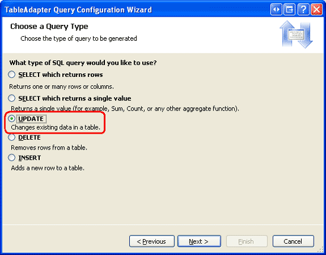](updating-and-deleting-existing-binary-data-vb/_static/image1.png)

**Figure 1**: Select the UPDATE Option ([Click to view full-size image](updating-and-deleting-existing-binary-data-vb/_static/image3.png))

We now need to specify the `UPDATE` SQL statement. The wizard automatically suggests an `UPDATE` statement corresponding to the TableAdapter s main query (one that updates the `CategoryName`, `Description`, and `BrochurePath` values). Change the statement so that the `Picture` column is included along with a `@Picture` parameter, like so:

[!code-sql[Main](updating-and-deleting-existing-binary-data-vb/samples/sample1.sql)]

The final screen of the wizard asks us to name the new TableAdapter method. Enter `UpdateWithPicture` and click Finish.

[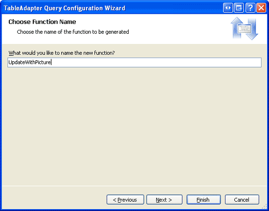](updating-and-deleting-existing-binary-data-vb/_static/image4.png)

**Figure 2**: Name the New TableAdapter Method `UpdateWithPicture` ([Click to view full-size image](updating-and-deleting-existing-binary-data-vb/_static/image6.png))

## Step 2: Adding the Business Logic Layer Methods

In addition to updating the DAL, we need to update the BLL to include methods for updating and deleting a category. These are the methods that will be invoked from the Presentation Layer.

For deleting a category, we can use the `CategoriesTableAdapter` s auto-generated `Delete` method. Add the following method to the `CategoriesBLL` class:

[!code-vb[Main](updating-and-deleting-existing-binary-data-vb/samples/sample2.vb)]

For this tutorial, let s create two methods for updating a category - one that expects the binary picture data and invokes the `UpdateWithPicture` method we just added to the `CategoriesTableAdapter` and another that accepts just the `CategoryName`, `Description`, and `BrochurePath` values and uses `CategoriesTableAdapter` class s auto-generated `Update` statement. The rationale behind using two methods is that in some circumstances, a user might want to update the category s picture along with its other fields, in which case the user will have to upload the new picture. The uploaded picture s binary data can then be used in the `UPDATE` statement. In other cases, the user might only be interested in updating, say, the name and description. But if the `UPDATE` statement expects the binary data for the `Picture` column as well, then we d need to provide that information as well. This would require an extra trip to the database to bring back the picture data for the record being edited. Therefore, we want two `UPDATE` methods. The Business Logic Layer will determine which one to use based on whether picture data is provided when updating the category.

To facilitate this, add two methods to the `CategoriesBLL` class, both named `UpdateCategory`. The first one should accept three `String` s, a `Byte` array, and an `Integer` as its input parameters; the second, just three `String` s and an `Integer`. The `String` input parameters are for the category s name, description, and brochure file path, the `Byte` array is for the binary contents of the category s picture, and the `Integer` identifies the `CategoryID` of the record to update. Notice that the first overload invokes the second if the passed-in `Byte` array is `Nothing`:

[!code-vb[Main](updating-and-deleting-existing-binary-data-vb/samples/sample3.vb)]

## Step 3: Copying Over the Insert and View Functionality

In the [preceding tutorial](including-a-file-upload-option-when-adding-a-new-record-vb.md) we created a page named `UploadInDetailsView.aspx` that listed all categories in a GridView and provided a DetailsView to add new categories to the system. In this tutorial we will extend the GridView to include editing and deleting support. Rather than continuing to work from `UploadInDetailsView.aspx`, let s instead place this tutorial s changes in the `UpdatingAndDeleting.aspx` page from the same folder, `~/BinaryData`. Copy and paste the declarative markup and code from `UploadInDetailsView.aspx` to `UpdatingAndDeleting.aspx`.

Start by opening the `UploadInDetailsView.aspx` page. Copy all of the declarative syntax within the `<asp:Content>` element, as shown in Figure 3. Next, open `UpdatingAndDeleting.aspx` and paste this markup within its `<asp:Content>` element. Similarly, copy the code from the `UploadInDetailsView.aspx` page s code-behind class to `UpdatingAndDeleting.aspx`.

[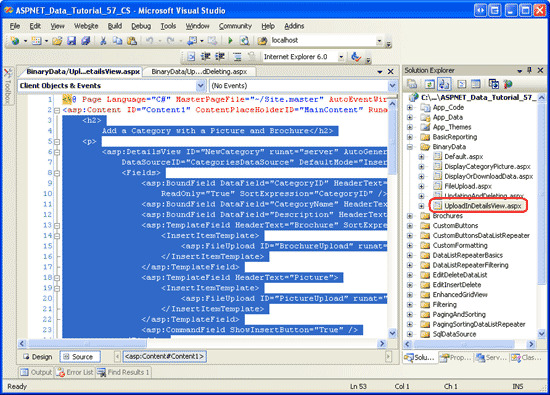](updating-and-deleting-existing-binary-data-vb/_static/image7.png)

**Figure 3**: Copy the Declarative Markup from `UploadInDetailsView.aspx` ([Click to view full-size image](updating-and-deleting-existing-binary-data-vb/_static/image9.png))

After copying over the declarative markup and code, visit `UpdatingAndDeleting.aspx`. You should see the same output and have the same user experience as with `UploadInDetailsView.aspx` page from the previous tutorial.

## Step 4: Adding Deleting Support to the ObjectDataSource and GridView

As we discussed back in the [An Overview of Inserting, Updating, and Deleting Data](../editing-inserting-and-deleting-data/an-overview-of-inserting-updating-and-deleting-data-vb.md) tutorial, the GridView provides built-in deleting capabilities and these capabilities can be enabled at the tick of a checkbox if the grid s underlying data source supports deleting. Currently the ObjectDataSource the GridView is bound to (`CategoriesDataSource`) does not support deleting.

To remedy this, click on the Configure Data Source option from the ObjectDataSource s smart tag to launch the wizard. The first screen shows that the ObjectDataSource is configured to work with the `CategoriesBLL` class. Hit Next. Currently, only the ObjectDataSource s `InsertMethod` and `SelectMethod` properties are specified. However, the wizard auto-populated the drop-down lists in the UPDATE and DELETE tabs with the `UpdateCategory` and `DeleteCategory` methods, respectively. This is because in the `CategoriesBLL` class we marked these methods using the `DataObjectMethodAttribute` as the default methods for updating and deleting.

For now, set the UPDATE tab s drop-down list to (None), but leave the DELETE tab s drop-down list set to `DeleteCategory`. We'll return to this wizard in Step 6 to add updating support.

[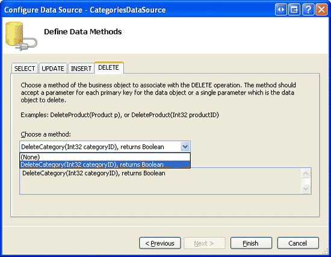](updating-and-deleting-existing-binary-data-vb/_static/image10.png)

**Figure 4**: Configure the ObjectDataSource to Use the `DeleteCategory` Method ([Click to view full-size image](updating-and-deleting-existing-binary-data-vb/_static/image12.png))

> [!NOTE]
> Upon completing the wizard, Visual Studio may ask if you want to Refresh Fields and Keys, which will regenerate the data Web controls fields. Choose No, because choosing Yes will overwrite any field customizations you may have made.

The ObjectDataSource will now include a value for its `DeleteMethod` property as well as a `DeleteParameter`. Recall that when using the wizard to specify the methods, Visual Studio sets the ObjectDataSource s `OldValuesParameterFormatString` property to `original_{0}`, which causes problems with the update and delete method invocations. Therefore, either clear out this property altogether or reset it to the default, `{0}`. If you need to refresh your memory on this ObjectDataSource property, see the [An Overview of Inserting, Updating, and Deleting Data](../editing-inserting-and-deleting-data/an-overview-of-inserting-updating-and-deleting-data-vb.md) tutorial.

After completing the wizard and fixing the `OldValuesParameterFormatString`, the ObjectDataSource s declarative markup should look similar like the following:

[!code-aspx[Main](updating-and-deleting-existing-binary-data-vb/samples/sample4.aspx)]

After configuring the ObjectDataSource, add deleting capabilities to the GridView by checking the Enable Deleting checkbox from the GridView s smart tag. This will add a CommandField to the GridView whose `ShowDeleteButton` property is set to `True`.

[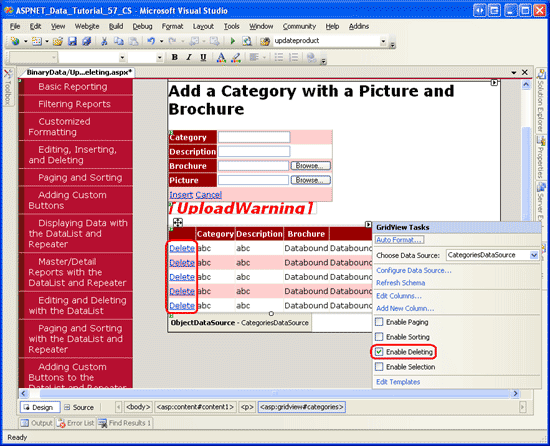](updating-and-deleting-existing-binary-data-vb/_static/image13.png)

**Figure 5**: Enable Support for Deleting in the GridView ([Click to view full-size image](updating-and-deleting-existing-binary-data-vb/_static/image15.png))

Take a moment to test out the delete functionality. There is a foreign key between the `Products` table s `CategoryID` and the `Categories` table s `CategoryID`, so you will get a foreign key constraint violation exception if you attempt to delete any of the first eight categories. To test this functionality out, add a new category, providing both a brochure and picture. My test category, shown in Figure 6, includes a test brochure file named `Test.pdf` and a test picture. Figure 7 shows the GridView after the test category has been added.

[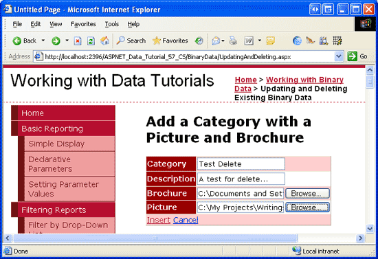](updating-and-deleting-existing-binary-data-vb/_static/image16.png)

**Figure 6**: Add a Test Category with a Brochure and Image ([Click to view full-size image](updating-and-deleting-existing-binary-data-vb/_static/image18.png))

[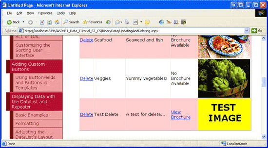](updating-and-deleting-existing-binary-data-vb/_static/image19.png)

**Figure 7**: After Inserting the Test Category, it is Displayed in the GridView ([Click to view full-size image](updating-and-deleting-existing-binary-data-vb/_static/image21.png))

In Visual Studio, refresh the Solution Explorer. You should now see a new file in the `~/Brochures` folder, `Test.pdf` (see Figure 8).

Next, click the Delete link in the Test Category row, causing the page to postback and the `CategoriesBLL` class s `DeleteCategory` method to fire. This will invoke the DAL s `Delete` method, causing the appropriate `DELETE` statement to be sent to the database. The data is then rebound to the GridView and the markup is sent back to the client with the Test Category no longer present.

While the delete workflow successfully removed the Test Category record from the `Categories` table, it did not remove its brochure file from the web server s file system. Refresh the Solution Explorer and you will see that `Test.pdf` is still sitting in the `~/Brochures` folder.

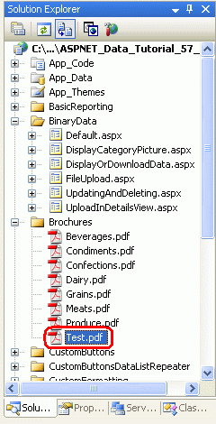

**Figure 8**: The `Test.pdf` File Was Not Deleted from the Web Server s File System

## Step 5: Removing the Deleted Category s Brochure File

One of the downsides of storing binary data external to the database is that extra steps must be taken to clean up these files when the associated database record is deleted. The GridView and ObjectDataSource provide events that fire both before and after the delete command has been performed. We actually need to create event handlers for both the pre- and post-action events. Before the `Categories` record is deleted we need to determine its PDF file s path, but we don t want to delete the PDF before the category is deleted in case there is some exception and the category is not deleted.

The GridView s [`RowDeleting` event](https://msdn.microsoft.com/en-us/library/system.web.ui.webcontrols.gridview.rowdeleting.aspx) fires before the ObjectDataSource s delete command has been invoked, while its [`RowDeleted` event](https://msdn.microsoft.com/en-us/library/system.web.ui.webcontrols.gridview.rowdeleted.aspx) fires after. Create event handlers for these two events using the following code:

[!code-vb[Main](updating-and-deleting-existing-binary-data-vb/samples/sample5.vb)]

In the `RowDeleting` event handler, the `CategoryID` of the row being deleted is grabbed from the GridView s `DataKeys` collection, which can be accessed in this event handler through the `e.Keys` collection. Next, the `CategoriesBLL` class s `GetCategoryByCategoryID(categoryID)` is invoked to return information about the record being deleted. If the returned `CategoriesDataRow` object has a non-`NULL``BrochurePath` value then it is stored in the page variable `deletedCategorysPdfPath` so that the file can be deleted in the `RowDeleted` event handler.

> [!NOTE]
> Rather than retrieving the `BrochurePath` details for the `Categories` record being deleted in the `RowDeleting` event handler, we could have alternatively added the `BrochurePath` to the GridView s `DataKeyNames` property and accessed the record s value through the `e.Keys` collection. Doing so would slightly increase the GridView s view state size, but would reduce the amount of code needed and save a trip to the database.

After the ObjectDataSource s underlying delete command has been invoked, the GridView s `RowDeleted` event handler fires. If there were no exceptions in deleting the data and there is a value for `deletedCategorysPdfPath`, then the PDF is deleted from the file system. Note that this extra code is not needed to clean up the category s binary data associated with its picture. That s because the picture data is stored directly in the database, so deleting the `Categories` row also deletes that category s picture data.

After adding the two event handlers, run this test case again. When deleting the category, its associated PDF is also deleted.

Updating an existing record s associated binary data provides some interesting challenges. The remainder of this tutorial delves into adding update capabilities to the brochure and picture. Step 6 explores techniques for updating the brochure information while Step 7 looks at updating the picture.

## Step 6: Updating a Category s Brochure

As discussed in the An Overview of Inserting, Updating, and Deleting Data tutorial, the GridView offers built-in row-level editing support that can be implemented by the tick of a checkbox if its underlying data source is appropriately configured. Currently, the `CategoriesDataSource` ObjectDataSource is not yet configured to include updating support, so let s add that in.

Click the Configure Data Source link from the ObjectDataSource s wizard and proceed to the second step. Because of the `DataObjectMethodAttribute` used in `CategoriesBLL`, the UPDATE drop-down list should automatically be populated with the `UpdateCategory` overload that accepts four input parameters (for all columns but `Picture`). Change this so that it uses the overload with five parameters.

[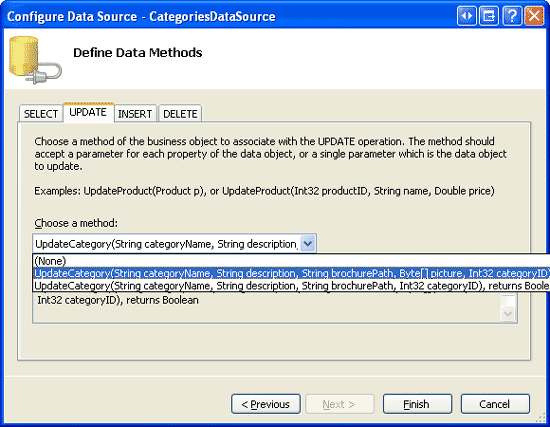](updating-and-deleting-existing-binary-data-vb/_static/image22.png)

**Figure 9**: Configure the ObjectDataSource to Use the `UpdateCategory` Method that Includes a Parameter for `Picture` ([Click to view full-size image](updating-and-deleting-existing-binary-data-vb/_static/image24.png))

The ObjectDataSource will now include a value for its `UpdateMethod` property as well as corresponding `UpdateParameter` s. As noted in Step 4, Visual Studio sets the ObjectDataSource s `OldValuesParameterFormatString` property to `original_{0}` when using the Configure Data Source wizard. This will cause problems with the update and delete method invocations. Therefore, either clear out this property altogether or reset it to the default, `{0}`.

After completing the wizard and fixing the `OldValuesParameterFormatString`, the ObjectDataSource s declarative markup should look like the following:

[!code-aspx[Main](updating-and-deleting-existing-binary-data-vb/samples/sample6.aspx)]

To turn on the GridView s built-in editing features, check the Enable Editing option from the GridView s smart tag. This will set the CommandField s `ShowEditButton` property to `True`, resulting in the addition of an Edit button (and Update and Cancel buttons for the row being edited).

[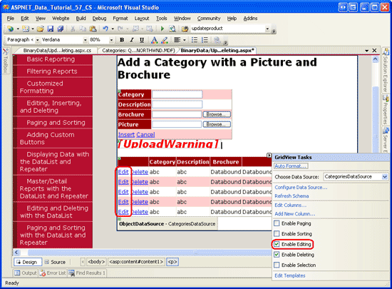](updating-and-deleting-existing-binary-data-vb/_static/image25.png)

**Figure 10**: Configure the GridView to Support Editing ([Click to view full-size image](updating-and-deleting-existing-binary-data-vb/_static/image27.png))

Visit the page through a browser and click one of the row s Edit buttons. The `CategoryName` and `Description` BoundFields are rendered as textboxes. The `BrochurePath` TemplateField lacks an `EditItemTemplate`, so it continues to show its `ItemTemplate` a link to the brochure. The `Picture` ImageField renders as a TextBox whose `Text` property is assigned the value of the ImageField s `DataImageUrlField` value, in this case `CategoryID`.

[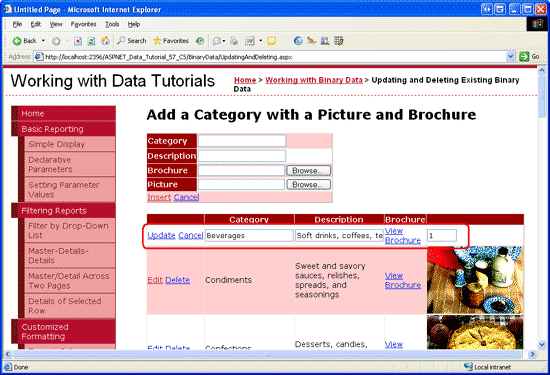](updating-and-deleting-existing-binary-data-vb/_static/image28.png)

**Figure 11**: The GridView Lacks an Editing Interface for `BrochurePath` ([Click to view full-size image](updating-and-deleting-existing-binary-data-vb/_static/image30.png))

## Customizing the`BrochurePath`s Editing Interface

We need to create an editing interface for the `BrochurePath` TemplateField, one that allows the user to either:

- Leave the category s brochure as-is,
- Update the category s brochure by uploading a new brochure, or
- Remove the category s brochure altogether (in the case that the category no longer has an associated brochure).

We also need to update the `Picture` ImageField s editing interface, but we'll get to this in Step 7.

From the GridView s smart tag, click on the Edit Templates link and select the `BrochurePath` TemplateField s `EditItemTemplate` from the drop-down list. Add a RadioButtonList Web control to this template, setting its `ID` property to `BrochureOptions` and its `AutoPostBack` property to `True`. From the Properties window, click on the ellipses in the `Items` property, which will bring up the `ListItem` Collection Editor. Add the following three options with `Value` s 1, 2 and 3, respectively:

- Use current brochure
- Remove current brochure
- Upload new brochure

Set the first `ListItem` s `Selected` property to `True`.

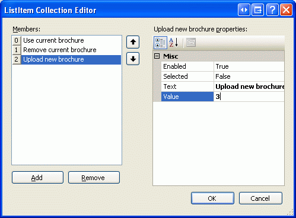

**Figure 12**: Add Three `ListItem` s to the RadioButtonList

Beneath the RadioButtonList, add a FileUpload control named `BrochureUpload`. Set its `Visible` property to `False`.

[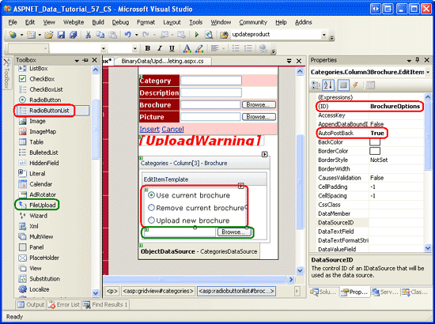](updating-and-deleting-existing-binary-data-vb/_static/image31.png)

**Figure 13**: Add a RadioButtonList and FileUpload Control to the `EditItemTemplate` ([Click to view full-size image](updating-and-deleting-existing-binary-data-vb/_static/image33.png))

This RadioButtonList provides the three options for the user. The idea is that the FileUpload control will be displayed only if the last option, Upload new brochure, is selected. To accomplish this, create an event handler for the RadioButtonList s `SelectedIndexChanged` event and add the following code:

[!code-vb[Main](updating-and-deleting-existing-binary-data-vb/samples/sample7.vb)]

Since the RadioButtonList and FileUpload controls are within a template, we have to write a bit of code to programmatically access these controls. The `SelectedIndexChanged` event handler is passed a reference of the RadioButtonList in the `sender` input parameter. To get the FileUpload control, we need to get the RadioButtonList s parent control and use the `FindControl("controlID")` method from there. Once we have a reference to both the RadioButtonList and FileUpload controls, the FileUpload control s `Visible` property is set to `True` only if the RadioButtonList s `SelectedValue` equals 3, which is the `Value` for the Upload new brochure `ListItem`.

With this code in place, take a moment to test out the editing interface. Click on the Edit button for a row. Initially, the Use current brochure option should be selected. Changing the selected index causes a postback. If the third option is selected, the FileUpload control is displayed, otherwise it is hidden. Figure 14 shows the editing interface when the Edit button is first clicked; Figure 15 shows the interface after the Upload new brochure option is selected.

[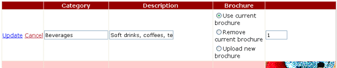](updating-and-deleting-existing-binary-data-vb/_static/image34.png)

**Figure 14**: Initially, the Use current brochure Option is Selected ([Click to view full-size image](updating-and-deleting-existing-binary-data-vb/_static/image36.png))

[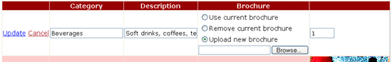](updating-and-deleting-existing-binary-data-vb/_static/image37.png)

**Figure 15**: Choosing the Upload new brochure Option Displays the FileUpload Control ([Click to view full-size image](updating-and-deleting-existing-binary-data-vb/_static/image39.png))

## Saving the Brochure File and Updating the`BrochurePath`Column

When the GridView s Update button is clicked, its `RowUpdating` event fires. The ObjectDataSource s update command is invoked and then the GridView s `RowUpdated` event fires. Like with the deleting workflow, we need to create event handlers for both of these events. In the `RowUpdating` event handler, we need to determine what action to take based on the `SelectedValue` of the `BrochureOptions` RadioButtonList:

- If the `SelectedValue` is 1, we want to keep using the same `BrochurePath` setting. Therefore, we need to set the ObjectDataSource s `brochurePath` parameter to the existing `BrochurePath` value of the record being updated. The ObjectDataSource s `brochurePath` parameter can be set using `e.NewValues["brochurePath"] = value`.
- If the `SelectedValue` is 2, then we want to set the record s `BrochurePath` value to `NULL`. This can be accomplished by setting the ObjectDataSource s `brochurePath` parameter to `Nothing`, which results in a database `NULL` being used in the `UPDATE` statement. If there is an existing brochure file that is being removed, we need to delete the existing file. However, we only want to do this if the update completes without raising an exception.
- If the `SelectedValue` is 3, then we want to ensure that the user has uploaded a PDF file and then save it to the file system and update the record s `BrochurePath` column value. Moreover, if there is an existing brochure file that is being replaced, we need to delete the previous file. However, we only want to do this if the update completes without raising an exception.

The steps needed to be completed when the RadioButtonList s `SelectedValue` is 3 are virtually identical to those used by the DetailsView s `ItemInserting` event handler. This event handler is executed when a new category record is added from the DetailsView control we added in the [previous tutorial](including-a-file-upload-option-when-adding-a-new-record-vb.md). Therefore, it behooves us to refactor this functionality out into separate methods. Specifically, I moved out the common functionality into two methods:

- `ProcessBrochureUpload(FileUpload, out bool)` accepts as input a FileUpload control instance and an output Boolean value that specifies whether the delete or edit operation should proceed or if it should be cancelled due to some validation error. This method returns the path to the saved file or `null` if no file was saved.
- `DeleteRememberedBrochurePath` deletes the file specified by the path in the page variable `deletedCategorysPdfPath` if `deletedCategorysPdfPath` is not `null`.

The code for these two methods follows. Note the similarity between `ProcessBrochureUpload` and the DetailsView s `ItemInserting` event handler from the previous tutorial. In this tutorial I have updated the DetailsView s event handlers to use these new methods. Download the code associated with this tutorial to see the modifications to the DetailsView s event handlers.

[!code-vb[Main](updating-and-deleting-existing-binary-data-vb/samples/sample8.vb)]

The GridView s `RowUpdating` and `RowUpdated` event handlers use the `ProcessBrochureUpload` and `DeleteRememberedBrochurePath` methods, as the following code shows:

[!code-vb[Main](updating-and-deleting-existing-binary-data-vb/samples/sample9.vb)]

Note how the `RowUpdating` event handler uses a series of conditional statements to perform the appropriate action based on the `BrochureOptions` RadioButtonList s `SelectedValue` property value.

With this code in place, you can edit a category and have it use its current brochure, use no brochure, or upload a new one. Go ahead and try it out. Set breakpoints in the `RowUpdating` and `RowUpdated` event handlers to get a sense of the workflow.

## Step 7: Uploading a New Picture

The `Picture` ImageField s editing interface renders as a textbox populated with the value from its `DataImageUrlField` property. During the editing workflow, the GridView passes a parameter to the ObjectDataSource with the parameter s name the value of the ImageField s `DataImageUrlField` property and the parameter s value the value entered into the textbox in the editing interface. This behavior is suitable when the image is saved as a file on the file system and the `DataImageUrlField` contains the full URL of the image. With such circumstances, the editing interface displays the image s URL in the textbox, which the user can change and have saved back to the database. Granted, this default interface doesn t allow the user to upload a new image, but it does let them change the URL of the image from the current value to another. For this tutorial, however, the ImageField s default editing interface does not suffice because the `Picture` binary data is being stored directly in the database and the `DataImageUrlField` property holds just the `CategoryID`.

To better understand what happens in our tutorial when a user edits a row with an ImageField, consider the following example: a user edits a row with `CategoryID` 10, causing the `Picture` ImageField to render as a textbox with the value 10. Imagine that the user changes the value in this textbox to 50 and clicks the Update button. A postback occurs and the GridView initially creates a parameter named `CategoryID` with the value 50. However, before the GridView sends this parameter (and the `CategoryName` and `Description` parameters), it adds in the values from the `DataKeys` collection. Therefore, it overwrites the `CategoryID` parameter with the current row s underlying `CategoryID` value, 10. In short, the ImageField s editing interface has no affect on the editing workflow for this tutorial because names of the ImageField s `DataImageUrlField` property and the grid s `DataKey` value are one in the same.

While the ImageField makes it easy to display an image based on database data, we don t want to provide a textbox in the editing interface. Rather, we want to offer a FileUpload control that the end user can use to change the category s picture. Unlike the `BrochurePath` value, for these tutorials we ve decided to require that each category must have a picture. Therefore, we don t need to let the user indicate that there is no associated picture the user may either upload a new picture or leave the current picture as-is.

To customize the ImageField s editing interface, we need to convert it into a TemplateField. From the GridView s smart tag, click on the Edit Columns link, select the ImageField, and click the Convert this field into a TemplateField link.

**Figure 16**: Convert the ImageField Into a TemplateField

Converting the ImageField into a TemplateField in this manner generates a TemplateField with two templates. As the following declarative syntax shows, the `ItemTemplate` contains an Image Web control whose `ImageUrl` property is assigned using databinding syntax based on the ImageField s `DataImageUrlField` and `DataImageUrlFormatString` properties. The `EditItemTemplate` contains a TextBox whose `Text` property is bound to the value specified by the `DataImageUrlField` property.

[!code-aspx[Main](updating-and-deleting-existing-binary-data-vb/samples/sample10.aspx)]

We need to update the `EditItemTemplate` to use a FileUpload control. From the GridView s smart tag click on the Edit Templates link and then select the `Picture` TemplateField s `EditItemTemplate` from the drop-down list. In the template you should see a TextBox remove this. Next, drag a FileUpload control from the Toolbox into the template, setting its `ID` to `PictureUpload`. Also add the text To change the category s picture, specify a new picture. To keep the category s picture the same, leave the field empty to the template, as well.

[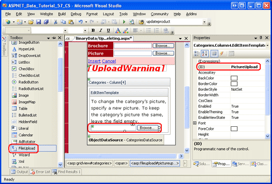](updating-and-deleting-existing-binary-data-vb/_static/image40.png)

**Figure 17**: Add a FileUpload Control to the `EditItemTemplate` ([Click to view full-size image](updating-and-deleting-existing-binary-data-vb/_static/image42.png))

After customizing the editing interface, view your progress in a browser. When viewing a row in read-only mode, the category s image is shown as it was before, but clicking on the Edit button renders the picture column as text with a FileUpload control.

[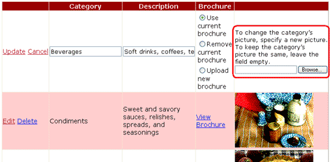](updating-and-deleting-existing-binary-data-vb/_static/image43.png)

**Figure 18**: The Editing Interface Includes a FileUpload Control ([Click to view full-size image](updating-and-deleting-existing-binary-data-vb/_static/image45.png))

Recall that the ObjectDataSource is configured to call the `CategoriesBLL` class s `UpdateCategory` method that accepts as input the binary data for the picture as a `Byte` array. If this array is `Nothing`, however, the alternate `UpdateCategory` overload is called, which issues the `UPDATE` SQL statement that does not modify the `Picture` column, thereby leaving the category s current picture intact. Therefore, in the GridView s `RowUpdating` event handler we need to programmatically reference the `PictureUpload` FileUpload control and determine if a file was uploaded. If one was not uploaded, then we do *not* want to specify a value for the `picture` parameter. On the other hand, if a file was uploaded in the `PictureUpload` FileUpload control, we want to ensure that it is a JPG file. If it is, then we can send its binary contents to the ObjectDataSource through the `picture` parameter.

Like with the code used in Step 6, much of the code needed here already exists in the DetailsView s `ItemInserting` event handler. Therefore, I ve refactored the common functionality into a new method, `ValidPictureUpload`, and updated the `ItemInserting` event handler to use this method.

Add the following code to the start of the GridView s `RowUpdating` event handler. It s important that this code come before the code that saves the brochure file since we don t want to save the brochure to the web server s file system if an invalid picture file is uploaded.

[!code-vb[Main](updating-and-deleting-existing-binary-data-vb/samples/sample11.vb)]

The `ValidPictureUpload(FileUpload)` method takes in a FileUpload control as its sole input parameter and checks the uploaded file s extension to ensure that the uploaded file is a JPG; it is only called if a picture file is uploaded. If no file is uploaded, then the picture parameter is not set, and therefore uses its default value of `Nothing`. If a picture was uploaded and `ValidPictureUpload` returns `True`, the `picture` parameter is assigned the binary data of the uploaded image; if the method returns `False`, the update workflow is cancelled and the event handler exited.

The `ValidPictureUpload(FileUpload)` method code, which was refactored from the DetailsView s `ItemInserting` event handler, follows:

[!code-vb[Main](updating-and-deleting-existing-binary-data-vb/samples/sample12.vb)]

## Step 8: Replacing the Original Categories Pictures with JPGs

Recall that the original eight categories pictures are bitmap files wrapped in an OLE header. Now that we have added the capability to edit an existing record s picture, take a moment to replace these bitmaps with JPGs. If you want to continue to use the current category pictures, you can convert them to JPGs by performing the following steps:

1. Save the bitmap images to your hard drive. Visit the `UpdatingAndDeleting.aspx` page in your browser and for each of the first eight categories, right-click on the image and choose to save the picture.
2. Open the image in your image editor of choice. You can use Microsoft Paint, for example.
3. Save the bitmap as a JPG image.
4. Update the category s picture through the editing interface, using the JPG file.

After editing a category and uploading the JPG image, the image will not render in the browser because the `DisplayCategoryPicture.aspx` page is stripping the first 78 bytes from the pictures of the first eight categories. Fix this by removing the code that performs the OLE header stripping. After doing this, the `DisplayCategoryPicture.aspx``Page_Load` event handler should have just the following code:

[!code-vb[Main](updating-and-deleting-existing-binary-data-vb/samples/sample13.vb)]

> [!NOTE]
> The `UpdatingAndDeleting.aspx` page s inserting and editing interfaces could use a bit more work. The `CategoryName` and `Description` BoundFields in the DetailsView and GridView should be converted into TemplateFields. Since `CategoryName` does not allow `NULL` values, a RequiredFieldValidator should be added. And the `Description` TextBox should probably be converted into a multi-line TextBox. I leave these finishing touches as an exercise for you.

## Summary

This tutorial completes our look at working with binary data. In this tutorial and the previous three, we saw how binary data can be stored on the file system or directly within the database. A user provides binary data to the system by selecting a file from their hard drive and uploading it to the web server, where it can be stored on the file system or inserted into the database. ASP.NET 2.0 includes a FileUpload control that makes providing such an interface as easy as drag and drop. However, as noted in the [Uploading Files](uploading-files-vb.md) tutorial, the FileUpload control is only well-suited for relatively small file uploads, ideally not exceeding a megabyte. We also explored how to associate uploaded data with the underlying data model, as well as how to edit and delete the binary data from existing records.

Our next set of tutorials explores various caching techniques. Caching provides a means to improve an application s overall performance by taking the results from expensive operations and storing them in a location that can be more quickly accessed.

Happy Programming!

## About the Author

[Scott Mitchell](http://www.4guysfromrolla.com/ScottMitchell.shtml), author of seven ASP/ASP.NET books and founder of [4GuysFromRolla.com](http://www.4guysfromrolla.com), has been working with Microsoft Web technologies since 1998. Scott works as an independent consultant, trainer, and writer. His latest book is [*Sams Teach Yourself ASP.NET 2.0 in 24 Hours*](https://www.amazon.com/exec/obidos/ASIN/0672327384/4guysfromrollaco). He can be reached at [mitchell@4GuysFromRolla.com.](mailto:mitchell@4GuysFromRolla.com) or via his blog, which can be found at [http://ScottOnWriting.NET](http://ScottOnWriting.NET).

## Special Thanks To

This tutorial series was reviewed by many helpful reviewers. Lead reviewer for this tutorial was Teresa Murphy. Interested in reviewing my upcoming MSDN articles? If so, drop me a line at [mitchell@4GuysFromRolla.com.](mailto:mitchell@4GuysFromRolla.com)

>[!div class="step-by-step"]
[Previous](including-a-file-upload-option-when-adding-a-new-record-vb.md)