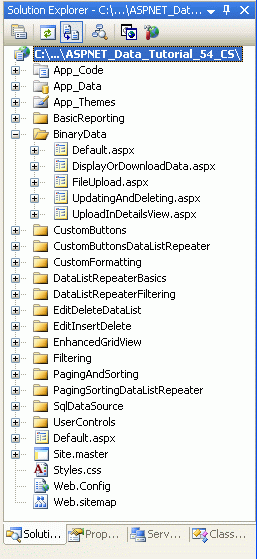
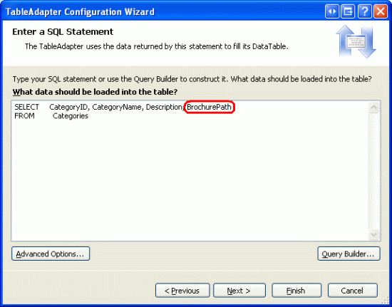
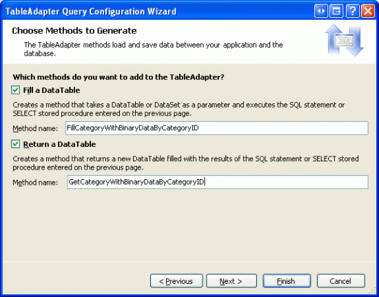
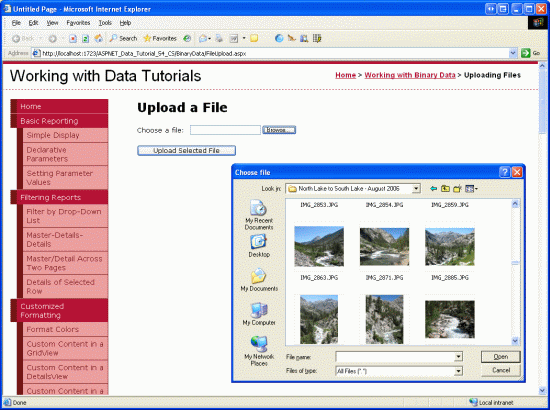
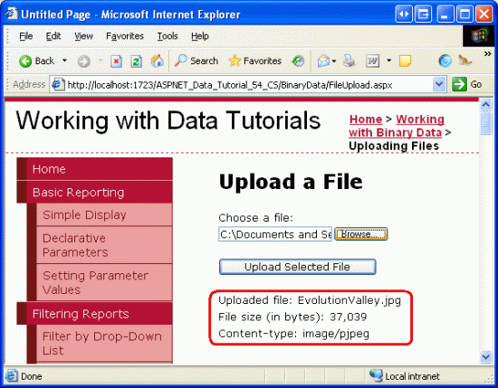

Uploading Files (C#)
====================
by [Scott Mitchell](https://twitter.com/ScottOnWriting)

[Download Sample App](http://download.microsoft.com/download/4/a/7/4a7a3b18-d80e-4014-8e53-a6a2427f0d93/ASPNET_Data_Tutorial_54_CS.exe) or [Download PDF](uploading-files-cs/_static/datatutorial54cs1.pdf)

> Learn how to allow users to upload binary files (such as Word or PDF documents) to your Web site where they may be stored in either the server's file system or the database.

## Introduction

All of the tutorials we ve examined so far have worked exclusively with text data. However, many applications have data models that capture both text and binary data. An online dating site might allow users to upload a picture to associate with their profile. A recruiting website might let users upload their resume as a Microsoft Word or PDF document.

Working with binary data adds a new set of challenges. We must decide how the binary data is stored in the application. The interface used for inserting new records has to be updated to allow the user to upload a file from their computer and extra steps must be taken to display or provide a means for downloading a record s associated binary data. In this tutorial and the next three we'll explore how to hurdle these challenges. At the end of these tutorials we'll have built a fully functional application that associates a picture and PDF brochure with each category. In this particular tutorial we'll look at different techniques for storing binary data and explore how to enable users to upload a file from their computer and have it saved on the web server s file system.

> [!NOTE]
> Binary data that is part of an application s data model is sometimes referred to as a [BLOB](http://en.wikipedia.org/wiki/Binary_large_object), an acronym for Binary Large OBject. In these tutorials I have chosen to use the terminology binary data, although the term BLOB is synonymous.

## Step 1: Creating the Working with Binary Data Web Pages

Before we begin to explore the challenges associated with adding support for binary data, let s first take a moment to create the ASP.NET pages in our website project that we'll need for this tutorial and the next three. Start by adding a new folder named `BinaryData`. Next, add the following ASP.NET pages to that folder, making sure to associate each page with the `Site.master` master page:

- `Default.aspx`
- `FileUpload.aspx`
- `DisplayOrDownloadData.aspx`
- `UploadInDetailsView.aspx`
- `UpdatingAndDeleting.aspx`

**Figure 1**: Add the ASP.NET Pages for the Binary Data-Related Tutorials

Like in the other folders, `Default.aspx` in the `BinaryData` folder will list the tutorials in its section. Recall that the `SectionLevelTutorialListing.ascx` User Control provides this functionality. Therefore, add this User Control to `Default.aspx` by dragging it from the Solution Explorer onto the page s Design view.

**Figure 2**: Add the `SectionLevelTutorialListing.ascx` User Control to `Default.aspx` ([Click to view full-size image](uploading-files-cs/_static/image2.png))

Lastly, add these pages as entries to the `Web.sitemap` file. Specifically, add the following markup after the Enhancing the GridView `<siteMapNode>`:

[!code-xml[Main](uploading-files-cs/samples/sample1.xml)]

After updating `Web.sitemap`, take a moment to view the tutorials website through a browser. The menu on the left now includes items for the Working with Binary Data tutorials.

**Figure 3**: The Site Map Now Includes Entries for the Working with Binary Data Tutorials

## Step 2: Deciding Where to Store the Binary Data

Binary data that is associated with the application s data model can be stored in one of two places: on the web server s file system with a reference to the file stored in the database; or directly within the database itself (see Figure 4). Each approach has its own set of pros and cons and merits a more detailed discussion.

**Figure 4**: Binary Data Can Be Stored On the File System or Directly in the Database ([Click to view full-size image](uploading-files-cs/_static/image4.png))

Imagine that we wanted to extend the Northwind database to associate a picture with each product. One option would be to store these image files on the web server s file system and record the path in the `Products` table. With this approach, we d add an `ImagePath` column to the `Products` table of type `varchar(200)`, perhaps. When a user uploaded a picture for Chai, that picture might be stored on the web server s file system at `~/Images/Tea.jpg`, where `~` represents the application s physical path. That is, if the web site is rooted at the physical path `C:\Websites\Northwind\`, `~/Images/Tea.jpg` would be equivalent to `C:\Websites\Northwind\Images\Tea.jpg`. After uploading the image file, we d update the Chai record in the `Products` table so that its `ImagePath` column referenced the path of the new image. We could use `~/Images/Tea.jpg` or just `Tea.jpg` if we decided that all product images would be placed in the application s `Images` folder.

The main advantages of storing the binary data on the file system are:

- **Ease of implementation** as we'll see shortly, storing and retrieving binary data stored directly within the database involves a bit more code than when working with data through the file system. Additionally, in order for a user to view or download binary data they must be presented with a URL to that data. If the data resides on the web server s file system, the URL is straightforward. If the data is stored in the database, however, a web page needs to be created that will retrieve and return the data from the database.
- **Wider access to the binary data** the binary data may need to be accessible to other services or applications, ones that cannot pull the data from the database. For example, the images associated with each product might also need to be available to users through [FTP](http://en.wikipedia.org/wiki/File_Transfer_Protocol), in which case we d want to store the binary data on the file system.
- **Performance** if the binary data is stored on the file system, the demand and network congestion between the database server and web server will be less than if the binary data is stored directly within the database.

The main disadvantage of storing binary data on the file system is that it decouples the data from the database. If a record is deleted from the `Products` table, the associated file on the web server s file system is not automatically deleted. We must write extra code to delete the file or the file system will become cluttered with unused, orphaned files. Furthermore, when backing up the database, we must make sure to make backups of the associated binary data on the file system, as well. Moving the database to another site or server poses similar challenges.

Alternatively, binary data can be stored directly in a Microsoft SQL Server 2005 database by creating a column of type `varbinary`. Like with other variable length data types, you can specify a maximum length of the binary data that can be held in this column. For example, to reserve at most 5,000 bytes use `varbinary(5000)`; `varbinary(MAX)` allows for the maximum storage size, about 2 GB.

The main advantage of storing binary data directly in the database is the tight coupling between the binary data and the database record. This greatly simplifies database administration tasks, like backups or moving the database to a different site or server. Also, deleting a record automatically deletes the corresponding binary data. There are also more subtle benefits of storing the binary data in the database. See [Storing Binary Files Directly in the Database Using ASP.NET 2.0](http://aspnet.4guysfromrolla.com/articles/120606-1.aspx) for a more in-depth discussion.

> [!NOTE]
> In Microsoft SQL Server 2000 and earlier versions, the `varbinary` data type had a maximum limit of 8,000 bytes. To store up to 2 GB of binary data the [`image` data type](https://msdn.microsoft.com/en-us/library/ms187993.aspx) needs to be used instead. With the addition of `MAX` in SQL Server 2005, however, the `image` data type has been deprecated. It s still supported for backwards compatibility, but Microsoft has announced that the `image` data type will be removed in a future version of SQL Server.

If you are working with an older data model you may see the `image` data type. The Northwind database s `Categories` table has a `Picture` column that can be used to store the binary data of an image file for the category. Since the Northwind database has its roots in Microsoft Access and earlier versions of SQL Server, this column is of type `image`.

For this tutorial and the next three, we'll use both approaches. The `Categories` table already has a `Picture` column for storing the binary content of an image for the category. We'll add an additional column, `BrochurePath`, to store a path to a PDF on the web server s file system that can be used to provide a print-quality, polished overview of the category.

## Step 3: Adding the`BrochurePath`Column to the`Categories`Table

Currently the Categories table has only four columns: `CategoryID`, `CategoryName`, `Description`, and `Picture`. In addition to these fields, we need to add a new one that will point to the category s brochure (if one exists). To add this column, go to the Server Explorer, drill down into the Tables, right-click on the `Categories` table and choose Open Table Definition (see Figure 5). If you do not see the Server Explorer, bring it up by selecting the Server Explorer option from the View menu, or hit Ctrl+Alt+S.

Add a new `varchar(200)` column to the `Categories` table that is named `BrochurePath` and allows `NULL` s and click the Save icon (or hit Ctrl+S).

**Figure 5**: Add a `BrochurePath` Column to the `Categories` Table ([Click to view full-size image](uploading-files-cs/_static/image6.png))

## Step 4: Updating the Architecture to Use the`Picture`and`BrochurePath`Columns

The `CategoriesDataTable` in the Data Access Layer (DAL) currently has four `DataColumn` s defined: `CategoryID`, `CategoryName`, `Description`, and `NumberOfProducts`. When we originally designed this DataTable in the [Creating a Data Access Layer](../introduction/creating-a-data-access-layer-cs.md) tutorial, the `CategoriesDataTable` only had the first three columns; the `NumberOfProducts` column was added in the [Master/Detail Using a Bulleted List of Master Records with a Details DataList](../filtering-scenarios-with-the-datalist-and-repeater/master-detail-using-a-bulleted-list-of-master-records-with-a-details-datalist-cs.md) tutorial.

As discussed in *Creating a Data Access Layer*, the DataTables in the Typed DataSet make up the business objects. The TableAdapters are responsible for communicating with the database and populating the business objects with the query results. The `CategoriesDataTable` is populated by the `CategoriesTableAdapter`, which has three data retrieval methods:

- `GetCategories()` executes the TableAdapter s main query and returns the `CategoryID`, `CategoryName`, and `Description` fields of all records in the `Categories` table. The main query is what is used by the auto-generated `Insert` and `Update` methods.
- `GetCategoryByCategoryID(categoryID)` returns the `CategoryID`, `CategoryName`, and `Description` fields of the category whose `CategoryID` equals *categoryID*.
- `GetCategoriesAndNumberOfProducts()` - returns the `CategoryID`, `CategoryName`, and `Description` fields for all records in the `Categories` table. Also uses a subquery to return the number of products associated with each category.

Notice that none of these queries return the `Categories` table s `Picture` or `BrochurePath` columns; nor does the `CategoriesDataTable` provide `DataColumn` s for these fields. In order to work with the Picture and `BrochurePath` properties, we need to first add them to the `CategoriesDataTable` and then update the `CategoriesTableAdapter` class to return these columns.

## Adding the`Picture`and`BrochurePath``DataColumn` s

Start by adding these two columns to the `CategoriesDataTable`. Right-click on the `CategoriesDataTable` s header, select Add from the context menu and then choose the Column option. This will create a new `DataColumn` in the DataTable named `Column1`. Rename this column to `Picture`. From the Properties window, set the `DataColumn` s `DataType` property to `System.Byte[]` (this is not an option in the drop-down list; you need to type it in).

[![Create a DataColumn Named Picture whose DataType is System.Byte[]](uploading-files-cs/_static/image6.gif)](uploading-files-cs/_static/image7.png)

**Figure 6**: Create a `DataColumn` Named `Picture` whose `DataType` is `System.Byte[]` ([Click to view full-size image](uploading-files-cs/_static/image8.png))

Add another `DataColumn` to the DataTable, naming it `BrochurePath` using the default `DataType` value (`System.String`).

## Returning the`Picture`and`BrochurePath`Values from the TableAdapter

With these two `DataColumn` s added to the `CategoriesDataTable`, we re ready to update the `CategoriesTableAdapter`. We could have both of these column values returned in the main TableAdapter query, but this would bring back the binary data every time the `GetCategories()` method was invoked. Instead, let s update the main TableAdapter query to bring back `BrochurePath` and create an additional data retrieval method that returns a particular category s `Picture` column.

To update the main TableAdapter query, right-click on the `CategoriesTableAdapter` s header and choose the Configure option from the context menu. This brings up the Table Adapter Configuration Wizard, which we ve seen in a number of past tutorials. Update the query to bring back the `BrochurePath` and click Finish.

**Figure 7**: Update the Column List in the `SELECT` Statement to Also Return `BrochurePath` ([Click to view full-size image](uploading-files-cs/_static/image10.png))

When using ad-hoc SQL statements for the TableAdapter, updating the column list in the main query updates the column list for all of the `SELECT` query methods in the TableAdapter. That means the `GetCategoryByCategoryID(categoryID)` method has been updated to return the `BrochurePath` column, which might be what we intended. However, it also updated the column list in the `GetCategoriesAndNumberOfProducts()` method, removing the subquery that returns the number of products for each category! Therefore, we need to update this method s `SELECT` query. Right-click on the `GetCategoriesAndNumberOfProducts()` method, choose Configure, and revert the `SELECT` query back to its original value:

[!code-sql[Main](uploading-files-cs/samples/sample2.sql)]

Next, create a new TableAdapter method that returns a particular category s `Picture` column value. Right-click on the `CategoriesTableAdapter` s header and choose the Add Query option to launch the TableAdapter Query Configuration Wizard. The first step of this wizard asks us if we want to query data using an ad-hoc SQL statement, a new stored procedure, or an existing one. Select Use SQL statements and click Next. Since we will be returning a row, choose the SELECT which returns rows option from the second step.

**Figure 8**: Select the Use SQL statements Option ([Click to view full-size image](uploading-files-cs/_static/image12.png))

**Figure 9**: Since the Query Will Return a Record from the Categories Table, Choose SELECT which returns rows ([Click to view full-size image](uploading-files-cs/_static/image14.png))

In the third step, enter the following SQL query and click Next:

[!code-sql[Main](uploading-files-cs/samples/sample3.sql)]

The last step is to choose the name for the new method. Use `FillCategoryWithBinaryDataByCategoryID` and `GetCategoryWithBinaryDataByCategoryID` for the Fill a DataTable and Return a DataTable patterns, respectively. Click Finish to complete the wizard.

**Figure 10**: Choose the Names for the TableAdapter s Methods ([Click to view full-size image](uploading-files-cs/_static/image16.png))

> [!NOTE]
> After completing the Table Adapter Query Configuration Wizard you may see a dialog box informing you that the new command text returns data with schema different from the schema of the main query. In short, the wizard is noting that the TableAdapter s main query `GetCategories()` returns a different schema than the one we just created. But this is what we want, so you can disregard this message.

Also, keep in mind that if you are using ad-hoc SQL statements and use the wizard to change the TableAdapter s main query at some later point in time, it will modify the `GetCategoryWithBinaryDataByCategoryID` method s `SELECT` statement s column list to include just those columns from the main query (that is, it will remove the `Picture` column from the query). You will have to manually update the column list to return the `Picture` column, similar to what we did with the `GetCategoriesAndNumberOfProducts()` method earlier in this step.

After adding the two `DataColumn` s to the `CategoriesDataTable` and the `GetCategoryWithBinaryDataByCategoryID` method to the `CategoriesTableAdapter`, these classes in the Typed DataSet Designer should look like the screenshot in Figure 11.

**Figure 11**: The DataSet Designer Includes the New Columns and Method

## Updating the Business Logic Layer (BLL)

With the DAL updated, all that remains is to augment the Business Logic Layer (BLL) to include a method for the new `CategoriesTableAdapter` method. Add the following method to the `CategoriesBLL` class:

[!code-csharp[Main](uploading-files-cs/samples/sample4.cs)]

## Step 5: Uploading a File From the Client to the Web Server

When collecting binary data, oftentimes this data is supplied by an end user. To capture this information, the user needs to be able to upload a file from their computer to the web server. The uploaded data then needs to be integrated with the data model, which may mean saving the file to the web server s file system and adding a path to the file in the database, or writing the binary contents directly into the database. In this step we'll look at how to allow a user to upload files from their computer to the server. In the next tutorial we'll turn our attention to integrating the uploaded file with data model.

ASP.NET 2.0 s new [FileUpload Web control](https://msdn.microsoft.com/en-us/library/ms227677(VS.80).aspx) provides a mechanism for users to send a file from their computer to the web server. The FileUpload control renders as an `<input>` element whose `type` attribute is set to file, which browsers display as a textbox with a Browse button. Clicking the Browse button brings up a dialog box from which the user can select a file. When the form is posted back, the selected file s contents are sent along with the postback. On the server-side, information about the uploaded file is accessible through the FileUpload control s properties.

To demonstrate uploading files, open the `FileUpload.aspx` page in the `BinaryData` folder, drag a FileUpload control from the Toolbox onto the Designer, and set the control s `ID` property to `UploadTest`. Next, add a Button Web control setting its `ID` and `Text` properties to `UploadButton` and Upload Selected File, respectively. Finally, place a Label Web control beneath the Button, clear out its `Text` property and set its `ID` property to `UploadDetails`.

**Figure 12**: Add a FileUpload Control to the ASP.NET Page ([Click to view full-size image](uploading-files-cs/_static/image18.png))

Figure 13 shows this page when viewed through a browser. Note that clicking the Browse button brings up a file selection dialog box, allowing the user to pick a file from their computer. Once a file has been selected, clicking the Upload Selected File button causes a postback that sends the selected file s binary content to the web server.

**Figure 13**: The User Can Select a File to Upload from their Computer to the Server ([Click to view full-size image](uploading-files-cs/_static/image20.png))

On postback, the uploaded file can be saved to the file system or its binary data can be worked with directly through a Stream. For this example, let s create a `~/Brochures` folder and save the uploaded file there. Start by adding the `Brochures` folder to the site as a subfolder of the root directory. Next, create an event handler for the `UploadButton` s `Click` event and add the following code:

[!code-csharp[Main](uploading-files-cs/samples/sample5.cs)]

The FileUpload control provides a variety of properties for working with the uploaded data. For instance, the [`HasFile` property](https://msdn.microsoft.com/en-us/library/system.web.ui.webcontrols.fileupload.hasfile.aspx) indicates whether a file was uploaded by the user, while the [`FileBytes` property](https://msdn.microsoft.com/en-us/library/system.web.ui.webcontrols.fileupload.filebytes.aspx) provides access to the uploaded binary data as an array of bytes. The `Click` event handler starts by ensuring that a file has been uploaded. If a file has been uploaded, the Label shows the name of the uploaded file, its size in bytes, and its content-type.

> [!NOTE]
> To ensure that the user uploads a file you can check the `HasFile` property and display a warning if it s `false`, or you may use the [RequiredFieldValidator control](https://quickstarts.asp.net/QuickStartv20/aspnet/doc/validation/default.aspx) instead.

The FileUpload s `SaveAs(filePath)` saves the uploaded file to the specified *filePath*. *filePath* must be a *physical path* (`C:\Websites\Brochures\SomeFile.pdf`) rather than a *virtual* *path* (`/Brochures/SomeFile.pdf`). The [`Server.MapPath(virtPath)` method](https://msdn.microsoft.com/en-us/library/system.web.httpserverutility.mappath.aspx) takes a virtual path and returns its corresponding physical path. Here, the virtual path is `~/Brochures/fileName`, where *fileName* is the name of the uploaded file. See [Using Server.MapPath](http://www.4guysfromrolla.com/webtech/121799-1.shtml) for more information on virtual and physical paths and using `Server.MapPath`.

After completing the `Click` event handler, take a moment to test out the page in a browser. Click the Browse button and select a file from your hard drive and then click the Upload Selected File button. The postback will send the contents of the selected file to the web server, which will then display information about the file before saving it to the `~/Brochures` folder. After uploading the file, return to Visual Studio and click the Refresh button in the Solution Explorer. You should see the file you just uploaded in the ~/Brochures folder!

**Figure 14**: The File `EvolutionValley.jpg` Has Been Uploaded to the Web Server ([Click to view full-size image](uploading-files-cs/_static/image22.png))

**Figure 15**: `EvolutionValley.jpg` Was Saved to the `~/Brochures` Folder

## Subtleties with Saving Uploaded Files to the File System

There are several subtleties that must be addressed when saving uploading files to the web server s file system. First, there s the issue of security. To save a file to the file system, the security context under which the ASP.NET page is executing must have Write permissions. The ASP.NET Development Web Server runs under the context of your current user account. If you are using Microsoft s Internet Information Services (IIS) as the web server, the security context depends on the version of IIS and its configuration.

Another challenge of saving files to the file system revolves around naming the files. Currently, our page saves all of the uploaded files to the `~/Brochures` directory using the same name as the file on the client s computer. If User A uploads a brochure with the name `Brochure.pdf`, the file will be saved as `~/Brochure/Brochure.pdf`. But what if sometime later User B uploads a different brochure file that happens to have the same filename (`Brochure.pdf`)? With the code we have now, User A s file will be overwritten with User B s upload.

There are a number of techniques for resolving file name conflicts. One option is to prohibit uploading a file if there already exists one with the same name. With this approach, when User B attempts to upload a file named `Brochure.pdf`, the system would not save their file and instead display a message informing User B to rename the file and try again. Another approach is to save the file using a unique file name, which could be a [globally unique identifier (GUID)](http://en.wikipedia.org/wiki/Globally_Unique_Identifier) or the value from the corresponding database record s primary key column(s) (assuming that the upload is associated with a particular row in the data model). In the next tutorial we'll explore these options in more detail.

## Challenges Involved with Very Large Amounts of Binary Data

These tutorials assume that the binary data captured is modest in size. Working with very large amounts of binary data files that are several megabytes or larger introduces new challenges that are beyond the scope of these tutorials. For example, by default ASP.NET will reject uploads of more than 4 MB, although this can be configured through the [`<httpRuntime>` element](https://msdn.microsoft.com/en-us/library/e1f13641.aspx) in `Web.config`. IIS imposes its own file upload size limitations, too. See [IIS Upload File Size](http://vandamme.typepad.com/development/2005/09/iis_upload_file.html) for more information. Furthermore, the time taken to upload large files might exceed the default 110 seconds ASP.NET will wait for a request. There are also memory and performance issues that arise when working with large files.

The FileUpload control is impractical for large file uploads. As the file s contents are being posted to the server, the end user must patiently wait without any confirmation that their upload is progressing. This is not so much an issue when dealing with smaller files that can be uploaded in a few seconds, but can be an issue when dealing with larger files that may take minutes to upload. There are a variety of third-party file upload controls that are better suited for handling large uploads and many of these vendors provide progress indicators and ActiveX upload managers that present a much more polished user experience.

If your application needs to handle large files, you'll need to carefully investigate the challenges and find suitable solutions for your particular needs.

## Summary

Building an application that needs to capture binary data introduces a number of challenges. In this tutorial we explored the first two: deciding where to store the binary data and allowing a user to upload binary content through a web page. Over the next three tutorials, we'll see how to associate the uploaded data with a record in the database as well as how to display the binary data alongside its text data fields.

Happy Programming!

## Further Reading

For more information on the topics discussed in this tutorial, refer to the following resources:

- [Using Large-Value Data Types](https://msdn.microsoft.com/en-us/library/ms178158.aspx)
- [FileUpload Control QuickStarts](https://quickstarts.asp.net/QuickStartv20/aspnet/doc/ctrlref/standard/fileupload.aspx)
- [The ASP.NET 2.0 FileUpload Server Control](http://www.wrox.com/WileyCDA/Section/id-292158.html)
- [The Dark Side of File Uploads](http://www.aspnetresources.com/articles/dark_side_of_file_uploads.aspx)

## About the Author

[Scott Mitchell](http://www.4guysfromrolla.com/ScottMitchell.shtml), author of seven ASP/ASP.NET books and founder of [4GuysFromRolla.com](http://www.4guysfromrolla.com), has been working with Microsoft Web technologies since 1998. Scott works as an independent consultant, trainer, and writer. His latest book is [*Sams Teach Yourself ASP.NET 2.0 in 24 Hours*](https://www.amazon.com/exec/obidos/ASIN/0672327384/4guysfromrollaco). He can be reached at [mitchell@4GuysFromRolla.com.](mailto:mitchell@4GuysFromRolla.com) or via his blog, which can be found at [http://ScottOnWriting.NET](http://ScottOnWriting.NET).

## Special Thanks To

This tutorial series was reviewed by many helpful reviewers. Lead reviewers for this tutorial were Teresa Murphy and Bernadette Leigh. Interested in reviewing my upcoming MSDN articles? If so, drop me a line at [mitchell@4GuysFromRolla.com.](mailto:mitchell@4GuysFromRolla.com)

>[!div class="step-by-step"]
[Next](displaying-binary-data-in-the-data-web-controls-cs.md)