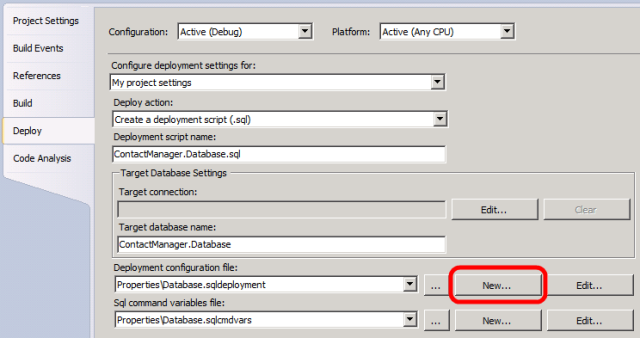
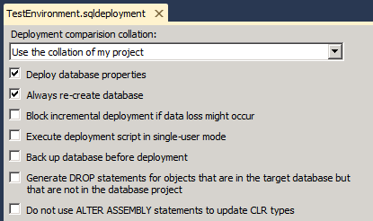

Customizing Database Deployments for Multiple Environments
====================
by [Jason Lee](https://github.com/jrjlee)

[Download PDF](https://msdnshared.blob.core.windows.net/media/MSDNBlogsFS/prod.evol.blogs.msdn.com/CommunityServer.Blogs.Components.WeblogFiles/00/00/00/63/56/8130.DeployingWebAppsInEnterpriseScenarios.pdf)

> This topic describes how to tailor the properties of a database to specific target environments as part of the deployment process.
> 
> > [!NOTE]
> > The topic assumes that you're deploying a Visual Studio 2010 database project using MSBuild.exe and VSDBCMD.exe. For more information on why you might choose this approach, see [Web Deployment in the Enterprise](../web-deployment-in-the-enterprise/web-deployment-in-the-enterprise.md) and [Deploying Database Projects](../web-deployment-in-the-enterprise/deploying-database-projects.md).
> 
> 
> When you deploy a database project to multiple destinations, you'll often want to customize the database deployment properties for each target environment. For example, in test environments you'd typically recreate the database on every deployment, whereas in staging or production environments you'd be a lot more likely to make incremental updates to preserve your data.
> 
> In a Visual Studio 2010 database project, deployment settings are contained within a deployment configuration (.sqldeployment) file. This topic will show you how to create environment-specific deployment configuration files and specify the one you want to use as a VSDBCMD parameter.

This topic forms part of a series of tutorials based around the enterprise deployment requirements of a fictional company named Fabrikam, Inc. This tutorial series uses a sample solution&#x2014;the [Contact Manager solution](../web-deployment-in-the-enterprise/the-contact-manager-solution.md)&#x2014;to represent a web application with a realistic level of complexity, including an ASP.NET MVC 3 application, a Windows Communication Foundation (WCF) service, and a database project.

The deployment method at the heart of these tutorials is based on the split project file approach described in [Understanding the Project File](../web-deployment-in-the-enterprise/understanding-the-project-file.md), in which the build process is controlled by two project files&#x2014;one containing build instructions that apply to every destination environment, and one containing environment-specific build and deployment settings. At build time, the environment-specific project file is merged into the environment-agnostic project file to form a complete set of build instructions.

## Task Overview

This topic assumes that:

- You use the split project file approach to solution deployment, as described in [Understanding the Project File](../web-deployment-in-the-enterprise/understanding-the-project-file.md).
- You call VSDBCMD from the project file to deploy your database project, as described in [Understanding the Build Process](../web-deployment-in-the-enterprise/understanding-the-build-process.md).

To create a deployment system that supports varying the database deployment properties between target environments, you'll need to:

- Create a deployment configuration (.sqldeployment) file for each target environment.
- Create a VSDBCMD command that specifies the deployment configuration file as a command-line switch.
- Parameterize the VSDBCMD command in a Microsoft Build Engine (MSBuild) project file, so that the VSDBCMD options are appropriate to the target environment.

This topic will show you how to perform each of these procedures.

## Creating Environment-Specific Deployment Configuration Files

By default, a database project contains a single deployment configuration file named *Database.sqldeployment*. If you open this file in Visual Studio 2010, you can see the different deployment options that are available to you:

- **Deployment comparison collation**. This lets you choose whether to use the database collation of your project (the *source* collation) or the database collation of your destination server (the *target* collation). In most cases, you'll want to use the source collation when you deploy to a development or test environment. When you deploy to a staging or production environment, you'll usually want to leave the target collation unchanged to avoid any interoperability issues.
- **Deploy database properties**. This lets you choose whether to apply the database properties, as defined in the *Database.sqlsettings* file. When you deploy a database for the first time, you should deploy the database properties. If you're updating an existing database, the properties should already be in place, and you shouldn't need to deploy them again.
- **Always re-create database**. This lets you choose whether to re-create the target database every time you deploy or make incremental changes to bring the target database up to date with your schema. If you re-create the database, you'll lose any data in the existing database. As such, you should usually set this to **false** for deployments to staging or production environments.
- **Block incremental deployment if data loss might occur**. This lets you choose whether deployment should stop if a change to the database schema will cause the loss of data. You typically set this to **true** for a deployment to a production environment, to give you the opportunity to intervene and protect any important data. If you have set **Always re-create database** to **false**, this setting will have no effect.
- **Execute deployment in single-user mode**. This is not usually an issue in development or test environments. However, you should typically set this to **true** for deployments to staging or production environments. This prevents users from making changes to the database while the deployment is underway.
- **Back up database before deployment**. You typically set this to **true** when you deploy to a production environment, as a precaution against data loss. You may also want to set it to **true** when you deploy to a staging environment, if your staging database contains a lot of data.
- **Generate DROP statements for objects that are in the target database but that are not in the database project**. In most cases, this is an integral and essential part of making incremental changes to a database. If you have set **Always re-create database** to **false**, this setting will have no effect.
- **Do not use ALTER ASSEMBLY statements to update CLR types**. This setting determines how SQL Server should update common language runtime (CLR) types to newer assembly versions. This should be set to **false** in most scenarios.

This table shows typical deployment settings for different destination environments. However, your settings may be different depending on your exact requirements.

|  | Developer/Test | Staging/Integration | Production |
| --- | --- | --- | --- |
| **Deployment comparison collation** | Source | Target | Target |
| **Deploy database properties** | True | First time only | First time only |
| **Always re-create database** | True | False | False |
| **Block incremental deployment if data loss might occur** | False | Maybe | True |
| **Execute deployment script in single-user mode** | False | True | True |
| **Back up database before deployment** | False | Maybe | True |
| **Generate DROP statements for objects that are in the target database but that are not in the database project** | False | True | True |
| **Do not use ALTER ASSEMBLY statements to update CLR types** | False | False | False |
  

> [!NOTE]
> For more information on database deployment properties and environment considerations, see [An Overview of Database Project Settings](https://msdn.microsoft.com/en-us/library/aa833291(v=VS.100).aspx), [How to: Configure Properties for Deployment Details](https://msdn.microsoft.com/en-us/library/dd172125.aspx), [Build and Deploy Database to an Isolated Development Environment](https://msdn.microsoft.com/en-us/library/dd193409.aspx), and [Build and Deploy Databases to a Staging or Production Environment](https://msdn.microsoft.com/en-us/library/dd193413.aspx).

To support the deployment of a database project to multiple destinations, you should create a deployment configuration file for each target environment.

**To create an environment-specific configuration file**

1. In Visual Studio 2010, in the **Solution Explorer** window, right-click your database project, and then click **Properties**.
2. On the database project properties page, on the **Deploy** tab, in the **Deployment configuration file** row, click **New**.

    
3. In the **New Deployment Configuration File** dialog box, give the file a meaningful name (for example, **TestEnvironment.sqldeployment**), and then click **Save**.
4. On the *[Filename]***.sqldeployment** page, set the deployment properties to match the requirements of your destination environment, and then save the file.

    
5. Notice that the new file is added to the Properties folder in your database project.

    

## Specifying the Deployment Configuration File in VSDBCMD

When you use solution configurations (like Debug and Release) within Visual Studio 2010, you can associate a deployment configuration file with each configuration. When you build a particular configuration, the build process generates a configuration-specific deployment manifest file that points to the configuration-specific deployment configuration file. However, one of the main aims of the approach to deployment described in these tutorials is to give people the ability to control the deployment process without using Visual Studio 2010 and solution configurations. In this approach, the solution configuration is the same regardless of the target deployment environment. To tailor your database deployment to a specific destination environment, you can use the VSDBCMD command-line options to specify your deployment configuration file.

To specify a deployment configuration file in your VSDBCMD, use the **p:/DeploymentConfigurationFile** switch and provide the full path to your file. This will override the deployment configuration file that the deployment manifest identifies. For example, you could use this VSDBCMD command to deploy the **ContactManager** database to a test environment:

[!code-console[Main](customizing-database-deployments-for-multiple-environments/samples/sample1.cmd)]

> [!NOTE]
> Note that the build process may rename your .sqldeployment file when it copies the file to the output directory.

If you use SQL command variables in your pre-deployment or post-deployment SQL scripts, you can use a similar approach to associate an environment-specific .sqlcmdvars file with your deployment. In this case, you use the **p:/SqlCommandVariablesFile** switch to identify your .sqlcmdvars file.

## Running the VSDBCMD Command from an MSBuild Project File

You can invoke a VSDBCMD command from an MSBuild project file by using an **Exec** task within an MSBuild target. In its simplest form, it would look like this:

[!code-xml[Main](customizing-database-deployments-for-multiple-environments/samples/sample2.xml)]

- In practice, to make your project files easy to read and reuse, you'll want to create properties to store the various command-line parameters. This makes it easier for users to provide property values in an environment-specific project file or to override default values from the MSBuild command line. If you use the split project file approach described in [Understanding the Project File](../web-deployment-in-the-enterprise/understanding-the-project-file.md), you should divide your build instructions and properties between the two files accordingly:
- Environment-specific settings, like the deployment configuration filename, the database connection string, and the target database name, should go in the environment-specific project file.
- The MSBuild target that runs the VSDBCMD command, together with any universal properties like the location of the VSDBCMD executable, should go in the universal project file.

You should also ensure that you build the database project before you invoke VSDBCMD so that the .deploymanifest file is created and ready to use. You can see a full example of this approach in the topic [Understanding the Build Process](../web-deployment-in-the-enterprise/understanding-the-build-process.md), which walks you through the project files in the [Contact Manager sample solution](../web-deployment-in-the-enterprise/the-contact-manager-solution.md).

## Conclusion

This topic described how you can tailor database properties to different destination environments when you deploy database projects using MSBuild and VSDBCMD. This approach is useful when you need to deploy database projects as part of larger, enterprise-scale solutions. These solutions are often deployed to multiple destinations, like sandboxed development or test environments, staging or integration platforms, and production or live environments. Each of these target environments typically requires a unique set of database deployment properties.

## Further Reading

For more information on deploying database projects using VSDBCMD.exe, see [Deploying Database Projects](../web-deployment-in-the-enterprise/deploying-database-projects.md). For more information on using custom MSBuild project files to control the deployment process, see [Understanding the Project File](../web-deployment-in-the-enterprise/understanding-the-project-file.md) and [Understanding the Build Process](../web-deployment-in-the-enterprise/understanding-the-build-process.md).

These articles on MSDN provide more general guidance on database deployment:

- [An Overview of Database Project Settings](https://msdn.microsoft.com/en-us/library/aa833291(v=VS.100).aspx)
- [How to: Configure Properties for Deployment Details](https://msdn.microsoft.com/en-us/library/dd172125.aspx)
- [Build and Deploy Databases to an Isolated Development Environment](https://msdn.microsoft.com/en-us/library/dd193409.aspx)
- [Build and Deploy Databases to a Staging or Production Environment](https://msdn.microsoft.com/en-us/library/dd193413.aspx)

>[!div class="step-by-step"]
[Previous](performing-a-what-if-deployment.md)
[Next](deploying-database-role-memberships-to-test-environments.md)